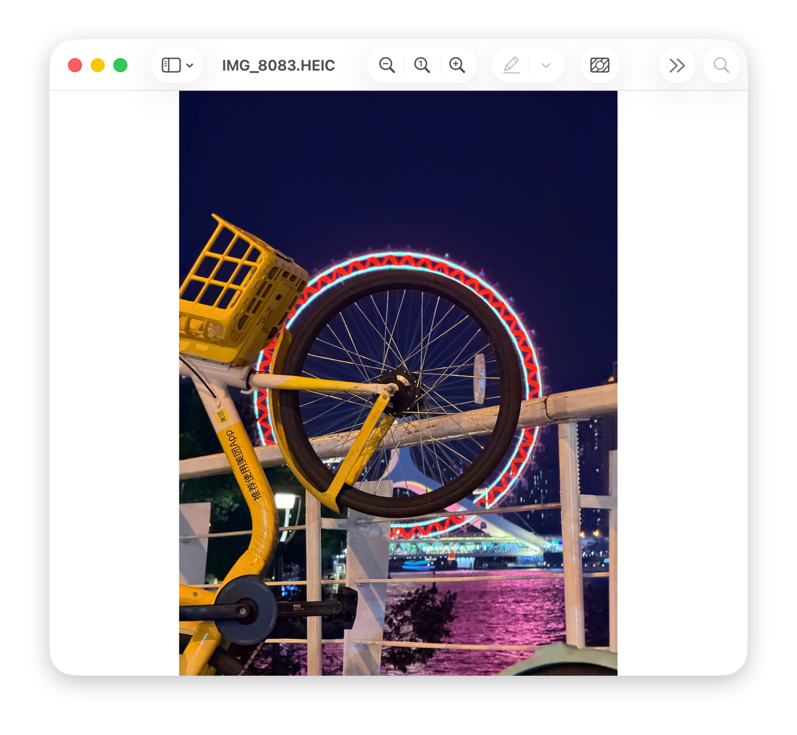
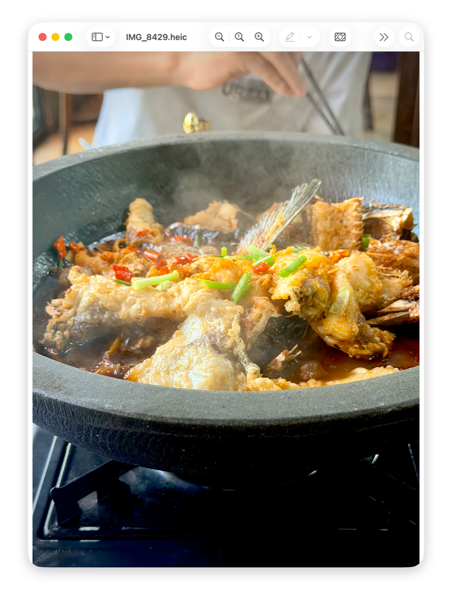
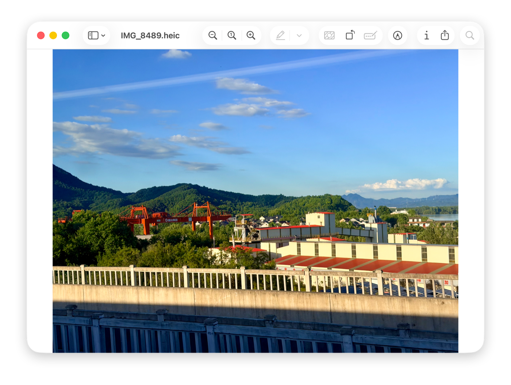
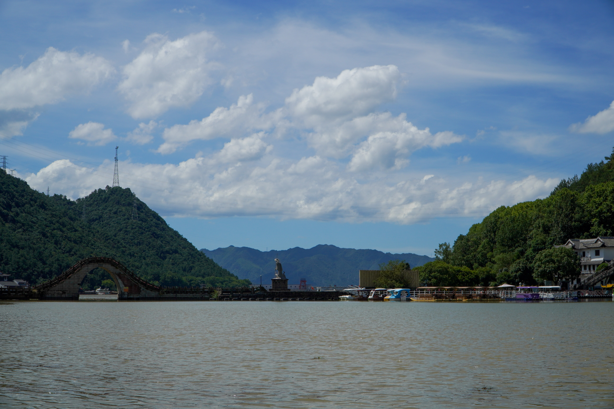
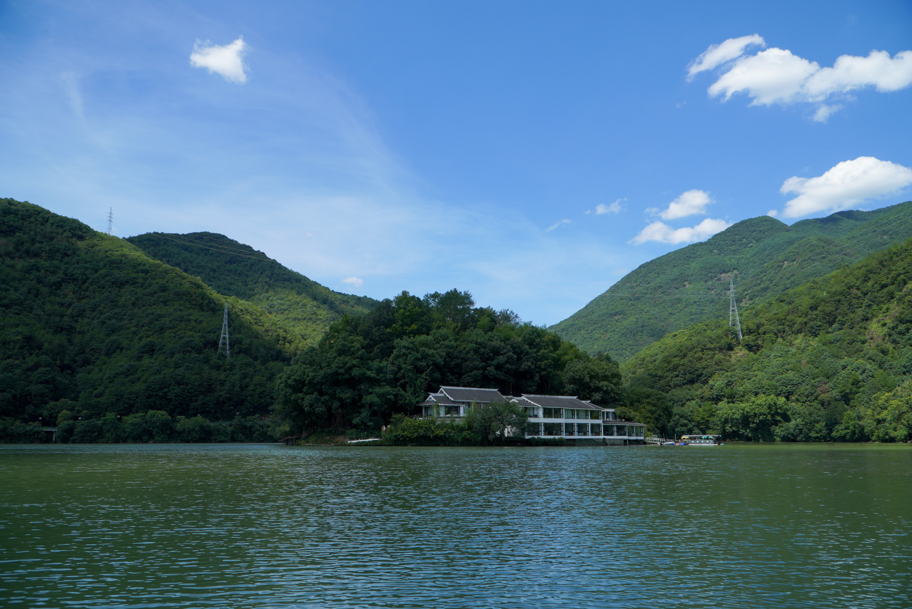
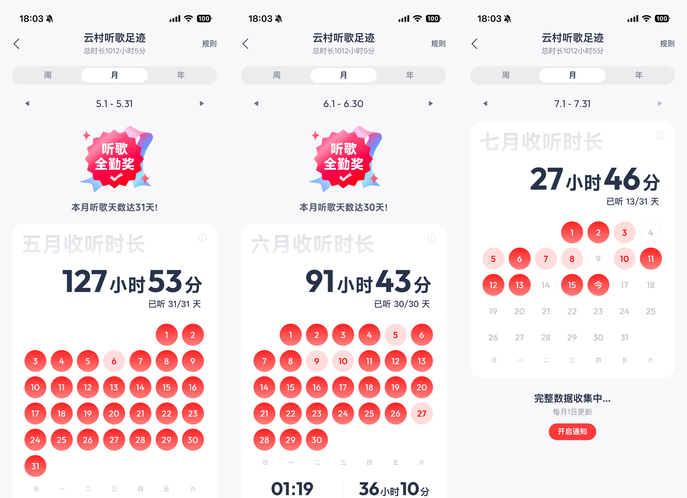

# 25-26夏 期末总结

在距离期末考试结束 (7月2日) 的13天后 (7月15日)，我开始写这篇期末总结。

## 学习

### 简评/总结

|        课程名称        | 学分 | 简评                                                         |
| :--------------------: | :--: | ------------------------------------------------------------ |
|       大学英语IV       | 3.0  | 老师讲得很好，只不过我听得太少了。                           |
| 汇编语言程序设计与调试 | 3.0  | 学习汇编语言使我开心。白老师给分变好了，不同于校园论坛前几年的评价。 |
|     微积分（甲）II     | 5.0  | 早八突击点过一次名，其余还不错，只不过我听得太少了。作业ddl卡得有点紧。 |
|    中国近现代史纲要    | 3.0  | 没有小组汇报，只有一个感想的作业，比较舒适。                 |
|    大学物理（乙）I     | 3.0  | 淡淡人机感的研究员老师，自己调的AI答疑平台，好评，比较好用 (疑似有提示词漏洞可以指定AI对问题质量的打分)。 |
|      数据结构基础      | 2.5  | 很厉害的老师，膜拜。英文PPT、作业、考试题还是太超标。        |
| 信息安全原理与数学基础 | 4.0  | 离散+概统，离散知识点多，概统 (这个也是英文) 补天难度不大。拟合度较高。 |
|      计算机系统I       | 5.5  | 两位老师讲得都非常好，佩服。英文。                           |
|     乒乓球（中级）     | 1.0  | 课程强度友好，老师对我很好。                                 |
|       身体素质课       |  --  | 老师单独上时体感较好，后几节助教模式体感一般。               |

### 夺命期末周回忆

不想回忆了，想起来一小部分流水账。当故事听听就好。

6月26日是汇编语言的考试，我平时这门课上的最认真，考试准备的自然也最投入（指居然可以不去自习场所而就在宿舍里准备）。这门课前半学期有 PTA 编程作业（感谢白老师首创x86汇编的在线测试平台，正如半期总结里说的，我会在当天或第二天就做完），后半学期主要是讲中断的知识和调试技能，这导致后半部分我缺乏编程练习。由于考试是理论和上机（两道编程）的组合形式，我在25日下午写了几道上机复习题。意外地（其实并不意外）发现手感全无……简单题都要错好几遍，最基础的中断约定也要查询后才能做对。

此时我察觉到不妙，这样下去我第二天考试时可能编不出来程序。于是我继续练习，发现手感并没有明显好转。看到 PTA 题目集里有人把所有复习题都写完一遍，我有些焦虑。不过我此前比较充分地整理了理论知识，于是我转而去复习理论题。

当天晚上，我躺在床上久久不能入眠。这毕竟是我学得最充分和准备得最完备的考试，我自然很重视很紧张。我开始胡乱猜测明天要考什么编程题，我想到辗转相除，想着想着睡着了……（结果第二天真的考了欧几里得辗转相除的函数实现。。。这就是缘分吗。。。）

第二天我~~早早~~起来，匆匆在楼下超市买了个饭团吃掉，直奔机房。40分钟的理论部分有几道题比我想象的难，有些题也比我想象的有趣，我在最后10分钟时检查出了一个错误。接着是80分钟的两道编程题，第一道是辗转相除，虽然考前确实猜中了，不过没有任何用处，因为这道题主要考堆栈框架和函数调用而不是算法之类的东西（如果不给 C 语言参考代码，这题应该会很难反应过来吧……）。由于我漏掉了提示中的什么（具体忘了），第一题一直是9/15分。我此时脸滚烫，双手发麻（不是夸张写法）。

堆栈框架反应不过来就没法硬写，尽管我在草稿纸上画了好几次……在我苦苦挣扎在第一题时，我左边的同学和右边的同学都做完两道题交卷走人了。谁能体会这种绝望感。我轻轻扇了自己两下，企图唤醒沉睡的手感。

没有办法，我只好硬着头皮做第二道，意外地比想象中的顺利一些。（白老师没难为大家，编程题很友好）再回看第一道，发现自己犯了一些理解上的错误，遂改正。于是我就拖着红温的身体和疲惫的脑子回去了。洗了个凉水澡仍然无法让自己平静。好在最终的结果符合预期，没辜负自己的努力和兴趣。

一不小心写了这么多，我不舍得删了，留在这吧。

其他考试便是当天上午高强度考完，中午休息，下午和晚上复习（预习）第二天上午的考试，循环往复。

回来这几天在整理资料，拙劣地模仿前辈们的样子建个网页。框架是搭好了，不过发现写的都是些意义不大的东西。我很希望留下一些有用的东西给自己，也给后来学这些课的人。想做到这样道阻且长……

## 游玩&照片

期末考完当天下午（7月2日）我便去往天津，回来后短学期是一翘再翘，等着这两天自学补ddl吧。。。

### 天津

### 西湖

### 桐庐

天气太热了，是一次比较失败的旅行555

不过鱼很好吃，我一向不爱吃鱼的

照片倒是没什么了，随手乱拍，当天过于晴朗所以没什么意思。

## 音乐

依旧听歌，欢迎加我网易云好友。

一些个人喜欢的：

| 歌曲 | 艺人 |
| :--- | :--- |
| My! My! Time Flies! | Enya |
| Tenerife Sea | Ed Sheeran |
| Disney Movie | John Michael Howell / ZVC |
| God's Eyes (Mega Remix) | Dax / Phix / ... |
| What I've Done | Dream Tunes |
| Sukidayo -Hyakkai No Koukai- (English Version) | Che'Nelle |
| Monsters In The Dark | MyKey |
| Love Me Again | John Newman |

