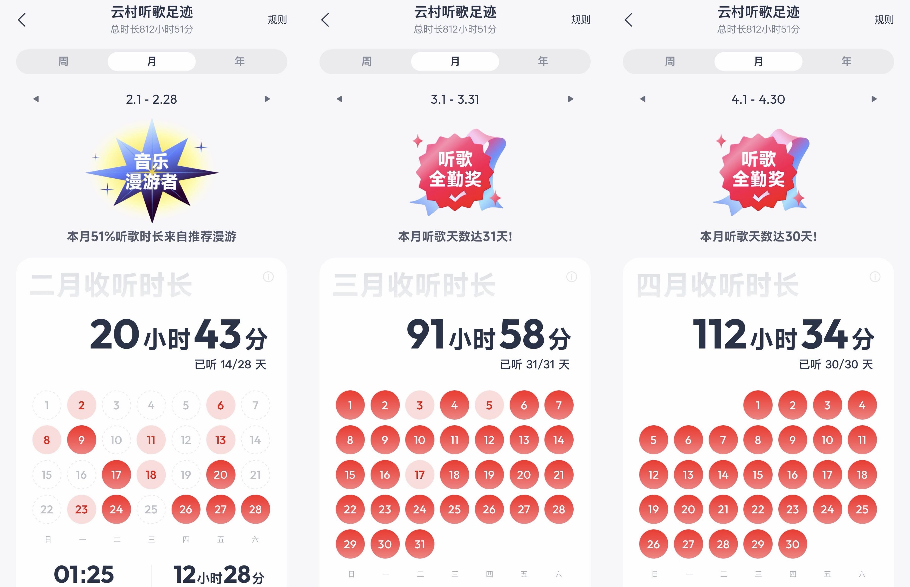
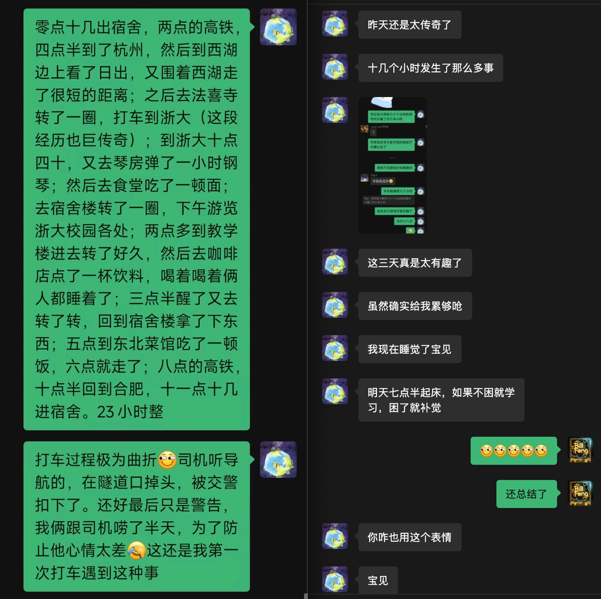
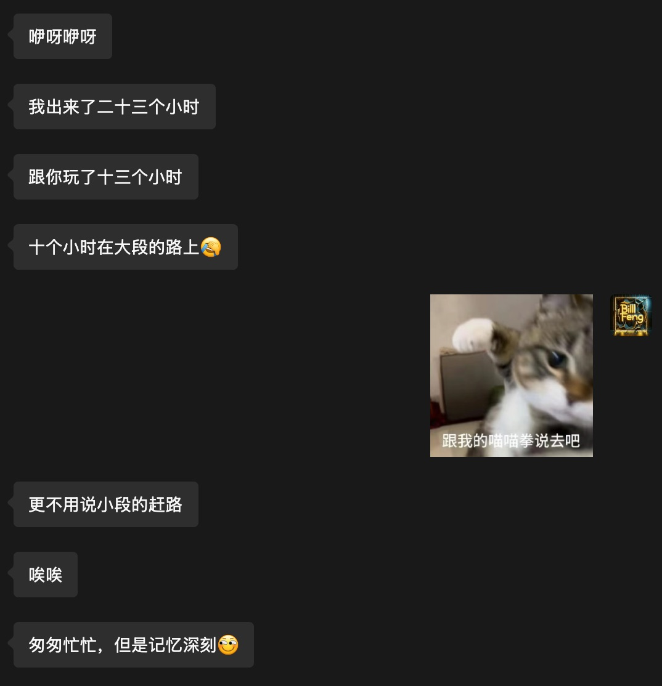
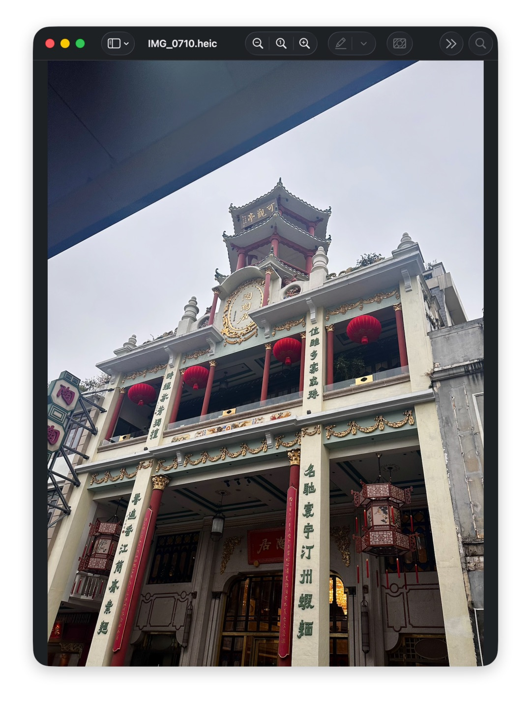
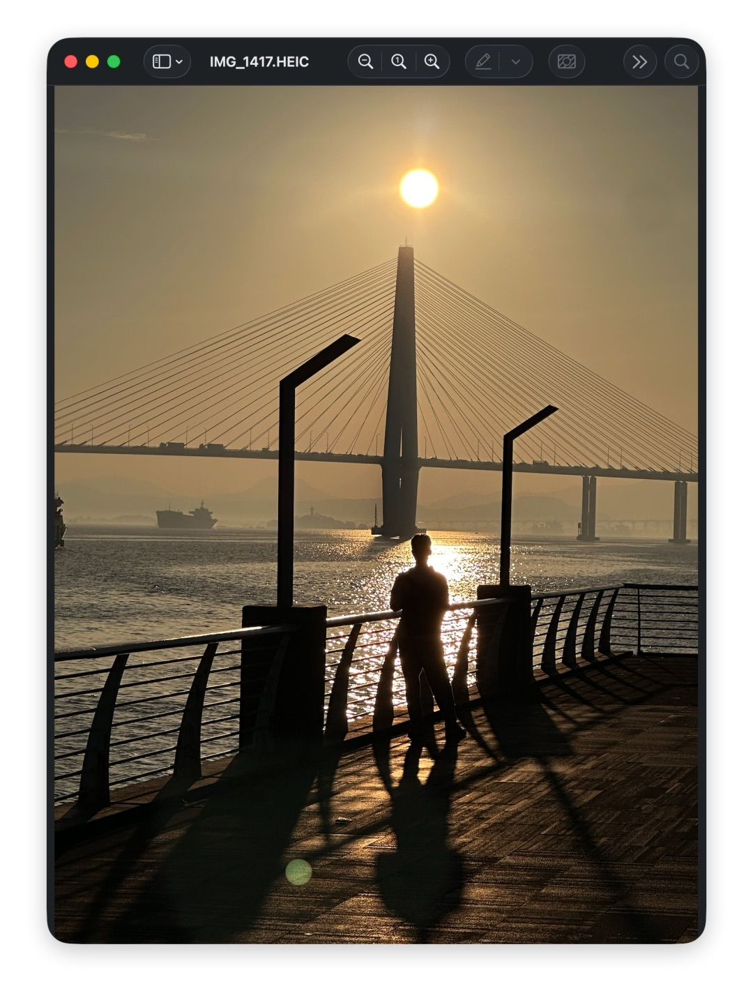
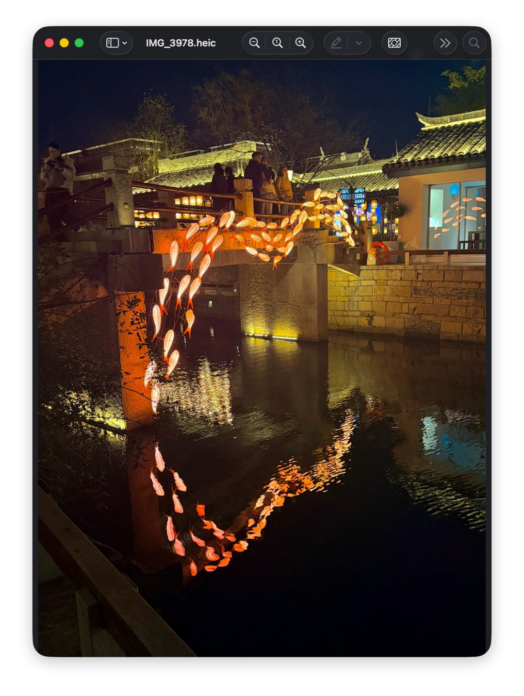
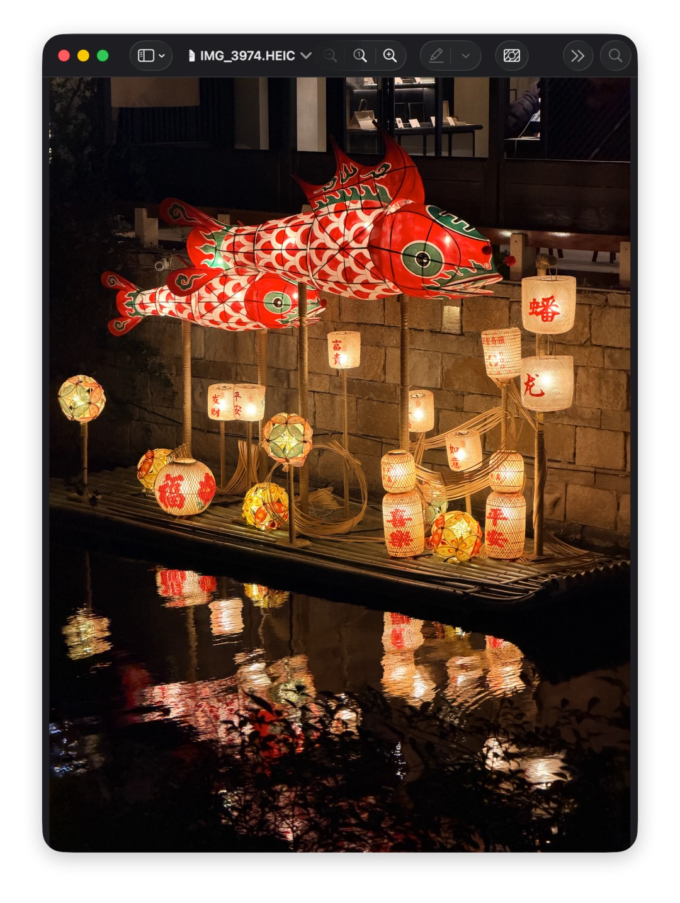
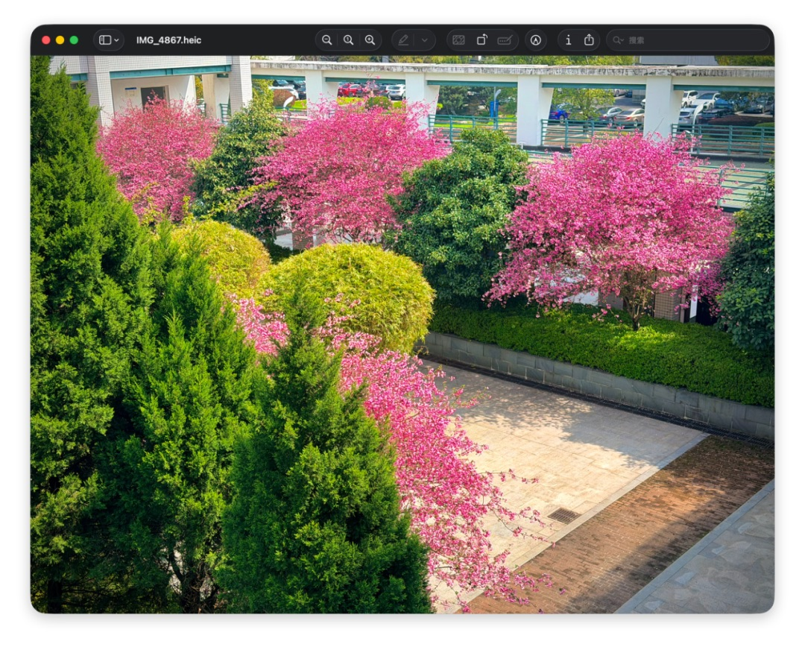

# 25-26春 半期总结

大一下半学期的忙碌程度和预想的如出一辙，较多的课程把我压得喘不过气。和高中的同学聊了聊，认为是高中玩太嗨了导致一种“现在比高中更累”的感觉。真是矛盾啊：高中时的过程性考试几乎不影响最终结果，当时却次次极其在意；大学的过程性测试计入平时分，现在反而显得有些漠然不在乎了...

大学不应该只有学习，但我还能做什么？0个社团和学生组织，屈指可数的活动，只剩有空时出去闲逛的“自娱自乐”，而这在后来看来大多是意义不大的（除非拍到满意的照片）。加上各科都一般般的期中成绩，有一种学习玩耍两头都抓不到的天昏地暗感。纵观舍友，有人积极参与到社团活动、生活丰富、且学业成绩很好；有人“放纵”玩王者，但学习时候极高效，纯纯理科天才。

我需要反思自己的生活节奏和方式。

好吧，我平时还是较乐观的，也没少玩，不会emo。上边几段纯属无聊的闲扯罢了。

以下想到哪里写到哪里。

## 丰富~~多彩~~的课程

你浙信安从大一下开始飞起来。多不多彩不清楚，但确实丰富。

| 课程名称 | 学分 |
| :--: | :---: |
| 大学英语IV | 3.0 |
| 汇编语言程序设计与调试 | 3.0 |
| 微积分（甲）II | 5.0 |
| 中国近现代史纲要 | 3.0 |
| 大学物理（乙）I | 3.0 |
| 数据结构基础 | 2.5 |
| 信息安全原理与数学基础 | 4.0 |
| 计算机系统I | 5.5 |
| 乒乓球（中级） | 1.0 |
| 身体素质课 | -- |

预置24学分，加上体育、大英和汇编后达到31学分，不敢再选了。事实证明不再选其他课是对的。

放下一般般般般的vjf期中成绩和超绝ddl拖延症带来的糟糕体验不讲，我还是发现自己对一些课程感兴趣，来信安不后悔！

### 我比较感兴趣的课程

#### 计算机系统

在这门课我体会到了完善的实验文档带来的便捷，听到了优秀的老师和TA(teacher assistant, 助教)们的课程和指导。或许信安融洽的氛围正是老带新的传承带来的。

高二时曾玩过一款名为《图灵完备》的游戏，内容是计算机系统I和II的简化版(现在疑似把系统III的内容也更新了)。没想到这成为了我的专业课。或许这就是缘分吧。

用硬件语言写电路是一种不错的体验，尽管没有图形操作来的直观，但胜在简洁、方便移植和维护。

#### 汇编语言

信安水群里大家都在调侃“学习有风险，抓紧去退课”的一门课(哈哈哈)。

据说白老师是文科出身，我在他身上可以感受到一种独特的文科气质。他讲课慢条斯理，给同学留出充足的思考时间。课间会放电影，有时会讲他的个人感悟。如：面对现在AI的冲击我们是否应该学习汇编等知识，老师给出的观点是“人活着为了自己的开心，搞这些东西让我快乐”。

尽管花了长时间写的程序有时没有预期结果，但我还是体会到了乐趣，这令我开心，也锻炼了我的调试能力。不夸张地说，我每周都盼望这节课的到来，也会在作业发布时迫不及待地写完。

白老师很尊重和欣赏学生，我开学时写了一篇关于在Mac上配置环境的小文章<https://bfyes.github.io/tools/xp/>，在私聊时他称之为“大作”，并说“解决了我的大问题，可不可以在主页上引用”一类的话，这完全出乎我的意料。

尽管8086的知识古老，不一定有直接的作用，但这些知识让我更加深入地了解高级编程语言、让我对以后可能接触的pwn或者软保有一个浅浅的认知。

#### 乒乓球

这学期是中级班，和舍友一节课。老师很和蔼，任务比较轻松。一次下大雨我和舍友没带伞，老师开车送我们回宿舍！很感动！

### 我不感兴趣的课程

> 注：老师讲得很好, 不感兴趣是我自己的问题！

1. 微积分：期中史低分，争取下半学期好好学学吧。。

2. 大雾：最近相对论学得一头雾水。我不明白信安学这门课有何意义。。

3. 离散：咕咕嘎嘎，我听不懂。。

## 音乐

可能是课太难(误)或者室友开黑太激情(没有责怪的意思)，写代码或者作业的时候总得听点什么，这两个月听歌时长明显上升。

发现了很多好听且优秀的作品。创建了个歌单，欢迎品鉴：<https://music.163.com/playlist?id=17936987568&uct2=U2FsdGVkX1+aAdyhRIF2M3H9UWCV6M0bVN/E/K7iSYU=>

欢迎留言推荐你喜欢的歌!

> 我最近喜欢的单曲：《Oceano》《blue》《Like My Father》《Eight Concert Etudes Op.40 : Pastoral》《红蜻蜓》《白兰鸽巡游记》《舒伯特小夜曲》等等。欧美和古典(不知道算不算古典?)偏多。

好想弄个电钢，和朋友小提琴合奏，但考虑到一是宿舍空间告急，二是很难确定自己是否能拿出时间练(五一假期试了一下，手感忘得差不多了)。遂告一段落。

## 游玩&照片

寒假去了合肥、广州、深圳、潮汕、上海、苏州等城市。

上半学期去了太子尖、西湖、西溪湿地等景点。骑了两次10km+。不多不少，总体比较丰富。

以下截图来自Yes的回忆，5.5游玩西湖：

放点照片。

好图全扔朋友圈了，发现手头居然没有能发的图片了。。

随便扔点，抽到啥发啥。

另外，这学期认识到了志同道合的课友们，身边的大佬很多，我需要多向他们学习。

下半学期继续努力！！
