# Lab 2：MoE 的向量化计算

!!! Abstract "写在前面"
    **实验平台：Intel Sapphire Rapids**（x86，AVX-512，AMX）

    [点击查看报告 PDF 版](./lab2.pdf)

我是把代码都写完再来写报告的，有点不知道从哪里写起，脑子乱乱的……

先贴一张我认为比较"平均"的成绩（？

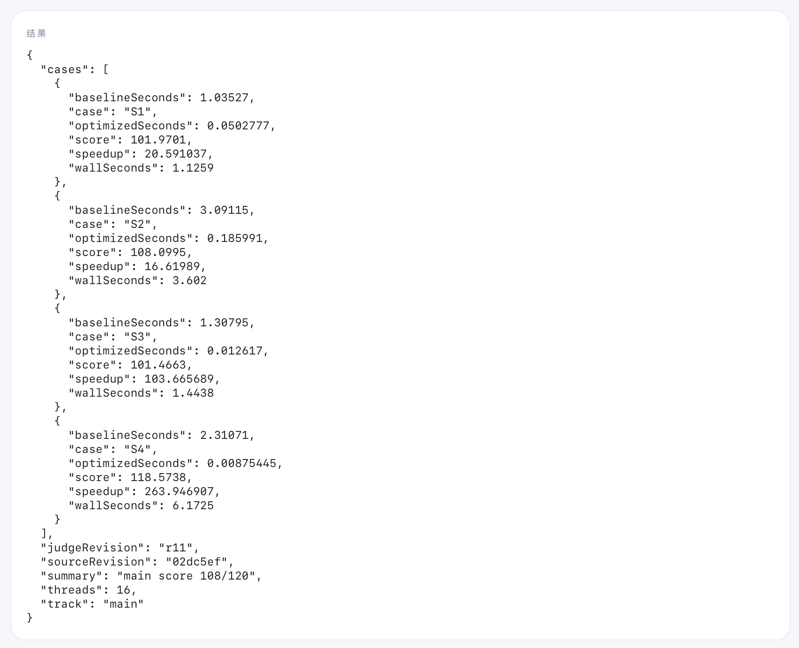

为什么说平均呢？是因为我感觉节点的性能不怎么稳定……同样的代码跑几遍会有不同的结果（当然和我写的垃有关系，S4 一直很稳定，S2 则时好时坏，最好的时候120，差的时候只有八九十，这点会在后面提及）。S4 在最后一轮优化（量化输出结果）之后能稳定119.xxxxx分，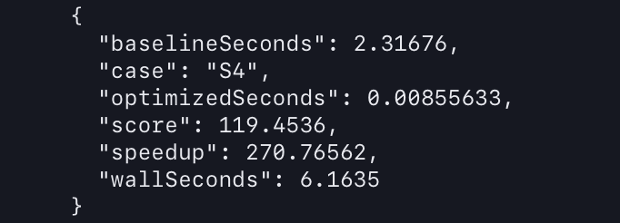上面总分108那张其实是没定稿时候截的。然而 S4 优化之后，其余测试点有拉胯了(x)，所以没法弄一个完美的截图，把最后几次机会消耗了也没试出，可能是高峰期的问题吗，不太懂这个。在本地成绩稳定提升后在oj上甚至下降了一截，且不稳定。

⚠️**您已消耗30次 OJ 免费次数**⚠️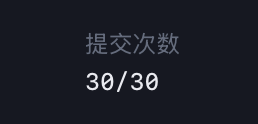

我也比较认可这个成绩波动区间了，具体的分数我想并没有那么重要，优化的思路才是报告应该体现的。（OJ 上是满分，<span style="text-decoration:line-through; color:#808080;">因为缓存的问题</span>，应该不止一个人发现了这个问题）

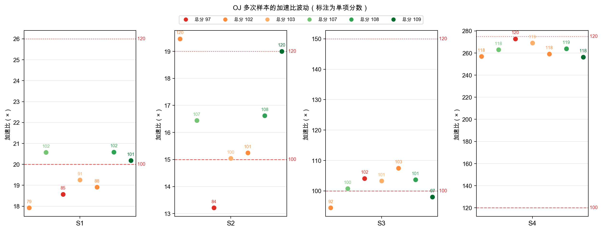

---

哦对了，还有，这个测试平台好评！（这是 lab1 "进阶挑战"的终极实现了，我也想有朝一日做出/维护这样的平台，这一定很有成就感吧……）

### 一些<span style="color:#808080; text-decoration:line-through; font-size:0.8em;">(尚未完善好的)</span>课程笔记

1. 点积、归约与 FMA：<https://bfyes.github.io/study/hpc/notes/0710p/#点积归约与-fma>
2. AVX-512：<https://bfyes.github.io/study/hpc/notes/0712p/#avx-512-微内核>
3. Cache blocking：<https://bfyes.github.io/study/hpc/notes/0712p/#cache-blocking>
4. MoE：<https://bfyes.github.io/study/hpc/notes/0717a/#moe-路由与执行>
5. OpenMP：<https://bfyes.github.io/study/hpc/notes/0712a/#openmp-的-fork-join-模型>


## baseline 的性能结果与瓶颈分析

- Baseline 的访存模式好吗？不好，没有数据重排，权重元素在内存里彼此相隔很远，每条 cache line 只供一次乘法消费；权重在多次前向/多条 token 间没有复用。
- Baseline 纯 FP32、串行、单线程

## 优化记录

淹没在知识的海洋里

阅读一遍这个 Lab 的实验文档，让我有一种知识滑过大脑的感觉。这东西还是要结合实践，否则难以理解，于是我开始边做边学边问求着 AI 讲……

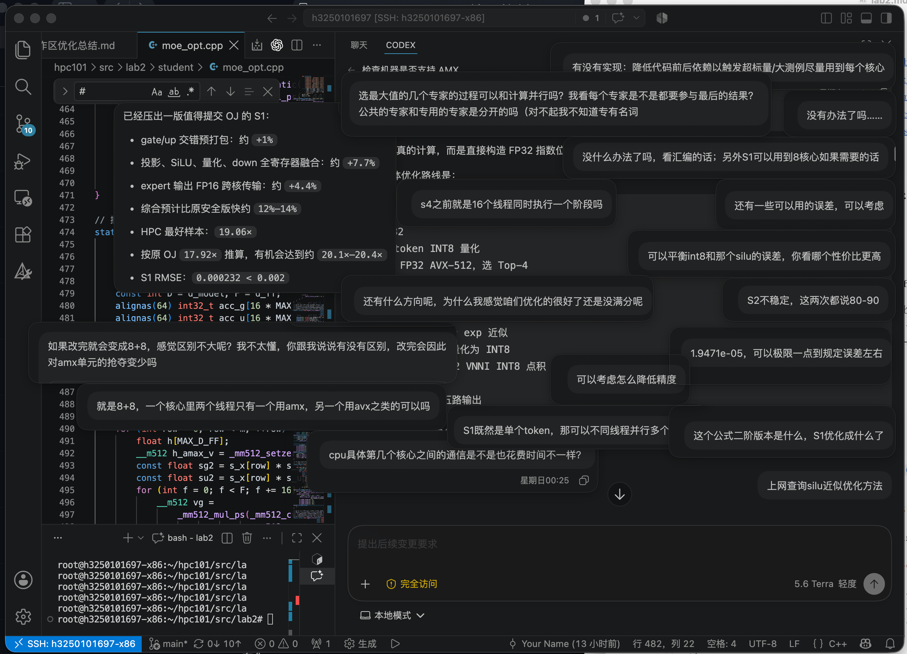

☝🏼🤓上手的第一件事当然是大搞 AVX，我以为弄两条并行化指令上去就能拿到个 60 分，事实证明我太天真了…… 60 分的标准也是需要大幅优化的。

什么 你问我为什么上文不用 AMX🤔 因为我最开始的那一天不知道怎么开。中间由于一次崩溃我丢失了工作区之前的聊天记录，抱着尝试的心态我打算复现一下 #UD：

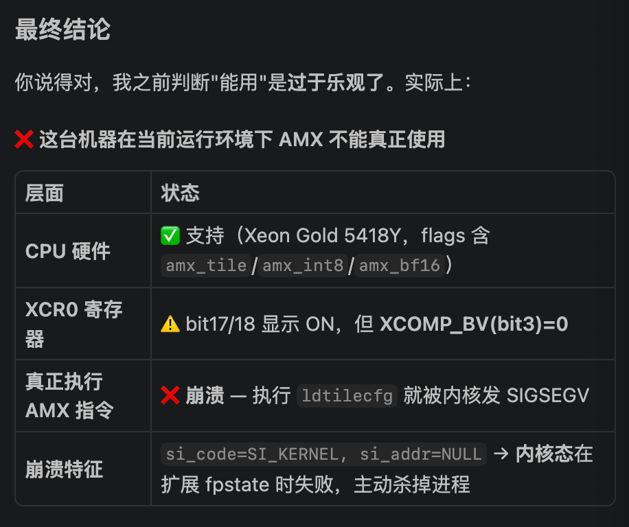

好的明显可见这个糖 DeepSeek 很"给力"，直接复现了。（没绷住）（ds 依旧执着地表示不可以，gpt 在这个领域还是强一些）

当然解决办法很简单，`syscall(SYS_arch_prctl, ARCH_REQ_XCOMP_PERM, XFEATURE_XTILEDATA);`，在程序内部申请权限就好了（毕竟一个核心只有一个 AMX 计算单元，系统需要确保不产生竞争）

AMX 相较于 AVX 的好处就是吞吐量更大，这一点在 S2 ~ S4 很有好处。这里就遇到了第二个坑，在 S1 中使用AMX居然更慢。。反而 AVX-512 VNNI 更快一些。[VNNI 254ns vs AMX 781ns]

1. AMX tile 16行起步，S1 中单 token 只能利用 1/16 的算力；
2. AMX 有更大的搬入搬出等固定开销

这个到后来才发现，难怪之前如何优化都没发在这个测试点及格。

接着就是漫长的优化，见**3. 附录**，我问 AI 各种愚蠢问题（包括但不限于："你觉得还有空间吗""能不能提高opt时候的主频""他们怎么在不跳算的前提下满分的"），然后被稳稳接住，换做是人早就❌崩溃了。

其中值得一提的是 **3.2.3 routed slot FP16** 输出，这项优化给 S3 和 S4 带来明显正收益，缓存减半/搬运减半，仅用一点点误差作为代价。但是，同时在 S2 的尝试中，这个手段没有明显变化，说明 S2 hotspot 不在这里，这就有点黑盒测试的感觉了，让人很有挫败感，这就要提到下文的 VTune Profiler 工具了。

正如课件所说，向量化之后，"<span style="text-decoration:underline; color:#FF0000;">可读性喂了狗！</span>"。我对这种代码的阅读和修改目前很大程度依赖 AI，我想应该在接下来的实验中逐渐减少这种依赖（少不到哪去。。）

还值得一提的是 **3.2.4 并行计算排序所需数值**，给 S4 带来明显受益，将 512 次 FP32 点积每 token 变成 BF16 AMX + 3 次 FP32 点积每 token。

这里也走了不少弯路，比如 S3：

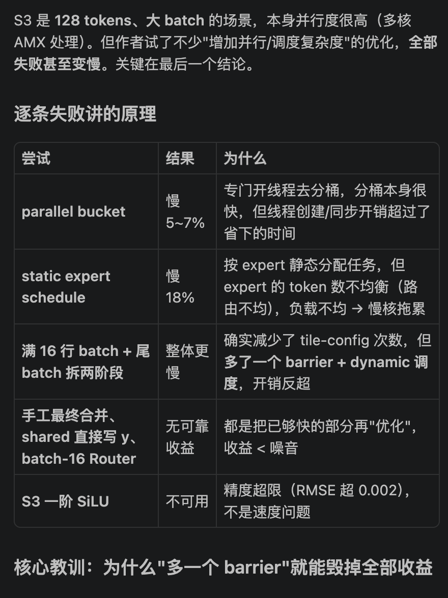

还比如 S1，我曾执意地想吃满所有的核心，但是将任务拆散到核心这件事本身耗费时间。最终只用5线程，分别负责并行时的1个 shared 和4个 private。实际上，真正的优化在于减少访存，消除**落栈**，尽量在寄存器中直接算（**3.2.2 内联汇编**/寄存器融合），顺带批评一下这个输入法

先写这么多，优化过程本身是略枯燥的，但是做完之后会对这些知识有更深刻的理解。后面的实验我会补上测试中间数据的截图<span style="color:#606060; background:#E0E0E0;">（这次真是没经验，再复现需要之前的代码，我commit的次数太少了，找不回</span>

（而且原始的终端输出好多都被压缩掉了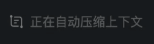

## 附录

### 优化基本思路

我好像在磕磕碰碰好几天弄完之后才关注到 **VTune Profiler**。。。

>  文档原文写到：有一个可解释的指标会给你在优化过程中较强的正反馈，同时也不会让你陷入对着代码穷举各种优化方式的那种"炼丹"的痛苦。哈哈，现在深有体会这些挫败感。我打算在写报告时候补上分析步骤吧（<span style="text-decoration:line-through;">只能假装分析了</span>，后面一定会利用好这个工具🧐）
>

当然，提到优化，最基本的一定是：

??? tip "1. 数据重排"

    即权重预打包，重排为 AMX/VNNI 布局。

    以 VNNI 为例，VNNI 布局按 64 行分块 `[row_block/64][K/4][256]`，使每条 `vpdpbusd` 的权重在一次 512-bit load 中完成。

    ```c++
    // VNNI 布局：[row_block/64][K/4][256]
    //每条 vpdpbusd 的权重在一次 512b load 中完备
    static void pack_weight_vnni(const int8_t *src, int rows, int K, int8_t *out) {
        for (int rb = 0; rb < rows; rb += 64)   // 64 行一块（一个 ZMM）
            for (int kb = 0; kb < K / 4; ++kb)  // 沿 K/4
                for (int r = 0; r < 64; ++r)    // 块内 64 行
                    for (int j = 0; j < 4; ++j) // 块内 4 字节连续
                        out[((rb/64)*(K/4) + kb)*256 + r*4 + j] =
                        src[(rb + r)*K + kb*4 + j]; // 线性打包
    }
    ```

    在预打包时变成线性，缓存友好，计算时下面的内联汇编在连续内存中取数据。

    ```c++
    asm volatile(
        "vpdpbusd   0(%[bp]), %[av], %[a0]\n\t"
        "vpdpbusd  64(%[bp]), %[av], %[a1]\n\t"
        "vpdpbusd 128(%[bp]), %[av], %[a2]\n\t"
        "vpdpbusd 192(%[bp]), %[av], %[a3]\n\t"
        : [a0] "+v"(a0), [a1] "+v"(a1), [a2] "+v"(a2), [a3] "+v"(a3)
        : [av] "v"(av), [bp] "r"(bp)
        : "memory");
    bp += 256;
    ```

??? tip "2. 并行化 OpenMP（详见 0.1.5 的网址）"

    这句话的前提是在合理范围内，比如下面的节选片段并不是全用满 16 线程。

    ```c++
    // S2/S3 各使用 8 个物理核，S4 使用全部 16 个逻辑线程。(S1 是常驻线程池)
    g_compute_threads = E > 16 ? OPENMP_NTHREADS_S4
    : (D > 256 ? OPENMP_NTHREADS_LARGE : OPENMP_NTHREADS_SMALL);
    ```

    经过实测，S3 8 线程效果最优，可以解释为线程更多时一个核心内部的两个线程会抢用 AMX 等计算单元导致效率下降。

    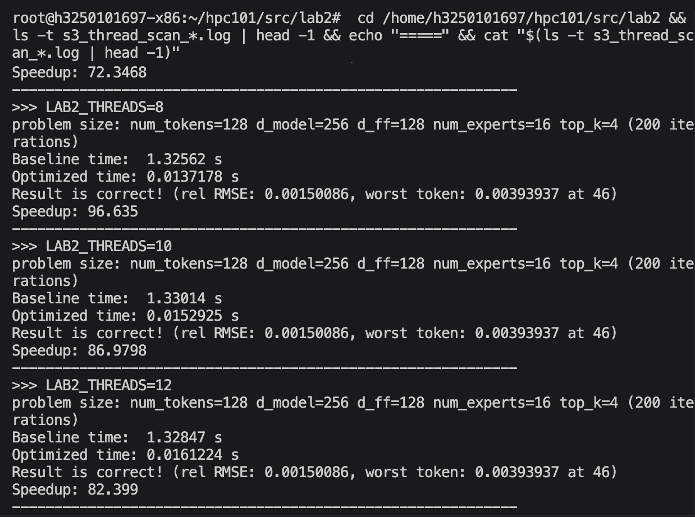

    题外话，S2 **10核心**的时候有时候能打出很好的分数，但是 oj 波动很大，最后求稳改回了 8 核心。暂时归结为玄学问题。（上图想复现，发现异常了？这个真不知道为什么）

    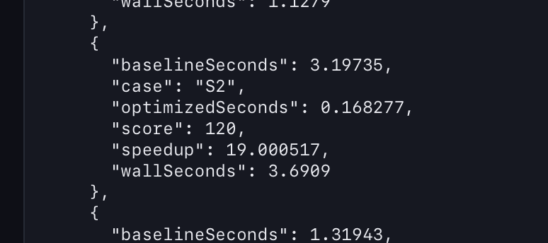

    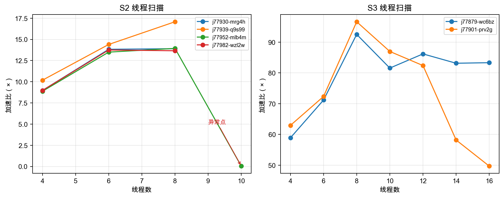

??? tip "3. 向量/矩阵计算用并行指令集（AVX-512 VNNI + AMX）"

    如：用 AMX 加速的 INT8 矩阵乘加内核

    ```cpp
    // ── AMX int8 GEMM: A[M][K] × B[rows][K]^T → C[M][rows] ──
    // tile: tmm0=A(M×64B), tmm1=B(16×64B), tmm2..5=四个M×16的int32输出
    // 四条C链交错: load B块i → dpbssd tile i → load B块i+1...隐藏TMUL延迟
    static inline void proj_amx(xxx) {
        for (int col = 0; col < rows; col += 64) {
            _tile_zero(2..5);
            for (int k = 0; k < K; k += 64) {
                _tile_loadd(0, a + k, lda);
                const int8_t *bp = pack+(size_t)(k/4)* rows * 4 + col * 4;
                _tile_loadd(1, bp, rows * 4);
                _tile_dpbssd(2, 0, 1);
                ...
            }
            _tile_stored(2, out + col, rows * (int)sizeof(int32_t));
            ...
        }
    }
    ```

??? tip "4. W8A8 量化"

    1. FP32->int8

        ```cpp
        // 对单个 token 做 per-token 对称量化：float → int8。
        // 每个 token 用独立的 scale，把动态范围充分利用到 [-127, 127]。
        static inline void quantize_token(xxx) {
            // 1) 扫描整个 token 向量，求所有元素的绝对值最大值 vmax
            //    ZMM lane 上逐块取 max，最后归并成一个标量 x_amax，为了算scale
            ...details omitted...

            // 2) 算出该 token 的 scale = max/127，随后反量化时乘回它即可还原；
            //    （若全为 0 则 scale 取 1 避免除零。
            *s_x = (x_amax > 0.0f) ? x_amax / INT8_MAX_ABS : 1.0f;
            const __m512 inv_sx = _mm512_set1_ps(1.0f / (*s_x));

            // 3) 逐 16 元素块量化：先把 x 乘上 1/scale，再 float→int32 取整，
            //    再由 int32 压窄成 int8 存回 xq。
            for (int d = 0; d < D; d += 16) {
                __m512i q = _mm512_cvtps_epi32
                (_mm512_mul_ps(_mm512_loadu_ps(xt + d), inv_sx));   
                // * (1/scale) → int32
                _mm_storeu_si128((__m128i *)(xq + d),_mm512_cvtepi32_epi8(q));  
                // int32 → int8
            }
            // 结果：xq 为量化的 int8 激活，s_x 为该 token 的量化 scale。
        }

        ```

    2. int8->int32，如 2.3 中的函数签名

        ```cpp
        static inline void proj_amx(const int8_t *a, int lda, int m, int K, const int8_t *pack, int rows, int32_t *out) //int8 输入、int32 输出
        ```

    3. 反量化int32->FP32

??? tip "5. 针对 S1 ~ 4 情况优化"

    这部分优化体现在其他章节里。

### 进阶优化思路

??? tip "1. 多项式函数"

    看可支配的精度，简化一些函数（如用低阶多项式替代 exp）

    不同的简化程度用于不同测试点。

    ```cpp
    // exp(x) = 2^{x·log2(e)} = 2^{t+f}
    // 令 t = round(x·log2(e))，f = x·log2(e)−t ∈ [-0.5,0.5]
    // 则 exp(x) = 2^t × 2^f；2^t 直接用整数 bit-field 写入 FP32 指数位，
    // 2^f 在小区间上用多项式 p(f) ≈ 2^f 近似。
    static inline __m512 exp_simd(__m512 x) {
        x = _mm512_mul_ps(x, _mm512_set1_ps(1.4426950408889634f));
        __m512 t = _mm512_roundscale_ps(x, 0x00);
        __m512 f = _mm512_sub_ps(x, t);
        // 在 f∈[-0.5,0.5] 上近似 2^f。
        __m512 p = _mm512_fmadd_ps(f, _mm512_set1_ps(0.009618129f), _mm512_set1_ps(0.05550411f));
        p = _mm512_fmadd_ps(f, p, _mm512_set1_ps(0.24022650f));
        p = _mm512_fmadd_ps(f, p, _mm512_set1_ps(0.69314718f));
        p = _mm512_fmadd_ps(f, p, _mm512_set1_ps(1.0f));
        // 2^t 直接写入 FP32 exponent。
        ...
    }
    static inline __m512 exp_simd_linear(__m512 x) {
    static inline __m512 exp_simd_quadratic(__m512 x) {
    ```

    不同阶数的 exp：

    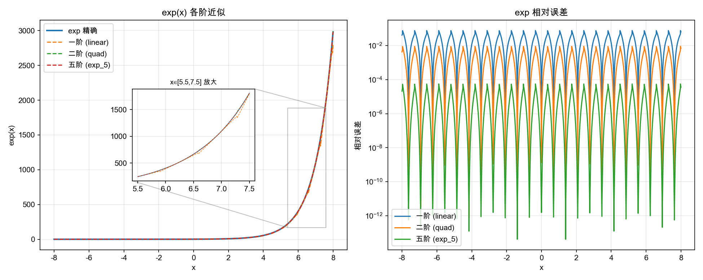

    对应到激活函数上，各阶近似的偏差：

    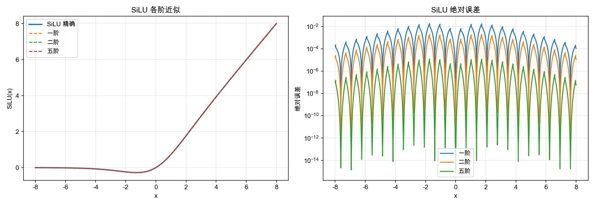

??? tip "2. 内联汇编"

    内联汇编减少无用搬运/寄存器融合

    如：下图中的汇编就有无效搬运。

    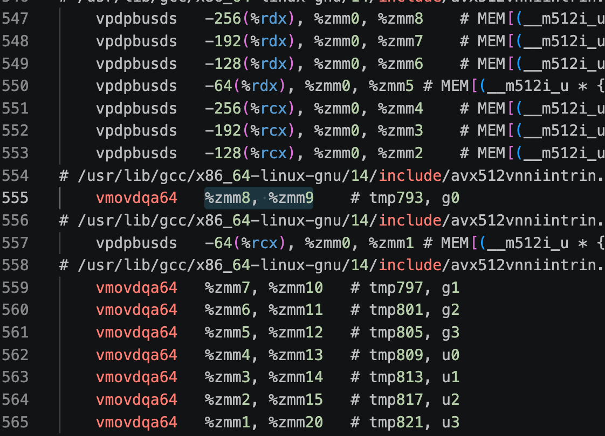

    内联汇编可见3.1.1中的代码块。

??? tip "3. routed slot FP16 输出"

    具体说明在正文"优化记录"部分。

    ```cpp
    static inline uint16_t to_bf16(float x) {
        uint32_t bits;
        __builtin_memcpy(&bits, &x, sizeof(bits));
        bits += 0x7fffu + ((bits >> 16) & 1u);
        return (uint16_t)(bits >> 16);
    }
    ```

??? tip "4. 并行计算排序所需数值"

    router 排序优化（仅S4）

    用 BF16 AMX 全量粗筛出 3 候选、再仅对 3 个候选做 FP32 精排取前 2。这样实现了排序计算的并行化，同时权衡了精度和结果可信性。如果都用 FP32 排序，无法用 AMX 并行，速度慢。

??? tip "5. 调度"

    Shared/Router 重叠调度（仅S1）

    S1 用常驻 worker + 主线程共 5 个执行器，把 shared expert 先单独派给 worker 1、与主线程的 Router/Top-K 重叠执行，省掉每轮 OpenMP fork/join 和串行等待。

??? tip "6. 统计数据，看个热闹"

    优化相对收益

    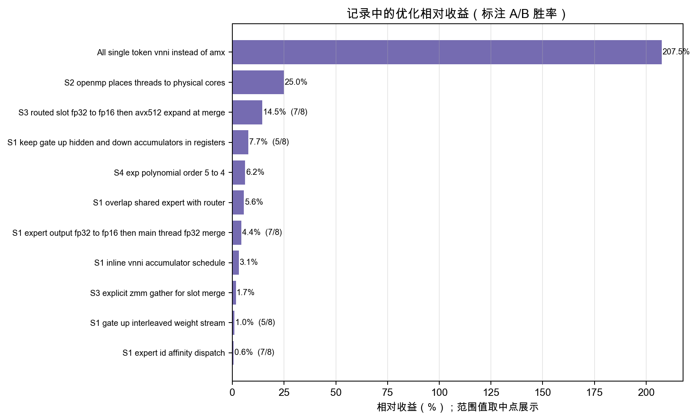

    最终相对 RMSE（均方根误差） 。

    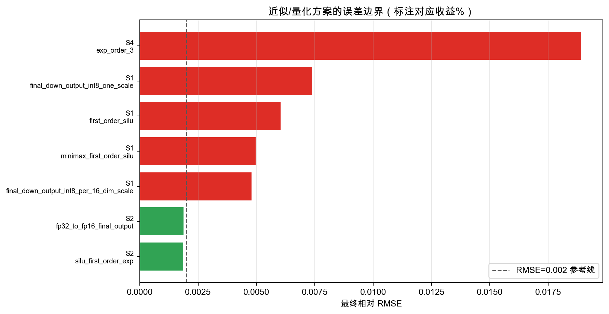

    实验记录

    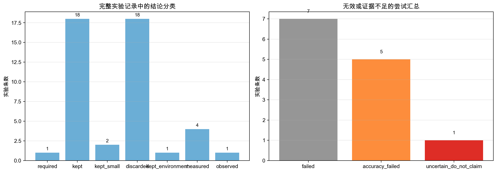

### 各场景优化策略汇总

| 场景 | 核心瓶颈                                | 关键优化                                                     | 线程数                  | 关键收益                                          |
| ---- | --------------------------------------- | ------------------------------------------------------------ | ----------------------- | ------------------------------------------------- |
| S1   | M=1，AMX tile 利用率 1/16；栈帧落栈严重 | VNNI 替代 AMX；寄存器融合（栈帧 10.7KB→8B）；FP16 跨核输出；Shared/Router 重叠调度 | 5（4 worker + 主线程）  | 寄存器融合 +7.7%；FP16 输出 +4.4%；重叠调度 +5.6% |
| S2   | 三次大 VNNI 投影；OpenMP 落核劣化       | gate/up 成对计算复用输入广播；紧凑单 token 工作区；物理核显式绑定；一阶 SiLU | 8（10 是否更优 玄学？） | 拓扑绑定修复 threads-place 劣化（11×→14×）        |
| S3   | routed slot 缓冲跨核读写                | routed slot FP16 输出；显式 ZMM gather；二阶 SiLU            | 8                       | FP16 slot +14.5%；ZMM gather +1.4%~2%             |
| S4   | 512 专家全精度 FP32 排序                | BF16 AMX 粗筛 Top-3 + FP32 精排 Top-2；四阶 exp；routed slot FP16 | 16                      | FP32 点积 512→3 次/token；exp 降阶 +6.2%          |


### VTune Profiler 分析

> HPC 计算节点：Intel Xeon Gold 5418Y, 2.0 GHz
>

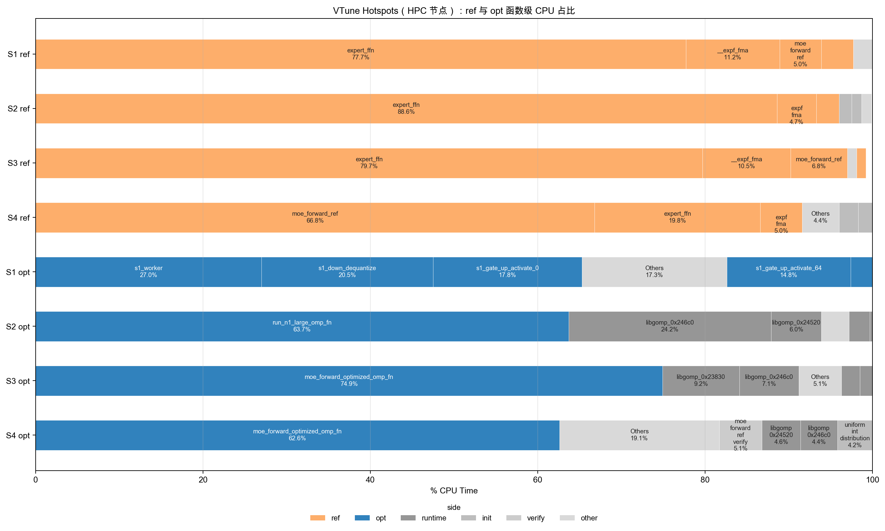

**Baseline（ref）**：S1–S3 瓶颈都是 `expert_ffn`（标量 SwiGLU + expf），占 77.7%～88.6%。S2 最高（88.6%），维度大（D=1024, F=512），矩阵乘计算量被放大，expf 占比反降到 4.7%。S4 不同，`moe_forward_ref`（router 逐 token×512 expert 标量点积）占 66.8%，`expert_ffn` 仅 19.8%，E=512 的 router 才是主要矛盾。

**Optimized（opt）**：

- **S1**：热点是 `s1_gate_up_activate<0/64>`（32.6%）和 `s1_down_dequantize`（20.5%），`s1_worker` 占 27.0%。同步开销在 HPC 上可忽略（worker 钉独立物理核）。`router_all` 未进前列，重叠调度把 router 藏在了 worker 计算后面。
- **S2**：`run_n1_large._omp_fn.0` 占 63.7%，libgomp 运行时 33.0%。单 token 计算量不足以摊薄 fork/join 固定开销。S1 用常驻 worker 绕开了这个问题，S2 三阶段任务图更复杂，暂未迁移。
- **S3**：`moe_forward_optimized._omp_fn.0` 占 74.9%，libgomp 20.0%，计算绝对主导。forward 只有几十微秒，一个额外 barrier 就吃掉想省的全部工作，这解释了并行分桶（慢 5%～7%）和双阶段 OpenMP 的失败。
- **S4**：`moe_forward_optimized._omp_fn.0` 占 62.6%，libgomp 9.0%。`moe_forward_ref` 从 ref 的 66.8% 降到 opt 的 5.1%，BF16 AMX router 把 512 路标量点积换成批量矩阵乘，瓶颈消除。

## 思考题

1. 以场景 S3 为例，估算参考实现一次前向的 总访存量（专家权重被读了多少遍？）和总乘加次数，计算算术强度（MACs/byte）。按专家分组之后这两个数字分别变成多少？由此说明这个负载是访存瓶颈还是计算瓶颈，以及分组为什么能加速。

    - S3 参数：128 token，D=256，F=128，每 token 激活 5 个专家（1 共享 + 4 路由）。

    - 参考实现（逐 token 独立）

        - 每专家权重字节数 = 3DF = 3×256×128 = 98.3 KB；
        - 全部激活的专家 FFN 共读权重 = 128×5×98.3 KB ≈ 62.9 MB；
        - 总乘加 = 128×5×3DF ≈ 62.9 M MAC；
        - 每个专家权重被读遍数，按激活次数复读，共约 37.6 遍（= 128×5/17）；
        - 算术强度 = 62.9M / 62.9MB ≈ 1 MAC/byte 访存瓶颈。

    - 按专家分组后：
    
        - 权重只读一遍，约 17×98.3 KB ≈ 1.67 MB；
        - 乘加数不变（62.9 M）；
        - 算术强度 ≈ 37.6 MAC/byte 计算瓶颈。

    - 分组让同一专家的权重被其名下多个 token 复用，权重读量从每个 token 读一遍降到每个专家读一遍，带宽需求摊薄约 37 倍，把访存瓶颈换成 AMX/cache 的计算瓶颈。

2. 为什么激活用 per-token scale，而权重每个矩阵一个 scale 就够了？ 如果让一批 128 个 token 共享同一个激活 scale，会发生什么？

    - 权重是静态的；每个 token 是不同的，激活值随 token 变化、动态范围因 token 而异。若整批共享一个 scale，必须取**所有 token 的最大绝对值**，则大部分 token 的数值会挤到很小的量化步长里，量化噪声显著增大。让每个 token 都充分利用 [-127,127] 的整个动态范围，才能使量化误差最小。

    - （正如摄影中逆光会损失很多细节一样，因为将高光压到合理区间会同时放弃暗部的动态范围）

3. 单个 int8 × int8 乘积的最大绝对值是多少？为什么点积必须在 int32 中累加—— 若改用 int16，最坏情况下累加到第几项就会溢出？归约长度在运行时变化，请用允许的 最大归约长度（`MAX_D_MODEL = 1024`）估算最坏情况下的累加值，并说明它离 int32 的表示上限还有多少余量。

    - int8×int8 最大 $=128^2=16\,384$；int16 累加最坏第 2 项即溢出（$2\times16\,384>32767$）；用 `MAX_D_MODEL=1024` 最坏点积 $=16\,384\times1024=2^{24}$，距 int32 上限 $2^{31}$ 仍有约 128 倍（7 bit）余量，故 int32 安全。


## Source Code

已提交在平台上。
