# lab3：GDN Prefill 前向优化

!!! Abstract "写在前面"

    **实验平台：H800 PCIe MIG 10gb，TileLang**

    [点击查看报告 PDF 版](./lab3.pdf)

一些不错的相关知识。

【NeurIPS 2025最佳论文——千问门控注意力 | 三分钟动画讲解】 <https://www.bilibili.com/video/BV1Np2XB3EXz>

【【中文配音】DeltaNet 超越Softmax：注意力机制的未来】 <https://www.bilibili.com/video/BV1pM3b6SEXC>

**实验目标**：实现并优化 Gated DeltaNet 的分块前向填充。在保证输出和最终状态正确的前提下，优化 【chunk 内矩阵计算、数据搬运、warp 协作以及重复调用】的开销。😭蒙蒙的😭zjgg手下留情

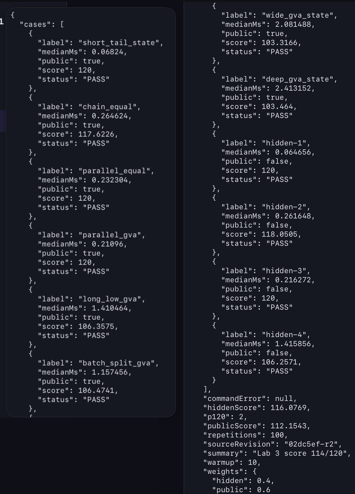


## 算法与数据依赖

算法块长固定为 64，头维度为 128。框架在计时区外计算分块门控前缀和 `g_cumsum` 以及 KKT 三角求解结果 `A`。要实现的程序接收 `Q/K/V/g_cumsum/beta/A` 和可选的初始状态。

??? tip "1. chunk 间状态依赖"

    对第 `c` 个 chunk，状态依赖限制在 chunk 之间：

    ```text
    U'     = K @ S_c
    W'     = beta * (V - exp(g) * U')
    V_new  = A @ W'
    S_{c+1}= exp(g_last) * S_c + (K * exp(g_last-g))^T @ V_new
    O      = scale * (exp(g) * Q @ S_c + scores @ V_new)

    其中 `scores` 是带因果掩码和门控衰减的 `QK^T`。
    ```

chunk 之间不能完全并行，但同一 chunk 内的 GEMM、门控计算和数据搬运可以通过多个 warp 组重叠。

GVA 情况下，多个 V 头共享一个 Q/K 头，代码通过 `bhg = bh // (Hv/Hq)` 完成映射。

状态按 `(batch, V 头, DK, DV 分块)` 切分。一个 CTA 独占一个状态切片，跨 CTA 不需要同步。DV 分块大小因此可以按用例调整。

## 基线 (这里指我的 V1 版本)，瓶颈 & 优化总览

最初实现使用标量循环完成主要矩阵运算，既没有使用 Tensor Core，也存在 TileLang 循环表达不完整导致的编译问题。改成 GEMM 后得到 v1，但长序列仍明显落后于参考实现。

初始 v1 的公开用例结果如下，时间为核心前向的中位数，单位为 ms。

| 用例 | 形状 `(B,T,Hq,Hv)` | v1 时间 | 估算分数 | 说明 |
|---|---:|---:|---:|---|
| short_tail_state | (1,1025,2,8) | 0.291 | 约 105 | 短序列，有初始状态 |
| chain_equal | (1,8192,4,4) | 1.100 | 约 52 | 中等序列，Q/K 与 V 头数相等 |
| parallel_equal | (1,2048,16,16) | 0.891 | 约 59 | 短序列多头，无 GVA |
| parallel_gva | (1,2048,4,16) | 0.895 | 约 58 | 短序列 GVA，V 头多于 Q/K |
| long_low_gva | (1,32768,2,8) | 8.545 | 约 44 | 超长序列 GVA，最难优化 |
| batch_split_gva | (4,8192,2,8) | 5.641 | 约 47 | 多批次 GVA |
| wide_gva_state | (1,8192,16,64) | 11.693 | 约 44 | 宽头 GVA，有初始状态 |
| deep_gva_state | (1,16384,8,32) | 11.677 | 约 46 | 深头 GVA，有初始状态 |


??? tip "2. Nsight 采集命令"

    使用的工具是 Nsight Systems 和 Nsight Compute。前者观察 kernel 时间线和 chunk 串行度，后者分析停顿、占用率、Tensor Core 利用率和访存流量。采集命令如下（在集群上以非交互方式运行）：

    ```bash
    # Nsight Systems: 采集 kernel 时间线和 chunk 串行度
    nsys profile --clock-control none \
      --capture-range=cudaProfilerApi --capture-range-end=stop \
      -o long_low_gva_nsys \
      /opt/lab3-venv/bin/python run.py --case long_low_gva --output-format csv

    # Nsight Compute: 采集停顿、占用率、Tensor Core 等细粒度指标
    ncu --clock-control none --set full \
      --kernel-name regex:kernel_kernel \
      --launch-skip 3 --launch-count 2 \
      --csv -o long_low_gva_ncu \
      /opt/lab3-venv/bin/python run.py --case long_low_gva --output-format csv
    ```

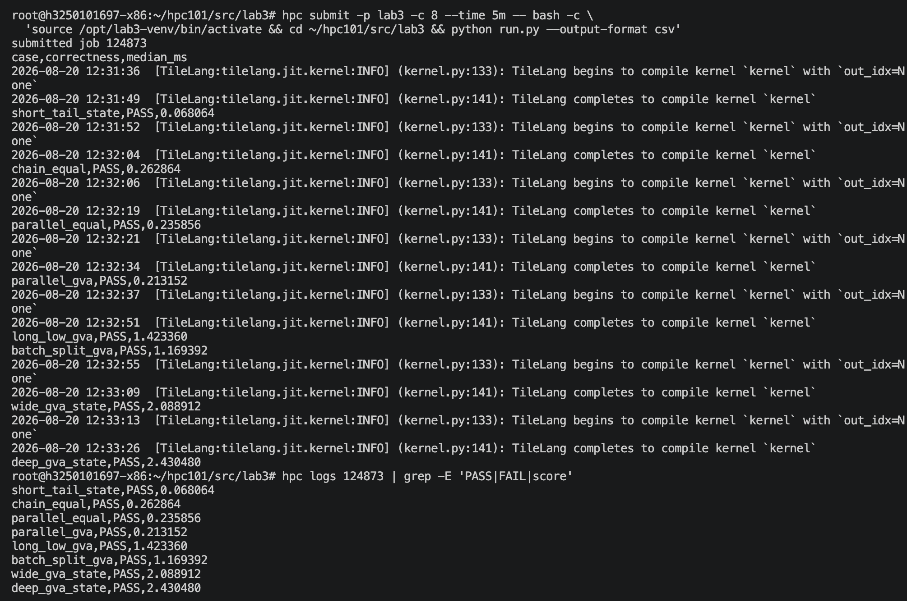

`--clock-control none` 是必须的，因为 MIG 环境无法锁定频率。`--launch-skip 3` 跳过前 3 次预热调用，`--launch-count 2` 只采样 2 次以减少采集时间。

Nsight Systems 显示长序列 kernel 内部有 512 个串行 chunk，每个 chunk 约 16 us。纯浮点运算量不是主要矛盾。瓶颈来自逐元素全局加载、共享内存往返、同步和多个短 GEMM 的固定延迟。后续 Nsight Compute 分析确认，主要停顿是 `long_scoreboard`（访存等待）。共享内存和寄存器压力使每个 SM 通常只能驻留一个 CTA。

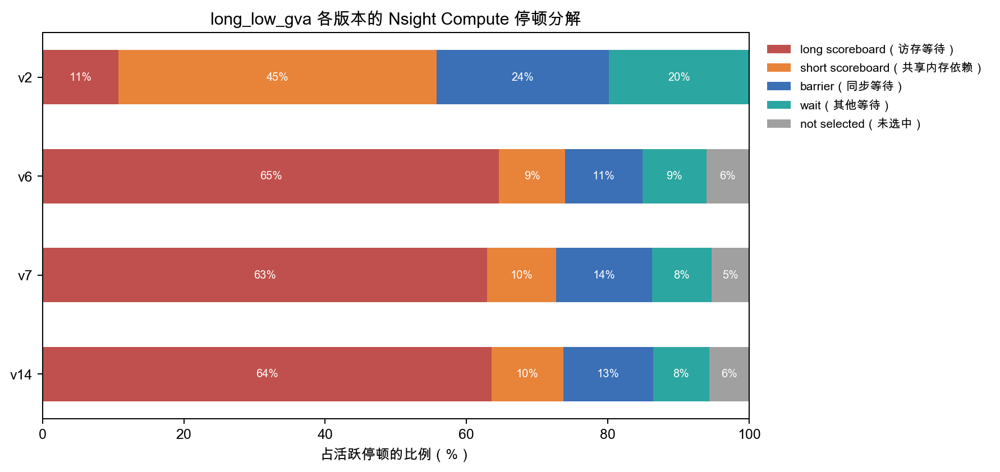

long_low_gva 的停顿分解。`long_scoreboard` 占比最高，说明瓶颈主要是访存等待和并发度不足，算术吞吐量尚未饱和。后续没有继续盲目增加 GEMM 或同步，依据就在这里。

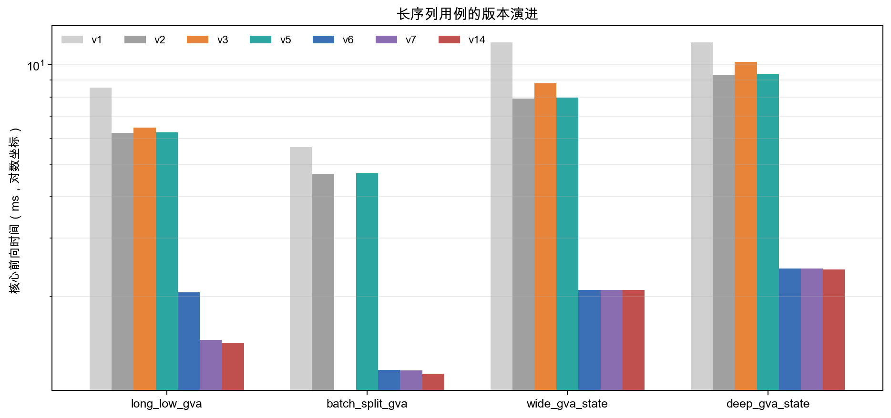

上图展示四个长序列用例的核心时间变化。v6 的 warp 专用化是主要跃迁， v7 的收益来自 GVA 感知的分块策略，v14 主要改善短调用的固定开销。

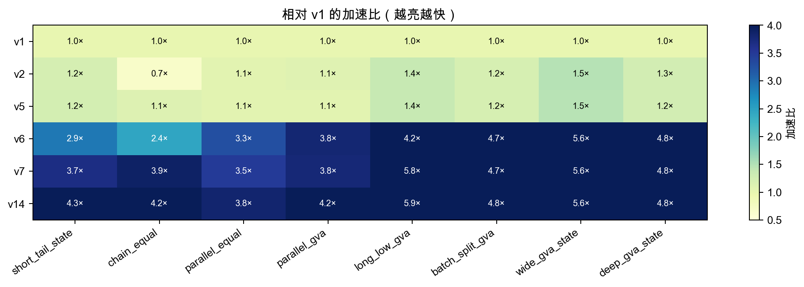

v6 的颜色明显变深，收益来自并行结构。<span style="color:#808080;">非偶然波动</span>。

| 版本 | 优化目标 | 主要变化 | long_low_gva (ms) | 公开分/估分 | 决策 |
|---|---|---|---:|---:|---|
| v1 | 建立正确可运行基线 | 标量循环改 Tensor Core GEMM，DV=32 | 8.545 | 约 50 | 保留为基线 |
| v2 | 降低全局访存延迟 | TMA 替代逐元素加载，DV=128 | 6.226 | 约 73 | 保留，长序列收益明确 |
| v2b | 验证 DV 分块对 CTA 数的影响 | TMA + DV=32（对照实验） | 6.946 | 对照实验 | 只用于解释 chain_equal |
| v3 | 重叠加载与计算 | Q/K 双缓冲预取 | 6.459 | 对照实验 | 回退，未形成有效重叠 |
| v5 | 修复低占用用例 | 按网格规模自适应选择 DV 分块 | 6.252 | 约 77 | 保留，修复低占用用例 |
| v6 | chunk 内 GEMM 并行化 | 四组 warp 专用化 + 等价数学变换 | 2.057 | 108.22 | 主要性能跃迁 |
| v7 | 解决 GVA 场景的 CTA 不足 | 按 `Hv/Hq` 选择 block_DV | 1.477 | 约 112 | 作为 kernel 主线 |
| v14 | 降低短调用固定开销 | kernel/buffer 缓存 + CUDA Graph | 1.447 | 114 | 最终提交 |

## 主要优化

#### 优化方向对照

> 由于 Nsight Compute 单次采集较慢，v2/v3/v5/v7/v9.5/v11/v14 等版本采用完整用例计时和正确性对照实验，v1、v6、v7、v14 以及代表性的失败版本再做详细算子分析。

| 方向 | 实现 | 说明 |
|---|---|---|
| 等价数学变换 | `U'=K@S`、`W'=beta*(V-exp(g)*U')`、`V_new=A@W'` | 代数上等价于 v2 的 `U-W@S`，少一个 V 维 GEMM；FP32 参考实现正确性全部通过 |
| 算子融合 | `_gdn_forward_kernel` 内完成 U/W、QK、输出和状态更新 | 一个 CTA 内融合多个 GEMM 和逐元素阶段，避免中间量落全局内存；生产组负责输入与滞后写回 |
| 共享内存 | TMA 输入缓冲区、`h/vd/vn/o/p` 中转区、FP32 寄存器片段 | v14 约 201.5 KB/CTA，明确列出 113 KB 输入 + 88.4 KB 中转区，受 228 KB 上限约束 |
| 双缓冲/多缓冲 | Q/K/V/A/g/b 两阶段输入缓冲区 | `data_is_ready`/`data_is_free` 保证生产者和消费者交替使用奇偶位 0/1，完整块使用 TMA，尾块走掩码路径 |
| warp 专用化 | S/V/O 三个消费组 + 生产/写回组 | 512 线程/CTA；S 保持状态，V 计算增量，O 计算分数和输出，生产组加载并写回，GEMM 与搬运重叠 |
| 其他优化 | GVA 感知 block_DV、算子/缓冲区缓存、CUDA Graph | v7 解决低网格占用，v14 降低短调用固定开销；v20/v21 说明强行 2 CTA/SM 会寄存器溢出/串行化 |

### Tensor Core 通用矩阵乘法(GEMM, GEneral Matrix‑Matrix Multiplication)

☝🏼拿到这个程序想必第一件事是看看平台的特色☝🏼。标量循环没有利用 Tensor Core，浪费了 SM 上大部分算力。把 U、W、V_new、QK、Q@S、scores@V_new 和状态更新中的大矩阵运算统一改为 `T.gemm` 后，单个 chunk 的计算时间立即下降一个量级。

精度选择上有取舍。操作数用 BF16 可以减半访存带宽（之前想试试8位的，还是太离谱了），但状态递推 512 步会累积截断误差。因此累加器用 FP32，状态本身也用 FP32 保存，只在 GEMM 的输入/输出边界做一次精度转换。

512 步递推后最大误差仍控制在 5e-3 以内。

### TMA, DV 分块

v1 的瓶颈在基线分析中已经定位。逐元素全局加载既浪费带宽又无法跟计算重叠。v2 用 TMA 做异步批量搬运，把加载和计算拆到不同 warp 组上。同时把 DV 分块从 32 增大到 128。TMA 的启动开销是固定的，分块越大摊薄越明显。长序列的全局加载延迟明显下降，long_low_gva 从 8.545 ms 降到 6.226 ms。

不过单一 DV 分块会导致 chain_equal 的 CTA 数不足，因此 v5 引入按网格规模自适应选择，低占用用例使用更小分块。

这一步拆成了三个对照实验。v2b 保持 TMA 只把 DV 分块改回 32，chain_equal 从 1.624 ms 降到 0.986 ms，但 long_low_gva 因重复计算 W 和注意力分数变慢到 6.946 ms； v3 再加入 Q/K 双缓冲，四个观测用例性能全部小幅下降。

分块大小和预取深度跟用例密切相关，不能只看单个长序列结果。

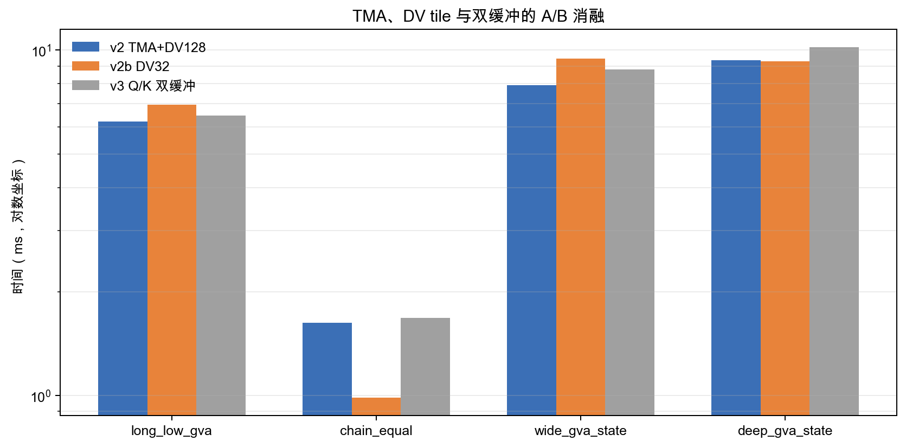

上图是这组对照实验的测量。它解释了为什么 v5 没有把 DV 分块固定为 32。chain_equal 需要更多 CTA，但 GVA 长序列更怕冗余 GEMM。

最终 v5 采用 `grid < SM/2` 才切到 DV=32 的保守规则，公开均值约从 73 提升到 77，且没有牺牲长用例。

### warp 专用化算子

☝🏼🤓还是继续借鉴，v6 借用 FlashQLA 的并行组织。

<span style="text-decoration:line-through;">v4 直接移植 FlashQLA 的融合算子时发现接口语义不兼容（详见未采用方案）</span>，因此 v6 只取并行结构。思路是把 chunk 内的串行计算拆成可以重叠的流水线。如果有专门的 warp 负责加载，计算组就不会因为等数据而停顿。一个 CTA 使用 512 个线程，划分为四个 warp 组。

- S 消费组持有 FP32 状态并执行递推更新；
- V 消费组执行 `K@S`、增量构造和 `A@W'`；
- O 消费组执行 `QK^T`、门控分数和输出；
- 生产组负责 Q/K、V/beta、A/g 的 TMA 加载以及滞后一拍的输出写回。

??? tip "3. warp 专用化核心循环"

    两个输入缓冲区配合 mbarrier 形成双缓冲流水线，消费者之间通过 h、V_new、O 等共享中转区传递数据。核心循环结构如下：

    ```python
    with T.Kernel(ceildiv(DV, block_DV) * batch * H, threads=512) as (bbhv,):
        bhg = bh // (H // Hg)          # GVA: 连续 G 个 V 头共享一个 Q/K 头
        if tx < 128:                    # S 组: 持有 FP32 状态，执行递推
            for i in T.serial(num_iters):
                T.barrier_wait(data_is_ready[i%2], ...); T.copy(h_fragment, h_shared)
                T.gemm(k_shared[i%2], vn_shared, h_fragment, transpose_A=True)
        elif tx < 256:                   # V 组: U'=K@S, W', V_new=A@W'
            T.gemm(k_shared, h_shared, u_fragment)
            W = beta * (v_shared - g_exp * u_fragment)      # 原地构造 W'
            T.gemm(a_shared, W, v_fragment)                 # V_new = A @ W'
        elif tx < 384:                   # O 组: QK^T、门控分数、Q@S、输出
            T.gemm(q_shared, k_shared, p_fragment, transpose_B=True)
            T.gemm(q_shared, h_shared, o_fragment)
            T.gemm(p_shared, vd_shared, o_fragment, clear_accum=False)
        else:                            # 生产组: TMA 加载输入 + 滞后写回输出
            T.tma_copy(q[bb, L:R, bhg, :], q_shared[i%2], barrier=data_is_ready[i%2])
            T.tma_copy(k[bb, L:R, bhg, :], k_shared[i%2], barrier=data_is_ready[i%2])
    ```


数学路径上，v6/v7 采用前述的等价重排（`U'=K@S`、`W'=beta*(V-exp(g)*U')`、`V_new=A@W'`），保留框架 `A` 的精确语义，同时比 v2 少一个 V 维 GEMM。

### GVA 感知的 block_DV

??? tip "4. GVA 感知的 block_DV 选择逻辑"

    v7 的思路来自一个观察。GVA 用例（`Hv > Hq`）中多个 V 头共享同一组 Q/K，如果用小 DV 分块，每个分块都要重复加载和计算 QK 部分。非 GVA 用例没有这个问题，反而更需要小分块来增加 CTA 数量。因此根据 `Hv/Hq` 选择分块大小。无 GVA 的 G=1 用例使用 DV=64 以增加 CTA 数。GVA 用例使用 DV=128，避免重复加载和重复计算 QK 相关部分。公开集全部通过，平均分由约 109 提升到约 112。选择逻辑如下。

    ```python
    def select_block_dv(heads_v, heads_q):
        G = heads_v // heads_q          # GVA 组大小
        if G == 1:                      # 无 GVA: 用小分块增加 CTA 数
            return 64
        else:                           # GVA: 用大分块避免重复加载 QK
            return 128

    block_dv = select_block_dv(heads_v, heads_q)
    kkey = (heads_v, heads_q, dtype, g_dtype, block_dv, use_init)
    kernel = _kernel_cache.setdefault(kkey, _gdn_forward_kernel(..., block_dv, ...))
    ```


v7 的选择规则看 `G=Hv/Hq`，不再只看 CTA 数。G=1 时用 DV=64 增加并行 CTA。G>1 时用 DV=128 保留一次完整的 V 分块，避免每个分块重复计算 QK 相关部分。这个规则让 chain_equal 达到 0.282 ms，同时 long_low_gva 达到 1.477 ms。wide/deep 用例基本持平，说明它主要解决网格很小的场景，没有把所有用例都重新调一遍。

### 运行时缓存与 CUDA Graph（只有一点点点用🤏）

v7 之后 kernel 内部的优化已经接近瓶颈（long_scoreboard 为主），但 OJ 计时包含 Python 调度和显存分配的固定开销。对于短序列（如 short_tail_state 只有 0.067 ms），这部分开销占比很大。因此 v14 不改变 kernel 数学和并行结构，只优化调用层。缓存已编译 kernel，复用输出和最终状态缓冲区，并在第二次调用后捕获完整 CUDA Graph。后续重放仍然执行完整 GPU kernel，只省去 Python 调度、启动和显存分配开销。这是正常的 CUDA 运行时优化，不是结果缓存或跳过计算。

??? tip "5. 三层缓存逻辑"

    在 v14 中，kernel 数学、CTA 映射、barrier 数量都保持 v7 不变。缓存 key 包含 `(Hv,Hq,dtype,block_DV,use_initial_state)`，CUDA Graph key 还包含所有输入输出数据指针，避免不同调用错误复用地址。实测短用例由约 0.08 ms 降至 0.067 ms，长用例只下降约 0.4% 到 2.3%，与固定开销占比分析一致。三层缓存逻辑如下：

    ```python
    kernel = _kernel_cache.setdefault(kkey, _gdn_forward_kernel(...))   
    # 1. kernel 缓存
    output, final_state = _buffer_cache.setdefault(bkey, alloc(...))    
    # 2. buffer 缓存
    graph = _graph_cache.get(gkey)                                      
    # 3. CUDA Graph
    if graph is not None:
        graph.replay()                                                  
        # 已捕获: 直接重放
    else:
        kernel(q, k, v, g, beta, A, s0, output, final_state)            
        # 首次: 直接运行
        if _call_count[gkey] >= 2:                                      
            # 第二次: 捕获 Graph
            with torch.cuda.graph(graph):
                kernel(q, k, v, g, beta, A, s0, output, final_state)
            _graph_cache[gkey] = graph
    ```


`mbarrier` 的到达计数按线程数配置，不是按 warp 数配置。因此生产组为 96、三个消费组合计为 384。这个细节在 v15 的三阶段实验中专门修正过，避免奇偶位提前翻转造成死锁或跨迭代读写冲突。


## 未采用方案

v7 之后尝试了几条看起来应该更快的方向，全部失败。这些失败说明瓶颈不在这些地方。减少 barrier 或压缩寄存器配额并不自动等于加速，如果同时破坏合并写回组或消费组并行，收益会被访存等待完全吞掉。

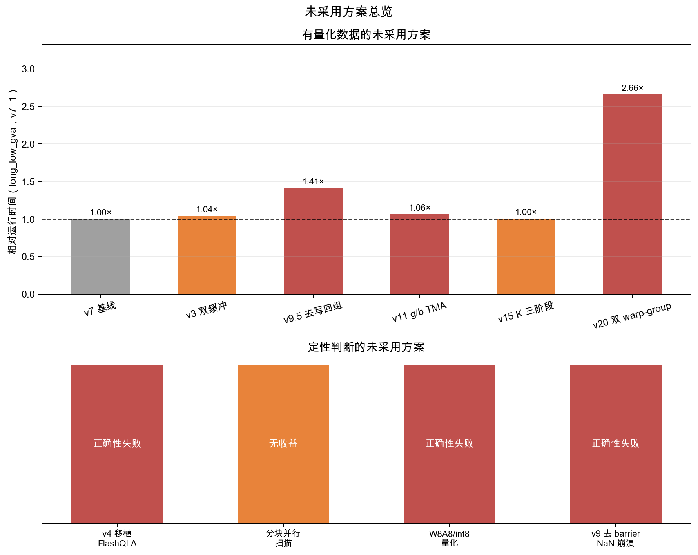

上图把有量化数据的方案归一化到 v7 的 long_low_gva 运行时间，v9.5 和 v20 退化最严重（2.1× 和 2.7×）。移植 FlashQLA 和 W8A8 量化因正确性失败而放弃，分块并行扫描虽正确但无性能收益。

- Q/K 双缓冲预取（v3）：增加共享内存后没有形成有效重叠，long_low_gva 反而变慢 4%。
- 直接移植 FlashQLA kernel（v4）：结构可以编译，但正确性测试中输出最大误差约 `7e-3`，最终状态有大量超出 `5e-3` 的元素。课程预处理已经把 beta 和门控衰减融合进 `A`，FlashQLA 模板却假设 `A` 不含衰减，并在 kernel 内构造 `Ag=G*A*b`。
- 分块并行扫描：数学上可行，但需要两遍计算；在 14-SM MIG 上额外 GEMM 成本大于可获得的并行度。
- 删除 barrier、直接全局写输出（v9/v9.5）：v9 删除两条 barrier 后出现跨迭代竞争并产生 NaN。v9.5 保留五条 barrier 虽然通过正确性检查，却因去掉写回组、改成逐元素全局写而全面变慢，long_low_gva 退化 41%。
- g/b 全头合并加载（v10/v11）：理论上消除了非合并访问，但实际增加共享内存和 TMA 固定开销，wide_gva_state 退化 42%。
- K 三阶段流水线（v15）：正确但长用例只有 ±1.6% 的噪声级变化，额外 barrier 抵消预取距离收益。
- 两 CTA/SM（v20/v21）：v20 串行化六个 GEMM，v21 以 nreg=64 换占用率，两者都比 v14 慢约 2.7 倍；降低寄存器还会造成寄存器溢出。
- W8A8/int8：TileLang 可以编译 int8 GEMM，但端到端量化需要额外缩放和转换；K/V/A 的误差会在最终状态中累积，当前 5e-3 容差下没有足够正确性余量，因此未部署。

## 最终结果&性能分析

正式 OJ 使用预热=10、重复次数=100，时间取 CUDA 事件中位数。H800 PCIe MIG 1g.10gb，14 SM，Python 环境为 `/opt/lab3-venv`。v14 的 OJ 结果如下。

| 用例 | 形状 `(B,T,Hq,Hv)` | v14 中位数 (ms) | 用例得分 |
|---|---:|---:|---:|
| short_tail_state | (1,1025,2,8) | 0.067 | 120 |
| chain_equal | (1,8192,4,4) | 0.262 | 117.96 |
| parallel_equal | (1,2048,16,16) | 0.233 | 120 |
| parallel_gva | (1,2048,4,16) | 0.212 | 120 |
| long_low_gva | (1,32768,2,8) | 1.447 | 105.69 |
| batch_split_gva | (4,8192,2,8) | 1.169 | 106.21 |
| wide_gva_state | (1,8192,16,64) | 2.094 | 103.18 |
| deep_gva_state | (1,16384,8,32) | 2.409 | 103.50 |

公开集得分 112.07，隐藏集得分 116.16，加权总分约 114。

所有公开和隐藏正确性用例均通过，输出为 BF16，最终状态为 FP32。

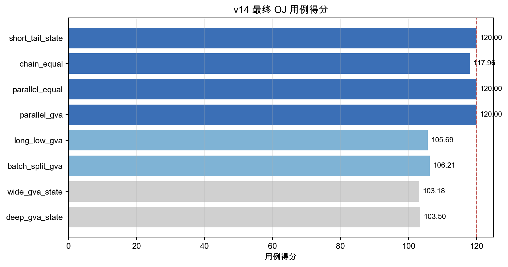

long_scoreboard！😭 你们怎么做到的118，119的！


### 与参考实现比较

| 用例 | v14 (ms) | FlashQLA (ms) | FlashInfer (ms) |
|---|---:|---:|---:|
| short_tail_state | 0.067 | 0.267 | 0.302 |
| chain_equal | 0.262 | 0.446 | 0.778 |
| parallel_equal | 0.233 | 0.456 | 0.467 |
| parallel_gva | 0.212 | 0.432 | 0.436 |
| long_low_gva | 1.447 | 1.821 | 1.787 |
| batch_split_gva | 1.169 | 1.816 | 1.433 |
| wide_gva_state | 2.094 | 3.342 | 2.341 |
| deep_gva_state | 2.409 | 3.619 | 2.698 |

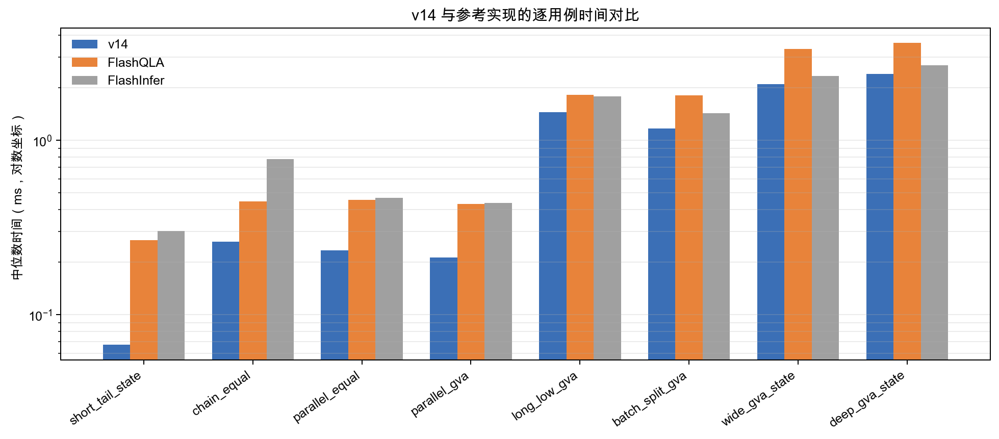

上图使用相同的本地中位数数据绘制。v14 在短用例和 chain_equal 上更快，长 GVA 用例也达到同一量级。

### 性能分析

Nsight Systems 用于确认时间线。`long_low_gva` 的 T=32768 对应 512 个 chunk，每个 CTA 按顺序处理这些 chunk，kernel 中没有隐藏的第二个并行维度。Nsight Compute 采集两个代表用例，统计指标均来自已编译的 `kernel_kernel`。

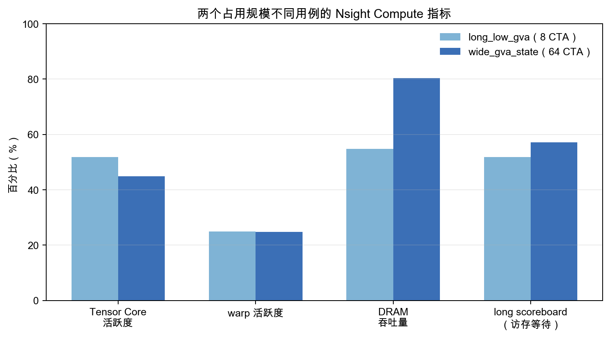

上图对比了低占用的 long_low_gva 和 CTA 充足的 wide_gva_state。两者 warp 活跃度都约 25%，而 long scoreboard 分别为 51.86% 和 57.17%。瓶颈是每个 CTA 的寄存器/共享内存压力造成的低 warp 并发和访存延迟，简单增加 CTA 数量无法解决。Tensor Core 活跃度只有 45% 到 52%，算力流水线尚未饱和。

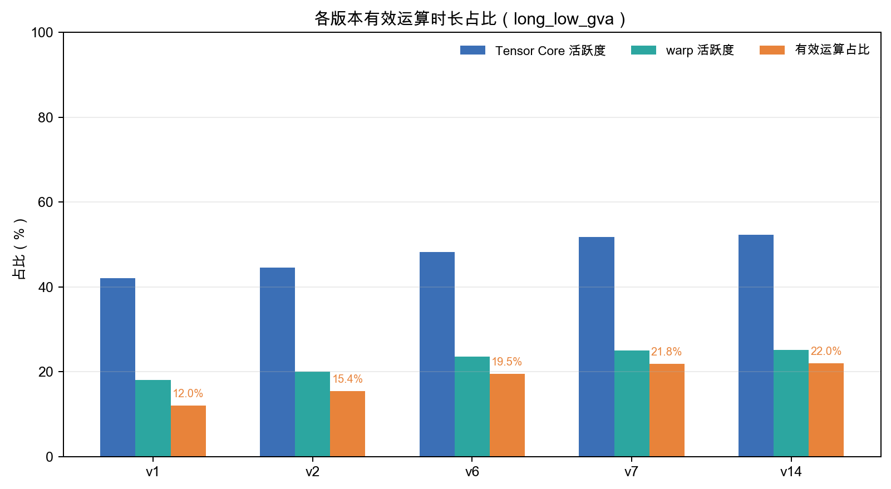

上图展示各版本的有效运算占比变化。随着 TMA 预取、warp 专用化和 GVA 感知的分块策略逐步加入，Tensor Core 活跃度从约 42% 提升到 52%，有效运算占比从约 12% 提升到约 22%。但即便在 v14，仍有约 78% 的 warp 周期因访存等待而停顿（X），这与 long scoreboard 为主停顿原因的分析一致。

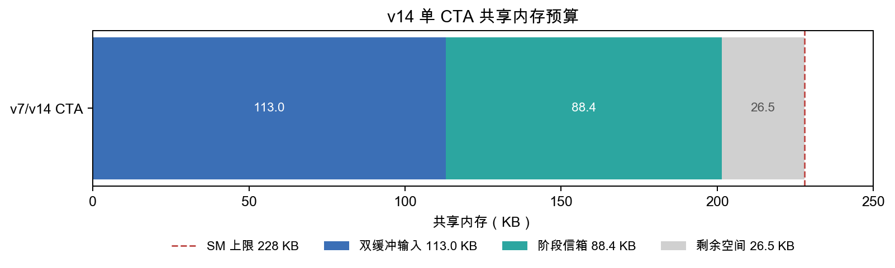

内充占用情况：双缓冲输入约 113 KB，阶段中转区约 88.4 KB，总计 201.5 KB，距离 228 KB 上限只剩 26.5 KB😋

要让一个 SM 驻留两个 CTA，需要把单 CTA 压到 114 KB 以下，这会迫使我们删除双缓冲或大量中转区。v20/v21 的实验也验证了，强行压低寄存器和 DV 分块会失去三个消费组的并行性，实际反而慢约 2.7 倍。

### 总结

最终实现的核心是**围绕数据依赖组织并行**。用 Tensor Core 承载 GEMM，用 TMA 和双缓冲降低搬运延迟，用四个 warp 组分离状态、增量、输出和加载，再用 GVA 感知的分块策略调整 CTA 数量。v14 在正规计算路径下稳定通过正确性检查，公开得分 112.07、总评约 114。
