# Lab 4：AMSS-NCKU 数值相对论程序优化

!!! Abstract "写在前面"

    CPU：Kunpeng 920B / ARM  
    GPU：x86 + NVIDIA A100 MIG 10GB

    [点击查看报告 PDF 版](./lab4.pdf)

任务量挺大😭

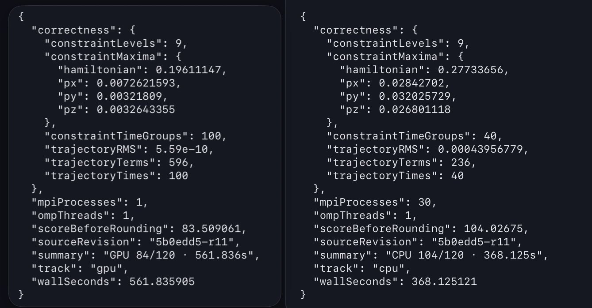

这次实验使用 Python、C++、Fortran 和 CUDA。Python 生成输入并整理输出；C++ 管理初值、AMR patch 和 MPI；Fortran 执行 CPU 上的有限差分、RHS、RK 和网格操作；GPU 路径用 CUDA 执行热点计算。

程序先用 `TwoPunctureABE` 实时求解双黑洞初值（所有候选都实时计算初值），再由 CPU `ABE` 或 GPU `ABEGPU` 在 AMR 网格上执行 BSSN 演化。

CPU 依次 `t=1`、`t=4` 和 `t=40`；GPU 依次 `t=1`、`t=4` 和 `t=100`。其中，`t=1` 检查启动和输出文件，`t=4` 检查轨迹是否偏离，完整通过后再记录端到端时间。

**实验目标**是优化并缩短演化时长，同时保证两个黑洞六个坐标的相对 RMS 不超过 `0.1%`，Grid Level 0 的 Hamiltonian、`Px`、`Py`、`Pz` 最大绝对值不超过 `2.0`。


| 项目 | CPU | GPU |
| --- | --- | --- |
| 硬件 | Kunpeng 920B / ARM | A100 80GB PCIe，分配 `1g.10gb` MIG |
| 并行配置 | MPI=30，OMP=1，unbound MPI | ABEGPU MPI=1、OMP=1；初值求解 OMP=16 |
| 演化终点 | `t=40` | `t=100` |
| 编译与启动 | GNU Fortran / g++ 14.2；通用 `-O3`，热点 Fortran 使用 `-Ofast` | CUDA 编译目标为 A100（compute capability 8.0，`sm_80`）；RHS block 为 256 threads |
| 运行特点 | 本次作业分配 60 个逻辑 CPU，编号为 `64--123` | grid 随 AMR patch 形状生成 |

## 总览

??? note "程序流程与术语"

    <span style="color:#808080;">程序的核心流程分为三步。程序先根据当前网格上的变量计算空间导数，然后计算各变量的变化率，最后利用时间推进方法得到下一时刻的状态。</span>

    <span style="color:#808080;">这里的 RHS 可以理解为“状态的变化率”。设某个变量为 \(u\)，程序先计算 \(\partial u/\partial t\)，再用一个很小的时间步长更新 \(u\)。RK4（四阶 Runge--Kutta）会在一个时间步内多次计算 RHS 并生成中间状态，所以导数计算、RHS 计算以及数组读写都会被反复执行。</span>

    <span style="color:#808080;">AMR 会把计算区域划分成不同分辨率的网格。黑洞附近使用细网格，较远区域使用粗网格。不同层级之间需要交换 ghost 数据、进行 prolongation（粗网格到细网格的插值）和 restriction（细网格到粗网格的回写）。此外，细网格周围还要保留一定范围的 buffer，以保证移动网格和边界计算有足够的数据。这些操作决定了每一步需要处理多少网格点，也直接影响长时间演化的稳定性。实际调参时，速度和稳定性经常需要一起考虑，单看某一次短测很容易得出过于乐观的结论。跑完整 t=40 之后，很多看起来很有希望的设置就会暴露问题。</span>

### 优化总览

CPU 优化主要集中在初值求解和 AMR 网格规模，GPU 优化主要处理 RHS 的寄存器压力和诊断路径中的无效计算。下面的两张表汇总了主要结果，后文再说明这些数字是怎么来的——如果只想快速了解结论，先看下面两张表就够了🙂

#### CPU

| 改动 | 解决的问题 | 实际收益 | 正确性结果 |
| --- | --- | --- | --- |
| JFD（用有限差分近似 Jacobian）临时导数改为栈上局部变量 | 避免初值迭代中反复申请和释放固定大小的临时数组 | 同节点 t=40 少 `12.776608 s`（`2.6991%`） | 轨迹误差 `1.77018315e-6`，40 组约束检查通过 |
| `NRELAX=100` | 减少内层辅助迭代次数 | 少 `5.819748 s`（`1.458%`） | 40×9 约束检查通过，轨迹误差 `1.7909752e-4` |
| b5l8（普通层 buffer=5，最细 moving level 8 使用 buffer=6，level 0 保留 12） | 减少中间网格和边界区域需要处理的点数 | 少 `22.997085 s`（`5.8457%`） | 40×9 约束检查通过，轨迹误差 `4.3956779e-4` |
| q64 | 减少 Psi4 和 ADM 分析阶段的积分点 | 同节点 t=40 少 `5.077338 s`（`1.461%`） | 轨迹和 constraint 对应值相同，Psi4/ADM 差异在 checker（课程正确性检查程序）范围内 |

#### GPU

| 改动 | 解决的问题 | 实际收益 | 正确性结果 |
| --- | --- | --- | --- |
| P10/P28（调整初值求解网格和迭代条件） | 初值求解占用时间过长 | m602 t=100 少 `62.662360 s`（`10.438%`） | 实时求初值，100×9 约束检查通过 |
| P47（调整 RHS 的线程和寄存器约束） | 减少寄存器不足导致的 spill（寄存器溢出到 local memory） | m602 t=100 少 `13.593628 s`（`2.529%`） | 轨迹误差 `6.06365955e-5`，100×9 约束检查通过 |
| P72（跳过诊断阶段无后续用途的计算） | constraint 写出后仍计算不会被读取的 RHS | m602 t=100 少 `0.115230 s`（`0.022%`） | 轨迹误差 `6.06365955e-5`，100×9 约束检查通过 |

## 主要优化

### 优化过程中的关键节点

有不少没有进入最终版本的中间节点，日志中也记录了。把这些节点放在一起，可以更清楚地看到优化是怎样逐步收敛的。CPU 端先确认了 MPI 和 OpenMP 配置，再定位分析阶段的插值热点，最后才调整 AMR buffer 和分析积分。GPU 端则经历了从 inline、寄存器限制到 block 形状和访存方式的多轮筛选。

CPU 端比较有代表性的几个节点整理在下面。

| 阶段 | 主要改动 | 实验现象 | 最终处理 |
| --- | --- | --- | --- |
| 调度配置筛选 | 比较 `-c 30` 和 `-c 60`，并测试 MPI binding | `-c 60` 使同一候选的 t=4 时间从 `237.469 s` 降到 `170.773 s`，checker 通过 | 后续统一使用 60 个逻辑 CPU，MPI=30，OMP=1 |
| 通信与分析定位 | 使用 PMPI 和 phase timer 分析等待来源 | 每个 rank 约有 2559 次 `MPI_Allreduce`，主要等待来自 rank 到达不同步；level 0 analysis 约占 `33.53 s` | 优化重点转向分析阶段，不再盲目增加 MPI 或 OpenMP |
| 球面插值定位 | 继续拆分 `AnalysisStuff` 和插值子阶段 | `f_global_interp` 占 owner 循环的 `99.84%`，主要问题是同一点对不同变量重复计算 stencil 和权重 | 引入批量多变量插值 |
| 批量多变量插值 | 同一个命中点只计算一次 stencil 和三维权重，再应用到全部变量 | t=1 cache 测试从 `44.559 s` 降到 `13.250 s`，checker 通过 | 进入后续 t=4 和 t=40 验证 |
| 分析积分阶数 | 只降低 `surf_Wave` 和 `surf_MassPAng` 的插值阶数 | surface-only order2 的 t=40 cache 运行时间为 `393.304 s`，checker 通过 | 保留该方案，并维持 BH/default 插值原阶 |

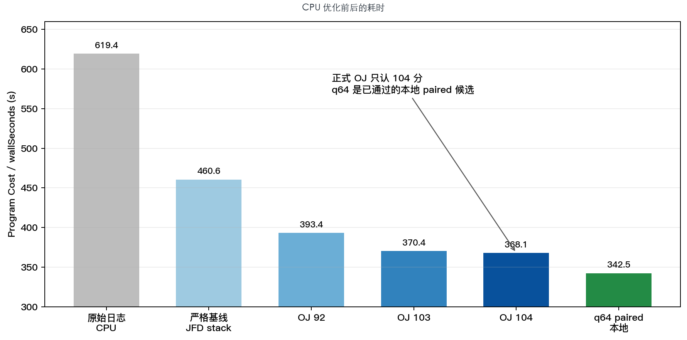

GPU 端的有效节点也不只有 P10、P47 和 P72。日志中的完整 t=100 结果显示，GPU 优化大致经过了下面几个阶段。

| 阶段 | 主要改动 | 完整 t=100 结果 | 说明 |
| --- | --- | ---: | --- |
| 初始基线 | 初始稳定 GPU 实现 | `1609.150 s` | 作为后续对照 |
| 编译与函数优化 | inline、fast math、`maxrregcount=128` | `1218.620 s` → `990.630 s` | 减少函数调用和寄存器压力 |
| 编译器与访存优化 | `ptxas -O3`、`__ldg`、`block(16,4,4)` | `955.090 s` → `899.260 s` | 形成稳定的保守最佳版本 |
| 并发度优化 | `maxrregcount=64`、`__launch_bounds__(256,4)`、`block(32,4,2)` | 三次运行约 `820 s`，最快 `815.995 s` | occupancy（同时驻留线程束占理论最大值的比例）从 25% 提高到 50%，但复现性仍需谨慎看待 |
| 诊断路径优化 | P72 跳过无消费者计算 | 在 P47 基础上减少 `0.115230 s` | 收益较小，但完整 checker 通过 |

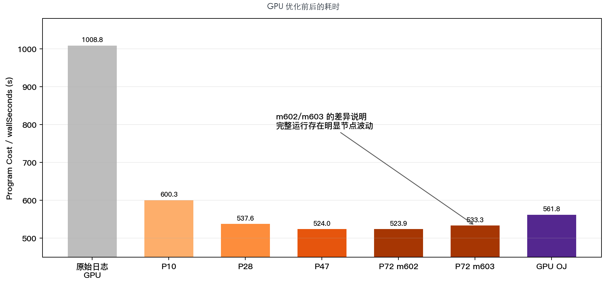

这些记录说明，GPU 的主要收益集中在寄存器和并发度调整上，诊断路径优化更像是最后的收尾。部分短测看起来更快的配置，在完整 t=100 运行中会退化，或者无法稳定复现，因此没有全部写进最终方案。这个筛选过程比较耗时间，但也避免了只根据一次短测结果下结论。

### 基线和热点

#### CPU 热点

CPU 的早期完整运行时间为 `619.382 s`。为了比较不同版本的热点分布，我使用 profile（性能采样）对 P13 中期版本、b5l8/q96 版本和最终 b5l8/q64 版本分别进行了真实 t=4 函数级采样。这里，b5l8 表示分层设置 AMR buffer，q96/q64 表示球面积分分别使用 96/64 个采样点。

最终 b5l8/q64 版本在独立目录中重新运行，配置为真实 TwoPunctures、MPI=30、OMP=1，并演化到 t=4。`perf record` 运行的 Program Cost 为 `47.074 s`，checker 通过；同配置下不启用 profiler 的 `perf stat` 运行时间为 `45.704 s`。因此，下面的百分比只用于比较热点组成，不能把 profiler 运行的总时间直接当作普通运行时间。

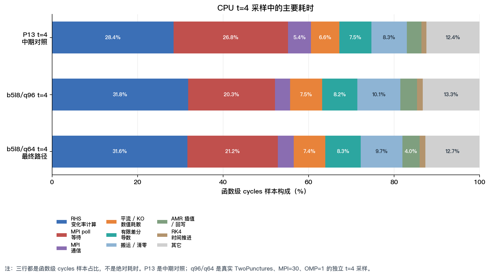

三次采样反映出以下现象。

- 计算变量变化率始终是 CPU 端最大的单项。其样本占比从 P13 的 `28.42%` 变为 q96 的 `31.83%` 和 q64 的 `31.64%`。这并不表示 RHS 本身变慢，而是 b5l8 减少了部分网格工作后，RHS 在剩余运行时间中的占比相对提高。
- OpenMPI poll 的占比从 `26.79%` 降至 q96 的 `20.33%` 和 q64 的 `21.18%`；两项显式 MPI 通信的样本占比之和也从 `5.36%` 降至 `3.53%` 和 `3.71%`。
- 数据搬运、清零以及粗细网格之间的插值在三个版本中仍然占据明显比例。因此，最终 CPU 路径不仅受计算量影响，也受到访存、AMR 数据处理和 MPI 同步的限制。继续做零散的代数化简，收益会比较有限。

q64 的整体计数器结果也支持这一判断。一次完整 t=4 运行的 Program Cost 为 `45.704 s`，平均活跃 CPU 为 `18.856`，IPC 为 `1.89`，LLC load miss 为 `56.98%`。这说明当前路径仍有较大的工作集，并且存在明显的 AMR 工作不均衡和通信等待。

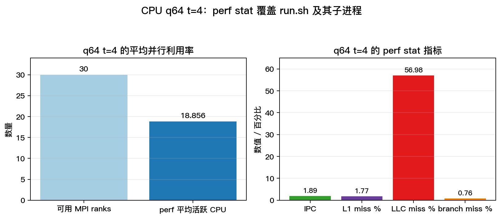

#### GPU 热点

GPU 的早期完整运行时间约为 `1009--1063 s`。P72 版本使用 Nsight 对 kernel 时间进行统计。Nsight 的结果直接给出了 GPU 演化阶段各个 kernel 的耗时分布，便于确定后续优化方向。

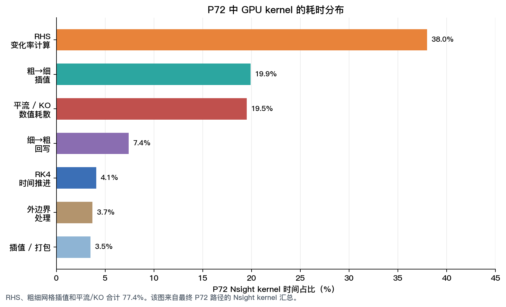

在 P72 中，RHS、粗网格到细网格的插值、平流项和数值耗散合计占 `77.4%`。GPU 优化主要围绕三个方向展开，包括减少寄存器 spill、降低粗细网格操作的成本，以及删去诊断路径中没有实际用途的计算。不同版本的完整端到端时间会在后文单独比较。


### CPU 路径

#### TwoPunctures 初值求解

TwoPunctures 在主演化开始前生成双黑洞初值。这个过程需要通过多轮迭代逐步求解。外层 Newton 迭代根据当前误差修正解，每一轮还要估计导数并求解一个线性修正问题。JFD 使用有限差分近似导数，BiCGSTAB 负责求内层线性修正，预条件器则帮助内层迭代更快收敛。

在 `t=1` 记录中，初值求解接近 90 秒，而主演化只占较小部分。因此优化重点放在减少初值求解过程中的重复工作。

| 改动 | 具体做法 | 预期原因 | 验证方式 |
| --- | --- | --- | --- |
| 放宽内层线性求解停止条件 | 不再把内层残差压到明显超出外层需求的程度 | 避免在外层已经足够准确时继续迭代 | t=1、t=4、t=40 均通过 |
| `NRELAX=100` | 减少预条件器中的 relaxation 次数 | 每轮线性修正少做部分辅助迭代 | t=1、t=4、t=40 均通过 |
| JFD 导数包栈化 | 将临时导数数据改为栈上局部变量 | 避免小数组频繁申请和释放 | 残差序列逐项对照 |
| 热点数值 kernel 使用 `-Ofast` | 对导数、RHS 和网格循环启用更激进的优化 | 让编译器生成更紧凑的循环代码 | 完整 checker 通过 |

此外还测试过 `NRELAX=50/75`、更松的 BiCG 参数、不同谱网格以及持久 workspace。有些版本虽然减少了单轮迭代次数，却增加了外层迭代次数；另一些版本在后续演化中出现偏差，所以没有保留。

早期记录显示，bare-mass 外层迭代进行六轮后，残差 \(|F|\) 从 `9.57e-3` 降到 `3.35e-10`，这反映了实时初值求解的收敛过程。

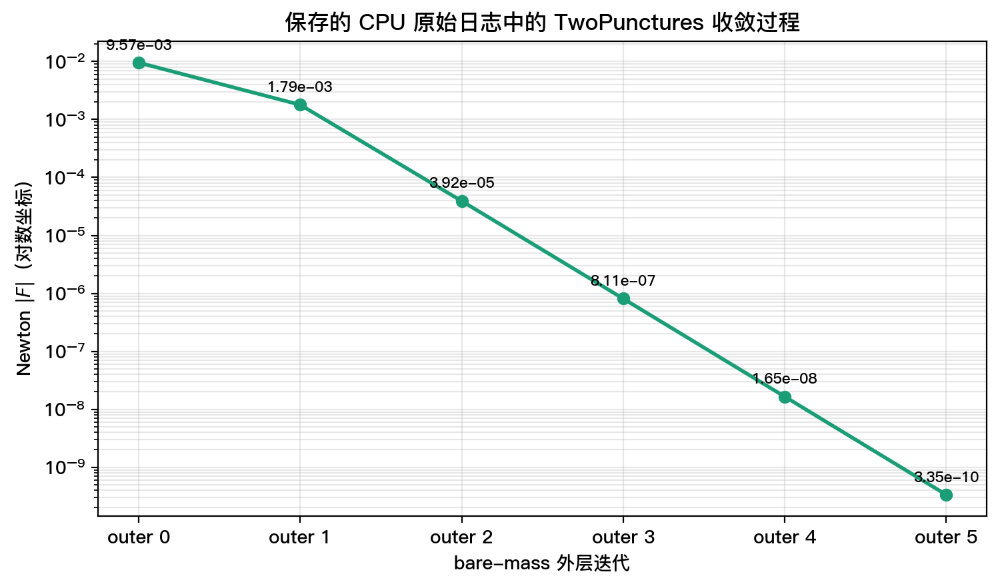

#### RHS、导数和 AMR 数据流

RHS、空间导数和 AMR 操作都会反复扫描三维数组。RHS 需要读取多个变量及其 stencil 邻域；AMR 还需要准备 ghost 数据，并在粗细网格之间完成插值和回写。因此，CPU profile 中的平流/KO、导数计算、`memcpy` 以及粗细网格插值，都属于同一条数据流上的开销。

原来的 `lopsided_kodis` 会为平流项和 KO 数值耗散分别准备一次 ghost 区，但两项计算使用的是同一份边界数据。修改后只扩展一次 ghost，再按原有顺序完成两项计算。同时，将 Gamma RHS 的相邻数组扫描合并为一次。有限差分 stencil、变量更新顺序和物理公式均未改变。

RK4 的中间 stage 不再执行诊断；每个物理时间步结束时仍然刷新完整 state 并生成完整 constraint。也就是说，省掉的是中间子步重复的诊断，不是 checker 所需的最终输出。

Gamma RHS 融合在真实 t=1 运行中将 Evolve 从 `9.67817 s` 降到 `9.50267 s`。由于没有同环境、同配置的独立 t=40 对照，本报告不把这项结果与其他收益直接相加。这样处理虽然保守一些，但能避免把不同实验条件下的时间差误认为真实收益。最终 profile 中数据搬运、清零和粗细网格插值仍占有明显比例，因此后续没有继续堆叠小规模 CSE。

#### 分层 AMR buffer

AMR buffer 决定 moving box 周围额外保留多少网格点。buffer 减小时，patch 体积会变小，RHS、ghost exchange、插值和回写需要处理的点数也会减少；但如果细网格周围的保护区过窄，黑洞移动后就可能缺少足够的边界数据，误差会在长时间演化中累积。

筛选结果如下。

```text
全局 buffer=4             t=40 约 343 s，轨迹误差 7.06e-3，失败
全局 buffer=5，L8=5       轨迹误差 1.49e-3，失败
全局 buffer=5，L8=6       轨迹误差 4.36e-4，通过
```

最终采用的 b5l8 配置为普通层使用 buffer=5，最细 moving level 8 使用 buffer=6，level 0 保留 12。最细层没有继续降到 5，是因为它直接包围黑洞附近的移动区域。这个设置在 t=40 通过检查的候选中具有较小的网格规模。

最终 CPU profile 中 RHS 占比提高到 `31.64%`。b5l8 先减少了部分 patch、MPI 和分析工作，所以 RHS 在剩余时间中的比例相对更高。

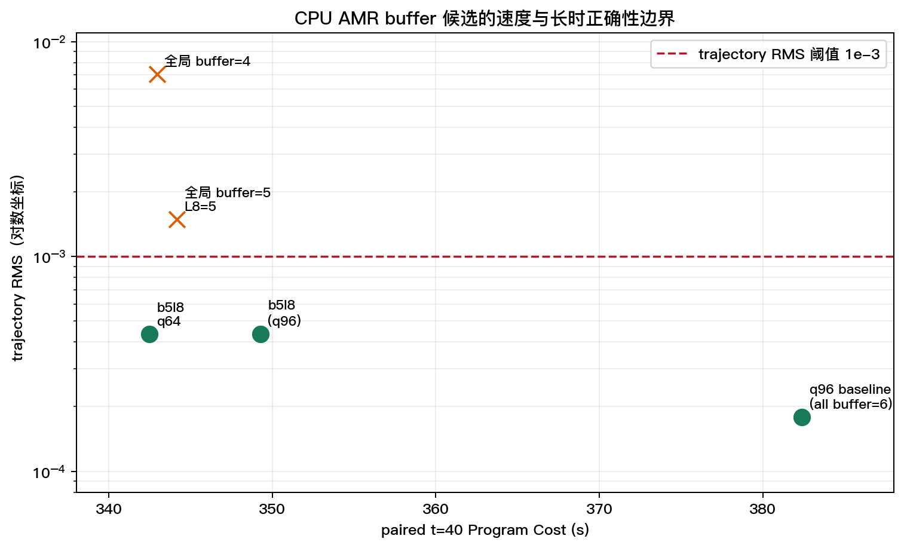

#### q64 分析积分

演化完成后，程序还要计算 Psi4 和 ADM 等分析量。这些量需要在球面上取样、插值并积分。`quarter_sphere_number` 控制四分之一球面上的采样点数。它不会改变初值、主演化、黑洞轨迹或 constraint，只会影响分析阶段的工作量。

| 设置 | 总耗时 | 演化耗时 | 轨迹误差 | 检查结果 |
| --- | ---: | ---: | ---: | --- |
| q96（96 个采样点） | 347.550 s | 334.575 s | `4.3587e-4` | PASS |
| q64（64 个采样点） | 342.473 s | 329.486 s | `4.3587e-4` | PASS |

q64 比 q96 少 `5.08 s`。同节点 paired 对比中，BH 轨迹和 constraint 对应值相同；Psi4 RMS 差异为 `5.08e-7`，ADM RMS 差异为 `2.85e-4`，均在 checker 允许范围内。这个收益来自分析阶段，而不是降低主演化网格的分辨率。

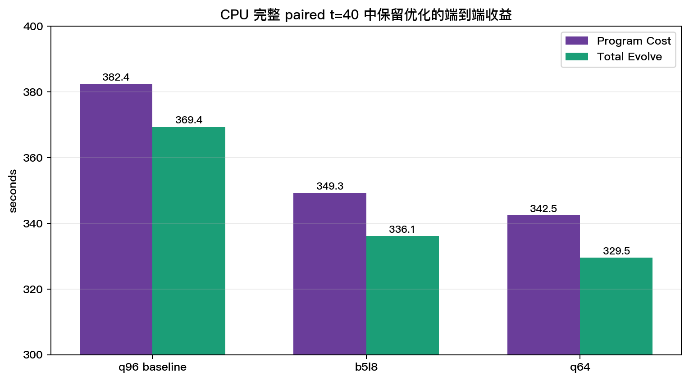

### GPU 路径

#### GPU 前的初值求解

GPU 演化开始前仍然要在 CPU 上实时求解 TwoPunctures 初值。早期 GPU 路径中，初值部分占用了很长时间，因此先调整谱网格、内层线性迭代和 bare-mass 外层 relaxation。m602 上，P10 的完整 t=100 时间为 `600.297180 s`，P28 为 `537.634820 s`，两者都通过完整 checker。

GPU 路径仍然包含初值阶段。即使 A100 上的 kernel 很快，初值求解时间也会计入 Program Cost。P10/P28 保留了真实 Newton、JFD 和内层求解，只调整了迭代条件和预条件器的工作量。

#### RHS 的寄存器 spill

GPU 每个线程可使用的寄存器数量有限。当临时变量过多时，编译器会把一部分数据放入较慢的 local memory，这就是 spill。RHS 是 GPU 最大的热点，因此 spill 会影响大量网格点和多个 RK stage。

P47 使用 `__launch_bounds__(256, 2)` 重新约束寄存器分配。其中 256 表示每个 block 使用 256 个线程，2 表示编译器以每个 SM 至少驻留两个 block 为目标，在寄存器用量和并发度之间重新平衡。

在 m602 上，完整 t=100 时间从 `537.634820 s` 降到 `524.041191 s`，减少 `13.593628 s`。之后还测试了 192 threads/block、不同寄存器上限、cache preference 和 CUDA C++ 标准。这些设置有时能改善单个 kernel 的资源指标，但没有带来稳定的完整运行收益。

#### constraint 诊断路径

constraint 输出会额外调用一次 RHS。检查调用链后发现，在 `co=0` 路径中，constraint 写出后，后续平流项和 KO 只会写入本次调用中不再读取的 RHS 缓冲；下一次真实 RK stage 会重新计算这些内容。

P72 在这里提前返回，但保留了真实 RK 演化、constraint 写出和最终输出。m602 的完整 t=100 时间从 `524.041191 s` 降到 `523.925961 s`，节省 `0.115230 s`。收益虽然只有 `0.022%`，但调用链和完整 checker 均通过，说明诊断路径中确实存在可以安全删除的无消费者计算。这个收益不算大，不过能稳定通过检查，保留下来还是有意义的。

P72 的 Nsight 结果显示，RHS、粗细网格插值、平流项和数值耗散合计占 `77.4%`。对比 P10、P28、P47、P72 的端到端时间可以看到，两次主要收益来自不同阶段。P10 到 P28 主要减少了初值、驱动和分析部分，P28 到 P47 主要减少了主演化时间。

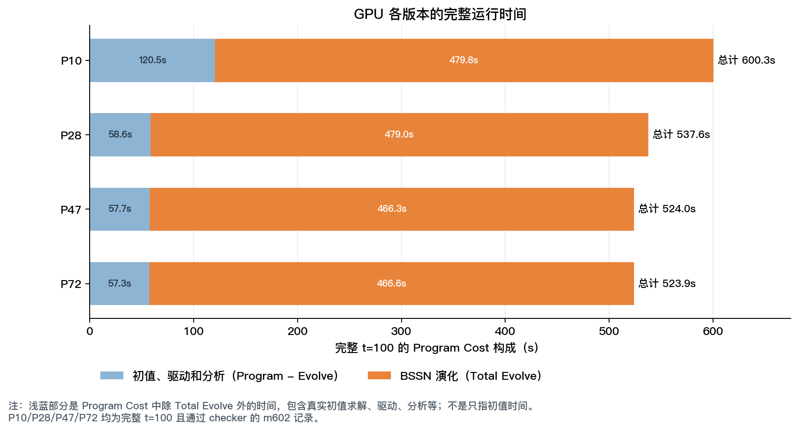

## 未采用方案

下面这些方案没有进入最终版本。它们不一定是实现错误，有些只是局部指标变好，却没有转化为稳定的端到端收益。实际筛选时，最麻烦的地方在于，短测结果往往比完整运行更容易让人误判。

| 尝试 | 结果 | 未采用原因 |
| --- | --- | --- |
| `buffer=4` | CPU t=40 约 343 s，轨迹误差 `7.06e-3` | 细网格周围的保护区不足 |
| b5l8 变体（最细第 8 层也设为 5） | t=40 轨迹误差 `1.49e-3` | 最细网格附近仍缺少足够的保护区 |
| q32/q48 | t=1 没有收益，部分情况更慢 | 继续减少积分点没有带来端到端收益 |
| MPI=28 或更小 patch | t=1 更慢 | 单个进程承担的 patch 更多，等待时间没有消失 |
| `ghost_width=2` | t=4 轨迹误差失败 | 边界和粗细网格插值精度不足 |
| RK3 / SSPRK3 | 出现 NaN 或约束非有限 | 当前时间推进和网格同步的依赖不满足 |
| 跳过 predictor 或中间投影 | t=4 轨迹误差失败 | 后续时间子步仍需要这些状态 |
| CUDA Graph | GPU t=4 轨迹误差 `0.240967731` | kernel 发射或同步顺序改变后，状态不再正确 |
| 多字段 advection batch | 没有稳定收益 | shared memory 和寄存器开销抵消了数据复用收益 |

这些结果表明，减少网格点数必须同时满足数值稳定性要求，才能形成可用优化。buffer 和 ghost 直接关系到细网格边界；时间推进和中间投影则是后续 stage 的输入。CUDA Graph 的失败也表明，kernel 的发射顺序和同步关系属于数值流程的一部分，不能简单当作调度开销删掉。

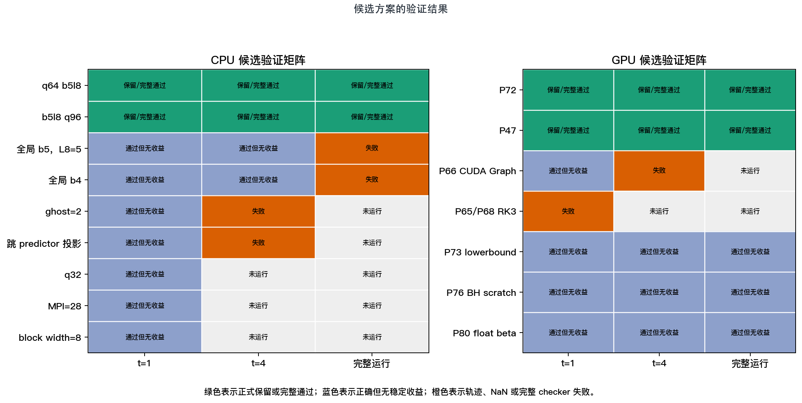

## 最终结果和正确性

课程统一使用运行驱动打印的 `This Program Cost` 作为端到端时间。最终 CPU 和 GPU 的结果整理如下。

| 完整运行记录 | CPU 路径 | GPU 路径 |
| --- | ---: | ---: |
| 总耗时 | `368.125121 s` | `561.835905 s` |
| 并行方式 | 30 个 MPI 进程，每个 1 个 OpenMP 线程 | 1 个 MPI 进程、1 个 OpenMP 线程；初值求解使用 16 个 OpenMP 线程 |
| 黑洞轨迹相对误差 | `4.3956779e-4` | `5.59e-10` |
| 约束检查 | 40 个时间点 × 9 个网格层，全部通过 | 100 个时间点 × 9 个网格层，全部通过 |

CPU 当前记录比早期严格记录 `393.401512 s` 少 `25.276391 s`，约提升 `6.425%`。Grid Level 0 的最大约束为 Hamiltonian `0.27733656`、`Px=0.02842702`、`Py=0.032025729`、`Pz=0.026801118`，均小于课程要求的 2.0。

GPU 在本地 m602、m603 上的完整运行时间分别为 `523.926 s` 和 `533.326 s`。保留两个结果是为了说明节点和运行条件会造成可见波动。GPU OJ 结果中的轨迹 RMS 很小，表明最终路径的黑洞轨迹与参考轨迹非常接近；但这不意味着所有网格变量、分析量和时间推进都可以随意降低精度，任何进一步近似都必须重新通过完整 checker。

### CPU 结果图

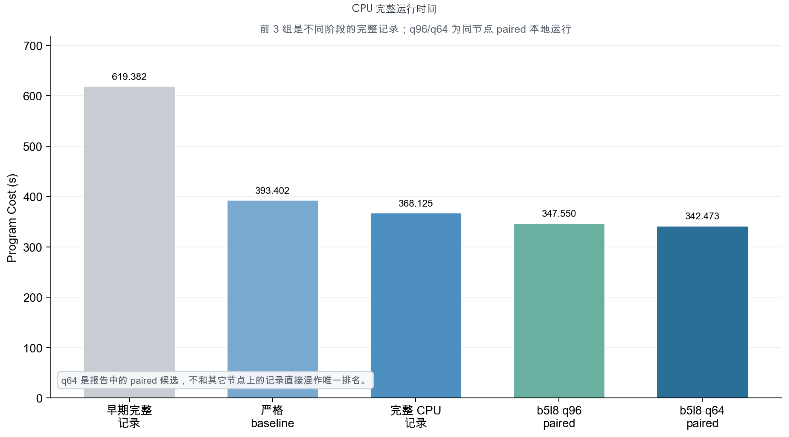

CPU q64 t=40 报告运行使用 MPI=30、OMP=1，Program Cost 为 `344.406 s`，Total Evolve 为 `331.365 s`，trajectory RMS 为 `4.35873492e-4`，40 个时间组和 9 个 level 均通过。黑洞轨迹文件包含 40 行，constraint 文件包含 360 行。

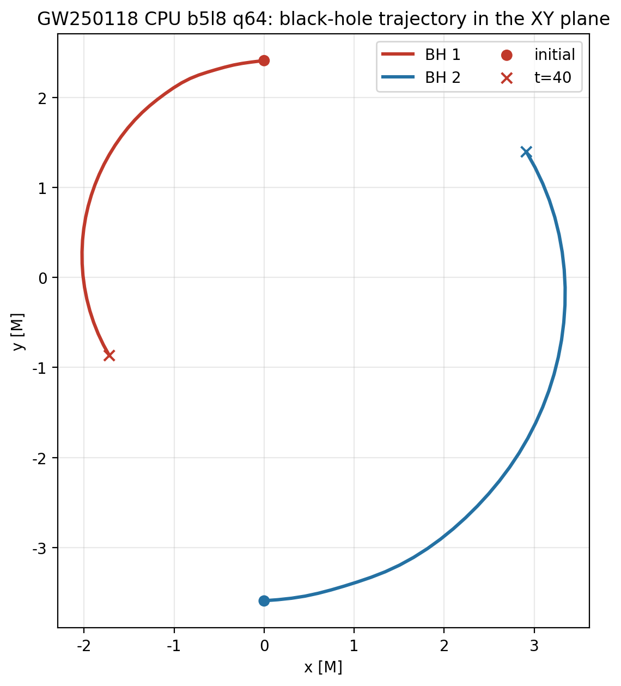

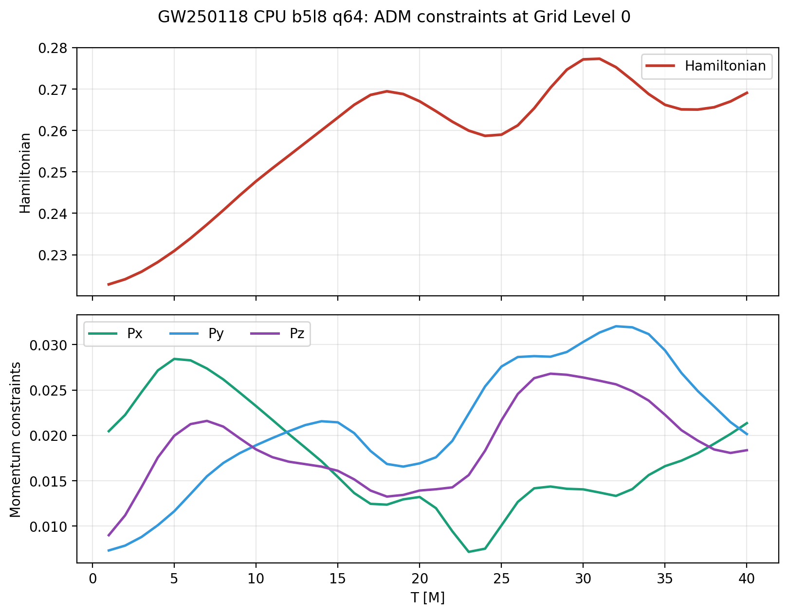

### GPU 结果图

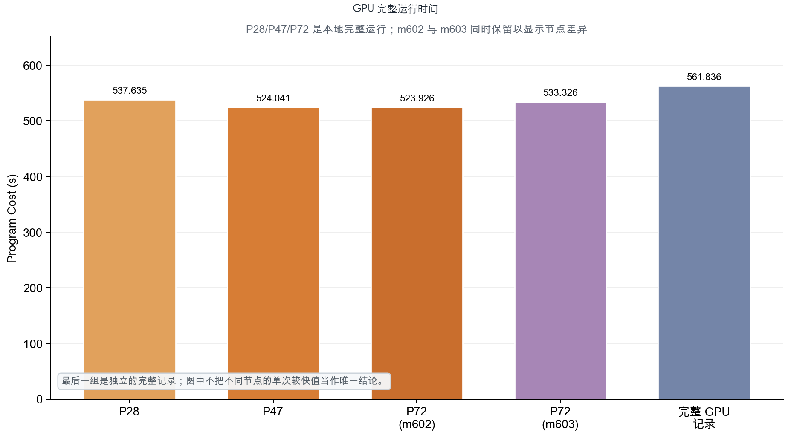

GPU P72 的真实 t=100 结果包含 100 个轨迹输出和 900 行 constraint 数据，黑洞轨迹图直接由这次运行生成。

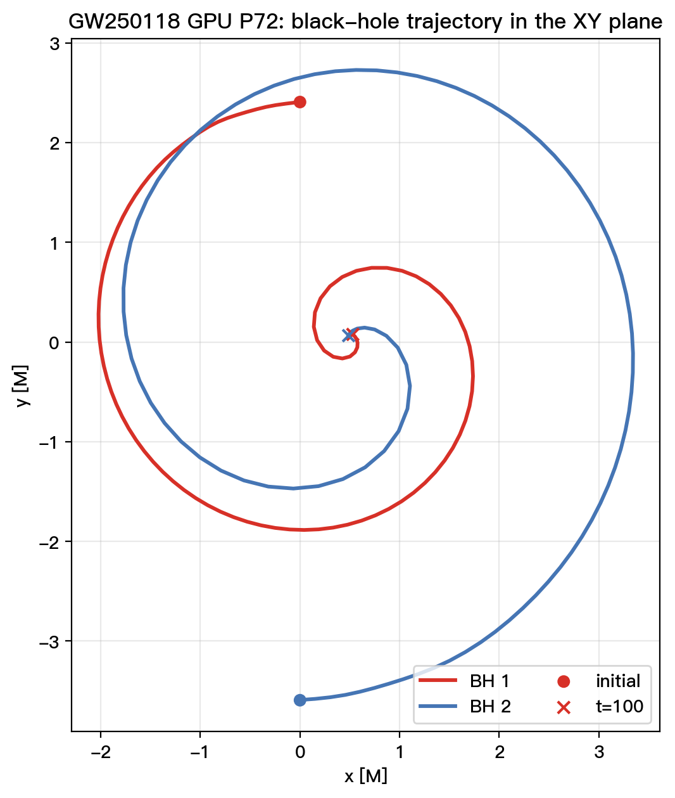

P72 保存的 Grid Level 0 四项约束在 100 个输出时刻中保持不变，直接画成曲线没有额外信息。因此这里展示真实运行中随时间变化的 Grid Level 1 约束；Grid Level 0 的门槛仍以 checker 检查的原始文本结果为准。

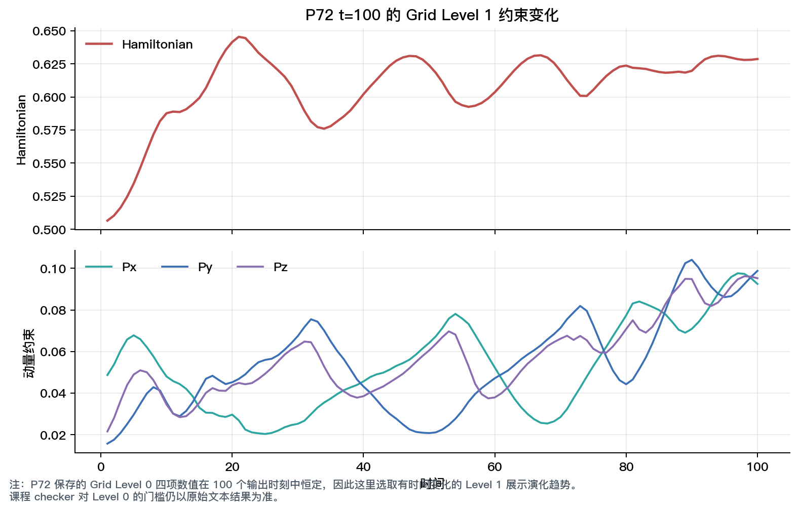

CPU 的三组 profile 表明，最终路径主要受 RHS、AMR 数据移动和 MPI 等待影响。GPU 的 P72 hotspot 也显示，RHS、粗细网格操作、平流项和数值耗散占据主要时间。

## 思考题

### AMSS-NCKU 的主要热点

更接近 stencil、稠密线性代数，还是通信/调度开销？

主演化更接近规则 stencil（用邻近网格点计算当前位置）的程序，而不是稠密矩阵乘法。CPU 最终 q64 的采样中，RHS（变量随时间的变化率）占 `31.64%`，平流和数值耗散占 `7.40%`，两类有限差分合计占 `8.30%`，这几项都需要读取相邻网格点。

不过 CPU 端也不能忽略通信和 AMR（自适应网格细化）数据整理，OpenMPI poll 占 `21.18%`，显式 MPI 通信再占 `3.71%`，数组复制、清零、粗细网格插值和回写合计占 `13.75%`。GPU 的 P72 Nsight 统计则更集中在网格 kernel 上，RHS 为 `38.0%`，平流和数值耗散为 `19.5%`，粗细网格插值和回写为 `27.3%`。

### CPU 上 MPI rank 和 OpenMP thread 如何权衡？

MPI rank 增多后，可以把更多 patch 分给不同进程，但也会增加通信、同步和进程管理开销；OpenMP thread 较多时，可以共享进程内数据，但会带来线程创建、barrier 和负载不均衡问题。实测中，MPI=30、OMP=1 的 b5l8/q64 配置为 `Program Cost=21.151 s`、`Evolve=8.185 s`；减少 MPI rank 后，每个 rank 处理的 patch 更多，端到端时间反而没有下降。

这并不说明 OpenMP 一定没有用，而是当前 patch 规模较小，线程开销难以摊薄。最终 q64 t=4 的平均活跃 CPU 为 `18.856`，也说明 AMR 工作和同步并不均匀。因此，本实验选择 MPI=30、OMP=1，是在当前网格划分和节点条件下的实测结果，不能推广成 MPI 总是优于 OpenMP。

### 程序中有哪些并行层级？

最外层并行由 MPI 负责。不同 rank 处理不同 patch，并在 ghost、粗细网格插值和边界更新时交换数据。patch 内部是三维数组循环，有限差分、RHS、平流项和数值耗散都在这一层执行。时间维度上，AMR 还要按照 level 和 RK stage 逐步推进；初值求解则包含谱网格迭代和内层线性求解。

GPU 路径保留了 patch 和 AMR 的组织方式，再将 patch 内的三维循环映射到 CUDA grid、block、warp 和 thread。GPU 优化没有改变算法的并行层级，主要是减少寄存器溢出、删去诊断路径中的无效工作，并改善粗细网格操作。

### 如何判断精度差异是合理浮点误差还是程序错误？

首先检查输出是否完整、时间点数是否正确，以及结果中是否出现 NaN 或 Inf；然后比较黑洞轨迹、constraint、Psi4 和 ADM 等结果。q64 paired t=40 中，BH 轨迹和 constraint 的对应值相同，Psi4 RMS 差异为 `5.08e-7`，ADM RMS 差异为 `2.85e-4`，且完整 checker 通过。这类差异来自分析积分点数量变化，没有影响主演化和轨迹，可以视为可接受差异。

如果误差随时间持续放大，或者只在 t=1 通过、到 t=4/t=40 失败，就不能简单归因于浮点舍入。`buffer=4`、最细层 L8=5、RK3 以及跳过 predictor 的尝试都属于这种情况。它们改变了边界、网格或时间推进所需的数据依赖，因此需要从算法正确性的角度处理。

### 一个 MIG 实例上是否使用多个 MPI 进程？

最终 GPU 路径使用一个 MPI rank。多个 MPI 进程共享同一个 `1g.10gb` MIG 的方案没有完成完整验证，因此不作为可用优化报告。增加 rank 可能带来额外 CUDA context、MPI 通信和 AMR 同步；在只有 10GB 显存的 MIG 实例上，单 rank 也更容易保持状态和日志一致。

MPS 可以改善多个进程共享 GPU 时的上下文调度，MIG 则提供硬件资源隔离，但二者都不能消除 AMR 本身的数据依赖。如果要验证多 rank 共享一个 MIG，必须同时记录 context、显存占用、通信开销和完整 checker 结果，不能只看某一个 kernel 的速度。

### Shared Memory 是否一定更好？

不一定。shared memory 能让同一个 block 的线程复用数据，减少重复的 global memory 读取，但它会占用片上资源，也可能带来同步和 bank conflict。寄存器和 shared memory 都是有限的，使用过多会降低同时驻留的 block 数。

多字段 advection batch 是一个反例。虽然它可以复用 beta 和坐标，但 batch 增大后，寄存器和 shared memory 的成本抵消了读取复用的收益，完整运行没有稳定改善。因此，shared memory 是否值得使用，必须结合 profile 和完整端到端时间判断，不能只凭“少了一次 global load”得出结论。

GPU 优化往往需要在多个片上资源之间做取舍。

### A100 40GB 和 80GB 有什么差异？

两者都基于 GA100，主要差异在显存。A100 40GB 使用 HBM2，峰值带宽约为 `1,555 GB/s`；A100 80GB 使用 HBM2e，峰值带宽约为 `2,039 GB/s`。因此，80GB 型号不仅容量翻倍，理论显存带宽也约高 `31%`。容量影响能否容纳更大的网格或更多 AMR level，带宽则主要影响反复读写三维数组的 kernel。

AMSS-NCKU 的 RHS、有限差分和粗细网格插值都属于这类访存密集工作，所以理论上可能从 HBM2e 受益。不过本实验使用的是 `1g.10gb` MIG 实例，实例只获得整卡的一部分资源；实际时间还会受到寄存器 spill、占用率和 AMR 调度影响。因此没有观察到能稳定归因于 40GB/80GB 型号差异的端到端提升。

参考资料：[NVIDIA A100 Tensor Core GPU Datasheet](https://www.nvidia.com/content/dam/en-zz/Solutions/Data-Center/a100/pdf/nvidia-a100-datasheet-us-nvidia-1758950-r4-web.pdf)；[NVIDIA A100 80GB 公告](https://nvidianews.nvidia.com/news/nvidia-announces-a100-80gb-accelerator-for-next-generation-ai-and-high-performance-computing)。

### 实验体验和建议

任务量真不少，希望有更多精力关注学习内容而不是调教 Agent😭

调了好几天也没有一个很好的成绩，zjgg手下留情😭

## Source Code

已提交在 oj 上。
