# Lab 5：Gemma4 端到端推理优化

!!! Abstract "写在前面"

    **实验平台：H800 PCIe MIG 1g.10gb，PyTorch / Triton / CUDA Graph**

    [点击查看报告 PDF 版](./lab5.pdf)

??? note "相关学习资料"

    【\[LLM推理\] 深入理解大模型量化：GPTQ 原理解析】 <https://www.bilibili.com/video/BV1UjiuBFECB>

    <https://bfyes.github.io/study/hpc/notes/0716p/#prefilldecode-与推理调度>

    <https://bfyes.github.io/study/hpc/notes/0717a/#高效-attention-与内存访问>

    <https://bfyes.github.io/study/hpc/notes/0717a/#量化推理与服务调度>

本次实验中我们使用的是剥离多模态 tokenizer 后的 Gemma4-12B 模型

以 `delta_nll` 验证量化质量；以 `elapsed_s`、首token时延（TTFT）和逐token时延（TPOT）记录推理性能。

OJ 四舍五入成绩：100（99.597）。ΔNLL=0.092529，性能用时=36.806s，Task 1=100.00，Task 2=99.33。

## 总览（更新日志？）

<span style="text-decoration:line-through;">其实看这些就够了💦💦💦</span>

| 阶段 | 改动 | 质量/性能 |  |
| --- | --- | --- | --- |
| RTN Round‑To‑Nearest | INT4 取整 | `delta_nll=0.290577` | 质量基线 |
| GPTQ v1 Generative Pre‑trained Transformer Quantization | 初版 Hessian 误差传播 | 符号写反`delta_nll=0.411300` | 修复传播公式 |
| GPTQ v2/v5/v6 | 对称量化、阻尼与校准扫参 | 质量不稳定 | 保留最大值阻尼 `0.01` |
| GPTQ v7 | 非对称 INT4、层间误差传播 | `delta_nll=0.097174` | 作为性能优化检查点（checkpoint） |
| v7 稳定化 | `max_tokens=4096`、确定性量化 | `delta_nll=0.092529` | 固定最终量化配置 |
| Python dequant 反量化 | 解包→BF16 权重【存入显存】→调用 API | `165.418s` | 定位到重复反量化，现存反复写入/读取 |
| Triton 反量化， cuBLAS 完成矩阵相关任务 | **prefill** 反量化放到 Triton | `115.214s` | 保留prefill 路径 |
| SDPA Scaled Dot‑Product Attention，缩放点积注意力 | prefill使用 Flash Attention | `88.851s` | 保留，避免手工注意力计算 |
| Triton 融合 INT4 GEMV 矩阵‑向量乘 | **decode** 中解包并直接点积 【采用寄存器】 | `55.311s` | decode 主路径 |
| CUDA Graph / 静态缓冲区 | 减少decode调度与临时张量 | 约 `42.1s` | 保留 |
| 分块参数重调 | `BLOCK_N=16, BLOCK_PK=128` | 多次复测中位约 `36.92s` | 👌 |

每 6 层中有 5 个滑动窗口注意力层、1 个全局注意力层（交替，共 40 个滑动窗口层和 8 个全局层。

生成阶段每个 token 都要经过 48 层、328 个 Linear（线性算子），decode因而成为主要耗时；KV 缓存则可按层处理：滑动窗口层只保留最近 1024 个token的环形缓冲区，全局层保留完整上下文。

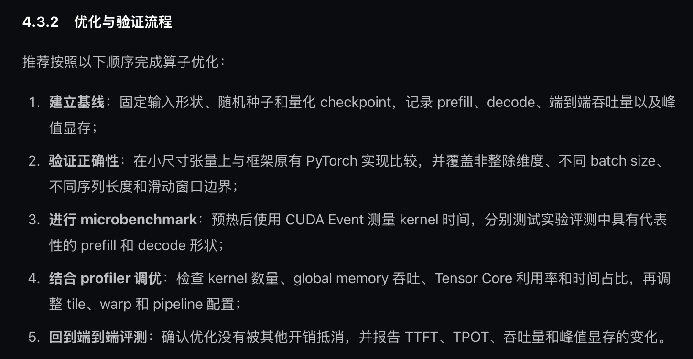

有了 RTN 基线，接下来开始优化。任务一要满足量化的正确性（正确性也是任务二速度优化的前提）。量化对时间卡的没那么死，可能是因为这是一次性的工作🤔（？）

报告中任务一不会强调时间问题。

## 量化正确性（任务一总览）

RTN 按组取整，`delta_nll=0.290577`；修正符号错误后的对称 GPTQ 仍为 `0.212204`，说明仅有 Hessian 补偿不足以覆盖该模型的权重分布。

| 版本 | 改动 | mean_nll | delta_nll |
| --- | --- | ---: | ---: |
| BF16 | 参考结果 | 2.308456 | 0.000000 |
| RTN | 按组 INT4 直接取整 | 2.599032 | 0.290577 |
| GPTQ v1 | 误差传播符号错误 | — | 0.411300 |
| GPTQ v2 | 修正符号，对称量化 | 2.520659 | 0.212204 |
| GPTQ v5 | `阻尼大小 damp_percent=0.001` | 2.545289 | 0.236834 |
| GPTQ v6 | 均值阻尼，0.01 | 2.566976 | 0.258521 |
| GPTQ v7 | 非对称量化 | 2.405629 | 0.097174 |
| 最终配置 | 扩大校准并固定确定性设置 | 2.400984 | 0.092529 |

最终量化采用 GPTQ INT4，分组 128，求解块 128，阻尼 1%(`group_size=128`、`block_size=128`、`damp_percent=0.01`)，非对称量化，开启层间误差传播。

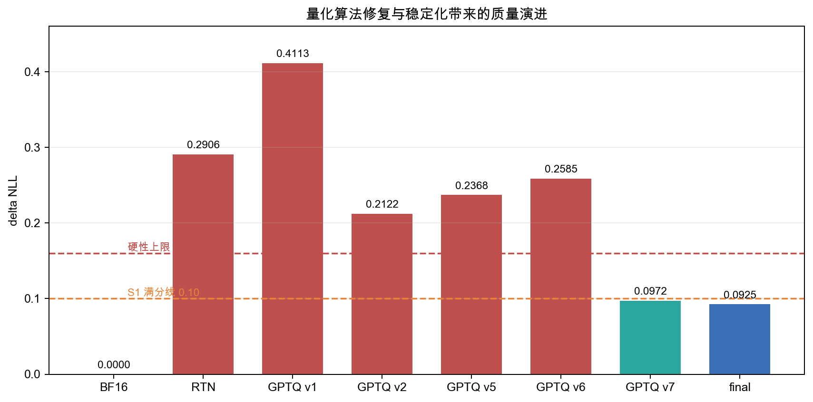


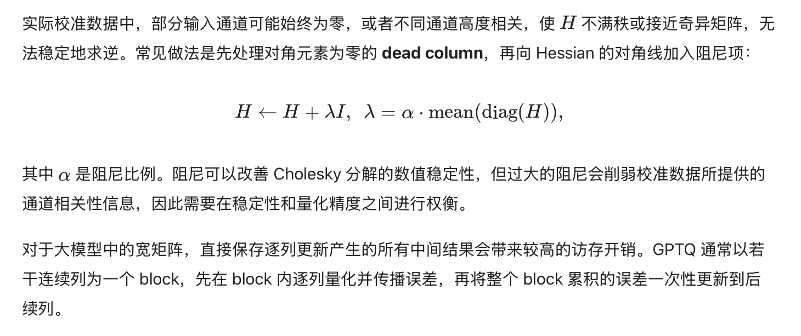

非对称量化将 `delta_nll` 从 `0.2122` 降至 `0.0972`。阻尼过小和均值阻尼均使结果退化，因此最终保留最大对角线基准的 `0.01` 阻尼。v3、v4 未形成有效结果文件，不列入比较。


<span style="text-decoration:underline;">v7 在不同 MIG 实例上曾出现 `delta_nll=0.0956` （计算节点）与 `0.1203`（OJ） 的差异。</span>

- 将校准 `max_tokens` 从 1024 扩至 4096 （用更长的校准序列，Hessian 的统计更充分，降低对 GPU 浮点归约微小噪声的敏感度，减轻不同 GPU 实例之间结果漂移。）
- 启用确定性算法（让 GPU 运算尽量固定浮点计算顺序，消除随机归约带来微小浮点数差异。）
- 固定 cuBLAS 工作区（不让 cuBLAS 动态改变内部分块策略，避免不同运行路径带来浮点偏差。）
- 禁用量化阶段的非确定性 Flash SDPA 后端。

最终质量评测为：`nll_sum`=49023.297301, `token_count`=20418, `mean_nll`（平均）=2.400984293, 

参考`mean_nll`=2.308455530, `delta_nll`=0.092528763。

2048 长度桶的 `delta_nll=0.112533215` 仍高于其他长度桶，说明长序列对校准覆盖和 KV 缓存实现更敏感。

## 任务二总览

### Python 反量化基线

最初每个线性层都先由 PyTorch 解包 INT4、逐元素反量化并展开（物化）临时 BF16 权重，再调用矩阵乘法。328 个线性层在每个 decode 步骤重复这一过程；临时权重写回、再次读取及频繁启动同时放大了带宽、分配和调度开销。

基线端到端时间为 `165.418s`。

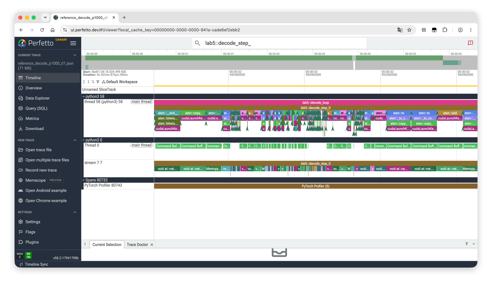

`QuantizedLinear` 走 PyTorch 的解包、逐元素 scale/zero 计算、展开 BF16 权重，再执行 `F.linear`。GPU 轨道中混杂大量逐元素复制（aten::copy_）和 GEMM 内核。该单步的 profiler CUDA 时间为 `1.646s`；融合路径的稳定decode步骤为 `152–156ms`。

### 性能演进

| 版本 | 改动 | elapsed_s | generated_tokens |
| --- | --- | ---: | ---: |
| Python 反量化基线 | 逐元素反量化 + BF16 matmul | 165.418173 | 276 |
| Triton 反量化 + cuBLAS | 快速反量化后走 cuBLAS | 115.214324 | 320 |
| + SDPA | prefill使用 Flash Attention | 88.851122 | 238 |
| + INT4 GEMV | decode不再物化 BF16 权重 | 55.311296 | 292 |
| + 预热 / 调度优化 | 预编译内核，减少首次开销 | 约 42.1 | 320 |
| + CUDA Graph / 生成优化 | 图捕获，消除 Python 开销 | 36.371238 | 320 |

GEMV: GEneral Matrix Vector Multiply

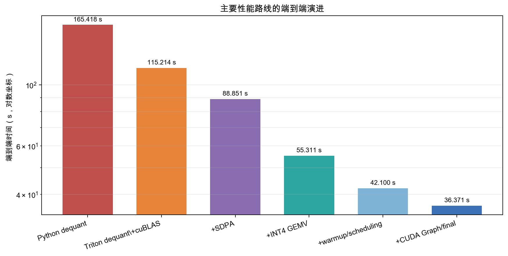

## 主要性能优化

### Triton 反量化 + cuBLAS

第一版优化将反量化移入 Triton，再把 BF16 权重交给 cuBLAS GEMM。（prefill GEMM）

端到端时间从约 `165.4s` 降至 `115.2s`。完整 BF16 权重的写回和读取仍未消除。

### prefill注意力

prefill 是多token场景，适合直接使用 PyTorch SDPA：

```python
F.scaled_dot_product_attention(
    query,
    key,
    value,
    scale=1.0,
    is_causal=True,
    enable_gqa=True,
)
```

原始手工实现没有做 $1/\sqrt{d_k}$ 缩放，为了保持模型语义一致，SDPA 也必须显式传 `scale=1.0`。

`enable_gqa=True`。否则 16 个 Q head 和 8 个 KV head 的形状不匹配；如果先 `repeat_kv`，又会引入额外复制。

SDPA 后端选择如下：

| 条件 | 结果 |
| --- | --- |
| `enable_gqa=True + is_causal=True` | Flash Attention |
| `enable_gqa=True + is_causal=False` | Flash Attention |
| 布尔掩码（bool mask）+ scale | 退化为数学后端（math backend） |
| 未显式 `enable_gqa=True` | Q/KV head 数不匹配 |

首个 prefill 分块使用因果 SDPA；多分块时才使用位置感知掩码。

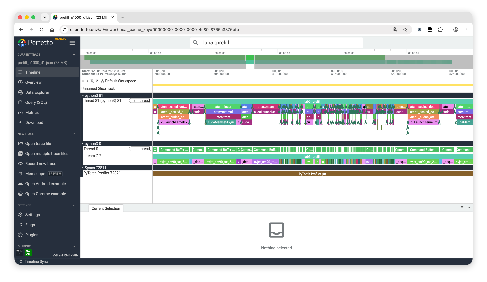

图中一次 `lab5::prefill` 同时包含 Triton 反量化、矩阵乘法和注意力相关内核；GPU 侧以较长的 Tensor Core/GEMM 片段为主。它与 decode 中的大量短内核不同，因此两条路径分别采用 SDPA + 反量化 GEMM 和融合 GEMV。

### decode 注意力

`q_len=1`（Query），SDPA 的调度开销占比更高，因此将 query 重排为 `[batch, kv_heads, group, head_dim]`；group = q_heads / kv_heads，key/value 保持 `[batch, kv_heads, seq_len, head_dim]`，再用 `einsum` 计算：

$$
\text{score} = \sum_d Q_{h,g,d}K_{h,t,d}
$$

$$
O_{h,g,d} = \sum_t \text{softmax}(\text{score})_{h,g,t}V_{h,t,d}
$$

这样避免 `repeat_kv` 物化复制，也避免 SDPA 对单 token query 的 dispatch 开销。

### INT4 融合 GEMV

decode时线性层输入为 `[1, hidden]`，属于 GEMV。最终内核直接读取 packed INT4 权重，在<span style="background:#E0E0E0; color:#FF0000;">寄存器</span>中解包、按组应用 scale/zero 并与输入向量点积，全程不物化 BF16 权重矩阵。

最终 kernel 配置：

| 参数 | 数值 | 含义 |
| --- | ---: | --- |
| `BLOCK_N` | 16 | 每个分块负责 16 个输出行 |
| `BLOCK_PK` | 128 | 每个分块处理 128 个 packed byte |
| 每 byte | 2 个 INT4 | little nibble packing |
| 每分块输入元素 | 256 | 对应 2 个量化组 |

该版本把端到端时间从约 `88.9s` 降至 `55.3s`。

为确认内核语义一致，使用随机 INT4 权重、FP16 scale/zero 和 BF16 输入，对比 Triton 路径与“PyTorch 反量化 + `F.linear`”参考路径。测试覆盖三个代表性形状，并同时测试 `M=1` 的融合 GEMV 和 `M=128` 的prefill路径

| 形状 `(N,K)` | M | max abs error | mean abs error | relative RMSE |
| ---: | ---: | ---: | ---: | ---: |
| `(4096,3840)` | 1 | 0.03125 | 0.00323849 | 0.00243019 |
| `(4096,3840)` | 128 | 0.06250 | 0.00513259 | 0.00342605 |
| `(15360,3840)` | 1 | 0.06250 | 0.00326463 | 0.00269273 |
| `(15360,3840)` | 128 | 0.06250 | 0.00516908 | 0.00342978 |
| `(3840,15360)` | 1 | 0.06250 | 0.00653317 | 0.00254138 |
| `(3840,15360)` | 128 | 0.12500 | 0.01042142 | 0.00344118 |

最大绝对误差来自 BF16 输出和浮点累加顺序差异，但相对均方根误差（relative RMSE）稳定在 `0.25%–0.35%`。更重要的是，同一量化检查点在 `BPK=256` 和 `BPK=128` 下的端到端 `delta_nll` 完全一致，说明分块参数重调没有引入语义变化。

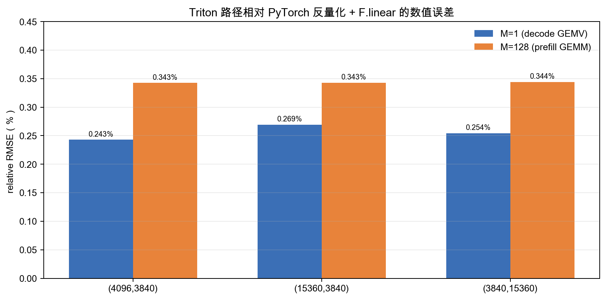

收益主要来自 decode 的访存路径：

- 权重只读一遍；
- 输入向量可以放在寄存器或 shared memory 中复用；
- 每次只输出一个 token；
- 生成完整 BF16 权重矩阵的中间写回完全浪费。

融合 GEMV 把“读 INT4、解包、写 BF16、再读 BF16做乘法”变成“读 INT4、寄存器解包、直接乘加”。

下面三张图来自 PyTorch Profiler

在 1000 token提示词（prompt）后采集 8 个即时执行（eager）decode 步骤。第一张给出连续步骤全貌；后两张放大 `decode_step_4`，展示 CPU 侧 PyTorch 调用、CUDA 启动与 GPU 上重复 `_gemv_kernel` 的对应关系。

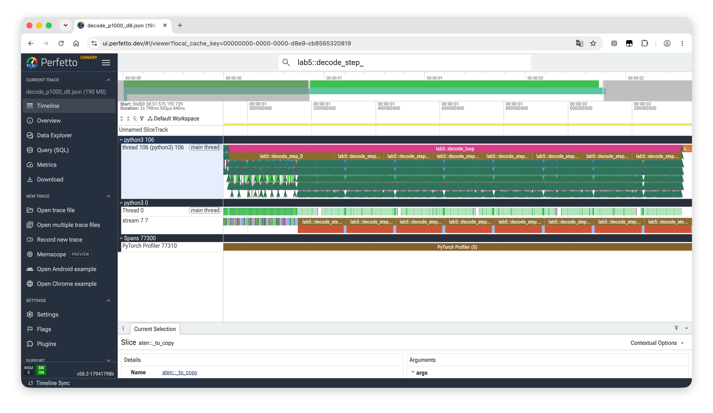

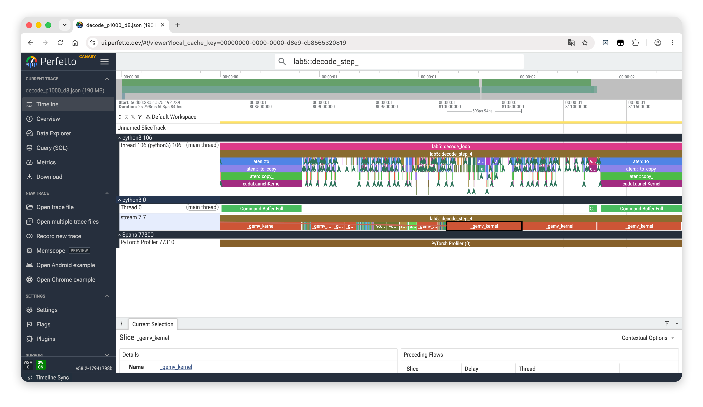

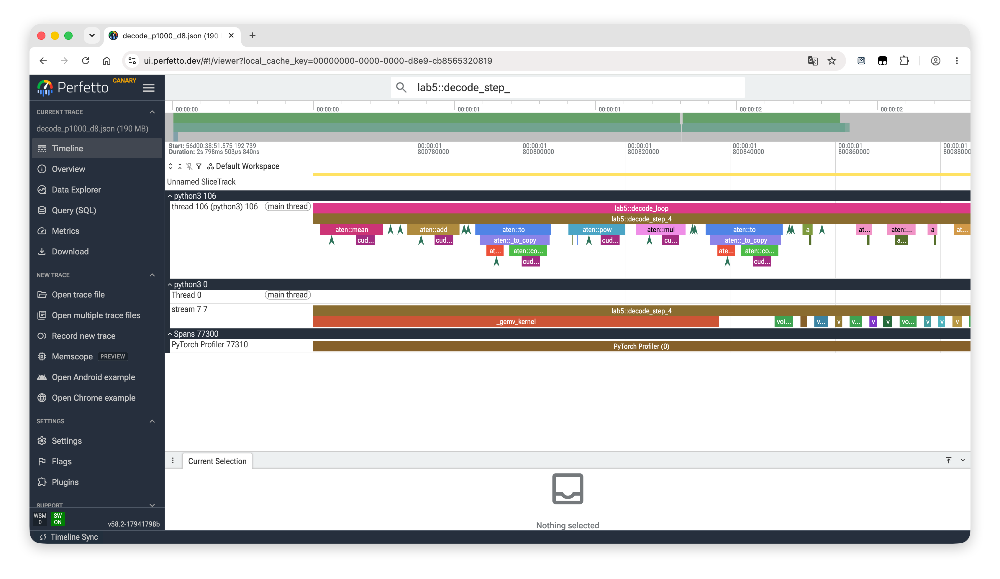

8 个步骤共调用 `_gemv_kernel` 2624 次，内核自身 CUDA 时间为 `913.275ms`，占采集区间的 `40.0%`，平均 `348us/次`。48 层中的多个线性层均在 `M=1` 时触发融合 INT4 GEMV；瓶颈是高频、带宽受限的短 GEMV 序列。

### CUDA Graph

INT4 GEMV 之后，剩余瓶颈变成 Python 调度和大量短内核启动。CUDA Graph 将一次完整的 decode前向捕获为静态图，之后每个token只重放一次。

| 问题 | 原因 | 修复 |
| --- | --- | --- |
| graph capture 中出现 CPU tensor | `embed_scale` 等标量在 forward 中创建 CPU tensor | 初始化时预分配到 GPU |
| OOM | 数据类型转换和临时显存生命周期管理不当 | 静态预分配缓冲区 |
| `inference_mode` 不兼容 | inference tensor 不能保存进 graph | capture/replay 包在 `inference_mode(False)` 中 |
| meta 设备缓冲区 | 捕获时不是真实 CUDA 内存 | 全部移动到 GPU |
| KV 缓存读到未初始化值 | `torch.empty` 未初始化 | 改成 `torch.zeros` |
| 每步 token/position/length 动态创建 | 图输入不稳定 | 静态预分配张量 |

最终 CUDA Graph 只捕获一次，decode 每步重放。开启 `synchronize_metrics=false` 后，逐步 CPU/GPU 同步也被去掉。

CUDA Graph 只减少 decode 的调度开销；prefill和 MIG 实例波动仍需由 SDPA、GEMV、分块与调度优化处理。

### 分块参数

在融合 GEMV 和 CUDA Graph 之后，剩余时间主要来自固定调度开销与每层 GEMV 的分块参数选择。

| 分块参数 | 每层 7 个线性层合计时间 (ms) |
| --- | ---: |
| `BLOCK_N=16, BLOCK_PK=128` | 1.269 |
| `BLOCK_N=16, BLOCK_PK=256` | 1.307 |
| `BLOCK_N=32, BLOCK_PK=128` | 1.313 |

## 性能分析

prefill合计约 `11.3s`，随提示词长度增长；decode耗时为 `131–182ms/token`。CUDA Graph 后单步生成约 `80.54ms`，其中 Python 开销约 `0.43ms`；328 个线性层的 INT4 GEMV 约占 `73ms/步`，262144 词表输出 logits 的 GEMV 约占 `8.67ms/步`。

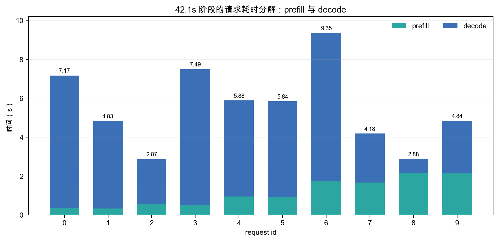

### 内核与显存分析

#### GEMV 分块测试

| 模块 | 输出维度 | `BN=32,BPK=512` ms/次 | `BN=16,BPK=256` ms/次 | 加速 |
| --- | ---: | ---: | ---: | ---: |
| q_proj | 4096 | 0.171 | 0.098 | 43% |
| k_proj | 2048 | 0.089 | 0.052 | 42% |
| o_proj | 3840 | 0.157 | 0.093 | 41% |
| gate_proj | 15360 | 0.569 | 0.337 | 41% |
| up_proj | 15360 | 0.569 | 0.337 | 41% |
| down_proj | 3840 | 0.634 | 0.338 | 47% |
| 每层合计 | — | 2.290 | 1.210 | 47% |

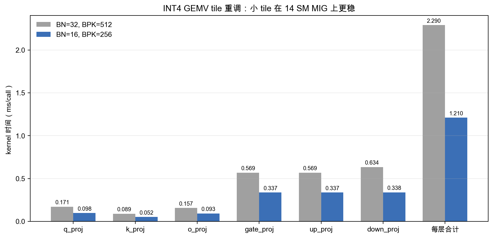

该图比较早期 `BN=32,BPK=512` 和 `BN=16,BPK=256`，表明减小输出分块可降低寄存器压力。最终版本进一步采用 `BLOCK_N=16, BLOCK_PK=128`；该参数由前文独立扫描确定。

#### W4A16 权重显存

最终量化目标共 328 个 Linear，原始权重参数量为：

$$
P=10{,}899{,}947{,}520
$$

按 `group_size=128`：

$$
G=\frac{P}{128}=85{,}155{,}840
$$

存储组成为：

| 数据 | 每组/每参数大小 | 总字节 |
| --- | ---: | ---: |
| qweight | 每参数 0.5 byte | 5,449,973,760 |
| scales | FP16，每组 2 bytes | 170,311,680 |
| zeros | uint8，每组 1 byte | 85,155,840 |
| **合计** |  | **5,705,441,280** |

即约 `5.31 GiB`。再加上：

- embedding：`262144 × 3840 × 2 ≈ 1.88 GiB`；
- 各层 RMSNorm、final norm 等小张量；
- PyTorch allocator、CUDA context 和 kernel workspace。

所以实际权重加载后已经占据显存的大头。这也是 BF16 权重缓存必然失败的原因。目标 Linear 的 BF16 权重就要约 20GB 以上，远超 10GB MIG。

#### KV Cache 显存

每个 KV cache 层以 `[batch, kv_heads, cache_size, head_dim]` 存储；BF16 的 K/V 两个张量字节数为：

$$
4B\sum_i H_iD_iL_i
$$

其中 $B$ 是 batch size，$L_i$ 是第 $i$ 层实际保留长度。

本模型有 40 个 sliding 层和 8 个 full 层：

$$
\text{KV bytes}
=
4B(
40\cdot 8\cdot 256\cdot \min(L,1024)
+8\cdot 1\cdot 512\cdot L
)
$$

化简为：

$$
\text{KV bytes}
=
B(
327680\min(L,1024)+16384L
)
$$

当 `B=1, L=2048` 时：

| 项 | 大小 |
| --- | ---: |
| 40 个滑动窗口层环形缓冲区 | 335,544,320 bytes |
| 8 个全局层完整缓存 | 33,554,432 bytes |
| KV tensor 合计 | 369,098,752 bytes |
| 环形缓冲区 `slot_positions` 元数据 | 327,680 bytes |
| **总计** | **约 369.4 MB** |

若不用环形缓冲区，所有层都按完整长度保留：

$$
4B(
40\cdot 8\cdot 256L
+8\cdot 1\cdot 512L
)
=345088BL
$$

`B=1, L=2048` 时约 `705.9 MB`。因此滑动窗口 KV cache 节省约 `336.8 MB`。

### 失败或未保留方案

| 方案 | 现象 | 原因 | 处理 |
| --- | --- | --- | --- |
| BF16 权重缓存 | OOM 风险高 | 10GB MIG 无法完整缓存 BF16 权重 | 回退 |
| gate/up 双输出融合 GEMV | 复杂度和寄存器压力上升 | 双 accumulator 竞争资源 | 回退为两个 GEMV |
| `BLOCK_N=32/64/128` | 性能下降 | 寄存器溢出、占用率不足 | 保留 `BLOCK_N=16` |
| SDPA decode | 比 GQA 广播慢 | `q_len=1` 时调度开销占比高 | 改为手工路径 |
| CUDA Graph 初版 | OOM / `inference_mode` 兼容问题 | 静态图和显存生命周期管理不当 | 修复后启用 |
| 修改 attention 排列 | 质量下降 | GQA head 与 KV head 映射不稳 | 回退并验证映射 |

这些对照实验表明：

- 14 SM 的 MIG 上复杂融合会受寄存器和占用率影响；

- decode与prefill应采用不同后端；

- CUDA Graph 必须配合静态内存；

- 注意力排列的任何改动都要先通过质量复测。

### 最终配置

`config.yaml` 关键项：

```yaml
engine:
  dtype: bfloat16
  device: cuda
  max_batch_size: 1
  seed: 42
  synchronize_metrics: false
  prefill_chunk_size: 2048

quantization:
  algorithm: gptq
  bits: 4
  group_size: 128
  symmetric: false
  scale_dtype: float16
  propagate_quantized: true
  calibration:
    gptq:
      block_size: 128
      damp_percent: 0.01

calibration:
  limit: 256
  micro_batch_size: 1
  max_tokens: 4096
```

| 文件 | 最终改动 |
| --- | --- |
| `config.yaml` | 稳定校准、关闭逐步同步、扩大 prefill 分块 |
| `engine.py` | 精确预热、CUDA Graph、静态生成缓冲区 |
| `attention.py` | prefill 走 SDPA Flash Attention，decode 走 GQA 广播 |
| `linear.py` | decode走融合 INT4 GEMV，prefill 走 Triton 反量化 + cuBLAS |
| `triton_kernels.py` | INT4 反量化 GEMV，最终 `BLOCK_N=16, BLOCK_PK=128` |
| `quantization/cli.py` | 确定性算法，固定 cuBLAS 工作区（workspace） |
| `quantization/methods/gptq.py` | 误差传播符号、非对称量化、阻尼和分块 |

### 稳定性复测（<span style="text-decoration:line-through;">Agent闲的，保留下来好了</span>）

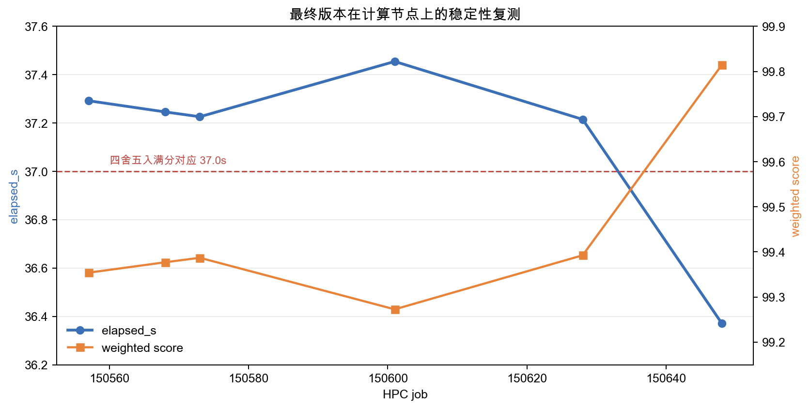

## 思考题

### W4A16 权重与 KV Cache 显存推导

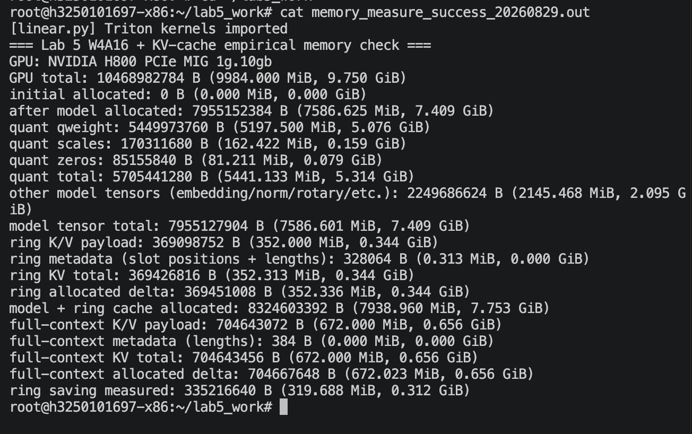

前面的“**4.1 内核与显存分析**”分别计算了 W4A16 目标权重和 KV Cache

**W4A16 权重结果**见前文“**4.1.2 W4A16 权重显存**”：328 个量化 Linear 的参数总数为

$$
P=10{,}899{,}947{,}520,
\qquad
G=P/128=85{,}155{,}840.
$$

前文表格中的三部分相加为：

| 项 | 前文结果（bytes） |
| --- | ---: |
| INT4 `qweight` | 5,449,973,760 |
| FP16 `scales` | 170,311,680 |
| uint8 `zeros` | 85,155,840 |
| **W4A16 目标 Linear 合计** | **5,705,441,280** |

即 `5,705,441,280 / 2^30 = 5.314 GiB`。这是量化 Linear 的裸权重，不包含 embedding（词嵌入层：输入 token id，查表输出向量）、RMSNorm（归一化层）、RoPE（旋转位置编码） 等未量化张量。

前文给出 BF16 embedding

$$
262144\times3840\times2
=2{,}013{,}265{,}920\text{ bytes}
=1.875\text{ GiB}.
$$

**环形 KV Cache 结果**见前文“**4.1.3 KV Cache 显存**”：40 个滑动窗口层保留 `1024` 个位置，8 个全局层保留完整的 `2048` 个位置。因此 K/V 数据本体为：

$$
4(
40\times8\times256\times1024
+8\times1\times512\times2048
)
=369{,}098{,}752\text{ bytes}.
$$

其中系数 $4=2\,(\mathrm{K/V})\times2\,(\mathrm{BF16\ bytes})$。环形缓冲区还需要 $40\times1024\times8=327{,}680$ bytes 的 `slot_positions`，以及 48 个层长度计数共 $48\times8=384$ bytes，所以：

$$
\text{KV Cache}_{\text{ring}}
=369{,}098{,}752+327{,}680+384
=369{,}426{,}816\text{ bytes}
=352.313\text{ MiB}.
$$


只计算“W4A16 目标 Linear + 环形 KV Cache”时：

$$
5{,}705{,}441{,}280
+369{,}426{,}816
=6{,}074{,}868{,}096\text{ bytes}
=5.658\text{ GiB}.
$$

若再加上前文单独列出的 embedding，则为：

$$
6{,}074{,}868{,}096
+2{,}013{,}265{,}920
=8{,}088{,}134{,}016\text{ bytes}
=7.533\text{ GiB}.
$$

这里仍未包含 norm、RoPE 等小张量以及运行时工作区，因此它不是完整推理引擎的峰值显存。

**实测**

集群上提交 Lab 5 GPU 任务，加载 `/home/<user>/quant_gptq_v7` 的 W4A16 checkpoint；随后按上述 40 个滑动窗口层与 8 个全局层的形状显式分配环形 KV Cache。每一步调用 `torch.cuda.synchronize()` 后读取 `torch.cuda.memory_allocated()`。该测试测量的是已加载模型 + KV Cache 的张量分配，不包含生成时可能出现的临时 workspace 或 CUDA Graph 工作区。

| 集群测量项 | 实测值 |
| --- | ---: |
| W4A16 `qweight + scales + zeros` | 5,705,441,280 bytes（5.314 GiB） |
| 其余模型张量（embedding / norm / RoPE 等） | 2,249,686,624 bytes（2.095 GiB） |
| 模型加载后 `memory_allocated()` | 7,955,152,384 bytes（7.409 GiB） |
| 环形 KV Cache 分配增量 | 369,451,008 bytes（352.336 MiB） |
| 模型 + 环形 KV Cache `memory_allocated()` | **8,324,603,392 bytes（7.753 GiB）** |
| 不使用环形缓冲区的 KV Cache | 704,643,456 bytes（672.000 MiB） |
| 环形缓冲区实测节省 | **335,216,640 bytes（319.688 MiB）** |

张量字节数直接相加也得到：

$$
5{,}705{,}441{,}280
+2{,}249{,}686{,}624
+369{,}426{,}816
=8{,}324{,}554{,}720\text{ bytes}
=7.753\text{ GiB}.
$$

**理论与实测的差异。** 加入前文单独估算的 embedding 后，`7.533 GiB` 比实测少约 `0.220 GiB`。

原因是该估算只包含 embedding，而没有包含其余未量化张量。将集群实测到的“其余模型张量”一并纳入后，完整张量理论值为 `7.753 GiB`，与 `memory_allocated()` 的实测值仅相差 `48,672` bytes（约 `0.046 MiB`）；<span style="color:#808080;">这一极小差值来自 PyTorch 的张量分配/对齐开销。因此，简化理论值应更少、实际值会更大；但完整地计入所有模型张量后，理论与实测几乎一致。</span>

环形 KV Cache 使“模型 + Cache”保留约 `2 GiB` 的余量；若改成所有层都保存完整 2048 长度，KV Cache 将多占约 `320 MiB`，在 10GB MIG 上会明显压缩临时张量和工作区的可用空间。

### 运行时稀疏注意力

<https://bfyes.github.io/study/hpc/notes/0717a/#高效-attention-与内存访问>

如果不知道注意力掩码形状，可以把稀疏模式变成运行时决策。可行方案包括

1. **Top-k 注意力**：先计算查询与少量标记token（landmark token）的粗分数，再只保留 top-k KV。
2. **分块选择（block selection）**：将 KV 切成分块，先以低精度粗评分选块，再对选中块做精确注意力。
3. **学习式路由**：训练轻量路由器（router）预测每个查询应访问哪些 KV 分块。
4. **哈希/聚类注意力**：将语义相近的查询和键聚到同一桶，只在桶内计算。
5. **动态窗口**：保留局部窗口，同时对远处 token 做 importance scoring，按需扩展。

相比固定滑动窗口，动态稀疏可能获得更好的语义覆盖：部分token需要长程信息，部分token只需要局部上下文，静态窗口无法区分，但代价也很明显

- top-k 或路由器本身需要额外计算；
- 动态索引会造成负载不均；
- Flash Attention 更适合规则分块，不规则访问会破坏其访存模式；
- prefill中查询和键的依赖关系更复杂；
- 稀疏选择一旦出错，质量损失比静态窗口更难预测。

动态稀疏在长上下文和更大批量时更有潜力；但在本实验条件下，固定滑动窗口加环形 KV 缓存是更稳定的选择。

### 分层量化与推理 Offloading 的异同

**相同点**

两者都把全模型一次性驻留的问题拆成 layer 级别的数据管理问题：

1. 都需要明确每层数据的生命周期；
2. 都依赖预取和缓存来隐藏搬运开销；
3. 都要避免重复加载或重复计算；
4. 都需要处理静态 shape 和异步执行。

**不同点**

分层量化是一次性的离线过程

- 输入是 BF16 权重和校准激活；
- 每层需要收集 Hessian；
- 当前层量化后可以释放 BF16 权重；
- 输出是永久的 INT4 权重；
- 关心的是<span style="text-decoration:underline;">数值稳定和层间误差传播</span>，而不是单次延迟。

推理 Offloading 是反复执行的在线过程

- 输入是已量化权重和用户请求；
- 每层权重在需要时从 CPU/NVMe 搬到 GPU；
- KV cache 和激活必须与请求生命周期绑定；
- 必须用计算掩盖 PCIe/内存延迟；
- 关心的是 <span style="text-decoration:underline;">TTFT、TPOT 和吞吐量</span>。

换句话说，量化阶段的“分层”是为了压缩和写出，Offloading 阶段的“分层”是为了按需加载。前者可以接受较长的离线时间来换取确定性，后者必须在每 token 的延迟预算内完成数据搬运。

## Source Code

已提交在 oj 上。
