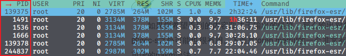

# 07-06 下午：集群软硬件及运维基础

下面是一条最小的课程项目路径。假设本机已有 `solver/` 源码，集群登录节点叫 `login.example.edu`，项目放在家目录下。

```bash
# 本机：把源码同步到登录节点
rsync -avP ./solver/ user@login.example.edu:~/solver/

# 登录节点：准备工具链并构建
ssh user@login.example.edu
cd ~/solver
module load gcc openmpi
cmake -S . -B build
cmake --build build -j 4

# 登录节点：提交作业，计算节点随后执行脚本
sbatch run.sbatch
squeue -u "$USER"
```

这几行命令已经跨过三个不同的位置。本机负责发起连接和传输文件；登录节点负责编辑、配置、编译与提交；计算节点由调度器分配后才运行 `run.sbatch` 中的 `srun ./build/solver ...`。日志通常写回共享目录，因此作业结束后仍在登录节点查看。

其中任何一步停住，都应从该步的直接输出开始。`rsync` 连接不上时先看本机路由、域名和 SSH；构建时报头文件或库错误时检查模块、路径和编译命令；作业排队时查看分区、资源请求和 Slurm 状态。把编译错误拿去修改网络、或在登录节点上直接长时间运行数值程序，都不会缩小问题范围。[^slurm-overview]

!!! quote "命令行建议"

    在终端中排查问题时，命令的输出比猜测更可靠。先用一个小命令观察文件、路径、进程或网络状态，再根据输出缩小范围。[^ustc-linux101]

!!! tip "保留一份可复查的运行记录"

    记录实际执行的命令、时间、主机名、退出码和标准错误。`ssh -vvv`、`module list`、`srun hostname`、`ldd` 和作业输出文件观察的对象不同。一次只让一条命令回答一个问题，后面的判断才有依据。

## 从个人电脑到集群作业

登录、构建和提交使用的是同一份项目文件，却不处在同一个运行环境。SSH 连接建立后，shell 仍在登录节点；`sbatch` 只登记资源请求和脚本；真正的程序进程要等调度器选定计算节点后才启动。

一个脚本通常同时写下三类信息。

| 脚本部分 | 谁读取它 | 作用 |
| --- | --- | --- |
| `#SBATCH` 行 | `sbatch` | 请求节点、CPU、GPU、内存和时间上限 |
| `module load`、`export`、`cd` | 作业启动后的 shell | 选择工具链、环境变量和工作目录 |
| `srun ./solver ...` | Slurm 与计算节点 | 在已分配的资源中启动实际进程 |

这一区分解释了常见现象。脚本能提交但运行时找不到 `mpicc`，通常是 `module load` 没有写进脚本；本机能看到的相对路径在作业中失效，通常是脚本开始时的工作目录不同；`squeue` 显示 `PD` 时，程序尚未开始执行，先看资源与分区状态。

下面各节会依次展开这条路径中的网络、Linux 文件接口、权限、编译库和作业日志。Lab 0 和 Lab 1 的命令都可以放回这条路径理解。

## 网络接口与链路层

主机通过网络接口控制器（NIC，网络接口控制器）接入网络。Linux 用统一的接口名表示物理网卡、Wi-Fi、回环接口和各种虚拟接口。

因此，看到一个接口名时，先检查它是否存在、是否启用、有没有地址，以及去某个目标时会不会经过它。物理网卡、回环接口和虚拟接口都通过同一套 `iproute2` 命令观察。[^iproute]

容器常用 `veth`（virtual Ethernet，成对出现的虚拟以太网接口）。VPN（Virtual Private Network，虚拟专用网络）常创建隧道接口；TUN（tunnel device，隧道虚拟设备）则以 IP 包为单位承载这类流量。

```bash
ip -br link             # 接口名称、链路状态
ip -br addr             # 各接口上的 IPv4/IPv6 地址
ip route                # 路由表与默认路由
ip route get 10.0.0.10  # 到某个目标实际会走的路径
```


*图中展示不同形态的 NIC。排障时以 `ip link` 和路由表中的接口名为准。*

以太网帧在同一二层网络内按 MAC（Media Access Control，媒体访问控制）地址转发。二层网络可以先理解为一组由交换机直接连接的接口，帧在这组接口之间转发时不需要经过路由器。

交换机收到帧后，会从源 MAC 学习这个地址在哪个端口。目的 MAC 已知时，帧只会被发到对应端口。目的 MAC 尚未记录时，交换机会把帧复制到其他端口，这称为泛洪。

跨出本地网络后，路由器开始按 IP（Internet Protocol，互联网协议）前缀和路由表工作。它选择下一跳，也就是这个 IP 包接下来应交给的路由设备或目标主机。MAC 表和路由表回答的是不同层次的问题，因此 ARP（Address Resolution Protocol，地址解析协议）/邻居表与 `ip route` 也要分开看。


*图中 MAC 表只在一个二层广播域内有意义。广播域指交换机转发一帧广播消息时能够到达的那一组接口；路由器通常会把不同广播域隔开。跨网段访问仍需通过 IP 路由。*

### 管理网络与计算网络

集群常同时有管理网络和计算网络。管理网络用于 SSH、部署、监控和带外管理。带外管理是独立于操作系统业务网络的管理员控制通道，常用于查看硬件状态或远程开关机。

计算网络负责节点间的 MPI、RDMA（Remote Direct Memory Access，远程直接内存访问）和加速器通信。能 SSH 到登录节点，只能说明管理访问可用。计算节点之间的高速互连、GPU 互连和并行文件系统带宽仍需单独验证。

普通用户程序通过 MPI、NCCL（NVIDIA Collective Communications Library，NVIDIA 集合通信库）或系统库使用这张网络，不需要直接配置交换机。

## IP、子网与默认网关

IPv4 地址和 CIDR（Classless Inter-Domain Routing，无类别域间路由）前缀共同描述接口所在子网。以 `192.168.136.23/24` 为例，前 24 位表示网络部分，等价掩码为 `255.255.255.0`。

目标地址落在同一前缀时，主机在本地网段内通过 MAC 地址寻找目标。目标不在本地子网时，主机把 IP 包交给默认网关。默认网关通常是一台出口路由器，后续转发由它完成。IPv6 也用前缀长度表示网络范围。[^rfc8200]

```bash
ip route
# default via 192.168.136.1 dev enp0s31f6
# 192.168.136.0/24 dev enp0s31f6 proto kernel scope link src 192.168.136.23
```

上例中，`192.168.136.0/24` 表示直接可达的本地网段；`default via ...` 表示其他目标默认交给网关。VPN 和代理经常同时引入新接口、路由规则和 DNS 策略。浏览器可访问网页而 SSH 无法连接时，仍应使用 `ip route get 目标地址` 确认内核选择的实际出接口。


*图中只说明 MAC/IP 的职责边界，不包含完整 TCP/IP 协议栈。DNS、TCP 与 SSH 在下一节分别说明。*

## DNS、TCP 与 SSH

DNS（Domain Name System，域名系统）、TCP 和 SSH 处在不同层次。DNS 先把主机名解析为地址。TCP 再在两端建立可靠、按序的字节流。SSH 在 TCP 之上完成主机身份确认、用户认证和加密会话。

因此，主机名解析失败时先检查 DNS。端口不可达时检查路由、防火墙或服务。只有网络连接建立后，私钥和用户名等认证问题才有意义。[^ssh-man]

```bash
getent hosts login.example.edu    # 系统实际采用的名称解析结果
dig +short login.example.edu      # 直接查看 DNS 应答（若安装 dig）
nc -vz login.example.edu 22       # 只验证 TCP 端口连通性
ssh -vvv user@login.example.edu   # 认证和配置排障时才启用详细日志
```

`ping` 测试的是 ICMP（Internet Control Message Protocol，网际控制报文协议）是否回应。集群、云主机和校园网可能限制 ICMP，因此 ping 失败不能单独证明 SSH 或 TCP 22 不可达；相反，ping 成功也不证明目标主机的 SSH 服务和用户认证配置正确。


### 按层检查网络连接

可按从近到远的顺序检查。

- `ip -br link` 查看接口是否存在和是否处于 `UP`。
- `ip -br addr` 查看接口是否获得预期地址。
- `ip route get 主机地址` 查看内核选择的网卡和下一跳。
- `getent hosts 主机名` 查看主机名是否解析到预期地址。
- `nc -vz 主机名 端口` 查看 TCP 建连是否得到响应。
- `ssh -vvv` 查看主机密钥、用户名和密钥认证在哪一步失败。

| 报错 | 检查 | 含义 |
| --- | --- | --- |
| `Could not resolve hostname` | DNS、主机名、VPN 的 DNS | 尚未得到可连接地址 |
| `No route to host` | 路由表、网关、目标网段 | 本机找不到到目标的路径 |
| `Connection refused` | 目标主机、端口、服务 | 通常已到达目标，端口没有服务监听 |
| `Connection timed out` | 地址、ACL（Access Control List，访问控制列表）/ 防火墙、目标状态 | 请求可能被丢弃，原因需结合路径判断 |
| `Permission denied (publickey)` | 用户名、私钥、公钥授权 | 网络已基本正常，失败在认证阶段 |

### 从三条输出判断问题位置

设要连接 `login.example.edu`。先让名称解析、路由选择和端口测试各给出一条输出。

```bash
$ getent hosts login.example.edu
10.12.0.25    login.example.edu

$ ip route get 10.12.0.25
10.12.0.25 via 192.168.136.1 dev enp0s31f6 src 192.168.136.23

$ nc -vz login.example.edu 22
Connection to login.example.edu port 22 [tcp/ssh] succeeded!
```

这三行分别说明主机名已得到地址、内核已选出出接口和下一跳、目标 TCP 22 端口接受连接。随后若 `ssh` 报 `Permission denied (publickey)`，排查范围就收缩到用户名、私钥选择和服务器端公钥授权。

若第一条命令没有输出，后两步没有可靠的目标地址，先检查 DNS 或 VPN 的 DNS 配置。若第二条命令显示 `unreachable`，应查看路由表和网关；若第三条超时，名称和路由可能正确，问题转到防火墙、ACL 或目标主机状态。

## Linux 内核与用户空间

Linux 内核管理调度、虚拟内存、文件系统、设备驱动和网络协议栈。普通应用在用户空间运行，需要通过系统调用请求内核服务。

这种边界限制了进程能直接做什么。用户程序不能任意读取物理内存、操作设备寄存器或访问其他用户的文件。权限、挂载点、资源限制和容器隔离都建立在这层边界上。[^linux-syscall]


*用户态与内核态的分界是保护和资源管理的基础。系统调用会跨越该边界，普通函数调用不会。*

### 文件接口与文件描述符

Linux 将普通文件、目录、设备、管道和套接字统一为可通过文件描述符操作的对象。文件描述符是进程打开这些对象后获得的小整数句柄。标准输入、输出、错误通常对应描述符 `0`、`1`、`2`。重定向并不改变程序的计算，只是把这些描述符连接到文件或管道。

```bash
./solver input.dat > result.txt 2> error.txt
./solver input.dat 2>&1 | tee run.log
```

`>` 覆盖文件，`>>` 追加文件。`2>&1` 将当前标准错误重定向到当前标准输出，因此 `./solver > result.txt 2>&1` 会把两类输出写进同一文件。批处理作业应保留标准错误，因为动态库、权限和 MPI 错误经常只写在这里。

### 路径、挂载与工作目录

绝对路径从 `/` 开始，相对路径以当前工作目录为基准。路径能否访问不只取决于最后一个文件，也取决于沿途每一级目录是否允许穿过。

挂载点是把一个文件系统接到目录树某个位置的目录。例如外接磁盘或 NFS 目录会挂到 `/mnt/...` 或课程目录下。`findmnt -T` 可显示某个路径来自哪个挂载点，`namei -l` 可逐级检查路径权限。[^path-resolution]

```bash
pwd
realpath ./output/result.txt
findmnt -T "$PWD"
namei -l /home/user/project/output/result.txt
```

集群中的家目录、共享项目目录、scratch 和节点本地 `/tmp` 往往来自不同文件系统。

| 位置 | 常见用途 | 需要确认的风险 |
| --- | --- | --- |
| `$HOME` | 源码、配置、小结果 | 配额、元数据压力 |
| 共享项目/scratch | 大输入、检查点、跨节点结果 | 清理策略、并行 I/O 负载 |
| 节点本地 `/tmp` | 本作业临时文件、缓存 | 作业结束/节点重启后丢失 |
| 容器可写层 | 临时运行状态 | 容器重建后丢失 |


*图中共享挂载使各节点看到同一数据。带宽和并发写入正确性仍需由文件系统和程序共同保证。*

## 用户、用户组和文件权限

Linux 文件权限由属主、属组和其他用户三组 `r`、`w`、`x` 位表示。普通文件的 `x` 表示可执行；目录的 `x` 表示可穿过目录并按名字访问其中对象。缺少目录的 `x` 时，即使文件本身可读，也可能无法打开。[^path-resolution]

```bash
id
ls -ld project project/output
chmod u+x run.sh
chmod 640 secret.txt
```


*图中权限位只表达访问规则的一部分。ACL、挂载选项、SELinux/AppArmor 等由系统额外执行的安全策略，以及网络文件系统策略，还可能叠加额外限制。*

共享项目不应使用 `chmod -R 777` 作为默认方案。先建立正确的项目组和目录权限，再用 `umask` 控制新文件默认权限；私钥、token、配置密钥只允许必要用户读取。`ls -l` 只显示最后一级，遇到 `Permission denied` 时优先运行 `namei -l 路径`。

## Shell、管道与作业脚本

Shell 解析命令、展开变量、建立重定向和管道并启动子进程。脚本第一行 shebang 指定解释器；`set -euo pipefail` 能较早暴露未定义变量、单条命令失败和管道前段失败，但它不替代对输入、输出和返回码的业务检查。[^bash-man]

```bash
#!/usr/bin/env bash
set -euo pipefail

input=${1:?usage: $0 INPUT}
out=${2:-result.txt}
mkdir -p logs
./solver "$input" > "$out" 2> logs/solver.err
```

变量展开默认可能按空白拆词并触发通配符扩展，因此路径和用户输入通常应置于双引号中。运行脚本前先用一个小输入验证参数、输出目录和错误处理；提交作业前再把相同命令写进 Slurm 脚本，避免交互环境与批处理环境不一致。


*图中管道传递的是字节流。命令的标准错误仍需用 `2>` 或 `2>&1` 单独处理。图源为 Linux 101 - USTC。[^ustc-linux101]*

## SSH 远程登录与密钥

SSH 先用服务器主机密钥确认目标服务器身份，再使用密码、公开密钥或其他方法认证用户。私钥仅保存在客户端；公钥可放入服务器 `~/.ssh/authorized_keys`。OpenSSH 会拒绝权限过宽的私钥或配置文件，以降低本机其他用户读取密钥的风险。[^ssh-man]

```bash
ssh-keygen -t ed25519 -C "hpc-course"
ssh-copy-id user@login.example.edu      # 服务器允许时
chmod 700 ~/.ssh
chmod 600 ~/.ssh/id_ed25519
```


*图中 `Host` 是本机别名，`HostName` 是实际服务器地址。使用多个课程或集群账号时，可用不同别名和 `IdentityFile` 避免选错密钥。*

首次连接时应核对主机密钥指纹；已经信任的主机突然提示密钥变化，也应先确认原因。使用 `ssh -G 别名` 可查看 OpenSSH 最终采用的配置，使用 `ssh -vvv` 可判断客户端尝试了哪些密钥。端口转发和代理跳板应以课程或集群管理员文档为准，避免将私钥或本地敏感服务暴露到不受控网络。

## 编译、库与软件环境

从源码到可执行文件至少经过预处理、编译、汇编和链接。编译期找不到头文件，链接期找不到符号，运行期找不到共享库，发生在不同阶段；把三者分开能快速缩小错误范围。[^gcc-link]

```bash
cc -O2 -g main.c -o main -lm
# 编译期：fatal error: xxx.h: No such file or directory
# 链接期：undefined reference to `xxx'
# 运行期：error while loading shared libraries: libxxx.so: cannot open...
```

### 环境变量与模块的作用域

环境变量只传给当前 shell 启动的子进程。`export` 后，编译器、MPI launcher 和作业脚本才能继承它；修改 `.bashrc` 通常只影响以后启动的新 shell。HPC 环境使用模块（environment module）在同一系统中提供多套编译器、MPI 和数学库。构建和运行必须使用兼容的一组模块。[^lmod]

```bash
module purge
module load gcc openmpi
module list
which mpicc
mpicc --showme:command
```

将 `module list`、编译器版本、`mpicc --showme:command` 和 Git 提交写入日志。特别是 MPI 程序，编译时链接到的 MPI 实现和运行时加载的库不一致时，可能产生符号错误、启动失败或难以复现的性能差异。

### Git

Git 应保存源码、构建脚本、运行说明和少量配置，不应提交私钥、token、大型下载缓存、构建目录或受限数据。开始实验前先提交一个可编译、可通过小输入的基线；之后每一步性能改动单独提交，便于对比与回退。[^git-book]

```bash
git status
git diff --check
git add src/ CMakeLists.txt README.md
git commit -m "建立可运行的基线"
```

### 编译与链接的边界

下面用一个只有加法函数的小项目区分头文件、链接符号和运行期共享库。目录结构如下。

```text
mini-lib/
├── include/add.h
├── src/add.c
└── src/main.c
```

`add.h` 声明函数，`add.c` 提供实现，`main.c` 调用它。

```c
/* include/add.h */
int add(int a, int b);

/* src/add.c */
#include "add.h"
int add(int a, int b) { return a + b; }

/* src/main.c */
#include <stdio.h>
#include "add.h"
int main(void) {
  printf("%d\n", add(2, 3));
  return 0;
}
```

先把实现编译为共享库，再链接主程序。

```bash
mkdir -p build lib
cc -fPIC -Iinclude -c src/add.c -o build/add.o
cc -shared build/add.o -o lib/libadd.so
cc -Iinclude src/main.c -Llib -ladd \
  -Wl,-rpath,'$ORIGIN/../lib' -o build/demo
./build/demo                    # 输出 5
```

三类报错可以直接放回这条命令链理解。

| 现象 | 最早发生的位置 | 应检查什么 |
| --- | --- | --- |
| `add.h: No such file or directory` | 编译 `main.c` 时 | 头文件路径、`-Iinclude`、文件是否安装到预期前缀 |
| `undefined reference to add` | 链接主程序时 | 是否漏写 `-ladd`，库目录是否在 `-Llib` 中，库的顺序是否正确 |
| `libadd.so: cannot open shared object file` | 执行 `build/demo` 时 | 动态加载器的搜索路径、rpath、模块环境和运行节点的挂载 |

`-Wl,-rpath,'$ORIGIN/../lib'` 将运行期查找路径写入可执行文件。`$ORIGIN` 表示可执行文件所在目录，因此这里会找到同级 `lib/` 目录。课程项目更常通过环境模块或管理员提供的安装前缀管理这类路径，命令本身仍能帮助定位问题发生在编译、链接还是运行阶段。

静态库通常以 `.a` 结尾。链接时，所需对象代码会被复制到程序中。共享库通常以 `.so` 结尾，程序启动时由动态加载器定位并装入。

Linux 上的可执行文件和共享库通常采用 ELF（Executable and Linkable Format，可执行与可链接格式）。C++ 与 C、不同编译器版本或不同 C++ 标准库之间还会涉及 ABI（Application Binary Interface，应用二进制接口）。它决定编译后的函数调用、对象布局和库链接约定是否兼容。

Lab 1 自行构建 OpenMPI（开源 MPI 实现）、BLAS（Basic Linear Algebra Subprograms，基础线性代数子程序库）和 HPL（High Performance Linpack，高性能 Linpack 基准）时，应记录安装前缀、编译器、依赖库和配置参数。[^gcc-link]

```bash
ldd ./solver                       # ELF（可执行与可链接格式）文件；仅对可信文件使用
readelf -d ./solver | grep NEEDED
```

### 模块、包管理器与项目环境

系统包管理器负责操作系统级依赖；Python 的 `venv`、`uv` 或 Conda 负责项目级解释器和包；环境模块负责 HPC 工具链切换。它们服务范围不同。项目 Python 依赖应固定在项目环境中，不应随意用管理员权限修改系统解释器。[^python-venv]

```bash
python3 -m venv .venv
source .venv/bin/activate
python -m pip install -r requirements.txt
```

## 进程、前台任务与日志

Shell 启动外部命令后会等待其结束；命令末尾的 `&` 让它进入当前 shell 的后台任务表。SSH 会话关闭时，依赖该终端的任务可能收到挂断信号。数小时计算应由 Slurm 管理，日志和资源状态也随作业一起保存。[^proc]

```bash
sleep 300 &
jobs -l
ps -o pid,ppid,stat,etime,cmd -p "$!"
```

进程状态可能显示运行、可中断睡眠、等待不可中断 I/O、停止或僵尸等。观察时把 CPU 使用率、内存、I/O、输入规模与日志一起看；单次 CPU 百分比无法区分计算、锁等待和 I/O 等待。作业输出应包含命令行、hostname、输入版本和标准错误，避免只留下一个最终数字。



*图中 `ps`、`top` 和 `htop` 展示的列会因工具和系统配置不同而变化。图源为 Linux 101 - USTC。[^ustc-linux101]*

## 从源码到可运行程序

CMake 推荐在源目录外创建构建目录，使生成文件和二进制可整体删除而不污染源代码。配置阶段检查依赖并生成构建规则；构建阶段调用编译器；测试阶段执行已注册测试。[^cmake-tutorial]

```bash
cmake -S . -B build -DCMAKE_BUILD_TYPE=Release
cmake --build build -j 4
ctest --test-dir build --output-on-failure
```

调试版本通常保留符号并关闭或降低优化，性能版本保留必要符号并启用经验证的优化选项。每次切换编译器、模块或架构选项后，最好使用干净构建目录；旧对象文件可能与新头文件、ABI 或链接器设置不兼容。

### 动态库定位的实际检查

Linux 动态加载器按 RPATH/RUNPATH（Runtime Search Path，运行时搜索路径）、`LD_LIBRARY_PATH`、系统缓存等规则寻找共享库。登录节点与计算节点的模块或挂载路径不同，可能使同一可执行文件在两处加载到不同库或无法启动。在作业脚本中打印关键环境和 `ldd` 输出，能快速确认实际加载的库版本。[^ldso]

```bash
printf 'host: '; hostname
printf 'compiler: '; cc --version | head -n 1
printf 'modules:\n'; module list 2>&1 || true
ldd ./build/solver
```

## 集群上的数据移动与共享目录

`scp` 与 `rsync` 通过 SSH 传输文件。`rsync -avP` 适合中断后继续、只同步变化文件和显示进度；同步结束后可用文件数、大小或校验和验证完整性。不要把 build、缓存、密钥和大量临时结果无选择地同步到共享家目录。[^rsync]

```bash
rsync -avP --exclude 'build/' --exclude '.venv/' ./ \
  user@login.example.edu:~/project/
rsync -avP user@login.example.edu:~/project/logs/ ./logs/
```

NFS（Network File System，网络文件系统）或其他共享文件系统让多个节点看到同一目录树。它不自动解决多个进程并发写同一文件的布局、锁和失败恢复问题；大量小文件也会给元数据服务带来额外压力。Lab 1 配置共享目录后，先用小文件确认所有节点都能读写，再运行 MPI/HPL。

## 容器与资源隔离

容器使用宿主机内核，通过 namespace 和 cgroup 隔离进程视图与资源。它打包的是用户态依赖，不等同于完整虚拟机；镜像无法绕过宿主机的 GPU 驱动、网络策略、文件权限和调度配额。[^docker-containers]


*图中容器减少用户态环境差异，仍需要与宿主机的内核、驱动、挂载目录和资源限制兼容。*

在共享集群上应使用管理员支持的运行时，例如 Apptainer/Singularity 或课程平台指定的容器方式。提交前明确镜像版本、绑定目录、MPI 兼容性、GPU 映射和可写路径；先用一个节点的小输入验证，再扩大规模。容器能启动不代表多节点通信、共享存储和 GPU 访问已经正确。

## 集群节点与带外管理

典型集群包含登录节点、计算节点、存储节点和管理服务。登录节点用于编辑、编译、提交、查询和轻量测试；计算节点由调度器按申请资源分配。不要在登录节点长期占满 CPU、内存或 GPU，这会影响其他用户和管理服务。[^slurm-overview]

带外管理由 BMC（Baseboard Management Controller，主板管理控制器）提供独立于操作系统的硬件监控、远程控制台和电源管理。管理员通过这条通道查看硬件日志、远程控制台和电源状态；它在业务网络故障或操作系统崩溃时仍可能可用。

## 记录运行环境

一次可复现运行需要留下源代码、环境、输入、资源、正确性和测量方式。建议在项目根目录保留 `RUNBOOK.md`，或由脚本自动生成同样的运行记录。

| 项目 | 记录内容 |
| --- | --- |
| 源码 | Git commit、分支、是否有未提交修改 |
| 环境 | 模块列表、编译器、MPI、Python/容器版本 |
| 构建 | 配置命令、编译选项、安装前缀 |
| 输入 | 数据版本、shape、随机种子 |
| 资源 | 节点、task、CPU、GPU、内存、walltime（作业允许运行的最长时间） |
| 正确性 | 参考输出、校验和或误差容限 |
| 测量 | 命令、预热次数、重复次数和统计量 |

这份记录应能和提交脚本、标准输出、性能报告对上。程序变慢或结果变化时，先与上一次可用记录逐项比较。这样才能判断变化来自代码、编译器、资源分配、数据位置，还是共享系统负载。

## 常见问题的检查顺序

连接失败时，先检查接口、路由、DNS 和端口。认证失败时，再检查主机密钥、用户名和私钥。

程序无法启动时，检查路径、权限、模块和动态库。作业未启动时，查看 Slurm 状态和资源形状。运行变慢时，再测计算、内存、I/O、网络和同步。

每条命令只验证一个可观察条件。这样留下的日志才能形成可复查的证据链。

!!! question "Lab 1 前自测"

    在配置 NFS、OpenMPI 与 Slurm 之前，请确认自己能够完成以下操作。

    1. 使用 SSH 密钥登录 Linux 主机，并解释私钥为何不能提交到 Git。
    2. 使用 `ip route get`、`getent hosts`、`nc -vz` 区分路由、DNS 与端口问题。
    3. 用 `namei -l` 找出路径中阻止访问的目录权限。
    4. 在独立构建目录中编译程序，分辨头文件、链接符号和运行期共享库错误。
    5. 用 `rsync` 同步项目并排除构建产物与密钥。
    6. 记录一次运行的 Git 提交、模块、命令、资源和正确性判据。

    ??? tip "详细答案与检查方法"

        1. 私钥用于证明用户身份。提交到 Git 后，仓库历史、镜像或他人的 clone 都可能得到该私钥，因此私钥只应保存在本机受限路径中。
        2. `ip route get` 检查内核选择的出接口和下一跳；`getent hosts` 检查域名解析；`nc -vz` 检查目标 TCP 端口。三者分别对应路由、DNS 和服务可达性。
        3. `namei -l /完整/路径` 会逐级显示目录和文件的属主、属组与权限。任一级目录缺少必要的执行权限，都可能阻止访问。
        4. 头文件错误发生在编译期，常见信息是 `No such file or directory`；符号错误发生在链接期，常见信息是 `undefined reference`；共享库错误发生在运行期，可用 `ldd` 检查实际依赖。
        5. `rsync -avP --exclude 'build/' --exclude '.venv/'` 适合同步项目。私钥、token、下载缓存和大体积构建产物应加入排除规则或 `.gitignore`。
        6. 至少记录 Git commit、模块列表、构建命令、输入或随机种子、Slurm 资源参数、正确性检查和计时方式。这样才可比较两次运行的差异。

[^ustc-linux101]: USTC Linux User Group, *Linux 101*, <https://101.lug.ustc.edu.cn/>.
[^slurm-overview]: SchedMD, *Slurm Workload Manager Overview*, <https://slurm.schedmd.com/overview.html>.
[^iproute]: Linux man-pages, *ip(8)*, <https://man7.org/linux/man-pages/man8/ip.8.html>.
[^rfc8200]: S. Deering and R. Hinden, *Internet Protocol, Version 6 (IPv6) Specification*, RFC 8200, <https://www.rfc-editor.org/rfc/rfc8200>.
[^ssh-man]: OpenBSD, *ssh(1)* and *ssh_config(5)*, <https://man.openbsd.org/ssh>.
[^linux-syscall]: Linux Kernel Documentation, *System calls in the Linux kernel*, <https://docs.kernel.org/process/adding-syscalls.html>.
[^path-resolution]: Linux man-pages, *path_resolution(7)*, <https://man7.org/linux/man-pages/man7/path_resolution.7.html>.
[^bash-man]: GNU, *Bash Reference Manual*, <https://www.gnu.org/software/bash/manual/bash.html>.
[^gcc-link]: GCC, *Link Options*, <https://gcc.gnu.org/onlinedocs/gcc/Link-Options.html>.
[^lmod]: TACC, *Lmod User Guide*, <https://lmod.readthedocs.io/en/latest/010_user.html>.
[^git-book]: Scott Chacon and Ben Straub, *Pro Git*, <https://git-scm.com/book/zh/v2>.
[^python-venv]: Python Software Foundation, *venv — Creation of virtual environments*, <https://docs.python.org/3/library/venv.html>.
[^proc]: Linux man-pages, *proc(5)*, <https://man7.org/linux/man-pages/man5/proc.5.html>.
[^cmake-tutorial]: Kitware, *CMake Tutorial*, <https://cmake.org/cmake/help/latest/guide/tutorial/index.html>.
[^ldso]: Linux man-pages, *ld.so(8)*, <https://man7.org/linux/man-pages/man8/ld.so.8.html>.
[^rsync]: Rsync Project, *rsync(1) manual page*, <https://download.samba.org/pub/rsync/rsync.1>.
[^docker-containers]: Docker, *What is a container?*, <https://docs.docker.com/get-started/docker-concepts/the-basics/what-is-a-container/>.
