# 07-06 下午：集群软硬件及运维基础

在集群上远程运行一个程序，一条命令背后要同时满足多个条件。

| 环节 | 条件 |
| --- | --- |
| 网络 | 连接要先送到集群 |
| 进程 | 有权限访问运行所需的对象 |
| 软件环境 | 动态库能正确链接 |
| 容器与调度器 | 提供足够的资源 |

## 网络接口与链路层

网络连接先是物理问题。计算机需要网卡，需要网线、光纤或无线链路把网卡连到交换机/AP，再由驱动让操作系统识别这块网卡。每块网卡有一个 MAC 地址。它是链路层的地址，用来在一个局域网内把以太网帧送到正确的网口。

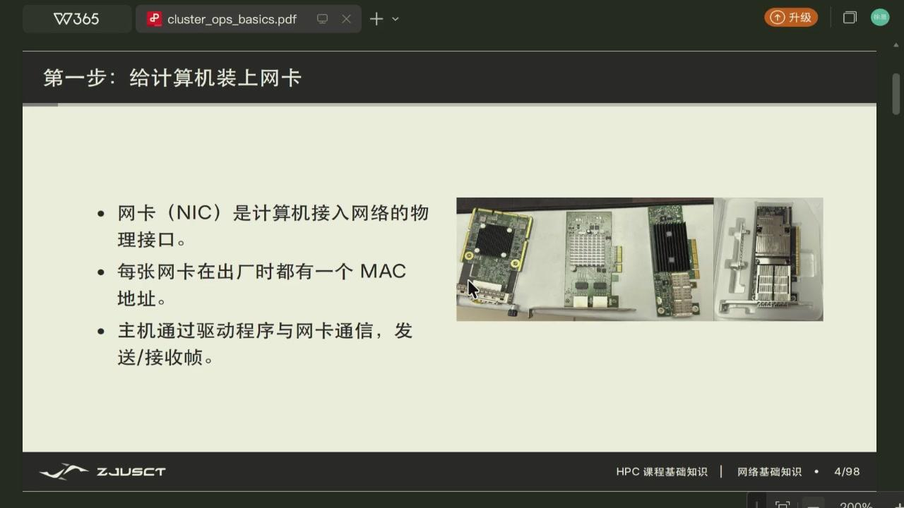

*图：NIC 的硬件形态各异；程序和 `ip link` 看到的是驱动注册后的接口，而不是 PCIe 卡本身。*

交换机主要根据 MAC 地址转发帧。它会学习某个 MAC 地址在哪个端口后面，下次再发给该 MAC 的帧就不必广播。路由器不同，路由器根据 IP 地址判断下一跳，负责把数据送往其他网络。

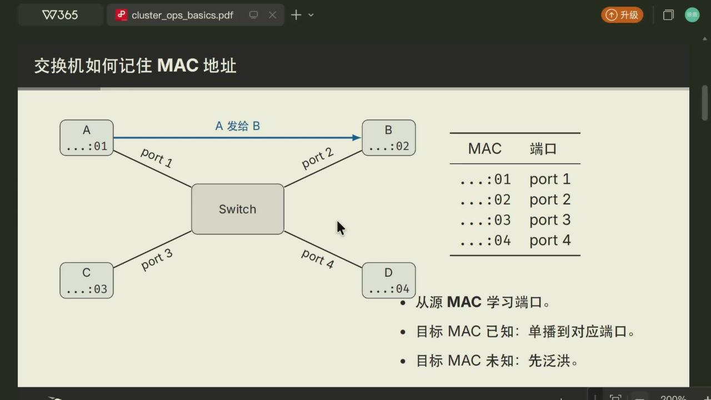

*图：交换机的 MAC 表把二层地址映射到物理端口。它学习源地址，查询目的地址。*

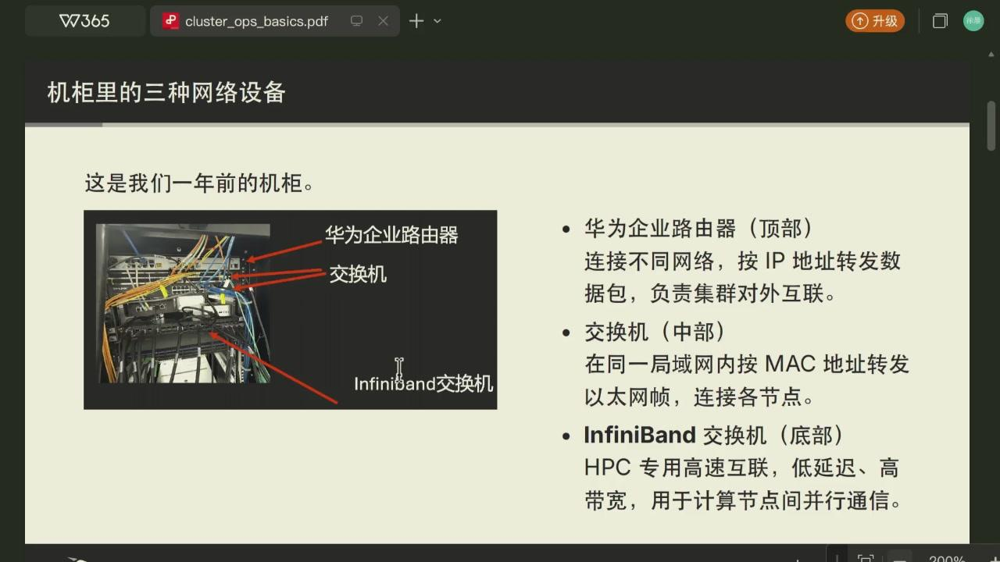

*图：同一个机柜可并存业务网络与高性能互连。看到网络时需先分清它连接的是管理访问、普通以太网，还是节点间计算通信。*

??? info "InfiniBand 是什么"

    InfiniBand 是面向高性能计算的互连体系。在介绍机柜时，它被与普通以太网交换机分开：它服务计算节点/加速器之间的低延迟、高带宽通信。程序通常不会直接操作一台 InfiniBand 交换机；MPI、NCCL 等通信库会依据可用硬件和驱动选择数据路径。它不替代 IP、DNS 或 SSH 所在的业务网络。

同一台电脑可同时有多个网卡，包括有线网卡、Wi-Fi、蓝牙、虚拟机或 VPN 创建的虚拟网卡等。研究 IP、路由和抓包等应先分清正在用哪张网卡。macOS 可在系统设置或 `ifconfig` 中看接口，Linux 中常用以下命令。

```bash
ip link                    # 接口是否存在、是否 UP
ip addr                    # 接口上的 IP 地址
ip route                   # 默认网关和路由表
```

`ip link` 显示接口处于 `DOWN`，说明问题还在链路层；接口有 IP 但没有默认路由，通常只能访问本地网络。


*图：课件中的接口状态输出。接口存在、处于 `UP`、获得地址和有路由是不同层次的事实。*

## IP、子网与默认网关

MAC 地址不能承担全球路由的工作。IP 地址给主机一个逻辑位置。IPv4 地址常写作 `192.168.1.23`，但单看地址不能判断两台主机是否同一子网，还要看子网掩码或 CIDR 前缀。

???+ info "子网掩码与 CIDR 前缀"

    一台主机属于哪个子网，由 IP 和前缀长度共同决定。CIDR 写法 `192.168.1.23/24` 里的 `/24` 表示前 24 位是网络号，主机号占剩下的 8 位。子网掩码只是同一信息的另一种写法，把前 24 位置 1、后 8 位置 0，就是 `255.255.255.0`。判断两台主机是否同一子网，只要看它们的网络号是否相同：`192.168.1.23/24` 和 `192.168.1.88/24` 网络号都是 `192.168.1.0`，属于同一子网，可本地直接通信；若一台是 `/24`、另一台是 `/16`，网络号不同，就要靠路由器转发。前缀长度越大（如 `/30`），子网越小、可分配的主机越少。

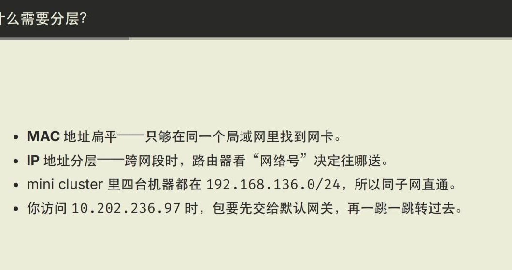

*图：MAC 负责同一局域网的下一跳，IP 负责跨网段的路由选择；二者各有分工，不能互相替代。*

例如 `192.168.1.23/24` 中 `/24` 表示前 24 位是网络号，即 `192.168.1.0/24`。同一前缀内的主机可以在本地二层网络里直接通信：发送方先通过 ARP 找到目标 IP 对应的 MAC，再把帧发出。若目标不在本地子网，发送方不能直接找到目标的 MAC，只能把包交给**默认网关**；网关再根据路由表把包转发出去。

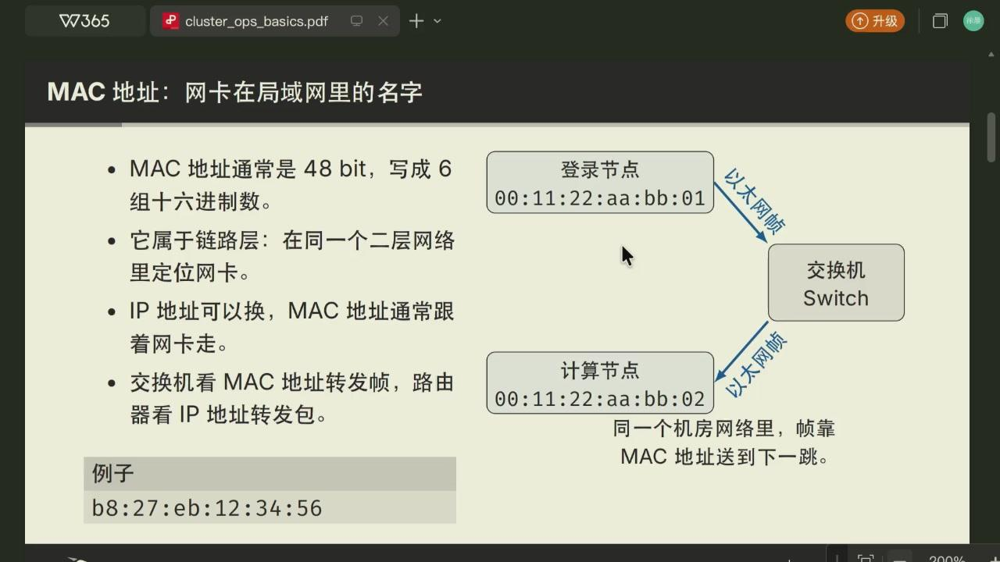

*图：MAC 地址标识当前二层网络中的接口；IP 地址用于决定包应前往哪个网络。*

??? info "ARP 在这里做了什么"

    应用只知道目标 IP 时，网卡仍需要一个可写入以太网帧头的目的 MAC。ARP 在本地网络查询这个 IP 对应哪个 MAC，并把结果暂存。目标在外网时，ARP 查询的是默认网关的 MAC，不是远端服务器的 MAC；远端地址仍保留在 IP 包头中，由路由器继续转发。

这里的地址分成两部分。

- IP 包从源 IP 到目的 IP 表示端到端的逻辑通信；
- 每经过一个路由器，下一跳所用的源/目的 MAC 都会改变。

家庭和校园网络常通过 DHCP 自动分配 IP、掩码、网关和 DNS 服务器。私有地址（如 `10.0.0.0/8`、`192.168.0.0/16`）不能直接在公网路由，出口通常用 NAT 把许多内网地址映射到少数公网地址。这也是为什么能访问内网、不能访问外网的现象，常常与网关、DNS 或出口策略有关。

IPv4 只有 32 位地址。私有地址加 NAT 缓解了地址不足，却让外部主机不能直接主动访问内网中的任意机器；端口映射、反向代理和 VPN 都是在处理这个边界。IPv6 使用 128 位地址，常写成多组十六进制数，例如 `2001:db8::1`。在同一台机器上看到 `inet6` 不代表某个服务已经能从 IPv6 网络访问：接口、路由、防火墙和服务监听地址仍要分别成立。

??? info "DHCP、NAT、DNS 不做同一件事"

    DHCP 给本机配置地址、掩码、网关和常用 DNS；NAT 在网络出口改写内网连接的源地址/端口；DNS 把域名解析成地址。访问一个网站失败时，三者都可能是原因：没有 DHCP 配置通常连本地网都进不去，DNS 失败时域名找不到地址，NAT/出口策略异常时可能只能访问内网。

## DNS、TCP 与 SSH

输入 `ssh user@host.example.edu` 后，系统不会把这串文字直接发给服务器。连接要依次经过下面几步。

1. DNS 把 `host.example.edu` 解析成 IP 地址；
2. 系统根据路由表决定该 IP 是本地直达还是交给默认网关；
3. IP 数据交给 TCP。TCP 通过端口区分服务，SSH 的默认端口是 22；
4. TCP 建立可靠连接后，SSH 协商加密与身份认证；
5. 应用数据向下封装为 TCP 段、IP 包、以太网帧；接收端按相反方向解封装。

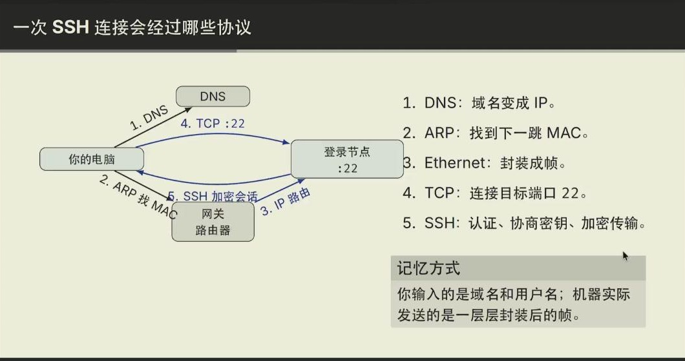

*图：SSH 位于应用层；DNS、路由和 TCP 已先完成各自的工作。它解释了为什么域名解析成功仍不保证能登录。*

发送端不会把 SSH 数据原样塞进网线。TCP 在它前面加上端口、序号等信息；IP 再加入源和目的 IP；最后的以太网帧只负责当前局域网这一跳，还会带上用于校验的 FCS。路由器转发时会更换链路层帧头，IP 包中的端到端地址仍保留。收到数据后，网卡、内核 TCP 栈和 SSH 进程按相反顺序处理这些层。

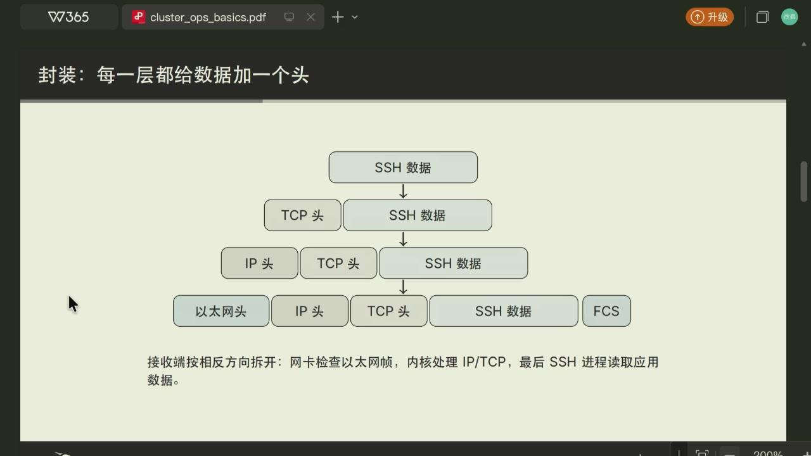

*图：同一份 SSH 数据在不同网络层携带不同的控制信息。*

DNS 是名字到地址的查询服务。它出问题时，域名连接会失败，但直接使用已知 IP 有时仍能通。可用：

```bash
nslookup host.example.edu
dig host.example.edu
ping -c 3 目标IP             # 只说明 ICMP 是否可达，不等于 SSH 可用
traceroute 目标IP            # 查看到目标的路由路径，Linux 常用 traceroute
nc -vz host.example.edu 22   # 检查 TCP 22 端口能否建立连接
```

端口是传输层的编号，不是程序的物理插口。服务器可以同时运行 SSH、Web、数据库等服务，操作系统依据目的端口把收到的数据交给对应进程。防火墙可以只允许 443、禁止 22；这时 DNS 和 ping 正常也无法 SSH。

### 网络连通性排查

连接失败不能统一归因于密码。接口/IP、DNS、路由、端口和 SSH 身份认证各自可独立失败；每次只验证一个边界，诊断才会收敛。

??? example "从域名到 SSH"

    `ip route` 中没有默认路由时，先修本机网络；有路由而 `dig host` 失败时，检查 DNS；域名能解析但 `nc -vz host 22` 失败时，问题在端口或防火墙；TCP 已连接才轮到密钥、用户名和服务器端权限。`ping` 只发送 ICMP，既不能证明 22 端口开放，也不能证明 SSH 认证成功。

## Linux 内核与用户空间

严格地说，Linux 是内核。课程中登录的系统还包括 Shell、基础工具、库、服务和用户空间程序。用户程序不能直接操作磁盘、网卡或 GPU；它通过系统调用请求内核，内核负责权限、资源仲裁和驱动交互。

```text
应用程序（Python、编译器、MPI、编辑器）
Shell / 库 / 系统调用接口
Linux 内核（进程、内存、文件系统、网络、驱动）
CPU、内存、磁盘、网卡、GPU
```

这种层次不是多余的。若任意程序都能直接控制硬件，一个错误程序就可能让全机崩溃或读取其他用户数据。内核把错误尽量限制在进程边界内，也把多用户之间的权限规则落实到文件、进程和设备上。

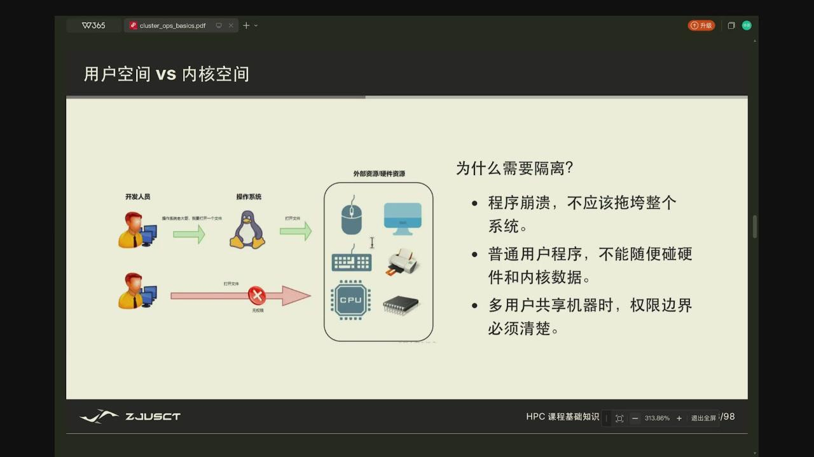

*图：用户态程序通过系统调用请求内核服务，不能直接读写设备或内核数据。*

Linux 发行版把内核、GNU/Coreutils、包管理器、系统服务和默认配置组合成可安装、可维护的系统。Ubuntu、Rocky Linux 或 SUSE 的命令细节会不同，进程、权限、文件系统和系统调用等内核语义仍然相通。

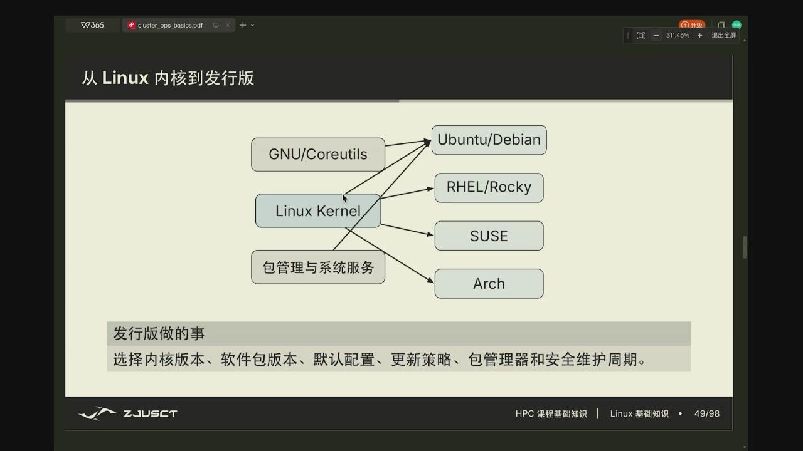

*图：发行版围绕 Linux 内核组织用户工具、软件包和系统策略，是一种交付方式，并非另一种内核原理。*

### 文件接口

Linux 用统一的文件接口表示普通文件、目录、设备和很多内核对象。磁盘、终端、网络相关对象常能在 `/dev`、`/proc`、`/sys` 等目录看到；它们可能不是普通文本，但能通过类似的打开、读、写接口访问。


*图：统一的路径和读写接口之下仍有不同对象类型；目录保存名字到 inode 的映射，设备和 socket 则连接到内核功能。*

???+ note "inode 是什么"

    一个文件在磁盘上不只是一个名字加一串内容。Linux 给每个文件分配一个 inode（index node），它专门存放这个文件的**元数据**：大小、权限、属主、时间戳，以及内容实际存在哪些磁盘块上。目录本身也是一个文件，它存的是子项名字到对应的 inode 编号这样的映射。于是目录保存名字到 inode 的映射这句话的意思是，目录只负责把路径里的名字翻译成 inode，真正的内容和权限都在 inode 里。这也解释了为什么统计磁盘占用、查权限、移动大目录等操作有时差异很大——它们读的主要是目录和 inode 的元数据，而不是把文件内容整个读一遍。

目录树从 `/` 开始，常用位置包括以下这些。

| 路径 | 常见含义 |
| --- | --- |
| `/` | 整棵目录树的根 |
| `/home` | 普通用户家目录的常见位置 |
| `~` | 当前用户家目录的 shell 缩写 |
| `/tmp` | 临时文件，不应存唯一副本 |
| `/etc` | 系统级配置 |
| `/dev` | 设备文件 |
| `/proc` | 暴露进程和内核状态的伪文件系统 |

相关命令。

```bash
pwd                         # 当前目录
ls -lah                     # 列出文件、隐藏文件、大小和权限
find . -name '*.c'          # 从当前目录查找文件
mkdir -p build results      # 创建目录
cp -r src backup-src        # 复制；原文件仍在
mv old new                  # 移动或重命名；会改变原路径
less output.log             # 分页读日志
head -n 20 file; tail -n 20 file
```

在共享集群上先用 `cp` 备份，再改动；`rm -r`、`chmod -R`、通配符和管理员权限要格外谨慎。

### 路径、挂载与工作目录

`/home/alice/project/a.cpp` 是绝对路径，从唯一根目录 `/` 开始；`src/a.cpp` 是相对路径，含义取决于当前目录。Shell 不会替你猜这个 `results` 是哪个目录，所以脚本中常先用 `cd` 进入明确目录，或把输入、输出写成绝对路径。`~` 只在 shell 展开为当前用户的家目录；程序接收到的是展开后的完整路径，不是字符 `~`。

目录树只有一个根，不代表所有路径都在同一块磁盘上。内核会把一个文件系统挂载（mount）到目录树的某个位置：例如本地 SSD 可以挂到 `/scratch`，网络文件系统可以挂到 `/home`。路径看起来连续，容量、速度、备份策略和是否随节点变化却可能完全不同。大规模临时输入放在节点本地 scratch 常能减少网络存储压力；要长期保留的代码和结果则应放课程指定的持久目录。

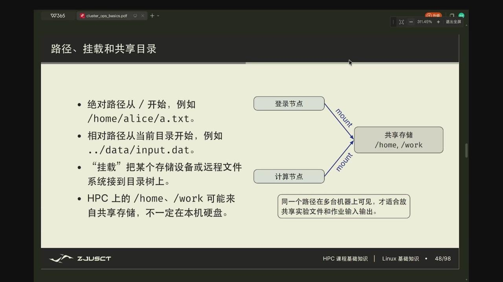

*图：`/home` 或 `/work` 在多台机器上名字相同，背后可能是共享文件系统；节点本地 scratch 则通常不会自动出现在别的节点。*

```bash
pwd                       # 确认脚本当前实际所在位置
df -h .                   # 当前路径属于哪个文件系统、剩余多少空间
findmnt -T .              # 当前路径的挂载来源和挂载点
du -sh results            # 结果目录实际占用的空间
```

!!! warning "删除前先展开目标"

    `rm -rf "$dir"` 只在 `dir` 已经是经过检查的具体项目目录时才有意义。空变量、错误的当前目录、通配符匹配过多文件都会扩大范围。先运行 `printf '%s\n' "$dir"` 和 `ls -ld -- "$dir"`，确认目标后再做不可恢复的删除。

???+ info "挂载（mount）是什么"

    文件系统本身有自己的根；mount 把它接到已有目录树的一处。挂载后访问 `/scratch/x`，内核会把请求交给挂在 `/scratch` 的文件系统。容器中的路径也可能是宿主机卷的挂载点，因此容器里看得到文件不代表它存放在容器可写层。

## 用户、用户组和文件权限

每个文件有 owner、group 和其他用户三组权限，每组包含 `r`（读）、`w`（写）、`x`（执行/进入目录）。`ls -l` 的第一列如 `-rw-r-----` 可分为：owner 可读写，group 可读，others 无权限。

八进制写法把 `r=4,w=2,x=1` 相加：`640` 表示 owner `rw-`、group `r--`、others `---`；`755` 常用于可进入、可执行的公开目录/脚本；`600` 常用于私钥。示例：


*图：普通文件的 `x` 表示可执行，目录的 `x` 表示可以穿过该目录访问其中对象；数字权限来自 `r=4`、`w=2`、`x=1` 的组合。*

```bash
chmod 600 ~/.ssh/id_ed25519
chmod 700 ~/.ssh
chmod u+x run.sh
chgrp project-team shared-data
```

目录的 `x` 是穿过/进入权限，不只是执行脚本。一个文件即使可读，若父目录没有相应的进入权限，也未必能访问到它。

权限检查沿路径逐级发生。读取 `/work/team/data.csv`，至少需要对 `/work` 与 `/work/team` 有 `x`，再对文件有 `r`；在目录中新建文件则需要目录的 `w` 和 `x`。这解释了两种常见现象：`ls` 能看到名字却无法 `cat`，或能读某文件却不能在同目录创建新文件。对共享数据，先用 `ls -ld` 看父目录，再看文件本身，通常比反复 `chmod` 更安全。

```bash
ls -ld /work /work/team       # 目录的 owner/group/权限
namei -l /work/team/data.csv  # 沿路径逐段显示权限（系统有该命令时）
id                            # 当前 uid、主组和附加组
```

`umask` 决定新建文件的默认权限掩码。它从程序请求的默认模式中去掉某些位，而不是给已有文件加权限。多人项目若依赖同组可写，应由管理员或项目约定统一 group、目录的 setgid 位和 umask；靠成员事后递归 `chmod` 容易误公开私钥、数据或可执行文件。

??? example "为什么目录只有 `r` 仍打不开文件"

    目录的 `r` 允许列出其中的名字，`x` 才允许沿该目录访问 inode。若目录是 `r--`，你可能知道 `data.csv` 这个名字，却不能 `cat data.csv`；若目录是 `--x`，知道准确文件名时可能访问它，却不能正常列目录。这是目录权限与普通文件权限最容易混淆的差别。

`root` 能绕过很多权限检查，因此它不是普通用户更方便的模式。课程容器中显示为 root，通常是容器内部的 root，不等同于宿主机 root；仍应把它当作有破坏力的权限，避免随意安装来历不明的脚本、改动挂载目录或暴露私钥。

## Shell、管道与作业脚本

Shell 读取一行命令，先处理引号、变量、通配符和重定向，再启动程序。它不是 Linux 内核，也不是普通终端窗口；Bash、Zsh、Fish 是不同的 shell。交互时可选自己喜欢的 shell，批处理脚本则应在第一行明确解释器，例如：

```bash
#!/usr/bin/env bash
set -euo pipefail

input=${1:?请提供输入文件}
grep -h 'ERROR' -- "$input" | sort | uniq -c > error-counts.txt
```

`#!`（shebang）让内核知道用什么程序解释脚本。`set -e` 遇到未处理失败就退出；`set -u` 阻止未定义变量悄悄展开为空；`pipefail` 让管道中任一命令失败时整个管道失败。它们能减少前一步编译失败、后一步却运行旧二进制的误判，但不是万能开关：预计会失败的探测命令需要显式写在条件判断中。

管道 `|` 把左侧命令的标准输出（stdout）直接接到右侧命令的标准输入（stdin），中间结果通常不必落到磁盘；`>` 覆盖写文件，`>>` 追加，`2>` 重定向标准错误（stderr）。日志分析中的 `grep ... | sort` 因而比先写临时文件、再读临时文件排序少一次磁盘往返。stdout 是正常结果，stderr 是错误和诊断；把二者分开保留，才能既收集结果又追踪失败。

??? info "变量引用为何总建议写成 `"$name"`"

    不加引号时，shell 会把空格拆成多个参数，并可能把 `*` 当作通配符展开。若文件名是 `my data.txt`，`cat $file` 会传入两个文件名；`cat "$file"` 才传入一个。路径、用户输入和变量几乎都应带双引号，只有刻意需要按空格拆分或 glob 展开时才例外。

## SSH：远程登录与密钥

SSH 在不可信网络上建立加密通道。密钥认证使用一对密钥：私钥只留在自己的电脑，公钥上传到服务器。服务器发起验证时，只有持有私钥的一方能完成签名。

```bash
ssh-keygen -t ed25519 -C "laptop"
ssh-copy-id user@host.example.edu
ssh user@host.example.edu
```

密钥默认在 `~/.ssh/`。私钥不能提交到 Git、截图发送或放进共享目录。首次连接服务器时，SSH 会记录服务器主机指纹到 `known_hosts`；以后指纹突然变化，应先确认服务器重装或管理员公告，而不是无条件删除记录。

密钥认证中有两次不同的身份判断。客户端用私钥证明自己是账户授权过的持有者；客户端也要用服务器主机公钥验证连接的仍是那台服务器。前者依赖服务器账户中的 `authorized_keys`，后者依赖本机 `known_hosts`。把自己的**公钥**交给课程平台不会泄露登录能力；把私钥交出去则等于把证明身份的能力交出去。

```bash
ls -l ~/.ssh
ssh -v hpc                  # 显示客户端尝试了哪些密钥和认证方法
ssh -i ~/.ssh/id_ed25519 hpc # 临时指定私钥；优先用 config 固化
ssh-keygen -lf ~/.ssh/id_ed25519.pub  # 查看公钥指纹，便于核对
```

私钥文件权限过宽时，OpenSSH 可能拒绝使用它，因为同一台机器上的其他账户可能读走密钥。`chmod 700 ~/.ssh` 与 `chmod 600 ~/.ssh/id_ed25519` 把密钥目录和私钥限制为当前用户可访问，目的不是让 SSH 更快。若 `ssh -v` 显示 `Permission denied (publickey)`，应依次确认：私钥是否存在且可读、`config` 选中的是否是这把私钥、服务器是否装入匹配的公钥、账号名是否正确；不要靠反复生成新密钥去猜。

??? info "主机指纹为什么不能随手删除"

    首次连接时，SSH 会要求确认服务器的 host key 指纹；确认后记录到 `known_hosts`。下次同一地址给出不同指纹，可能是服务器重装，也可能是 DNS/网络被劫持或连接到了错误主机。正确做法是通过课程公告、管理员或可信渠道核对变更原因，再更新对应记录。

`~/.ssh/config` 可以把复杂连接写成别名：

```sshconfig
Host hpc
    HostName cluster.example.edu
    User your_name
    IdentityFile ~/.ssh/id_ed25519
```

之后只需 `ssh hpc`。配置文件还可声明跳板机、端口转发等，但课程集群的实际地址和策略以通知为准。


*图：config 把连接谁、用什么用户名、带哪把私钥集中到一处，避免每次手写长长的参数。*

`Host` 是本机别名，不必等于服务器 DNS 名。一个最小配置只描述连接目标、用户名和所用私钥；复杂集群还可能需要 `Port` 或 `ProxyJump`。不要把密码、私钥内容或临时 token 写进 `config`，也不要把他人的配置原样复制后忘记改用户名和密钥路径。

??? example "SSH 配置如何减少错误"

    直接执行 `ssh alice@cluster.example.edu -i ~/.ssh/id_ed25519` 时，用户名、地址和密钥路径每次都靠手输。把它们放进 `Host hpc` 块后，`ssh hpc`、`scp file hpc:~/`、VS Code Remote-SSH 都会复用同一配置；改地址或换密钥也只改一处。简化输入不是目的，避免三处配置彼此不一致才是。

## 编译、库与软件环境

源代码不能直接由 CPU 执行。编译器把 C/C++ 等源代码编译为目标文件，再与系统库、数学库或 MPI 库链接。不同 GCC、Clang、CUDA、MPI 版本之间可能不兼容；在 A 版本 MPI 下编译的程序，不应假设能在 B 版本运行。

优化选项也不是越高越安全。`-O0` 方便调试，`-O2`/`-O3` 会做更多优化；`-Ofast` 可能放宽浮点语义，得到更快但不完全等价的结果。科学计算中是否能接受这一点，要看算法和误差要求，不能只看速度。

集群通常用模块管理多版本软件：

```bash
module avail
module load gcc/版本号
module load openmpi/版本号
module list
```

命令名称和版本只是示意。提交作业前应把 `module load` 写进脚本，不能依赖某次交互终端里碰巧加载过的环境。Python 也应使用项目自己的虚拟环境或课程提供的环境，并记录依赖版本。

!!! tip "让一次构建可复现"

    日志中至少保留编译器、`module list`、完整编译命令与 Git commit。性能差异出现时，这些信息能先排除拿不同 MPI 或不同 `-march` 编译的伪变量。

### 环境变量与模块的作用域

终端中的环境变量是一组传给子进程的键值对。`PATH` 决定 shell 按什么顺序寻找命令，`LD_LIBRARY_PATH` 可能影响动态库查找，`OMP_NUM_THREADS` 会影响 OpenMP 创建的线程数。它们看不见却会改变同一条命令实际运行的程序和资源配置：打开一个新终端、进入容器或提交批处理作业时，某些变量可能不再存在。

```bash
command -v mpirun            # 此刻会执行哪个 mpirun
echo "$PATH"                 # 命令搜索路径，冒号分隔
printenv | sort | less       # 当前进程环境的完整快照
module show openmpi/版本号    # 该模块实际改了哪些环境变量
```

module 系统通过改动这类变量在多个编译器、MPI、CUDA 版本间切换。`module load gcc/...` 后的 `g++`、头文件目录和库目录可能都已改变；`module purge` 则撤回已加载模块。编译与运行应使用兼容的同一套工具链：用某个 MPI 的 `mpicxx` 编译，再在另一个 MPI 的 `mpirun` 下启动，可能能跑、也可能在初始化或通信时失败，最危险的是结果只在部分节点异常。

??? example "为什么交互终端能跑、作业脚本却找不到库"

    交互终端曾执行过 `module load cuda/...`，所以动态加载器找得到 CUDA 库；新启动的批作业只继承了脚本明确给出的环境，可能没有那个模块。把 `module purge`、需要的 `module load` 和必要环境变量写在脚本顶部，才能使作业不依赖某次手工终端的历史。

### Git

把代码状态也当作实验条件

编译器、输入和资源配置之外，代码版本同样是性能实验的一部分。Git 的一次 commit 记录一个可回到的工作树状态；branch 允许在不扰动主线的前提下尝试 packing、并行或数据布局改写；remote 则让团队成员在同一段历史上协作。它不是备份的同义词：未 commit 的改动、未 push 的 commit 仍可能只在一台机器上。

```bash
git status                    # 哪些文件已改、已暂存或未跟踪
git diff                       # 工作区改动的具体内容
git switch -c vectorize-gemm  # 从当前版本创建试验分支
git add src/kernel.cpp && git commit -m "tile GEMM"
git log --oneline --decorate -5
```

- **性能优化尤其需要小而可解释的 commit。**一次只改变一种数据布局或算法，退化时才能准确比较。构建目录、大型检查点、私钥、token 和模型权重不应直接纳入 Git；用 `.gitignore` 排除，并保存可复现的下载或生成步骤。

- **Git 的本地历史和远程仓库要分开看。**`git add` 将工作区快照放入暂存区，`git commit` 写入本地历史，`git push` 才发送到远端；`git fetch` 只取回远端提交而不改当前文件。提交前分别用 `git diff` 与 `git diff --staged` 看工作区和已暂存内容，能避免把调试输出或大文件带进一次本应很小的性能改动。

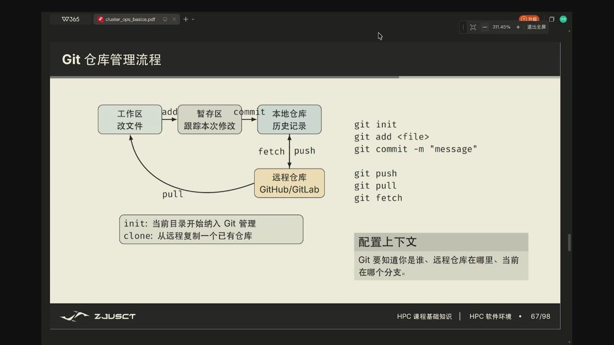

*图：`add` 和 `commit` 都只改变本地状态，`push` 才把提交送到远端；`fetch` 取回远端历史但不直接覆盖工作区。*

- **分支只是指向某个提交的轻量名字。**把稳定基线留在 `main`，每个可独立验证的改动放在分支上，比较结果时就可以准确写出两个 commit ID。若发生冲突，先理解两侧分别改了什么，合成一个能编译、能验证的版本，再标记为已解决。

### 编译与链接的边界

把 `main.cpp` 编译成可执行文件至少经历两个不同阶段。

- **编译阶段**把一个翻译单元变为目标文件；
- **链接阶段**解析它引用的外部符号，把目标文件和库组合起来。

一个 C++ 源文件从文字到进程可执行的机器码，通常经过四步。

- **预处理**器展开 `#include`、宏和条件编译，得到仍是 C/C++ 的翻译单元；
- **编译**器把翻译单元变成汇编；
- **汇编**器把汇编变为 `.o` 目标文件；
- **链接**器把许多 `.o` 与库组合成最终可执行文件。

构建系统常把它们藏在一条 `make` 或 `cmake --build` 后面，但报错来自哪一步会决定修法。

```bash
mpicxx -c main.cpp -o main.o   # 编译并汇编，不链接
mpicxx main.o -o solver        # 链接为可执行文件
./solver
```

`-c` 刻意停在目标文件。不同阶段的报错，排查方向也不一样。

- **编译阶段**：头文件不存在、语法或类型错误；
- **链接阶段**：`undefined reference` 表示链接器找不到定义；
- **运行时**：`libxxx.so: cannot open` 是动态加载器找不到共享库。

`command -v mpicxx` 可确认编译器，`ldd ./solver` 可查看可信本地二进制将加载的共享库。

编译优化也有层次，常用的开关可以分开看。

- **`-g`**：调试信息，便于调试器和 profiler 对应机器指令与源行，通常不等于关闭优化；
- **`-O0`**：尽量保留直观控制流；
- **`-O2`**：启用一组相对稳妥的常规优化；
- **`-O3`**：更积极地内联、展开和向量化，代码体积、寄存器压力和浮点结果都可能改变；
- **`-Wall -Wextra`**：先处理警告再谈优化。未初始化读取、符号/无符号比较和可疑转换在小输入上未必立刻出错，却会让后面的性能结果失去可信度。

浮点程序尤其要把数值语义和快分开记录。默认优化一般仍遵守较严格的 IEEE 规则；`-ffast-math` 或 `-Ofast` 允许编译器假定没有 NaN/无穷、重排结合次序或把除法改写成近似倒数。归约和迭代算法本就会因并行顺序产生末位差异，放宽规则后差异可能扩大。正确做法是固定一个可验证的基线，写出容许误差，再独立测量优化版本；不能只看见输出有几个数字就宣布等价。

大型项目还会使用 Make、CMake、Ninja 等构建工具维护依赖关系。它们的价值在于把哪个源文件改了、哪些目标必须重建变成可执行规则，而少敲几条编译命令只是顺带的好处。初学时仍应看一次 verbose build 输出：知道 `-I` 是头文件搜索路径、`-L` 是库目录、`-lfoo` 请求链接 `libfoo`，才能在 CMake 配置成功而链接失败时读懂真正的编译命令。

### 模块、包管理器与项目环境

module 解决的是共享系统上**选择已安装的软件栈**的问题：它通过环境变量在 GCC、CUDA、MPI 等预装版本之间切换。包管理器解决的是**获得和构建依赖**的问题。Spack 适合 HPC，同一个软件包可以按编译器、MPI、CUDA、目标架构和开关建立不同变体，避免把所有人都塞进一套全局 `/usr/local`。

```bash
module purge
module load gcc/版本号 openmpi/版本号
module list

spack find                 # 若课程环境提供 Spack，列出已安装的包
spack spec hdf5 +mpi       # 展开某个依赖/变体的解析结果
```

是否每次课题都应在登录节点从源码编译一遍，要分情况。若管理员已提供匹配模块，优先复用；若项目需要特定变体，使用课程允许的 Spack 环境、Python 虚拟环境或容器镜像，把依赖声明留在仓库中。`pip install` 到系统 Python、手改全局 `LD_LIBRARY_PATH`、把库散落进 home 目录，短期可能让命令通过，长期却很难解释另一个节点为什么不能复现。

## 容器与资源隔离

虚拟机模拟一台完整机器，通常有自己的内核，隔离强但启动和内存开销大。容器共享宿主机内核，只隔离进程视图、文件系统、网络和用户空间，因此更轻量。Docker、containerd 等是常见容器技术；Kubernetes 用来在多机器上调度和维护容器。

???+ note "k8s"

    Kubernetes 有 9 个字母，中间 8 个字母是 "ubernete"，所以常被写成 k8s（也是它的官方简称）。Docker、containerd 负责把单个容器跑起来；Kubernetes 负责在**多台机器上**安排哪些容器跑在哪、要几份、坏了自己拉起，两者管的是不同层。课程里常见的轻量版叫 k3s——精简发行版，占用小、装得快，很多每位同学一个容器的平台直接用它。

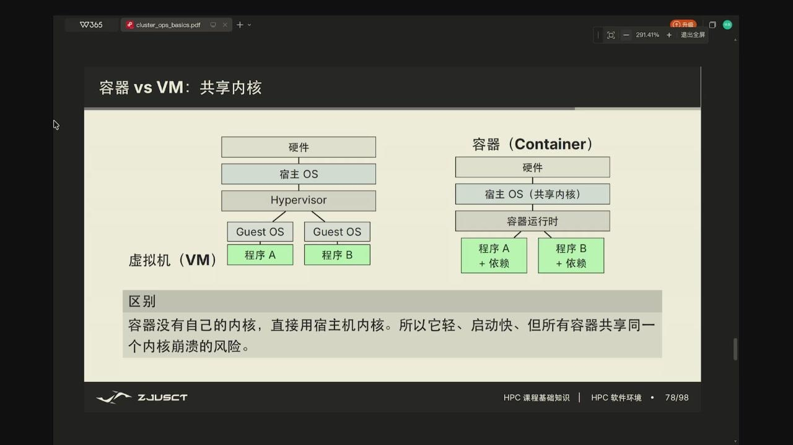

*图：容器启动轻、镜像小的根源是没有单独的 Guest OS；共享内核也意味着隔离边界和虚拟机不同。*

容器并不天然拥有无限资源。Linux cgroup 可以限制容器的 CPU、内存、GPU 等；namespace 让容器只能看到自己的进程、网络或挂载视图。课程中每位同学一个容器的安排，正是为了让环境相互隔离，又能由平台统一分配硬件。

???+ info "namespace 与 cgroup 分别解决什么"

    **namespace** 决定进程能看到哪些资源：进程号、网络接口、挂载点和用户身份都可以有各自的视图。**cgroup** 限定进程最多能用多少资源：CPU 时间、内存、设备等都可被统计和限制。前者提供进程之间的隔离，后者防止某个容器占满共享机器；两者缺一不可。

镜像、容器和挂载点是三个容易混在一起的对象。镜像是只读的文件系统层和启动配置；从镜像启动后才有一个可写的容器层；挂载卷则把宿主机或网络存储中的一个目录接到容器路径上。编译生成的 `build/`、下载的 wheel、修改过的系统包若只在可写层，删掉容器就不再存在；课程指定的工作目录若是持久卷，新容器重新挂载后仍能看到它。可以把下面的现象当作一次边界测试：在工作目录和 `/tmp` 分别写一个文件，重建容器后只保留哪个，取决于平台把哪个路径挂载到了持久存储。

GPU 容器还多了一层设备暴露。宿主机驱动控制真实 GPU；运行时把被分配的设备节点、用户态 CUDA 库和可见设备编号交给容器。容器里 `nvidia-smi` 看不到卡，常见原因是调度器没有分配 GPU、设备没有被挂入，或驱动与用户态库不匹配，不应立刻归因于 CUDA 程序。作业脚本应记录申请了多少 CPU、内存和 GPU；性能比较时也要确认两个实验获得的是同一种资源配额。

```bash
id                         # 容器中看到的 uid/gid
mount | head               # 当前可见的挂载；只作观察，不要手改系统挂载
nproc                      # 此环境实际可用的 CPU 数量
cat /sys/fs/cgroup/cpu.max 2>/dev/null || true   # cgroup v2 的 CPU 限额线索
```

??? example "为什么 `nproc` 比宿主机核心数更重要"

    一台宿主机可能有 128 个逻辑 CPU，课程容器却只被授予其中 8 个。若程序仍强制创建 128 个 OpenMP 线程，线程会在可用 CPU 上反复抢占，计时和 cache 行为都变差。程序的线程数应来自当前 cgroup/调度器提供的可用集合，而不是机器宣传页的总核数。

## 集群节点与带外管理

计算节点常是双路 CPU：每颗 CPU（socket）附近连接一部分内存，形成 NUMA 结构；GPU 通过 PCIe/NVLink 等互连接入；网卡负责节点间通信。性能和功耗都不是只由 CPU 决定：内存条、GPU、风扇、交换机和网络链路都要消耗能源。

从服务器前面看，往往是一排可热插拔的 SSD；打开机箱后，风扇形成从前到后的风道，内存条围绕两颗 CPU 插槽排列，GPU 与高速网卡占据 PCIe 扩展槽。这个布局不是为了美观：内存插在所属 socket 附近，PCIe 设备也各自挂在某个 CPU 的根端口下。进程、内存页面和 GPU/网卡若跨 socket 交错放置，数据就要多经过一次处理器间互连，带宽和延迟会与同一台机器这一粗略描述不同。

???+ info "NUMA 为什么会影响一个普通数组"

    NUMA 的全称是 Non-Uniform Memory Access。双路服务器中，每个 CPU socket 附近有本地内存；另一个 socket 访问这块内存要经过处理器间互连，延迟和带宽不同。Linux 往往按 first touch 把页面分给最先写它的 CPU。因此主线程初始化所有大数组、随后让两颗 CPU 平分计算，可能让一半工作长期访问远端内存。后续的线程绑定和并行初始化就是在处理这个数据位置问题。

功率是某一时刻的耗电速率（W），能量是累计消耗（平均功率×时间）。GPU 的额定板卡功率也不等于任意时刻的实际功率：矩阵计算密集时可能接近上限，等待 CPU、磁盘或网络时利用率下降。因而 GPU 功耗不高既可能说明节能，也可能说明程序没有充分利用 GPU，必须与利用率、吞吐量、时间线一起解释。

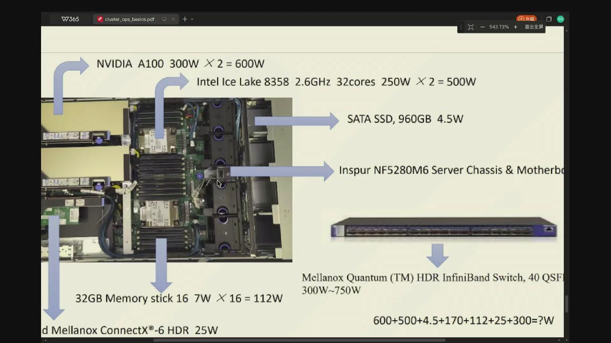

*图：一台机器由多颗 CPU、GPU、硬盘等共同构成功耗预算；额定功率之和决定了机箱电源与机房散热的上限要求。*

GPU 与 CPU/网卡的物理连接同样有拓扑。GPU 之间可能经 NVLink/NVSwitch 通信，GPU 到 CPU 或网卡常经 PCIe；若进程绑在错误 socket，数据可能多绕一次处理器互连。只有在通信、数据传输或 NUMA 指标表明它是瓶颈时才需要调拓扑，普通程序不应一开始就手工绑定所有东西。

运维人员即使操作系统无法正常启动，也需要查看温度、风扇、电源、硬盘、远程开关机和控制台。这类**带外管理**（out-of-band management，独立于操作系统、单独电路供能的远程硬件管理）通常由 BMC（Baseboard Management Controller）提供，IPMI/Redfish 是常见管理接口。它与业务网络分开，是为了在主机失联时仍能维护硬件。

??? info "带外管理 & 登录服务器"

    BMC 是主板上的独立管理控制器，使用独立网络和供电路径。操作系统死机、普通 SSH 无法连接时，管理员仍能查看温度、风扇、硬件日志和远程控制台，或执行电源控制。它只应向管理网络开放，不是用户提交作业的入口。

Kubernetes 把 Pod 作为常见调度单位；控制器不断比较**期望状态**和**当前状态**。若一个应长期运行的 Pod 退出，控制器会尝试重新创建它。这个**持续收敛**的模型解释了为什么平台能同时维护大量课程容器，但也意味着手工改动可能很快被控制器覆盖。

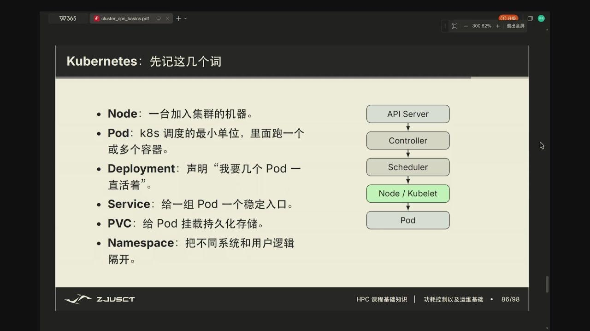

*图：API Server、Controller、Scheduler 和 kubelet 分工完成状态记录、调度决策与节点执行；Pod 才是被放到 Node 上的工作单元。*

???+ info "Pod"

    Node（节点）是集群里一台真正跑东西的机器（物理机或虚拟机），上面有 CPU、内存、磁盘，由 kubelet 负责在它上面创建和管理 Pod。Pod 是调度到一台 Node 上的最小单位，可包含一个或多个共享网络和卷的容器，由 Node 提供运行所需的资源。它并不是固定不变的一台虚拟机：控制器可以替换它，重建后的可写层也可能消失。需要跨重建保留的数据必须在声明好的持久卷中。

???+ note "Deployment"

    上面反复提到的控制器，最典型的就是 Deployment。它声明要保持运行 N 个这样的 Pod、镜像版本是多少，然后负责按这个声明创建 Pod，并在 Pod 崩溃、被删或数量不对时把它重新拉起来、调回声明数量，滚动升级时也由它把旧 Pod 换成新 Pod。所以课程里那个一直在、偶尔被重建的容器，通常就是一个 Deployment 在管着。

???+ note "PVC"

    Pod 重建后，它的可写层就丢了。要保留数据，就让 Pod 通过 PVC（PersistentVolumeClaim，持久卷声明）向集群要一块固定存储，把它当作卷挂到容器的某个路径上；这块存储背后由持久卷（PV）承载，甚至可能来自共享/网络文件系统。Pod 换成新的，只要还挂同一个持久卷，数据仍在。判断某个路径是不是永久的，就看看它是不是挂在持久卷上。

??? note "Namespace"

    Kubernetes 的 Namespace（命名空间）是把一整台集群按逻辑切分的小空间，用来把不同团队、项目或环境（如 dev、prod）的对象隔开，同名对象在不同 Namespace 里互不干扰。它和前面容器讲的 namespace 是一回事吗？不是——那是 Linux 内核用来隔离进程图景（进程号、网络、挂载点）的机制；这里是 K8s 层面把集群按逻辑划分成多个空间。

调度器同时匹配 CPU、内存、GPU 型号、污点/容忍、亲和性和可用卷，而不只是简单抽象地找一台空闲机器。请求（request）决定调度时预留多少资源，限制（limit）规定运行时最多能用多少。CPU 超额使用往往体现为被节流，内存超限则可能触发 OOM kill——进程突然消失、shell 只留下 `Killed` 或退出码 137，日志中没有 C++ 异常。两者都可能使计时数据失真。对课程程序来说，容器是进入机器的入口，真正可并行的核数仍以调度器给出的配额为准。

## 运行现象的边界

同一段程序的行为由它实际获得的环境共同决定：跨节点通信依赖网络与匹配的软件栈；线程数受 Linux 和资源配额约束；GPU 程序还需要容器正确暴露设备；性能分析则要区分计算、内存、磁盘和网络等待。

把这些条件记录下来，结果才有比较对象。连接失败可依次观察接口、DNS、路由和端口；认证失败再检查密钥和权限；程序无法启动则查看模块、动态库与容器配额；运行变慢才回到 CPU、内存、磁盘和网络的实际等待。每个命令只验证一个可观察条件，日志才会给出下一步的方向。
