# 07-07 下午：HPC 中的计算机系统 I

一条算术指令很少单独决定程序速度。数据抵达执行单元之前会经过 cache 和地址翻译；多个线程又会争用 cache、内存带宽和同步点。理解这些路径，才能解释同一份循环为何会随数据布局和线程数而变化。

## CPU 执行与流水线

CPU 执行的是指令。编译器把 C/C++ 等源代码翻译成目标指令；程序计数器（PC，在 x86 上常称 RIP）指向下一条指令；控制器取指、译码，把操作送到算术逻辑单元、浮点单元、访存单元等部件。

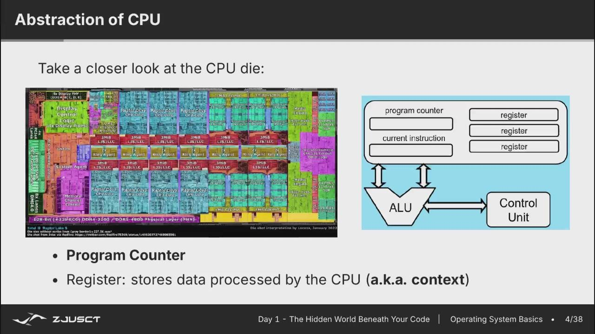

*图：CPU 的抽象视图——PC 指向下一条指令，寄存器保存中间状态；流水线与 cache 都是在这之上为提吞吐添加的内部结构。*

??? note "从单周期 CPU 到流水线：为什么吞吐能提升"

    如果你只画过单周期 CPU，会记得它的节奏：一个时钟周期里取指、译码、执行、访存、写回一口气全部做完，下个周期再做下一条。这种设计最直观，但有两个问题：一是时钟周期必须按**最慢的那条指令**（常常是访存或乘法）来定长，快指令也被拖到这同一个周期；二是每个时刻只有一个部件在干活，其余都在等。

    流水线的思路是把"取指、译码、执行、访存、写回"拆成**独立阶段**，让不同指令同时处在不同阶段——第 1 条做写回的同时，第 2 条在访存、第 3 条在执行、第 4 条在译码、第 5 条在取指。单条指令的延迟并没有变短，但**每周期能完成一条指令**，吞吐大幅提升。代价是引入了依赖：第 2 条若要第 1 条的结果，就得等；跳转指令还会让已经取进来的后续指令可能作废。这正是后面"停顿与依赖"一节要处理的问题。

    理解 HPC 时，流水线告诉你一个基本事实：**处理器在意的是吞吐（每周期完成几条），而不只是单条指令有多快**。写高性能代码时，尽量多提供彼此独立的指令，让流水线一直被有用工作填满。

顺序地看，一条指令经历取指、译码、执行、访存、写回。现代处理器不会傻等每条指令完全结束：它把这些阶段重叠成流水线，也会在不改变可见结果的前提下乱序执行彼此独立的指令。比如一条内存读取还没回来，后面与它无关的算术指令可以先做。

乱序不是任意改顺序。下面的第二行依赖第一行的结果，不能提前：

```cpp
int x = a + b;
int y = x * c;
```

相反，若 `u = d + e` 与 `x = a + b` 无关，硬件或编译器可能同时安排它们。高性能程序常试图提供更多独立工作，以隐藏一次运算或访存的延迟。

### 分支预测

遇到 `if`、循环跳转时，处理器需要猜下一条指令在哪里。猜对时流水线继续流动；猜错时已经取入/执行的一部分工作要丢弃，重新从正确路径开始。数据随机、条件难预测的分支常比直觉上慢得多。把大量小分支改写成规则数组操作，有时既利于分支预测，也利于向量化，但必须先验证语义没有变化。

## 存储层级与访存代价

寄存器最接近执行单元、容量最小；其次是 L1、L2、L3 cache；再往外是 DRAM。越往外容量越大、单位容量越便宜，但访问延迟和带宽代价也越高。CPU 不会每次只从内存取一个 `double`，而是通常以 cache line 为单位搬运一段连续字节。

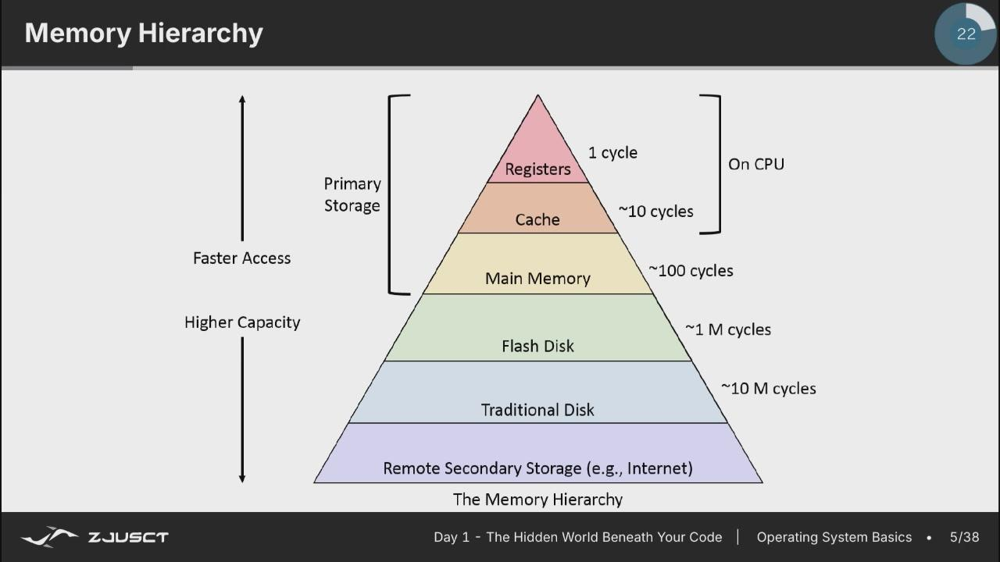

*图：存储层级是“快、小、贵”与“大、慢、便宜”的连续权衡；理解它才明白为何访存位置决定性能。*

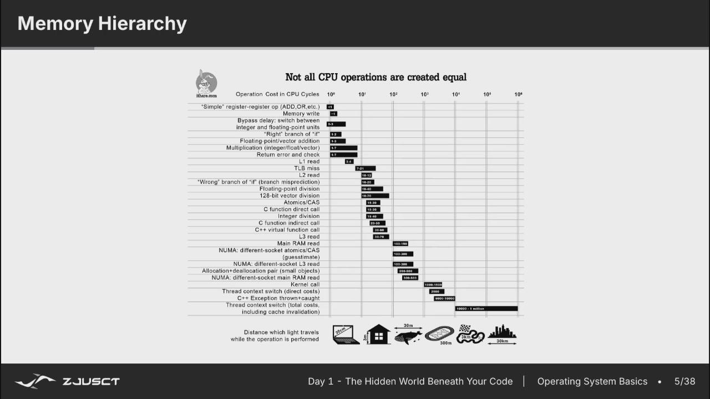

*图：不同层级访存代价相差甚远；把数据停在更近的层级，是把 op 成本从百周期拉回个位数的关键。*

??? note "为什么现代 CPU 需要 cache：CPU 快到内存追不上"

    你在单周期 CPU 里见过的"内存"，大概是一块按地址读写、延迟固定的存储器。现代真实系统里，主存 DRAM 的访问延迟大约是 CPU 寄存器/执行单元的几十到几百倍。如果每条指令要访存的都直接去 DRAM，处理器大部分时间会干等着数电压的流动，算力白搭。

    cache 就是为了弥合这个速度差：在 CPU 和主存之间放几层又快又小的存储，把最近用过的数据（及其附近的数据）暂时放在离 CPU 更近的地方。核心思想是两条经验——**时间局部性**（刚用过的数据很可能马上再用）和**空间局部性**（刚用过的地址附近的数据很可能马上也会用）。连续遍历数组所以快，正因为下一批元素大概率已在 cache 里。

    于是一等重要的视角是：**程序性能常常由"数据在哪个层级、有没有停在够近的 cache"决定，而不是由指令条数决定**。后面几乎所有优化——改循环顺序、分块、SoA 布局——本质上都是在提高 cache 命中、减少把数据反复从 DRAM 搬上来的次数。

```text
寄存器
  L1 cache（每核，最快的小缓存）
  L2 cache（每核或小范围共享）
  L3 cache（多个核心共享）
主内存 DRAM
```

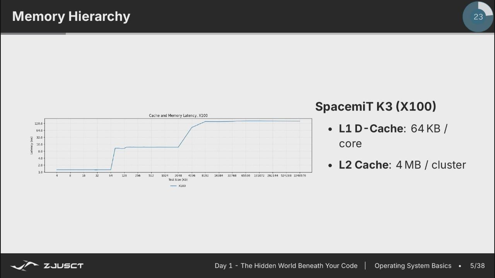

*图：L1/寄存器与 DRAM 之间的延迟差距可达上百倍；这正是 cache 命中和 miss 性能相差悬殊的原因。*

缓存设计利用两种经验：最近用过的数据可能再用（时间局部性），某个地址附近的数据可能很快也会用（空间局部性）。因此，连续遍历数组往往比随机跳转访问更快；矩阵乘法用小块计算，是为了让一块 A/B/C 数据留在 cache 里被重复使用。

```cpp
// C/C++ 多维数组按行存放；j 在内层时通常是连续访问。
for (int i = 0; i < rows; ++i)
    for (int j = 0; j < cols; ++j)
        sum += a[i][j];
```

缓存命中不等于一定快，未命中也不必然是 bug。要看访问模式、工作集大小和总时间。性能分析课中的 cache-miss 指标正是用来验证这些判断。

### 缓存一致性与 false sharing

多核机器中，同一内存位置可能被多个核心缓存。硬件通过一致性协议保证“一个核心写入后，其他核心最终不会长期读到旧值”。代价是写入会让其他缓存中的相关 cache line 失效。

即使两个线程写的是不同变量，只要变量落在同一 cache line，也会互相使对方的缓存失效。这称为 false sharing。典型例子是多个线程把局部统计量紧挨着放在数组里。常见处理办法是每线程保存私有结果、最后归约，或在确认是热点后做适当填充；不要一开始就到处加 padding。

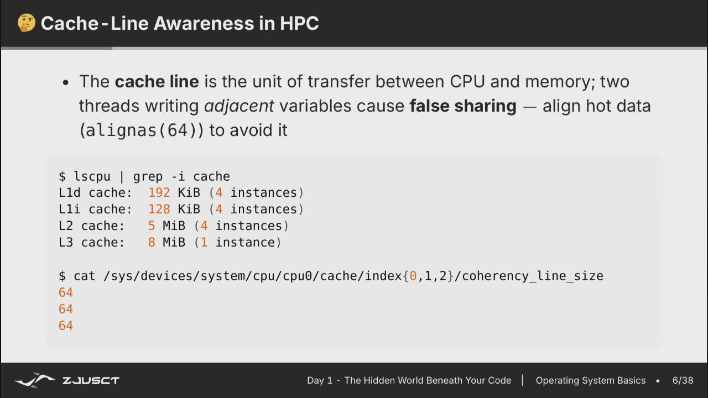

*图：line 大小应在目标机器上查询。课件示例为 64 B；不能把这个数当成所有 CPU 的固定常量。*

!!! warning "把 false sharing 与数据竞争分开"

    两个线程写同一个 `sum` 是正确性错误；两个线程写同一 cache line 中不同的私有槽位，结果可以正确却很慢。前者需要重新定义所有权或同步，后者才考虑 padding、分块或改变归约布局。

### Cache line、关联度与预取

cache 以 line 而非单个变量为单位填充，x86 常见 line 为 64 字节。读一个 `float x[i]` 可能把相邻 15 个 float 一并带入 L1；这正是连续访问容易快的物理原因，也是 false sharing 会发生在“不同变量”上的原因。若每次跨很大的固定步长访问，只用到每条 line 的一个元素，内存带宽会被无效字节消耗。结构体里只使用少数热点字段时，SoA 有时能避免把无关字段也带进 cache line。

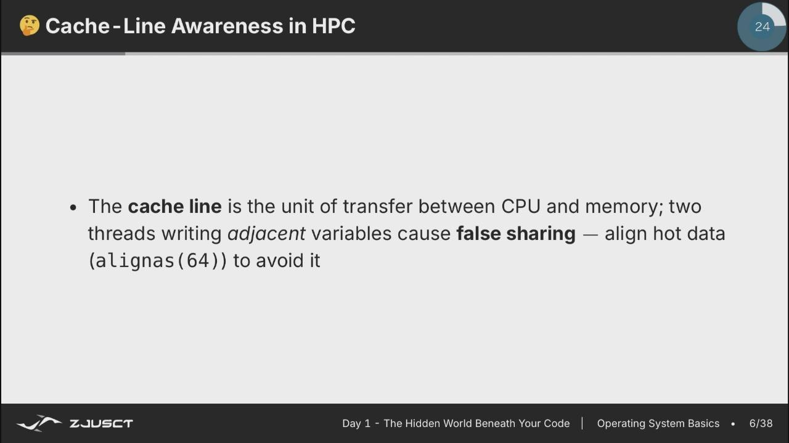

*图：cache 以 line 为单位工作；顺序访问让一条 line 被尽量用尽，跨步长访问则让 line 的大部分字节被浪费。*

cache 是有限且按组组织的。地址中的一部分位选择 cache set，同一 set 能同时容纳的 line 数由 associativity 决定。多个频繁访问的地址若恰好映射到同一 set，会相互驱逐，即使总工作集小于 cache 容量也会发生 conflict miss。大多数程序无需手工计算 set，但矩阵行列访问、固定步长数组和多数组同步遍历出现反常性能时，padding 或改变 tile 尺寸可能消除冲突；它应由硬件计数器和尺寸扫描验证。

硬件 prefetcher 会尝试预测线性或规则步长流，在真正 load 前把后续 line 拉近。它对顺序数组极有效，对随机指针链、哈希表或数据相关间接索引帮助很小。软件 prefetch 也不是通用加速器：预取得太早会被挤出，太晚来不及，错误预取还会占用带宽。先让布局和循环顺序规律，通常比插入预取指令更可靠。

## 进程与地址空间

进程是操作系统分配和保护资源的基本单位。一个进程拥有自己的虚拟地址空间、打开的文件、权限和运行状态。它看见的地址是虚拟地址，不等于物理内存条上的地址；这使两个进程都可以使用看似相同的地址而互不干扰。

??? note "进程、线程：先分清这两个概念"

    单周期 CPU 课程通常只讲"一个程序在跑"，不会涉及操作系统如何隔离和调度。这里先补两件事。

    **进程**是一个程序运行时的完整实例：它有自己独立的虚拟地址空间、自己的寄存器状态、自己的文件描述符和权限。两个进程不能互相直接读对方内存，这是一层隔离，也是安全的基础。

    **线程**是进程内部更小的执行单元。同一进程的多个线程**共享**地址空间（所以能直接读写同一变量、同一块动态内存）和大部分资源，只是各自有独立的栈和寄存器上下文。创建线程比创建进程更轻，但共享内存也意味着它们需要自己处理"谁先写、谁后读"的同步。

    一句话，进程是资源隔离的单位、线程是共享内存并行执行的最小单位。现代 CPU 多核并行，通常就是在一个进程里开多个线程、或开多个进程各自跑一块，再靠通信把结果合起来。OpenMP 在进程内开线程、MPI 跨进程通信，底子都是这里讲的进程/线程区别。

磁盘上的可执行文件采用 ELF（Executable and Linkable Format）时，文件里既有待加载的代码和数据，也可能有符号表、调试信息等运行时不必装入内存的内容。加载器读取 program header，把若干 section 组合成具有读、写、执行权限的内存 segment。于是“文件里有什么”和“进程地址空间里映射了什么”并非一一对应。

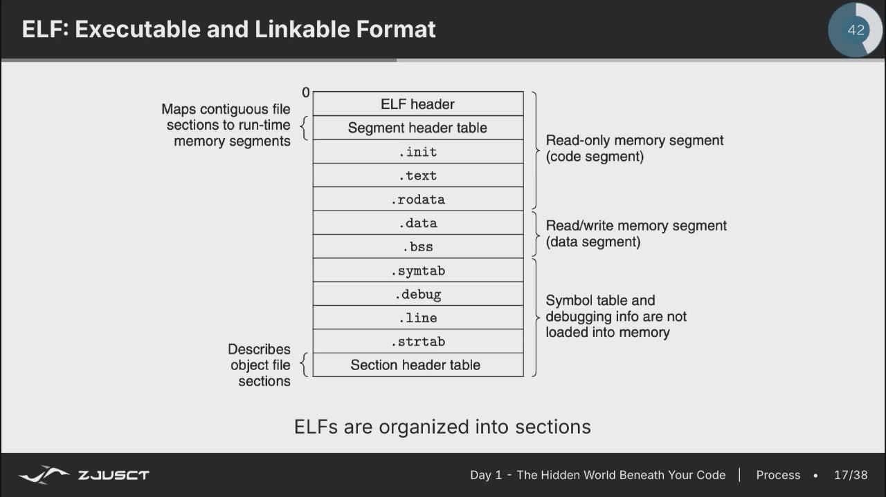

*图：`.text`、`.rodata` 常进入只读/可执行映射，`.data`、`.bss` 进入可写映射；section header 主要描述链接视角，program header 服务于加载。*

??? info "ELF 为什么值得认识"

    编译报错、链接报错和程序启动失败落在不同边界。`readelf -h/-S/-l` 可分别查看 ELF 头、section 和 segment；`nm` 看符号；`ldd` 看动态依赖。源码里有函数却出现 `undefined reference`，多半是链接器没找到定义；文件已经生成却提示缺少 `.so`，则是动态加载阶段的问题。

进程运行时至少可粗略分为代码区、全局/静态数据、堆和栈。代码区放机器指令；堆用于动态分配；每个线程有自己的栈。`fork` 在 Unix 中可创建子进程，常配合 copy-on-write：创建时不急着复制所有内存页，只有某一方修改时才真正复制，以降低启动开销。

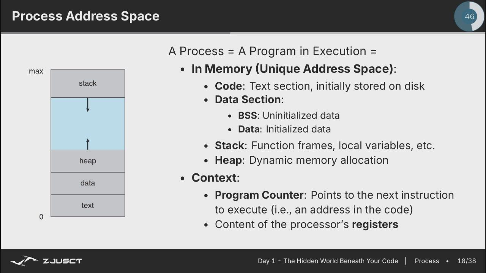

*图：这些区域属于进程的虚拟地址视图；实际物理页由页表映射，图中的增长方向也是典型布局而非语言保证。*

进程间默认不能直接读写彼此内存。要交换数据，使用文件、管道、socket、共享内存或 MPI 等明确机制。隔离提高安全性，但也让跨进程通信比同进程访问变量更贵。

??? info "虚拟地址为什么有用"

    虚拟地址是进程使用的地址编号，不是内存条上的坐标。它让每个进程拥有独立、连续的地址视图，并让内核能在页表中标记可读、可写、可执行等权限。同一个数值地址在两个进程中可以映射到不同物理页；一个进程越界访问时，硬件和内核可据此阻止它伤害另一个进程。

### 进程状态与抢占

进程并非从启动到退出一直占着 CPU。它至少会在运行（running）、就绪（runnable/ready）和等待（sleeping/blocked）之间变化。就绪表示它有事可做、但尚未得到核心；等待表示它在等磁盘、网络、锁、子进程或定时器，暂时不能继续执行。结束后内核还会短暂保留退出状态，直到父进程读取退出码。

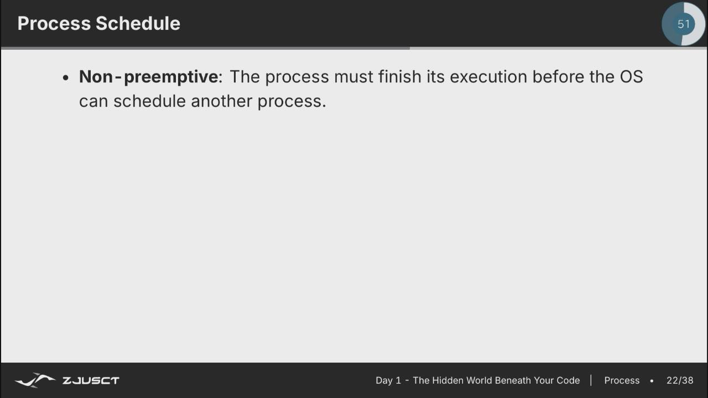

*图：进程在就绪、运行、等待之间切换；抢占和时间片决定了单个进程不能独占 CPU。*

```text
创建 -> 就绪 --被调度--> 运行 --时间片到/被抢占--> 就绪
                         |  
                         +--等待 I/O 或锁--> 等待 --事件到达--> 就绪
                         |
                         +--exit--> 退出
```

I/O 完成、网卡收到包、定时器到期等硬件事件会通过中断通知内核；内核再唤醒相应任务，必要时安排调度。中断处理本身要尽量短，较重的工作会延后处理，否则一个设备事件也可能拖慢整台机器。这解释了为什么程序“没在使用 CPU”不一定是闲着：它可能在等待另一项资源，或已经被阻塞在同步点。

??? info "抢占（preemption）"

    抢占是内核暂时停止一个仍可运行的任务，把 CPU 让给另一个任务的机制。交互系统靠它避免一个程序独占机器；共享集群也靠它维护调度策略。计算作业不应假设某个线程从开始到结束都不被打断，因此计时要重复多次，并避免把一次偶然的系统干扰当成优化结论。

`ps -o pid,ppid,stat,psr,comm -p <pid>` 可查看一个进程的状态、父进程和最近运行的 CPU；`top -H -p <pid>` 可在系统支持时查看进程中的线程。它们是瞬时观察，不是完整的性能证据：某线程显示为 sleeping，只说明采样时刻它没有运行，仍需结合程序的 I/O、锁和 profiler 事件判断等待原因。

### 系统调用、页与缺页

用户态代码执行 `read`、`write`、`mmap` 或创建线程时，会经由系统调用陷入内核。这里的“陷入”不是程序出错，而是 CPU 切换到受保护的执行权限，让内核检查参数和权限，再操作文件系统、页表或调度器。系统调用边界有固定成本，因此逐字节调用 `read`、每次循环都打开文件，常会比按块缓冲处理慢得多；这也是并行文件系统偏好大块、顺序 I/O 的一个微观原因。

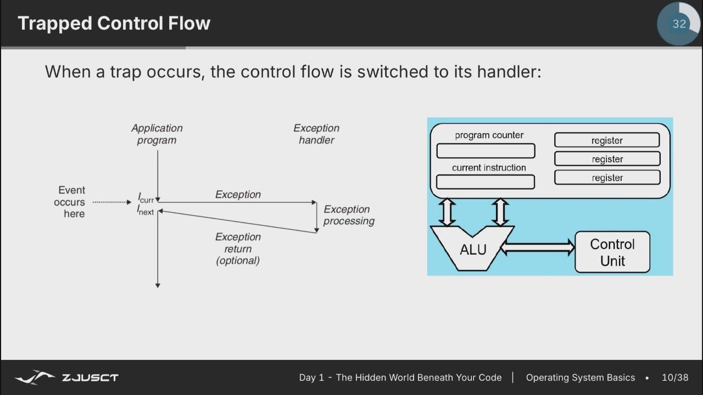

*图：控制流跨过用户态—内核态边界时，程序计数器和寄存器状态必须可恢复；进程没有“跳过”原程序，只是暂时执行受保护的处理路径。*

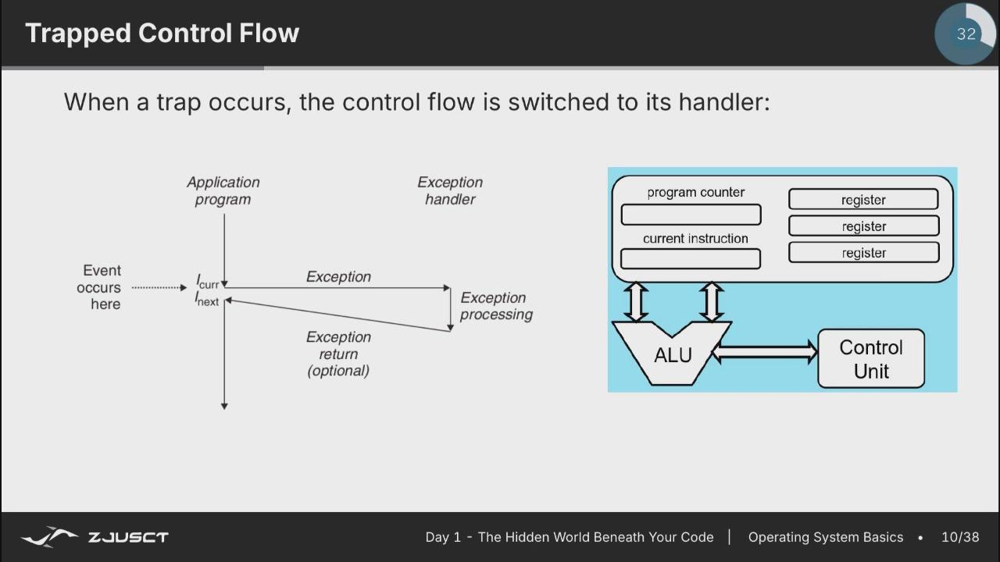

*图：RISC-V 统称 trap，涵盖中断与异常；处理器保存现场、执行处理、再恢复原程序，是系统调用与缺页的共同基础。*

陷入内核的原因可以分开看。用户态程序想做特权操作（读写文件、分配内存、网络）时，就要通过系统调用请求内核代劳。

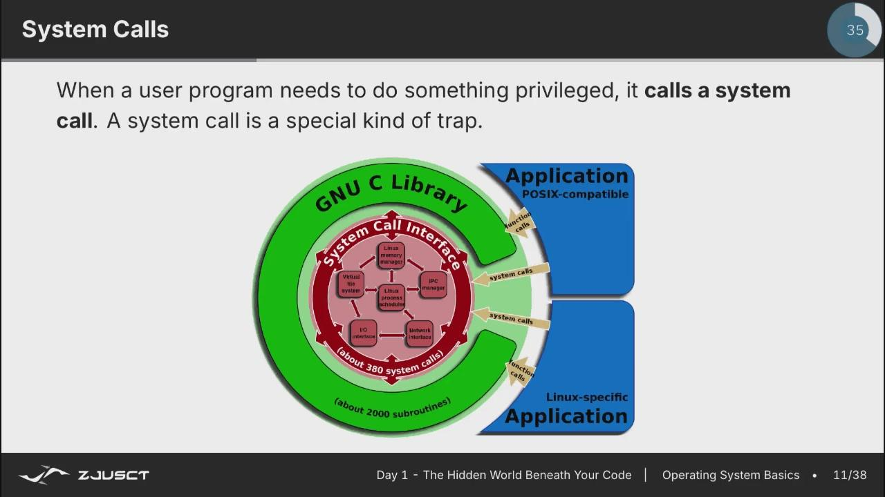

*图：系统调用把特权操作交给内核执行；CPU 切换权限并检查参数是它的固定开销来源。*

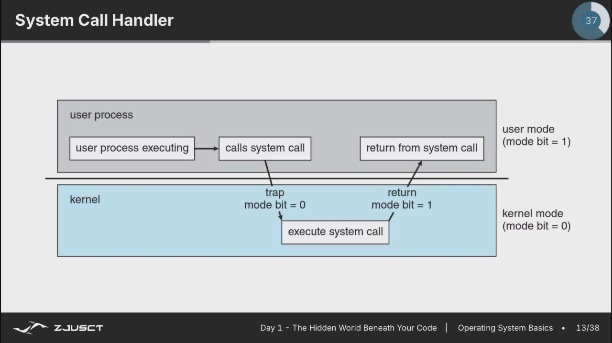

*图：从用户态进入、内核处理、返回用户态，这套路径的固定成本让“每次调用尽量多干点活”很重要。*

| 来源 | 是否由当前指令主动触发 | 例子 | 处理后能否继续 |
| --- | --- | --- | --- |
| 系统调用 | 是 | `read`、`mmap`、`futex` | 通常返回下一条用户指令 |
| 异常 | 由当前指令产生 | page fault、除零、非法指令 | 取决于异常能否修复 |
| 中断 | 否，来自外部设备或时钟 | 网卡收包、定时器 | 内核处理后恢复被打断任务 |

一次 minor page fault 可以由内核补上页表映射后重试原指令；越界访问若没有合法映射，内核会给进程发送 `SIGSEGV`。两者在硬件入口上都涉及异常，但软件语义和代价完全不同。

虚拟内存以页为单位管理，常见页大小是 4 KiB（系统也可能使用 huge page）。`malloc` 成功通常只取得一段虚拟地址，不代表相同数量的 DRAM 已经立即占用。第一次写入某页时，处理器发现页表尚无有效物理映射，内核分配页面并更新页表，这就是按需分配造成的 minor page fault；若数据必须从磁盘换回，才是代价高得多的 major page fault。初始化一个数十 GB 数组也因此是实际工作，不能偷偷排除在端到端计时之外。

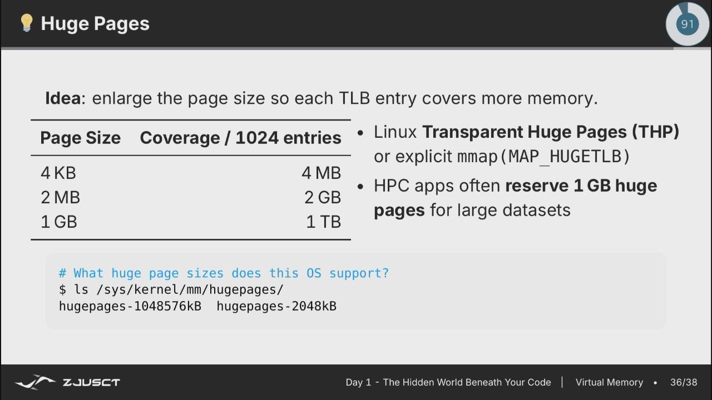

*图：课件列出常见页大小及其覆盖范围。是否使用 huge page 取决于工作集、分配策略和系统配额，并非默认优化。*

地址翻译本身有缓存：TLB 保存最近的虚拟页到物理页映射。连续扫描数组时，一条 TLB 项能覆盖其后一段地址；指针追逐或巨大的随机工作集会更频繁地耗尽 TLB。cache blocking 改善数据复用时，往往也同时改善 TLB 行为，不过页大小、对齐和访问顺序仍需要用测量确认。

## 线程与共享内存

线程是 CPU 调度和执行的基本单位。一个进程可包含多个线程：它们共享代码、堆、全局变量和打开文件，但各自拥有寄存器状态、程序计数器和栈。

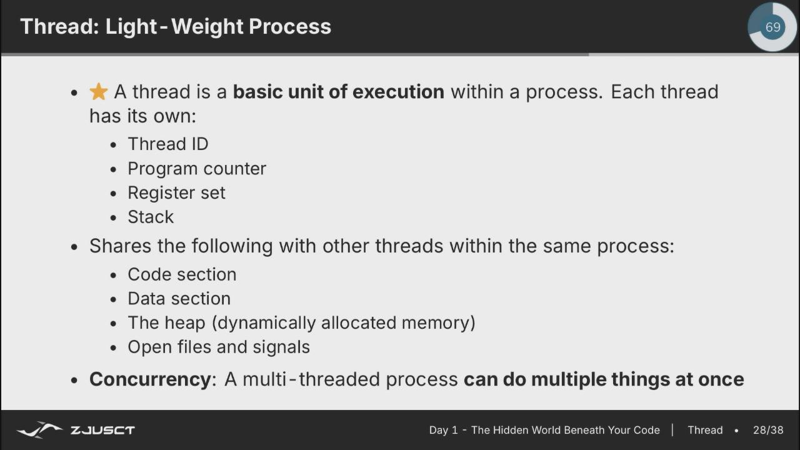

*图：线程作为“轻量级进程”共享内存，创建/切换比进程便宜，代价是需要处理共享数据的同步。*


*图：线程切换必须保存私有执行状态；共享堆让通信便宜，也让悬空指针、数据竞争和错误关闭文件影响整个进程。*

| 对象 | 同一进程的线程 | 不同进程 |
| --- | --- | --- |
| 虚拟地址空间 | 共享 | 默认隔离 |
| 栈与寄存器 | 每线程独立 | 每进程中的线程各自独立 |
| 打开的文件 | 共享文件描述符表 | 需继承或显式传递 |
| 普通变量通信 | 可直接共享，但要同步 | 需要 IPC 或共享映射 |
| 故障边界 | 一个线程越界可能终止整个进程 | 通常限制在出错进程内 |

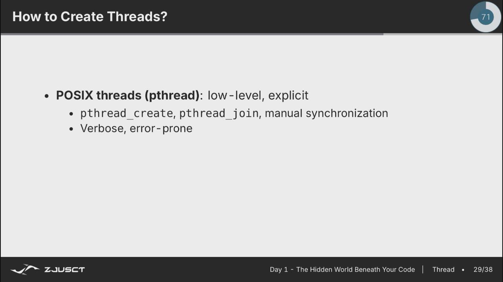

*图：pthread_create 是底层建线程接口；OpenMP 等并行库在此基础上封装出更简单的并行域语法。*

共享内存使线程通信方便，也带来数据竞争。`count++` 并不是一个不可分割的动作，它包含读、加、写。两个线程交错执行，结果可能少加一次：

```cpp
// 错误示例：多个线程同时执行会发生数据竞争。
count++;
```

解决方式有三类：

1. 用互斥锁让同一时刻只有一个线程修改共享状态；
2. 对简单读改写使用原子操作；
3. 更常见也更高效的是避免共享写：各线程算自己的局部部分，最后归约。

锁保证正确性，不保证性能。临界区过大，所有线程会排队；同步次数过多，程序即使有很多核心也会接近串行。写并行程序时先说明谁拥有数据、谁能写、何时合并，比先挑 OpenMP 语法更重要。

### 原子性、可见性与等待

互斥锁不只是给一段代码排队。一个线程解锁前的写入必须对随后成功加锁的线程可见；否则即使“没有同时写”，消费者仍可能读到旧数据。C/C++ 的 `std::mutex`、OpenMP 的同步构造和语言原子类型会建立这类顺序关系。普通变量被多个线程无同步地同时读写属于 data race，在 C/C++ 中是未定义行为，不能靠“我的电脑上多跑几次都对”证明安全。

```cpp
std::mutex m;
std::condition_variable cv;
bool ready = false;

// 生产者：写入数据后再公布 ready，并唤醒等待者。
{
    std::lock_guard<std::mutex> lock(m);
    ready = true;
}
cv.notify_one();

// 消费者：等待条件成立，不能只凭一次唤醒就继续。
std::unique_lock<std::mutex> lock(m);
cv.wait(lock, [] { return ready; });
```

条件变量解决的是“没有工作时如何睡眠等待”，不是替代互斥保护。等待端必须把条件写成谓词并在锁保护下检查，因为唤醒可能是虚假的，或其他线程已先一步消费了数据。反复轮询 `while (!ready) {}` 虽简单，却会占满一个核心、制造 cache 一致性流量；只有极短且经过测量的等待才可能使用自旋。

原子加法适合计数器等小型读改写，但所有线程更新同一个原子变量仍会争夺同一条 cache line。把每次循环都改为 `atomic_fetch_add`，正确性可能有了，扩展性却可能比单线程更差。大规模归约通常仍应由线程在本地累积，再在较少同步点合并。

!!! tip "把共享对象的所有权写下来"

    对每个数组或队列标明：哪个线程/进程创建它，哪些执行单元可以读，谁可以写，写完后如何通知读者。这个约定同时指导正确性和性能：独占写入避免锁，分块所有权减少 false sharing，明确的合并点也让计时边界更清楚。

## 上下文切换与调度

一颗核心在任一时刻只能执行一个硬件线程。操作系统的调度器在许多可运行线程间切换：保存当前线程的寄存器、程序计数器等上下文，恢复下一个线程，再继续执行。切换本身有成本；更大的损失往往是新线程迁移到另一核心后，原来热的 L1/L2 cache 失效了。

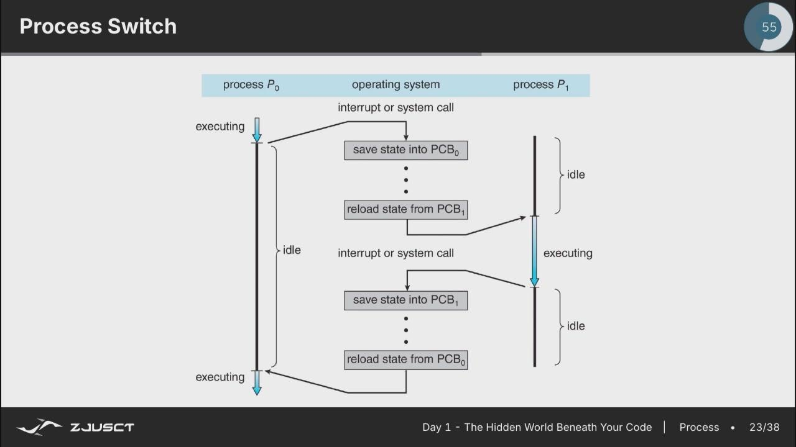

*图：图中的两条竖线表示两个进程交替运行；保存和恢复期间由操作系统执行，用户进程本身没有推进。*

调度器需要同时照顾吞吐、公平、响应时间和优先级。这些目标不能全部最大化。长时间片减少切换开销，却让交互任务等得更久；短时间片响应快，却增加保存状态和 cache 冷启动。HPC 批作业通常依靠作业系统先划定 CPU 集合，再由节点内调度器处理该集合中的线程。程序绑核只能限制“允许去哪里”，不能让超过配额的线程凭空获得更多执行资源。

这解释了几个实践现象：

- 不要为极小任务反复创建/销毁线程；线程池和较粗的任务块更合适。
- 线程数开得远多于核心数，不一定更快；它可能只增加调度、同步和缓存干扰。
- 把一个工作线程随意迁移到不同核心，会丢失 cache 亲和性。

调度器仍需要公平和响应性，所以“绑死所有线程”也不是默认答案。只有当测量表明迁移/NUMA 是瓶颈时，再使用 `taskset`、`numactl`、OpenMP 的 affinity 选项或作业系统的绑核设置。

线程数应区分三个数量：程序创建的 software threads、操作系统可调度的任务数、以及作业实际被允许运行的 logical CPUs。容器或作业系统可能只授予 8 个 CPU，即使宿主机有 128 个逻辑核；盲目让 OpenMP 创建 128 个线程会产生超额订阅。可用 `nproc`、调度器环境变量或 `sched_getaffinity` 的结果确认可用集合，再设置 `OMP_NUM_THREADS`。SMT 的两个逻辑核也不等于两份完整执行资源：访存停顿较多的循环可能受益，已饱和 FMA 或内存带宽的循环则可能变慢。

## NUMA 架构

单路小机器可近似认为所有 CPU 核访问同一内存的代价相近。双路及更多路服务器通常是 NUMA（Non-Uniform Memory Access）：每个 socket 连接自己附近的一组内存，访问本地内存较快；访问另一 socket 的内存要跨 CPU 互连，延迟更高、可用带宽也不同。

```text
CPU socket 0 -- 本地内存 0
       |\
       | \  跨 socket 互连
       |  \
CPU socket 1 -- 本地内存 1
```

Linux 常按 first touch 分配物理页：哪个线程第一次写某块新内存，页面往往就分配到该线程所在 NUMA 节点。若主线程在 socket 0 一次性初始化全部大数组，之后 socket 1 的工作线程处理其中一半数据，就会发生大量远端访问。

更合理的方式是让各线程初始化并处理自己的数据块；MPI/线程划分也与数据分块保持一致。可用 `numactl --hardware` 查看节点和距离，用 `numastat` 观察进程页分布。是否需要强制绑定，要以实际机器和测量为准。

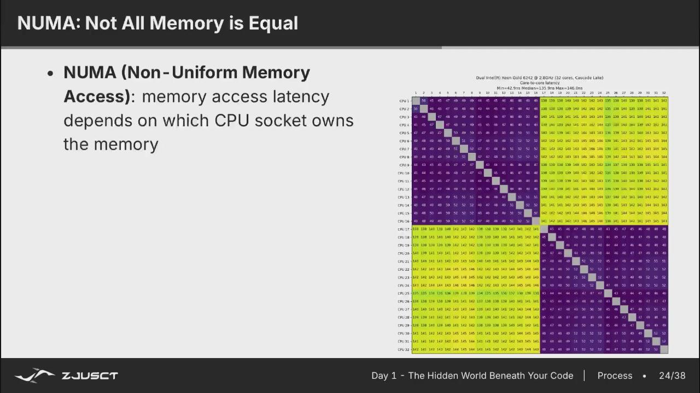

*图：线程与页面位于同一 NUMA node 时延迟较低；跨 socket 访问要经过处理器互连。*

## 虚拟内存与页表

程序里的指针是虚拟地址。CPU 真正发起 DRAM 访问前，需要由 MMU（memory management unit）把它翻译成物理地址。操作系统按页管理内存；常见页大小是 4 KiB，但系统也可以使用更大的 huge page。页表记录虚拟页号到物理页框的映射，以及该页是否可读、可写、可执行。

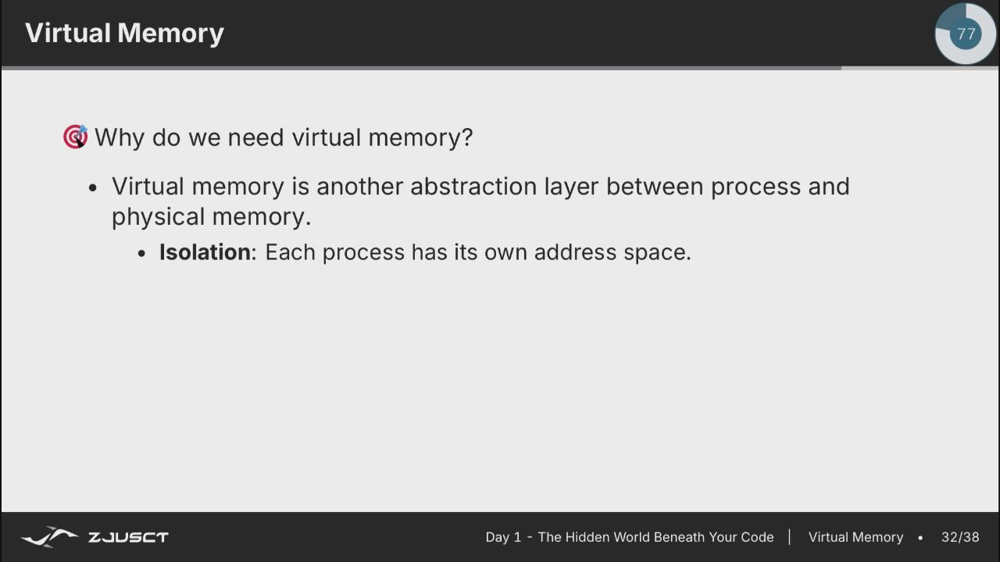

*图：虚拟内存把逻辑地址与物理内存解耦，带来隔离与灵活，也带来地址翻译这一层需要缓存的额外成本。*

如果每次读写都要先走内存里的多级页表，地址翻译本身会很慢，因此 CPU 有 TLB（translation lookaside buffer）缓存最近的页表项。一次普通访问大致经历这样的判断：

```text
虚拟地址
  -> TLB 命中：得到物理页号，继续查 L1/L2/L3/DRAM
  -> TLB 未命中：页表遍历，填入 TLB，再继续访问
  -> 页表项不存在：触发 page fault，交给操作系统处理
```

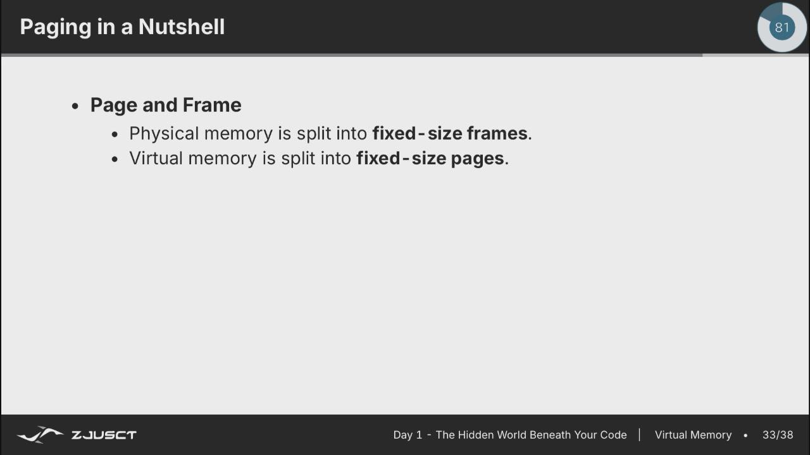

*图：页与页框的映射是虚拟内存的核心；缺页、swap、共享与保护都建立在这张映射之上。*

这里的 `page fault` 并不自动等于程序出错。进程第一次触碰一块按需分配的匿名内存时，内核可能分配物理页并建立映射，这也是一种正常缺页。访问无权限地址、访问已经释放的映射，或系统不得不从磁盘换回被置换的页，才会分别成为异常或非常昂贵的缺页。

大数组的访问模式会同时影响 cache 与 TLB。若每隔很远访问一个元素，带入的 cache line 很少被用到，TLB 里的页表项也可能频繁被替换。按块连续处理数据能让同一页、同一 cache line 上的内容被多次利用。该原则与后面矩阵分块、向量化课程里的数据布局是连着的。

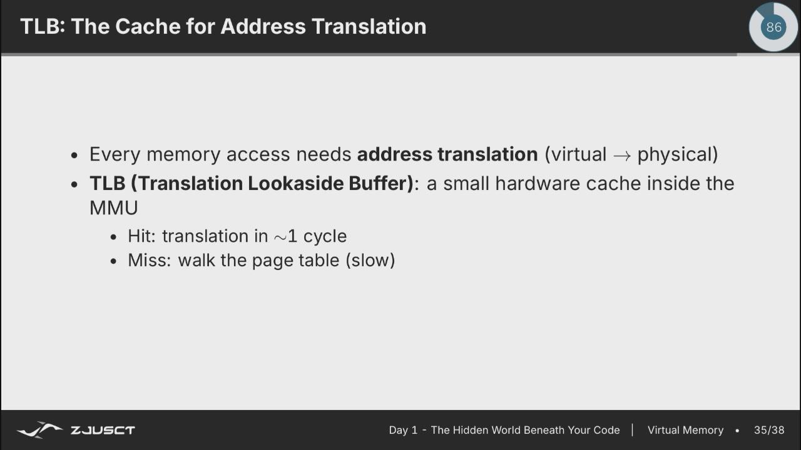

*图：TLB 缓存虚拟页到物理页的翻译；随机大工作集更容易耗尽 TLB，与 cache miss 是两类不同但相关的开销。*

### 地址空间布局

进程地址空间图里常见的 `text`、`data`、heap、stack 并非只是教材标记，它们对应不同的分配与保护方式。

- `text` 段存放机器指令，通常可读可执行、不可写；
- 已初始化的全局和静态变量在 data 段，未初始化变量常以 BSS 形式记录；
- heap 由 `malloc`、`new` 等动态分配接口使用，分配器再向内核申请或归还页面；
- stack 保存函数调用帧、局部变量和返回地址，每个线程各有一份；
- 共享库、文件映射和匿名映射通常落在专门的 mmap 区域。

局部大数组放在栈上很容易触发 stack overflow；把大量互不相关的小对象逐个堆分配，也可能让分配器开销和访问碎片变大。HPC 程序常一次分配连续的大块数组，并明确数据布局，原因既包括易于并行，也包括对页面和 cache 更友好。

## `fork`、`exec` 与文件描述符

Unix 进程创建常见于 `fork()`。子进程最初得到父进程地址空间和文件描述符表的逻辑副本，但内核不会立刻复制全部物理页，而是把双方页面标为 copy-on-write。只有父或子尝试写某页时，内核才复制该页。这让“创建后立刻 `exec` 新程序”的模式不必浪费复制整段内存的时间。

`execve()` 不创建新进程，而是把当前进程的地址空间替换为目标可执行文件及其依赖库；PID 通常不变。shell 执行外部命令的基本过程便是 fork 一个子进程、在子进程中 exec、父进程按需要等待。作业系统启动 MPI rank、Python 的多进程库和管道也会建立在相似的进程机制上。

文件描述符是进程内的小整数，指向内核维护的打开文件、管道、socket 或设备对象。标准输入/输出/错误一般是 0、1、2。fork 后父子会继承描述符，因此重定向、管道和日志输出需要特别注意谁还持有写端：管道读端只有在所有写端关闭后才会读到 EOF。这里的“资源所有权”与多线程中谁可以写共享变量，是同一类工程问题。

## 流水线停顿与依赖

从顺序模型看，CPU 每个周期执行一条指令；现实中一条指令分成取指、译码、分派、执行、访存、提交等阶段。流水线让不同指令同时占据不同阶段。理想情况下，每周期都有新指令完成，吞吐很高；一条指令的总延迟却没有因此消失。

流水线被打断的原因常被归为三类。数据相关最直观：后一条要使用前一条尚未产生的结果。结构冲突指多个操作争同一个执行单元或访存端口。控制相关来自分支，处理器不知道接下来该取哪条指令。现代 CPU 用 forwarding、更多执行单元、分支预测和推测执行缓解这些问题，但真实依赖和错误分支仍然会留下空泡。

例如下面的累加有一条很长的依赖链：

```cpp
for (int i = 0; i < n; ++i)
    sum += x[i];
```

每次 `sum` 都依赖上一次的结果。编译器或手写代码可以使用多个局部累加器，把一条链拆为几条独立链，最后再合并；向量化归约也采用相近想法。这里并不是“循环展开必定更快”，而是要看处理器能否借此发现原先不存在的独立工作。

### 乱序、推测与提交

乱序执行让处理器在等待某条慢指令时，先发射已经具备输入的其他指令。为了让程序对外仍像按顺序运行，现代 CPU 会给寄存器重命名，记录指令真正依赖的是哪一个临时物理寄存器；计算结果可以先完成，但通常按程序顺序提交到架构可见状态。

分支预测则先猜条件结果，并沿猜测路径取指、执行。预测正确时，延迟被隐藏；预测错时，需要撤销错误路径上的推测工作，流水线重新从正确地址开始。随机数据上的阈值判断、间接跳转和难预测的状态机都可能因此变慢。优化前应先测量：有时改数据表示、消除分支或让条件按块集中，比微调某条算术指令更有效。

## 核、硬件线程与调度任务

物理核心有独立的执行资源和较近的 L1 cache。SMT/Hyper-Threading 在同一物理核心上提供多个硬件线程上下文；当一个线程因 cache miss 暂时没有可执行指令时，另一个线程可能使用闲下来的发射槽。它提高的是资源利用机会，不会把一个核心变成两颗完整核心。两个硬件线程仍共享部分执行单元、cache 和带宽，计算密集型程序甚至可能互相干扰。

Linux 从内核实现上将可调度实体统一看作 task，进程和线程在调度层面有很多共同点。调度器根据优先级、运行时间、CPU 亲和性等选择下一个 task；切换时保存寄存器、栈指针、程序计数器和地址空间相关状态。不同进程切换还可能影响 TLB 和页表上下文，通常比同一进程线程间切换更重。

对于吞吐型 HPC 作业，理想情形是每个 worker 长时间占用一个明确的 CPU，处理足够大的数据块。若工作队列过细、线程频繁休眠唤醒、任务不断跨核迁移，调度和 cache 冷启动会吞掉并行收益。反过来，服务型程序为响应交互请求而让出 CPU 是合理的；优化前先分清工作负载，而不是把所有 Linux 程序都按同一准则绑核。

## NUMA 分配与并行划分

first touch 的含义常被说得过于简单。它只说明页面在第一次实际触碰时倾向分配到执行该操作的 NUMA node；究竟由哪个线程触碰，取决于初始化代码、线程绑定、内核策略和内存压力。只在主线程中 `memset` 全部数组，再让多个 socket 并行处理，是分布式内存布局和计算布局相反的典型情况。

更可靠的写法是让未来负责某块数据的线程先初始化这块数据。例如并行初始化数组，再用相同分块进入计算循环。对于 MPI，每个 rank 通常只申请并初始化自己的局部数组；对于共享内存程序，则需要把 OpenMP 的初始化、计算调度和 CPU affinity 放在一起考虑。

`numactl --hardware` 可查看节点、CPU 与距离矩阵；`numastat -p <pid>` 可粗略观察一个进程页面分布；`taskset -cp <pid>` 可查看或设置 CPU 亲和性。这些工具回答的是“数据和线程实际上在哪里”，不能替代对算法的数据划分判断。发现远端访问高以后，还要确认它是否恰好是程序需要共享的数据，而不是机械地强制所有内存绑定到一个节点。

## 性能优化基础

这节的很多概念会在后面反复出现：向量化试图让单核在 cache 命中时吞吐更多数据；OpenMP 处理同一节点的线程和同步；MPI 在进程和节点间通信；性能分析工具帮助判断到底在等 DRAM、等锁、等远端 NUMA 内存，还是计算单元本身已满。

判断一个程序慢时，不要先说“CPU 不够”。先确认循环有没有规则访问，数据是否能留在 cache，线程是否争同一份可写数据，任务和内存是否在同一个 NUMA 节点。每一步都能通过实验验证。

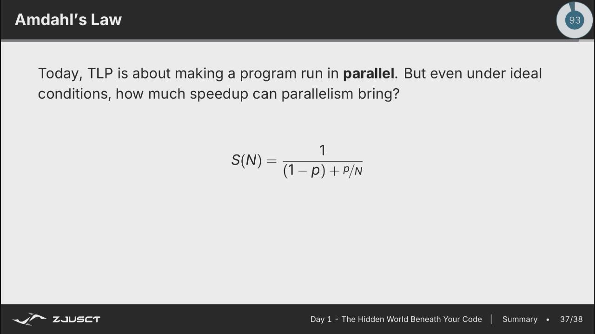

*图：Amdahl 定律表明，即使并行部分无限加速，串行占比仍决定加速上限；这也是“先减少必须串行的部分”的原因。*
