# 07-08 下午：HPC 中的计算机系统 II

计算节点、网络和存储共同构成一个程序的运行路径。峰值算力只描述其中一段；一次迭代可能停在 DRAM、网络启动、并行文件系统元数据或全局同步上。性能数字离开问题规模和计时边界没有解释力。

## HPC 系统与工作负载

高性能计算处理的并不只是“代码很慢”。典型任务同时有大规模计算、大规模数据和多节点协作：数值模拟需要反复更新网格；气候、材料、生物信息任务需要保存或读取海量数据；机器学习训练需要在大量 GPU 间交换梯度或激活。

超算系统通常由计算节点、存储节点、管理节点和互连网络组成。节点内部可有 CPU、GPU、内存和本地盘；节点之间通过以太网、InfiniBand、RoCE/RDMA 等网络通信。一个任务若频繁交换小消息，网络延迟很重要；若读写巨大张量或检查点，网络/存储带宽更重要。

把单节点峰值乘以节点数，不等于真实应用性能。节点数增加后，通信、同步、负载不均和文件系统竞争都会增长。所谓可扩展性，就是在这些额外成本存在时，性能还能保留多少。

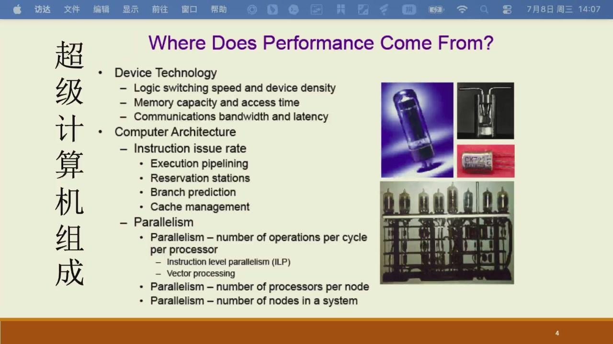

*图：晶体管和存储器提供物理基础，流水线、分支预测与 cache 组织单核执行，再由 SIMD、多核和多节点继续放大并行度。任一层供给不足都会限制上层。*

HPC 集群与通用分布式数据系统都由许多机器和网络组成，关注点却常不同。科学计算倾向让计算节点对规则数值核做紧密同步，低延迟互连十分重要；MapReduce 一类系统更强调把任务移到数据附近、容错和海量数据吞吐。现实系统会交叉使用这些思想，不能只看“有没有很多节点”判断它属于哪一类。

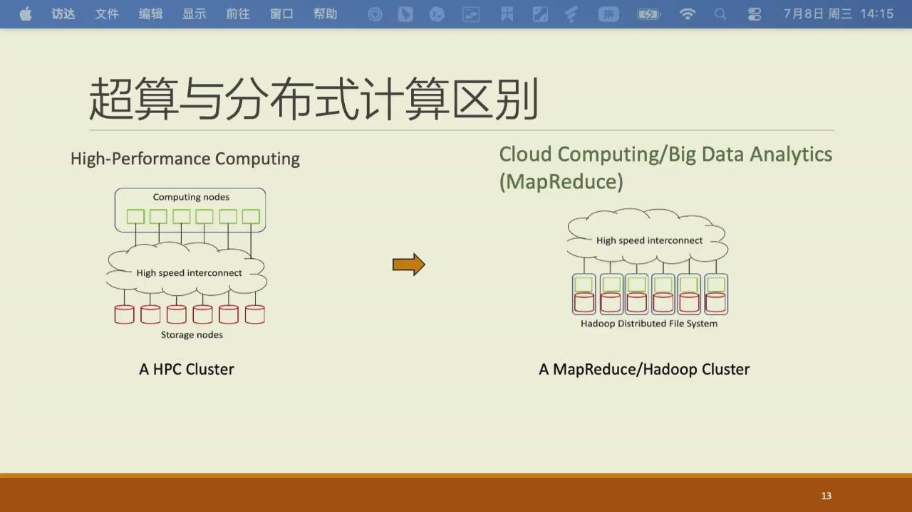

*图：HPC 常围绕紧耦合并行计算组织高速互连，数据分析系统更常围绕分布式存储切分任务；图展示的是典型侧重，不是互斥分类。*

## 峰值性能与基准测试

浮点性能常以 FLOPS 表示，每秒执行的浮点运算次数。若一个处理器有若干核心，每核每周期能发射若干条 FMA（fused multiply-add，乘加）指令，每条又有多个 SIMD lane，则理论峰值大致是：

$$
\text{peak FLOPS} = \text{cores}\times\text{frequency}\times\text{operations/cycle/core}
$$

FMA 把 `a*b+c` 视为两次浮点操作。这个公式只是假设所有单元每周期都饱和工作。实际程序还要读数据、处理地址和分支、等待同步；因此它通常达不到峰值。

TOP500 常用 HPL/LINPACK 衡量大规模双精度线性方程组求解性能。HPL 和 HPCG 观察的是两种不同压力，不能把其中任何一个当成“真实应用平均分”。

| 基准 | 主要计算形态 | 容易暴露的能力 |
| --- | --- | --- |
| HPL | 稠密矩阵分解，规则矩阵乘法多 | 浮点吞吐、数据复用和批量通信 |
| HPCG | 稀疏计算、间接访存、全局同步 | 内存层级、网络延迟和同步代价 |

同一台机器在两者中的相对表现可能差很多。看见“X PFLOPS”时，还要确认精度、理论峰值还是实测值、问题规模、节点数和并行配置。

??? example "读懂一条 FLOPS 宣传数字"

    需要同时问清精度（FP64、TF32、INT8）、它是理论 peak 还是基准实测、问题是稠密还是稀疏、使用了多少节点，以及是否把通信和 I/O 排除在计时外。缺少其中任一项，“更高”都无法直接推导出自己的程序会更快。

基准还有一个常见误区：它给出的往往是最佳配置下的大规模结果。小规模问题可能装不满设备；节点数增加后，通信与同步比例也会变。因此比较算法或系统时，至少说明问题规模、数据类型、节点数、每节点进程/线程数和计时边界。把初始化、文件读入、通信和核心计算混在一个数字里，结论很难解释。

## 计算、内存、网络与 I/O 瓶颈

性能常由最慢的资源决定。矩阵乘法做很多乘加、能复用数据，可能接近计算上限；逐元素扫描大数组，每读取少量数据只做一次加法，常受 DRAM 带宽限制；分布式稀疏算法则可能受网络延迟限制。

用 Roofline 的语言，运算强度为：

$$
I=\frac{\text{floating-point operations}}{\text{bytes moved}}
$$

可达性能不超过计算峰值和 `内存带宽 × I` 的较小值。这个公式用来决定优化方向：若已被带宽限制，就应减少搬运、提高复用；若计算单元没有吃满，才考虑向量化、并行和更高效的算子。

### 延迟与带宽

传一条消息的时间可粗略写成

$$
T\approx\alpha+\frac{n}{B},
$$

其中 $\alpha$ 是软件栈、网卡和链路启动带来的固定延迟，$n$ 是消息大小，$B$ 是有效带宽。频繁发送很小的消息时，主要受 $\alpha$ 限制；每次传很大的数组时，才会逐渐接近带宽 $B$。这一区别解释了为什么分布式程序常把细碎通信合并成较大的 buffer，也解释了为什么一个标称带宽很高的网络未必能改善小消息同步。

网络拓扑也会参与计算。节点内 GPU 间可能用 NVLink/NVSwitch，CPU 与网卡或 GPU 间可能经过 PCIe，不同 socket 的设备还可能跨 NUMA 互连；节点间则经过交换机网络。通信库会选择树、环、分层等算法来适配参与者数量和消息大小。写 MPI 程序时，除了“发送了多少字节”，还要观察“发送了多少次、哪些 rank 在等、数据是否跨了不必要的层次”。

RDMA（remote direct memory access）把数据路径从“远端 CPU 收包、复制到内核、再复制到用户缓冲区”缩短为网卡直接读写已注册的用户内存。InfiniBand、RoCE 等互连常提供这类能力，MPI 可以在通信库与驱动支持时利用它。

??? info "RDMA 不等于远端任意指针访问"

    内存需要注册，通信双方要建立队列与访问权限，程序还要等待完成事件。RDMA 缩短了 CPU 参与和复制路径，没有消灭链路延迟。非阻塞 `MPI_Isend` 返回后，发送缓冲区在相应 `MPI_Wait` 完成前仍不能被改写。

集体通信也不是“许多点对点调用的语法糖”。例如 `MPI_Allreduce` 需要所有 rank 提供局部值并得到同一个归约结果；实现可以用树减少步骤，也可以用 ring 分摊大消息带宽。某个 rank 晚到会让其余 rank 在集合点等待，因此 profile 中的 Allreduce 时间可能反映前面计算不均衡，而非网络本身差。训练中的梯度同步、数值模拟的全局残差和分区边界计算都要把这种等待计入关键路径。

强扩展和弱扩展是两种不同实验。强扩展固定总问题规模，增加资源后每个进程工作变少，通信和串行部分会更早显出来；弱扩展让问题规模随资源同比增加，考察系统能否维持单位资源的效率。两者都值得报告，但不能用一个图替代另一个问题。

| 实验 | 保持不变 | 观察量 | 理想结果 |
| --- | --- | --- | --- |
| 强扩展 | 总问题规模 | $T_p$、加速比、并行效率 | $T_p\approx T_1/p$ |
| 弱扩展 | 每个 worker 的局部规模 | 总运行时间或单位工作吞吐 | $T_p\approx T_1$ |

强扩展还有一个容易忽略的终点。若单个 rank 的局部块已经小到放不满向量单元、GPU 或通信 buffer，继续增加节点会同时降低计算效率和通信效率。此时不是“网络再快一点”就能恢复线性加速，而是问题规模已经不足以支撑这种资源形状。

强扩展常报告效率 $E_p=T_1/(pT_p)$。它下降并不自动说明实现错误：固定问题被切得更细后，表面积/体积比增大，halo exchange、全局归约和启动延迟占比自然上升。弱扩展则固定每个 rank 的局部工作，理想情况下运行时间近似不变；若时间增长，应区分是网络拥塞、collective 算法、I/O 争用还是负载不均。两种图的横轴、问题规模、每节点 rank/线程布局必须写在图注中。

??? example "阿姆达尔定律怎样限制强扩展"

    假设一次运行有 5% 的时间无法并行，其余部分完全均分。即使用 64 个 worker，理想加速也只有 $1/(0.05+0.95/64)\approx15.4$，并行效率约 24%。若把不可并行部分降到 1%，同样 64 个 worker 的上限才提高到约 39.3。优化全局串行步骤，常比继续增加 worker 更有效。

## 作业调度与资源形状

共享超算不会让所有用户直接登录同一节点无限制运行。调度器依据作业脚本申请的节点数、核数、内存、GPU、时限和队列策略选择资源，分配后再启动进程。申请 4 个节点与在一个节点上启动 4 个进程是不同资源形状：前者引入节点间网络，后者主要竞争同一节点内存带宽。实验报告至少应保存节点列表、每节点 rank 数、线程数、绑定策略和 GPU 可见编号，否则同一命令在不同排程下的结果没有可比性。

walltime 也是算法约束。作业若超过申请时限可能被终止，长模拟需要把检查点写在可恢复的边界；时限申请过长又可能影响排队。交互节点适合编译、调试和小规模试验，正式性能数字应在获得明确资源配额的计算节点上采集，避免他人负载和登录限制混进数据。

## 超算的软件栈

一个 HPC 应用从上到下大致经过：

```text
应用：模拟程序、训练程序、脚本
并行/数学库：MPI、OpenMP、BLAS、FFT、GPU runtime
运行时和调度：作业系统、进程管理、通信库
操作系统和驱动：文件系统、网络、GPU 驱动
硬件：CPU、GPU、DRAM、SSD、NIC、交换机
```

上层应尽可能调用成熟库。例如 `dgemm`、FFT 或 GPU 框架里的矩阵乘法早就针对缓存、SIMD、线程和设备做了多年调优，调用它们是把这些积累复用起来。需要排错时，也应先定位层次：是算法有问题、库没有正确加载、MPI 通信异常、文件系统慢，还是节点资源没有申请到。

## 存储系统：文件不是总在本地磁盘上

HPC 常使用并行文件系统。它把数据分布在多个存储服务上，对计算节点提供一个统一目录树；多个进程可并行读写同一个大文件。这样能提供很高总带宽，但元数据、网络和服务器仍是共享资源。

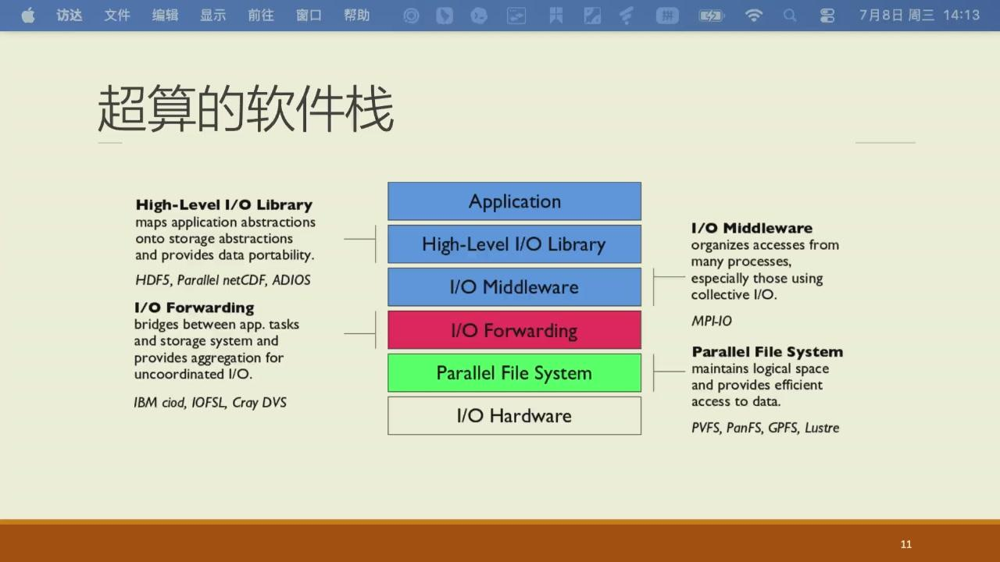

*图：HDF5、Parallel NetCDF、ADIOS 等库负责数据结构与可移植性，MPI-IO 组织多进程访问，并行文件系统再把逻辑文件映射到实际存储服务。每层都可能改变请求的大小、顺序和并发度。*

应用调用 `write` 后，数据未必已经落到磁盘。它通常先进入 C/C++ 运行库缓冲与内核 page cache，再由文件系统把请求拆分、合并或发往存储服务器。高层库还要保存数组维度、数据类型、分块和校验信息。因而“写一个数组”可能跨过多层，每层看到的数据单位都不同。

??? info "元数据与文件数据"

    文件名、目录项、权限、大小和块位置属于元数据；数组内容属于文件数据。创建一百万个小文件会产生一百万次目录查找、inode 分配和权限更新，即使总字节数不大，也可能先压满元数据服务。一个大文件的顺序读写则更容易让存储目标并行传输数据。

几个实际原则：

- 大量小文件会造成目录/元数据压力，尽量合并或按批读写；
- 多个进程同时写同一文件，要明确布局和同步；
- 经常重复使用的数据可缓存在计算节点本地盘或内存中，但要区分临时缓存和最终结果；
- 检查点是为了故障恢复，写得过于频繁会让 I/O 吞掉计算时间，太少又增加故障损失。

存储缓存的核心是把远处慢设备的数据暂存在近处快设备。它只在数据有复用、容量足够且一致性允许时有效；缓存不是无限大，也不是免费的。

### 检查点策略

长作业可能因节点故障、维护或时间限制中断。检查点把可恢复状态写到可靠存储，降低重算风险；写得太频繁会反复打断计算并挤占并行文件系统，写得太少则可能在失败后丢失很长一段工作。一次检查点的代价不只取决于数据量，还取决于所有 rank 是否同时突发写入、文件如何分块、元数据操作有多少，以及存储系统是否正被其他作业使用。

常见做法包括每个 rank 写独立文件、集中写入共享文件、分层先写本地盘再异步汇聚到并行文件系统。没有哪一种天然最好。关键是让恢复时能明确知道每一块状态对应哪个 rank/时间点，并在实际集群上测量写入和恢复时间。

并行文件系统通常把一个大文件条带化到多个对象存储目标（OST）或等价服务上。条带大小和条带数决定连续区段落在哪些服务上：单个顺序 reader 可能不需要很宽的条带，而许多 rank 读取不同大区段时，合理条带可提升总吞吐。小文件风暴更棘手，因为每个 `open`、目录查找和创建都要访问元数据服务；把一百万个小样本直接散落在共享目录，常会先压垮元数据而不是数据带宽。

计时 I/O 时要说明是否调用了 `fsync`、是否只计入进程把数据交给 page cache 的时间、是否包含最终落盘和全体 rank 的 barrier。否则一次看似很快的 `write` 可能只是把工作延后给内核。对检查点而言，正确性还包括原子性：写入中断后，恢复程序不能把半个新文件误认为完整检查点；常见做法是写临时名、完成并校验后再原子重命名，同时保存版本号和每个分块的元数据。

这里也要提一下持久内存（persistent memory）。普通 DRAM 断电后内容消失，SSD 则持久但访问接口和延迟不同。介于两者之间的非易失性内存曾被用于探索更大容量或更快恢复的层次；对程序员而言，关键仍是分清数据是否需要跨进程/断电保留，不能把“能持久”误解为“速度等同于 DRAM”。

## 指令集、编译器与微架构

ISA（Instruction Set Architecture）是软件与处理器之间的约定：指令长什么样、寄存器有哪些、内存模型和异常怎样定义。x86-64、ARM、RISC-V 都是 ISA；同一 ISA 下可以有许多不同微架构。编译器根据 ISA 生成指令，处理器的微架构决定这些指令怎样被流水化、乱序执行、预测分支和访问缓存。

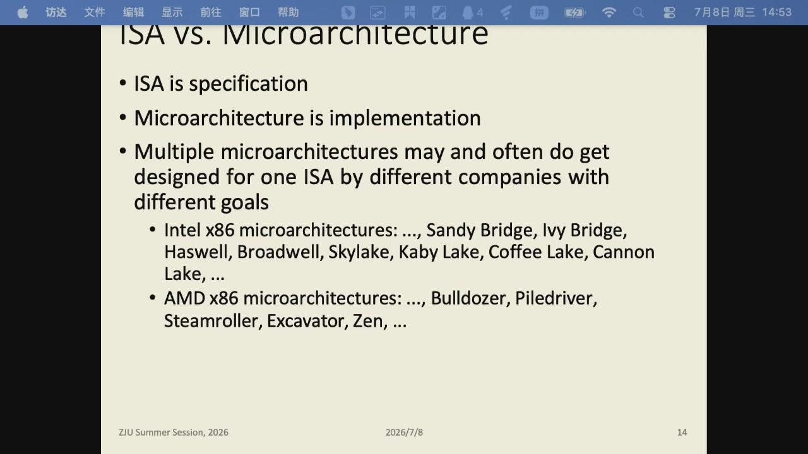

*图：ISA 是契约、微架构是产品；理解这个区分，才不会被“同一指令集就该同样快”误导。*

源代码到硬件执行中还有 ABI（application binary interface）。ABI 约定函数参数放在哪些寄存器或栈位置、返回值怎样传递、栈如何对齐、谁负责保存哪些寄存器。它让分别编译的目标文件和库能链接在一起。C/C++ 程序调用 BLAS、MPI 或系统库时，能正常运行依赖的正是这类约定；性能调试时看到函数调用、栈帧或符号名，也常会碰到 ABI 的痕迹。

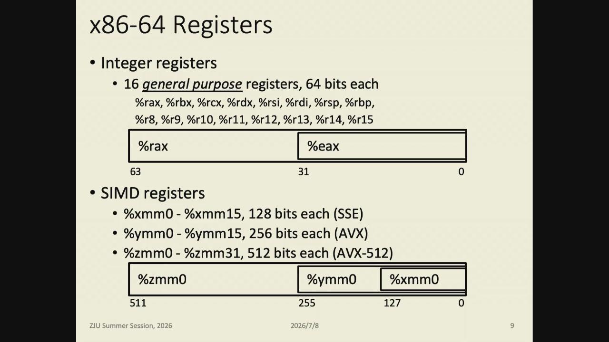

*图：寄存器是 ISA 给程序可见的存储；参数、返回值与临时量如何用它们，由 ABI 决定，也是读懂汇编的一把钥匙。*

编译过程通常经过预处理、编译、汇编和链接。优化器会内联小函数、展开循环、自动向量化、重排独立指令并选择目标指令集。`-O0` 与 `-O3` 的性能差异很大，但 `-O3` 不保证某个程序正确或最快：浮点运算的结合顺序、别名关系、数据对齐和分支结构都会影响优化器能否安全改写代码。遇到性能差异时，可以查看优化报告或汇编，而不是只凭编译选项猜测。

因此“代码能在两台 x86 机器上运行”不代表性能一样。不同 CPU 的缓存大小、FMA 数量、向量宽度、内存通道和分支预测器都可能不同。编译选项 `-march=native` 会针对当前机器生成代码，适合本机测量；若程序要发到不同节点，必须确认指令集兼容性。

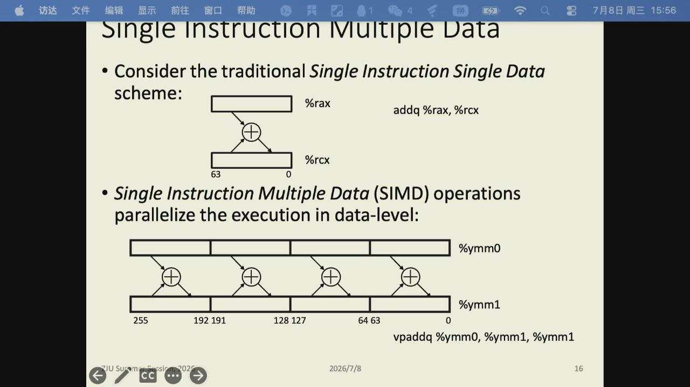

*图：SIMD 让一条指令并行处理多个元素；它能否生效取决于数据连续与是否用到向量指令。*

现代 CPU 用寄存器重命名、乱序执行和分支预测提高指令级并行度。它们不能消除真实数据依赖，也不能让随机 DRAM 访问变快。因此程序结构仍然重要：连续访问、独立迭代、可见的循环边界更容易被编译器和硬件利用。

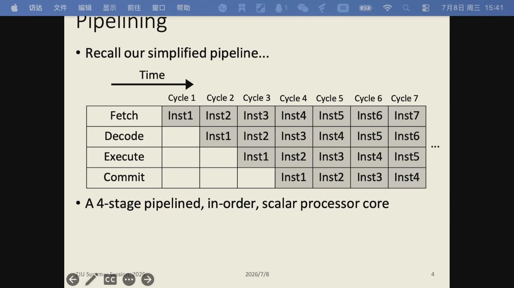

*图：流水线让吞吐提升，但真实依赖和分支会让管线停等；乱序与推测进一步填满空槽。*

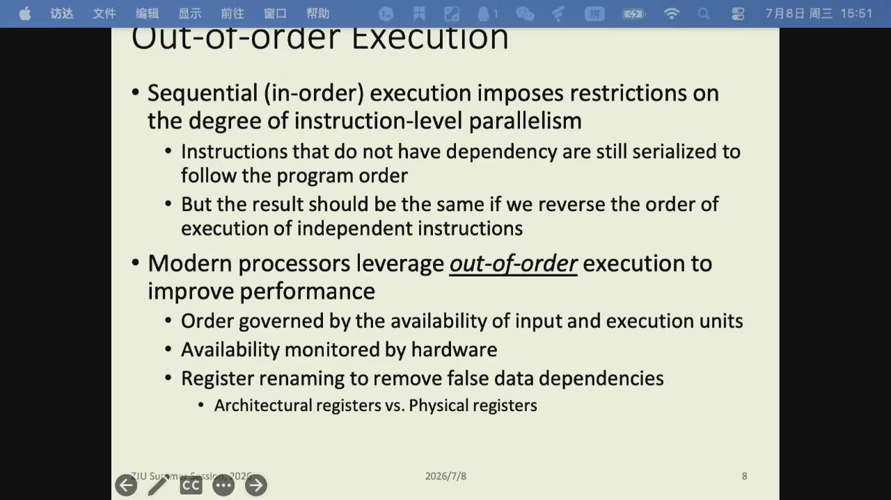

*图：乱序执行用寄存器重命名隐藏等待，同时保证对外仍像顺序执行；它是现代微架构提升指令级并行的核心手段。*

微架构优化常在延迟和吞吐之间做文章。某条浮点指令从输入到结果可能需要若干周期，这是 latency；执行管线若每周期都能接收一条新的独立指令，steady-state throughput 仍可接近每周期一条。只有一条递推依赖链时，后一次必须等前一次结果，暴露的是 latency；准备多个独立累加器时，硬件才能把管线填满。性能手册里的“latency 4 cycles、reciprocal throughput 0.5 cycles”描述的是不同量，不能互换。

| 现象 | 硬件看到的限制 | 常见代码改写 |
| --- | --- | --- |
| 长依赖链 | 下一条指令等上一条结果 | 多个局部累加器、树形归约 |
| 难预测分支 | 错误路径被清空 | 分块、mask、规则数据表示 |
| load 等待 | 操作数尚未从 cache/DRAM 到达 | 提高局部性、预取、增加独立工作 |
| 执行端口饱和 | 同类指令争用同一管线 | 混合不同资源或减少指令数 |

同样是对数组中不小于 `128` 的元素求和，若数组先排序，条件分支会集中地为真或为假，预测器更容易猜中；随机排列时，预测错误造成的流水线清空会使时间出现数倍差异。这个例子说明数据分布会改变处理器实际看到的指令流，并顺带解释了“为排序而排序”为什么往往得不偿失。

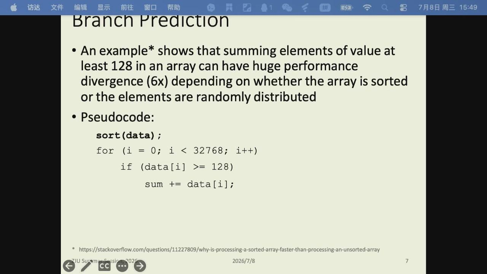

*图：排序让相同判断连续为真或连续为假，预测器更容易复用历史；随机输入使分支结果频繁变化。*

## 内存层级与虚拟内存

“内存 32 GB”和“硬盘 1 TB”不是同一类资源。DRAM 是运行时主要工作区；SSD/HDD 是持久存储。CPU 还在 DRAM 前放置多级 cache，利用时间/空间局部性减少等待。

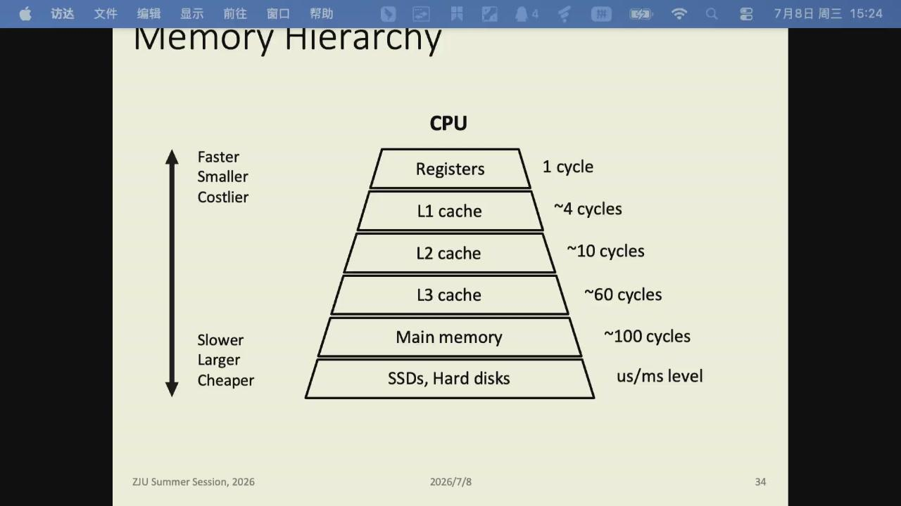

*图：存储层级的本质是在“快小贵”与“慢大便宜”间取舍；理解才能判断某个数据应停在哪一层。*

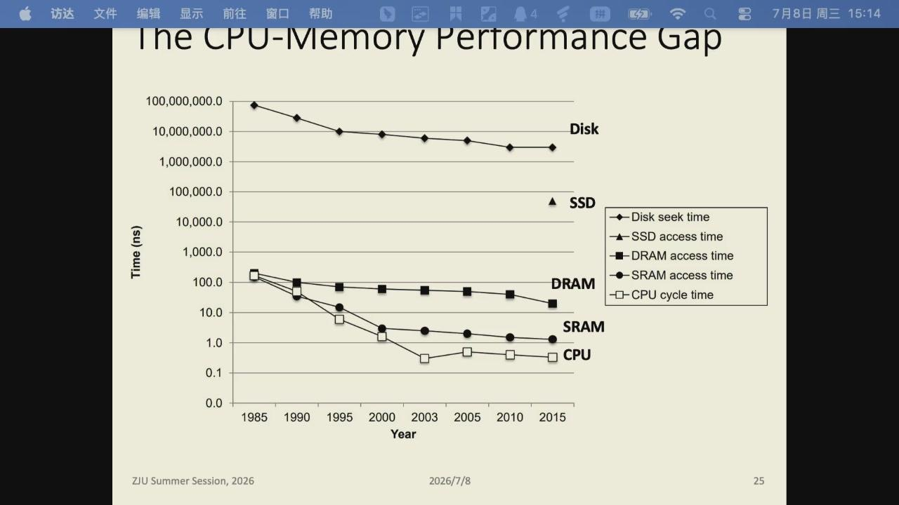

*图：纵轴使用对数尺度。靠近处理器的 SRAM cache 缓解 CPU—DRAM 差距，但 miss 仍会把一次 load 的等待放大许多周期。*

“某级 cache 只有几纳秒”并不表示随机读大数组的每次访问都只花几纳秒。工作集超过容量后会不断替换 line；多个 outstanding miss 能重叠一部分延迟，最终又可能受内存并发度和带宽限制。因此延迟测试常用指针链迫使下一次地址依赖前一次结果，带宽测试则用许多独立、连续的访问把内存通道填满。两种 benchmark 测到的是不同上限。

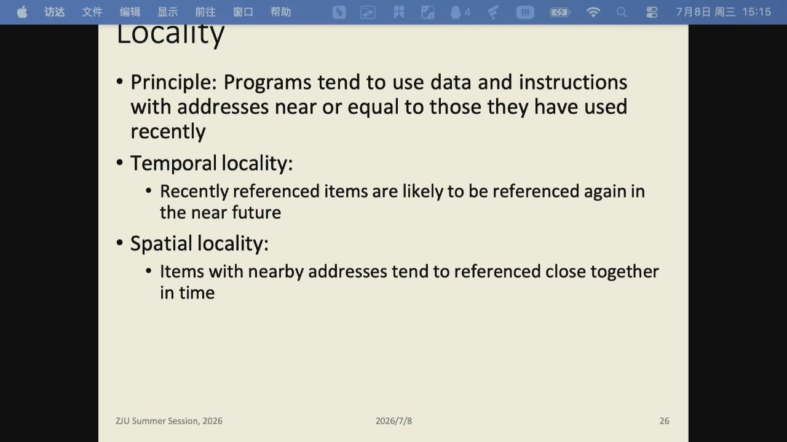

*图：局部性是 cache 存在的前提——顺序访问能命中，随机跨大步长访问会不断 miss。*

程序看到的是虚拟地址。操作系统用页表把虚拟页映射到物理页，使进程互相隔离，也避免物理内存必须连续分配。TLB 是地址转换的缓存；TLB 未命中需要更慢的页表遍历。若页面不在 DRAM，访问会触发 page fault；若系统把页面换到 SSD，再次访问的代价远高于普通 cache miss。

DRAM 也不是一种单一实现。SRAM 静态保存位值，速度快、面积和成本高，常用于 cache；主内存通常是 DRAM，密度高、价格低，但需要周期性刷新。DIMM 是把多颗 DRAM 芯片做成可插拔内存条的常见形态。

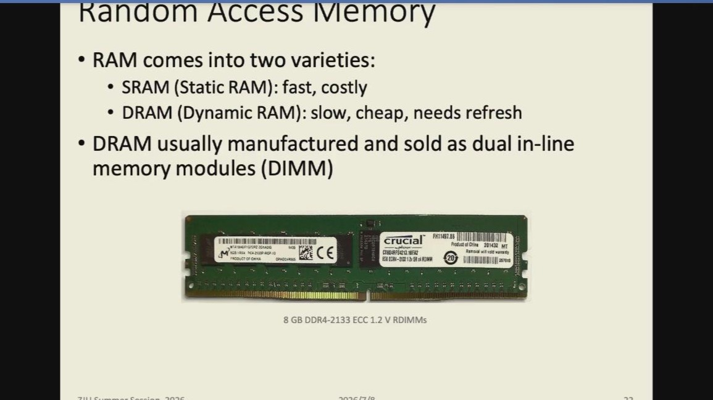

*图：SRAM 与 DRAM 在速度、成本、密度上取舍不同；理解二者的差异能解释为什么 cache 往往只做 SRAM、主存用 DRAM。*

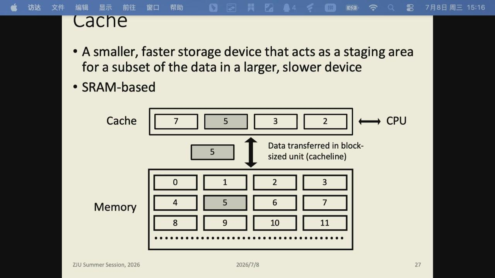

*图：cache 是 CPU 与主存之间的临时缓冲区；命中省去去 DRAM，miss 才付出完整代价。*

大而随机的工作集会同时伤害 cache 和 TLB。顺序访问、分块处理和控制工作集大小，常常比在某一条算术指令上微调更有用。

### Cache 地址映射

一个物理地址进入 cache 时，可粗略拆成 `tag | set index | block offset`。offset 选择 cache line 内的字节，set index 选择候选集合，tag 用来确认该槽位保存的是否正是目标内存块。若一个 set 有 $W$ 个 way，它最多同时保留 $W$ 条映射到该 set 的 line。

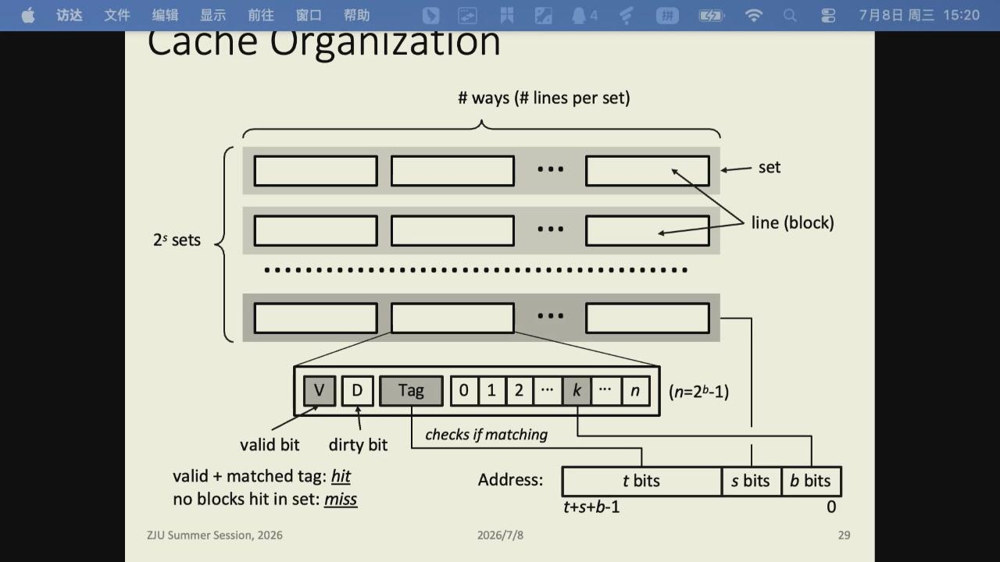

*图：命中需要 valid bit 有效且 tag 匹配；dirty bit 表示写回式 cache 中该 line 已修改，替换前需要写回下一层。*

三类 miss 对优化方向的提示不同。

- compulsory miss 是第一次访问一条 line，通常只能靠预取或批量访问隐藏；
- capacity miss 来自活跃工作集超过 cache 容量，分块可缩小同时驻留的数据；
- conflict miss 来自过多热点地址映射到同一 set，改变数组间距、padding 或 tile 尺寸可能缓解。

写操作也要决定“何时写到下一层”。两种常见策略：**写回（write-back）**先只更新 cache line 并把 dirty bit 置 1，延迟到该 line 被替换时才写回主存；**写直达（write-through）**每次写都立即更新下一层。写回能减少对内存的写流量，代价是替换时多一步落盘判断；写直达一致性更简单，却让每次写都承担下一层延迟。现实中 x86 cache 多采用写回 + write-allocate，也有 write-through + no-write-allocate 等组合存在。会话里“改了一行数据，内存里却还是旧值”往往就来自写回尚未同步。替换时的候选策略（如 random、LRU）决定当 set 已满时驱逐哪条 line；它和写策略一起影响工作集略超容量时的命中率。

真实处理器还有多级 cache、复杂替换策略、硬件预取和虚拟/物理地址细节，这个模型用于解释现象，不是让程序手算每一次替换。

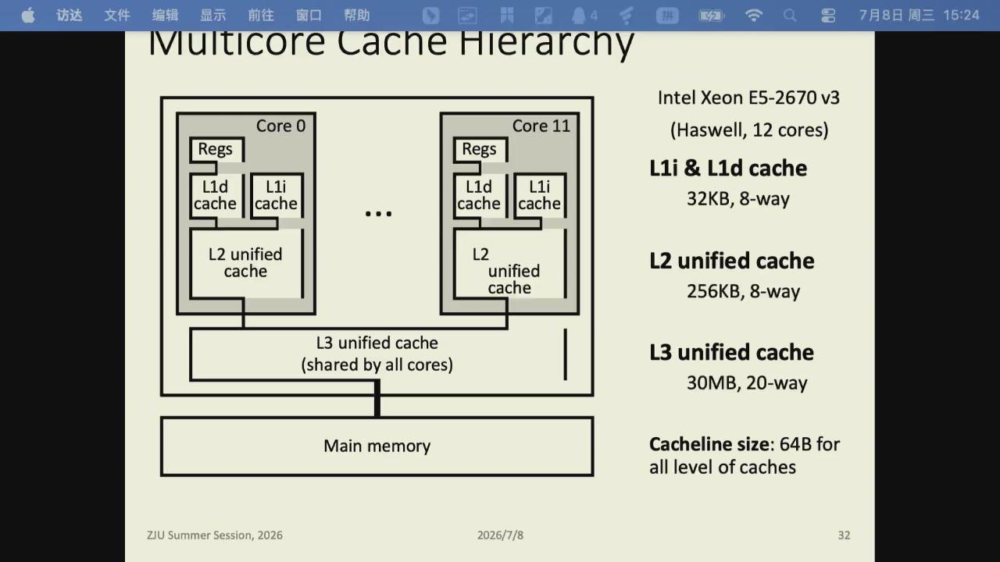

*图：私有 cache 提供低延迟，共享 L3 便于跨核数据与容量复用；核心之间写同一 cache line 时仍需一致性协议协调。图中容量对应特定 Xeon，不能当成所有机器的固定配置。*

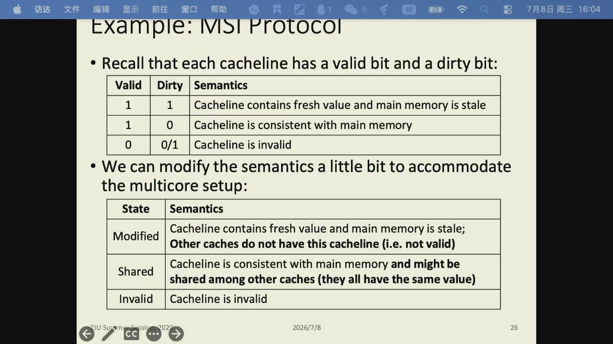

*图：MSI/MESI 之类协议保证一个核心写入后，其它核心不会长期读到旧值；这也是 false sharing 代价的物理来源。*

### 内存分配与数据位置

进程请求一块堆内存时，`malloc` 先由用户态分配器管理小块；必要时再通过 `brk` 或 `mmap` 向内核取得更多虚拟地址范围。真正的物理页可能在第一次读写时才分配。对单线程小程序，这些细节通常无需干预；对大数组、多线程初始化和 NUMA 机器，初始化路径会决定页面最终靠近哪个 socket。

数组的连续布局也并不等于所有访问都连续。以行主序 C/C++ 数组为例，固定行、沿列递增通常连续；固定列、沿行递增会跨较大的地址步长。数据结构若由大量指针串接，遍历时还会失去空间局部性。把热点字段整理为连续数组，或采用 AoS/SoA 中适合访问模式的一种，往往比替换一个更快的算术操作更有影响。

## 多核、线程和同步

多核把单机性能从单核频率竞争转向并行协作。不同线程处理独立数据时可以接近线性加速；若它们频繁写同一份状态、被锁串行化、或争夺内存带宽，加速会迅速下降。

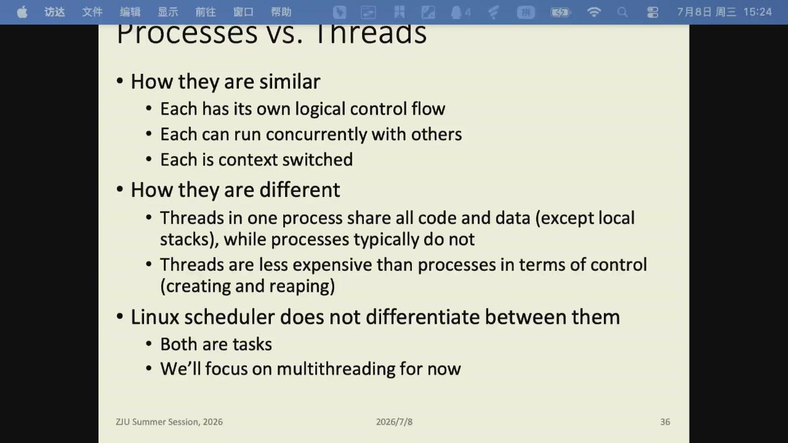

*图：进程与线程共享“各自有状态”的相似点，区别集中在是否共享地址空间、通信与故障代价。*

所谓临界区，就是一次只允许一个执行流修改的共享部分。不要把 `count++` 当成天然原子操作：它至少涉及从内存读取、在寄存器中加一、写回内存三步；两个线程交错后可能都从同一个旧值开始计算。互斥锁、原子读改写或“各线程私有累加、最后归约”分别对应不同的正确性和性能代价。


*图：两个线程若都读到同一旧值，各自加一后再写回，会丢失一次更新。*

线程共享进程的地址空间，必须处理数据竞争；进程间默认隔离，需要 IPC 或 MPI 通信。线程调度、上下文切换和缓存迁移都有成本；NUMA 机器还要尽量让线程处理本地内存。这些约束会落实为线程私有数据、归约、消息缓冲区和进程/线程绑定。

并行规模还受阿姆达尔定律约束。若总时间中不可并行部分占 $s$，即便其余部分在 $p$ 个处理器上理想加速，加速比也只有

$$
S(p)=\frac{1}{s+(1-s)/p}.
$$

这个式子提醒人优先找关键路径。一次全局 barrier、串行 I/O、主线程初始化或锁竞争都可能成为 $s$；在把线程数从 32 加到 64 之前，先测量这些部分通常更有效。

## 性能分析流程

假设一个多节点程序“CPU 利用率不高、运行很慢”。不能直接增加线程。先分解：

1. 用 profiler 看时间在计算、文件读写还是 MPI 等待；
2. 若内层循环是随机访存，先检查数据布局和缓存复用；
3. 若 MPI 等待长，查看负载是否均衡、消息是否过细、网络拓扑是否匹配；
4. 若所有节点同时读大量小文件，改 I/O 布局；
5. 若计算确实占主导，才检查向量化、线程数和数学库。

这套顺序贯穿整个 HPC 课程。优化的第一步是确认系统真正的瓶颈，先把瓶颈定位准确，再决定调哪个参数。
