# 07-10 下午：向量化并行计算基础

同一段数组计算可能停在 Python 解释器、标量指令[^scalar]、cache miss，或不规则的数据依赖[^dependency]上。SIMD[^simd] 只处理其中许多相同、独立元素操作的一段；进入 intrinsic[^intrinsic] 之前，先让循环边界、别名关系和数据布局足够明确。
[^scalar]: 标量。单独一个数，或一次只处理一个元素的运算方式。
[^dependency]: 依赖。前一次计算的结果被后一次计算使用，会限制并行或重排。
[^simd]: single instruction multiple data，单指令多数据。一条指令同时处理多个数据元素。
[^intrinsic]: 编译器内置函数，让 C/C++ 代码直接写出特定向量指令而不写汇编。

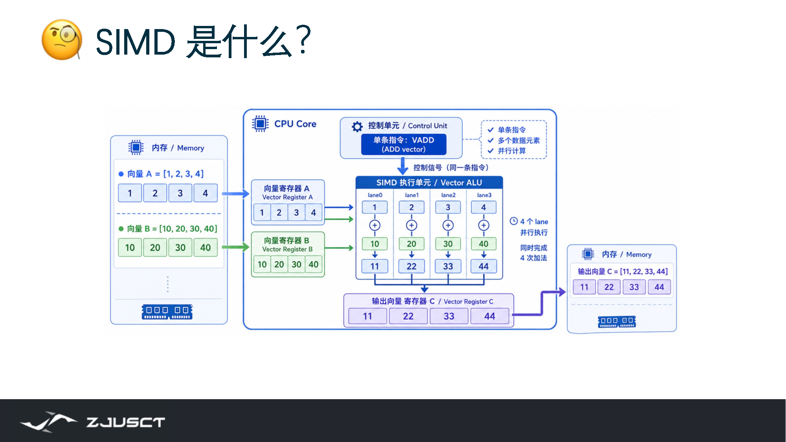

*图：标量指令一次处理一个元素，SIMD 指令把同一种运算分发到多个 lane。lane 数由寄存器宽度和元素类型共同决定。*

???+ note "为什么叫“向量化”"

    之所以叫**向量化**，是因为把一批连续的元素抽象成一个整体来处理，就像把一堆标量从视觉上竖成一列、排成一串，数学和硬件里都习惯把这串数叫**向量（vector）[^vector]**。于是把一整串数一次处理，就叫向量化。这里的向量指一串同类型数据，和上一章讲数学向量是同一层意思；两者的共同点都是把一组数当作一个单元，整体参与同一运算。
    [^vector]: 向量。一组同类型元素按顺序组成的整体。

    它和把代码写得像 NumPy[^numpy] 那样逐行简洁是两个不同层面的事——向量化指的是最终被硬件以整串方式执行，具体是否真的发生，要看编译器、指令集和数据是否连续。
    [^numpy]: Python 数值计算库，用连续内存和批量运算替代显式 Python 循环。

## 标量循环与批量计算

设有两个长度为 `n` 的向量，需要计算逐元素和：

$$
c_i=a_i+b_i,\qquad 0\le i<n
$$

标量写法把 `i=0,1,2,...` 依次执行；向量化写法把一段连续的 `a` 和 `b` 当成整体交给硬件。假如一条指令有 8 个 `float` lane，理论上可以同时做 8 次加法。

```text
标量： a[0]+b[0] -> c[0]，再处理 a[1]+b[1] -> c[1]
向量： [a0..a7] + [b0..b7] -> [c0..c7]
```

“同时”在这里有逻辑和硬件两个层次。

- **逻辑向量化**：把逐个元素的意图写成一整个数组操作，例如 `a + b`；底层实现选择怎样做。
- **硬件向量化**：处理器实际用一条 SIMD 指令驱动多个运算 lane[^lane]。
[^lane]: SIMD 通道。向量寄存器中并行处理一个元素的一部分硬件。


*图：同一个表达式，标量按元素逐个算，向量把多个元素放进一条指令。*

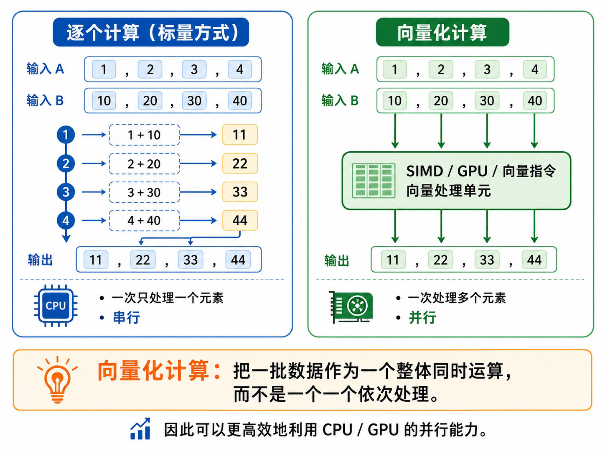

*图：向量化的逻辑可以由不同硬件执行；SIMD、GPU 与向量处理单元是同一思想的几种落地方式。*

两者有关，但不是同义词。NumPy 代码快，可能因为避开了 Python 解释器循环、调用了 C/BLAS 库、用了 SIMD，或三者兼有。不要把使用 NumPy 机械地等同于一定使用 AVX[^avx]。
[^avx]: advanced vector extensions，x86 CPU 的向量指令集扩展。

## 数据依赖

向量化的关键要看不同迭代之间是否互相需要结果，而不是循环的语法。下面这个循环的每次迭代只读 `a[i]`、`b[i]`，只写 `c[i]`，所以它是典型的数据并行：

```cpp
for (int i = 0; i < n; ++i) {
    c[i] = 2.0f * a[i] + b[i];
}
```

下面两个循环看起来也很短，性质却不同：

```cpp
// 依赖上一轮的结果：不能直接把 i 的各轮独立并行。
for (int i = 1; i < n; ++i) {
    a[i] += a[i - 1];
}

// 多轮都写同一个 sum：直接并行会产生数据竞争。
for (int i = 0; i < n; ++i) {
    sum += a[i];
}
```

第一个是前缀和，形成一条依赖链；第二个是归约。它们多数也有并行算法，只是做法不同：并行前缀和会分块再合并，归约会让每个工作者先算局部和、最后相加。不能因为看到 `for` 就默认可以加并行指示，是否可行取决于循环里是哪种依赖。

??? example "为什么前缀和不能只把循环改成 AVX"

    `a[i] += a[i-1]` 中第 8 个元素需要第 7 个元素的最终值。把八个元素装进一个向量后，这个依赖仍在向量内部。并行 scan 会先在各块内求局部前缀，再扫描各块总和，最后把前缀偏移加回各块；它是另一种算法，而非一条更宽的加法指令。

### 循环并行性的条件

下列四个问题

1. 第 `i` 轮会读取第 `i-1` 轮刚写的值吗？
2. 两轮会写到同一地址吗？
3. 循环体是否有改变控制流的早停、I/O 或随机状态？
4. 即使算术独立，数据是否以规则、连续的方式存放？

前两项为“是”时，先处理依赖或共享写；第四项为“否”时，即便能够向量化，内存访问也可能让收益很小。

### 循环融合、拆分与数据布局

同样的数学式可以写成很不一样的循环。考虑

```cpp
for (int i = 0; i < n; ++i) tmp[i] = a[i] * b[i];
for (int i = 0; i < n; ++i) out[i] = tmp[i] + c[i];
```

若 `tmp` 没有别的用途，可以融合成一个循环，少写一次、少读一次 `tmp`：

```cpp
for (int i = 0; i < n; ++i) out[i] = a[i] * b[i] + c[i];
```

这种改写通常有利于 cache，也让编译器更容易生成 FMA。反过来，循环体若同时夹着一段难向量化的分支和一段规则算术，拆成两个循环有时更好：规则部分可保持连续访问和无分支，代价是多走一遍数组。没有固定答案，关键在于估算多出的内存流量和获得的规则性谁更重要。

数据结构也会决定循环能否形成连续向量。若每次只需要很多粒子的 `x` 坐标，结构数组（AoS）会把不需要的 `y,z,mass` 一起读进来：

```cpp
struct Particle { float x, y, z, mass; } p[n];
for (int i = 0; i < n; ++i) sum += p[i].x;
```

把热点字段分开保存（SoA）后，`x[i]` 连续，SIMD load 和 cache line 都不会携带无关字段：

```cpp
struct Particles { float x[n], y[n], z[n], mass[n]; };
```

AoS 并非总错。一次总要同时读取一个粒子的全部字段时，它反而方便。布局应服从最内层循环实际读取的字段，而不是服从数据结构看上去是否面向对象。

## NumPy 与数组编程
Python 的 `for` 循环每一轮都要处理对象、类型和解释器调度，对大数组很不划算。NumPy 的 `ndarray` 把同类型元素连续存储，并把循环放在编译后的底层实现中。这种把整个数组当作操作对象的写法，通常称为数组编程[^array-programming]。
[^array-programming]: array programming，数组编程。用整体数组表达式描述运算，底层再决定怎样执行。

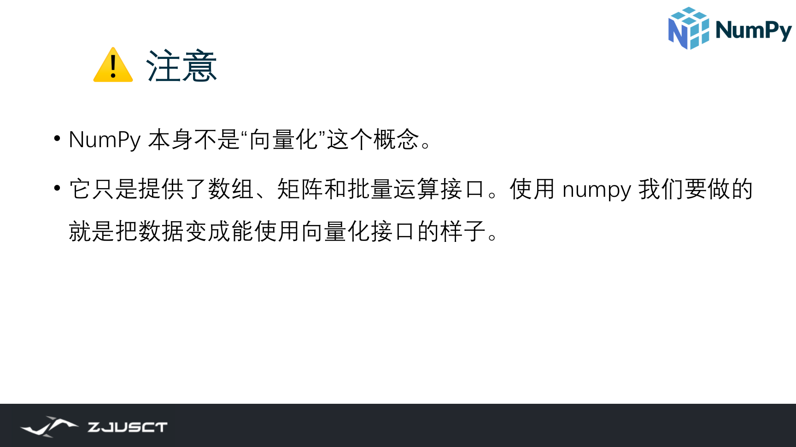

*图：NumPy 提供的是批量运算接口；是否真正用上 SIMD，取决于底层库与数据布局，而不是调用 `np.*` 本身。*

```python
import numpy as np

n = 1_000_000
a = np.arange(n, dtype=np.float64)
b = 2 * a

# 写出问题的数学结构，而不是在 Python 中重复解释一百万次循环。
c = 2 * a + b
assert np.all(c == 4 * a)
```

这里 `2 * a + b` 的每个位置相互独立。它不仅更短，也给底层实现留下了使用连续循环、SIMD 与多线程库的空间。


*图：两段代码做同一件事——逐元素矩阵相加；用 NumPy 接口写出的形式更容易被底层的批量循环和 SIMD 加速。*

### 广播与数组形状

NumPy 经常不需要显式复制数据。若 `x` 的形状是 `(m, n)`，`bias` 的形状是 `(n,)`，`x + bias` 会把同一条 `bias` 逻辑上应用于每一行。这叫广播（broadcasting）。

```python
x = np.array([[1., 2., 3.], [4., 5., 6.]])
bias = np.array([10., 20., 30.])
print(x + bias)
# [[11., 22., 33.], [14., 25., 36.]]
```


*图：`reshape` 只改变形状解释，不复制元素；后续广播、切片和矩阵乘法都依赖对形状的正确理解。*

广播很方便，但要先确认 shape。`(m, 1)` 和 `(m,)` 在 NumPy 中含义不同；不确定时打印 `array.shape`，而不是凭感觉猜结果。

### 切片：二维邻居求和

每个格子的新值等于原值加右上和右下邻居；最右列没有邻居，按 0 处理。朴素实现会有边界判断：

```python
def slow(a: np.ndarray) -> np.ndarray:
    rows, cols = a.shape
    out = np.empty_like(a)
    for i in range(rows):
        for j in range(cols):
            upper_right = a[i - 1, j + 1] if i > 0 and j + 1 < cols else 0
            lower_right = a[i + 1, j + 1] if i + 1 < rows and j + 1 < cols else 0
            out[i, j] = a[i, j] + upper_right + lower_right
    return out
```

更适合数组表达的做法是先补零，再用相同形状的切片对齐：

```python
def vectorized(a: np.ndarray) -> np.ndarray:
    p = np.pad(a, ((1, 1), (0, 1)), mode="constant")
    # p[1:-1, :-1] 对应原数组；其余两个切片已对齐到右上、右下邻居。
    return p[1:-1, :-1] + p[:-2, 1:] + p[2:, 1:]

a = np.arange(9).reshape(3, 3)
assert np.array_equal(slow(a), vectorized(a))
```

这里并没有神奇地消除计算，我们只是把边界问题转成一次规则的 padding，把两重循环转成三个规则的切片。向量化的价值在于改变数据的表示，让计算形状变规则。

### 矩阵乘法与 BLAS

若 $A\in\mathbb{R}^{N\times K}$、$B\in\mathbb{R}^{K\times M}$，结果为：

$$
C_{ij}=\sum_{k=0}^{K-1}A_{ik}B_{kj}
$$

每个 `C[i, j]` 的输出位置独立，因而可以并行；但计算同一个位置时需要沿 `k` 累加。正确的首选是：

```python
C = A @ B                 # 或 np.matmul(A, B)
np.testing.assert_allclose(C, np.dot(A, B))
```

`@` 通常会进入 BLAS 库。它不只做 SIMD，还会考虑缓存分块[^cache-blocking]、线程数、寄存器阻塞和目标 CPU。自己写三重 Python 循环几乎不可能赢过它。
[^cache-blocking]: 缓存分块。把大矩阵或数组切成块，让块内数据在缓存中复用。


*图：手写 Python 三重循环做矩阵乘法；相同的计算改写成 `A @ B` 后交由 BLAS，才能让缓存分块、SIMD 与多线程真正生效。*

!!! warning "数组表达式也可能制造临时数组"
    `y = a * b + c * d` 可能需要中间数组。对极大数组，这会增加内存流量和峰值内存。先用 `timeit`/profiler 验证；必要时用 `out=`、就地操作、NumExpr 或融合后的 kernel，而不是凭空假设少一行代码一定更快。

## SIMD 指令与向量寄存器

SIMD 是 Single Instruction, Multiple Data。一条指令携带一个操作码，例如 packed add；向量寄存器中有多个 lane；所有有效 lane 同时做相同动作。以 256 位寄存器为例，它可装 8 个 `float` 或 4 个 `double`。

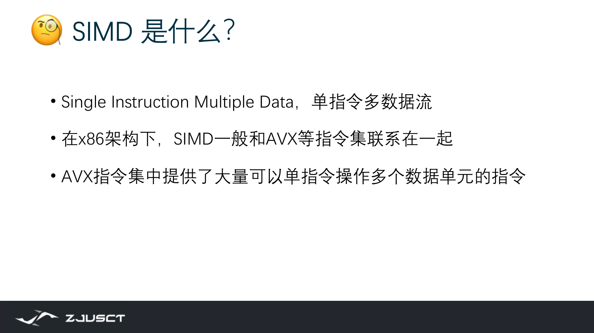

*图：SIMD 指一条指令同时作用于多个数据元素；x86 的实现集中在 AVX 这类指令集。*

```text
__m256:  [a0 a1 a2 a3 a4 a5 a6 a7]
          +  +  +  +  +  +  +  +
__m256:  [b0 b1 b2 b3 b4 b5 b6 b7]
          =  =  =  =  =  =  =  =
__m256:  [c0 c1 c2 c3 c4 c5 c6 c7]
```

NEON[^neon] 是 Arm 架构的传统 SIMD 指令集，SVE 则把向量长度做成运行时可变。常见指令扩展的向量宽度和编程模型并不相同。
[^neon]: Arm 架构的 SIMD 指令集，传统 NEON 寄存器为 128 位。

| 指令扩展 | 向量宽度 | 8 位元素数 | 32 位元素数 | 需要留意的边界 |
| --- | ---: | ---: | ---: | --- |
| SSE | 128 位 | 16 | 4 | x86 的较早一代 SIMD |
| AVX2 | 256 位 | 32 | 8 | 整数和浮点 intrinsic 名称不同 |
| AVX-512 | 512 位 | 64 | 16 | 支持 mask；具体子扩展需查 CPU |
| NEON | 128 位 | 16 | 4 | ARM Advanced SIMD |
| SVE | 实现决定 | 运行时决定 | 运行时决定 | 循环不能把 lane 数写死 |

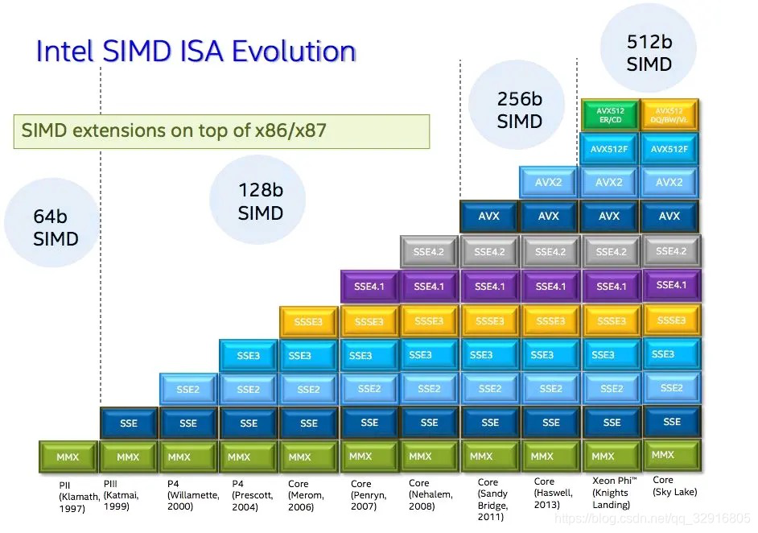

*图：Intel x86 SIMD 是逐步叠加出来的——MMX、SSE、AVX、AVX-512 一代代加宽加能力；指令集版本决定有哪些工具可用。*

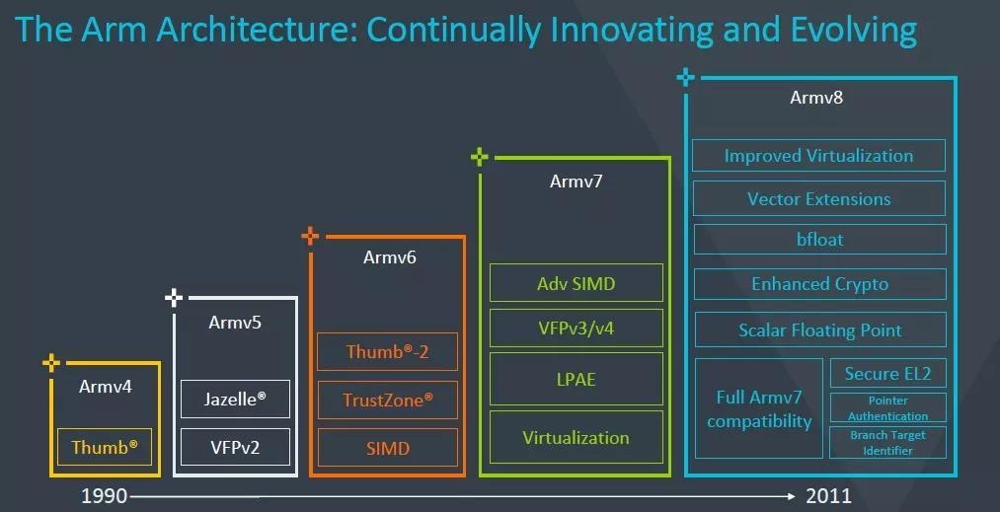

*图：Arm 同样在持续加入向量指令；理解 SIMD 时，x86 与 Arm 只是同一思想的两种实现。*

更宽的寄存器需要更多电路、供电和散热，还可能让 CPU 降频；内存带宽也可能先到极限。指令集版本只能说明有哪些工具，不能单独推出程序会快多少。

### 加速比的限制

假设 AVX2 一次可处理 8 个 `float`，这只意味着计算指令的工作量有机会缩小约 8 倍。总时间还包括：

- 从缓存或 DRAM 加载 `a`、`b`；
- 存回 `c`；
- 循环控制和地址计算；
- 未对齐或跨 cache line 的访问；
- 尾部元素处理；
- 分支、依赖和其他不可向量化部分。

若程序每个元素只做一次加法却需要读两次、写一次，那么它很可能先受内存带宽限制。SIMD 仍有帮助，但不会线性加速。这是阅读 benchmark[^benchmark] 时必须保留的怀疑。
[^benchmark]: 基准测试。固定输入、编译选项和统计方式后比较性能。

更宽的向量寄存器也不是无条件更好。AVX2 一条指令处理 256 位，AVX-512 处理 512 位；但向量单元、寄存器文件、供电和内存带宽都不是无限的。某些处理器在高强度 AVX-512 下会降频，若程序本来受内存限制，翻倍的算术 lane 也没有足够数据可吃。这就是为什么不一直加宽的背景。

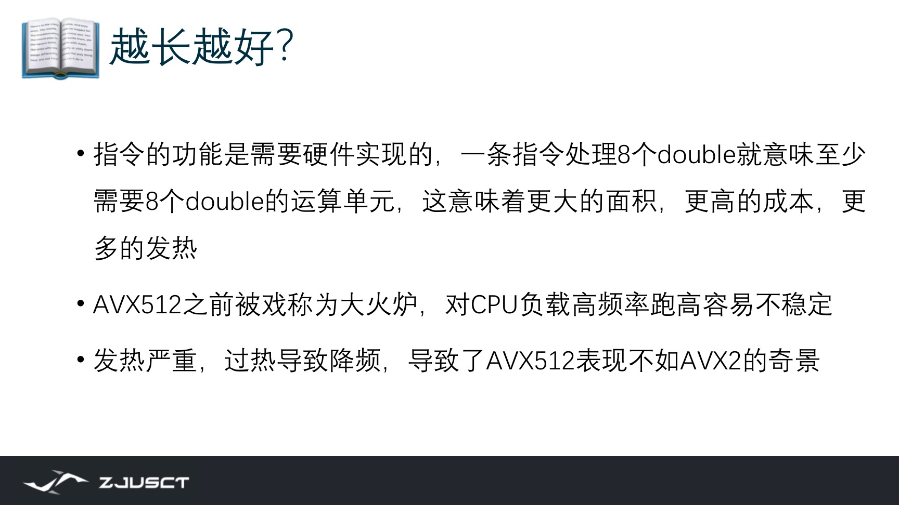

*图：课件把为什么不再更长作为问题提出：一条指令覆盖更多数据，意味着指令侧面积成本与发热上升。AVX-512 曾因过热降频而出现表现不如 AVX2 的反常现象，因此更宽的指令集不等于更快。*

### 点积、归约与 FMA

逐元素计算最容易向量化；归约多了一层麻烦。点积

$$
s=\sum_{i=0}^{n-1}a_i b_i
$$

所有迭代都会更新同一个 $s$。正确的 SIMD 做法是让向量寄存器先积累多个局部和，最后再横向求和。概念代码如下：

```cpp
__m256 acc = _mm256_setzero_ps();
for (int i = 0; i + 8 <= n; i += 8) {
    __m256 va = _mm256_loadu_ps(a + i);
    __m256 vb = _mm256_loadu_ps(b + i);
    acc = _mm256_fmadd_ps(va, vb, acc); // acc += va * vb
}
float sum = horizontal_add(acc);
for (int i = n / 8 * 8; i < n; ++i) sum += a[i] * b[i];
```

`horizontal_add` 把 8 个 lane 合并为一个标量。它不是主循环中的热点，因而放在循环末尾即可。与标量顺序逐项相加相比，向量归约改变了加法顺序；浮点加法不满足严格结合律，所以最后几位可能不同。测试应使用误差阈值，而不是对浮点结果逐位比较。

FMA（fused multiply-add）把 $a\times b+c$ 作为一次舍入的运算执行，既减少指令，也常带来更好的数值行为。编译器能否使用 FMA 与目标 CPU、编译选项和浮点语义有关。需要可复现实验结果时，应记录是否启用了 `-ffast-math`；它可能允许更激进的重排，速度提高的同时也可能改变误差分布。

## 自动向量化

对于规则 C/C++ 循环，先写清楚、正确、连续的数据访问，再打开优化。以 Clang 为例：

```bash
clang++ -O3 -march=native -Rpass=loop-vectorize saxpy.cpp -o saxpy
```

`-O3` 开启较激进优化；`-Rpass=loop-vectorize` 给出成功向量化的报告。GCC 可用 `-fopt-info-vec` 观察类似信息。报告是排查线索，不是性能证明，仍要实际计时。

### 读懂向量化报告

报告常见的两种信息分别是已向量化和无法向量化。后者比前者更有价值，因为它指出编译器缺少什么证明。例如：

```text
remark: loop not vectorized: unsafe dependent memory operations
remark: loop not vectorized: value that could not be identified as reduction
```

第一类通常来自指针别名或跨迭代读写，先检查 `x`、`y` 是否真的可能重叠；只有接口语义保证不重叠时才加 `restrict`。第二类提示编译器没有识别出归约，可将复杂表达式拆成局部累加，或用 OpenMP 的 `reduction` 明确语义。若循环本身充满随机索引、函数调用或数据相关分支，强行加 pragma 往往只是把正确性风险交给调用者，先改算法或布局更稳妥。

报告显示 vectorized width: 8 也不等于每个循环都在跑 8 lane。检查生成汇编时，应看到连续的向量 load/store 与 packed arithmetic；同时仍可能有标量尾循环、对齐检查或运行时 alias check。这些前置检查通常很小，除非循环本身极短。

```cpp
void saxpy(float* __restrict y, const float* __restrict x,
           float a, int n) {
    for (int i = 0; i < n; ++i) {
        y[i] = a * x[i] + y[i];
    }
}
```

这里 `__restrict` 的意思是调用者承诺 `x` 和 `y` 所指的可访问区域不重叠。若承诺不成立，程序行为会不正确；因此只有在接口语义确实保证不重叠时才写它。编译器不敢向量化时，常见原因正是它无法证明指针不别名、循环有跨迭代依赖，或者分支和边界太复杂。

### 尾部元素与掩码

假设向量宽度为 8、`n=18`，前两次处理 16 个元素，最后 2 个怎么办？最直观的办法是向量主循环后补一个标量尾循环。AVX-512 和 SVE 支持 mask/predicate，让无效 lane 不读写；SVE 的 `svwhilelt` 按还有多少元素构造谓词，所以同一份代码能适应不同硬件向量长度。

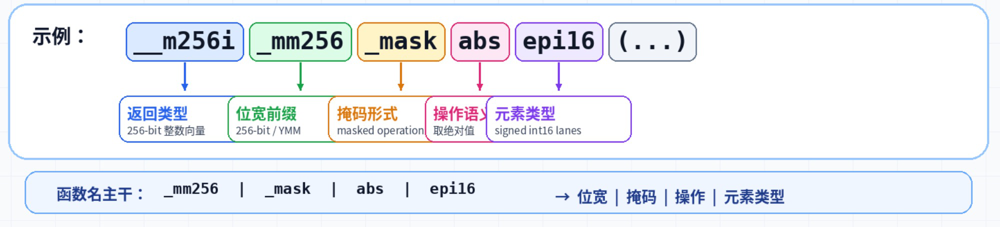

*图：masked operation 用一位标志描述每个 lane 是否参与，是 AVX-512 处理尾部与条件执行的基础，和 SVE 的谓词是同一思想。*

尾处理并不难，真正的难点是确保没有越界读取、没有漏算，也没有为了处理尾部把主循环搞得分支很多。

写或读 intrinsic 时还应留意四类实际问题：数据是否按所需边界对齐、循环长度是否正好是 lane 数的倍数、循环控制的分支是否已经吃掉收益、寄存器是否因临时变量过多而 spill。它们解释了为什么一段看上去每次算八个数目的代码，可能并不比编译器生成的版本快。

## SIMD intrinsic

Intrinsic 是 C/C++ 函数形式的指令接口。下面示例给 8 个 32 位整数逐元素相加：

```cpp
#include <immintrin.h>

__m256i add8(const int* a, const int* b) {
    __m256i va = _mm256_loadu_si256(reinterpret_cast<const __m256i*>(a));
    __m256i vb = _mm256_loadu_si256(reinterpret_cast<const __m256i*>(b));
    return _mm256_add_epi32(va, vb);
}
```

读 intrinsic 名称时可以拆开：`_mm256` 表示 256 位，`add` 表示加法，`epi32` 表示 packed 32-bit integer。真正编写前，必须查 [Intel Intrinsics Guide](https://www.intel.com/content/www/us/en/docs/intrinsics-guide/index.html)：确认所需头文件、目标 ISA、等价伪代码、输入输出类型、延迟与吞吐。不要让 AI 或名称猜测替代文档。

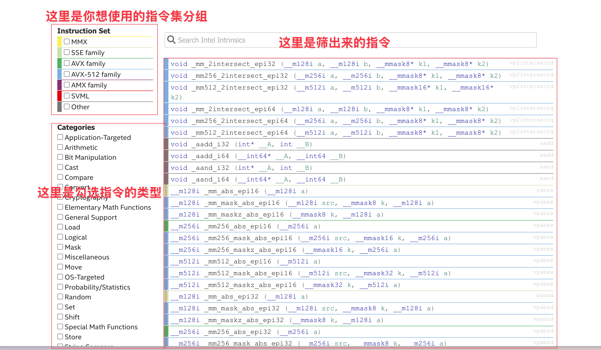

*图：写 intrinsic 前用官方 Guide 核对名称、头文件、输入输出类型与延迟/吞吐，而不是靠猜测。*

上例只演示概念，不能直接当成完整数组函数：还需循环、尾部处理、输出存储、对齐/别名约束和目标机器检测。多数简单循环中，编译器已经能生成接近的代码；手写只在确认自动向量化无法表达关键结构、且 profiler 证明该处是热点时才值得。

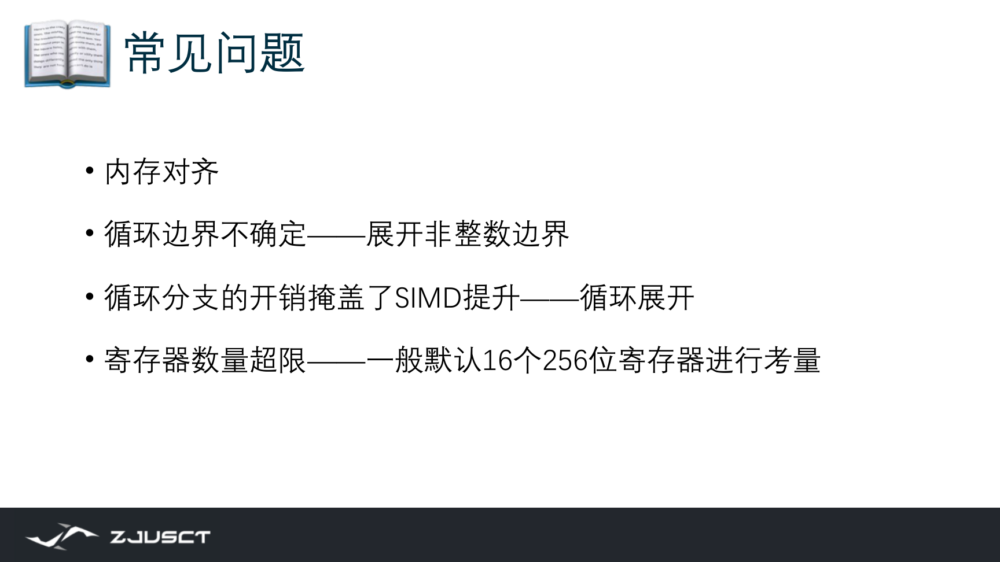

*图：对齐、尾边界、分支开销与寄存器溢出，解释了为什么逐元素代码可能并不比编译器向量化版本快。*

## 矩阵乘法与缓存分块

朴素矩阵乘法若按不合适的循环顺序访问 B，可能每次内层迭代都把新的 cache line 从内存搬入，缓存几乎没有复用。优化的第一步通常是**分块（tiling/blocking）**：把 `A`、`B`、`C` 切成能放进缓存的小块，在块内完成更多乘加。

```cpp
for (int ii = 0; ii < N; ii += BS)
  for (int kk = 0; kk < N; kk += BS)
    for (int jj = 0; jj < N; jj += BS)
      for (int i = ii; i < std::min(ii + BS, N); ++i)
        for (int k = kk; k < std::min(kk + BS, N); ++k)
          for (int j = jj; j < std::min(jj + BS, N); ++j)
            C[i][j] += A[i][k] * B[k][j];
```

这个顺序让 `B[k][j]` 沿 `j` 连续访问（假设 C/C++ 行主序），并让 `A[i][k]`、`C[i][j]` 在小块内复用。之后，内层 `j` 循环才是编译器向量化的好目标。真实项目优先调用 MKL、OpenBLAS、BLIS；这些库会继续做寄存器分块、预取和微内核调优。

AVX-512 VNNI、AMX 与 ARM SME 面向更专门的低精度/矩阵乘加场景，本质仍是相同的数据流：**load tile，计算 tile，store tile**。只有确认数据类型、矩阵形状和硬件支持后，才进入这一步。


*图：ARM SME 用 ZA 寄存器里的二维 tile 表达矩阵乘加，和 AMX、Tensor Core 的 load tile—算 tile—store tile 是同一数据流思想。*

### 低精度矩阵乘法：字节数、累加精度和数据布局

深度学习和一些数值核会把权重或输入从 `float32` 转成更低精度格式。W8A8 是一个常见记法：weight 和 activation 都用 8 位整数保存。它先把浮点数 $x$ 按 scale $s$ 映射为整数 $q$：

$$
q=\operatorname{clip}\left(\operatorname{round}\left(\frac{x}{s}\right),-128,127\right),
\qquad x\approx s q.
$$

矩阵乘法的内层随即变成整数点积。两项 `int8` 相乘仍可放进较小的整数，但很多项相加会很快超过 8 位范围，所以实现通常使用 `int32` accumulator：

$$
A_{ij}=\sum_k X^{(q)}_{ik}W^{(q)}_{kj},\qquad
Y_{ij}\approx s_{x,i}\,s_{w,j}\,A_{ij}.
$$

也就是说，低精度的关键并不是把结果也粗暴地截成 8 位。输入和权重以小格式搬运，乘加以足够宽的格式积累，最后再根据激活和权重的 scale 恢复近似的数值范围。scale 可以按整张张量、每一列或更小的 block 设置；粒度越细，通常越能适应不同范围的数，代价是需要保存和读取更多元数据。

这与向量化直接相连。低精度会减少内存流量，也可能让 CPU 的 VNNI/AMX 或 GPU 的矩阵单元一次完成更多乘加；但它只有在数据连续、tile 大小合适、量化和反量化没有盖过计算收益时才会变快。遇到 MoE 这类每个 expert 收到的小 batch，还要比较先按 expert 重排再做一批 GEMM[^gemm] 的收益是否足以覆盖重排成本。阅读 W8A8 实现时可沿这条链检查：量化发生在哪一步，累加器是什么类型，scale 的形状是什么，哪段循环真正进入矩阵核。
[^gemm]: general matrix multiply，通用矩阵乘法，深度学习中最核心的计算核之一。

### VNNI、AMX 与矩阵 Tile

AVX-512 VNNI 面向整数点积。它把多组小整数乘法及其累加压进一条指令，适合 `int8` 权重和激活的内层循环。程序员仍需要保证内存中的元素顺序与指令期待的打包方式一致；数据类型对了、布局不对，吞吐也上不去。


*图：VNNI 把多个 int8 乘累加压进一条指令，是低精度矩阵内层循环能借用硬件加速的关键。*

AMX 更接近显式的二维矩阵单元。它用 tile 寄存器保存小矩阵块，概念上的计算是

$$
C_{m\times n}\mathrel{+}=A_{m\times k}B_{k\times n}.
$$

一次 tile 计算会沿 $k$ 维做大量点积，因此应让 $A,B$ 的 tile 在 cache 中复用。使用前需要配置 tile 的行数、列字节数和数据类型；配置与 load/store 也有成本。小得离谱的矩阵、频繁改变形状的调用，未必能摊薄这些成本。实际项目优先调用支持 AMX 的 BLAS 或 oneDNN，手写 tile 代码只适合确定的热点和受控形状。

### 固定宽度 AVX 与可伸缩 SVE

AVX 的代码通常明确假设一次处理多少元素，例如 256 位寄存器中装 8 个 `float`。ARM SVE 则让向量长度由机器决定：循环每次前进 `svcntw()` 个 32 位元素，`svwhilelt_b32(i, n)` 生成谓词，标出最后一轮哪些 lane 仍有效。于是同一源代码可在不同 SVE 向量长度的实现上运行。

AVX-512 mask 更像另一套尾部与条件执行的编程模型，速度优势来自少做无效 lane 的读写。`_m`、`_z`、`_x` 后缀分别说明无效 lane 是保留旧值、写零还是不关心；在读写掩码代码前，必须先确认这种语义。

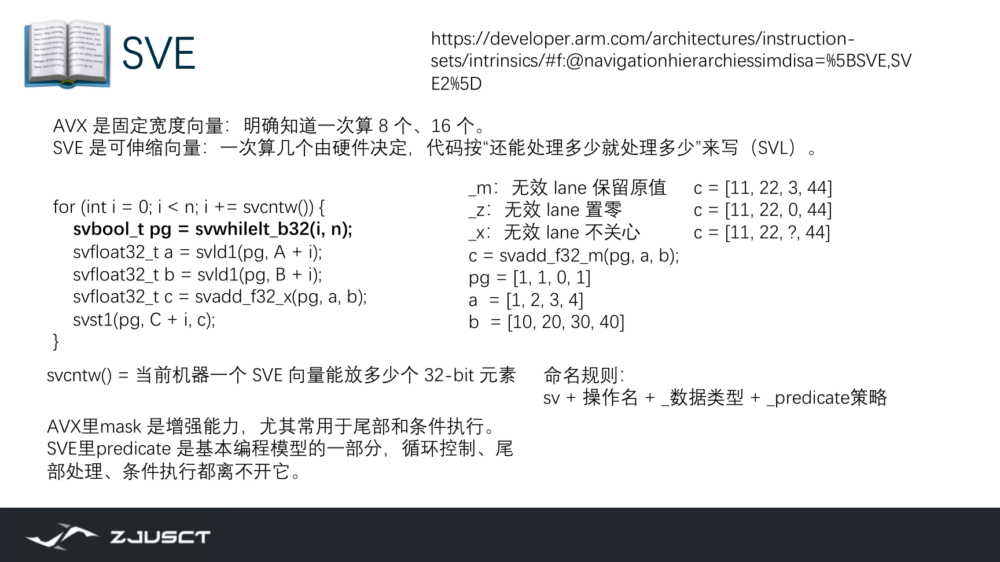

*图：谓词标记有效 lane，使最后一次迭代无需越界读写；代码不把向量长度写死。*

### RISC-V 向量扩展（RVV）
RISC-V 的向量扩展（RVV[^rvv]）同样是长度由机器决定的模型，但用一组更细的寄存器配置来描述一次算多少个元素。处理器有固定的向量寄存器位宽 `VLEN`（如 128 或 256 位）；一条指令到底用多宽的向量，由两个量共同决定：
[^rvv]: RISC-V Vector extension，RISC-V 的可变长度向量指令扩展。

- **SEW**（selected element width）是每个元素的位宽，例如 `i8`/`fp32`；
- **LMUL**（length multiplier）表示一条向量寄存器组合了几个寄存器，取值可为分数或整数（如 $1/4,1,2,8$）。它让逻辑向量长度 $=\mathrm{VLEN}\times\mathrm{LMUL}/\mathrm{SEW}$。

程序通过 `vsetvl` 之类的指令把还剩下多少元素结合 SEW/LMUL，动态算出本次实际处理的元素数，因此同一份代码能适应不同 `VLEN`。课程后面在 SpaceMiT 这类 RISC-V CPU 上做向量化，用的正是 RVV 的 intrinsic（如 `vrsub`、`vle`、`vse` 系列）让循环一次处理多个元素；读懂 `vsetvl`、SEW/LMUL 这些配置，是读 RISC-V 向量代码的入口。它和 AVX 的关键区别在于：AVX 把宽度写死在指令集里，RVV/SVE 让宽度由硬件和运行时的 `vsetvl` 决定。

## 基准测试

```python
import time
import numpy as np

N = 2_000_000
a = list(range(N))
b = list(range(N, 2 * N))

t0 = time.perf_counter()
c_py = [x + y for x, y in zip(a, b)]
t1 = time.perf_counter()

an = np.asarray(a, dtype=np.int64)
bn = np.asarray(b, dtype=np.int64)
t2 = time.perf_counter()
cn = an + bn
t3 = time.perf_counter()

assert np.array_equal(np.asarray(c_py), cn)
print(f"Python: {t1 - t0:.3f}s")
print(f"NumPy : {t3 - t2:.3f}s")
```

接着把 `an + bn` 改成 `an[::2] + bn[::2]`，比较连续访问与步长访问；再尝试矩阵 `@` 与三重 Python 循环。记录数组大小、dtype、CPU、线程设置和运行次数，否则数字无法解释。

### 结果验证与计时

优化前先保存一个小规模参考实现。每次修改后，先比输出，再测时间。对浮点数组可记录最大绝对误差和相对误差：

$$
\max_i|y_i-y_i^{\mathrm{ref}}|,
\qquad
\max_i\frac{|y_i-y_i^{\mathrm{ref}}|}{\max(|y_i^{\mathrm{ref}}|,\epsilon)}.
$$

性能表则至少写明输入 shape、数据类型、编译选项、线程数、预热次数和统计量。把一次偶然的最短时间当结论没有意义；更可靠的是报告多次运行的中位数，并在异常波动时检查 CPU 降频、后台负载、NUMA 放置和内存分配。代码快了却把尾部漏算、把 `int32` 累加改成溢出的 `int8`，不算优化。

### 对齐与别名

对齐影响的是一次向量加载能否自然落在所需边界。现代 x86 的非对齐 load 通常可用，却可能跨两个 cache line；在热点循环中仍值得让分配器和数据布局保持良好对齐。更常见的向量化障碍是别名：编译器看到 `void f(float *a, float *b)` 时，必须保守地考虑 `a` 和 `b` 指向重叠区域，写 `a[i]` 可能改变随后读到的 `b[i]`。只有调用者能保证两个区间不重叠时，C/C++ 才可以用 `restrict`（或编译器等价标注）交出这一事实；错误承诺会产生未定义行为，不能为了报告中出现 vectorized 而加入。

### 浮点归约与可重复性

浮点加法不满足数学上的结合律。`(a+b)+c` 与 `a+(b+c)` 因舍入点不同可得到略有差异的结果；并行归约、向量树形归约和编译器的 reassociation 都会改变求和顺序。因而把标量版本和 AVX/OpenMP 版本用逐位相等比较，常会制造假错误。更合理的是为问题尺度和数据范围设定绝对/相对误差：

$$
|x-y| \le \epsilon_{abs}+\epsilon_{rel}|y|.
$$

这不是放松正确性。若输出是概率、能量守恒量或迭代停止条件，还必须确认误差不会改变下游决策；若需要跨机器可重复，则要使用固定归约树、补偿求和或相应数值库。`-ffast-math` 允许更激进的重排，是否启用应由数值契约决定。

## 练习

1. 解释为什么 `out[i] = x[i] * 2` 容易向量化，而 `out[i] = out[i - 1] + x[i]` 不容易。
2. 用 `np.pad` 和切片实现任意二维数组的上下左右四邻居之和，并用小数组验证边界。
3. 对一个 `float32` 数组，推算 128/256/512 位寄存器分别可容纳多少个元素。再解释为什么这不等于必然 4/8/16 倍加速。
4. 编译一个简单 SAXPY 循环，保存编译器向量化报告；修改循环使 `x`、`y` 可能重叠，观察报告和结果如何变化。
5. 任选一个矩阵乘法尺寸，分别使用朴素循环、调整循环顺序、分块、`np.matmul` 或 BLAS，验证先改善访问模式、再谈指令的顺序。

性能优化通常从热点开始，随后确认读写依赖和访问布局，再比较自动向量化、线程和更低层的指令实现。每一步都要保留正确性基线；否则某个看上去很快的版本，可能只是少算了工作。
