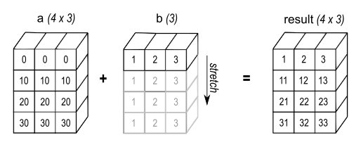

# 07-10 下午 向量化并行计算基础

Lab 2 的 MoE（Mixture of Experts，混合专家层）前向计算涉及数组布局、批量运算和内层循环设计。Python 或框架层把逐元素操作写成数组表达。C/C++ 层需要提供独立的循环迭代。处理器再将连续数据送入 SIMD 寄存器。SIMD（single instruction, multiple data）让一条指令在多个数据 lane 上执行相同操作。lane 是向量寄存器中存放一个元素的位置。向量化把彼此独立的标量操作组织为数组批量操作或 SIMD 指令。归约将局部结果合并为一个值，例如求和或最大值。[^numpy][^intel-vector]

!!! quote "NumPy 用户指南关于广播的说明（译）"

    广播让形状不同但兼容的数组参与同一次运算。它提供一种在 C 中通常需要显式循环才能写出的数组表达方式。实现是否复制数据取决于具体操作和数组布局。[^numpy-broadcast]


*高层数组表达与指令级 SIMD 可以共同出现。数组库会尝试调用向量化的底层 kernel。循环存在真实依赖时，需要先改变算法或保留顺序执行。[^intel-vector]*

## 从数组表达式到 SIMD 指令

=== "1. 先写出数组语义"

    先确定输入、输出和 shape。例如 `y = a*x + b` 中，哪些维度对应 token、hidden、expert，哪些数组被广播，哪些数组会被原地修改，都应在代码中写清。

=== "2. 检查循环依赖"

    不同迭代读写独立位置时，编译器和线程可以重排。前缀和、直方图、共享累加器等存在跨迭代依赖，需要归约、分桶或专门算法。

=== "3. 让内层访问连续"

    SIMD、缓存和硬件预取都更喜欢连续地址。对矩阵和张量，先确认最内层循环沿哪一个维度走，再考虑分块、packing 或数据布局转换。

=== "4. 用编译器和测量确认"

    向量化报告说明哪些循环生成了向量指令。计时和 profiler 说明这些循环是否真的处在热点。Lab 2 的 expert GEMM（一般矩阵乘法）需要同时满足语义、布局、向量化和线程划分。

## 标量循环与批量计算

标量循环一次处理一个元素，循环控制、下标计算和解释器派发可能在小算子中占据明显比例。数组接口把“对所有元素做同一种操作”一次表达出来，使 NumPy、PyTorch 或底层库有机会使用连续内存、线程、SIMD 和专用矩阵库。[^numpy]

```python
# x 的形状为 (batch, hidden)，scale 和 bias 的形状为 (hidden,)
y = x * scale + bias
```

上式的数学语义是对每个 `batch` 行使用同一组 `scale` 与 `bias`。先写清 shape，再谈性能。实际 `scale` 是 `(batch, 1)` 时，广播方向不同。表达式被拆为多个临时数组时，内存流量也不同。数组写法消除了 Python 层逐元素循环，底层是否生成融合 kernel 还取决于运行时。

### 从 Python 循环到数组表达

```python
# 逐元素循环。解释器每轮处理一次索引、取值和赋值
for i in range(x.shape[0]):
    for j in range(x.shape[1]):
        y[i, j] = x[i, j] * scale[j] + bias[j]

# 批量表达。把迭代空间交给数组库
np.multiply(x, scale, out=y)
y += bias
```

第二段仍可能需要两次扫描 `y`，但它将内层工作交给已编译代码。profile 显示中间数组分配和读写成为热点时，再考虑 `out=`、框架融合、JIT 或自定义 kernel。每个数组表达式都改写成手工循环，通常会降低可读性，也未必更快。

## 数据依赖

向量化和线程并行要求不同迭代能够在保持结果语义的条件下重排。检查循环时，应列出每次迭代对每个数组的读写下标，不能只看循环变量是否不同。

```c
/* 迭代 i 写 y[i]，只读 x[i]、scale[i]：通常独立。 */
for (int i = 0; i < n; ++i)
  y[i] = x[i] * scale[i];

/* 迭代 i 读取前一轮写出的 a[i-1]：存在循环携带依赖。 */
for (int i = 1; i < n; ++i)
  a[i] = a[i - 1] + x[i];
```

第二段是前缀和的一种形式。需要使用 parallel scan 等专门算法，或保留串行依赖。归约包含合并依赖，但在满足相应代数条件时可按树形结构分层重排。浮点归约还要考虑舍入顺序。[^openmp-spec]

### 循环并行性的条件

常见阻碍可以归为四类。

| 阻碍 | 示例 | 正确的处理方向 |
| --- | --- | --- |
| 写后读依赖 | `a[i]` 依赖 `a[i-1]` | 改用 scan、波前或分阶段算法 |
| 多迭代写同一位置 | `hist[key[i]]++` | 私有直方图、原子操作或分桶 |
| 指针别名不确定 | `f(float *a, float *b)` | 核对调用约定。仅在不重叠时使用 `restrict` |
| 不规则控制流 | 每个元素走不同长路径 | 分桶、掩码或保留标量路径 |

C 的 `restrict` 是程序员对不重叠访问范围的承诺。它可以让编译器消除保守的别名检查。实际传入重叠数组时，结果没有保障。使用前应从数据所有权和调用点证明这个承诺。[^gcc-vector]

### 循环融合、拆分与数据布局

融合两个循环可减少中间数组写回和下一轮重新读取。

```c
/* 两次完整扫描 x、tmp、y。 */
for (int i = 0; i < n; ++i) tmp[i] = f(x[i]);
for (int i = 0; i < n; ++i) y[i] = g(tmp[i]);

/* 若 tmp 不再被其他代码观察，可融合。 */
for (int i = 0; i < n; ++i) y[i] = g(f(x[i]));
```

融合也可能扩大寄存器活跃范围、增加分支或破坏某个循环原本的 SIMD 条件。拆分循环有时更有利。把边界处理、罕见分支或不同数据类型移出热点后，主体循环会更规整。选择应由 profile 与向量化报告支持。

数据布局同样决定连续性。AoS（array of structures）适合按对象读取全部字段。SoA（structure of arrays）让同一字段连续，常更适合按字段的 SIMD 或 GPU 计算。选择布局前，先画出 warp 或向量 lane 在内层读取哪些地址。

## NumPy 与数组编程

NumPy 的广播规则从右向左比较维度。两个维度相等、其中一个为 1，或其中一个数组缺少该维度时，运算可以进行。广播通常不会复制长度为 1 的数组。后续某些操作仍可能为了结果或不连续视图创建大临时缓冲。[^numpy-broadcast]

### 广播与数组形状

```python
x = np.zeros((32, 128))
scale = np.ones((128,))       # 对应最后一维 hidden
y = x * scale                 # 结果为 (32, 128)

row_scale = np.ones((32, 1))  # 对应 batch 维
z = x * row_scale             # 同样是 (32, 128)，语义不同
```



*NumPy User Guide 的图展示广播后的逻辑对应关系。具体实现通常不需要复制完整数组。[^numpy-broadcast]*

在 MoE 中，`tokens`、`experts`、`hidden`、`intermediate` 的顺序不应依靠记忆。为每个张量在代码旁写出 shape，在小输入上打印一两个切片，并用断言检查。错误的广播往往不会报错，却会生成数值合理、形状正确但语义错误的结果。


*`reshape` 是否复制数据取决于原数组布局和目标形状。对性能敏感代码要区分逻辑 shape 与实际连续性。[^numpy]*

### 切片表达二维邻居求和

二维 stencil 可以用重叠切片表达内部格点的邻居和。

```python
out[1:-1, 1:-1] = (
    a[:-2, 1:-1] + a[2:, 1:-1] +
    a[1:-1, :-2] + a[1:-1, 2:]
)
```

它保留了“内部点读取四个邻居”的数学结构，避免 Python 级双重循环。代价是右侧可能形成多个临时数组，并对 `a` 进行多次扫描。规模扩大后，C/CUDA 实现要继续处理边界格点、缓存分块和线程到二维坐标的映射；数组表达是清晰基线，而不是所有规模下的最终实现。

### 矩阵乘法与 BLAS

矩阵乘法是最成熟的基础算子之一。调用 `np.matmul`、BLAS、oneDNN 或其他框架库时，库会按设备选择 packing、多级缓存分块、向量化、线程划分和可能的矩阵单元路径。除非 Lab 明确要求实现内部 kernel，手写三重循环的目标是学习数据复用和验证，不是替代这些库。[^blas]

```python
# A: (m, k), B: (k, n), C: (m, n)
C = A @ B
```

调用库前仍需确认 dtype、布局、leading dimension、batch 维和是否意外触发复制。一次 `transpose` 或非连续 slice 可能使库先执行 layout conversion；对小矩阵，调用和转换成本也可能压过计算本身。

## SIMD 指令与向量寄存器

SIMD 寄存器一次容纳多个同类型元素。以 256-bit 向量为例，可装 8 个 `float` 或 4 个 `double`；512-bit 向量可装 16 个 `float` 或 8 个 `double`。一条向量加法、乘法或 FMA 会在各 lane 上执行相同操作。实际收益还受加载、存储、端口吞吐、依赖、缓存和尾部处理限制。[^intel-intrinsics]


*图展示 ISA 演进。数据供给、频率、指令组合和问题规模都会影响实际速度。[^intel-intrinsics]*

### 点积、FMA 与归约

点积包含逐元素乘法与求和。FMA 在一次舍入中计算 $a\times b+c$，常能提高吞吐和数值行为的一致性；向量化后的部分和仍需归约为标量。

```c
float sum = 0.0f;
for (int i = 0; i < n; ++i)
  sum += a[i] * b[i];
```

编译器可将其拆为多个向量累加器，最后做水平求和。加法顺序改变后，浮点结果可能与标量版本最后几位不同；正确性测试应采用题目定义的绝对或相对误差，而不是要求不同并行方案逐位一致。[^ieee754]

### 加速比的限制

一个 `float` 向量有 16 个 lane 不代表循环自动快 16 倍。若每轮只做一次加法并加载、存储多个数组，内存带宽可能先饱和；若有长依赖链，单个累加器的延迟限制吞吐；若数组很短，调用和尾部处理占比很高；若存在分支，部分 lane 可能做无效工作。向量宽度是资源，只有独立工作和数据供给足够时才会转化为速度。

## 自动向量化

自动向量化是首选基线。编译器知道目标 ISA、调度模型和安全边界，能在不牺牲可移植性的前提下生成不同机器的代码。GCC 可输出成功与失败的向量化报告；Clang 可使用 `-Rpass=loop-vectorize` 等选项。报告是定位工具，最后仍要用时间与正确性验证。[^gcc-vector]

```bash
gcc -O3 -march=native -g \
  -fopt-info-vec-optimized -fopt-info-vec-missed \
  kernel.c -o kernel
```

### 读懂向量化报告

- `loop vectorized` 表示某个循环已生成向量版本，仍需看它是否处在热点。
- `possible aliasing` 表示编译器无法证明指针不重叠。检查 API 约定与调用点。
- `not vectorized: unsafe dependent memory operations` 表示需要检查循环携带依赖或间接写入。
- `control flow in loop` 表示可将罕见分支移出主体，或评估掩码是否合适。

不要把 `#pragma omp simd` 当作性能注释。它向编译器声明迭代可以按 SIMD 语义重排；若声明不成立，程序可能产生错误结果。先写出依赖证明，再添加指令。[^openmp-spec]

### 尾部元素与掩码

数组长度很少恰好是向量宽度整数倍。编译器可以生成标量 remainder loop，也可以使用掩码向量指令。手写 intrinsic 时必须确保无效 lane 不越界读取和写入。


*mask 用于表达边界和条件。掩码加载、计算和存储的具体语义取决于 intrinsic。[^intel-intrinsics]*

## SIMD intrinsic

intrinsic 是 C/C++ 中对应特定 SIMD 指令的接口。它适合已证明为热点、形状稳定的内层循环。使用 intrinsic 前，检查目标机器是否支持该 ISA、标量或自动向量版本是否正确、尾部、对齐、别名和浮点误差是否已有测试。[^intel-intrinsics]

```c
#include <immintrin.h>

for (int i = 0; i + 8 <= n; i += 8) {
  __m256 vx = _mm256_loadu_ps(x + i);
  __m256 vy = _mm256_loadu_ps(y + i);
  __m256 vz = _mm256_fmadd_ps(vx, va, vy);
  _mm256_storeu_ps(y + i, vz);
}
for (; i < n; ++i) y[i] = a * x[i] + y[i];
```

`loadu` 表示允许未对齐地址，不代表访问一定免费；真正优先级通常是连续访问和正确边界。若同一可执行文件要运行在不支持 AVX2/AVX-512 的机器上，应采用编译器多版本化、运行时特性检测或保留通用路径，而不是让程序在启动时触发非法指令。


*查 intrinsic 时应同时阅读参数、mask、舍入和数据类型语义。名称相似的 intrinsic 也可能行为不同。[^intel-intrinsics]*

## 矩阵乘法与缓存分块

GEMM 性能主要取决于 A、B 的小块能否在寄存器和缓存中服务许多次乘加。对 $C_{M\times N}=A_{M\times K}B_{K\times N}$，一个输出 tile 沿 $K$ 维累加；A/B tile 被加载后被同一组输出反复使用，算术强度因此提高。[^blas]

```text
for each C tile (BM × BN):
    keep partial C in registers/cache
    for each K tile (BK):
        reuse A[BM × BK] and B[BK × BN]
```

块大小、寄存器 tile、packing 和线程划分相互影响。块太小，复用不足；块太大，工作集或寄存器装不下；非连续布局还可能让加载成为跨步访问。成熟 BLAS 库会为这些层级分别选参数，因此性能实验应把库调用作为重要对照组。

### 低精度矩阵乘法的字节数、累加精度和数据布局

INT8、FP16、BF16 等格式可以减少权重和激活的存储、传输与加载字节数，也可能进入 VNNI、AMX 或 Tensor Core 路径。量化实现应说明输入和权重如何缩放、乘加累加器采用何种精度、输出何时反量化。低精度输入与高精度累加是常见组合，具体规则以库和硬件 API 为准。

设 $x\approx s_x q_x$、$w\approx s_w q_w$，则线性层的近似输出可写成

$$
y_i\approx s_xs_w\sum_j q_{x,j}q_{w,ij}
$$

scale 可以按 tensor、channel 或 group 设置。粒度越细，量化误差通常越容易控制，scale 元数据与处理开销也越大。Lab 2 的 W8A8/MoE 场景还要关注每个 expert 实际收到的 token 数。expert batch 很小时，重排、量化或调用开销可能超过矩阵核收益。

### VNNI、AMX 与矩阵 Tile

VNNI 将多组小整数乘法及累加组织为高密度点积，适合量化矩阵乘法的内层。数据类型正确还不够，内存中元素的打包顺序、矩阵 layout 和累加器宽度都必须符合指令或库的约定。[^intel-amx]


*VNNI 将多项整数乘加压缩到高吞吐指令路径。图中元素类型与 intrinsic 的精确符号应以 Intel Intrinsics Guide 为准。[^intel-intrinsics]*

AMX 使用 tile 寄存器表达更大的矩阵块计算。使用 AMX 仍要处理 tile 配置、load/store、缓存复用和形状边界。对小而变化频繁的调用，配置和数据准备可能无法摊薄。实际项目可优先使用支持 AMX 的 BLAS/oneDNN，手写 tile 更适合作为受控实验。[^intel-amx]

### 固定宽度 AVX 与可伸缩 SVE

AVX 的向量宽度随指令集固定。ARM SVE 的硬件向量长度可变，程序用谓词标记本轮有效元素。两种模型都要求正确处理尾部。[^arm-sve]


*可伸缩向量代码通过谓词处理本轮有效元素，避免把某个硬件宽度写死在算法中。[^arm-sve]*

### RISC-V 向量扩展（RVV）

RVV 也采用向量长度无关的思想。程序通过 `vsetvl` 根据剩余元素数、元素宽度（SEW）和寄存器组长度（LMUL）设置本轮实际向量长度，再处理这批元素。它与 SVE 一样有利于跨不同实现复用循环结构，但仍要明确掩码、规约、类型转换和目标平台的扩展支持。[^rvv]

## 基准测试

基准测试要分别验证结果和计时。先用小规模数据、不同 shape 和边界输入与参考实现比较。再对代表性大输入预热并重复计时。计时结果应包含编译器、ISA、线程数、CPU 绑定、输入形状和是否包含量化、重排等前后处理。[^benchmark]

### 结果验证与计时

```text
1. 固定随机种子和输入形状，保留参考输出或误差判据。
2. 单独测准备、重排、量化、核心 kernel 与端到端流程。
3. 预热后重复运行，记录原始样本与中位数。
4. 对比标量、自动向量化、intrinsic、BLAS/库路径。
5. 修改后重新检查误差、内存越界和线程数设置。
```

### 对齐与别名

对齐、`restrict` 与预取都是底层工具。先保证连续布局、没有错误别名，并确认循环处在热点。profile 和报告显示相应问题时再调整。对齐假设不成立时，手写 aligned load 可能直接崩溃。错误的 `restrict` 也可能静默地产生错误答案。

### 浮点归约与可重复性

SIMD、OpenMP 和不同 BLAS 可能以不同树形顺序合并部分和。浮点加法不满足严格结合律，因此结果最后几位会变化。对数值敏感任务，可使用更高精度累加、分层归约或补偿算法。对机器学习算子，按任务的绝对或相对误差、下游指标判断。系统验证应覆盖多次运行和多种输入形状。[^ieee754]

## 练习

1. 为 Lab 2 的一个张量写下 shape、连续维度和每个维度的语义。
2. 用 NumPy 写一个广播表达，并给出两个会改变广播方向的 shape 反例。
3. 为一个 SAXPY 或点积循环开启 GCC 向量化报告，解释一个成功或失败原因。
4. 比较自动向量化与 BLAS 的正确性和计时；记录 CPU、编译选项、输入和线程数。
5. 检查一个 INT8 内核的 scale 形状、累加器类型、重排位置与尾部处理。

??? tip "参考答案"

    1. 例如 expert 输入可以写成 `[tokens_for_expert,H]`。最后一维 `H` 通常连续；第一维表示被路由到该 expert 的 token 数。记录 shape 时还要写清 token 是否已按 expert 重排。
    2. 设 `x.shape=(32,128)`。`scale.shape=(128,)` 会沿 batch 维广播；`row_scale.shape=(32,1)` 会沿 hidden 维广播。两者输出都可能是 `(32,128)`，但数值含义不同。
    3. GCC 可使用 `-O3 -fopt-info-vec-optimized -fopt-info-vec-missed`。若报告出现 `possible aliasing`，先检查两个指针是否可能重叠；若出现循环携带依赖，应检查下标和归约方式。
    4. 正确性可比较最大绝对误差或相对误差。计时应固定输入、CPU、线程数和编译选项；先预热，再重复运行并记录中位数。BLAS 通常是高性能基线，而不是仅供比较的普通函数。
    5. 记录 scale 是 per-tensor、per-channel 还是 per-group；确认乘加使用的累加器类型；确认权重 packing 发生在何处；确认最后一个 K 或 N tile 的尾部不会越界。Lab 2 中这些信息共同决定量化路径是否既正确又高效。

[^numpy]: NumPy, *NumPy user guide*, <https://numpy.org/doc/stable/user/>.
[^intel-vector]: Intel, *Intel® 64 and IA-32 Architectures Optimization Reference Manual*, <https://www.intel.com/content/www/us/en/developer/articles/technical/intel-sdm.html>.
[^numpy-broadcast]: NumPy, *Broadcasting*, <https://numpy.org/doc/stable/user/basics.broadcasting.html>.
[^openmp-spec]: OpenMP Architecture Review Board, *OpenMP API Specification*, <https://www.openmp.org/specifications/>.
[^gcc-vector]: GCC, *Optimize Options: Vectorization*, <https://gcc.gnu.org/onlinedocs/gcc/Optimize-Options.html>.
[^blas]: Netlib, *BLAS (Basic Linear Algebra Subprograms)*, <https://netlib.org/blas/>.
[^intel-intrinsics]: Intel, *Intrinsics Guide*, <https://www.intel.com/content/www/us/en/docs/intrinsics-guide/index.html>.
[^ieee754]: IEEE, *IEEE Standard for Floating-Point Arithmetic (IEEE 754)*, <https://standards.ieee.org/ieee/754/6210/>.
[^intel-amx]: Intel, *Intel® Advanced Matrix Extensions*, <https://www.intel.com/content/www/us/en/developer/articles/technical/intel-amx.html>.
[^arm-sve]: Arm, *Scalable Vector Extension*, <https://developer.arm.com/Architectures/Scalable%20Vector%20Extension>.
[^rvv]: RISC-V International, *RISC-V Vector Extension*, <https://docs.riscv.org/reference/isa/unpriv/v-st-ext.html>.
[^benchmark]: Google, *benchmark library*, <https://github.com/google/benchmark>.
