# 07-12 上午：OpenMP、C++ 线程与 MPI 并行计算基础

共享内存程序让线程直接读写同一地址空间；MPI 进程只能靠消息交换数据。两者的代码形式不同，底层都要回答数据归谁写、消费者何时可读、等待是否位于关键路径。

## 并行分解方式

并行通常从把什么分开入手。

- **数据并行**：把同一操作施加到不同数据块。例如向量加法中，`c[i] = a[i] + b[i]` 的每个 `i` 相互独立，可以分给不同线程。
- **流水线并行**：把不同阶段重叠。读取下一批数据时，上一批可在计算；计算下一批时，再把更早一批写回。流水线提高吞吐，但单个项目仍需依次经过各阶段。
- **任务图并行**：用 DAG 表示依赖。若任务 B、C 都依赖 A，但 B 与 C 互不依赖，则 A 完成后 B、C 可同时开始；最终任务 D 需等待两者。这个视角比有几个 for 循环更一般。

| 方式 | 切分对象 | 提高吞吐的关键 | 限制 |
| --- | --- | --- | --- |
| 数据并行 | 数据块 | 更多独立迭代 | 需要归约/同步 |
| 流水线并行 | 处理阶段 | 让各阶段重叠 | 单项目仍串行通过 |
| 任务图并行 | 任务依赖 | 并行执行互不依赖的任务 | 关键路径决定下限 |

所有并行程序都受关键路径限制。最长依赖链上的时间不能由增加核心消除。理想加速也会受 Amdahl 定律约束：若串行部分占比为 $s$，即使处理器数趋于无穷，加速上限仍是 $1/s$。

## 线程开销与同步

线程由操作系统调度，不保证执行顺序。两个线程打印文本，字符或行可能交错；这不一定是错误，而是没有同步的自然结果。更危险的是多个线程读改写同一变量：

```cpp
int sum = 0;
for (int i = 0; i < n; ++i) sum += a[i];
```

若把循环直接分给多线程，`sum += a[i]` 不是原子操作，结果会不稳定。并行的正确性首先来自数据所有权和同步，不来自这次跑出来数值看起来对。

???+ note "为什么 sum += a[i] 在多线程下会出错"

    单周期 CPU 课程里，一条指令从读到加号结果再到写回是完完整整一步，通常不会想到把它拆开。但 `sum += a[i]` 在真实硬件上其实是几步：先把 `sum` 的当前值读进寄存器，加 `a[i]`，再把结果写回内存。**这几步不是原子地连在一起的**。

    假设线程 A 和线程 B 同时执行。两个线程都可能先读到 `sum = 5`，各自在这个旧值上加 1，再各自把 6 写回去。结果本该是 7，最后却是 6——一次更新被覆盖掉了。这就是**数据竞争（race condition）**。它并非偶尔古怪，只要线程交错就可能发生，而且难以复现。

    所以并行程序需要**同步**：要么用锁/原子操作把读-改-写串行化或变成一步原子操作，要么让线程各自维护私有变量、最后再归约合并。无论哪种，原则都是：**同一个共享变量，同一时刻只能有一个写者，或者让写互不覆盖**。

另一方面，线程创建、销毁、任务分发、同步、cache 失效和内存带宽争用都是 overhead。一个只执行几十次加法的小循环，开并行域可能比串行更慢。并行粒度应足够大，让计算量盖过管理开销。

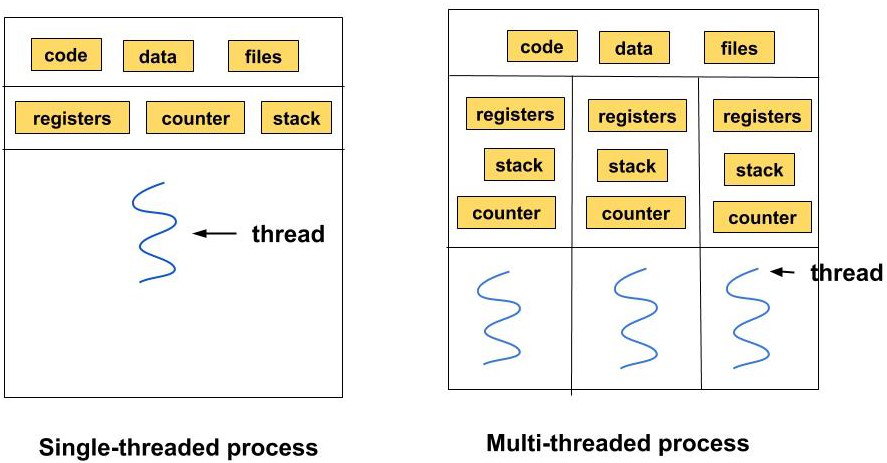

*图：进程是地址空间与资源的边界，线程是进程内共享内存的执行单元；开线程比开进程轻，但同步与 cache 开销仍然存在。*

## OpenMP 的 fork-join 模型

OpenMP 用 `#pragma omp` 指示编译器和运行时建立线程组。进入并行域时主线程 fork 出工作线程，离开并行域时 join。最简单的例子：

```cpp
#include <omp.h>

#pragma omp parallel
{
    int tid = omp_get_thread_num();
    int nthreads = omp_get_num_threads();
    // 每个线程都执行这里；输出顺序不保证。
}
```

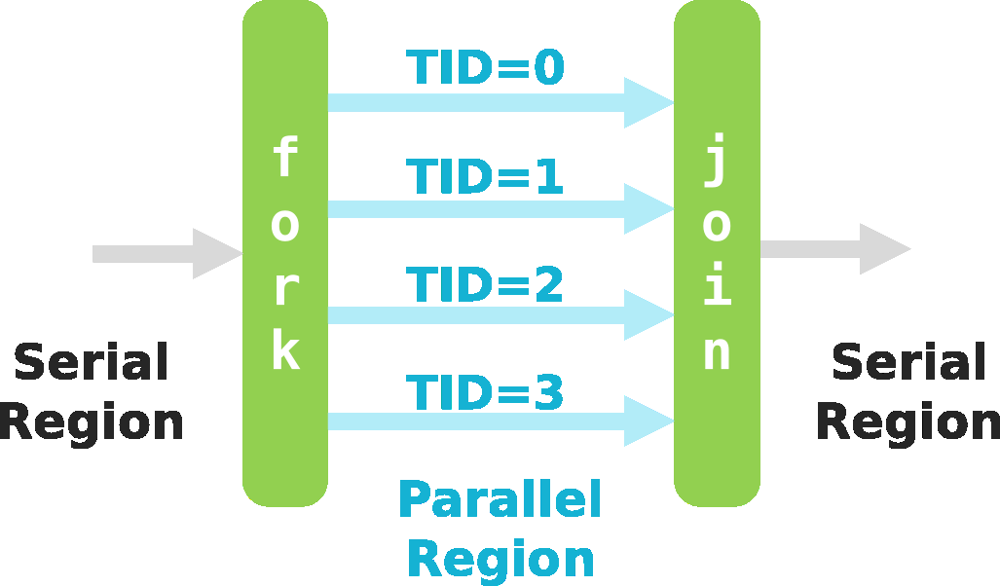

*图：OpenMP 的并行域在进入/离开时做一次 fork 与 join；串行段与并行段交替出现。*


*图：多个线程同时打印，输出行顺序是交错且不保证的；这是没有同步的自然表现。*

`parallel` 只说明这段区域由多个线程进入；若要把规则循环的迭代分配给线程，通常写：

```cpp
double dot = 0.0;
#pragma omp parallel for reduction(+:dot) schedule(static)
for (int i = 0; i < n; ++i) {
    dot += x[i] * y[i];
}
```

`reduction(+:dot)` 创建每线程私有的 `dot`，结束时再加起来。它既保证正确性，也通常比每次循环进锁更快。变量的 shared/private 属性应显式思考：循环下标通常私有，输入数组可共享读取，输出数组只有在不同线程写不同元素时才能安全共享。

如果一个变量的归属不清楚，先写 `default(none)` 让编译器强迫你决定：

```cpp
double dot = 0.0;
#pragma omp parallel for default(none) \
    shared(x, y, n) reduction(+:dot)
for (int i = 0; i < n; ++i) {
    dot += x[i] * y[i];
}
```

这里 `x,y,n` 是所有线程只读的共享对象，`i` 是每个线程自己的循环变量，`dot` 先私有累加、最后归约。若把输出数组也放进共享区，并且不同迭代写到同一个元素，OpenMP 不会替程序推断正确的合并方式。先把谁拥有哪段输出写清楚，比先决定使用几条线程更重要。

显式作用域还有几个常用关键词，它们决定每个线程看到什么、结束时谁的值留下来。

| 关键词 | 每个线程得到的 | 退出时 | 典型用途 |
| --- | --- | --- | --- |
| `private(x)` | 一份未初始化的副本 | 旧值不可见 | 只在本轮使用的临时量 |
| `firstprivate(x)` | 从进入前的值复制 | 不写回 | 需要初始值的私有量 |
| `lastprivate(x)` | 私有副本 | 最后一次迭代的值回到主线程 | 保留循环最后结果 |
| `shared(x)` | 所有线程共享同一份 | 共享 | 只读输入、独立输出区 |
| `reduction(+:x)` | 私有累加 | 结束时归约合并 | 求和、最大值等 |

若退出并行区后还需要循环算出的结果，却没有用 `lastprivate` 或输出归约，就会读到未定义的旧值。它们改的是变量在并行区内外如何传递，理解这点比死记关键词更重要。

### `parallel for`、`sections` 与嵌套循环

`#pragma omp parallel for` 适合多次迭代执行同一循环体。若不同线程要运行不同代码块，使用 `sections`；`single` 表示并行域中只让一个线程执行某段工作，例如初始化。嵌套循环中，若两个维度的迭代都独立，可用：

```cpp
#pragma omp parallel for collapse(2)
for (int i = 0; i < n; ++i)
    for (int j = 0; j < m; ++j)
        c[i][j] = a[i][j] + b[i][j];
```

`collapse(2)` 逻辑上把两层迭代空间合并，再分配任务。它不适用于内层依赖外层结果或循环边界不规则的情形。

矩阵更新常出现另一种情况：每个线程负责一行或一个 tile，内部仍沿连续列访问。此时不必为了让迭代总数看起来更大而随意 `collapse`。按行切分通常保留了连续写入和较少的共享；按列切分可能让线程同时触碰相邻 cache line。`collapse` 是改变任务划分的工具，不是并行度不足时的默认开关。

### 调度：static 还是 dynamic

`schedule(static)` 在开始时固定分配迭代，开销最小，适合每轮工作量相近。`schedule(dynamic, chunk)` 让完成当前块的线程再领取下一块，适合不同迭代耗时差异大，但领取任务本身有开销。

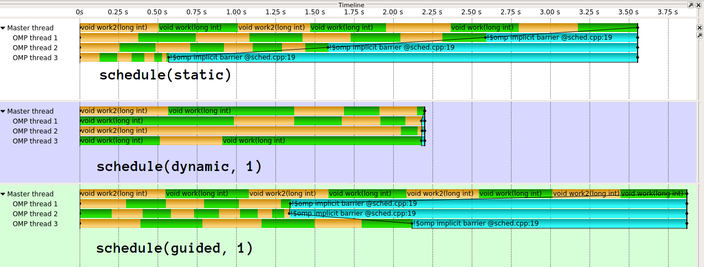

*图：主线程（Master）负责 fork/join，工作线程只在并行域内存在；这一生命周期决定了 OpenMP 适合短促、规则的并行段。*

例如 `f(i)` 的计算量随 `i` 增长，简单地把前半交给线程 0、后半交给线程 1 会导致后者很忙、前者空闲；dynamic 能改善负载均衡。反过来，所有迭代几乎等长时，用 dynamic 只会增加调度成本。选择依据是工作量分布，不是习惯。

以 `c[i] = f(i)` 为例，若 `f` 不是 $O(1)$，循环下标均分并不意味着工作均分。动态调度把迭代切成 chunk，空闲线程再领取下一个 chunk；`chunk` 太小会提高领取任务的开销，太大又会重新造成不均衡。因此实践中先用 `static`，只有测到迭代成本差异明显时才比较 `dynamic` 的不同 chunk 大小。

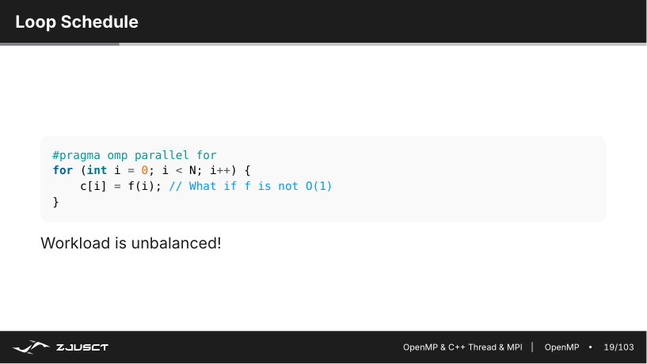

*图：静态切分按迭代编号分块；若后半区每次迭代更重，先完成的线程无法接手剩余工作。*

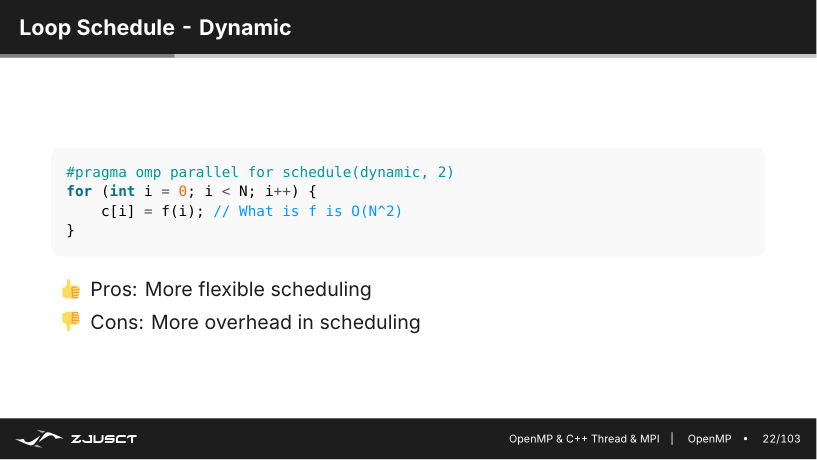

*图：动态调度让空闲线程继续领取 chunk；chunk 越小越灵活，运行时分发次数也越多。*

### critical、atomic、barrier 和 reduction

```cpp
#pragma omp critical
{ shared_queue.push(value); }
```

`critical` 使同一时间只有一个线程进入区域，适合较少发生的复合共享操作。`atomic` 适合简单的读改写；`barrier` 让所有线程等待最慢者。它们都可能限制并行度。对可交换/可结合的加、乘、最大值等，`reduction` 应优先；对可拆分的数据，最好让线程不共享可写状态。

这三种办法的差别不只是 API 名字。`critical` 由锁保护，能包住多条语句，但竞争时所有线程串行；`atomic` 直接依赖硬件原子读改写，适用范围较窄；`reduction` 让每个线程先独立累加，最后只同步一次。最后一种常常最快，但只有运算满足相应的结合/交换语义，且变量确实可私有化时才正确。


*图：对共享变量的“读-改-写”并发执行会产生竞争；用 critical/atomic/reduction 之一把这条路径串行或私有化。*

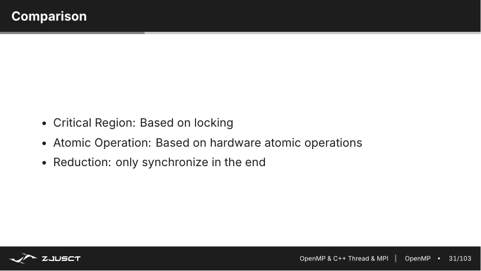

*图：同步方式的选择影响并行度——critical 最通用但串行，atomic 轻量但范围窄，reduction 兼顾正确与快速。*

前面几种同步都把访问完全串行化。当读多写少时，还有更细的取舍：读写锁（read-write lock）允许多个线程同时持有读锁并行，只有写锁才独占；`std::shared_mutex` 在 C++ 里提供了这种能力。

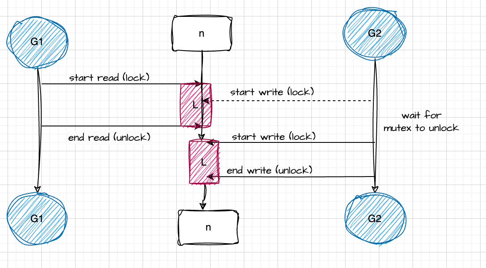

*图：读写锁让大多数情况下的并发读并行化，写操作仍独占；它不是万能，头写锁等待时也会拖慢普通读者。*

用读写锁时，普通 readers 走共享路径、writer 走独占路径，二者互相排斥；没有 writer 时多个 reader 可同时进入。它适合数据经常被多个线程读、很少被改的场景，比如一张频繁查询的大查表。代价是锁本身比普通互斥锁稍重，且 writer 饥饿（一直被读者挤掉）需要额外机制，因此没有必要为每次短临界区都用它。

不要把 `barrier` 当作让程序更稳定的开关。它只能保证所有线程都到达同一点，不能修复漏掉的锁、越界写或错误的变量作用域；在循环中多放一个 barrier，往往只是让快线程多等一次。需要同步时，应该能说清楚下一段代码会读取哪份刚写完的数据。

### 缓存与数据所有权

两个线程即使没有写同一个 C++ 变量，也可能拖慢彼此。cache 以 cache line 为单位搬运，常见大小为 64 字节。若线程 0 持续写 `partial[0]`、线程 1 持续写紧挨着的 `partial[1]`，两个元素虽不同，却可能在同一条 cache line 上。不同核心为了保持一致性会反复抢这条 line，形成 false sharing。程序没有数据竞争，性能仍会很差。

较稳妥的分工是让一个线程长期拥有一个连续的数据块和对应的输出块，尽量少写其他线程会碰到的 cache line。数组初始填充也值得按同样的方式并行做：在 NUMA 机器上，页面常由第一次真正写入它的线程分配到附近内存节点。主线程串行初始化全部大数组，随后再让多个 socket 分块计算，可能从第一步就制造了远端访存。

OpenMP 的线程数、绑核和调度不应靠默认值猜测。`OMP_NUM_THREADS` 控制线程数；`OMP_PROC_BIND`、`OMP_PLACES` 可限制线程迁移；实际效果仍要用 `lscpu`、`numactl --hardware`、`perf` 或课程中的 NUMA 测量方法核对。线程数超过内存带宽能支撑的并发度后，更多线程只会加剧争用。先让单线程访问连续、正确，再逐步增加线程，通常更容易知道速度为何变化。

把线程考虑进来后，墙钟时间里的忙与每一步都在做有用工作是两回事。一个真实程序里，不同线程会在初始化、求解、边界处理、求导等阶段切换，某些线程先完成、某些还在等同步；这段时间在时间线里表现为线程没有满负荷推进。

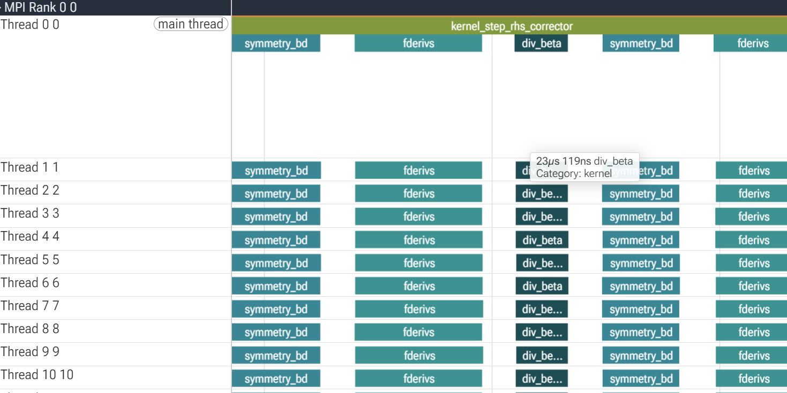

*图：线程节奏各不相同——有的提前完成、有的卡在同步点；只看总耗时看不出每线程在做什么。*

因此衡量并行提升不能只对比两个墙钟数字，还应看 profiler 里的每线程时间线：负载不均的线程会早早空闲等待，同步等待会在时间线上留下明显的空洞。

## C++ 线程与线程池

OpenMP 擅长规则循环，C++ `std::thread` 更适合生产者-消费者、长期后台任务和线程池。线程创建后，`join()` 等待其结束；忘记 join 或 detach 会导致程序生命周期和资源管理出问题。

生产者-消费者通常有一个共享队列：生产者放任务，消费者取任务。队列同时被多个线程访问，必须用 `std::mutex` 保护；空队列时消费者不应不停轮询，而要用条件变量睡眠：

```cpp
std::unique_lock<std::mutex> lock(mu);
cv.wait(lock, [&] { return stopped || !queue.empty(); });
if (stopped && queue.empty()) return;
Task task = std::move(queue.front());
queue.pop();
```

谓词写在 `wait` 里是为应对虚假唤醒和竞争：线程被唤醒后仍要重新检查条件。生产者入队后用 `notify_one()` 唤醒一个等待者；结束时常用 `notify_all()` 让所有线程有机会退出。线程池复用一组工作线程，避免大量短任务反复创建线程。

C++ 并发库的常用工具按角色大致分几类：`<thread>` 负责创建线程，`<mutex>` 保护共享数据，`<atomic>` 做无锁读改写，`<condition_variable>` 让线程在被唤醒前睡眠。C++20 还提供了更高级的 `std::semaphore`、`std::latch` 和 `std::barrier`：`latch` 是一次性的倒计数门（所有人到齐即放开），`barrier` 可重复使用、还带一个到齐后执行的回调。工具名字虽多，归根到底还是谁持有共享数据、如何通知等待者这两件事。

用 `std::mutex` 时，最稳妥的写法是配合 RAII，而不是手动 `lock()`/`unlock()`：

```cpp
std::mutex counter_mutex;
void increment_safe(int iterations) {
    for (int i = 0; i < iterations; i++) {
        std::lock_guard<std::mutex> lock(counter_mutex);
        counter++;
    }  // lock 离开作用域时自动解锁
}
```

`std::lock_guard` 在构造时加锁、析构时自动解锁，即使中途抛出异常也能保证锁被释放，避免忘了解锁或在异常路径上留下死锁。这是一种常见的 RAII 风格：资源（锁、文件、缓冲区）的获取与释放绑定到对象的生命周期，而不是靠手写配对代码。

对简单的计数器，`std::atomic<int>` 往往比互斥锁更轻：它用硬件原子读改写完成自增，没有锁的排队与唤醒开销，也就没有数据竞争。它的适用面比锁窄——只能覆盖简单类型和小操作，复合的读+判断+写仍需在锁下完成。
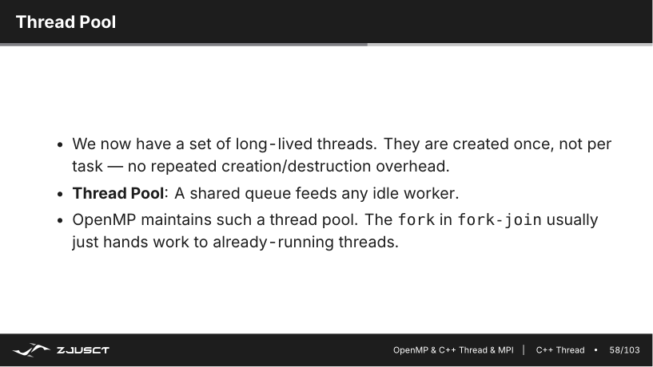

*图：线程池用固定的一组线程反复处理任务队列；与 OpenMP 按指令 fork/join 不同，线程由你自己管理和分发。*

???+ note "OpenMP 的 fork-join 和 C++ 线程池是两种模型"

    OpenMP 的 `parallel` 在进入时把一组线程唤醒、离开时把它们回收，每次并行域都隐式做一次 fork/join；适合规则、短促的循环并行。C++ 线程池则让一组长命的线程常驻，任务从共享队列领取，适合持续有任务、任务长短不一的场景。两者都用一组有限线程执行工作，区别在谁负责创建工作线程、任务如何分发：OpenMP 由运行时按指令划分，线程池由你自己写队列和领取逻辑。

流水线是 C++ 线程在课程中的另一种用法：A、B、C 三个阶段各有一个长期运行的线程，B 从 A 的队列取对象、处理后再交给 C。它增加的是吞吐而不是让同一个对象跳过阶段；队列为空时应等待条件变量，而不是让线程不停轮询占满一个核心。

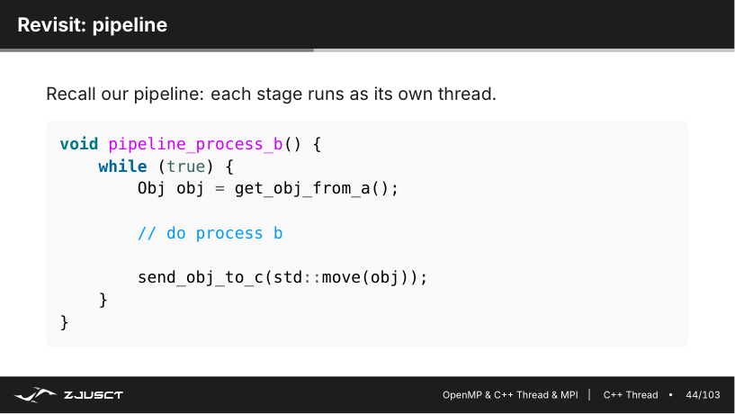

*图：单个对象仍要依次经过 A→B→C，但不同对象可同时处在不同阶段；吞吐因此提升，而单条链的关键路径没有变短。*

## MPI：每个进程有独立地址空间

MPI（Message Passing Interface）用于多个独立进程间通信，可以跨节点。每个进程有 rank；`MPI_COMM_WORLD` 是启动时的通信器。程序通常先初始化、查询自己的 rank 和总进程数、完成计算通信、最后结束：

```cpp
MPI_Init(&argc, &argv);
int rank, size;
MPI_Comm_rank(MPI_COMM_WORLD, &rank);
MPI_Comm_size(MPI_COMM_WORLD, &size);
// rank 0、1、...、size-1 执行各自的数据块
MPI_Finalize();
```

MPI 进程没有共享的普通变量。rank 0 修改 `x`，rank 1 不会自动看到；必须发送消息或使用集合通信。消息匹配由 communicator、源/目的 rank 和 tag 共同约束。tag 可以区分不同阶段/不同类型的消息，避免接收端把不该接的消息取走。

通信器（communicator）定义一组能互相通信的进程，每个通信器内的 rank 都从 0 编号、唯一。启动时的 `MPI_COMM_WORLD` 包含所有进程；需要把一组进程单独划分时，可以用 `MPI_Comm_split(comm, color, key, &new_comm)`：`color` 决定哪些进程归入同一个新通信器，`key` 决定在新通信器里的排序。例如按奇偶 rank 设 `color`，就能把进程一分为二、各自独立做点对点或集合通信。这种从大组里划分子组的能力，在多维度并行、按节点/按功能分组的程序里常见。

```cpp
int my_color = (rank % 2);          // 奇偶分组
MPI_Comm sub;
MPI_Comm_split(MPI_COMM_WORLD, my_color, rank, &sub);
int sub_rank, sub_size;
MPI_Comm_rank(sub, &sub_rank);
MPI_Comm_size(sub, &sub_size);
```

拆分后的 `sub` 是独立通信器，内部 rank 重新从 0 编号；原本跨组的进程之间不能直接用 `sub` 里的 rank 通信，只能回到上层通信器。

### 点对点通信和死锁

```cpp
MPI_Send(buf, n, MPI_DOUBLE, dest, tag, MPI_COMM_WORLD);
MPI_Recv(buf, n, MPI_DOUBLE, src,  tag, MPI_COMM_WORLD, &status);
```

阻塞 `Send`/`Recv` 的顺序设计不当会死锁。例如两个 rank 都先执行大消息的阻塞 `Send`，双方都等对方先收。常见处理是约定一边先收、一边先发，使用 `MPI_Sendrecv`，或用 `MPI_Isend`/`MPI_Irecv` 发起非阻塞通信，再 `MPI_Waitall` 等待完成。

非阻塞不等于数据立刻可用。在 `Wait` 完成前，发送缓冲区通常不能随意改，接收缓冲区也不能被当作已经填好。

死锁例子可以写成两个 rank 都先 `MPI_Send` 再 `MPI_Recv`。对于较大的消息，发送可能要等对方先贴出接收，两个进程于是互相等待。可以让一方先收、一方先发，也可以使用 `MPI_Sendrecv`；`MPI_Isend`/`MPI_Irecv` 的正确模式则是先把通信请求发起，再在真正使用缓冲区前 `MPI_Wait` 或 `MPI_Waitall`。非阻塞的价值在于避免不必要的等待或让通信和独立计算重叠，不是取消数据依赖。

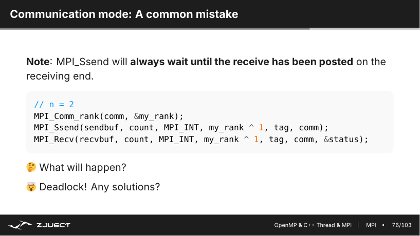

*图：两边都等待对方先进入接收，等待关系形成环，因此没有任何 rank 能继续。*

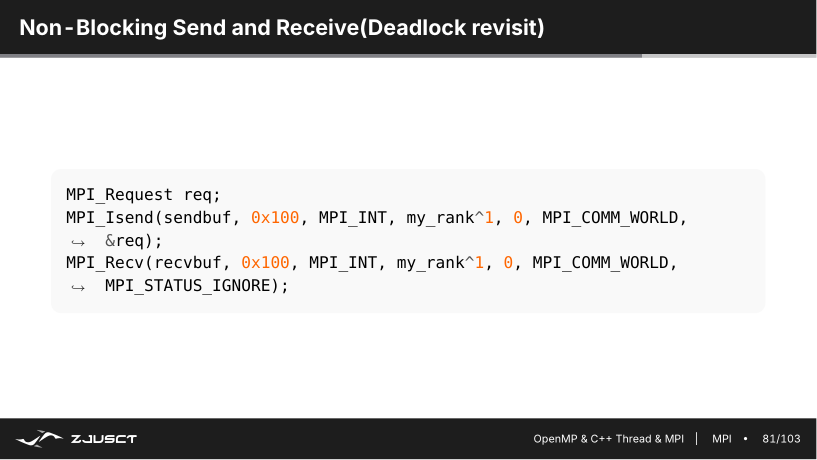

*图：请求对象代表尚未完成的通信；`Wait` 建立缓冲区可再次访问的边界。*

一个相邻 halo 交换的骨架通常是下面这样：

```cpp
MPI_Request req[4];
MPI_Irecv(top_halo,    width, MPI_DOUBLE, up,   0, comm, &req[0]);
MPI_Irecv(bottom_halo, width, MPI_DOUBLE, down, 1, comm, &req[1]);
MPI_Isend(first_row,   width, MPI_DOUBLE, up,   1, comm, &req[2]);
MPI_Isend(last_row,    width, MPI_DOUBLE, down, 0, comm, &req[3]);

update_interior();     // 不读取 halo 的网格内部
MPI_Waitall(4, req, MPI_STATUSES_IGNORE);
update_boundary();     // 此时才能读取收到的 halo
```

tag 的 0、1 让两个方向的消息不会混淆。`update_interior` 必须真的不依赖边界数据，否则它与通信重叠只是在制造竞态。写 MPI 时，把消息何时发起、缓冲区何时可复用、哪块计算能先做标在同一张数据划分图上，比单独记住 `Isend` 的函数签名更有用。

一次 MPI 消息由 communicator、source、tag 和顺序共同参与匹配。`MPI_Recv` 指定的 source/tag 可以精确匹配，也可以使用 `MPI_ANY_SOURCE`；后者方便，却会让接收次序随运行时变化，调试和可重复性更难。发送缓冲区和接收缓冲区属于各自 rank 的私有地址空间，`MPI_Send` 传的是内容而不是指针；把本 rank 的指针数值传给另一个 rank 没有意义。

标准 `MPI_Send` 可能在内部复制，也可能等待接收方进入匹配，不能依赖小消息在当前机器上没有阻塞来证明顺序安全。消息协议和缓冲阈值变化后，同一写法可能死锁。

### 集合通信：把共同模式交给 MPI 库

常见集合通信如下：

| 操作 | 含义 | 常见用途 |
| --- | --- | --- |
| `MPI_Bcast` | 根进程把同一份数据发给全部进程 | 分发参数、配置 |
| `MPI_Scatter` | 根进程把不同块分给各进程 | 分发数组/网格块 |
| `MPI_Gather` | 各进程把块收集到根进程 | 汇总结果 |
| `MPI_Allgather` | 收集后每个进程都得到完整结果 | 复制全局信息 |
| `MPI_Reduce` | 按加/最大值等归约到根进程 | 全局和、最大误差 |
| `MPI_Allreduce` | 归约结果发给所有进程 | 数据并行梯度同步 |
| `MPI_Barrier` | 所有人在此等待 | 只有语义确需同步时使用 |

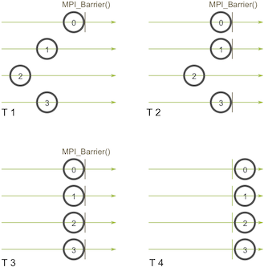

*图：Barrier 让各进程对齐到同一点；它不搬运数据，只放大最慢进程的等待时间。*

集合通信通常比手写一串 `Send/Recv` 更清楚，也能让 MPI 库根据网络拓扑选择树形、环形等算法。`Barrier` 不做数据传输，也不让计算变快；它只保证没有人越过这里，因此过量使用会放大最慢进程的影响。

### MPI 与 OpenMP 混合并行

真实集群常不是只用 OpenMP 或只用 MPI。一种常见布局是每个节点启动少数 MPI rank，每个 rank 管理一段独立数组；rank 内再用 OpenMP 线程处理自己的局部块。这样节点间只交换必要的边界数据或归约结果，节点内则避免把同一份大数据复制到许多进程地址空间。

例如二维网格按行分给 rank。每个 rank 计算内部行时不依赖邻居，边界行则需要相邻 rank 的 halo 数据。可以先 `MPI_Irecv`/`MPI_Isend` 发起边界交换，同时用 OpenMP 算内部区域；通信完成后再算边界区域。这里的重叠有明确的前提：内部计算必须真的不读还未到达的 halo，缓冲区也不能在通信结束前被改写。把可重叠和必须等待的区域画出来，比盲目给所有地方加非阻塞调用可靠得多。

同一节点放多少 rank、每个 rank 开多少线程，取决于 NUMA、内存容量、网络设备亲和性和应用的通信模式。一个 rank 对应一个 NUMA domain 有时较方便，GPU 程序又常让一个 rank 管理一张 GPU；这些都是起点，不是固定教条。配置改变后要重新测量，尤其要观察绑定是否让多个 worker 挤在同一组核心上。

MPI 与 OpenMP 混合时，MPI 已经负责进程级分区，OpenMP 只应进入确认独立的热点循环。rank 数、每 rank 的线程数、绑核和 NUMA 放置需要作为同一个配置比较；单改 `OMP_NUM_THREADS` 不会让原本没有并行区的程序变快。

!!! danger "非阻塞通信不等于数据已经可用"

    `MPI_Irecv`/`MPI_Isend` 返回后，通信仍可能在进行。完成前不要读取接收缓冲区、改写发送缓冲区或释放它们；用 `MPI_Wait`、`MPI_Test` 或 `MPI_Waitall` 建立这条数据依赖。计算若不依赖该缓冲区，可以放在提交与等待之间。

## 从问题分解到框架选择

### SHA-512 并行案例

SHA-512 对一个输入流有链式状态依赖，不能把单个哈希过程随意切成互不依赖的轮次。若任务是对很多独立文件/块做哈希，或算法允许以适当的组合方式处理块，则可以把不同块分给不同工作者，再合并结果。真正要做的，是先找出依赖和关键路径，而不是看到计算量大就把中间循环并行化。

当程序同时有文件读写和计算时，还可让读取下一块、计算当前块、写出结果重叠，形成流水线。实际收益取决于磁盘带宽、块大小和队列设计；如果 I/O 已经是瓶颈，增加计算线程不会解决问题。

### 任务依赖与粒度

循环中的每个迭代独立时，按连续区间切给线程最简单；现实任务常有依赖图。若任务 B 必须读取 A 的输出，B 在 A 完成前不能开始；若两者只读共同输入，则可并行。把依赖误判为独立会产生数据竞争，把独立任务强行串行则损失并行度。表达依赖的方式可以是 barrier、future、OpenMP task 的 `depend`，或 MPI 消息的完成事件，底层含义相同：消费者必须等到生产者的数据已经可见。

粒度决定调度开销能否摊薄。一个 task 只做几十条指令时，入队、原子操作、唤醒和窃取工作的时间可能远大于计算；一个 task 大到数秒又会令某个 worker 提前结束后无事可做。可以先根据单个任务的测量把小工作合并为 chunk，再在工作量不均时采用动态调度。动态调度不是免费负载均衡，它会改变数据局部性和可重复性，也会在共享队列上制造竞争。

### 并行框架选择

单节点上的规则数组循环，OpenMP 通常是顺手的起点；需要细粒度任务队列或长期工作者，用 C++ 线程；跨节点、每个工作者应拥有独立内存时用 MPI。大型程序常混合使用：每个节点一个或多个 MPI 进程，进程内部再用 OpenMP 线程，GPU 部分再由 CUDA 执行。

无论使用哪个框架，都先画出数据如何划分、每步读写什么、何时同步、消息多大。并行代码的核心是让线程在正确的时间做正确的工作，让所有核心忙起来只是表象。
