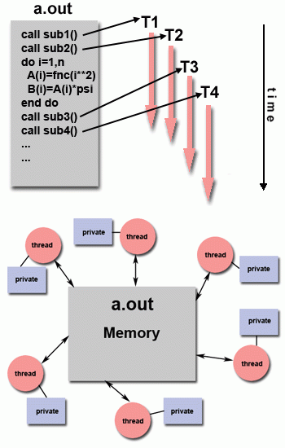
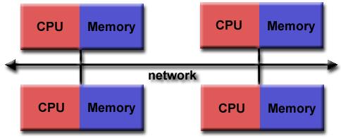
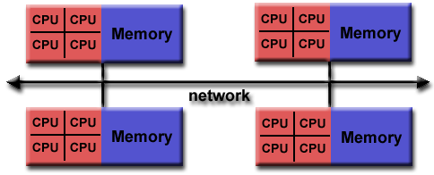

# 07-12 上午 OpenMP、C++ 线程与 MPI 并行计算基础

并行程序需要明确数据所有权、并发读写、同步点和跨节点传输。OpenMP（Open Multi-Processing，开放式多处理）用于共享内存线程，MPI（Message Passing Interface，消息传递接口）用于独立进程间的消息传递，C++ 标准库提供线程和同步原语。Lab 1 的 HPL（High Performance Linpack，高性能 Linpack 基准）使用 MPI，Lab 2 的 CPU kernel 使用线程与 SIMD，Lab 4 可能同时使用 MPI、OpenMP 和 GPU。[^openmp-spec][^mpi-standard]


!!! quote "LLNL 并行计算教程的基本分类（译）"

    共享内存模型中的处理器可以访问同一地址空间。分布式内存模型中，每个处理器拥有本地内存，数据交换依靠网络消息。混合模型在节点内使用共享内存，在节点之间使用消息传递。[^llnl-parallel]


!!! tip "先确定数据所有权"

    对每个数组记录下列三件事。rank 是 MPI 通信器中一个进程的编号。

    - 谁初始化它
    - 哪些线程或 rank 读取它
    - 哪个执行单元写入哪一段

    若无法说明一个输出元素由谁唯一写入，应先修正分解，再考虑 `parallel for`、锁或 MPI 调用。

## 三种并行边界

=== "OpenMP 共享一个地址空间"

    多个线程共享同一进程的数组和堆。适合单节点规则循环。需要明确私有变量、共享变量、归约和同步。

=== "C++ 线程显式管理并发"

    线程同样共享地址空间，但创建、任务队列、锁、条件变量和生命周期由程序负责。适合少量长期异步任务，不适合替代规则数组循环的 OpenMP。

=== "MPI 使用多个地址空间"

    每个 rank 是独立进程，普通变量不会自动共享。适合跨节点运行。数据分解、消息匹配和集合通信都必须显式表达。

=== "混合并行在节点间使用 MPI"

    一个节点内通常运行少量 MPI rank，每个 rank 启动 OpenMP 线程。资源申请、线程数、CPU 绑定和 NUMA 放置要与该层次一致。

## 并行分解方式

数据并行把同构数组、矩阵或网格切成区域。任务并行把不同性质的工作拆成独立任务。流水并行让不同阶段同时处理不同批次。选择分解时必须同时评估工作量、数据访问、边界依赖与粒度。[^llnl-parallel]

| 分解 | 合适的对象 | 主要优点 | 需要额外检查 |
| --- | --- | --- | --- |
| 一维/二维数据块 | 向量、矩阵、图像、规则网格 | 输出易独占，访问连续 | 边界、负载、NUMA 位置 |
| 循环迭代 | 迭代独立的规则循环 | OpenMP 直接表达 | 数据竞争、调度策略 |
| 任务图 | 有明确依赖的子任务 | 可表达不规则并发 | 任务开销、关键路径 |
| 域分解 | 多节点网格/矩阵 | 可扩展到 MPI | halo 交换、负载和通信量 |
| 流水线 | 多阶段处理 | 吞吐可重叠 | 队列、背压、阶段失衡 |

二维数组按行分给线程时，每个线程可连续写自己的行，通常有良好局部性。按棋盘格划分可能让边界更多、写入更分散。分解应从数据依赖图和热点访问方向推导。

## 线程开销与同步


创建线程、唤醒线程、领取任务、进入屏障和竞争锁都有成本。任务只包含少量计算时，调度与同步可能超过计算本身。规则数组循环通常复用一个线程团队，让每个线程取得连续工作块；内层循环中反复创建 `std::thread` 或很小的 OpenMP 并行区会放大这些开销。


*fork-join 描述并行区的生命周期。图中的 `fork`/`join` 是运行时组织线程团队的概念。[^openmp-spec]*

同步要保护一个具体不变量。多个线程共同维护 `sum` 时，可用 reduction。更新单个计数器时，可考虑 atomic。一次操作同时检查和修改多个共享对象时，需要互斥锁。`critical` 会把区域内的工作串行化，应只包住需要互斥的部分。

## OpenMP 的 fork-join 模型

OpenMP 程序从初始线程开始。`#pragma omp parallel` 形成线程团队，团队内每个线程执行并行区中的代码，离开并行区时汇合。`for`、`sections`、`single`、`task` 用于分配团队内部的工作。教学和性能敏感代码中可使用 `default(none)`，再显式写出 `shared`、`private`、`firstprivate` 和 `reduction`。[^openmp-spec]



*Lawrence Livermore National Laboratory 的 OpenMP Tutorial 展示共享变量和私有变量的边界。这个边界决定是否需要同步。[^llnl-openmp]*

```c
#pragma omp parallel default(none) shared(x, y, n, a)
{
  #pragma omp for
  for (long i = 0; i < n; ++i)
    y[i] = a * x[i] + y[i];
}
```

`i` 在 worksharing-loop 中是私有循环变量；`x/y/n/a` 的作用域在上例中被明确声明。指针变量私有并不代表它指向的数组自动私有，数组的所有权仍需由程序逻辑定义。

### `parallel for`、`sections` 与嵌套循环

规则循环首先使用 `parallel for`。`sections` 适合少数类型不同、数量固定的代码段，例如一个线程处理输入、另一个线程处理独立输出。嵌套规则循环通常先并行外层，以保持内层连续访问。外层迭代太少时才评估 `collapse(2)`。[^openmp-workshare]

```c
#pragma omp parallel for schedule(static)
for (int i = 0; i < m; ++i)
  for (int j = 0; j < n; ++j)
    c[i*n + j] = a[i*n + j] + b[i*n + j];
```

若写成 `collapse(2)`，运行时把二维迭代空间线性化后划分。它可能改善外层很小时的负载，却也可能破坏“一个线程负责连续行”的数据位置；应在真实 shape 和线程数上测量。

### `static`、`dynamic` 与 `guided` 调度

`static` 在进入循环时就分配迭代，开销低，重复运行时数据位置稳定，适合矩阵加法、向量循环等每轮成本接近的场景。`dynamic` 让线程完成一块后再领取下一块，适合迭代成本差异大的循环，但要付出队列和调度开销。chunk 太小时，调度本身会成为热点。`guided` 从较大块开始逐渐减小，可用于某些后段不均衡的循环。[^openmp-spec]


*图中说明不均衡循环为何需要动态调度。数据局部性好、每轮成本接近时，`static` 通常更稳。[^openmp-spec]*

```c
#pragma omp parallel for schedule(dynamic, 64)
for (long i = 0; i < n; ++i)
  work(items[i]);
```

选择 `64` 只是示例。应扫描若干 chunk 候选，记录时间和负载分布；如果 `work(items[i])` 只做几条指令，先重排问题或增大任务粒度，而不是无限减小 chunk。

### 同步与归约

```c
/* 最适合可结合累加：每线程私有部分和，最后合并。 */
double sum = 0.0;
#pragma omp parallel for reduction(+:sum)
for (long i = 0; i < n; ++i) sum += x[i];

/* 适合单个、受支持的读改写。 */
#pragma omp atomic update
counter += 1;
```

`critical` 保护命名区域，一次只允许一个线程进入；`atomic` 保护受支持的单个内存更新，语义更窄、通常更轻；`barrier` 只等待团队成员到达，不传输数据也不修复竞态；`reduction` 把合并模式交给运行时。浮点 reduction 会改变加法树，不能假定与串行逐位一致。[^openmp-spec]


*选择依据是数据依赖。输出可以按线程独占时，三者都不应位于每次迭代的热路径。[^openmp-examples]*

### 缓存与数据所有权

线程分别写相邻小变量时，逻辑上互不冲突，物理上仍可能共享同一缓存行，造成 false sharing。局部累加器应尽量保存在线程私有变量中，循环结束后再 reduction；数组输出应按连续块划分，避免多个线程交错写相邻元素。绑定策略和 NUMA first-touch 见前面的系统与性能分析页面。

## C++ 线程与线程池

`std::thread` 用于创建一个独立执行流；线程是同一进程内可独立调度的执行流，通常共享地址空间和打开的文件。`join()` 表示等待其结束并回收资源。线程函数抛出未处理异常、访问已释放对象、遗漏 `join()` 都属于生命周期错误。共享状态需要通过 `std::mutex`、`std::lock_guard`、`std::condition_variable`、`std::atomic` 等工具表达同步，防止数据竞争。数据竞争指多个线程并发访问同一内存位置，至少一个访问为写，且没有满足语言内存模型的同步。而不是依赖“本机多半按顺序执行”。[^cpp-thread]

```cpp
std::mutex m;
long total = 0;

void add_range(const int* a, int begin, int end) {
  long local = 0;
  for (int i = begin; i < end; ++i) local += a[i];
  std::lock_guard<std::mutex> lock(m);
  total += local;
}
```

这里锁只用于最后一次合并，热点循环使用局部变量。若每次 `local += a[i]` 都改为加锁，所有线程会在同一锁上排队。

### 条件变量与任务队列

条件变量适合“队列为空时睡眠，有新任务时唤醒”的场景。等待必须在谓词循环中进行，因为唤醒可能是虚假的，也可能在重新获得锁前被其他线程抢走任务。线程池需要定义队列关闭、异常传播、未完成任务和对象销毁的语义；课程中的规则数值循环通常更适合 OpenMP，而非手写线程池。[^cpp-thread]


*线程池处理任务生命周期与创建开销。任务依赖、共享写入和负载不均仍需算法和程序结构处理。[^cpp-thread]*

## MPI 中每个进程有独立地址空间

MPI 中每个 rank 是独立进程；rank 是 MPI 通信器内一个进程的编号，不同 rank 不共享普通变量。有自己的堆、全局变量和文件描述符。`MPI_COMM_WORLD` 是常用通信器，`MPI_Comm_rank` 给出当前 rank 编号，`MPI_Comm_size` 给出通信器大小。只有通过 MPI 通信调用，数据才会从一个 rank 到另一个 rank；这也是 MPI 可以跨节点运行的原因。[^mpi-standard]



*Lawrence Livermore National Laboratory 的 MPI Tutorial 展示 MPI 的数据边界。数据边界由进程和消息接口明确划分。[^llnl-mpi]*

```c
MPI_Init(&argc, &argv);
int rank, size;
MPI_Comm_rank(MPI_COMM_WORLD, &rank);
MPI_Comm_size(MPI_COMM_WORLD, &size);
/* 每个 rank 只计算自己拥有的数据段。 */
MPI_Finalize();
```

### 点对点通信、匹配与死锁

一条 MPI 消息由通信器、源 rank、目标 rank、tag、数据类型和数量等共同匹配。接收方可以指定来源和 tag，也可用 `MPI_ANY_SOURCE`、`MPI_ANY_TAG`，但调试时过度使用通配符会掩盖消息顺序错误。发送缓冲区在发送完成前不能修改，接收缓冲区在接收完成前不能读取结果。[^mpi-standard]


*这是同步发送导致的确定性死锁。普通 `MPI_Send` 是否因内部缓冲暂时返回取决于实现和消息大小。[^mpi-standard]*

`MPI_Sendrecv` 是交换邻居数据的直接选择。需要重叠通信和计算时，先张贴接收，再启动发送，期间计算与通信无关的部分，最后在真正使用边界数据前 `MPI_Waitall`。

```c
MPI_Request req[2];
MPI_Irecv(recvbuf, n, MPI_DOUBLE, left,  0, MPI_COMM_WORLD, &req[0]);
MPI_Isend(sendbuf, n, MPI_DOUBLE, right, 0, MPI_COMM_WORLD, &req[1]);
compute_interior();
MPI_Waitall(2, req, MPI_STATUSES_IGNORE);
compute_boundary(recvbuf);
```


*非阻塞调用创造重叠机会。没有可独立计算，或网络和内存资源不足时，`Waitall` 仍可能几乎等待全部通信时间。[^mpi-standard]*

### 集合通信把共同模式交给 MPI 库

广播、散布、聚集、规约和全体规约属于集合通信，即通信器内一组 rank 共同参与的 MPI 操作。库可以按通信器大小、拓扑和消息尺寸选择树形、环形或其他算法，通常比手工写大量点对点调用更可靠。`MPI_Bcast` 适合向所有 rank 分发共同输入；`MPI_Reduce` 在 root 汇总局部结果；`MPI_Allreduce` 让所有 rank 都得到汇总结果。[^mpi-collectives]

```c
MPI_Allreduce(&local_norm, &global_norm, 1,
              MPI_DOUBLE, MPI_SUM, MPI_COMM_WORLD);
```

所有参与 rank 必须以兼容顺序调用同一个集合操作。若一个 rank 跳过 `MPI_Bcast` 而另一个进入它，程序通常会挂起；`MPI_Barrier` 也只是等待点，不会传输应用数据或完成其他集合操作。


*barrier 用于表达必须等待的阶段边界。过多 barrier 会把负载不均直接变成空等。[^mpi-standard]*

### MPI 与 OpenMP 混合并行

混合并行通常在节点间使用 MPI、节点内使用 OpenMP。资源形状必须一致。`--ntasks-per-node` 指每节点 rank 数，`--cpus-per-task` 指每个 rank 可用 CPU 数，`OMP_NUM_THREADS` 通常与后者相等。每个 rank 又启动整机核心数线程时，会过度订阅并破坏缓存、NUMA 和调度稳定性。[^openmpi-bind]

```bash
#SBATCH --nodes=2
#SBATCH --ntasks-per-node=4
#SBATCH --cpus-per-task=8
export OMP_NUM_THREADS="$SLURM_CPUS_PER_TASK"
srun --cpu-bind=cores ./hybrid_solver
```

一个常见起点是每个 NUMA 域一个 rank，rank 内线程绑定到本地核心并 first-touch 自己的数据块。它只是起点；最终布局取决于节点拓扑、通信模式和热点是否受内存带宽限制。



*Lawrence Livermore National Laboratory 的 MPI Tutorial 展示 MPI + OpenMP 的常见形式，即节点间消息传递、节点内共享内存并行。[^llnl-mpi]*

## 从问题分解到框架选择

框架选择来自数据边界。规则共享数组循环从 OpenMP `parallel for` 开始。跨节点且数据需显式交换时使用 MPI。少量长期异步活动可用 C++ 线程。复杂依赖的细粒度工作要先画任务图，再评估 OpenMP task 或专门运行时。[^openmp-task]

### SHA-512 并行案例

对许多独立文件求 SHA-512 时，每个文件是独立任务，可按文件分配给线程或 rank。标准连续消息摘要的内部状态按块链式更新。并行树形哈希需要选择定义了这种组合语义的算法。这个例子说明输入能切块，仍需确认原问题是否可直接并行。

### 任务依赖与粒度

任务图中节点是工作，边是必须先后完成的依赖。某时刻可执行节点数给出可用并行度，最长依赖链给出关键路径。任务太细时队列、同步和缓存扰动占比高。任务太粗时可用并行度不足。测量不同粒度下的执行时间与负载，才能判断运行时开销是否值得。[^openmp-task]

### 并行框架选择

| 问题特征 | 起始方案 | 要验证的风险 |
| --- | --- | --- |
| 单节点、规则数组循环 | OpenMP `parallel for` | 迭代独立、调度、false sharing |
| 单节点、少量长期并发活动 | C++ 线程 | 生命周期、锁、条件变量和异常 |
| 多节点、显式域分解 | MPI | 消息匹配、死锁、通信/计算重叠 |
| 多节点且节点内算力强 | MPI + OpenMP | rank/线程布局、NUMA、过度订阅 |

!!! question "从资源到程序的自测"

    获得 2 个节点，每节点 4 个 MPI rank，每个 rank 8 个 OpenMP 线程。作业脚本、环境变量和代码中分别应保证什么？

    ??? tip "详细答案"

        作业一共需要 8 个 MPI rank，每个节点需要 $4\times8=32$ 个 CPU 线程配额。脚本、环境和代码需要表达同一层次。

        ```bash
        #SBATCH --nodes=2
        #SBATCH --ntasks-per-node=4
        #SBATCH --cpus-per-task=8
        export OMP_NUM_THREADS="$SLURM_CPUS_PER_TASK"
        srun --cpu-bind=cores ./hybrid_solver
        ```

        每个 rank 只创建 8 个 OpenMP 线程。rank 之间通过 MPI 交换数据。同一 rank 内的线程共享本 rank 的地址空间。还应记录 CPU 绑定和 NUMA 策略，并检查 `srun` 实际启动的 rank 数、线程数和节点列表，避免 rank 或线程超过申请资源。

[^llnl-openmp]: Lawrence Livermore National Laboratory, *OpenMP Tutorial*, <https://hpc-tutorials.llnl.gov/openmp/>.
[^llnl-mpi]: Lawrence Livermore National Laboratory, *MPI Tutorial*, <https://hpc-tutorials.llnl.gov/mpi/>.
[^openmp-spec]: OpenMP Architecture Review Board, *OpenMP API Specification*, <https://www.openmp.org/specifications/>.
[^llnl-parallel]: Lawrence Livermore National Laboratory, *Introduction to Parallel Computing Tutorial*, <https://hpc.llnl.gov/documentation/tutorials/introduction-parallel-computing-tutorial>.
[^openmp-workshare]: OpenMP Architecture Review Board, *OpenMP 5.2 Worksharing-Loop Construct*, <https://www.openmp.org/spec-html/5.2/openmpsu30.html>.
[^openmp-examples]: OpenMP Architecture Review Board, *OpenMP Examples*, <https://www.openmp.org/resources/openmp-examples/>.
[^cpp-thread]: ISO C++ Foundation, *C++ reference: thread support library*, <https://en.cppreference.com/w/cpp/thread>.
[^mpi-standard]: MPI Forum, *MPI Standard Documents*, <https://www.mpi-forum.org/docs/>.
[^mpi-collectives]: Open MPI, *MPI Collectives*, <https://docs.open-mpi.org/en/main/man-openmpi/man3/MPI_Bcast.3.html>.
[^openmpi-bind]: Open MPI, *Process placement and binding*, <https://docs.open-mpi.org/en/main/launching-apps/scheduling.html>.
[^openmp-task]: OpenMP Architecture Review Board, *OpenMP 5.2 Tasking*, <https://www.openmp.org/spec-html/5.2/openmpse83.html>.
