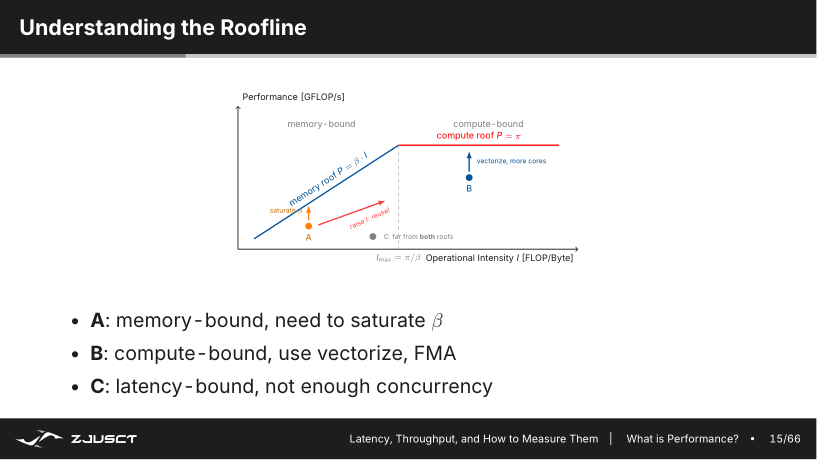
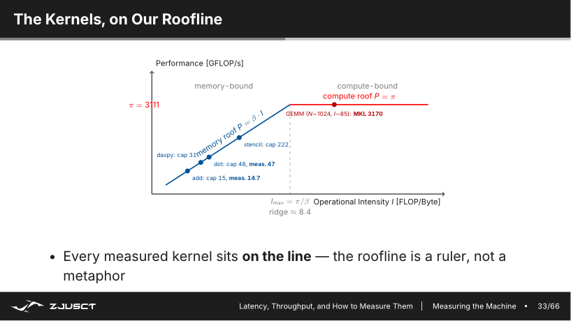
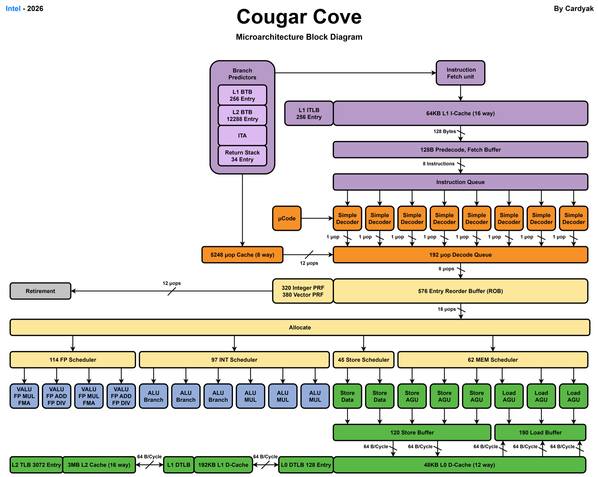
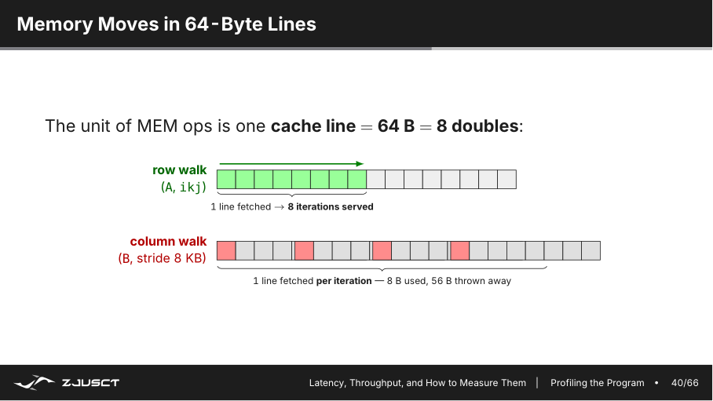
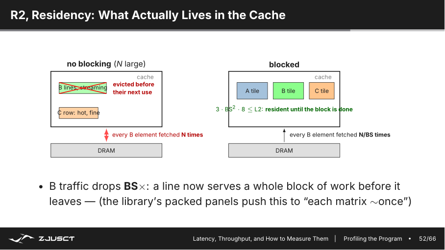
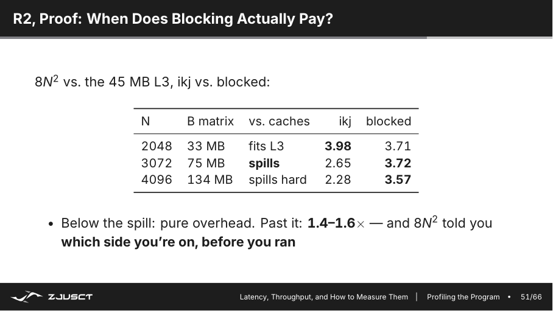
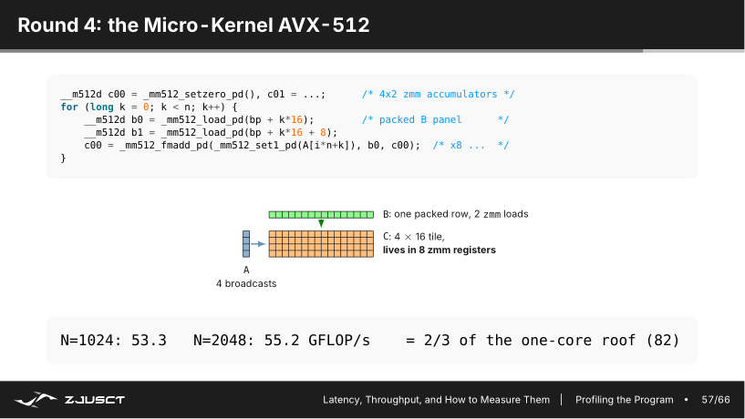
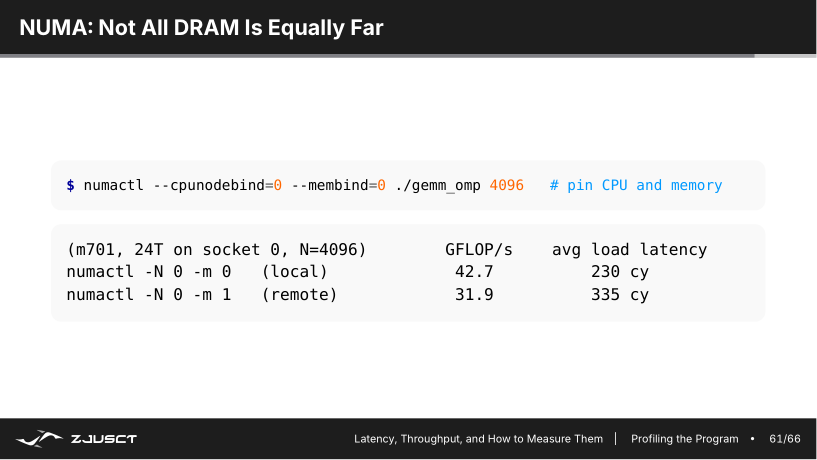
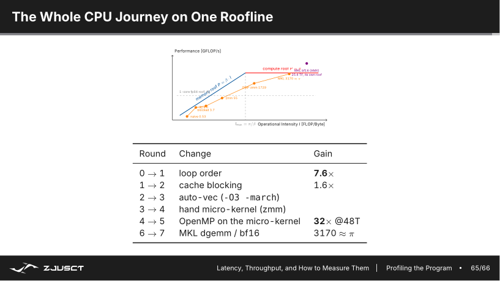

# 07-12 下午：性能分析技术基础（Profiling）

性能工具给出的是迹象，不是结论。一个热点的高 cache miss、低 IPC 或长时间等待，必须回到循环访问、线程分工和数据位置解释；优化后的同一组测量再决定假设是否成立。

## 性能测量

性能数据必须有问题定义。要比较两个版本，至少固定输入规模、数据类型、编译器和优化选项、线程数、CPU 绑核、NUMA 策略、是否包含初始化/I/O。首次运行可能受动态链接、页面分配、缓存预热影响，因此应多次测量，报告中位数/分布，而不是只挑一次最好结果。

???+ note "读 profiler 前先懂：时间去哪了（时钟、CPI、cache miss）"

    单周期 CPU 里，每个指令都是固定的一周期，性能很好算：指令数 × 时钟周期。现代处理器不讲这套，但理解性能仍是在回答同一类问题。一个程序消耗的（处理器）时间大致可以拆成：

    $$
    \text{时间} \approx \text{指令数}\times \text{CPI}\times \text{时钟周期长}
    $$

    其中 **CPI**（cycles per instruction）是平均每一条指令花几个时钟周期——理想流水线接近 1，但 cache miss、分支预测错误、依赖等待都会让它远大于 1。反过来看 **IPC**（instructions per cycle）= $1/\text{CPI}$，表示每个时钟完成几条指令。

    所以当你看到 `perf stat` 里 `IPC = 0.65`，意思是每个时钟平均只完成 0.65 条指令——处理器有大量周期在**等待**（多半是等内存或等依赖），而不是在算。等内存往往表现为 `cache-misses` 高、`stalled cycles` 高。读这些数字的顺序是：先看总时间，再拆出指令数与 CPI，再用 cache/分支事件定位"等待具体等在哪"。

!!! info "平均值掩盖尾部延迟"

    并行作业结束要等最慢的 rank，服务请求也常由最慢的一次决定。除平均耗时外，保留中位数、最小/最大值或分位数；一次异常慢是系统噪声、负载不均还是同步阻塞，需要回到时间线判断。

最基本的是 wall-clock time：用户实际等待多久。C++ 可用 `std::chrono::steady_clock`，C 可用 `clock_gettime`。计时区间应只包住要比较的核心工作；把随机初始化、打印和文件读取混在一起，无法判断优化改到了哪里。

```cpp
auto begin = std::chrono::steady_clock::now();
kernel(a, b, c, n);
auto end = std::chrono::steady_clock::now();
double seconds = std::chrono::duration<double>(end - begin).count();
```

对矩阵乘法，常把工作量写作约 $2N^3$ FLOP（一次乘加计为两次浮点操作），于是：

$$
\text{GFLOP/s}=\frac{2N^3}{\text{seconds}\times10^9}
$$

这个数方便和机器能力比较，但前提是算法确实做了这些运算、结果没有被编译器优化掉，并且数值结果通过校验。

测性能前要分清两组单位。

- **延迟**用 `s`、`ms`、cycles，回答“一次要多等”；
- **吞吐**用 `op/s`、`FLOP/s`、`B/s`，回答“单位时间能做多少”。

延迟由依赖链和串行等待决定，吞吐受并行宽度和资源上限决定。这里有一句很贴切的玩笑——“永远不要低估一辆装满磁带、在高速公路上狂奔的面包车的带宽”（Andrew Tanenbaum）🚐💨。它想说的是，一次运送大量数据时，总吞吐可以非常可观，但逐次往返的延迟依然糟糕。现实中 AWS Snowball、阿里云闪电立方这类“卡车搬迁数据”的服务，正是把这个思路用到了极致。所以“带宽很高”和“延迟很低”是两回事：小消息同步受延迟支配，大块搬运才看带宽。

## 性能上限与 Roofline

CPU 的计算峰值由核心数、频率、每周期可发射的向量 FMA 数量和向量宽度决定；内存系统则有单个 socket、全部 socket 和不同访问模式下的带宽上限。用 microbenchmark 测这些上限，比直接引用产品宣传页更可信。

程序实际性能受两条上界限制：计算峰值和内存带宽。定义运算强度：

$$
I=\frac{\text{FLOPs}}{\text{DRAM bytes transferred}}
$$

则 Roofline 近似给出：

$$
P\le\min(P_{\mathrm{peak}}, B_{\mathrm{memory}}\times I)
$$

若点落在带宽斜线附近，继续增加算术单元或手写 FMA 的收益有限；应减少 DRAM 流量、提高缓存复用。若点接近水平计算屋顶，才说明算术吞吐和指令调度值得重点看。

Roofline 还提醒我们区分第三种状态：程序既没有饱和带宽，也离计算屋顶很远，可能是并发度不足、依赖链太长或延迟没有被隐藏。Roofline 的作用是给下一步实验提出可检验的假设，而不是给程序贴上“内存型/计算型”的静态标签。



*图：斜线是带宽上限，水平线是计算峰值；落在两条屋顶下方很远的点还受并发度、依赖或控制流限制。*

几个实际 kernel 可以放回同一把尺子上：向量加、点积和 stencil 靠近带宽斜线，优化后的 GEMM 靠近计算屋顶。图中每个点都是测量值，Roofline 的用途正是让“这个版本快了”变成可检验的判断：它是少搬了数据、提升了运算强度，还是只是离机器上限还很远。



*图：同一台机器上，不同算子的性能上限由不同资源决定。*

以逐元素 `c[i] = a[i] + b[i]` 为例，`float` 数据每个元素至少读入 8 字节、写出 4 字节，只做一次加法，运算强度约为 $1/12$ FLOP/byte。即使 CPU 有很高的 FMA 峰值，这个循环也会很快碰到内存带宽屋顶。矩阵乘法则不同，一个读入 cache 的 A 或 B 元素会参与许多次乘加，随着 tile 增大，DRAM 上看到的字节数增长得远慢于 FLOP，点才可能向右移动。

这也解释了“同一段代码换更强 CPU 为何不一定快”。如果新 CPU 的计算峰值翻倍、内存带宽几乎不变，带宽受限的点仍停在原来的斜线上；若优化把连续数组改成多次扫描，FLOP 数不变，字节数却增加，点会向左走。Roofline 不是在给程序贴标签，它要求每一次优化说清楚减少了什么搬运，或增加了哪一块数据的复用。

## CPU 利用率与热点

CPU 利用率低可能是 I/O、网络、锁、页面缺失或负载不均；CPU 利用率高也可能只是忙于做无用工作。需要同时看热点、调用栈和硬件计数器。

Linux 上可先用：

```bash
perf stat ./matmul 4096
perf record -g ./matmul 4096
perf report
```

`perf stat` 可看到 cycles、instructions、IPC、cache misses 等总体计数；`perf record` 采样调用栈，定位时间主要在哪个函数/哪行循环。Intel 平台的 VTune、LIKWID/perfctr、AMD 的工具也能提供更细粒度的事件和时间线。工具的读数是证据，不是自动结论：高 cache miss 要结合数据规模和时间占比解释。

`perf stat` 中的 IPC 是 `instructions / cycles`。IPC 很低时，处理器可能在等内存，也可能在等长依赖、频繁分支或锁；IPC 很高也不代表程序快，简单的带宽扫描同样可以很高效地发射指令却受 DRAM 限制。cache miss 的绝对次数也要除以访问次数和运行时间看。一个处理几十 GB 数据的程序有很多 LLC miss 很正常；小工作集却频繁 miss，才更值得回到访问模式排查。

朴素 GEMM 的 `perf stat` 给出一个具体的数字：IPC 约 `0.65`，而那颗核每周期能发射 6 条指令，`0.65/6` 远不到一半——执行单元多数周期在等待，等的是内存把 B 送过来。解释 IPC 时要结合核的发射宽度，否则 `0.65` 本身说明不了什么；看到核在等待，再进一步查它在等什么。

现代核是"乱序、超标量"的结构：指令从前端取指、解码后进入重排序缓冲和调度器，硬件打破程序顺序、把能并行执行的指令分派给不同的执行端口，再从内存子系统取回数据。指令顺序和实际执行顺序不一致，正是 IPC 能超过 1、又可能在某个环节空等的原因。



*图：核硬件按端口宽度并行执行指令；IPC 低于发射宽度，说明调度器与执行端口之间有空闲周期。*

`perf record -g` 的火焰图或调用树回答的是“时间落在哪条调用路径”。它不等于那一行指令一定最慢：一个函数自身占时高，可能是在算，也可能是它里面的 load stall、锁或系统调用没有在符号层细分。先用采样找到区域，再针对该区域取硬件计数或读汇编，范围会小很多。

工具按问题分工。

| 命令 | 回答的问题 | 典型输出 |
| --- | --- | --- |
| `perf stat` | 整段运行时硬件做了多少工作 | cycles、instructions、cache 事件、运行时间 |
| `perf record -g` | 时间主要落在哪条调用路径 | 带调用栈的采样数据 |
| `perf report` / `annotate` | 热点对应哪个函数或哪段指令 | 符号、源码或汇编占比 |
| `perf top` | 正在运行的系统此刻忙在哪里 | 实时热点列表 |

先用轻量的 `perf` 缩小范围，再在需要缓存、NUMA、流水线 slot 等细节时进入 VTune 一类工具，读数通常更容易解释。


*图：计数器先描述整段运行。只有把它与采样到的热点和源码访问模式对应，才能区分内存、分支、依赖或锁等待。*


*图：先 stat 看整体计数器，再 record+report 采样定位热点源码，最后 top 看实时分布——这是基本套路。*

## 朴素矩阵乘法

对行主序 C/C++ 数组，最直观的三重循环可能是：

```cpp
for (int i = 0; i < n; ++i)
  for (int j = 0; j < n; ++j)
    for (int k = 0; k < n; ++k)
      c[i][j] += a[i][k] * b[k][j];
```

`a[i][k]` 沿行连续，但 `b[k][j]` 固定 `j`、变动 `k`，是在按列跳跃访问 B。B 很大时，每一步可能碰到新的 cache line；数据从 DRAM 反复搬运，算术单元在等内存。

先换循环次序，常可让内层连续扫描 B 的行：

```cpp
for (int i = 0; i < n; ++i)
  for (int k = 0; k < n; ++k) {
    double aik = a[i][k];
    for (int j = 0; j < n; ++j)
      c[i][j] += aik * b[k][j];
  }
```

这一步未改变数学算法，却改变了访存模式。它往往比一开始写 SIMD 指令带来更大的收益。

三重循环总共只有六种次序，按"最内层到底在流式读什么"可以分成三类，实测性能相差一个数量级。

| 内层循环 | 内层实际流式读 | 次序 | GFLOP/s |
|---|---|---|---|
| `k` | B 的列（跳跃） | `ijk` / `jik` | 0.54 / 0.50 |
| `i` | A 的列 + C 的列 | `jki` / `kji` | 0.26 / 0.26 |
| `j` | 都不跳跃（B、C 按行） | `ikj` / `kij` | 4.00 / 3.98 |

同一个算法、同样的 `-O2`，哪种循环次序决定了能不能让内层访问连续。三层循环的排列一共有 $3!=6$ 种，真正值得用的是让内层连续扫 B 的 `ikj`/`kij`。

这背后是 64 字节 cache line 的物理含义。一次内存读取以 64 B（8 个 `double`）为单位搬入 cache：`ikj` 让内层沿 B 的行连续走，取到一条 line 就能服务 8 次迭代的乘加；反过来若内层扫 B 的列，每次迭代只用到 line 里 8 字节、其余 56 字节被丢弃。行 walk 与列 walk 的差别，就是"一条 line 服务 8 次"和"每条 line 只服务一次"的差别。


*图：一次内存访问搬入 64B（8 个 double）；行方向能被整条 line 覆盖，列方向则每条 line 大多浪费。*

改动前后可以用 `perf stat` 直接对照。`naive(ijk)` 与 `ikj`（都是 `-O2`）指令数几乎相同（约 75 亿条），cycles 却从约 117 亿降到约 14 亿，IPC 从 `0.65` 升到 `5.37`，cache-references 也从约 9.7 亿降到约 1.4 亿。同样的指令、少得多的等待，就是访问模式改变带来的。

## Cache blocking

即使循环顺序改善，整个矩阵仍可能远大于 cache。分块把矩阵切成 `BS×BS` 的 tile：一次只处理几个能放进 cache 的小块，在块内反复使用 A、B、C 数据。

```cpp
for (int ii = 0; ii < n; ii += BS)
  for (int kk = 0; kk < n; kk += BS)
    for (int jj = 0; jj < n; jj += BS)
      for (int i = ii; i < std::min(ii + BS, n); ++i)
        for (int k = kk; k < std::min(kk + BS, n); ++k) {
          double aik = a[i][k];
          for (int j = jj; j < std::min(jj + BS, n); ++j)
            c[i][j] += aik * b[k][j];
        }
```

块大小不是凭空定一个常数。它要考虑 L1/L2/L3 容量、元素大小、线程数和关联度；不同层甚至需要不同块大小。先用少量候选尺寸测量，再决定是否值得进一步微调。成熟 GEMM 库会做多级 blocking、packing 和寄存器分块，因此生产代码通常应直接使用 BLAS。


*图：分块让三个子块（A、B、C 的 tile）在一轮 k 循环内驻留 cache，最大限度复用已搬入的数据。*

分块尺寸可以按各层 cache 的容量推，约束是三块数据（A、B、C 的子块）同时驻留。L1d（约 48 KB）决定 micro-panel 的大小，让 `nr×BS` 的 B 小块留在 L1；L2（约 2 MB）要求 `3·BS²·8 ≤ L2`，一个 C 大块、一块 A、一块 B 共约 3 个 `BS×BS` 的双精度 tile；L3（约 45 MB/socket）容纳 packed B 的面板。按这个推算，`BS≈288` 量级。

blocking 换来的不是更少指令，而是更少的 DRAM 流量。不阻塞时，B 的每个元素会被提取 N 次；分块后，B 的一个 line 在离开 cache 前会被整块工作消费完，B 的搬运量下降约 `N/BS` 倍。真正的代价看 B 矩阵能否塞进 L3，可以先用算术估算：B 是 $N\times N$、双精度，占 $8N^2$ 字节；若 $8N^2$ 小于 L3 容量，blocking 收益有限，若超过则明显。



*图：区别在于“数据被再次用之前是否已被逐出 cache”；分块让工作子块驻留到被完整消费。*

| N | B 矩阵($8N^2$) | 是否进 L3 | ikj | blocked |
|---|---:|---|---:|---:|
| 2048 | 33 MB | 能装下 | 3.98 | 3.71 |
| 3072 | 75 MB | 溢出 | 2.65 | 3.72 |
| 4096 | 134 MB | 严重溢出 | 2.28 | 3.57 |



*图：一张表说明“分块是否值得”可由 $8N^2$ 与 L3 容量直接预判，不必等跑完再猜。*

B 未溢出 L3 时，`blocking` 反而略慢（2048 时为 3.71 对 3.98）；B 一超过 L3，`ikj` 因反复搬运 B 而降到 2.65、2.28，`blocked` 靠块内复用维持在 3.7 左右。分块是否值得取决于工作集能否放进对应层级，`$8N^2$` 这个数在运行前就能判断。

packing 是把原矩阵的一块复制到按微内核访问顺序连续的缓冲区。它增加了一次复制，却能让后续内层循环连续 load，避免跨大步长和复杂边界判断。矩阵足够大、同一 packed 块被反复使用时，复制成本会被摊薄；很小的矩阵或只用一次的块，则可能得不偿失。许多高性能库把这层细节藏起来，理解它能帮助阅读 profiler：看到额外的 copy 函数，不应立刻把它当作无用开销。

一条完整的优化轨迹也能说明先后次序：仅仅改循环顺序已得到约 `7.6x`，cache blocking 再得到约 `1.6x`；自动向量化、手写微内核和多核并行是在此基础上继续提高。访问布局要先于指令级微调，因为布局决定数据是否能被 cache 和带宽系统有效供给。

???+ note "为什么"先改布局"不是教条，而是因果"

    一条 AVX-512 指令能在一个周期做很多 FMA，但再宽的计算单元也要先把数据从 DRAM 一路搬到寄存器。若程序本身在每个内层迭代都跨大步长访问，访存路径先被浪费掉，给再多的算术 lane 也没有用。先改循环次序/分块，是让"已搬上来的数据被尽量复用"；只有这一步之后，自动向量化和手写微内核才有足够多的局部数据可算。这不是规定动作的先后顺序，而是"瓶颈决定优化点"的自然结果。

## 自动向量化与查看生成代码

当最内层循环连续、迭代独立、指针别名清楚时，编译器可把多个 `j` 合并成 SIMD 操作。对 Clang：

```bash
clang++ -O3 -march=native -Rpass=loop-vectorize matmul.cpp
```

关闭优化或向量化，再比较生成汇编和运行时间，可以看到优化是否真的发生。不要只因报告写“vectorized”就宣布成功：如果总程序仍被 DRAM 限制，向量化后的速度提升会受带宽约束。

四个构建组合（N=1024）能分开"布局"与"编译器"各自的贡献：

| 版本 | 访问模式 | 编译器设置 | GFLOP/s |
|---|---|---|---|
| naive (ijk) | 跨大步长 | `-O3` 开自动向量化 | 0.52 |
| ikj | 流式连续 | `-O1` 关自动向量化 | 3.66 |
| ikj | 流式连续 | `-O3` 开自动向量化 | 7.16 |
| ikj + OpenMP(48T) | 流式连续 | `-O3` | 160 |

布局让 `0.52 → 3.66`，编译器自动向量化再让 `3.66 → 7.16`，多核并行最后拉到 160。这里布局带来的约 7× 比编译器带来的约 2× 大得多，所以优先级通常是布布局 → 并行 → 自动向量化 → 手写 intrinsic。

自动向量化也有天花板。从端口依赖推算：内层每步要做 load B、load C、FMA、store C，若内存端口每周期约 3 个、FMA 有 2 个 port，则 FMA:mem 比例约为 `0.67`，一个周期做不满 1 条 FMA；即使换成更宽的向量，内存端口不够也加不出并行度。把一段 C 留在寄存器里，让每个字节喂给更多 FMA，才是把这个比例拉高、逼近单核屋顶的办法。

进一步的寄存器分块会让多个结果累加器长期留在寄存器中，减少 load/store；同时要匹配 load 单元、store 单元和 FMA 单元的吞吐。寄存器过多会 spill 到内存，反而变慢。这里已经接近微内核优化，通常由 BLAS 库完成。

### AVX-512 微内核

微内核不是简单地“把内层 `j` 循环换成一条 AVX 指令”。示例让一组 ZMM 寄存器保存一个 $4\times16$ 的 C tile；每轮从 packed B 读两个向量，把 A 的若干标量广播后做 FMA。C 在寄存器里跨多次 K 维迭代累加，最后才写回内存，减少了反复读写 C 的成本。

这解释了为什么手写 SIMD 需要理解 tile、packing 和寄存器预算，也解释了为什么简单场景优先调用 BLAS。微内核优化只应在 profiler 已证明 GEMM 是主要热点、库接口又无法满足布局或融合需求时才进入。



*图：C 的小块留在寄存器中沿 K 维累加，packed B 连续加载，A 的标量广播到向量 lane；最后统一写回。*

## 多线程与内存流量

OpenMP 并行矩阵乘法时，若不同线程负责不同的 C tile，每个线程主要写自己的结果，正确性和缓存行为都较好：

```cpp
#pragma omp parallel for schedule(static)
for (int ii = 0; ii < n; ii += BS) {
    // 一个线程处理若干行块/结果 tile
}
```

若按 K 维切分，每线程可独立读取 A、B 的部分，但多个线程会累加同一个 C tile，需要 reduction、锁或额外缓冲区；同步与额外写回会抵消收益。如何切分不能只看“计算量是否均分”，还要看哪些数据被共享、是否会争带宽、是否能复用共享 L3。

线程数增加到某一点后，内存带宽先饱和，之后更多线程只是在竞争。此时 GFLOP/s 不再随线程数增长是正常现象，不是 OpenMP 写错。

多核扩展的实测能看出明显的边际：同一微内核，1 线程约 54 GFLOP/s、12 线程约 592、24 线程约 969、48 线程约 1729，再到 96 线程反而降到约 707——更多线程不一定更快，超出一颗 socket 的合理并发后只增加调度和带宽争用。

线程多了还会暴露负载不均衡与同步等待。一个例子是把 3136 行切成 49 个行条块分给 48 个线程，总量看似整除不了，结果 47 个线程约 710 ms 就做完，剩下一个线程要同时做两块（约 1173 ms），其余线程在 barrier 上空等，整个机器约 39% 的时间闲置。把切分粒度细到"按行"之后，所有线程都约 710 ms 完成，闲置降到约 13%，墙钟时间从 1173 ms 降到 819 ms。这类问题用 wall-clock 看不出来——`perf`/VTune 看到的是时间片里大段 Inactive Sync Wait。有的实况里 32 线程的程序光是自旋等待就占了大半 CPU 时间，所以"并行程序"的 profiler 读数经常显示利用率并不像墙钟时间那么理想。

## NUMA 的测量与绑定

双路服务器的每个 socket 邻近自己的 DRAM。若线程运行在 socket 0、数据页却首次触碰于 socket 1，就会发生 remote access。性能分析中可分别测试本地分配、本地访问和远端访问，观察延迟/带宽差异。

常见策略是让每个线程初始化自己将处理的数组块；并在必要时将线程和内存绑定到同一 NUMA 节点。可以用：

```bash
numactl --hardware
numactl --cpunodebind=0 --membind=0 ./program
numastat -p PID
```

绑定不应变成默认迷信。若任务本身需要跨 socket 共享数据，或调度环境已做了合理绑定，手工绑定未必更快；仍需测量。

实测把 24 个线程固定在 socket 0 后，访问本地内存约为 `42.7 GFLOP/s`、平均加载延迟约 `230` cycles；把内存强制分配在远端节点后，性能约为 `31.9 GFLOP/s`、延迟约 `335` cycles。数值随机器改变，但本地性带来的方向性差异正是 NUMA 绑定要验证的东西。



*图：固定线程位置后只改变页面位置，远端加载延迟上升、吞吐下降；具体数值只代表课件所测机器。*

!!! tip "NUMA 要分清三个位置"

    测 NUMA 时要区分"线程在哪个 socket""页面在哪个 socket"和"线程实际访问哪块页面"。只把进程绑到 node 0、却由 node 1 的线程先初始化数组，仍可能得到远端页面。可先让每个线程并行初始化自己后续处理的块，再保持相同的线程划分进入主循环；改变一个条件后重跑，才能把差异归因于数据位置而不是随机波动。

## 计时边界与统计量

测量一个 kernel 时，计时器应夹住同一份工作：必要的预热之后开始计时，结束时确保 CPU 线程或 GPU stream 已完成，再读取时钟。把随机数据生成、首次页分配、JIT 编译或文件加载有选择地计入，会改变问题本身；报告必须写清边界。CPU 可用单调时钟，MPI 程序通常取所有 rank 中的最大耗时，因为作业完成由最慢 rank 决定；GPU 异步发射时应使用 CUDA event 或显式同步，不能只量 host 提交 kernel 的微小时间。

单次运行容易受频率调节、后台负载、首次 cache cold start 和系统噪声影响。对相同输入运行多次，报告中位数或稳定区间，同时保存最小/最大值和线程绑定信息，才能判断一个 3% 的改动是否真实。优化中若校验被移出计时区，仍应在每次候选实现后运行；少做了计算得到的加速不是性能结果。

## 从事件到循环

`perf stat` 的 IPC 是 retired instructions / cycles，不是“CPU 利用率”。IPC 低可能来自 cache miss、分支错误、数据依赖或前端取指受限；IPC 高也可能只是在高效执行不重要的初始化。cache-misses 需要和访问次数、cache line 大小、运行时间一起解释。把计数器与采样 profiler 的热点函数、源码行和汇编对应，才能提出可证伪的假设：例如热点在 `B[k*n+j]` 且 LLC miss 高，才有理由尝试转置或 packing；改完再测同一事件集和总时间。

性能上限也可由实际字节流量反查。若一个 SAXPY 每元素读 `x`、读写 `y`，理想情况下约搬运 12 字节并做 2 FLOP，运算强度约为 `1/6 FLOP/byte`；在 200 GB/s 的有效带宽下，即使峰值算力是数 TFLOPS，Roofline 上限也只有约 33 GFLOPS。这个估算的价值在于排除不可能：当实测已接近该数，不应期待把 FMA 再调快十倍。

`perf`/VTune 用于热点和硬件事件；火焰图把调用栈占比可视化；trace/timeline 用于观察线程、MPI、GPU 和 I/O 的等待关系；微基准用于测机器上限；程序内计时用于标记算法阶段。一次优化只改一个假设，并保存版本、命令、输入、结果和正确性校验。

性能优化的顺序可以概括为：先确认热点和上限；先改善算法与访问模式；再做 cache blocking；再启用编译器优化和向量化；再并行、绑核；最后才写针对某一指令集的微内核。这个顺序并非教条，但能避免把时间花在不影响总运行时间的细节上。



*图：优化轨迹同时向右提高数据复用、向上提高吞吐；每一步应由前一版本的瓶颈证据驱动。*

### 可复查的性能实验

一个可信的 benchmark 至少有两条线。第一条是**正确性线**：在小尺寸上与朴素实现或高精度库结果比较，浮点计算要使用合理的绝对/相对误差阈值；优化重排了加法顺序时，末位差异未必是错误，但系统性的数量级偏差一定要先查。第二条是**性能线**：固定问题规模、编译选项、线程绑核和输入，预热后重复多次，再记录时间分布、吞吐和相应的 profiler 证据。

尤其要分清“一个 kernel 的快”和“程序真的快”。例如 MoE 的专家 GEMM 通过 packing 后可能更快，但 packing、路由索引、结果 scatter 和线程同步也要计入端到端时间；CUDA kernel 的 event 时间也不能代替包含 host-device 传输的服务延迟。局部微基准用于解释某个假设，端到端计时用于判断这项修改是否值得保留，两者缺一不可。

端到端评测会把初始化、主程序、MPI、CUDA runtime 和必要同步放在同一计时范围内。CPU 侧可用 `perf` 观察完整 baseline，再分析热点 rank 和线程活动；GPU 侧的主机 profiler 只能显示调用栈与等待，具体 kernel 还要交给 Nsight Systems、Nsight Compute。单独一段循环或一个 kernel 的加速比不能替代完整正确性和端到端时间。

优化记录中保留命令、机器信息、git 版本、输入尺寸和正确性结果并不繁琐。性能会受 CPU 频率、后台负载、NUMA 放置和库版本影响；缺少这些条件，后来即使看到一组漂亮的 GFLOP/s，也无法知道它与哪一个版本可比。课上“Measure, locate, hypothesize, change one thing”的顺序，最终是为了让每次改动都能被证据支持或推翻。
