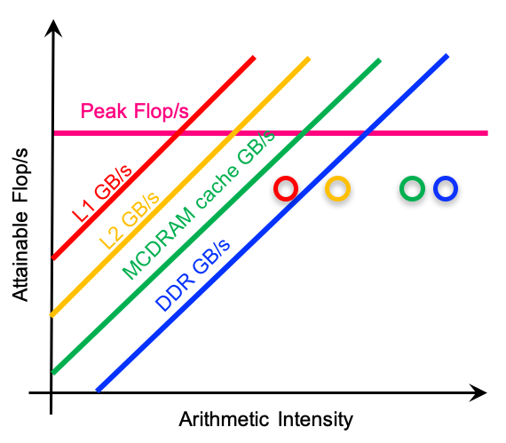
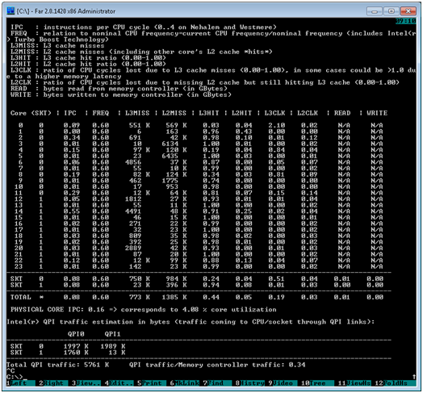

# 07-12 下午：性能分析技术基础（Profiling）

性能分析从一份能稳定复现的运行开始。以 CPU 矩阵乘法为例，先决定计时从哪里开始、到哪里结束，再找出主要耗时的函数或循环，随后才检查计算、内存、线程和 NUMA（non-uniform memory access，非统一内存访问）带来的限制。

热点是占用了较多时间、CPU 周期或其他资源的函数、循环或调用路径。IPC（instructions per cycle，每周期指令数）表示处理器平均每个周期完成多少条指令。FLOP（floating-point operation，浮点运算）表示一次浮点操作；矩阵乘法中的一次乘加通常按两次 FLOP 计。Lab 2 和 Lab 4 的性能报告可以沿用这条从现象到证据的过程。[^nersc-perf]

!!! quote "NERSC 性能工具文档的建议（意译）"

    性能工具用于回答程序把时间花在哪里，以及硬件资源为何没有被充分利用。测量结果需要与源代码、输入和运行配置一起解释。[^nersc-perf]


!!! tip "建议的实验顺序"

    一个最小性能实验可以按以下顺序完成。编译带调试符号的 Release 版本，用固定输入重复运行，用 `perf stat` 观察总体事件，用 `perf record` 找热点，根据访问模式或资源限制提出一个改动，再检查数值结果并报告前后对照。

## 从现象到证据

=== "1. 建立基线"

    固定输入、编译器、线程数和绑定策略，先得到正确结果和重复计时样本。没有基线时，无法判断后续变化来自代码还是机器波动。

=== "2. 找到热点"

    端到端时间说明用户等待多久。采样 profiler 说明时间主要落在哪些函数和循环。热点占比很小的代码不值得先微调。

=== "3. 提出一个可验证的原因"

    查看访问模式、分支、指令依赖、缓存事件、线程等待或 NUMA 数据位置。计数器是线索，需要回到源代码解释。

=== "4. 只改一个因素"

    例如改循环顺序、增加分块、改变线程绑定。改动后用相同输入和统计方法重新测量，并重新检查数值结果。

## 性能测量


性能数据离不开明确的问题。比较两个版本前，先固定输入规模、数据类型、编译器和优化选项、线程数、绑核策略与 NUMA 策略。

还要说明初始化、文件 I/O 和正确性检查是否被计入时间。第一次运行可能包含动态链接、物理页分配、缓存预热或 JIT（just-in-time compilation，即时编译），因此应保留多次运行的数据，并报告中位数以及波动范围。[^benchmark]


### 时间、工作量与统计量

墙钟时间回答“用户等了多久”。对一个 $N\times N$ 的经典矩阵乘法，若实现进行了约 $2N^3$ 次浮点操作，则可报告

$$
\operatorname{GFLOP/s}=\frac{2N^3}{t\times10^9}
$$

这个数需要对应实际执行的算法。若输出从未使用，编译器可能删除核心计算；因此结果仍要经过独立的正确性检查。

非方阵可用 $2MNK$ 计数。带有激活、通信或 I/O 的程序，不能把某个 kernel 的 FLOP 数当作整个流程的端到端吞吐。

```cpp
using clock = std::chrono::steady_clock;
auto start = clock::now();
matmul(a, b, c, m, n, k);
auto stop = clock::now();
double seconds = std::chrono::duration<double>(stop - start).count();
```

计时函数应使用单调时钟。并行程序还要说明 barrier 是否位于计时区间内。

测量用户等待时间时，应让所有参与者完成后再停止计时。测量单个 rank 的局部计算时，则应单独标记，不要把两种时间混在一起。

!!! note "平均值之外还要保留什么"

    共享集群上的运行会受频率变化、其他作业、文件系统与网络负载影响。至少保留原始样本、最小值、中位数和最大值；当数据量足够时可报告分位数。并行作业的端到端时间由最慢的 rank 或线程决定，平均局部时间可能掩盖负载不均和同步等待。

## 性能上限与 Roofline

Roofline 把应用性能放在两个上界之下，计算峰值 $P_{peak}$ 与带宽上界 $I\times B$。算术强度 $I$ 是完成的浮点操作除以从所讨论存储层传输的字节数，$B$ 是该层可持续带宽。

横轴放算术强度，纵轴放实测或可达性能。带宽上界是一条向右上方倾斜的线，计算峰值是一条水平线；两条线连接起来的轮廓像屋顶，模型因此得名。测量点靠近哪一段，就说明该循环更受带宽或计算峰值限制。

$$
P\leq\min(P_{peak},I\times B)
$$

例如，一个循环每从 DRAM 搬运 16 B 只完成 2 FLOP 时，算术强度为 $0.125$ FLOP/B。低 $I$ 会使性能先受内存带宽限制。改变数据复用、减少中间数组和融合算子可以提高算术强度。[^roofline]

下图把这三种位置放在同一坐标中。先看点靠近斜线还是平顶，再看它距离上界还有多少空间。


*Roofline 由带宽与计算两条上界组成。图中的 C 表示实测点远低于上界，应继续检查并行度、依赖、访存延迟或同步。[^roofline]*



*NERSC 的图把不同存储层对应的带宽上界放在同一坐标中。分析时应先确定数据主要从哪一层进入计算单元。[^roofline]*

### 使用 Roofline 时要说明的条件

不要把峰值带宽或峰值 FLOP/s 直接填进图中。应使用与程序访问层级和精度相符的可持续带宽、实际可用的指令峰值，并说明 FLOP 与字节如何统计。一个矩阵块已经留在 L2 时，DRAM Roofline 不能解释它的内层性能；反过来，端到端时间又会包含调度、页分配、I/O 与同步，这些通常不在单一 kernel 的 Roofline 中。

## CPU 利用率与热点

CPU 使用率高不等于程序有效计算多。自旋等待、缓存未命中、分支失预测、锁竞争和频繁系统调用都可能让一个核心处于“忙”的状态。先用采样回答时间集中在哪里，再为热点收集更具体的硬件事件或源代码信息。[^perf-record]

```bash
perf stat -r 5 -- ./solver input.dat
perf record -g -- ./solver input.dat
perf report
```

`perf stat` 汇总一次命令范围内的事件；`perf record` 按周期采样并保存调用栈；`perf report` 用符号和调用路径展示样本。优化构建也应保留 `-g`，否则函数内联、缺少符号和地址重排会降低归因质量。[^perf-stat][^perf-record]


*常用顺序是先用 `stat` 建立整体画像，再用 `record/report` 定位可读的源码区域。`top` 适合观察长时间运行程序的实时变化。[^perf-stat][^perf-record]*

### 从 `perf stat` 到可验证的假设

`perf stat` 中的 `cycles`、`instructions` 与 IPC 可以帮助建立初步假设。IPC 很低可能意味着长依赖链、cache miss、分支或同步等待。IPC 高时，指令数过多、无效工作或频繁访问内存仍可能拖慢端到端时间。cache miss 计数还必须和热点规模、缓存层级、硬件事件定义一起解释。


*先比较同一输入下的 elapsed time、cycles、instructions 与 IPC，再查看能支持假设的事件。计数器名称、权限和可用性因 CPU 与系统配置而异。[^perf-stat]*



*Intel Developer Zone 的图显示不同工具的事件名称和统计范围。读取性能数据前应先确认所用 CPU、权限和计数周期。[^intel-pcm]*

!!! warning "不要从单个计数器直接下结论"

    “cache miss 高，所以要加预取”“IPC 低，所以要向量化”只能作为待验证的线索。先确认事件发生在热点中，阅读该循环的访问步长、分支和数据依赖，再设计一个只改变一个因素的实验。优化后的同一组测量才是对假设的检验。

## 朴素矩阵乘法

令 $A\in\mathbb{R}^{M\times K}$、$B\in\mathbb{R}^{K\times N}$、$C\in\mathbb{R}^{M\times N}$，目标是

$$
C_{ij}\mathrel{+}=\sum_{k=0}^{K-1}A_{ik}B_{kj}
$$

在 C/C++ 的行主序存储中，最后一个下标连续。最直观的 `i-j-k` 循环在内层沿 $k$ 读取 `B[k][j]`，相邻访问相隔一整行；将顺序改为 `i-k-j` 后，内层沿 $j$ 连续读取 `B[k][j]` 并连续更新 `C[i][j]`。

```c
/* C 行主序；A: M×K, B: K×N, C: M×N */
for (int i = 0; i < M; ++i)
  for (int k = 0; k < K; ++k) {
    double aik = A[i*K + k];
    for (int j = 0; j < N; ++j)
      C[i*N + j] += aik * B[k*N + j];
  }
```

这一改动没有减少 $2MNK$ 次浮点操作，却改变了内层的数据供给。`aik` 被提到寄存器中反复使用，`B` 与 `C` 的访问变得连续，因此缓存行和硬件预取器能服务更多乘加。它是理解“算法复杂度不变，性能大幅变化”的基本例子。

## Cache blocking

即使循环顺序合理，$B$ 或 $C$ 足够大时，下一次复用到同一行数据前，它们仍可能已经被逐出缓存。分块将 $M$、$N$、$K$ 三个维度划成 tile，使一个 $A$ tile、一个 $B$ tile 和一个 $C$ tile 在离开缓存前完成更多计算。分块的收益来自减少向慢速层重复搬运的数据量；矩阵乘法的乘加次数保持不变。[^blas]


*以 `double` 为例，64 B 缓存行可装入 8 个元素。连续访问能在后续迭代中使用同一行的多个元素。跨步访问可能每次只用一个元素。缓存行大小以实际 CPU 为准。*

### 分块的边界与验证

下面的结构显示了三个 tile 循环与边界裁剪。它只是正确的起点，尚未包含多级缓存、packing 或寄存器微内核。

```c
for (int ii = 0; ii < M; ii += BM)
  for (int kk = 0; kk < K; kk += BK)
    for (int jj = 0; jj < N; jj += BN)
      for (int i = ii; i < (ii + BM < M ? ii + BM : M); ++i)
        for (int k = kk; k < (kk + BK < K ? kk + BK : K); ++k) {
          double aik = A[i*K + k];
          for (int j = jj; j < (jj + BN < N ? jj + BN : N); ++j)
            C[i*N + j] += aik * B[k*N + j];
        }
```

下面的图把这三层 tile 循环对应到矩阵区域。阅读时先找一个输出 tile，再看它在同一段 $K$ 范围内重复使用哪些 A、B 元素。


*图中每次固定三个 tile 的工作范围。真正的块尺寸还受缓存容量、关联度、元素大小、线程数和微内核形状影响。[^blas]*

三个 $BS\times BS$ 的双精度 tile 仅数据本身就需要约 $3\times BS^2\times8$ 字节，实际还要给其他数据、缓存关联和运行时保留余量。因此块尺寸不能直接取“缓存容量开平方”。从一组保守候选值开始，在目标节点上测量；若用多线程，还要明确 tile 是按线程私有、按 NUMA 域还是在共享缓存中复用。


*分块提高复用依赖数据在下一次使用前仍留在合适层级。不同矩阵规模和线程数的收益需要实测。*

## 自动向量化与查看生成代码

编译器只有在能证明循环迭代间没有不安全依赖、指针别名与控制流满足要求时，才会自动生成 SIMD 指令。GCC 的优化报告能说明已向量化的循环和常见阻碍；反汇编用于确认目标 ISA，而不是替代计时。[^gcc-vector]

```bash
gcc -O3 -march=native -g \
  -fopt-info-vec-optimized -fopt-info-vec-missed \
  gemm.c -o gemm
objdump -d -Mintel ./gemm | less
```

报告中的 “possible aliasing” 应促使你检查指针是否真的可能重叠；只有在调用约定保证不重叠时才可以使用 `restrict`。报告中的 loop-carried dependency 则表示要改变算法、使用归约或分块，不能强行用 pragma 掩盖依赖。向量化也会改变浮点归约顺序，正确性比较应采用题目允许的绝对/相对误差。

### AVX-512 微内核

一个微内核通常让少量 $C$ 元素长时间留在寄存器中。以图中的 $4\times16$ 双精度输出 tile 为例，4 行 ZMM（AVX-512 的 512 位向量寄存器）累加器保存 $C$ 的部分结果；每次从 packed $B$ 面板加载向量，把一个 $A$ 标量广播后执行 FMA（Fused Multiply-Add，融合乘加）。这样的设计提高 $A$、$B$ 的寄存器级复用，但同时受寄存器数量、加载端口、指令延迟与目标 ISA 限制。[^intel-intrinsics]


*微内核展示高性能 GEMM（general matrix multiplication，通用矩阵乘法）中的 packing、向量寄存器和固定 tile。它依赖 AVX-512。[^intel-intrinsics]*

手写 intrinsic 之前先保留可验证的标量或自动向量化版本。生产环境中，BLAS 库已经将架构检测、packing、多级分块和微内核结合起来；除非 Lab 明确要求，调用库通常是更可靠的基线。[^blas]

## 多线程与内存流量

增加线程数会增加可用计算资源，却不能无限增加 DRAM 带宽。STREAM 基准专门以简单数组操作测量可持续内存带宽；这类流式循环往往在少数核心后饱和。若线程数继续增加而总带宽不再上升，单线程时间变慢并不表示线程失效，而是所有线程正在争用同一带宽资源。[^stream]

```bash
for t in 1 2 4 8 16; do
  OMP_NUM_THREADS=$t OMP_PROC_BIND=close ./solver input.dat
done
```

记录每个线程数的总时间、总 GFLOP/s 与每线程吞吐。对矩阵乘法，正确分块可增加算术强度，因此其缩放曲线可能与纯数组 copy 不同；对归约，还要把 barrier、原子操作和 false sharing 计入解释。

## NUMA 的测量与绑定

多插槽服务器将内存分为多个 NUMA 节点。线程访问本地节点内存通常比远端访问更快；Linux 的 first-touch 策略常使第一次写入页面的线程影响其物理放置。一个主线程串行初始化大数组后，其他插槽线程可能长期访问远端页。[^numa]

```bash
numactl --hardware
numactl --cpunodebind=0 --membind=0 ./solver
```

先用 `numactl --hardware` 了解节点数与距离，再比较默认放置、CPU 绑定和内存绑定。更常用的应用级策略是让每个线程初始化并处理自己的数据块；强行把整个进程绑定到一个节点只适用于工作集和线程数确实都放得下的情况。


*NUMA 性能差异来自数据位置与执行位置的组合。线程绑核与 first-touch 应一起考虑。[^numa]*

## 计时边界与统计量

计时边界取决于要回答的问题。优化单个 kernel 时，先完成输入准备与预热，再在相同 stream、相同线程团队或相同 MPI 分配中计时。若要优化整体体验，读取、传输、同步、输出和检查点都应纳入端到端时间。GPU kernel 可使用 CUDA event；MPI 程序可用 `MPI_Wtime`，并说明计时是否在 barrier 后开始。

建立一个最小结果表，避免只保留结论。

| 版本 | 输入与资源 | 正确性 | 中位时间 | 关键证据 |
| --- | --- | --- | ---: | --- |
| baseline | `N=4096`, 1 thread | reference match | … | 热点与 IPC |
| loop-order | 同上 | reference match | … | 连续访问 B/C |
| blocked | 同上 | reference match | … | 周期、cache 事件、块尺寸 |

## 从事件到循环

一条完整的性能结论要能回到代码。它应说明哪个函数占时最多，循环怎样访问数据或同步，哪项事件支持这一判断，改动具体改变了什么，以及改动后的时间和正确性。无法对应到具体循环的计数器只能算待验证的线索。


*优化步骤的顺序由瓶颈决定。先改善数据局部性，再提高向量和线程利用率，是该矩阵乘法案例的测量结果。*

### 可复查的性能实验

建议将实验记录为可直接执行的脚本与原始输出。

```text
README.md          输入、机器、正确性准则与结论范围
build.sh            编译器、模块、优化选项
run.sh              固定的线程、绑核、NUMA 和重复次数
baseline/           原始 stdout、perf 输出、profile
variant-*/          一次可说明的改动及同格式结果
```

!!! question "把现象写成假设"

    `ijk` 矩阵乘法的总时间很长，`perf stat` 显示 IPC 较低。下一步最合适的动作是什么？

    ??? tip "详细答案"

        先确认热点是否确实位于三重循环，再检查 `B[k][j]` 的访问方向。对 C 行主序数组，固定 `j`、递增 `k` 会跨行访问 B；每一步可能带来新的缓存行，CPU 会等待数据。

        可以只把循环顺序改为 `ikj`。

        ```c
        for (int i = 0; i < m; ++i)
          for (int k = 0; k < kdim; ++k) {
            double aik = A[i*kdim + k];
            for (int j = 0; j < n; ++j)
              C[i*n + j] += aik * B[k*n + j];
          }
        ```

        这项改动不改变矩阵乘法的数学结果，只改变内层访问 B 与 C 的方向。随后使用相同输入、编译选项、线程配置和正确性检查重新测量。若 IPC 上升、时间下降、结果仍在误差容限内，才有证据支持访问局部性是主要限制。

[^intel-pcm]: Intel, *Performance Counter Monitor*, <https://www.intel.com/content/www/us/en/developer/articles/tool/performance-counter-monitor.html>.
[^nersc-perf]: NERSC, *Performance Tools*, <https://docs.nersc.gov/tools/performance/>.
[^benchmark]: Google, *Benchmark library user guide*, <https://github.com/google/benchmark>.
[^roofline]: NERSC, *Roofline Performance Model*, <https://docs.nersc.gov/tools/performance/roofline/>.
[^perf-stat]: Linux man-pages, *perf-stat(1)*, <https://man7.org/linux/man-pages/man1/perf-stat.1.html>.
[^perf-record]: Linux man-pages, *perf-record(1)*, <https://man7.org/linux/man-pages/man1/perf-record.1.html>.
[^blas]: Netlib, *BLAS*, <https://www.netlib.org/blas/>.
[^gcc-vector]: GCC, *Optimize Options*, <https://gcc.gnu.org/onlinedocs/gcc/Optimize-Options.html>.
[^intel-intrinsics]: Intel, *Intrinsics Guide*, <https://www.intel.com/content/www/us/en/docs/intrinsics-guide/index.html>.
[^stream]: University of Virginia, *STREAM Benchmark*, <https://www.cs.virginia.edu/stream/>.
[^numa]: Linux Kernel Documentation, *NUMA Memory Policy*, <https://docs.kernel.org/admin-guide/mm/numa_memory_policy.html>.
