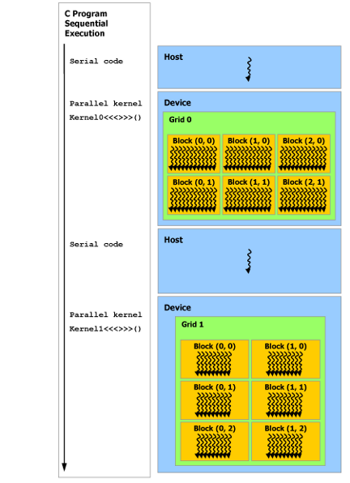
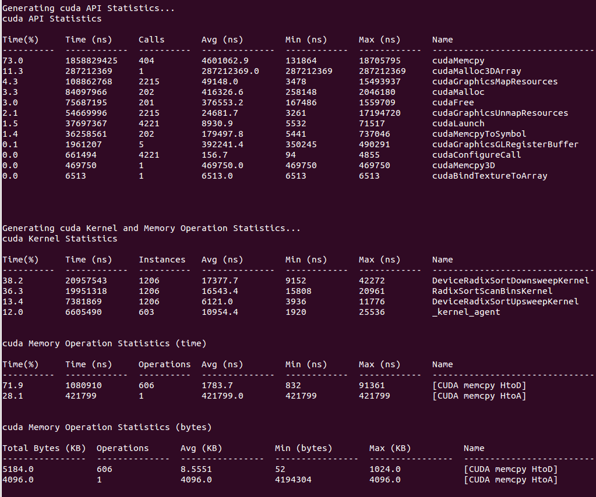

# 07-13 上午 高性能计算高级话题

异构程序同时使用 CPU 和 GPU。CPU 擅长复杂控制、缓存访问和需要较快响应的任务。GPU 擅长把大量规则、彼此相似的计算同时分给很多线程。这里的 GPU 编程通常通过 CUDA（Compute Unified Device Architecture，统一计算设备架构）完成。程序的算法、数据位置、通信方式和硬件资源需要相互匹配。[^cuda-guide]


## 从 CPU 到 GPU 的数据路径

=== "1. CPU 准备任务"

    CPU 读取输入、组织控制流、准备内核（kernel）参数、提交任务并处理 I/O。任务规模很小、分支很多或需要频繁访问操作系统服务时，CPU 往往承担主要工作。

=== "2. GPU 执行规则计算"

    GPU 将大量相似工作分给线程和 warp。warp 是 CUDA 中硬件调度的一组线程，通常包含 32 个线程；它们按 SIMT（Single Instruction, Multiple Threads，单指令多线程）方式推进。每个线程负责一个元素或一小块输出。许多处于就绪状态的 warp 可以交替执行，从而等待内存的 warp 不会立刻让整个 SM 空闲。

=== "3. 数据留在设备侧"

    数组从主机传到 GPU 后，连续执行多个 kernel 可以减少往返传输。中间张量频繁回到 CPU 会增加 PCIe/NVLink 传输和同步时间。

=== "4. 用时间线检查"

    Nsight Systems 显示 CPU、复制、GPU kernel 和同步的时间线。Nsight Compute 用于查看热点 kernel 的访存、Tensor Core、寄存器和占用率。

## HPC 应用

HPC 应用通常具有可明确描述的计算、数据和时间约束，并需要在可接受时间内得到可信结果。天气与气候模拟在网格上反复更新状态，科学计算需要在给定误差内求解离散方程，深度学习训练与推理则反复执行矩阵乘加、归约和通信。它们都需要把问题拆为可并行的局部工作，同时控制边界交换、I/O、检查点和数值误差。

判断一个应用为什么需要加速时，可以先记录下表中的信息。

| 问题 | 需要量化的对象 | 常见系统瓶颈 |
| --- | --- | --- |
| 稠密线性代数 | 矩阵形状、精度、FLOP 数 | 计算吞吐、显存带宽 |
| stencil / 网格模拟 | 网格规模、邻居交换频率 | 内存带宽、MPI halo 通信 |
| 稀疏/不规则计算 | 非零元分布、访问随机性 | 访存延迟、负载不均 |
| 大模型训练 | 参数、激活、batch、并行策略 | 显存、通信、算子吞吐 |
| 大模型推理 | 上下文长度、并发请求、KV cache | 显存容量、带宽、调度 |

这张表把性能问题放回具体的数据规模和数据流中。模型的 Tensor Core 矩阵乘法可能很快，输入管线、all-reduce、KV cache 或检查点仍会拉长总时间。数值程序的浮点峰值很高时，边界通信也可能限制整体速度。

??? info "表中几个常见术语"

    - **GEMM** 是一般矩阵乘法，常写作 $C=AB+C$。深度学习中的线性层和注意力投影经常归结为这类计算。
    - **Tensor Core** 是 GPU 中执行特定低精度矩阵乘加的硬件单元。是否使用它取决于数据类型、矩阵形状和库调用路径。
    - **all-reduce** 是多张 GPU 共同参与的集合通信。它把各卡上的同形张量做求和或平均等规约，再将相同结果交给每张卡。
    - **KV cache** 是语言模型推理时按层保存历史 key/value 的缓存。它减少重复计算，也会占用显存和读取带宽。
    - **stencil** 是网格上按邻近点更新一个格点的计算。多节点切分网格后，边界附近需要交换邻居数据，这段数据通常称为 halo。

## 应用、系统与硬件

从数学表达走到硬件执行，通常会经过算法、框架或应用代码、编译器与库、运行时、通信与存储、设备驱动和硬件。每一层都可能改变数据布局和执行顺序。优化时应说明改动所在的层次。例如，改变分块大小（tile）属于算法或内核映射，启用 cuBLAS 属于库选择，调整 batch 属于应用调度，减少 all-reduce 次数属于并行算法。

!!! note "端到端时间的组成"

    对一次训练或推理步骤，分别记录主机准备时间、host-device 复制、各类 kernel、设备间通信、同步等待以及输出或检查点时间。把它们放到同一条时间线上，才能判断应继续优化 kernel、调整并行策略，还是修改数据管线。[^nsys]


*Nsight Systems 将 CPU、GPU 和设备指标放到同一时间轴上。时间重叠、空洞和带宽高峰应结合程序依赖关系解释。[^nsys]*

## CPU 的低延迟设计

CPU 将大量晶体管用于复杂控制。延迟是一次操作从发出到结果可用所需的时间。吞吐量是单位时间完成的工作量。CPU 依靠分支预测、乱序执行、寄存器重命名、多级缓存和宽发射流水线，在一条或少量指令流中尽早发现可执行指令，减小依赖、分支和缓存缺失对单线程响应时间的影响。CPU 也能通过 SIMD 和多核取得较高吞吐量，但设计重点仍是复杂控制和较强的单线程表现。[^intel-opt]

因此，CPU 常用于解析输入、处理不规则控制流、组织 I/O、发起通信和运行分支复杂的任务。大型 CPU GEMM、数值模拟和 SIMD kernel 同样可以获得较高性能，只是更依赖数据局部性与向量化策略。

## 存储层次与性能

算术单元能否持续工作，取决于数据是否及时到达。GPU 的寄存器和共享内存（shared memory）容量较小，位置靠近计算单元。L1/L2 缓存由硬件管理或部分共享。HBM（High Bandwidth Memory，高带宽内存）和 GDDR（Graphics Double Data Rate，图形双倍数据率显存）容量大、带宽高，访问延迟仍高于寄存器。主机内存和持久存储距离更远，跨设备传输还要经过互连和运行时调用。[^cuda-guide]

| 层级 | 常见作用域 | 典型用途 | 优化时首先问什么 |
| --- | --- | --- | --- |
| 寄存器 | 单线程 | 标量、局部累加器 | 是否发生溢出（spill）到 local memory |
| shared memory | 单个 block | 可复用 tile、线程协作 | 是否真的有 block 内复用，是否有 bank conflict |
| L1/L2 cache | 由硬件管理 | 重复的 global-memory 访问 | 工作集和访问步长是否友好 |
| global memory | 整个 GPU | 大张量、输入输出 | warp 访问是否合并，流量是否过大 |
| host memory / storage | CPU 或持久层 | 数据集、检查点、offload | 传输是否处在关键路径 |

使用 shared memory 会引入协作加载、同步和资源占用。若一个元素只被一个线程读取一次，直接从 global memory 的缓存路径读取可能更合适。先计算复用次数和访问模式，再决定是否显式分块。

## CPU 与 GPU 的取舍

选择设备时同时看并行规模、控制流、算术强度（完成的浮点操作数除以从某一存储层传输的字节数）、数据是否已在设备端、内存容量以及开发和维护成本。很小且只执行一次的分支密集任务，可能被 launch 和数据传输开销主导。大批量、规则的张量运算可以用 GPU 的大量 warp 隐藏访存延迟。


*图中展示 CPU/GPU 的设计取向，解释吞吐与控制能力的侧重差别。[^cuda-guide]*

选择 GPU 路径时，可以按以下顺序检查。

1. 测量 CPU 或框架基线。
2. 确认数据规模和并行结构足够大。
3. 尽量让连续步骤留在 device。
4. 用端到端时间判断 GPU 路径是否值得维护。

性能报告还应包含准备、复制和同步时间，而不只列出某个 kernel 的时间。

## GPU 的高吞吐设计

GPU 由多个流式多处理器（SM，Streaming Multiprocessor）组成。SM 是驻留 block、调度 warp 并执行指令的硬件单元。一个 block 在运行期间驻留在一个 SM 内，block 内线程再被划分为 warp。SM 能在许多就绪 warp 之间切换。某个 warp 等待 global memory 时，另一个已经具备操作数的 warp 可以继续发射指令。这种切换有助于覆盖内存访问等待时间，提高吞吐量。[^cuda-guide]

GPU 通过足够多的独立工作，使大量 warp 有机会同时处于就绪状态。长依赖链、同步点、寄存器过多或 shared memory 过大都会减少这种机会。

## SIMD、SPMD、SIMT 与 warp

SIMD（Single Instruction, Multiple Data，单指令多数据）表示一条指令操作多个数据 lane。SPMD（Single Program, Multiple Data，单程序多数据）表示多个执行实例运行同一程序、处理不同数据。CUDA 的 SIMT（Single Instruction, Multiple Threads，单指令多线程）模型让程序员以线程形式书写 SPMD 代码，硬件再以 warp 为单位组织执行。区分这三个概念有助于理解下列现象。

- 写了许多 CUDA thread 后，warp 内的分支路径仍会按硬件规则交错推进。
- warp 的 SIMT 执行允许不同线程访问不同地址。相邻线程访问连续地址时，global memory 更容易合并。

当 warp 内线程走不同分支时，硬件需要分别完成各路径，未参与当前路径的线程暂时被屏蔽。对热点中的强分歧，可按类别重排输入、改变线程到数据的映射，或用掩码表达少量条件。[^cuda-guide]

## GPU 的延迟隐藏

GPU 会利用其他就绪 warp 来覆盖等待时间。一个 warp 的 global-memory 请求尚未返回时，SM 可以选择另一个就绪 warp。若没有其他就绪 warp，SM 仍会空转。可用并行度受输入规模、block 数、每线程寄存器、每 block shared memory、指令依赖和同步共同限制。[^cuda-best]

占用率（occupancy）是活跃 warp 占硬件上限的比例。它用于判断 SM 是否有足够候选 warp 来安排。缩小寄存器 tile 或强制限制寄存器数有时会提高占用率，也可能让累加器溢出到 local memory，最终降低性能。分析时应同时查看寄存器报告、活跃 warp、内存吞吐和实际 kernel 时间。[^ncu]

### 一个资源预算例子

设一个 SM 在硬件限制下可以容纳一定数量的线程、warp、block、寄存器和 shared memory。block 有 256 线程时，线程上限也许允许多个 block 同驻留。每线程寄存器数翻倍，或每 block 申请更多 shared memory 时，实际可驻留 block 数就会下降。不同 GPU 的具体上限应以设备属性和 profiler 报告为准。


*图：这是特定一代 GPU 的 SM 布局示意。阅读图时关注资源共享关系，不要把图中的单元数量套用到其他架构。[^cuda-guide]*

## 地址、布局与设备传输

global memory 的访问应尽量让一个 warp 内相邻线程读取相邻、对齐的元素。行主序张量中，`threadIdx.x` 对应连续列时，通常有利于合并访问。它对应跨大步长的行或通道时，内存事务会增加。张量视图、stride、padding 和布局变换都会改变这一判断，因此应从实际地址公式推导。[^cuda-best]

```text
连续映射。thread t -> x[base + t]
跨步映射。thread t -> x[base + stride * t]
```

host 与 device 有不同的地址空间和内存容量。host-device 复制的开销包含互连传输、队列依赖与可能的同步。把一批输入上传后在 device 上连续执行多个算子，通常比每个算子后回传中间结果更合理。

## CPU 与 GPU 的分工边界

host 端负责读取数据、准备元数据、分配资源、提交 kernel、组织 stream、处理 I/O 和部分控制逻辑。device 端负责大规模数据并行计算。部分预处理可以批量放到 GPU，稀疏或动态控制可以留在 CPU。数据流设计应尽量减少关键路径上的往返和等待。[^nsys]



*图中展示 host 和 device 的编程边界。kernel launch 是否阻塞 host，以及复制和计算能否重叠，要用 CUDA event、Nsight Systems 或程序依赖分析确认。[^cuda-guide][^nsys]*

### 先画数据流，再写 kernel

为每个输入、输出和中间张量记录下列信息。

- 所在位置，例如 host 或 device
- 字节数
- 生产者和消费者
- 是否跨设备传输
- 是否需要等待结果

若中间张量只供下一 GPU 算子使用，应优先考察设备端复用或融合。下一步控制流若依赖某个 GPU 结果，相应同步点就属于关键路径，也应写入性能报告。

NVIDIA Nsight Systems 也可按 CUDA API、kernel 和内存操作汇总耗时与调用次数。汇总视图适合找出频繁的小调用或传输时间占比，再回到时间线确认它们是否处在关键路径。[^nsys]



*汇总表适合比较调用次数和累计时间。具体的等待关系、重叠与同步位置仍应回到时间线查看。[^nsys]*

## 线程层次与硬件资源

grid 可以包含远多于硬件同时容纳的 block。一个 block 完成后，调度器会安排后续 block。因此，不同 block 的执行顺序和是否并发都没有编程模型保证。普通 `__syncthreads()` 仅作用于一个 block。跨 block 的依赖通常需要拆分 kernel、使用原子或归约算法，或采用带有明确约束的协作机制。[^cuda-guide]

选择 block 大小时，先保证算法正确，让线程数成为 warp 大小的倍数，并为每个 block 提供足够工作。随后观察寄存器、shared memory、warp 数和边界浪费。矩阵 tile、数据类型、设备架构以及一个线程负责的输出数量都会改变合适的配置。

## 算术强度与 GPU Roofline

GPU Roofline 同样使用

$$
P\leq\min(P_{peak},I\times B)
$$

其中 $P_{peak}$ 可以对应 CUDA core 或 Tensor Core 的可用计算峰值，$B$ 对应所讨论层级的可持续带宽，$I$ 是算术强度。逐元素 `y=f(x)` 每搬运一个元素只做少量运算，常受 HBM 带宽限制。GEMM 通过复用 A/B tile，让同一份数据参与许多 FMA，因而可能靠近计算上限。[^roofline][^ncu]

融合逐元素算子经常能减少一次中间张量写回和下一算子的重新读取，从而降低 global-memory 字节数。即使 FLOP 数几乎不变，程序也可能更快。计算受限的矩阵乘法则更关心 Tensor Core 路径、寄存器 tile 和指令流水。实测点远低于两个上界时，应先检查问题规模、warp 并发、同步、依赖和主机侧空洞。

!!! question "设备选择自测"

    一个任务只有数千个元素，分支复杂，输入刚从磁盘读到 host，并且结果只使用一次。为什么它未必值得单独迁移到 GPU？

    ??? tip "详细答案"

        这个任务的 GPU 端到端时间包括主机准备、主机到设备复制、kernel launch、kernel 执行、同步和结果回传。元素数量较少时，固定开销可能超过实际计算时间。分支复杂时，同一 warp 中的线程还可能走不同路径，降低有效并行度。

        首先测 CPU 端到端基线，再分别测传输时间和 kernel 时间。若它是更长 GPU 流程中的一步，可以评估把多个输入组成 batch、与相邻算子融合、或让数据持续留在 device 是否能摊薄固定开销。若它只执行一次且结果立即回到 host，CPU 路径往往更简单也更稳定。

[^cuda-guide]: NVIDIA, *CUDA C++ Programming Guide*, <https://docs.nvidia.com/cuda/cuda-c-programming-guide/>.
[^intel-opt]: Intel, *Intel® 64 and IA-32 Architectures Optimization Reference Manual*, <https://www.intel.com/content/www/us/en/developer/articles/technical/intel-sdm.html>.
[^cuda-best]: NVIDIA, *CUDA C++ Best Practices Guide*, <https://docs.nvidia.com/cuda/cuda-c-best-practices-guide/>.
[^ncu]: NVIDIA, *Nsight Compute Profiling Guide*, <https://docs.nvidia.com/nsight-compute/ProfilingGuide/index.html>.
[^nsys]: NVIDIA, *Nsight Systems User Guide*, <https://docs.nvidia.com/nsight-systems/UserGuide/index.html>.
[^roofline]: NERSC, *Roofline Performance Model*, <https://docs.nersc.gov/tools/performance/roofline/>.
