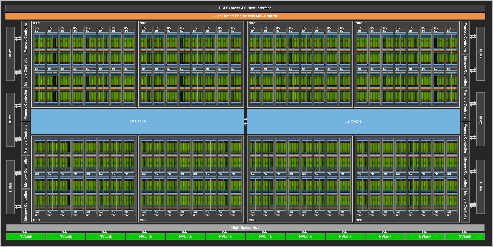
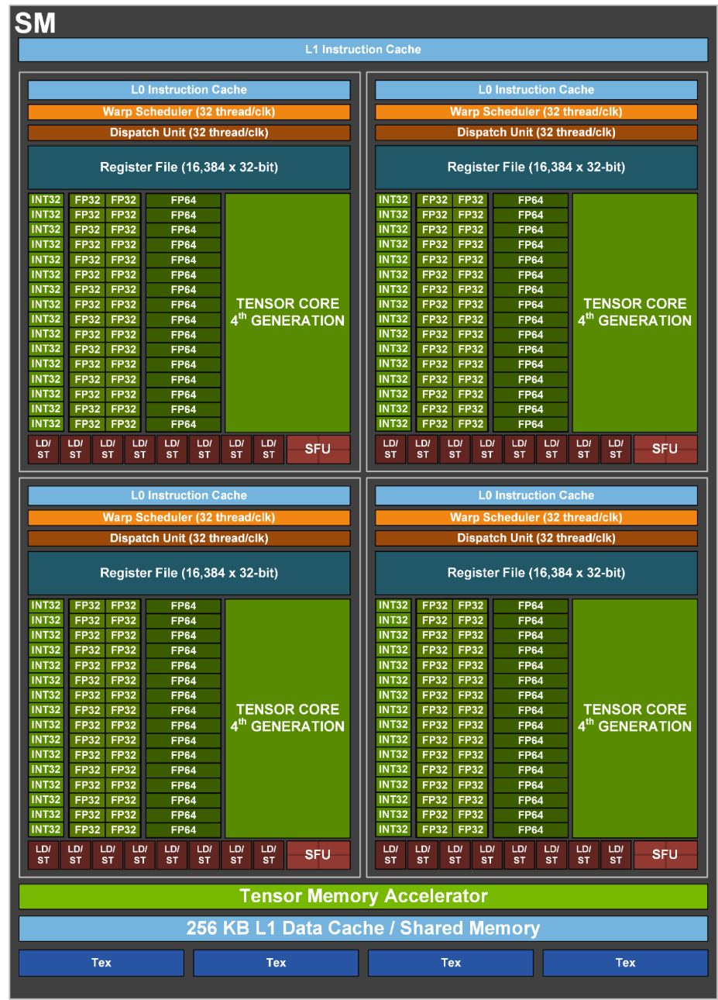
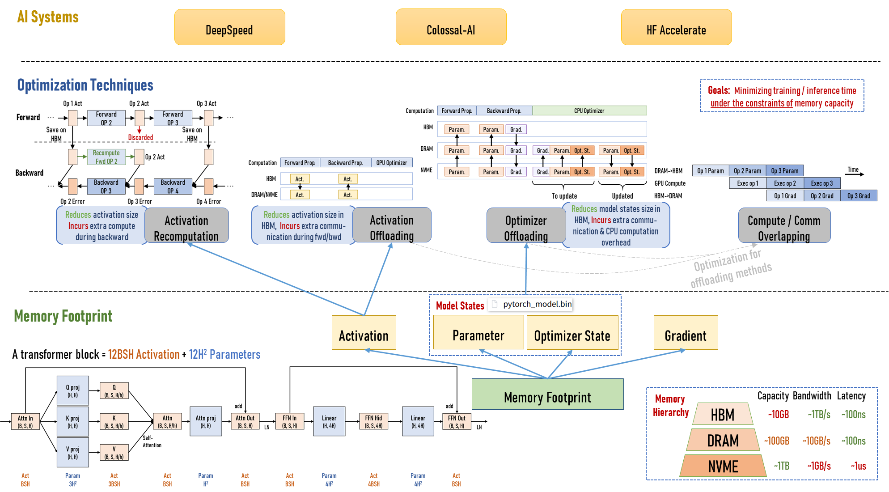
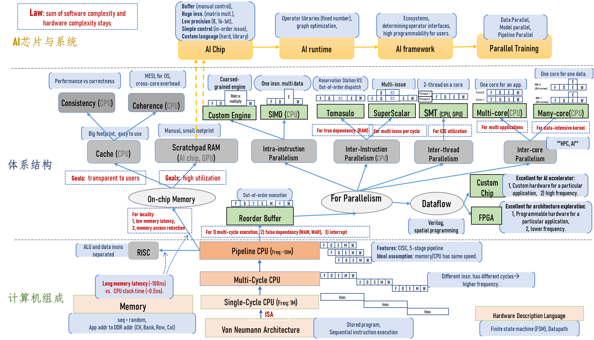
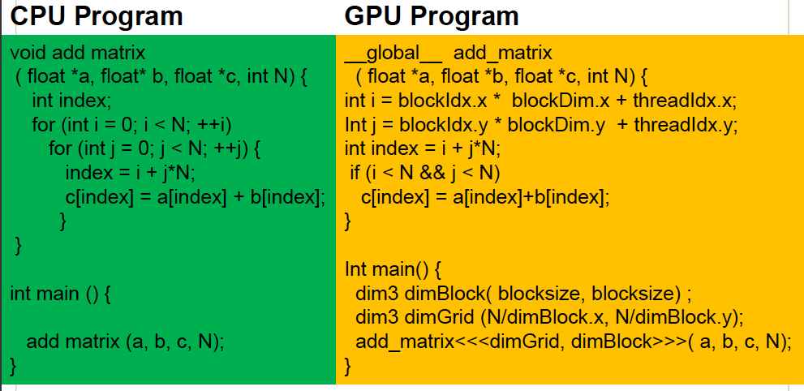

# 07-13 上午：高性能计算高级话题

一个模型算子从框架表达走到设备执行，会经过运行时、编译器、库、内存和硬件调度。GPU 的价值在于能同时推进大量结构相似的工作；依赖链、随机访问和频繁 CPU 往返仍会限制它。

## HPC 应用

HPC 把原本无法在可接受时间内完成的计算，变成可以支持决策或研究的结果。课程给出的例子都指向同一个目的：把可用的算力转化为更及时的判断。

- **天气预报**：在离散网格上反复求解大气方程。日常“下不下小雨”预测偏一点影响有限；台风路径、登陆时间和强度预测偏一点，后面的转移、停工、救援安排可能完全不同。高性能计算提供的是更高时空分辨率、更频繁的同化与更及时的预报。
- **分子动力学与材料/药物模拟**：过去需要从海量候选中逐一做实验；算力足够时，可以先在模型中模拟原子或分子的相互作用，筛出少数值得做湿实验的候选。仿真不能取代实验，但能把实验资源集中到更有希望的地方。
- **量子系统与大规模模型**：量子系统模拟、大模型训练和推理都把“问题规模”推到了单机难以承担的程度。

一个 HPC 系统通常同时包含计算芯片、内存和存储、节点内外互连、运行时与通信库、编译器和框架，还需考虑供电和散热。高端 GPU 的功耗已达数百瓦甚至接近千瓦；把多块卡装进一个节点后，供电、散热和机房设计都会成为系统约束。性能由这些环节共同决定，芯片只是其中一环。

## 应用、系统与硬件

同一个 AI 任务可以从不同层面优化。算法层决定模型结构、训练目标和数据；框架层把模型表达为算子图；运行时负责调度、内存和通信；编译器与库把算子变成具体 kernel；最后才由 GPU、CPU、内存和网络执行。任何一层成为瓶颈，其他层做得再好也无法把端到端时间降下来。

训练时，参数、梯度和激活常分散在各处。部分状态在 GPU 高带宽内存中参与前向和反向，优化器状态或不常用数据可能在主机内存中；每一次移动都要花时间。于是“显存够不够”“带宽够不够”“一个 kernel 算得快不快”相互牵连，需要一起看。

## CPU 的低延迟设计

通用 CPU 的首要目标是低延迟地执行复杂、分支多、数据访问难以预测的程序。它需要强大的控制逻辑：取指、译码、分支预测、乱序执行、缓存层次、寄存器重命名等。一个核心能把单条指令流跑得很快，但这些控制部件占用了大量晶体管和功耗。

流水线是理解 CPU 的第一步。把一条指令分成取指、译码、执行、访存、写回等阶段后，不同指令可同时处在不同阶段。这样提升的是吞吐，不是让单条指令瞬间完成。若后续指令依赖前一条的结果，或分支预测错误，流水线就要等待或清空。

CPU 会继续挖掘指令级并行：超标量处理器可在一个周期发射多条独立指令；乱序执行会在不改变程序可见结果的前提下，先执行准备好的指令；多级 cache 尽量避免主存访问把核心停住。它们非常适合控制密集、依赖复杂、工作量不规则的代码，但实现成本也高。

GPU 采取了另一种取舍：把晶体管优先用于大量更简单的计算单元，让大量相同结构的线程同时工作。当一批线程在等内存时，硬件切换到另一批就绪线程。它偏向吞吐量，而非单线程延迟。

一块 GPU 一般比一块 CPU 更适合规则的大规模数值计算、图像处理和矩阵乘法；串行控制逻辑、复杂分支、任务调度、操作系统与 I/O 管理则更适合 CPU。异构计算的通常模式是 CPU 负责控制和提交任务，GPU 执行计算密集的 kernel。

## 存储层次与性能

算术单元快，程序仍可能因为取不到数据而跑不快。离计算单元越近的存储通常越小、越快、单位容量越贵；越远则容量越大、延迟越高。可以粗略分成寄存器、片上缓存/共享内存、显存（HBM/GDDR）、主机内存和 SSD。程序若反复从慢层取数据，计算单元就会闲着等待。

GPU 既有大量寄存器，也有每个 SM 可共享的 shared memory、片上 L1/L2 cache 和板级显存。寄存器最快但只属于一个线程；shared memory 由同一 thread block 的线程显式协作使用；global memory 对整个 GPU 可见，容量大但访问代价高。优化矩阵乘法时把输入块放进 shared memory，正是为了让同一块数据被许多线程复用，减少对 global memory 的重复读取。

主机内存和 GPU 显存之间通常经 PCIe 或更高速的互连传输。一次频繁的 CPU-GPU 往返很容易吞掉 kernel 加速带来的收益，所以常见原则是：把数据一次搬到 device，连续运行多个 kernel，最后再搬回结果；当然，能否这样做取决于算法的依赖关系和显存容量。

## GPU 的高吞吐设计

GPU 由许多个 Streaming Multiprocessor（SM）组成。一个 SM 内有大量标量运算单元、寄存器文件、load/store 单元、共享内存和专门的矩阵计算单元。不同架构的具体数量会变，但思路稳定：同时保留许多可运行线程，用大量并行算术去覆盖存储访问的等待。



*图：计算单元不是孤立的峰值数字；host 接口、全局调度和 HBM 决定数据如何到达各个 SM。*

在现代 AI GPU 上，普通 CUDA core 可做常规标量/向量运算，Tensor Core 则面向小矩阵乘加，例如 $D=A\times B+C$。深度学习中的 GEMM、卷积和 attention 经过分块后，能大量调用这种矩阵单元，因此低精度矩阵吞吐远高于一般 CPU 的单核算力。



*图：同一 SM 内的 warp 共享执行管线、寄存器文件和片上存储，资源用量会限制同时驻留的工作。*

低精度不是把数值随便截短。FP32 有较大的指数和尾数范围；FP16、BF16、FP8 等格式以更少位数换取更低内存流量和更高矩阵吞吐。训练通常会在速度与数值稳定性之间混合使用多种精度，例如低精度前向/反向、较高精度累积或主权重。格式选择应由误差容忍度、硬件指令和实际测量共同决定。

## SIMD、SPMD、SIMT 与 warp

这些缩写都和“同时做很多相近事情”有关，却不是同一个概念。

- **SIMD**（single instruction, multiple data）指一条向量指令同时处理多个数据元素，常见于 CPU 向量扩展。
- **SPMD**（single program, multiple data）指许多逻辑线程运行同一段程序、处理不同数据；CUDA kernel 在编程模型上是 SPMD。
- **SIMT**（single instruction, multiple threads）是 NVIDIA GPU 的硬件执行抽象：硬件把线程组成固定宽度的 warp，并让 warp 中活跃线程大体锁步执行同一条指令流。

CUDA 中线程按 `thread`、`block`、`grid` 组织。一个 kernel launch 启动一个 grid；grid 中有多个 block；block 中有多个 thread。同一 block 的线程可以借助 shared memory 协作并同步，不同 block 通常要独立完成，因而可被调度到不同 SM。block 数量通常远大于 SM 数量，硬件会在一个 block 完成后继续调度下一个。

例如二维矩阵中，一个线程可用

```cpp
int i = blockIdx.x * blockDim.x + threadIdx.x;
int j = blockIdx.y * blockDim.y + threadIdx.y;
if (i < N && j < N) {
    C[i + j * N] = A[i + j * N] + B[i + j * N];
}
```

确定自己负责的元素。`blockIdx` 与 `threadIdx` 不是普通变量，而是 CUDA 提供的内建索引。边界判断不能省：为了方便把 grid 向上取整时，最边缘 block 的一部分线程会落在有效矩阵外。

warp 是调度和执行时更关键的粒度。通常一个 warp 有 32 个线程；同一 warp 遇到 `if/else` 的不同分支时，硬件往往要分别执行两条路径，并屏蔽不属于当前路径的线程。这叫分支发散。发散并非语法错误，但会降低该 warp 的有效并行度；按数据布局和任务划分让同一 warp 内线程走相同分支，是 GPU 编程的常见考虑。

## GPU 的延迟隐藏

GPU 核心并不靠把单个标量指令的延迟压到极低来获得吞吐。一个 SM 同时驻留许多 warp；某个 warp 等待 global memory 时，warp scheduler 立刻挑选另一个已就绪 warp 发射指令。要有足够多的可驻留 warp，称为 occupancy；它受每个 block 的线程数、寄存器使用量、shared memory 用量和硬件上限共同约束。occupancy 高只说明有更多可切换工作，若算术单元或 DRAM 带宽已饱和，继续提高它未必更快。

课件老师用过一个很生活化的比喻：GPU 的调度颗粒度从来没有落到“一个线程个人”，而是一条 warp，就像大学里很多活动是按班级、按寝室 🎒 整体安排的，而不是逐个同学单独处理。写 CUDA 时你只需要“感觉到每个线程大概在干什么”，调度和优化的粒度交给硬件以 warp 为单位处理。这也是为什么编 CUDA 常常比手写 CPU 的 SIMD intrinsic 轻松——你不必记一堆指令，只需把循环拆到每个 thread。

线程束中的控制流也有成本。warp 的 32 个线程遇到不同 `if` 分支时，硬件通常分路径依次执行，再以 mask 禁用暂不活跃的线程；这就是 divergence。边界检查造成的少量分歧通常可接受，按随机类别把同一 warp 分到完全不同的大分支则会明显损失吞吐。重排数据、按类别分桶或把分支变成掩码运算，需要与重排开销一并测量。

## 地址、布局与设备传输

CPU 端数组指针不能被普通 GPU kernel 直接解引用。通常要分配 device memory，再把输入从 host 拷贝到 device，启动 kernel，把结果拷回；统一虚拟地址让指针形式看起来相近，数据是否已迁移、能否被该设备直接访问仍是运行时问题。离散 GPU 上 PCIe/NVLink 的传输比 device DRAM 访问慢得多，反复在每个小 kernel 前后复制数据会淹没计算收益。

因此异构程序应把连续的 GPU 工作围在同一段设备驻留期内：输入一次上传，若干 kernel 在 device 上消费和产生中间张量，最后下载需要的输出。逐元素操作融合为一个 kernel、量化权重留在显存并与反量化 GEMM 融合，都会减少往返和中间全局内存流量。数据传输能和计算重叠的前提是独立 buffer、异步 copy、非默认 stream 以及足够的硬件 copy engine；不满足依赖时强行异步只会读到未完成的数据。



*图：输入从 CPU 端上传，kernel 在 GPU 侧消费并产生中间张量，结果再回落主机；传输路径与计算路径共同决定端到端时间。*

## CPU 与 GPU 的分工边界

GPU 擅长规则、大批量、相同指令的吞吐任务；CPU 更适合控制流复杂、规模小、需要低延迟响应或需要与操作系统频繁交互的部分。这个划分由数据规模和依赖决定，而不是由语言决定。一个只有几百个元素的 kernel 可能启动开销大于计算；一个需要按 token 逐步依赖的 decode 阶段也难像巨大 prefill 矩阵那样装满 GPU。性能模型必须把 host 预处理、传输、kernel、同步都计入端到端时间。



*图：同样的计算任务落在 CPU 或 GPU 上，瓶颈来源不同；选择设备要同时看数据规模、分支复杂度与传输开销。*

## 线程层次与硬件资源

GPU 程序中的 grid 是一次 kernel 启动的全部线程块，block 是能共享 shared memory 并执行 block 内 barrier 的协作单位，thread 才是一个具体的索引计算实例。block 会被整体分派给一个 SM，block 内线程再按硬件固定宽度组成 warp；一个 block 不能跨 SM，因此需要跨 block 协作的算法不能依赖普通的 block barrier。grid 可以有远多于硬件同时容纳的 block，运行时会在一个 block 完成后把后续 block 调度上来。



*图：抽象的 grid/block/thread 层次最终落到 SM 上的硬件执行；block 被整体分派给一个 SM，内部线程再按固定宽度组成 warp。*

资源限制可用一个小例子理解。若 SM 最多驻留 2048 个线程、每个 block 256 线程，线程数上限允许 8 个 block；但若每个 block 申请大量 shared memory，或每线程使用很多寄存器，实际可能只能驻留 2 个 block。编译器生成的寄存器数、launch 的 block 大小和动态 shared memory 大小一起决定这个上限。调 block size 时要保持 warp 的整数倍、观察寄存器 spill、测量吞吐，不存在所有 kernel 通用的“256 最快”。

## 算术强度与 GPU Roofline

同一块 GPU 同时有极高的计算峰值和有限的 HBM 带宽。逐元素 `y=f(x)` 每加载/存储若干字节只做少量运算，常在带宽屋顶下；GEMM 则让一块 A、B 元素参与许多次乘加，算术强度随 tile 复用提升，才有机会受 tensor core 峰值限制。把两个逐元素 kernel 融合，会少一次把中间张量写到/读回 HBM，因此即使总 FLOP 不变也可能更快。

这也是判断优化方向的约束：被 HBM 限制的 kernel 优先减少全局字节、合并访问和提高复用；被计算限制的 GEMM 才更关心 MMA tile、指令吞吐和流水。若 Nsight 显示两种资源都远未用满，原因可能是问题太小、warp 太少、频繁同步或 host 端出现空洞，而不是某条内层指令还不够快。

一个最基本的异构程序有四步：在主机端分配内存；分配 device memory 并把输入复制过去；启动 kernel；把结果复制回来并释放资源。kernel 函数用 `__global__` 标记，从 CPU 端通过 `<<<grid, block>>>` 发射。主机代码与设备代码处在不同地址空间中，指针和数据的位置必须分清。

“GPU 一启动就一定更快”经常是错的。如果问题很小，kernel launch 和数据传输的固定开销可能比实际计算还大；如果每个线程只做几次运算却读写很多 global memory，也常常是带宽受限；如果线程数不够，SM 无法被填满。GPU 的高吞吐需要足够多的独立工作、规则的并行划分和合理的数据复用。

看到一个计算任务时，可以判断它是否有大量彼此独立、执行路径相近的元素操作，再看数据能否以高局部性留在 GPU 侧，最后才决定如何把循环改写成 kernel。线程块、合并访存、shared memory 和矩阵 tile 都在解决这条数据路径上的具体问题；硬件不会替串行依赖、杂乱分支和频繁搬运自动制造并行度。

!!! tip "把问题画成数据流"

    为每个输入、输出和中间张量标出所在设备、字节数、生产者与消费者。若某个中间结果只被下一个 GPU 算子使用，回传 host 通常没有意义；若下一步依赖前一步的标量决定分支，就应把这个同步点明确放进关键路径。
