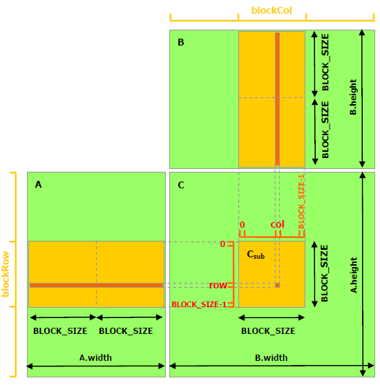

# 07-13 下午：CUDA 编程基础

CUDA（Compute Unified Device Architecture，统一计算设备架构）程序同时有 host（主机，通常是 CPU）和 device（设备，通常是 GPU）两部分。host 负责准备数据、安排依赖并发射 kernel；device 用大量线程完成适合并行的数据处理。

写 kernel 时，先把一个线程负责哪个输出位置说清楚。接着才讨论输入怎样进入 GPU、哪些数据可放进寄存器或 shared memory（共享内存）复用，以及哪些地方需要同步。[^cuda-guide]


!!! quote "CUDA C++ Programming Guide 的基本说明（译）"

    CUDA 程序将串行工作留在 host，将可并行的数据处理部分写成 kernel 并交给 device。程序员用线程、block 和 grid 描述并行工作，运行时负责把 block 调度到 GPU 的执行资源上。[^cuda-guide]

## 一个 CUDA 程序的执行顺序

=== "1. Host 准备数据"

    CPU 侧创建或读取输入，分配设备内存（device memory），并将需要的数组复制到 GPU。此时 host 和 device 指针属于不同地址空间。

=== "2. 配置并发形状"

    Host 指定 grid 和 block。线程根据 `blockIdx`、`threadIdx`、`blockDim` 计算自己负责的输出索引，并处理边界。

=== "3. Kernel 在 GPU 上执行"

    block 被调度到 SM（Streaming Multiprocessor，流式多处理器），线程按 warp 执行。kernel 从 global memory 读取数据，可在 block 内使用 shared memory 和同步，再把输出写回 global memory。

=== "4. Host 取得结果"

    kernel launch 通常异步返回。Host 在真正需要数据时通过事件、stream 同步或复制操作建立等待边界，然后再读取结果或释放内存。

??? note "常用术语"

    | 术语 | 含义 |
    | --- | --- |
    | kernel | 由 host 发射、在 GPU 上执行的函数 |
    | grid | 一次 kernel launch 创建的全部 thread block |
    | block | 可在同一 SM 上协作的一组线程，可共享 shared memory 并使用 block 内屏障 |
    | warp | 硬件通常以 32 个线程为单位调度和执行的线程组 |

    Grid、Block、Thread 描述程序的逻辑层次。SM、warp scheduler 和寄存器文件描述硬件资源。block 会被调度到 SM 上执行，二者的数量和位置由运行时决定。

## CUDA 程序流程

一个可调试的最小 CUDA 程序会依次分配 device 内存、复制输入、配置 grid 和 block、发射 kernel、检查错误、取得结果并释放资源。开发时可在每一步检查返回值。测性能时要区分为了排错而加入的同步，与算法真正需要的同步。[^cuda-runtime]

```cpp
#define CHECK(call) do {                                                \
  cudaError_t e = (call);                                               \
  if (e != cudaSuccess) {                                               \
    fprintf(stderr, "%s:%d: %s\n", __FILE__, __LINE__, cudaGetErrorString(e)); \
    std::abort();                                                       \
  }                                                                     \
} while (0)

float *d_x = nullptr, *d_y = nullptr;
CHECK(cudaMalloc(&d_x, n * sizeof(float)));
CHECK(cudaMalloc(&d_y, n * sizeof(float)));
CHECK(cudaMemcpy(d_x, h_x, n * sizeof(float), cudaMemcpyHostToDevice));
CHECK(cudaMemcpy(d_y, h_y, n * sizeof(float), cudaMemcpyHostToDevice));

int threads = 256;
int blocks = (n + threads - 1) / threads;
saxpy<<<blocks, threads>>>(n, a, d_x, d_y);
CHECK(cudaGetLastError());             // 检查 launch 参数和即时错误
CHECK(cudaMemcpy(h_y, d_y, n * sizeof(float), cudaMemcpyDeviceToHost));

CHECK(cudaFree(d_x));
CHECK(cudaFree(d_y));
```

下面的程序图将代码中的 host 操作与 device kernel 并排放置，便于核对分配、复制、启动和回收各发生在哪一侧。


*图中 `cudaMemcpy`（非 Async 版本）通常会形成同步边界。kernel launch 的异步语义在后面的 Stream 小节展开。[^cuda-runtime]*

### 正确性基线先于性能基线

先保留一份 CPU 或 PyTorch 参考实现。用小形状、不能被 block 大小整除的形状、随机输入和极端值比较输出；确认这条路径后再运行性能输入。kernel 优化前应有明确的误差判据，后续的加速比才有可靠的参考。

## Grid、Block 与 Thread

标记为 `__global__` 的函数由 host 使用 `<<<grid, block>>>` 启动。每个线程从 `threadIdx`、`blockIdx` 和 `blockDim` 算出自己负责的逻辑位置。下面的一维 SAXPY 把第 $i$ 个输出分给一个线程。

```cpp
__global__ void saxpy(int n, float a, const float* x, float* y) {
  int i = blockIdx.x * blockDim.x + threadIdx.x;
  if (i < n) y[i] = a * x[i] + y[i];
}
```

`if (i<n)` 处理最后一个不完整 block。`n` 往往不是 block 大小的整数倍，多出的线程仍会计算索引。边界掩码负责阻止越界读写。二维矩阵和图像需要先写清 `row`、`col` 与 leading dimension 的关系，再安排 `dim3 block(tx, ty)`。


*图中展示的是编程模型层次。block 由运行时调度到 SM，方块位置不对应固定硬件位置。[^cuda-guide]*

### grid-stride loop

大数组不必把每个元素都映射为不同的启动线程。grid-stride loop 让每个线程以整个 grid 的跨度处理多个元素，便于把 block 数控制在与 SM 数量相称的范围，也便于将 launch 缩小到一两个 block 调试索引。

```cpp
__global__ void saxpy(int n, float a, const float* x, float* y) {
  for (int i = blockIdx.x * blockDim.x + threadIdx.x;
       i < n;
       i += blockDim.x * gridDim.x) {
    y[i] = a * x[i] + y[i];
  }
}
```

这种循环提供清晰的覆盖语义。是否需要更多 block、每个 block 多少线程，仍要由寄存器、shared memory、输入规模和 profiler 的结果决定。

## SM 与 Warp 执行

一个 block 在运行期间驻留在单个 SM 上，block 内线程被划分为 warp。warp 中线程通常执行同一条指令流。条件分支让部分线程走不同路径时，硬件会分别执行这些路径，并屏蔽未参与当前路径的线程。是否优化分支取决于它是否处在热点、分歧是否频繁，以及替代方案是否增加更多计算或访存。[^cuda-guide]

```cpp
if (kind[i] == 0) out[i] = f0(x[i]);
else              out[i] = f1(x[i]);
```

若一个 warp 中的 `kind[i]` 高度混杂，上述代码可能执行两条路径。对有大量元素的分类问题，可以尝试先分桶，让同一 warp 处理相近类别；对小规模或罕见分支，额外的重排成本可能不值得。

### occupancy、寄存器与并发 block

SM 可同时驻留的 warp 数受到每线程寄存器数、每 block shared memory、线程数和硬件上限约束。占用率（occupancy）表示活跃 warp 相对于硬件上限的比例。它有助于解释能否隐藏延迟。降低寄存器以提高占用率可能引入 local-memory spill，增加设备内存流量。[^cuda-best]

```bash
nvcc -Xptxas=-v kernel.cu -o kernel     # 查看寄存器与 spill 的编译器报告
```

以 128 或 256 线程的 block 作为起点通常便于控制 warp 数和边界；接着用实际形状测量。对于一维简单 kernel，block 大小的收益常小于合并访问和减少中间数据搬运的收益。

## GPU 内存层级

GPU 的存储空间按可见范围和访问代价区分。寄存器为线程私有，速度快但数量有限。shared memory 由 block 内线程显式共享。global memory 可由同一 GPU 上的 kernel 访问，容量大但访问延迟高。`local memory` 在语义上归线程私有，通常位于设备内存，因而会带来和寄存器不同的访问代价。[^cuda-guide]


*使用某个存储空间时，要同时看访问范围和数据复用。block 内有实际复用或协作时，shared memory 才能摊薄加载和同步成本。[^cuda-guide]*

### shared memory 的同步范围

加载 shared tile 后，线程必须等到所有需要的数据都可见，才开始读取；计算结束后，如果下一轮要覆盖同一块 shared memory，也必须保证旧数据已无人使用。`__syncthreads()` 只同步一个 block，且同一 block 中所有未退出的线程必须以一致控制流到达该屏障。[^cuda-guide]

```cpp
shared[threadIdx.x] = (i < n) ? x[i] : 0.0f;
__syncthreads();
// 此处所有线程都可读取本轮 shared[]
```

边界线程不能在屏障前直接 `return`，否则同 block 的其他线程可能永久等待。处理边界的常见办法是让无效线程写入零值或跳过最终 store，但仍参与每一轮必要的同步。

## 合并访问和 bank conflict

global memory 的访问以 warp 为观察单位。相邻线程访问连续且对齐的元素时，硬件通常用较少内存事务完成请求。每个线程跨大步长读取时，事务数会增加，有效带宽下降。具体事务大小和合并规则随 GPU 架构、访问类型和对齐变化。布局设计应先让相邻线程访问连续元素，再根据目标设备的 profiler 指标分析事务数量。[^cuda-best]

```cpp
// 连续访问。thread 0/1/2/... 分别访问 x[base+0], x[base+1], x[base+2]...
float v = x[base + threadIdx.x];

// 跨步访问。相邻线程跳过 stride 个元素
float w = x[base + threadIdx.x * stride];
```

下面的图把两种地址映射画成内存事务。先看同一个 warp 中相邻线程落在连续地址还是跨步地址，再阅读事务数量的差别。


*合并访问属于数据布局与线程映射问题。先决定输出索引和连续维度，再选择 block 形状。[^cuda-best]*

shared memory 被划分为 bank。对常见的 32 位访问，相邻 32 位字分布到不同 bank。同一 warp 的多个线程若请求同一 bank 中不同地址，访问会发生冲突并被拆分。矩阵转置等场景常通过 padding 改变行跨度，例如将 `tile[T][T]` 改为 `tile[T][T+1]`。使用这种方法前，应先用 profiler 确认 bank conflict 是热点中的实际问题。[^cuda-best]

## 矩阵乘法与 Tiling

朴素 GEMM 让每个输出元素独立从 global memory 读取 $A$ 的一行和 $B$ 的一列，同一元素会被许多线程重复读取。分块 GEMM（tiled GEMM）让一个 block 负责 $C$ 的一个输出 tile。线程协作加载 $A$ 的 $BM\times BK$ 子块和 $B$ 的 $BK\times BN$ 子块到 shared memory，在寄存器中累加，再处理下一段 K 维。

```text
global A/B  →  shared A/B tile  →  register accumulators  →  global C
```

下图将这条数据流落实到一个 block。注意 A、B 子块由线程协作载入，而每个线程把自己的部分和留在寄存器中。



*图中展示共享内存 tiled GEMM 的数据划分。每轮 tile 都要处理边界、在加载后同步、计算后再进入下一轮。生产场景通常调用 cuBLAS 或 CUTLASS。[^cuda-guide][^cublas]*

### 两个同步分别保护什么

```text
for k0 in 0, BK, 2BK, ...:
    cooperative_load(A_tile, B_tile)
    __syncthreads()              # 本轮 tile 已完整可读
    register_accumulate(tile)
    __syncthreads()              # 旧 tile 已无人读取，可覆盖
store(C_tile)
```

第一处屏障确保生产者已经把 tile 装完，第二处确保消费者已经读完旧 tile。使用异步 copy 或多级 pipeline 时，状态会更复杂，但这两个所有权条件仍然存在。每个线程可以累加多个 $C$ 元素以提高复用。tile 过大又会增加寄存器与 shared memory 占用，降低可驻留 block 数，因此应使用 Nsight Compute 验证。

## Tensor Core 与矩阵乘加

Tensor Core 是 NVIDIA GPU 中加速特定形状和精度组合矩阵乘加的硬件单元。cuBLAS（CUDA Basic Linear Algebra Subprograms，CUDA 基础线性代数库）、cuBLASLt（可调的轻量 cuBLAS 接口）、CUTLASS（CUDA Templates for Linear Algebra Subroutines，CUDA 线性代数模板库）与 WMMA（Warp Matrix Multiply and Accumulate，warp 矩阵乘加接口）提供不同的抽象层。它们对数据类型、布局、对齐、维度和累加精度都有明确约束。应先使用库实现建立正确、快速的基线，再判断自定义 kernel 是否确有无法表达的融合或布局需求。[^cublas]

许多路径允许 FP16（IEEE 半精度浮点）、BF16（bfloat16，16 位浮点格式）、TF32（TensorFloat-32，Tensor Core 使用的 32 位存储格式）等输入，并以 FP32（IEEE 单精度浮点）或更高精度累加。实际行为取决于所用 API、GPU 架构和数学模式。科学计算和量化推理对误差的允许范围不同，选择数据格式时还要检查误差要求。

### 寄存器 tile 与流水

高性能 GEMM 常让一个线程或 warp 在寄存器中累加多个输出元素。这样一次加载的 A/B 数据可以服务多个 FMA，但寄存器占用也会上升。下一轮 A/B tile 的搬运若能与当前 tile 的计算重叠，可覆盖部分等待时间。资源占用过高时，可同时运行的 warp 数会减少。[^ncu]

下面的时间线图用于区分两件事：host 先提交工作，与复制、kernel 在设备侧实际重叠。两者需要同时从依赖关系和 profiler 中确认。


*这张图说明一次基础 CUDA 生命周期和 kernel launch 的异步返回。图中没有展示多 stream 的复制—计算重叠；实际重叠需要结合依赖、stream 和硬件 copy/compute 能力，在时间线中验证。[^cuda-stream][^ncu]*

## Kernel 启动、Stream 与异步

同一 stream 内的操作按提交顺序建立依赖。不同 stream 的操作可在满足资源和依赖条件时并发。默认 stream 的语义还会受运行时配置影响。复杂程序应使用事件表达跨 stream 的依赖，避免依靠隐含顺序。[^cuda-stream]

```cpp
cudaEvent_t ready;
CHECK(cudaEventCreate(&ready));
producer<<<grid, block, 0, stream_a>>>(...);
CHECK(cudaEventRecord(ready, stream_a));
CHECK(cudaStreamWaitEvent(stream_b, ready, 0));
consumer<<<grid, block, 0, stream_b>>>(...);
```

### 数据传输与算子融合

将输入上传到 device 后连续执行多个 kernel，最后再下载结果，可以减少中间张量反复经过主机内存的次数。融合连续算子还能减少 global-memory 写回和 kernel launch 次数，也可能增加寄存器压力、降低 occupancy，或使代码难以调试。先在 Nsight Systems 中确认小 kernel、复制或同步确实占据端到端时间，再决定是否融合。[^nsys]

### Stream、事件与资源生命周期

kernel launch 返回后，device 可能仍在使用传入的缓冲区。host 必须等最后一次使用完成，才能释放、覆盖或复用这段内存。事件可表达 stream 之间的依赖，也可测量同一 stream 内的设备时间。端到端墙钟时间还应保留 host 准备、排队和必要同步。

```cpp
cudaEvent_t start, stop;
CHECK(cudaEventCreate(&start));
CHECK(cudaEventCreate(&stop));
CHECK(cudaEventRecord(start, stream));
kernel<<<grid, block, 0, stream>>>(...);
CHECK(cudaEventRecord(stop, stream));
CHECK(cudaEventSynchronize(stop));
float ms = 0.0f;
CHECK(cudaEventElapsedTime(&ms, start, stop));
```

## CUDA 正确性与性能工程

性能改动需要形成可复查的过程。先建立参考输出，定位端到端热点，解释一个可测现象，实施一个改动，再重新比较正确性与时间。每个 CUDA Runtime API 调用都应检查返回值。kernel launch 后调用 `cudaGetLastError`，并在真正需要结果的位置同步，检查延迟报告的错误。[^cuda-runtime]

### Kernel 索引与边界掩码

为 kernel 写下输入、输出与每个维度的语义。二维张量的线性下标通常是 `row * stride + col`，其中 stride 未必等于逻辑列数。切片、padding 和批次维都会改变它。对每个输出位置明确唯一写入者，检查最后一个 tile、非连续 stride 和空维度，并使用不整齐的形状测试。

### Shared memory 的同步范围

`__syncthreads()` 只同步一个 block，也不能代替跨 kernel 的依赖。多个 block 对同一输出累加时，需要改写算法，例如采用两阶段 reduction、原子操作，或使用带有明确协作语义且满足启动条件的特性。先画出数据所有权与依赖图，再决定同步原语。

### GEMM 的寄存器 tile

寄存器 tile 增大时，每个线程承担更多输出，global/shared 读取得到更多复用，寄存器压力也可能导致 spill。Nsight Compute 中的寄存器用量、local-memory 流量、活跃 warp 与内存吞吐应同时阅读。占用率还需结合复用和 spill 情况解释。[^ncu]

### 错误传播与确定性

并行规约和 Tensor Core 路径可能改变浮点求和顺序，结果不必逐位等于 CPU 参考。应根据任务定义使用绝对误差、相对误差、范数或下游指标，同时固定随机种子、输入和版本，并保留失败 case。吞吐测试与正确性测试应使用相同数学模式。

## Triton 与高层 Kernel 工具

Triton 使用 Python DSL（领域专用语言）描述一个 program instance 处理的 tensor block，再由编译器生成 GPU 代码。它适合快速迭代规则张量 kernel。block 如何映射到输出、mask 怎样覆盖边界、数据怎样布局、使用什么类型，以及怎样基准测试，仍由程序员决定。Triton 的 `tl.load`、`tl.store` 与 program id 同样可能出现越界、跨步访问和寄存器压力，只是代码形式不同。[^triton]

!!! question "Lab 3 前的最小核查"

    写完一个新的 GPU kernel 后，依次检查什么？

    ??? tip "详细答案"

        1. 用 CPU 或 PyTorch 参考结果验证小形状、随机形状和边界形状。先比较最大绝对误差、相对误差或题目规定的校验方式。
        2. 检查每个输出位置是否只有一个写入者。对最后一个 block、非整除 shape 和 mask 路径单独测试，确认没有越界读取或写入。
        3. 用 CUDA event 测 kernel 时间，用墙钟测端到端流程。前者回答设备计算时间，后者包含 host 准备、复制和同步。
        4. 在 Nsight Systems 中看复制、kernel 与同步的时间线；再用 Nsight Compute 解释最长 kernel 的访存、寄存器、shared memory 和执行单元利用率。
        5. 记录 GPU 型号、驱动、CUDA/Triton 版本、输入 shape、随机种子和命令行。性能数字离开这些条件没有可比性。

[^cuda-guide]: NVIDIA, *CUDA C++ Programming Guide*, <https://docs.nvidia.com/cuda/cuda-c-programming-guide/>.
[^cuda-runtime]: NVIDIA, *CUDA Runtime API*, <https://docs.nvidia.com/cuda/cuda-runtime-api/>.
[^cuda-best]: NVIDIA, *CUDA C++ Best Practices Guide*, <https://docs.nvidia.com/cuda/cuda-c-best-practices-guide/>.
[^cublas]: NVIDIA, *cuBLAS Documentation*, <https://docs.nvidia.com/cuda/cublas/>.
[^cuda-stream]: NVIDIA, *CUDA Runtime API: Streams and Events*, <https://docs.nvidia.com/cuda/cuda-runtime-api/group__CUDART__STREAM.html>.
[^ncu]: NVIDIA, *Nsight Compute Profiling Guide*, <https://docs.nvidia.com/nsight-compute/ProfilingGuide/index.html>.
[^nsys]: NVIDIA, *Nsight Systems User Guide*, <https://docs.nvidia.com/nsight-systems/UserGuide/index.html>.
[^triton]: Triton, *Triton Language and Tutorials*, <https://triton-lang.org/main/index.html>.
