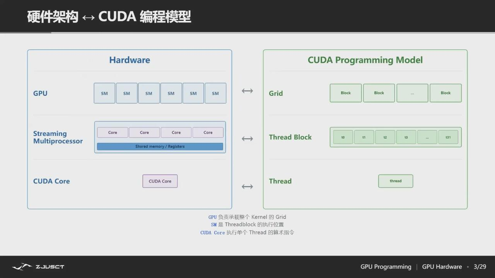
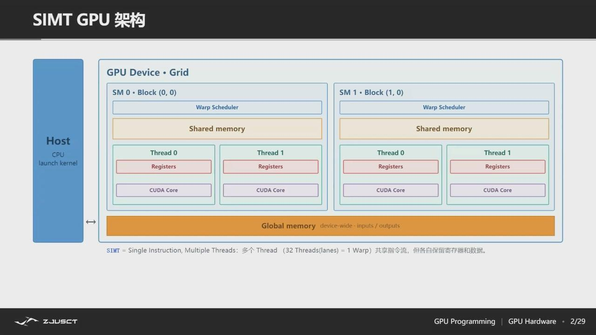
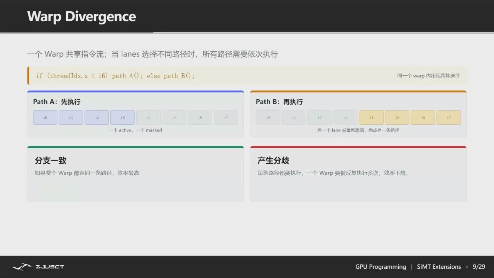
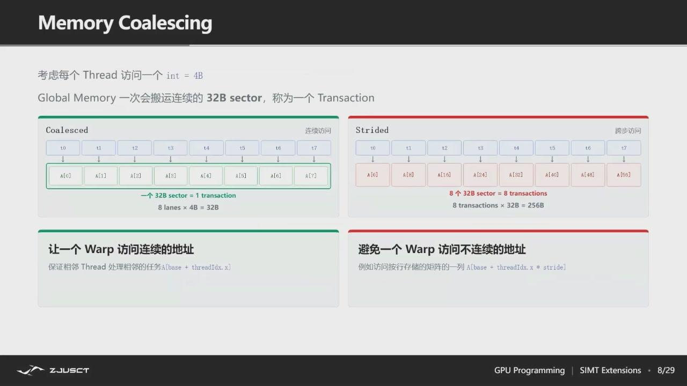
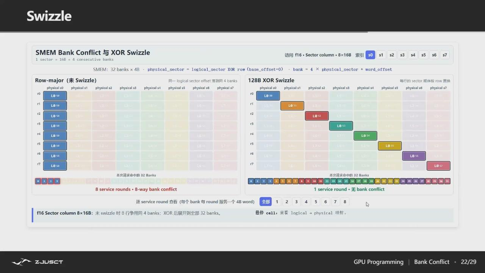
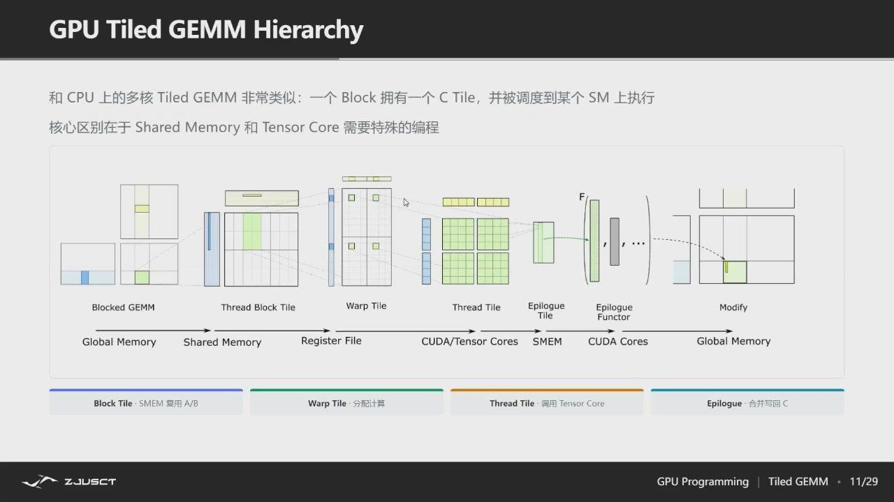
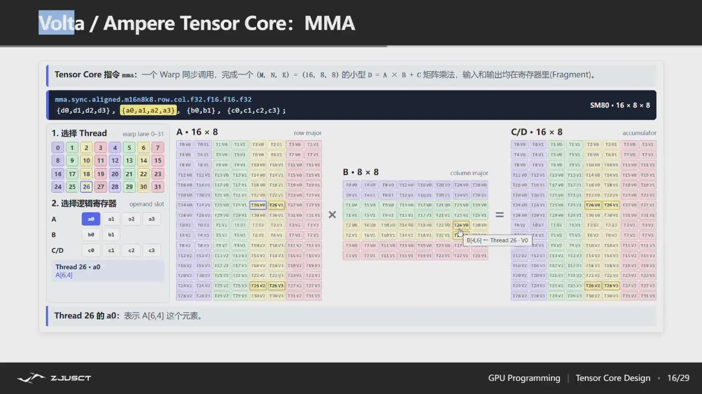
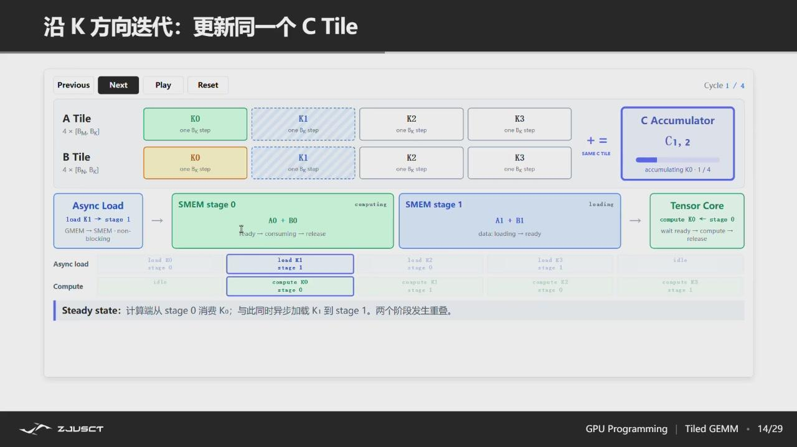
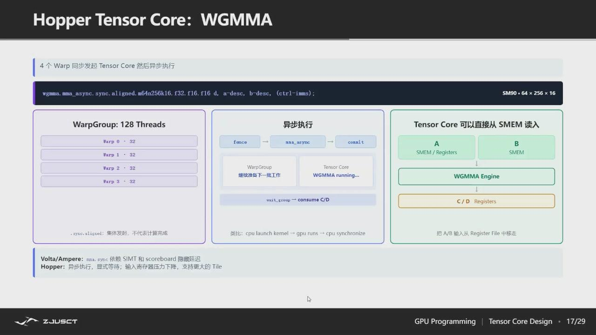

# 07-13 下午：CUDA 编程基础

CUDA 把 CPU 称为 host，把 NVIDIA GPU 称为 device。host 负责组织数据和发射 kernel；device 上有大量线程执行同一段 kernel 代码。写 CUDA 的关键在于把问题拆成大量相似工作，让线程、数据和内存层级相匹配，而不是简单地把普通 C 循环搬到 GPU。

## CUDA 程序流程

最小流程是：host 分配显存，把输入从主存复制到显存，发射 kernel，等待必要的同步，再把结果复制回主存并释放资源。

```cpp
float *d_x = nullptr, *d_y = nullptr;
cudaMalloc(&d_x, n * sizeof(float));
cudaMalloc(&d_y, n * sizeof(float));
cudaMemcpy(d_x, h_x, n * sizeof(float), cudaMemcpyHostToDevice);
cudaMemcpy(d_y, h_y, n * sizeof(float), cudaMemcpyHostToDevice);

int threads = 256;
int blocks = (n + threads - 1) / threads;
saxpy<<<blocks, threads>>>(n, a, d_x, d_y);

cudaMemcpy(h_y, d_y, n * sizeof(float), cudaMemcpyDeviceToHost);
cudaFree(d_x);
cudaFree(d_y);
```

host-device 拷贝走 PCIe/NVLink 等链路，代价通常远高于一次普通函数调用。若一个计算链由许多 kernel 组成，尽量让中间结果留在 GPU；每一步都复制回 CPU，往往会把 GPU 算力完全淹没在传输时间里。


*图：CUDA 的最小流程——分配、上传、launch、同步/回拷、释放；中间结果应尽量留在 device。*

## Grid、Block 与 Thread

`__global__` 标记一个由 host 发射、在 GPU 上执行的 kernel。线程组织成 block，block 组织成 grid。三种内建索引给出线程位置：`threadIdx` 是 block 内坐标，`blockIdx` 是 block 坐标，`blockDim` 是 block 尺寸。



*图：SM 是硬件里的执行单元，Grid/Block/Thread 是程序里的逻辑组织；前者由硬件调度，后者由程序员用索引描述。*

```cpp
__global__ void saxpy(int n, float a, const float* x, float* y) {
    int i = blockIdx.x * blockDim.x + threadIdx.x;
    if (i < n) y[i] = a * x[i] + y[i];
}
```

这里每个线程负责一个元素。`if (i < n)` 处理最后一个不满的 block；少了它，`n` 不是 block 大小整数倍时会越界。二维图像/矩阵常使用 `dim3 block(tx, ty)` 和二维 `blockIdx/threadIdx`，把 `(row, col)` 映射到线程坐标。映射没有唯一答案，但必须让一个输出位置的写入者明确。

grid 的 block 数不必恰好等于输入块数。对远大于一次 launch 覆盖范围的数组，常见写法是 grid-stride loop：每个线程处理自己的第一个元素后，以整个 grid 的跨度继续处理后续元素。

```cpp
__global__ void saxpy(int n, float a, const float* x, float* y) {
    for (int i = blockIdx.x * blockDim.x + threadIdx.x;
         i < n;
         i += blockDim.x * gridDim.x) {
        y[i] = a * x[i] + y[i];
    }
}
```

这样可以让 block 数按 SM 数量和每个 SM 的并发能力选择，而不是盲目创建极多 block。它还便于调试：把 grid 和 block 暂时设为 1，代码仍按同一索引逻辑串行覆盖全部元素。矩阵、张量的二维或三维情形也是同一原则，先确定一个线程或一个 tile 对应哪块输出，再写出到输入的索引关系。


*图：线程索引首先是一种数据划分方式，边界 block 必须保留范围检查。*

## SM 与 Warp 执行

GPU 由多个 SM（Streaming Multiprocessor）组成。block 被调度到某个 SM；同一 block 内线程可以协作。硬件实际以 32 个线程为一组的 warp 发射指令。一个 warp 的所有线程执行同一条指令，但每个 lane 使用不同数据（遇到分支发散时才分路径执行）。

```text
grid
 └── block 0, block 1, ...
       └── warp 0（32 threads）, warp 1, ...
```



*图：同一 SM 上驻留多个 block；warp scheduler 把 warp 的一条指令流同时送到多个 CUDA core 的 lane 上，shared memory 供 block 内协作使用。*

若同一 warp 中部分线程走 `if`，另一部分走 `else`，硬件需要分别执行两条路径，只在对应线程上启用结果。这叫 branch divergence。分支不是绝对禁止；只是在大规模、数据相关的分支中，应特别注意它是否使 warp 大量串行化。



*图：`if (threadIdx.x < 16) path_A(); else path_B();` 会让同一 warp 分两次跑，两边各只利用一半 lane。*

block 是可协作的边界。不同 block 的执行顺序不保证，也不能在普通 kernel 内做全局 barrier；若需要全局同步，通常拆成两个 kernel，或使用专门的协作组机制并满足其启动条件。

## GPU 内存层级

每种内存决定了可见范围、容量和速度：

| 位置 | 可见范围 | 典型用途 |
| --- | --- | --- |
| register | 单线程 | 局部标量、累加器 |
| shared memory | 同一 block | 显式复用的 tile、线程协作 |
| global memory | 整个 device | 大数组、输入输出 |
| L1/L2 cache | 硬件管理 | 缓存 global 访问；L2 通常跨 SM 共享 |


*图：同样的片上有过 storage，L1 cache 自动缓存、shared memory 显式管理；高性能 GEMM 常把后者当作可预取、可复用的手工 buffer。*

寄存器最快，但每线程寄存器用得太多会降低一个 SM 可同时驻留的线程数，甚至 spill 到所谓 local memory（物理上常在显存）。shared memory 很快、由程序员管理、容量有限；多个线程需要读写同一块 shared memory 时，必须用 `__syncthreads()` 确保写入完成。

```cpp
__shared__ float tile[256];
tile[threadIdx.x] = x[global_i];
__syncthreads();
// 现在可安全读取同一 block 中其他线程写入的 tile
```

`__syncthreads()` 必须由 block 中所有尚存活线程以一致方式到达；把它放在仅部分线程会进入的条件分支中，可能死锁。

## 合并访问和 bank conflict

global memory 的带宽很高，但前提是一个 warp 的线程访问规则地址。若 thread 0、1、2... 分别访问连续元素，硬件可把请求合并为少量内存事务，称为 coalesced access。若每个线程相隔很远、随机跳跃，事务数量增多，有效带宽下降。



*图：连续元素可被合并成极少的 32B sector 事务；一个 warp 跨大步长跳转时，会变成多个事务、搬更多无用字节。让 warp 内线程访问连续地址，是合并访问的核心。*

shared memory 又被分成 bank。若一个 warp 中多个线程同时访问同一 bank 的不同地址，访问可能序列化，这称为 bank conflict；访问同一地址的广播情形另当别论。布局、转置和 padding 常用于避免冲突。优化前先确认它真是 profiler 里的瓶颈，不能把所有 shared 数组都机械加 padding。

以行主序矩阵为例，最自然的线程映射是同一 warp 的线程沿列递增：

```cpp
int row = blockIdx.y * blockDim.y + threadIdx.y;
int col = blockIdx.x * blockDim.x + threadIdx.x;
float x = input[row * width + col];
```

固定 `row`、让 `col` 连续时，warp 的 32 次读取相邻；若把 `row` 与 `col` 交换，同一 warp 会跨过整行步长，通常需要更多内存事务。张量的真实 layout 可能是 NHWC、NCHW 或带有 padding 的 block layout，不能只凭变量名判断连续维；先把地址公式写出来。

shared memory 的 bank conflict 也能从地址公式看出。若一个二维 tile 按 `tile[threadIdx.x][k]` 访问，多个线程可能跨 stride 落到同一个 bank；转置 tile 或把第二维从 `N` 扩成 `N + 1` 会改变 stride。padding 只处理规则访问冲突，随机访问和寄存器 spill 则需要另找原因。

layout 里还有一类技巧叫 swizzle：不改变硬件结构，只把逻辑地址重新映射到物理 bank，让原本集中在一组的访问散开。典型做法是 128B XOR swizzle，把每行的物理 sector 序号与行号做异或。



*图：bank 编号由地址与行号异或得到后，同一 warp 的访问从 8 个 round 的冲突降到 1 个 round；代价只是多一条地址异或。*

swizzle 常用在 Tensor Core 的 shared memory tile 布局上，配合 TMA 等硬件搬运让数据以兼容格式落位。它不是银弹：只有在 profiler 证实 warp 因 bank 冲突停顿、且访存模式规则时才值得尝试；随机访问没有稳定模式可重新映射，压不住。

## 矩阵乘法与 Tiling

朴素矩阵乘法中，每个线程算一个 `C[row, col]`：

$$
C_{row,col}=\sum_kA_{row,k}B_{k,col}
$$

若每次乘加都从 global memory 读取 A、B，同一 A/B 元素会被许多线程重复读取。tile 做法让一个 block 负责 C 的一个小块：把对应 A 的行块和 B 的列块搬入 shared memory；block 内线程在这两个小块上做多次乘加；再进入下一个 K 维块。

```text
global A/B --> shared-memory tile --> registers (accumulator) --> global C
```

这与 CPU cache blocking 是同一个思想，只是 GPU 让程序员显式管理 block 内的共享数据。tile 大小要同时受 shared memory 容量、每线程寄存器数、block 线程数和 warp 调度影响。更大的 tile 不一定更好：它可能让资源占用过高，使并发 block 数下降。



*图：一个 C tile 由一个 block 负责；A/B tile 从显存进入 shared memory，再由线程装入寄存器完成局部累加。*

一个 `BM × BN` 的输出 tile 通常沿 K 维分段。每一轮，block 先把 `A[BM × BK]` 与 `B[BK × BN]` 从 global memory 搬到 shared memory，所有线程同步；随后每个线程把自己负责的若干 C 元素保存在寄存器累加器中，遍历这段 `BK`；完成后再同步，复用 shared memory 装下一段。输出只在最后写回 global memory。

```text
for k0 in range(0, K, BK):
    cooperative_load(A_tile, B_tile)
    __syncthreads()
    register_accumulate(A_tile, B_tile)
    __syncthreads()
store(C_tile)
```

两次同步分别保护“tile 已全部装完”和“旧 tile 已无人使用”。若某些线程因为边界条件提前返回，其他线程再到达 `__syncthreads()` 就可能挂住；边界线程应参与同步，只把无效 load 填为零、无效 store 跳过。小矩阵时也要防止 block 太大：很多线程没有足够工作，会把启动和同步成本放大。

## Tensor Core 与矩阵乘加

Tensor Core 面向小矩阵乘加，例如 $D=A\times B+C$。它能以低精度输入（FP16、BF16、TF32、INT8 等，取决于架构）实现很高吞吐。WMMA、CUTLASS 和 cuBLAS 等接口把这类能力封装起来。

使用 Tensor Core 不只是把普通 `float` 改成低精度：矩阵形状、对齐、布局和精度累加方式都有要求。深度学习常允许输入低精度、累加用更高精度；科学计算能否接受相应误差，必须由算法需求决定。先用 cuBLAS/cuBLASLt 或框架高层算子，只有需要专门 kernel 时再考虑 WMMA/CUTLASS。



*图：MMA 是 warp 级操作，32 个 lane 合作持有输入与累加器；它不是 32 个彼此独立的小矩阵乘法。*

MMA 的输入与累加器不会以“每个线程保存一行小矩阵”的直观形式出现。一个 warp 共同拥有 A、B、C/D 的 fragment；某个 lane 手上的寄存器只对应逻辑矩阵中分散的一部分元素。以 `m16n8k8` 为例，这层映射是 32 个线程一起完成 $16\times8\times8$ 的小矩阵乘加，结果 fragment 留在寄存器，沿 K 维的下一块继续累加。

从 global memory 取 A/B tile、放进 shared memory、再装入 fragment 的两级搬运可以和前一轮的矩阵乘加交错。这样做的目的是让下一块数据到位时，计算单元刚好结束当前 K 块；最终 C tile 在寄存器完成累加和必要的逐元素后处理后，才写回 global memory。

这通常用双缓冲实现：shared memory 开辟两个（或更多）stage，一份正在被计算单元消费，另一份正被异步加载。



*图：计算与搬运交错后，访存等待被计算隐藏；若只有单缓冲，每一轮都得停下来等数据装满，吞吐会明显下降。*

流水线分三段：prologue 先异步装好第一块；steady state 让"算当前块"与"装下一块"一直重叠；drain 处理已无新输入的最后一轮。stage 数越多、每块越小，重叠越平滑，但 shared memory 占用与调度复杂度也越高。能用 double buffering 的前提是有独立的异步 copy 路径（如 `LDGSTS`/TMA），否则仍会退化为同步等数据。

读现代 GEMM kernel（或 Nsight Compute 里的 kernel 分析）时，还会遇到几个和 CTA、WGMMA、TMA、epilogue 有关的术语，它们和 Ampere 时代的手写 WMMA 不同。

- **CTA**（cooperative thread array）是 CUDA 中一个 thread block 的另一种叫法；一块 CTA 自己的那块 C tile 常被称为 CTA tile。
- **TMA**（Tensor Memory Accelerator）是 Hopper 起引入的硬件单元，负责把 global memory 的大块数据异步搬进 shared memory（也可搬出）。它把"gather + 抬到片上"的工作从普通 load 指令里抽出来，由专门的引擎完成，从而让计算单元不必亲自处理分散的地址。
- **WGMMA** 是 Hopper 的 warpgroup 级 MMA 指令，能一次读取 shared memory 中的矩阵并完成更大的乘加，吞吐高于旧版 MMA；它也进一步把"谁负责搬运、谁负责算"分开。尺度上它比 WMMA 更进一层：WMMA 以单个 warp（32 线程）的力度执行一块小矩阵乘，WGMMA 则以一个 warpgroup（4 个 warp、约 128 线程）共同执行一块更大的乘加，典型 tile 形状从 `16×8×8` 之类放大到 `64×256×16`。它的主要贡献是 A、B 输入可以直接从 shared memory 读取，不必先搬进每个线程的寄存器；而输出 C/D 仍受架构设计限制、要求留在寄存器。这减轻了寄存器压力，也支撑更大的 tile——更大的 tile 意味着更少的前往 global memory 的访存量。但 WGMMA 仍是一个需要顺序发射、相对同步的指令，异步程度有限；能否真正隐藏搬运等待，仍依赖搬运与计算的交错安排。



*图：WGMMA 把矩阵乘加提升到 warpgroup 尺度，并允许从 shared memory 直接读取输入，从而减轻寄存器压力、支撑更大的 tile。*
- **epilogue** 指主循环结束后的收尾：把寄存器里的累加结果写回 global memory，以及其间的逐元素处理（如 scale、激活、转置、分段写）。GEMM 分析常把"主 GEMM 循环"和"epilogue"分开看，因为二者可能轮到不同的瓶颈。

这些名词可以直接当"约定俗成的分层"来记：TMA 管搬运进 shared memory，WGMMA/MMA 管在片上完成矩阵乘加，epilogue 管把结果按想要的布局写出去。Lab 里用 CUTLASS 写高性能 GEMM 时，看到的 `tma`、`wgmma`、`epilogue`、`Cta_tile` 都属于这个分工。

!!! warning "fragment 不是普通数组"

    WMMA/CUTLASS 的 fragment 元素布局由架构和指令形状定义。不能假定 `frag[i]` 对应逻辑矩阵的第 `i` 个元素，也不能把它当作通用的行主序 tile 传给任意代码。需要逐元素后处理时，应使用相应接口或让库负责映射。

## Kernel 启动、Stream 与异步

`kernel<<<...>>>()` 对 host 通常是异步的：CPU 发射后可继续做别的工作。普通计时若只包住发射语句，测到的只是启动开销，不是 GPU 执行时间。应使用 CUDA event，或在调试时显式同步：

```cpp
kernel<<<blocks, threads>>>(...);
cudaError_t err = cudaGetLastError();
if (err != cudaSuccess) { /* 统一错误处理 */ }
cudaDeviceSynchronize();  // 调试/边界处需要；不要在每个小 kernel 后滥用
```

stream 是 GPU 的工作队列。不同 stream 中、没有依赖的传输和 kernel 有机会重叠；同一 stream 内保持顺序。真正的 overlap 需要硬件支持、足够独立的工作和正确的 pinned memory/事件依赖，不能只因为创建了多个 stream 就自动发生。


*图：拷贝阻塞、上传/回拷会等待，kernel launch 默认异步；CPU 提交工作后继续运行，直到同步点才等待 GPU 完成。*

### 数据传输与算子融合

把一个公式拆成许多小 kernel 很直观，例如先算线性层、再单独加 bias、再单独激活、再写出临时张量。但每个 kernel 都要从 global memory 读输入、写中间结果，后一个 kernel 又立刻把它读回来。若这些步骤之间没有其他使用者，把它们融合进同一 kernel，往往能省下多次显存往返和 launch 开销。

融合也有边界。kernel 太大可能让寄存器数量上升、occupancy 下降，代码可维护性和数值检查也会变差；而 cuBLAS、cuDNN、FlashAttention 等库可能已经把常见模式做得很强。合理的顺序是先用 profiler 看中间张量搬运和小 kernel 是否真的占时，再比较框架已有的 fused 实现、库调用与自定义 kernel。不能因为“少启动几个 kernel”听上去对，就跳过测量。

对推理或训练的一个连续阶段，尽量把输入一次送到 GPU，让中间激活、KV cache 或工作 buffer 留在 device，最后再取回真正需要的结果。CPU 仍负责准备请求、提交工作和处理不规则控制；把能够连续执行的规则数据流切成频繁的 host-device 往返，通常会得不偿失。

## CUDA 调试与性能分析

每个 kernel launch 后至少检查 `cudaGetLastError()`；需要定位异步错误时调用 `cudaDeviceSynchronize()`。用小尺寸输入与 CPU 参考实现逐元素比较，先证明结果正确，再测大规模性能。越界、未初始化、竞争和错误同步常常在大规模才表现为随机错误。

Nsight Systems 适合看 CPU、GPU、传输和 stream 的时间线；Nsight Compute 适合看某个 kernel 的访存、占用率、warp 效率和指令吞吐。所谓 occupancy 是一个 SM 上活跃 warp 相对可支持上限的比例；它有助于隐藏延迟，但不是越高越好。一个寄存器更多、occupancy 较低却减少访存的 kernel，可能实际更快。

读取 profiler 时可以按这个顺序问：global load/store 是否接近可用带宽，warp 是否因分支或内存等待停顿，寄存器和 shared memory 是否限制了并发 block，Tensor Core 或普通算术单元是否真的忙。指标之间会互相牵制。为了提高 occupancy 强行减少寄存器，可能把局部变量 spill 到 local memory；为了扩大 tile 增加 shared memory，又可能让每个 SM 只能驻留一个 block。最终仍以同一输入上的正确结果和运行时间决定保留哪版。

## Kernel 索引与边界掩码

CUDA 的线程索引应从问题中的一个输出元素推导，而不是从“开多少线程”猜。对一维 `y[i]=f(x[i])`，常见映射为 `i=blockIdx.x*blockDim.x+threadIdx.x`；grid 往上取整，因而最后一个 block 往往包含超出 `n` 的线程。边界判断必须在访问前完成：

```cpp
__global__ void saxpy(int n, float a, const float* x, float* y) {
  int i = blockIdx.x * blockDim.x + threadIdx.x;
  if (i < n) y[i] = fmaf(a, x[i], y[i]);
}
```

这里 `fmaf` 以一次舍入完成乘加；是否与 CPU 的标量结果逐位一致取决于编译选项和归约顺序。二维矩阵则要明确行主序中的 `row`、`col` 以及 leading dimension，错误地把 `row*cols+col` 写成 `col*rows+row` 可能在方阵测试中潜伏，到非方阵才暴露。

## Shared memory 的同步范围

一个 tiled GEMM block 把 A、B 的小片搬入 shared memory 后，所有线程都要读取其他线程写入的数据。因此 load 后的 `__syncthreads()` 是正确性边界：它保证同一 block 的线程都完成该阶段；累加完、准备覆盖 shared tile 前又需要一次 barrier。它不能同步不同 block，跨 block 的归约必须拆成多个 kernel、使用 cooperative launch 的受限机制，或把局部结果交给后续阶段。

shared memory 的 bank conflict 与错误同步不同。多个线程访问不同 bank 可并行；若同一 warp 的不同地址映射到同一 bank，访问被串行化。矩阵转置常在 shared tile 的一维加一列 padding，改变列访问的 bank 映射；这只在 profiler 证实冲突时值得采用，padding 也会增加 shared memory 占用并可能降低 occupancy。

## Stream、事件与资源生命周期

同一 CUDA stream 中的操作按提交顺序执行，不同 stream 只有在没有显式依赖时才可能重叠。`cudaMemcpyAsync` 的源、目的缓冲区在 copy 完成前不能释放或覆盖；host 侧要真正异步，通常还需要 pinned memory。用 event 记录一个 stream 中的起止点可量 kernel/拷贝的 device 时间，`cudaDeviceSynchronize()` 则会等待设备上全部先前工作，适合定位错误却会在无意中抹去可重叠性。

Nsight Systems 用时间线回答 kernel、memcpy 与 CPU 是否重叠，Nsight Compute 再回答某个 kernel 是受 DRAM、指令、occupancy 还是访存合并限制。二者的顺序不能颠倒：端到端时间被一个同步点或数据传输主导时，先把注意力放在单个 kernel 的 Tensor Core 利用率上不会改变总耗时。

## GEMM 的寄存器 tile

朴素 GEMM 让一个线程计算一个 `C[row,col]`，会反复从 global memory 读取同一行 A 和同一列 B。shared-memory tiling 已使 block 内线程复用输入；继续让每个线程持有一个小的 `TM × TN` 输出 tile，可令 A/B 的一次加载贡献给更多 FMA。累加器放在寄存器中，直到 K 维循环结束才写回 C，这就是高性能 GEMM 中“数据在更近层级停得更久”的具体含义。

tile 变大并不单调有利。每个线程的 accumulator 增多会提高寄存器压力，寄存器不够会 spill 到 local memory（物理上通常仍是 global memory），并降低可驻留 warp 数。A/B tile 变大又会增加 shared memory，可能压低 occupancy。可实现的设计通常先选择匹配 Tensor Core 或向量指令的 K 维粒度，再用 profiler 检查带宽、寄存器和 SM 活跃度，而不是从理论复用率直接断言最快参数。

## 错误传播与确定性

CUDA API 许多调用只是把工作排入队列，非法访存经常在后续同步、下一次 API 调用甚至程序结束时才报告。定位时可在可疑 kernel 后临时加入 `cudaGetLastError()` 和同步，再用 Compute Sanitizer 检查越界、未初始化和 race；确认后移除不必要同步恢复真实性能。编译 debug 版本时保留符号和较低优化，性能版本再单独测量，不能拿调试模式速度评价 kernel。

并行归约的输出顺序、Tensor Core 的低精度乘加和不同 GPU 架构都可能改变最后若干位。验证应包含小尺寸可人工检查的案例、非方阵/非整除边界、随机输入和与参考实现的误差界；还应测量多次运行是否稳定。只在 `n` 恰为 block size 倍数、矩阵恰为方阵的输入上通过，不能说明 indexing 和 mask 已正确。

## Triton 与高层 Kernel 工具

Triton 允许用 Python 风格的语言表达 GPU kernel。程序员关注 block/tile、张量索引和数据布局，再由编译器生成低层代码。它不消除 CUDA 的基本规律：程序实例如何分工、global memory 是否合并、数据是否在更近层级复用、资源是否过量，仍然决定性能。

对于标准矩阵乘法、卷积、attention 等，框架和库已经高度优化。手写 kernel 的合理场景是算子融合、特殊形状、特殊数据布局或 profiler 证明的热点。否则最可靠的优化是减少不必要的数据搬运并调用正确的库。

prefill 一次处理整段 prompt，序列维度提供了并行空间；某些状态更新却仍沿 token 有因果依赖，不能把所有位置当作独立元素。课后的 GDN（Gated DeltaNet 一类）prefill 就同时面对这两种约束，常见的优化手段都围绕"如何在不破坏依赖的前提下把 sequence 也并行起来"：

- **chunk-wise parallel / chunk 并行**：把长序列切成若干 chunk，先对每个 chunk 做可以并行的块内计算，再把 chunk 之间的因果依赖（如 $g$ 的累积、递推状态 $S_t$）按顺序串起来合并。结果与逐 token 递推一致，但大部分工作在块内是并行的。
- **多缓冲 / ping-pong buffer**：用两套（或多套）buffer 交替：当前 buffer 被计算单元读取时，下一块数据正被 DMA/异步 copy 写入另一套 buffer。它把"搬运下一块"和"计算当前块"重叠，避免每次都等数据传输完成再动手。
- **warp specialization**：让不同 warp 承担不同职责，例如专门的 warp 做 TMA/异步搬运或归约，另一些 warp 专注矩阵乘加。它把"生产者/消费者"角色下放到硬件上的不同 warp，配合多缓冲让流水线更接近满负荷。

PyTorch reference 用于定义结果，Nsight Compute 解释单个 kernel，Nsight Systems 解释 kernel、launch 与 host 时间线；三者解决的不是同一个问题。

kernel 快也不等于程序快。初始化、Python driver、MPI、CUDA runtime、数据传输和必要同步都会进入端到端时间。host 上出现大量 `cudaDeviceSynchronize` 只能说明 CPU 在等待；还要把它和 GPU 时间线、具体 kernel 指标对齐，才能判断应融合、拆分还是调整 stream。

??? example "把一次 kernel 测量放回程序时间线"

    event 显示 kernel 为 0.4 ms，调用它的 host 循环却每次耗时 2 ms。时间线若显示 1.5 ms 在同步前等待上一轮 H2D copy，优化该 kernel 的 20% 只能节省 0.08 ms；先消除往返或建立 copy/compute 重叠才会改变总时间。
