# 07-16 上午：机器学习基础

给定一批带答案的历史数据，监督学习要构造一个能处理新输入的函数。房价、气温、购买意愿和图像类别的任务形式不同，数据、目标函数、训练和独立评估的边界却相同。这个边界决定后面交叉熵[^cross-entropy]、梯度、神经网络和语言模型的每个公式怎样解释。

[^cross-entropy]: 分类训练常用的损失，看模型给真实类别多少概率，概率越低惩罚越大。

attention[^attention] 的直觉可以先记成一次加权取数。序列中每个位置都提出一个 query[^qkv]，用来和其它位置的 key 比较；比较结果经 softmax[^softmax] 变成权重，再对对应 value 加权求和。若把“猫追狗”里的“追”看作当前 token[^token]，它可以选择多看“猫”、少看无关位置。后面 QKV 小节会把这句话完全翻译成矩阵乘法。

[^attention]: 根据向量相似度决定当前 token 从哪些位置取多少信息的计算。

[^qkv]:
    attention 中三路含义不同的投影，query 近似“我要找什么”，key 近似“我能被怎样索引”，value 近似“我提供的内容”。

[^softmax]: 把一组任意实数分数变成和为 1 的概率分布。

[^token]: 文本被切分后的基本单元，可能是词、词片、汉字、标点或字节片段。

???+ question "术语自测"

    1. embedding 查表[^embedding]输入是 token 编号还是文本字符串？

    [^embedding]: 一张查找表，把 token 编号变成一个可计算的向量。

    2. logits[^logits] 和 softmax 后的概率有什么区别？

    [^logits]: 输出层尚未归一化的实数分数，softmax 之前的量。

    3. mask[^mask] 在自回归模型里禁止什么？

    [^mask]: 把不允许参与计算的位置置为无效，例如不让当前位置看见未来 token。

    4. multi-head[^multi-head] 为什么不等于多复制几个完整模型？

    [^multi-head]: 把隐藏向量切成多个子空间，分别做 attention，再拼接结果。

    答案依次是 token 编号；logits 是未归一化实数分数，softmax 后各分量非负且和为 1；禁止当前位置读取未来 token；multi-head 通常把 hidden dimension 切成多个子空间，每个 head 独立做 QKV 注意力后再拼接。

初读时可以把几个反复出现的词先落到具体对象上。特征是输入数据里的一个可测量的量，例如房屋面积、像素灰度或一个 token 的编号；标签是希望模型输出的答案；参数是训练中由数据估计出来的数值，例如线性模型的斜率和截距；超参数是人先选好的设置，例如学习率、网络层数和 batch 大小。样本是一组输入和答案，batch 是一次同时送入模型的一批样本，epoch 是把训练集完整过一遍。

张量可以按维数理解。标量是单独一个数，向量是一列数，矩阵是二维表，三维及以上的数组统称张量。一个文本批次常记成 `[B, T, d]`，其中 B 是批次内样本数，T 是每个样本的 token 数，d 是每个 token 的向量维度。写代码时把这个顺序标清楚，后面 Transformer 章节里的维度重排才有落脚处。

## 人工智能范式

课上从图灵测试和 1956 年达特茅斯会议讲起。早期研究者关心的是怎样让机器表现出推理、学习和决策能力，而不只是会做算术。沿着这个问题，人工智能形成过三种很有代表性的思路。

| 范式 | 知识从哪里来 | 适合的问题与边界 |
| --- | --- | --- |
| 符号主义 | 人写出符号、规则和推理链 | 规则可检查，适合边界清楚的领域；真实世界例外太多时难以穷举 |
| 连接主义 | 从样本中调整大量连接权重 | 擅长从图像、语音、文本中学习模式；内部表示较难逐条解释 |
| 行为主义 | 根据动作后的奖励或惩罚调整策略 | 适合连续决策；奖励定义和环境反馈会直接塑造行为 |

工程系统常混合这些路线：大模型可以调用规则工具，强化学习也可以用神经网络表示策略。

深度学习近年的扩展依赖算法、数据、GPU 和工程工具同时成熟。模型规模增大后，数据重复、显存、通信和推理延迟都会成为系统约束。

机器学习属于连接主义最常用的技术路径之一，但不能把两者划等号。机器学习包括线性模型、树模型、核方法和神经网络；神经网络只是其中一类模型。先把这些术语和数据流落到具体对象上，后面看到多层网络或 Transformer 时才不会把它们看成凭空出现的黑箱。

## 监督学习模型

给定输入特征 $x$ 和期望输出 $y$，模型 $f(x;\theta)$ 用参数 $\theta$ 产生预测 $\hat y$。训练通过调整参数，让模型在没有见过的新样本上仍能给出有用的预测，而不是把样本原封不动记下来。

一个问题至少需要说明三件事：输入是什么、输出是什么、怎样判定预测好坏。房价预测中，面积、位置等可作输入，房价是连续输出；垃圾邮件识别中，邮件内容是输入，类别是离散输出。前者是回归，后者是分类。

回归和分类的本质差别在于输出的数学类型。回归输出实数，例如明天气温是 23.4 度，预测偏 0.5 度和偏 10 度有程度差别。分类输出类别，例如邮件是垃圾邮件或正常邮件，类别之间通常没有大小顺序，把猫分到狗并不比分到汽车“多错一点”。因此回归常用平方误差，分类常用概率和交叉熵。

用前两天的温度预测明天温度。把两个温度直接平均，是人先写好的规则；把前两天温度分别乘以待学习的系数 $A,B$，再除以待学习的尺度 $C$，则把哪些历史量更重要交给数据决定。这个小例子已经包含了建模的要害：输入的选择带有人的判断，参数由训练得到，输出是否可信还要由独立数据检验。

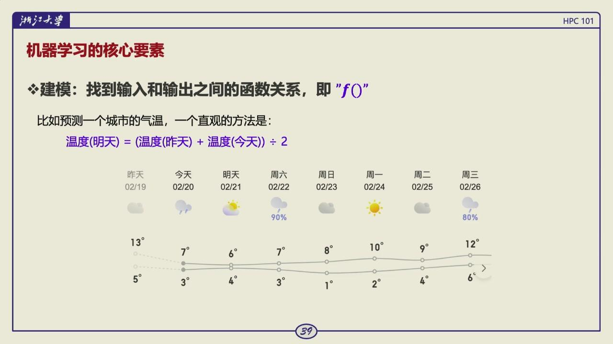

*图：建模先定义输入、输出和参数化函数；训练数据负责估计参数，不能替代任务定义。*

模型复杂度要和问题匹配。若输入与输出关系近似线性，堆叠很深的网络只会增加训练成本和过拟合机会；若数据明显弯曲、分段或带有交互关系，一条直线又会留下系统性误差。数据质量、标签定义和评价指标往往比换一个更大模型更早决定结论是否可信。

## 数据集划分

课程把数据分成训练集、验证集、测试集和应用数据：

- 训练集用于拟合模型参数；
- 验证集用于选择模型、超参数、训练轮数等；
- 测试集只用于最后一次独立评估；
- 应用数据是真实部署时模型将面对的新数据。

可以把训练集理解为平时练习，验证集是反复模拟考试，测试集是最后不能提前看题的考试。若看着测试集结果不断改模型，测试集事实上已参与训练，报告的分数会过于乐观。

数据泄露的形式不止把测试样本直接放进训练集。若按病人划分前就做归一化统计，测试病人的信息已经影响了训练用的均值和方差；若按时间预测天气却随机打乱后划分，模型可能利用未来信息；若同一用户的多条记录分别落在训练集和测试集，测试集也不再是完全独立的新用户。这些情况都让评估分数好看，部署效果却变差。

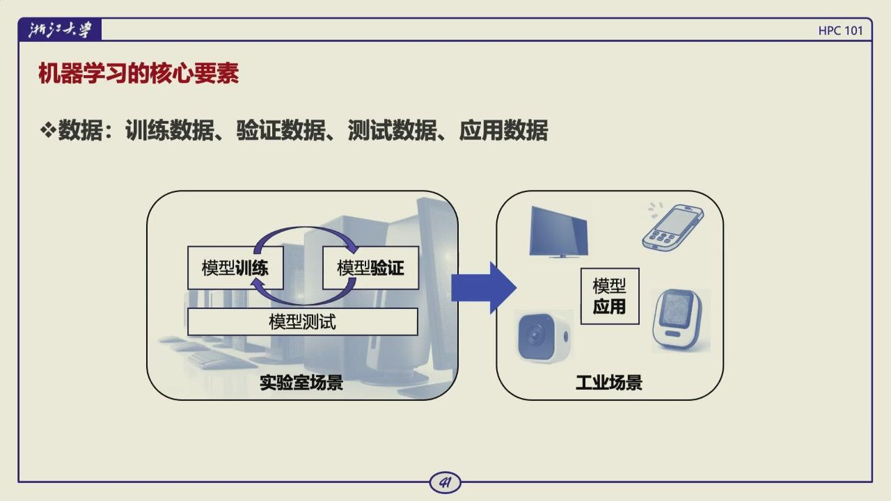

*图：四类数据各司其职；训练集拟合参数、验证集调超参数、测试集只做最后评估、应用数据是部署时真正面临的新输入。*

形式上，一个监督学习数据集可写为 $D=\{(x_1,y_1),\ldots,(x_n,y_n)\}$。每个 $x_i$ 是一行输入特征，$y_i$ 是它的标签。训练集通常占较大部分，因为参数需要足够多的样本来估计；验证集和测试集的比例并没有放之四海皆准的答案。课件给出 60%--80%、10%--20%、10%--20% 的常见范围。数据量很小的时候，硬切出很大的测试集会让训练更不稳定，后面要用交叉验证缓解这种问题。

### 数据泄露

训练/测试的样本即使文件名不同，也可能高度相关。例如同一个人的多张相似照片、一段时间序列切出的相邻窗口、同一病人的多次记录，不能随意随机分到两边。模型在训练时已经看过非常接近的信息，测试分数就不代表面对真正新对象的能力。

划分时要保证独立性，并使训练和应用的分布尽量一致。按人、按设备、按时间或按场景分组，有时比简单随机切分更合理。所谓数据泄露，不只是把标签列放进特征，也包括这种不应跨集合的关联。

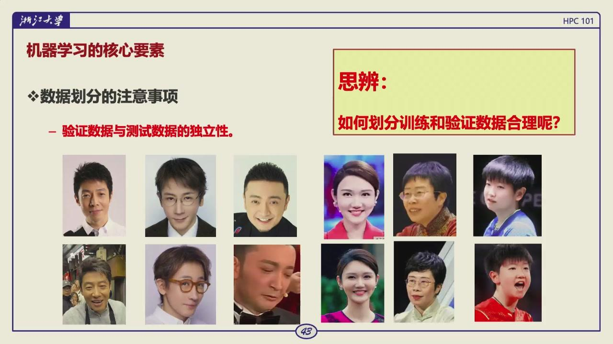

*图：划分单位应服从真实部署的新样本；按人、按时间或按场景分组常比简单随机更合理。*

一个例子用同一人的不同照片来说明这一点。若训练集中已经有某人的多张正面照，测试集中再放同一个人换角度的照片，模型可能靠背景、脸部细节或拍摄条件取得很高分，实际却没有学会识别新的人。医学数据常要按患者分组，传感器数据常要按设备或采集批次分组，时间序列则通常用过去训练、未来测试。划分单位应当服从部署时真正面对的新样本是什么。

### 留出法与交叉验证

数据足够多时，可留出一部分，例如 80% 训练、20% 测试，再从训练部分划出验证集。数据很少时，单次划分的偶然性很大，可用 $K$ 折交叉验证：分成 $K$ 份，每次用一份验证/测试、其余训练，最后平均多个结果。

交叉验证能更充分利用小数据集，但成本是训练 $K$ 次。无论采用哪种方法，最后仍应保留一份完全不参与调参的测试数据，作为最终报告依据。

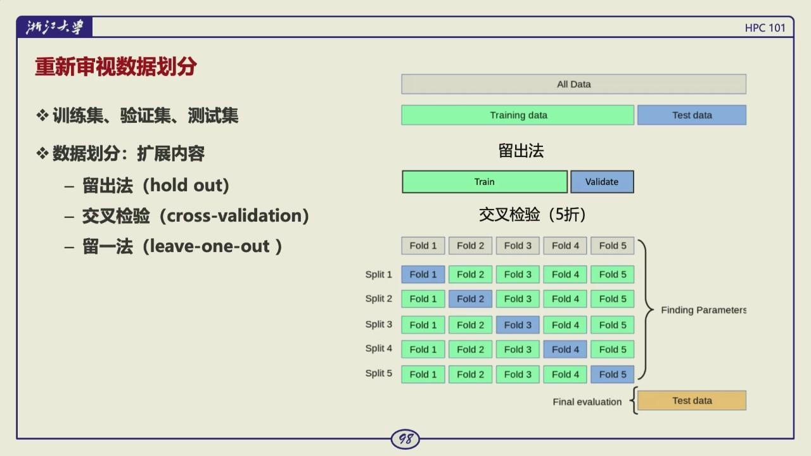

*图：交叉验证反复轮换训练/验证折，用于减小小数据集单次划分的偶然性；最终测试集仍不参与调参。*

!!! question "思考题"

    为什么验证集分数变好不代表测试集一定变好？如果反复用验证集调模型，它承担了什么角色？

    ??? tip "答案"

        验证集用于选择模型和超参数。反复根据它的分数调整，会把验证集的信息泄漏进决策，分数逐渐偏向乐观估计。它从“独立评估”变成“训练过程的一部分”。测试集应只在最后使用，且不能参与模型选择、阈值调优或预处理统计的计算。

!!! question "思考题"

    为什么不能把测试集里的样本拿来帮助选择模型？

    ??? tip "答案"

        测试集的意义是估计模型在未见数据上的表现。一旦参与选择，它的信息就进入决策，分数会偏乐观。应从训练集中再划出验证集用于调参，测试集只在最后评估一次。

!!! question "思考题"

    为什么计算均值和标准差时只能用训练集？如果用全集统计后再划分，会留下什么问题？

    ??? tip "答案"

        全集统计把测试样本的分布信息带进了预处理参数。模型训练时虽然只看训练样本，但输入已经被测试集影响过，评估不再独立。这属于数据泄露，常见于归一化、特征选择和缺失值填充等步骤。

## 回归

最简单的一元线性回归写成：

$$
\hat y=wx+b
$$

$w$ 是斜率，$b$ 是截距。多特征时写成 $\hat y=w^Tx+b$。真实数据通常不能被一条线穿过；训练的任务是选出一条总体上误差较小的线。

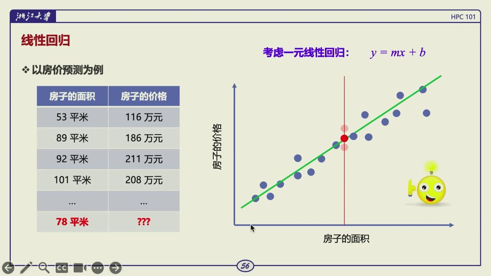

*图：特征（面积）与标签（价格）成对出现，线性回归找一条使总体误差最小的直线。*

这里的 $w$ 是训练数据上估出来的参数，它随数据变化，本身没有每平方米绝对值多少钱这类固定含义。若面积单位换成平方厘米，$w$ 的数值会相应变化；若加入位置、楼层、建成年份，模型会变为多元回归，每个特征各有一个权重。把不同量纲的特征直接放在一起时，常常还需要标准化，避免某一列的数值范围压过其他特征，也让梯度下降更容易稳定。

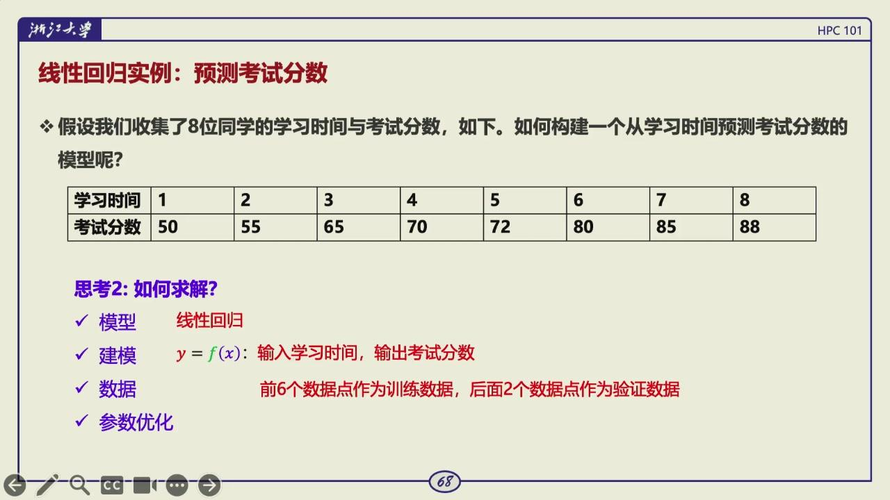

*图：回归实例把抽象公式落到学习时间 → 考试分数的样本表上，便于对照预测与真实标签。*

常用损失为均方误差：

$$
\mathrm{MSE}(w,b)=\frac{1}{n}\sum_{i=1}^n(\hat y_i-y_i)^2
$$

误差平方后，大偏差受到更大惩罚，也避免正负误差互相抵消。对线性回归，最小二乘法可直接求解；也可以和更一般的模型一样用梯度下降优化。

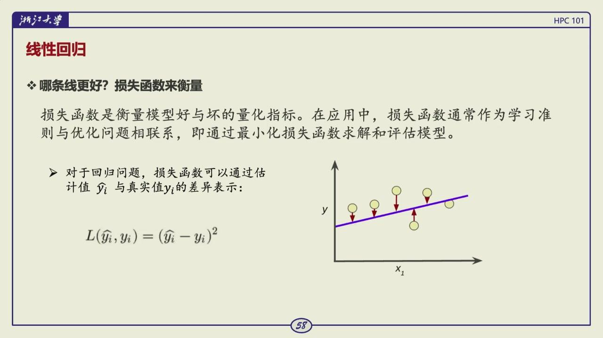

*图：平方损失让较大的残差承担更高代价，并把整批样本压缩成一个可优化标量。*

如果只有一个特征和截距，最小二乘法能通过令损失对 $w,b$ 的偏导数为零，直接解出一组参数。课堂没有要求手推这套公式，理解它的地位就够了。线性模型结构简单时可以解析求解；模型一复杂，往往就没有这样的闭式解，只能靠后面介绍的迭代优化。两条候选直线看上去都差不多时，损失函数提供了统一的比较标准。

线性回归不能包办所有曲线问题。作图看数据是必要步骤。若关系是弯曲的，可增加合理的非线性特征，例如 $x^2$，或选择适合的非线性模型。加入 $x^2$ 后，对参数仍然是线性的：$\hat y=w_1x+w_2x^2+b$，所以它仍可用线性回归训练。这里的线性指参数以线性方式出现，不要求输入和输出的图形一定是一条直线。

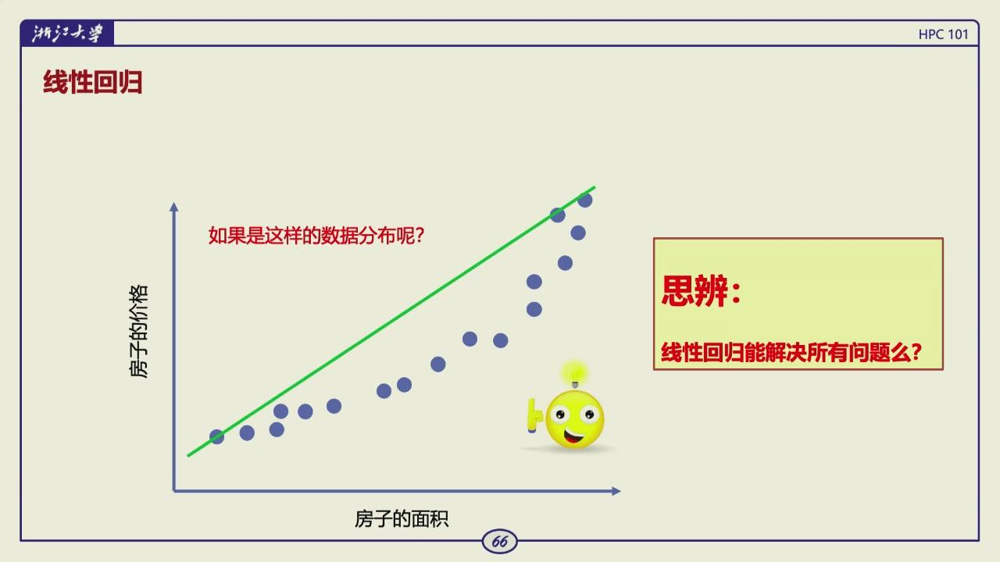

*图：残差若随输入呈现规律，说明误差并非纯噪声，线性特征可能没有表达真实趋势。*

异常值会显著拉动最小二乘拟合的直线。因此应先追问异常点是录入错误、测量噪声、少见但真实的对象，还是任务本来就应覆盖的情形；不能只为了让图更好看而删除它。不同结论会导致不同的数据清洗或鲁棒回归选择。

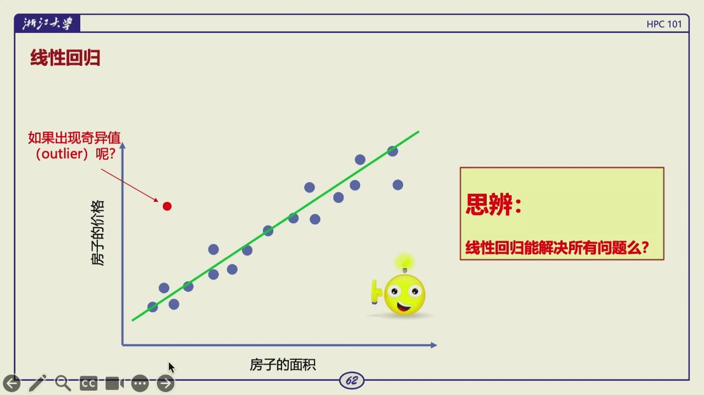

*图：少数远离主体的异常点会明显改变最小二乘直线；处理前先判断它的来源，再决定清洗还是用鲁棒方法。*

!!! question "思考题"

    平方误差为什么对离群点敏感？什么时候这会成为实际问题？

    ??? tip "答案"

        平方误差把误差平方，远距离样本的影响按平方放大，少数异常房价或测量错误可能主导梯度。若任务更关心多数样本或希望对异常稳健，可以检查数据、截断目标、改用 Huber 等损失，或明确任务本身确实要重罚大误差。

## 分类与概率输出

二分类常从线性得分开始：$z=w^Tx+b$。但 $z$ 可取任意实数，不能直接当概率，因此用 sigmoid 映射：

$$
\sigma(z)=\frac{1}{1+e^{-z}},\qquad p(y=1\mid x)=\sigma(z)
$$

这就是逻辑回归。名字中有回归，任务却是分类：模型先输出属于正类的概率，再按阈值作决定。阈值不必固定为 0.5；漏报和误报的代价不同，阈值就应不同。

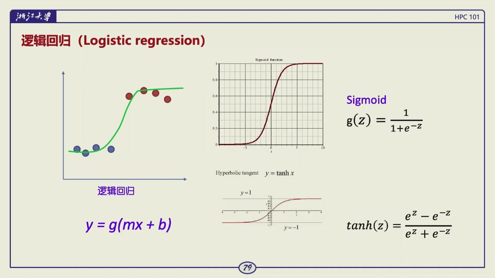

*图：线性得分没有概率范围，sigmoid 将其映射为正类概率；阈值再把概率转成决策。*

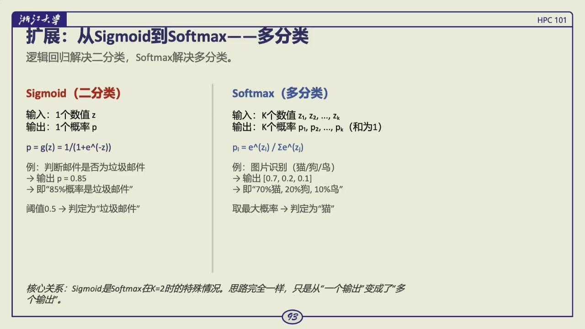

*图：二分类用 sigmoid 压出单个概率；多分类改由 softmax 对多个类别输出一组和为 1 的概率。*

以购买意愿为例，年龄和收入可以组成特征 $x=(x_1,x_2)$，模型计算 $z=\theta_0+\theta_1x_1+\theta_2x_2$，再得到 $p=\sigma(z)$。若业务把 0.5 作为阈值，$p\ge0.5$ 判为购买。这个阈值只是一种决策规则，不是概率模型自己决定的。医疗筛查常希望少漏掉阳性样本，会把阈值降低；人工复核昂贵或误报代价很高时，阈值又可能提高。调阈值时必须在验证集上观察精确率、召回率等指标，不能只盯总体准确率。

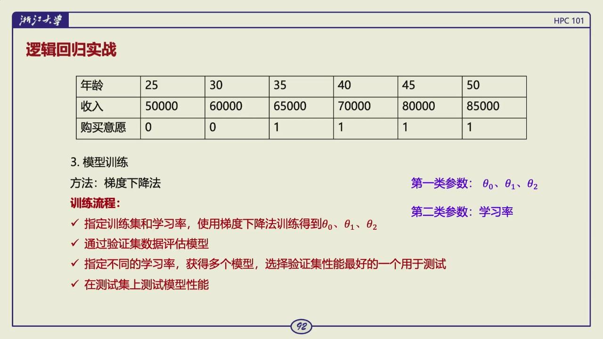

*图：真实表格数据进入逻辑回归的形态——一批特征（年龄、收入）对应一个二分类标签（购买意愿）。*

### 决策边界

对于两个特征，$z=\theta_0+\theta_1x_1+\theta_2x_2=0$ 在平面上是一条直线。sigmoid 在 $z=0$ 时恰好输出 0.5，所以这条直线就是阈值为 0.5 时的决策边界。边界一侧的点概率大于 0.5，另一侧小于 0.5。特征更多时，人无法把边界画出来，但几何含义不变：线性组合把输入空间划成两个半空间。

这也说明逻辑回归能够解决的范围。它的输入到概率的关系是 S 形的，决策边界对原始特征却仍是线性的。若两类样本像同心圆一样交错，单条直线分不开，可以加入 $x_1^2,x_2^2,x_1x_2$ 等特征，或者改用更复杂的模型。模型名称里带线性并不代表只能处理直线外观的数据；决定边界形状的是送入模型的特征空间。

??? info "什么是 TP、FP、FN？"

    二分类评估要先约定“正类”。以购买意愿为例，若把“会购买”作为正类，验证集中每个样本都会落入下面四类之一：

    | 缩写 | 英文 | 真实标签 | 模型判断 | 通俗含义 |
    | --- | --- | --- | --- | --- |
    | TP | true positive | 会购买 | 判为购买 | 真会买的人被找到了 |
    | FP | false positive | 不会购买 | 判为购买 | 误报，把不会买的人当成会买 |
    | FN | false negative | 会购买 | 判为不会购买 | 漏报，真会买的人被漏掉 |
    | TN | true negative | 不会购买 | 判为不会购买 | 不会买的人被正确排除 |

    精确率（precision）是 $TP/(TP+FP)$，问的是模型判为购买的人里，真正会买的占多少。召回率（recall）是 $TP/(TP+FN)$，问的是真正会买的人里，模型找到了多少。两者的分母不同，所以一个高并不保证另一个也高。

分类数据还要检查标签是否可信。购买意愿按点击、加购还是成交定义，会得到不同任务；人工标注不一致会形成噪声。类别极不均衡时，准确率可能掩盖问题，应结合精确率、召回率和错误代价选择阈值。阈值越高，误报通常越少，漏报也可能更多。

多分类把多个类别的得分经 softmax 归一化：

$$
p_k=\frac{e^{z_k}}{\sum_j e^{z_j}}
$$

每个 $p_k$ 在 0 到 1 之间，全部类别概率和为 1。二分类 sigmoid 可看作两类 softmax 的特例。

softmax 的指数会放大得分差距，也带来数值计算问题。实践中通常先从所有 $z_k$ 中减去最大值再取指数：

$$
\operatorname{softmax}(z)_k=
\frac{e^{z_k-\max_jz_j}}{\sum_j e^{z_j-\max_jz_j}}.
$$

分子分母同时乘以同一常数不会改变结果，却能避免 $e^{z_k}$ 因为 $z_k$ 很大而溢出。这个小技巧说明，公式成立和程序稳定运行之间还有一道工程关卡。深度学习框架常把 softmax 与交叉熵合成一个稳定算子，避免先得到接近零的概率、再单独取对数。

!!! question "思考题"

    二分类模型输出 0.73，人工设定的判定阈值是 0.50。这个 0.73 是概率吗？阈值又由什么决定？

    ??? tip "答案"

        若输出层经过 sigmoid，0.73 可以解释为模型预测的正类概率。阈值是把概率变成标签的决策规则，不一定取 0.50。召回更重要时可以降低阈值，误报代价更高时可以提高阈值，最终应通过验证集上的业务指标选择。

## 交叉熵与 NLL

交叉熵先看模型给真实答案多少概率，再对这个概率取负对数。设真实类别是 $k$，模型经 softmax 输出的类别概率为 $q_k$，这一个样本的交叉熵就是

$$
L=-\log q_k.
$$

若把真实标签写成 one-hot 向量 $y$，同一个式子可以写成

$$
L=-\sum_i y_i\log q_i.
$$

因为只有一个 $y_i$ 是 1，其余全是 0，所以最后仍只剩 $-\log q_k$。这里的 $\log$ 通常以 $e$ 为底，概率越小，负对数越大。

| 模型给正确类别的概率 | 交叉熵 |
| --- | ---: |
| 0.01 | 4.61 |
| 0.10 | 2.30 |
| 0.50 | 0.69 |
| 0.90 | 0.11 |

两个模型可能都把类别选对，但一个给正确类别 0.9，另一个只给 0.3。只数错误个数时二者相同；交叉熵会让前者损失更小，也让后者知道正确答案的概率还不够高。

逻辑回归的二元形式是它的特例。若 $p$ 表示正类概率，标签 $y\in\{0,1\}$，则

$$
L=-[y\log p+(1-y)\log(1-p)].
$$

若真实标签是 1、模型给出很小的 $p$，损失会很大；模型对正确类别越自信，损失越小。这个损失与概率模型匹配，且其梯度在 sigmoid 饱和区域的行为通常比 MSE 更适合优化。

对单个正样本 $y=1$，损失化为 $-\log p$。当模型给出 $p=0.9$ 时，损失较小；若自信地给出 $p=0.01$，$-\log p$ 会很大。负样本的情况正好对应 $-\log(1-p)$。这种设计会特别惩罚方向错而且非常自信的预测，和分类概率的含义吻合。

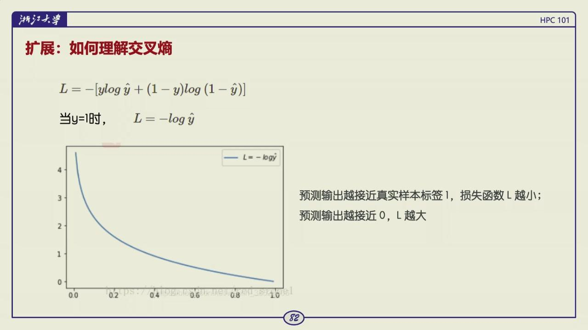

*图：真实类别概率趋近 0 时，负对数损失迅速增大；正确且自信时损失趋近 0。*

损失函数不只是用来评分的一个公式。它决定训练时参数朝什么方向更新，也决定模型会重视哪类错误。回归、分类、类别不平衡、异常值敏感的任务，都可能需要不同损失。

还有个优化上的原因。sigmoid 两端趋于平坦，导数接近零。若对 sigmoid 后的概率使用均方误差，链式求导会额外乘上这个很小的导数；模型即使犯了严重错误，也可能得到很弱的更新信号。二元交叉熵和 sigmoid 配合时，输出层对线性得分的梯度可化简为 $p-y$，错误越大，校正信号通常越直接。这是逻辑回归把交叉熵作为默认损失的原因。

语言模型训练用的也是这个损失。每个位置的真实下一个 token 是类别 $k$，模型对词表做 softmax 得到 $q_k$，就用 $-\log q_k$ 训练。对 batch 内所有 token 取平均，通常称为 NLL[^nll]（negative log-likelihood）。量化后仍用平均 NLL 检查模型是否为真实文本分配接近的概率；速度或显存改善不能替代这项质量检查。

!!! question "思考题"

    语言模型每个位置为什么可以看成分类问题？为什么用交叉熵训练，而不是只统计下一个 token 是否猜对？

    ??? tip "答案"

        词表里的每个 token 都是一个候选类别，真实下一个 token 是正确类别。softmax 输出整个词表上的概率，交叉熵就是 $-\log q_k$。只统计猜对或猜错没有连续梯度，也无法区分“正确 token 概率 0.4”和“概率 0.001”的差别；交叉熵会强烈惩罚后一种情况。

[^nll]: negative log-likelihood，真实标签概率的负对数，语言模型常用的平均损失。

??? example "交叉熵为何只看真实 token"

    关键在 **one-hot 编码**，它表示只有目标位置是 1、其余都是 0 的一种向量形式。比如词表里 `cat` 是第 3 个词，那么下一个词是 cat 这个标签的 one-hot 向量在第 3 位是 1、其它位全是 0。

    于是词表大小可以是数万，某个位置真实标签为 `cat` 时，one-hot 标签在 `cat` 位置为 1、其余位置为 0；交叉熵相乘后也只留下 `-log p(cat)`。模型给 `cat` 的概率从 0.1 提高到 0.5，损失从约 2.30 降到约 0.69，因此它直接惩罚真实下一个 token 概率太低。

## 梯度下降

损失是参数的函数。梯度 $\nabla_\theta L$ 指向当前位置上升最快的方向，因此沿反方向更新：

$$
\theta\leftarrow\theta-\eta\nabla_\theta L
$$

$\eta$ 是学习率。训练的基本循环是，取一批训练样本，前向计算预测和损失，反向计算梯度，更新参数，重复直到达到停止条件。批量梯度下降一次用全体样本；随机/小批量梯度下降一次用一个或一小批样本，后者是深度学习的常见做法。

可以用只有两个样本的一元回归把这一步算完整。设 $w=0,b=0$，学习率 $\eta=0.1$，样本为 $(x,y)=(1,2)$ 和 $(2,3)$。前向预测是 $0,0$，残差是 $-2,-3$，梯度为

$$
\frac{\partial L}{\partial w}=\frac{1}{2}[(-2)\cdot1+(-3)\cdot2]=-4,\qquad
\frac{\partial L}{\partial b}=\frac{1}{2}[(-2)+(-3)]=-2.5.
$$

更新后 $w=0.4,b=0.25$，两个预测都向上移动。若学习率太大，下一次可能越过合适值来回震荡；若太小，收敛速度会很慢。

实际训练会先初始化参数，再重复计算当前 batch 的损失和梯度，按学习率更新，直到达到预定轮数或验证指标不再改善。这里的收敛只是一个停止准则：梯度很小、参数变化很小，或验证集表现已不再提高。对深度网络而言，找到一个足够好的点通常比证明找到了全局最小值更重要。

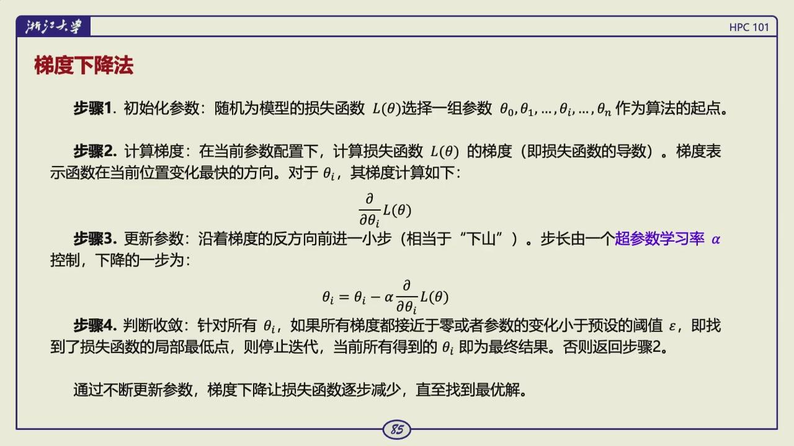

*图：梯度下降是初始化 → 算梯度 → 沿负梯度更新 → 重复的迭代，学习率决定每一步走多远。*

### 线性回归的梯度

一元线性回归的预测是 $\hat y_i=wx_i+b$，均方误差是各样本残差平方的平均。对 $w,b$ 求导可得：

$$
\frac{\partial L}{\partial w}=\frac{2}{n}\sum_{i=1}^n(\hat y_i-y_i)x_i,
\qquad
\frac{\partial L}{\partial b}=\frac{2}{n}\sum_{i=1}^n(\hat y_i-y_i).
$$

假如模型对大多数样本都预测得偏低，残差 $\hat y-y$ 大多为负，截距的梯度也会偏负；按减去梯度的规则更新后，$b$ 会增大，整条线向上移动。斜率的更新还要乘上 $x_i$，它会根据不同位置的误差决定线该变陡还是变缓。这个例子把抽象的沿负梯度走还原成了对预测误差的连续校正。

训练中常把一个完整遍历训练集称为一个 epoch。全批量梯度下降每个 epoch 只更新一次，梯度很稳定，却要等所有样本算完；随机梯度下降一次拿一个样本，更新频繁但噪声很大；小批量方法介于两者之间。GPU 擅长对一批样本做同形矩阵运算，所以实际深度学习常用几十到几千个样本组成 batch。batch 的选择会同时影响显存、吞吐、梯度噪声和训练轮数，不能孤立判断。

学习率过大可能越过低点、震荡甚至发散；过小则进展很慢。参数、学习率、网络层数、batch size、训练轮数等需要人为设置的量叫超参数；从数据中经训练得到的权重和偏置才是模型参数。验证集就是用来选择超参数的。

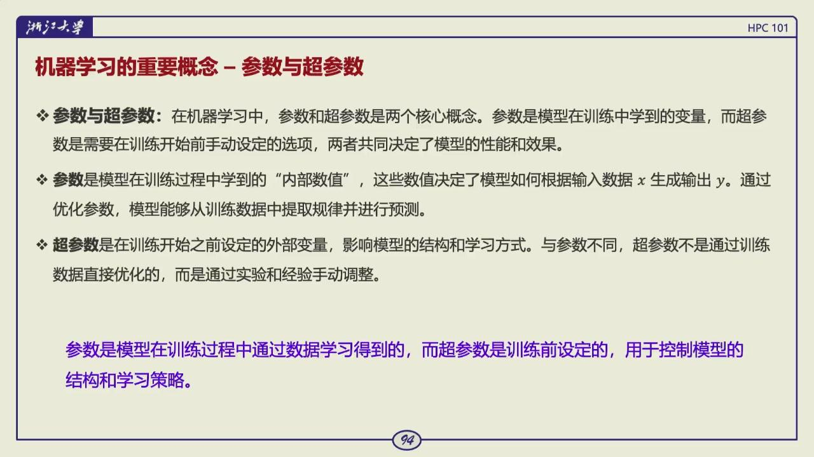

*图：分清谁由训练决定、谁由人来定，是用好验证集、避免把测试集当验证集的前提。*

这一区别很容易混淆。在线性回归 $\hat y=wx+b$ 中，$w,b$ 是参数，会随着训练数据自动变化；学习率、训练多少轮、使用多大的 batch 是超参数，训练程序不会凭空知道该取什么值。实践中常在验证集上比较几组超参数，确定方案后才在测试集上报告一次结果。反复看测试集再决定学习率，等于把测试集也变成了验证集。

batch 大小会同时影响显存、吞吐和梯度噪声；训练记录应保存数据版本、随机种子、模型、学习率计划和评估代码。训练损失下降而验证指标不动时，不应继续把它当作进步。

!!! question "思考题"

    学习率过大或过小分别会出现什么现象？为什么同一模型里不同参数也可能需要不同尺度？

    ??? tip "答案"

        学习率过大时，更新可能越过谷底，损失震荡甚至发散；过小时收敛很慢，可能停在平缓区域。特征尺度、参数初始值和损失面曲率不同，会让同一学习率对某些方向太慢、对另一些方向太快。归一化、自适应优化器和学习率调度都是针对这个问题。

!!! question "思考题"

    梯度下降里的一步更新是 $\theta \leftarrow \theta - \eta\nabla L(\theta)$。这个式子中每个符号对应代码里的什么对象？

    ??? tip "答案"

        $\theta$ 是待训练参数，$\nabla L$ 是反向传播得到的梯度，$\eta$ 是学习率。一次 `optimizer.step()` 通常就是按这个式子把每个参数沿着负梯度方向移动。梯度的模长指示当前位置的坡度，学习率决定这一步走多远。

## 过拟合与欠拟合

训练集损失持续下降，不代表模型在新数据上更好。若训练集越来越好、验证集先好后坏，模型开始记住训练样本的偶然细节，这就是过拟合。若训练和验证都不好，则可能是欠拟合：模型表达能力不足、特征不足、训练不够或优化失败。

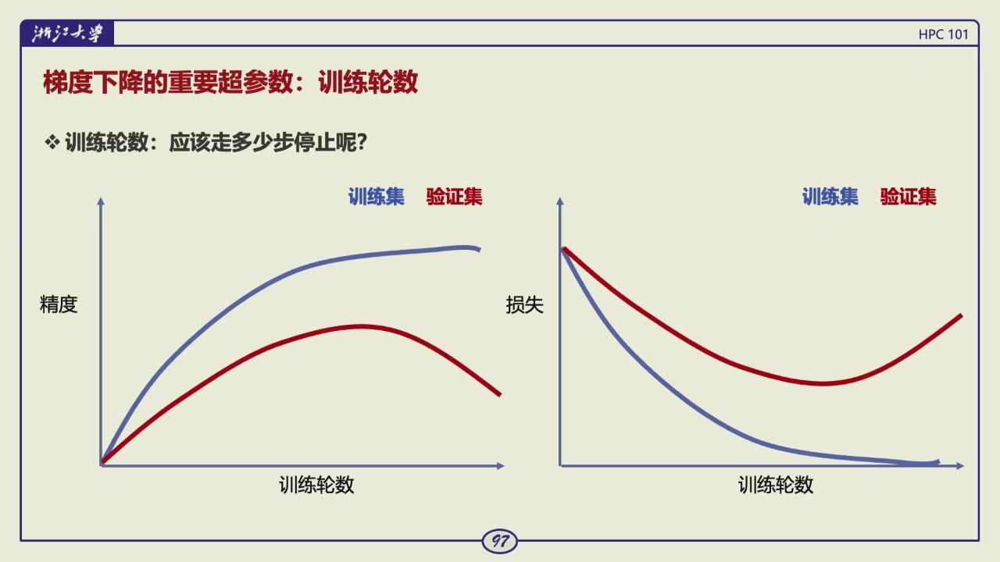

*图：训练曲线回答拟合程度，验证曲线回答泛化；两者分离的位置可用于 early stopping。*

把训练轮数也看作超参数。训练损失下降、验证损失回升时，模型开始记住训练样本的偶然细节，可用 early stopping 保留验证集最好的 checkpoint。过拟合通常从有效数据、数据划分、模型容量、正则化和训练时长几个方向处理；标签错误和泄露仍要回到数据层修正。

正则化的形式也能说明它在做什么。L2 正则常写为

$$
L_{\text{total}}=L_{\text{data}}+\lambda\lVert w\rVert_2^2.
$$

它在贴合训练数据之外，对过大的权重另加代价。$\lambda$ 太小作用不明显，太大又可能把真正需要的关系压平，所以它本身也是要在验证集上选择的超参数。L1 正则使用权重绝对值和，常会得到更多接近零的权重。两者都只能在数据和任务定义合理的前提下发挥作用。

!!! question "思考题"

    训练损失继续下降，验证损失开始上升，这说明模型正在发生什么？

    ??? tip "答案"

        模型正在记住训练样本中的偶然细节，泛化能力开始变差，这是过拟合的典型信号。可以增加数据、正则化、早停、简化模型或改进数据划分。若训练损失也高，才更像欠拟合。

## 神经网络与 Transformer

神经网络把线性变换和非线性激活多层组合，能表达更复杂的输入输出关系；反向传播[^backward-pass]高效计算各层参数的梯度。Transformer 通过注意力机制处理序列关系，成为现代大语言模型等系统的基础结构。它们仍沿用同一套流程，训练/验证/测试要划分，损失要定义，参数要优化，泛化要检查。

[^backward-pass]: 从损失算出参数梯度的反向传播。

可以把一层神经网络看成 $h=\phi(Wx+b)$：$W x+b$ 和线性回归一样先做加权组合，$\phi$ 再提供非线性。层层组合后，模型可以表达弯曲的边界和层次化特征。反向传播只是利用链式法则，把最终损失对各层参数的影响从输出端高效地传回去；梯度下降依然是那个更新规则。

从线性模型过渡到神经网络时，最该抓住的是**组合**。若连续堆叠多层线性变换，中间没有激活函数，整体仍可合并为一次线性变换，表达能力并没有本质增加。ReLU、sigmoid、tanh 等激活函数在层间引入非线性，网络才可以把简单的线性切分组合成更复杂的函数。隐藏层中的数值通常没有一个固定的人类语义，它们是为降低损失而形成的中间表示。

前向传播[^forward-pass]从输入一路算到输出：图像经过若干卷积/注意力层得到分类概率，文本 token 经过嵌入和 Transformer block 得到下一个 token 的分布。反向传播从损失出发，利用链式法则依次计算每一层参数的梯度。它没有反着运行模型，而是在复用前向保存的中间值，高效求出所有偏导数。这也解释了训练时 activation 为什么占显存：没有这些中间量，反向求导就要重新计算或无法继续。

[^forward-pass]: 从输入算到预测的前向传播。

深层网络的训练还会遇到梯度消失、梯度爆炸和数值精度问题。sigmoid 在两端导数很小，层数增加后许多导数相乘可能使早期层几乎收不到更新；残差连接[^residual]、合理初始化、归一化层[^norm]和更合适的激活函数都是为了保持信号和梯度的尺度。它们不是脱离这一节的另一套魔法，仍是在改善损失能否稳定地把信息传到参数这个基本过程。

[^residual]: 把子层输出加回输入，给信息和梯度留下直通路径。

[^norm]: normalization，调整每个 token 向量内部数值尺度，让深层计算更稳定。

卷积网络和 Transformer 可以看作不同的数据结构偏好。卷积用局部共享的滤波器处理网格状图像，利用相邻像素常有相关性的事实；Transformer 以 token 为单位建立可学习的注意力关系，较容易处理文本、序列和跨模态输入。选择结构时要问数据的组织方式、需要的上下文范围和计算成本，而不是只按模型名称的流行程度选择。

模型输出层要和任务相接。回归常直接输出实数，二分类常接 sigmoid，多分类常接 softmax；中间层的激活函数则服务于表示能力和训练稳定性。把一个二分类标签直接当作连续房价去优化，或把连续目标硬套 softmax，都会让损失和任务含义错位。设计网络之前先把目标、输出形式和评价指标写清，能避免许多后续的调参迷路。

反向传播在代码中通常由自动微分系统完成，但理解计算图仍很有用。每个张量操作都会记录它如何由前面的张量得到；调用反向传播时，框架按依赖的反方向累积梯度；优化器读取这些梯度更新参数。由于梯度会累积，实际训练循环中需要在每个 step 前清零；由于评估不需要梯度，应切换到推理模式、关闭梯度记录，以节约显存并避免某些层的行为差异。

token 不是完整的词。它可能是英文词的一部分、一个汉字、一个标点，或经过字节级切分得到的片段。tokenizer 的词表给每个 token 一个编号，embedding 表的每一行正好对应一个编号。若词表大小为 $V$、隐藏维度为 $d$，embedding 表就是一个 $V\times d$ 的矩阵。输入序列 `[4, 18, 7]` 查表后得到 $3\times d$ 的矩阵，矩阵第 1 行就是编号 4 对应的向量。

位置编码可以和 embedding 相加，也可以作为独立信息进入 attention。没有位置信息时，“猫追狗”和“狗追猫”的 token 集合相同，模型无法区分两个词的主语和宾语关系。位置信息的加入让第 2 个“狗”和第 4 个“狗”即使使用同一行 embedding，也能在序列中携带不同的上下文含义。

UvA Deep Learning 教程中的结构图把 Transformer block 的常见组件放在同一张图里。左路负责输入表示和多头注意力，右路是前馈网络，中间的残差与归一化把两条子层的输出稳定地合回主干。以后读模型代码时，可以把每一行张量操作按这张图归类，知道它属于投影、注意力计算、FFN[^ffn] 还是残差连接。

[^ffn]:
    feed-forward network / multilayer perceptron，对每个 token 独立执行的前馈网络，通常由两次矩阵乘和非线性函数组成。

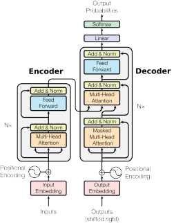

*图：结构图中的每个方框对应代码中的一组矩阵乘或逐元素操作；分清子层以后，公式中的每个符号都有固定位置。[来源：UvA Deep Learning Tutorials](https://uvadlc-notebooks.readthedocs.io/en/latest/tutorial_notebooks/tutorial6/Transformers_and_MHAttention.html)*

Transformer 也没有跳出这条线。文本先被切成 token[^tokenizer] 并编码为编号；模型查表后把每个 token 变成一行长度为 $d$ 的数。若一次输入有 $T$ 个 token，最常见的表示就是一个 $T\times d$ 的矩阵 $X$。第 $t$ 行 $x_t$ 不需要被解释成某个固定的人类概念，它是这个位置在当前层携带的隐藏状态[^hidden-state]。后面的计算就是反复读入、更新和写出这些行。

[^tokenizer]: 把原始文本切成 token 并映射为编号的规则和词表。

[^hidden-state]: 某一层里表示某个 token 及其上下文的向量。

attention 让一个位置根据其他位置的表示更新自己，随后经过前馈网络和多层堆叠；训练语言模型时，目标仍是预测正确的下一个 token，常用损失仍是交叉熵。参数更多、数据更多、训练硬件更强，并不能掩盖基础问题。一个测试集泄露、指标不匹配或数据分布漂移的问题，不会因为模型更大而消失。

下面用四个 token 说明一次前向传播的张量流。设 batch 为 1，序列长 $T=4$，隐藏维度 $d=6$。输入先是 token 编号 `[5, 12, 8, 3]`，查 embedding 得到

```text
X: [1, 4, 6]
第 1 行 = token 5 的隐藏向量
第 2 行 = token 12 的隐藏向量
第 3 行 = token 8 的隐藏向量
第 4 行 = token 3 的隐藏向量
```

经过第 1 个 Transformer block 后仍是 `[1, 4, 6]`。行数没有变，因为每个 token 在层内更新自己的表示；列数没有变，因为残差连接要求子层输出能直接加回输入。第 24 层输出的最后一行可投影成 `[1, V]` 的 logits，经 softmax 得到下一个 token 的概率分布。

### Attention 与 FFN

Transformer block 可以先拆成 attention 和 FFN（feed-forward network）。attention 处理这个 token 应从哪些位置取信息；FFN 不在这一步混合不同 token，它对每一行隐藏向量各自做一次更宽的非线性变换。忽略归一化和残差连接时，一个普通 FFN 常写成

$$
H=\phi(XW_{\mathrm{up}}+b_{\mathrm{up}}),\qquad
Y=HW_{\mathrm{down}}+b_{\mathrm{down}}.
$$

若 $X\in\mathbb{R}^{T\times d}$，则 $W_{\mathrm{up}}\in\mathbb{R}^{d\times h}$ 会把每行从 $d$ 维投影到更宽的 $h$ 维；激活函数 $\phi$ 对元素分别计算；$W_{\mathrm{down}}\in\mathbb{R}^{h\times d}$ 再把它投回 $d$ 维。不同模型可能采用 GELU、SiLU 或门控结构，代码中的细节会变，但矩阵乘法、逐元素非线性、再一次矩阵乘法的主干不变。

一个极小的 FFN 数值例子能帮助把矩阵乘还原成标量计算。设某个 token 的输入向量 $x=[1,2]$，权重

$$
W_{\mathrm{up}}=
\begin{bmatrix}1&0\\2&1\end{bmatrix},
\qquad
W_{\mathrm{down}}=
\begin{bmatrix}1&1\\0&2\end{bmatrix}.
$$

先算 $h=xW_{\mathrm{up}}=[5,2]$，若激活函数是 ReLU，则所有负数清零、正数保留，这里仍为 $[5,2]$；再算 $y=hW_{\mathrm{down}}=[5,9]$。如果 batch 里有 8 个 token，每个 token 都做同样的两步，张量形状就从 `[8, 2]` 变为 `[8, 2]`。GPU 的收益正来自把 8 行一起交给矩阵乘法库，而不是循环执行 8 次小向量运算。

从一个元素看，第一步就是点积：

$$
H_{tj}=\sum_{i=0}^{d-1}X_{ti}(W_{\mathrm{up}})_{ij}.
$$

它把第 $t$ 行输入的所有特征按权重混合起来。把多个 token 同时放进 $X$，就是矩阵乘法而不是许多孤立的标量计算，SIMD、AMX、GPU Tensor Core 和矩阵库优化的对象正是这种成块的矩阵乘。矩阵的行对应 token，列对应特征或中间维度。读模型代码时先把张量形状写下来，很多看似复杂的 `reshape`、`transpose` 和 batch 维度才有落脚处。

MoE 是 FFN 的一种变体：每行不再通过同一个 FFN，而是由 router 选择少数几个 expert FFN，再按权重合并结果。它仍建立在每个 token 是一行向量、FFN 是规则矩阵计算之上；token 按 expert 分组后会形成数据重排、通信和负载均衡问题。

注意力可以先理解为按内容取信息。一个 token 的 query 与其它位置的 key 比较得到权重，再对对应 value 加权求和。这样同一个词在不同上下文中可以关注不同位置。自回归语言模型使用因果 mask，保证当前位置只能查看自己和前面的 token，不能偷看后面的正确答案。大规模执行时，矩阵计算、KV cache 和设备间通信共同决定吞吐。

!!! question "思考题"

    attention 和 FFN 分别混合序列中的什么信息？

    ??? tip "答案"

        attention 沿序列维度工作，让当前 token 根据相似度从其他 token 取信息。FFN 对每个 token 的隐藏向量独立做两次矩阵投影和非线性变换，不在这一层混合不同 token。两者分工不同，常常交替堆叠。

### Q、K、V 与注意力矩阵

设输入隐藏状态为 $X\in\mathbb{R}^{T\times d}$，一层 attention 先用三组权重做线性投影：

$$
Q=XW_Q,\qquad K=XW_K,\qquad V=XW_V.
$$

每一行仍对应一个 token。可以把 query 理解为当前位置想找什么，key 理解为当前位置提供什么索引，value 则是被取走的内容。这个说法只是帮助记忆，真正参与计算的是三张矩阵。

UvA 教程的注意力示例图把 query、key、value 三路投影画得很直观。同一份输入分别经过三个权重矩阵，得到 Q、K、V；Q 用来发起查询，K 用来响应查询，V 是被加权合并的内容。

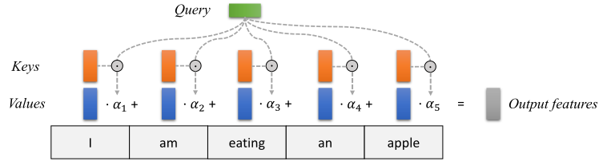

*图：Q、K、V 来自同一输入经过三组不同权重得到的三个矩阵；后续计算全部是矩阵乘、缩放、逐行 softmax 和加权求和。[来源：UvA Deep Learning Tutorials](https://uvadlc-notebooks.readthedocs.io/en/latest/tutorial_notebooks/tutorial6/Transformers_and_MHAttention.html)*

设 $T=4,d=8$，单头时 $W_Q,W_K,W_V$ 都是 $8\times8$，三组投影后 Q、K、V 的形状都是 `[1, 4, 8]`。若模型有 4 个 head，通常把每个 head 的维度设为 $d_h=2$。把 Q 重排成 `[1, 4, 4, 2]` 后，计算 $QK^T$ 得到 `[1, 4, 4, 4]`；去掉 batch 和 head 两个维度，每个 head 的分数矩阵都是 `[4,4]`。这里最要紧的是明确矩阵乘法消掉了 head 维度 $d_h$，剩下的是 query 位置和 key 位置。

第 $t$ 个 query 和第 $j$ 个 key 的相似度是点积 $q_tk_j^T$。把所有 token 两两比较，得到 $T\times T$ 的分数矩阵：

$$
A=\frac{QK^T}{\sqrt{d_h}}.
$$

$d_h$ 是一个 head 的维度。除以 $\sqrt{d_h}$ 是为了避免维度变大时点积幅度也变大，softmax 过早变得极端。对每一行做 softmax 后，再与 $V$ 相乘：

UvA 教程的缩放点积注意力图把这段计算画成了一条流水线。Q 和 K 相乘得到分数，除以 $\sqrt{d_h}$，可选地加 mask，然后按行 softmax，最后乘 V 得到输出。

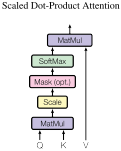

*图：虚线表示 mask 可插入的位置；softmax 作用在每一行上，含义是对同一个 query 的所有候选位置分配权重。[来源：UvA Deep Learning Tutorials](https://uvadlc-notebooks.readthedocs.io/en/latest/tutorial_notebooks/tutorial6/Transformers_and_MHAttention.html)*

softmax 的公式是

$$
p_i=\frac{\exp(a_i)}{\sum_j\exp(a_j)}.
$$

它把任意实数分数变成正数，并让同一行所有数相加为 1。若某一行分数为 `[2, 0, -1]`，softmax 后概率约为 `[0.844, 0.114, 0.042]`。这一行对应一个 query 对三个 key 的偏好，较大的分数得到较大权重，但不代表其它位置完全不能贡献。

!!! example "小游戏：手算一次加权求和"

    设三个位置的 value 分别为

    ```text
    v0 = [1, 0]
    v1 = [0, 2]
    v2 = [2, 1]
    ```

    上面的 softmax 权重是 `[0.844, 0.114, 0.042]`。写出这个 query 的输出。

    ```text
    output = 0.844×[1,0] + 0.114×[0,2] + 0.042×[2,1]
           = [0.928, 0.270]
    ```

    这一步就是 `softmax(A) × V` 中的一行。attention 的核心步骤是把相似度变成权重，再做一次加权矩阵乘。

$$
\operatorname{Attention}(Q,K,V)=\operatorname{softmax}(A)V.
$$

因此第 $t$ 行输出是所有 value 的加权和，权重由第 $t$ 个 token 与各位置 key 的匹配程度决定。若序列长为 $T$，显式的 $A$ 有 $T^2$ 个元素。这是长上下文为什么既有大量计算，也有显存和访存压力的起点。

自回归模型不允许第 $t$ 个位置读到未来 token。实现时会在 softmax 前给右上三角的非法位置加上一个非常小的值，等价于 $-\infty$；softmax 后这些位置的权重为 0。mask 不是训练时附加的装饰，它保证预测下一个 token 这件事没有偷看答案。推理时新的 token 本来就还没生成，因果性自然保留。

四个 token 的因果 mask 可以写成一个矩阵。行是 query 位置，列是 key 位置，1 表示允许看，0 表示禁止看：

```text
        key0 key1 key2 key3
query0   1    0    0    0
query1   1    1    0    0
query2   1    1    1    0
query3   1    1    1    1
```

训练时四个位置同时前向计算，位置 2 的正确标签是位置 3 的 token。如果不加 mask，位置 2 可以通过 attention 读到位置 3，训练损失会异常低，生成能力却没有真正学到。

多头注意力把 hidden dimension 切成若干 head，每个 head 使用自己的 $W_Q,W_K,W_V$。不同 head 可以学到不同的关联模式，随后把各 head 的输出拼接并再做一次投影。代码里常见的 `reshape`、`transpose` 往往只是在整理 `[batch, sequence, heads, head_dim]` 的维度顺序；读这类代码时，先标出哪一维是 sequence，哪一维是 head，远比盯着函数名有效。

UvA 教程的多头注意力图显示了拆分、并行计算和拼接的完整路径。

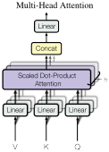

*图：多头注意力把隐藏维度分成多个子空间，每个 head 独立做 QKV 注意力，最后把输出拼接并投影回原维度。[来源：UvA Deep Learning Tutorials](https://uvadlc-notebooks.readthedocs.io/en/latest/tutorial_notebooks/tutorial6/Transformers_and_MHAttention.html)*

以 $B=2,T=5,H=8,h=4,d_h=2$ 为例，线性投影后的 Q 理论上是 `[2, 5, 8]`。代码常执行 `view(2, 5, 4, 2)`，再 transpose 成 `[2, 4, 5, 2]`。变换只改变解释方式，没有复制或重新计算数值；attention score 是 `[2, 4, 5, 5]`，输出在乘 V 后是 `[2, 4, 5, 2]`，最后 transpose 回 `[2, 5, 8]` 并乘输出投影 $W_O$。若实验里维度对不上，先在纸上画出这条形状链，通常比直接改代码更快定位。

!!! question "思考题"

    输入形状是 `[B,S,H]`，线性投影后 Q 的形状是 `[B,S,H]`，把它切成 8 个 head 后每个 head 的形状应写成什么？为什么最后能拼回 `[B,S,H]`？

    ??? tip "答案"

        每个 head 的形状是 `[B,S,H/8]`，也可以记成 `[B,8,S,H/8]`。每个 head 在自己的低维子空间里计算注意力，输出仍是每个 token 一个 `H/8` 维向量。把 8 个 head 在最后一维拼接，得到 `[B,S,H]`，再经过输出投影变换回模型隐藏维度。

!!! question "思考题"

    若 $Q$ 和 $K$ 都是 `[S, d]`，为什么 $QK^T$ 是 `[S, S]`？这个矩阵的行列各代表什么？

    ??? tip "答案"

        `[S, d]` 乘 `[d, S]` 得到 `[S, S]`。第 $i$ 行第 $j$ 列是第 $i$ 个 query 与第 $j$ 个 key 的点积分数。对每一行做 softmax 后，就得到第 $i$ 个 token 对所有位置的注意力权重。

!!! question "思考题"

    注意力分数在除以 $\sqrt{d_k}$ 后再 softmax。为什么需要这个缩放？去掉它可能带来什么现象？

    ??? tip "答案"

        $QK^T$ 是两个 $d_k$ 维向量的内积，维度越大，分数的方差通常越大。很大的分数经过 softmax 会接近 one-hot，梯度也容易变小。除以 $\sqrt{d_k}$ 把分数方差控制在相对稳定的范围，让训练更稳定。它不改变注意力矩阵的形状，只改变数值分布。

### 残差、归一化与一个 Block 的数据流

attention 和 FFN 都不会直接覆盖原输入。常见 block 把子层输出加回输入，形成残差连接：

$$
X' = X + \operatorname{Attention}(\operatorname{Norm}(X)),
\qquad
Y = X' + \operatorname{FFN}(\operatorname{Norm}(X')).
$$

残差给深层网络保留了一条较直接的信息和梯度路径。归一化层则把每个 token 内各特征的尺度维持在稳定范围附近，减少层间数值漂移。不同模型会使用 LayerNorm 或 RMSNorm，也可能调整 norm 放在子层前还是后；读代码时先抓住顺序：输入经过 norm，进入 attention 或 FFN，输出与原张量相加。

| 张量 | 常见 shape | 每一维的含义 |
| --- | --- | --- |
| block 输入/输出 | $[B,T,d]$ | batch、序列长度、隐藏维度 |
| Q/K/V | $[B,h,T,d_h]$ | 多头拆分后的序列表示 |
| attention 分数 | $[B,h,T,T]$ | 每个 head 中 token 两两比较 |
| FFN 中间激活 | $[B,T,d_{ff}]$ | 每个 token 独立扩展到更宽维度 |

训练时反向传播要保存许多中间量；推理不保存梯度，却要为每层保留已出现 token 的 K、V，这就是 KV cache 的来源。

大模型训练还会多一层数据与评估问题。预训练语料的来源、重复、质量和许可会影响模型能力；指令微调和偏好训练改变的是模型输出的行为倾向；基准集一旦长期被公开讨论，也可能以各种方式进入训练数据，导致评估被污染。规模让系统更强，同时也让数据治理、复现实验和失效分析更难。这些基础要求没有过时，反而更需要被严格执行。

!!! question "思考题"

    embedding 表的行数和列数分别由什么决定？

    ??? tip "答案"

        行数等于词表大小，每个 token 编号对应一行。列数是每个 token 的向量维度。输入 `[5, 12, 8]` 查表后得到三行向量，向量长度就是 embedding 的列数。

!!! question "思考题"

    残差连接为什么要求子层输出的形状能直接加回输入？

    ??? tip "答案"

        残差的计算是逐元素相加，两个张量每个维度的大小必须一致。若子层把隐藏维度改掉，就不能直接相加。常见做法是让 attention 和 FFN 输出都回到 `[B, T, d]`，再与原输入相加。
