# 07-16 下午：分布式大模型训练与推理

!!! abstract "与后续实验的联系"

    Lab 5 的量化和端到端推理依赖张量形状、显存账本、键值缓存（KV cache）和批处理。分布式训练还需要理解前向、反向、梯度同步和参数更新之间的关系。PyTorch DistributedDataParallel（DDP，分布式数据并行）、FSDP（Fully Sharded Data Parallel，完全分片数据并行）和 Hugging Face 的缓存文档可作为实现参考。[^pytorch-ddp] [^pytorch-fsdp] [^hf-cache]


模型、batch（批次）或上下文长度超过单张 GPU 的显存和吞吐范围后，训练与推理需要在多张卡之间分工。多卡方案的名字不同，首先改变的都是数据和状态的放置方式。

数据并行（data parallelism，DP）沿 batch 切分样本。ZeRO（Zero Redundancy Optimizer，零冗余优化器）和 FSDP 把模型状态分片保存。流水线并行（pipeline parallelism，PP）按层切分模型；张量并行（tensor parallelism，TP）在同一层内切分矩阵；上下文并行沿序列切分。

理解任一方案时，分别记录每张卡保存什么、负责计算什么，以及何时需要交换数据。[^megatron] [^zero-paper]

## 一次训练 step 在多卡上怎样进行

=== "1. 每张卡取得自己的数据"

    数据并行时，每个 rank（分布式作业中一个独立进程的编号）取得不同的 micro-batch，也就是从一个大 batch 再切出的样本子集。模型副本或参数分片已经由运行时放在对应 GPU 上。输入张量的 batch 维被切开，模型层内的 shape 规则保持不变。

=== "2. 前向与反向计算"

    每张卡执行前向计算，得到 logits（词表或类别上的原始分数）和 loss（衡量预测与标签差异的训练目标）。反向传播生成本地梯度。模型很大时，FSDP、TP 或 PP 会把参数和层计算分到多张卡上；单个训练 step 仍按前向、loss、反向的顺序进行。

=== "3. 交换必要数据"

    DP 需要规约梯度。FSDP 在计算某层前聚合必要参数，计算后再次分片。TP 在层内交换 activation（层与层之间传递的中间张量）或部分结果。PP 在相邻 stage 之间传递 activation 和梯度。

=== "4. 更新参数"

    参与同一同步训练步骤的 rank 使用一致的全局梯度，或使用与参数分片对应的梯度，更新优化器状态。随后进入下一个 batch。不同并行方式改变的是通信发生的时间和传输的张量。

!!! quote "PyTorch DistributedDataParallel 文档的说明（译）"

    DistributedDataParallel 将模型复制到多个进程，每个进程处理不同输入。反向传播期间，模块会同步梯度，使模型副本在更新后保持一致。[^pytorch-ddp]

## 自回归语言模型推理

语言模型读入提示词（prompt）后，根据已有 token 预测下一个 token。新 token 加回输入，再预测下一个；直到遇到结束符或达到长度上限。这种逐步生成称为自回归。token 是分词器切出的处理单位，可以是词片、汉字、标点或字节片段。embedding 把 token 编号查成向量，常见输入形状写作 $[B,S,H]$。

!!! quote "Hugging Face 缓存文档的说明（意译）"

    自回归生成会反复使用前面 token 已经得到的 key 和 value。将它们保存在键值缓存中，可以避免每一步重复计算整段历史；缓存大小会随序列长度增长。[^hf-cache]

| 维度 | 含义 |
| --- | --- |
| $B$ | batch size，一次并行处理的请求数 |
| $S$ | sequence length，当前序列的 token 数 |
| $H$ | hidden size，每个 token 的隐藏向量维度 |

Transformer 的自回归注意力（attention）、前馈网络（feed-forward network，FFN）和因果 mask 的基本结构以原论文为准。[^transformer-paper] 例如，$[2,16,4096]$ 表示两个请求，每个请求当前有 16 个 token，每个 token 是 4096 个浮点数。只看其中第 1 个请求时，可以去掉 batch 维，得到 $[16,4096]$。再取其中第 3 个 token，就得到长度为 4096 的向量。矩阵乘法中的许多形状错误，来自没有写明当前张量的各维含义。

!!! question "张量读法自测"

    一个日志中出现的张量形状是 `[3, 7, 1024]`。这三个数分别表示什么？去掉 batch 维后形状是什么？取出第 2 个请求的第 5 个 token 后形状是什么？

    ??? tip "详细答案"

        第一个维度 3 表示 batch 中有 3 个请求。第二个维度 7 表示每个请求当前有 7 个 token。最后一维 1024 表示每个 token 的隐藏向量长度。

        取出一个请求后，batch 维消失，形状为 `[7,1024]`。再取出该请求的一个 token 后，序列维也消失，形状为 `[1024]`。读分布式日志时按 batch、序列、hidden 这个顺序理解，能判断当前操作是在请求级、序列级还是 token 级。

把一个 batch 送入 Transformer 后，可先按下面的顺序理解张量如何变化。

1. embedding 查表将 token 编号变成 `[B,S,H]`。
2. attention 的线性投影把最后一维从 H 变成 Q、K、V 所需维度。
3. $QK^T$ 在每个 head 中产生 `[B,heads,S,S]` 的注意力分数。softmax 后再乘 V，张量形状回到 `[B,heads,S,head_dim]`。
4. FFN 对每个 token 独立做 `[B,S,H] × [H,4H]` 和 `[B,S,4H] × [4H,H]` 的矩阵乘。
5. 最后的输出投影得到 `[B,S,V]` 的 logits。

embedding 只给 token 一份可计算的向量表示，本身不说明它排在序列第几位。位置编码或位置嵌入补上顺序信息。张量随后依次经过多个 Transformer block；每层包含 attention（注意力）与 FFN/MLP（前馈网络）等部分。最后的输出投影和 softmax 给出词表中每个 token 的概率。

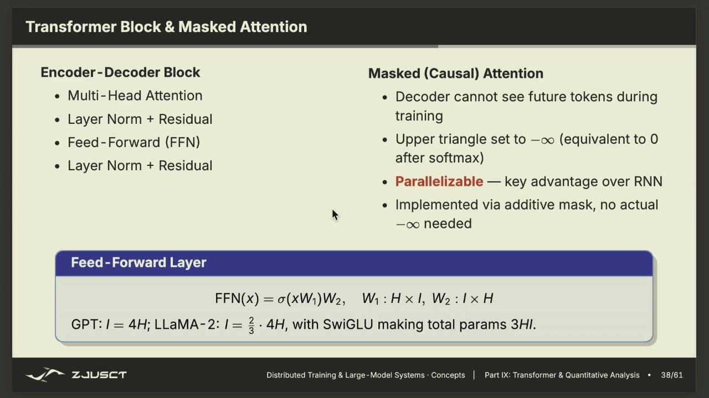

*因果（masked）注意力让每个位置只看它之前的 token。这使自回归语言模型能够逐 token 生成。*

!!! info "同一模型的两种时间尺度"

    处理已有 prompt 时，可以并行计算许多位置，矩阵乘法大而规则。逐 token 生成时，每一步依赖上一步采样结果，通常只能把不同请求拼在一起提高并行度。两种阶段使用同一套权重，却受不同资源限制。

训练比推理多出反向传播。前向传播得到预测分布，并与目标 token 计算交叉熵损失。反向传播从损失倒着求每个参数的梯度。优化器根据梯度更新参数。看到并行训练代码时，可先还原为 `forward -> loss -> backward -> optimizer.step()`。并行策略只是把其中的计算和数据拆到多张卡上。

训练语言模型时，loss 会在每个可预测位置上计算。输入序列 $[x_0,x_1,\ldots,x_{S-1}]$ 的目标是右移一位的 $[x_1,x_2,\ldots,x_S]$。第 1 个位置的输入是 $x_0$，模型要预测 $x_1$。第 2 个位置的输入包含 $x_0,x_1$，要预测 $x_2$。因果 mask 保证每个位置只能用左侧信息。这样一次前向能同时提供 S 个训练样本。

### Prefill、Decode 与推理调度

prefill 一次处理已有 prompt 的全部 token，并建立 KV cache。KV cache 按层保存已经计算出的 key 和 value，供之后的生成步骤复用。decode 每步输入一个新 token，同时读取历史 KV，因此更容易受显存带宽和单请求延迟影响。continuous batching 将不同请求的 decode step 合并成 batch，并在请求结束时补入新请求。运行时需要维护每个序列的长度、采样状态和 KV block 映射。

用一个短例子区分 prefill 和 decode。用户输入“今天 天气 很”，prefill 一次处理这三个 token，并保存每一层对它们的 K、V。第一步 decode 只把新 token“好”送入模型。attention 查询它和前四个 token 的 K/V，输出“。”。第二步只把“。”送入，前面四个 token 的 K/V 可以复用。没有 KV cache 时，每生成一个 token 都要把完整历史重新计算一次，序列越长，重复工作越多。

continuous batching 解决的是另一个问题。请求 A 已经生成到第 100 个 token，请求 B 刚到达，请求 C 在第 8 个 token 结束。传统静态 batch 会等最长请求结束。continuous batching 可以在每个 decode step 结束后移除 C、补入 B，让设备里的 token 数尽量稳定。相应地，运行时需要处理调度、变长张量和 KV 空间管理。

!!! example "练习：判断该进 prefill 还是 decode 队列"

    - 请求 D 刚收到 800 个 token 的长 prompt，尚未生成任何 token。
    - 请求 E 已生成 30 个 token，正在等第 31 个 token。
    - 请求 F 刚在第 17 个 token 满足停止条件。
    - 请求 G 的 prompt 有 3 个 token，刚加入系统。

    ??? tip "详细答案"

        - D 和 G 还没有生成第一个 token，需要先对完整 prompt 建立 K/V，因此进入 prefill 队列。
        - E 已经生成 30 个 token，只需要处理新 token 并读取历史 KV，因此留在 decode 队列。
        - F 已满足停止条件，应从活动 batch 中移除，并释放或标记其 KV block 供后续请求复用。

        长 prefill 包含较大的矩阵计算，decode 更关注单 token 延迟。将两类请求放进同一静态队列时，长 prompt 可能推迟交互请求的下一 token；服务系统通常分开调度，或设置抢占与批处理策略。

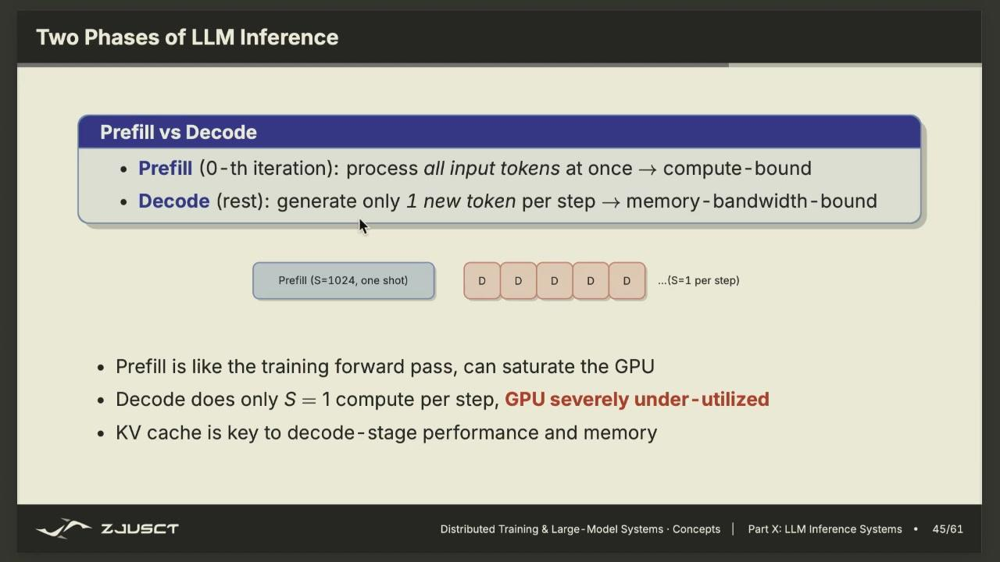

*prefill 的矩阵计算较大且规则，通常更接近计算受限。decode 每步只生成一个 token，却要反复读取 KV，常受带宽和延迟影响。两者需要不同的调度取舍。*

KV cache 是按层保存的 K/V 张量，其字节数近似为 `layers × tokens × 2 × kv_heads × head_dim × bytes_per_element`。采用 grouped-query attention 时，`kv_heads` 小于 query heads，缓存会显著下降。上下文接近显存上限时，调度器需要限制并发、换出、分页管理或拒绝请求。吞吐、首 token 延迟和每 token 延迟互相牵制，因此不能只报告 token/s。

系统通常同时关注首 token 时间（TTFT，Time To First Token）、后续 token 间延迟（TPOT，Time Per Output Token）和总体吞吐。为了吞吐而积累很大的 batch，可能伤害交互请求的首 token 延迟。连续批处理、分页式 KV cache 和分开调度 prefill 与 decode 都用于协调这些目标。

训练和推理也会用 TP、PP、序列并行，但关注点不同。训练更在意吞吐、全局 batch 和模型状态。推理更在意 KV cache 能否容纳、请求到达的动态性与用户实际等待时间。分析一个方案前，应先分清它要服务的负载。

!!! question "思考题"

    prefill 和 decode 的计算模式有什么不同？为什么它们适合不同的优化方向？

    ??? tip "答案"

        prefill 一次处理整个 prompt，可以在序列维度做批量矩阵乘，算力较容易喂满；decode 每步通常只生成一个 token，主要反复读取 KV Cache 和权重，更受显存带宽和调度影响。因此 prefill 常看 GEMM 与并行策略，decode 常看 KV Cache、batching 和访存。

!!! question "思考题"

    训练语言模型时，为什么目标序列是输入序列右移一位？

    ??? tip "答案"

        第 0 个位置看 $x_0$ 要预测 $x_1$，第 1 个位置看 $x_0,x_1$ 要预测 $x_2$。因果 mask 保证每个位置只使用左侧 token，因此一次前向能同时得到多个“预测下一个 token”的训练样本。

!!! question "思考题"

    KV cache 保存 K 和 V，为什么不保存每个历史 token 的 Q？

    ??? tip "答案"

        生成第 $t+1$ 个 token 时，新的 query 只来自新输入 token，历史 token 只需要作为 key 和 value 被查询。历史 Q 对后续注意力没有直接用处，保存它只会增加显存。反向传播需要重算或保存激活是训练时的问题，推理没有这条需求。

## 分布式训练的约束

训练扩展到多卡时，需要同时考虑模型状态、计算量和通信。参数、梯度、优化器状态和 activation 占用显存。矩阵乘法和 attention 消耗算力。梯度同步、模型分片和专家路由产生设备间通信。GPU 数量增加后，显存、计算和通信的比例也会改变。[^megatron] [^zero-paper]

| 切分方向 | 每张卡主要保存 | 典型通信 | 先解决的约束 |
| --- | --- | --- | --- |
| 数据并行（DP） | 完整模型副本、不同数据 | AllReduce 梯度 | 增加 batch 吞吐 |
| ZeRO（Zero Redundancy Optimizer）/ FSDP（Fully Sharded Data Parallel） | 参数/梯度/优化器分片 | AllGather、ReduceScatter | 降低模型状态显存 |
| 流水线并行（PP） | 连续若干层 | 相邻 stage 激活/梯度 | 沿深度拆层 |
| 张量并行（TP） | 一层权重/激活的分片 | 层内 AllReduce/AllGather | 拆大矩阵计算 |
| 上下文并行 | 序列或 K/V 分段 | K/V 分段传递 | 降低长序列峰值 |

这些缩写描述数据如何放置，性能还取决于实际计算、通信和等待。每种切分都会引入 collective 或点对点通信。性能分析应把计算、通信和等待放在同一条时间线上，检查是否发生有效重叠。[^pytorch-ddp] [^pytorch-fsdp]

??? info "多卡训练缩写怎样区分"

    - **DP** 复制模型、切分 batch。它主要增加训练吞吐。
    - **ZeRO/FSDP** 分片长期保存的参数、梯度和优化器状态。它主要减少单卡模型状态显存。
    - **PP** 按模型层切分。相邻 stage 之间传递 activation 和梯度。
    - **TP** 把同一层中的大矩阵切给多张卡。它通常要求较频繁的层内通信。
    - **上下文并行** 按序列或 K/V 分段。它主要处理长序列带来的注意力计算和缓存峰值。

    它们可以组合使用。组合时要把总 GPU 数写成各并行维度的乘积，再分别检查每个通信组传输什么张量。

!!! note "训练与推理的显存对象不同"

    推理通常需要参数和 KV cache。训练还需要梯度、优化器状态以及为反向传播保留或重算的 activation。看到“7B（约 70 亿参数）模型的 BF16（bfloat16，16 位浮点格式）权重约 14 GB”时，这只是权重文件占用的量级。训练显存还要按优化器、精度、batch、序列长度和实现策略继续计算。

## 通信中的点对点和集合操作

点对点通信（point-to-point，P2P）由一个 rank `send`、另一个 rank `recv` 组成。集合通信（collective communication）由一个通信组内的所有 rank 共同参加，例如 4 张 GPU 同时执行一次 AllReduce，即先规约各卡的数据，再把同一份规约结果分发给所有参与者。NCCL（NVIDIA Collective Communications Library，NVIDIA 集合通信库）、MPI（Message Passing Interface，消息传递接口）和 Gloo 等通信库会依据通信器、拓扑和消息大小选择具体算法。[^nccl-collectives]

集合操作要求参与者按相同顺序进入同一个 collective。某个 rank 没有进入、卡住或退出时，其他 rank 会等待，最后可能表现为 timeout。调试分布式程序时，应找到第一个没有到达同步点的 rank，而不只看报错的那张卡。

### 常见集合通信

设每个 rank 上有一个局部张量，collective 的名称描述数据在组内怎样变化。

| 操作 | 结束后数据在哪里 | 常见场景 |
| --- | --- | --- |
| Broadcast | 根 rank 的同一份数据出现在所有 rank | 初始化参数、同步控制信息 |
| Reduce | 各 rank 数据规约到根 rank | 汇总和、最大值 |
| AllReduce | 规约结果出现在所有 rank | 数据并行梯度同步 |
| Scatter / Gather | 根张量分块下发 / 各分块收回根 | 输入分发、结果汇总 |
| AllGather | 每个 rank 都得到所有分块的拼接 | 临时凑齐分片参数或激活 |
| ReduceScatter | 先规约，再让每个 rank 留一个分块 | 分片梯度与状态 |
| All-to-All | 每个 rank 给所有其他 rank 发送不同分块 | MoE token 路由 |

用四个 rank 的 AllReduce 看语义。设局部向量分别是

```text
rank0: [1, 0]    rank1: [0, 2]
rank2: [3, 0]    rank3: [0, 4]
```


*AllReduce 的输出复制到全部参与 rank，因此适合数据并行梯度同步。归约操作可以是 sum、max、min 等。训练中是否再除以 world size（通信组中的 rank 总数），取决于框架和优化器语义。* [^nccl-collectives]

若做 sum AllReduce，四个 rank 结束后都得到 `[4,6]`。实现可以是 ring reduce-scatter 再 all-gather，也可以是树形规约。使用者首先关心结果语义和通信量，底层库还要考虑拓扑和算法。AllGather 的结果是拼接。若 rank0 有 `[1,0]`、rank1 有 `[3,4]`，结束后两个 rank 都得到 `[1,0,3,4]`。

!!! question "集合通信自测"

    两个 rank 分别持有梯度分片 `g0=[1,2,3]` 和 `g1=[4,5,6]`。执行 sum AllReduce 后各自得到什么？执行 AllGather 后各自得到什么？

    ??? tip "详细答案"

        sum AllReduce 对相同位置相加，并把结果交给每个参与 rank。因此两个 rank 都得到 `[1+4,2+5,3+6]=[5,7,9]`。

        AllGather 按 rank 顺序拼接分片。因此两个 rank 都得到 `[1,2,3,4,5,6]`。数据并行需要每张卡拿到同一份全局梯度，适合 AllReduce。分片参数或激活需要临时凑回完整张量时，适合 AllGather。

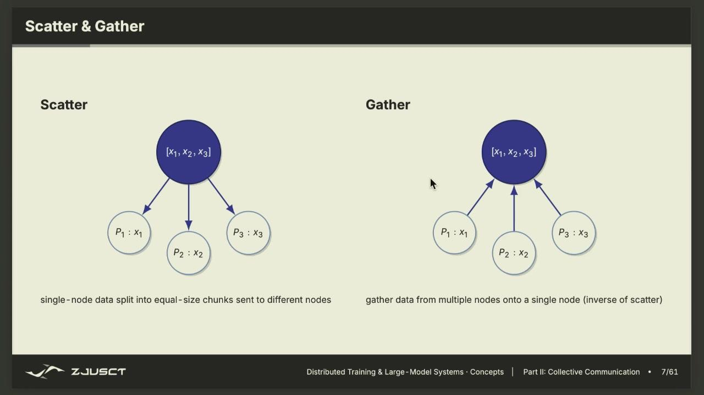

*Scatter 改变数据所有权，Gather 恢复集中表示。每个箭头都对应实际通信量。*

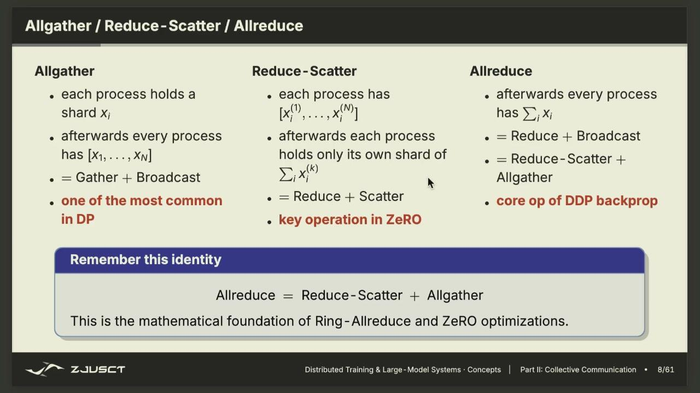

*三种集合通信都围绕每个进程持有一块数据展开。区别在于拼接结果和规约结果的放置方式。*

`AllGather` 的结果是拼接后的原始数据。`AllReduce` 的结果是逐元素相加、平均等规约后的数据。训练中使用哪一种，要看需要的是完整参数、完整激活，还是一致的全局梯度。

!!! question "思考题"

    数据并行同步梯度时，为什么常用 AllReduce 而不是 Reduce？

    ??? tip "答案"

        数据并行的每张卡都要用同一份全局梯度继续更新自己的参数。Reduce 只把结果送到一个 rank，其他 rank 得不到结果。AllReduce 让所有 rank 结束后都拿到同一份规约结果。

### 通信延迟与带宽

课上用一个常见近似模型表示一次消息传输。

$$
T_{\mathrm{comm}} \approx \alpha + \frac{n}{\mathrm{BW}}
= \alpha + n\beta
$$

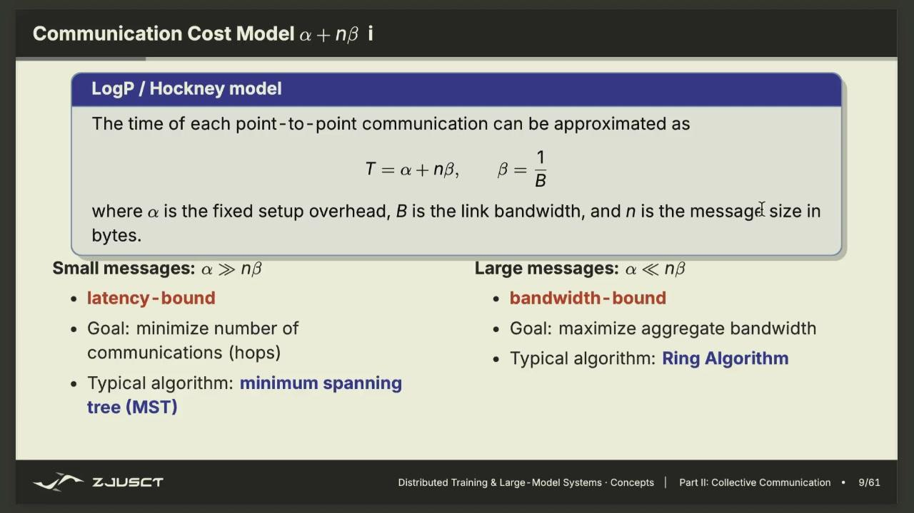

*通信时间由固定延迟和随消息大小增长的传输时间组成。这个模型可以帮助判断是否合并小消息，或用 ring 处理大消息。*

$\alpha$ 是启动延迟，例如建立或调度一次传输的固定开销。$n$ 是消息大小。$\mathrm{BW}$ 是有效带宽，$\beta=1/\mathrm{BW}$。消息很小时，$\alpha$ 的影响更明显，此时合并小消息、减少调用次数通常比追求峰值带宽更有效。消息很大时，$n\beta$ 的影响更明显，链路带宽、拓扑和传输算法需要重点检查。

例如 AllGather 可以用 ring 实现。把 $p$ 个 rank 排成环，每个 rank 先持有自己的第 $i$ 块。每一轮把当前块传给下家，同时从上家接收一块。经过 $p-1$ 轮，每个 rank 都收到其余所有块。每轮只搬一块较小的数据，链路可以同时工作，因此对大消息常有较好的带宽利用率。Ring AllReduce 通常可理解为一段 ReduceScatter 加一段 AllGather。

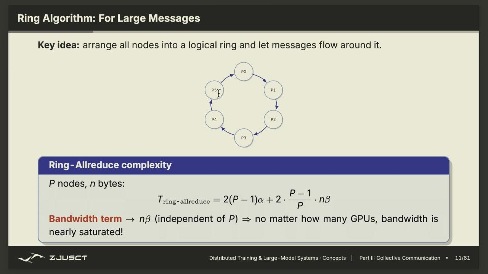

*ring 让所有链路的带宽同时被利用，适合大消息。多轮交换会带来启动和等待开销。*

通信库会按消息大小选择算法。小张量可能承受不起 ring 的多轮启动开销，大张量则可能让一个根节点成为瓶颈。实际耗时还受 PCIe、NVLink/NVSwitch、跨节点网络和物理拓扑影响，不能只用 GPU 数量推断。

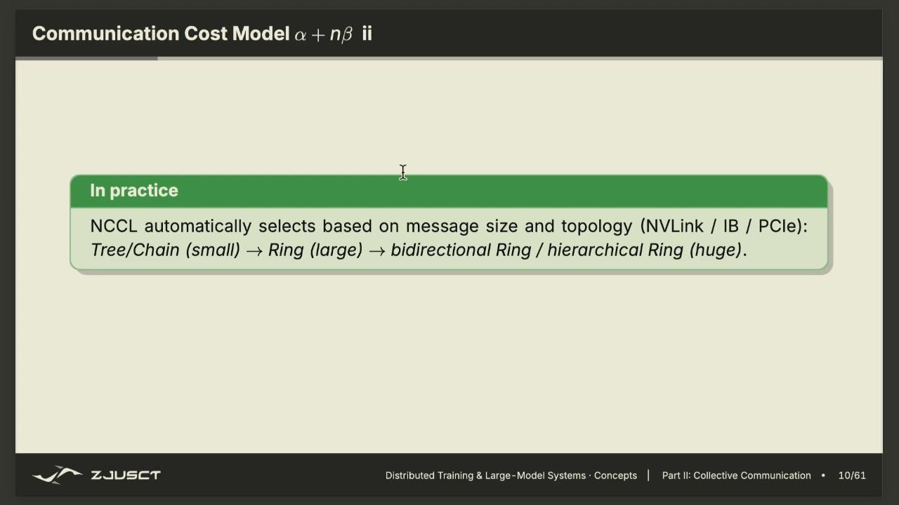

*通信库按消息大小在启动开销优先和带宽优先之间切换实现。这对应 $\alpha$ 与 $n\beta$ 的相对影响。*

!!! question "思考题"

    AllReduce、AllGather、ReduceScatter 的结果分别落在哪里？各适合什么场景？

    ??? tip "答案"

        ReduceScatter 把各 rank 数据归约后按片段分给所有 rank。AllGather 把各 rank 的片段收集成完整结果并分发给所有 rank。AllReduce 可以视为先 ReduceScatter 再 AllGather，因此每个 rank 都拿到同一份规约结果。数据并行的梯度平均常用 AllReduce，张量并行前向收集常用 AllGather。

!!! question "思考题"

    四个 rank 约定执行 AllReduce，但 rank3 还在上一段计算中，前三个 rank 已经进入集合通信。系统可能表现成什么？调试时应先看哪里？

    ??? tip "答案"

        前三个 rank 会在集合通信中等待，表面现象常是通信超时或进程挂起。真正的问题可能在 rank3 的前序计算、异常退出、条件分支或不同进程的通信顺序不一致。应找第一个没有到达同步点的 rank，并检查所有分支是否进入同一个 collective。

## 数据并行

数据并行（data parallelism, DP）沿 batch 维切分数据。假设有四张 GPU，GPU 0 处理 mini-batch 的第 0 份，GPU 1 处理第 1 份。每张卡都保留完整的模型参数 $\theta$。它们分别执行前向与反向，得到局部梯度 $g_0,g_1,g_2,g_3$。

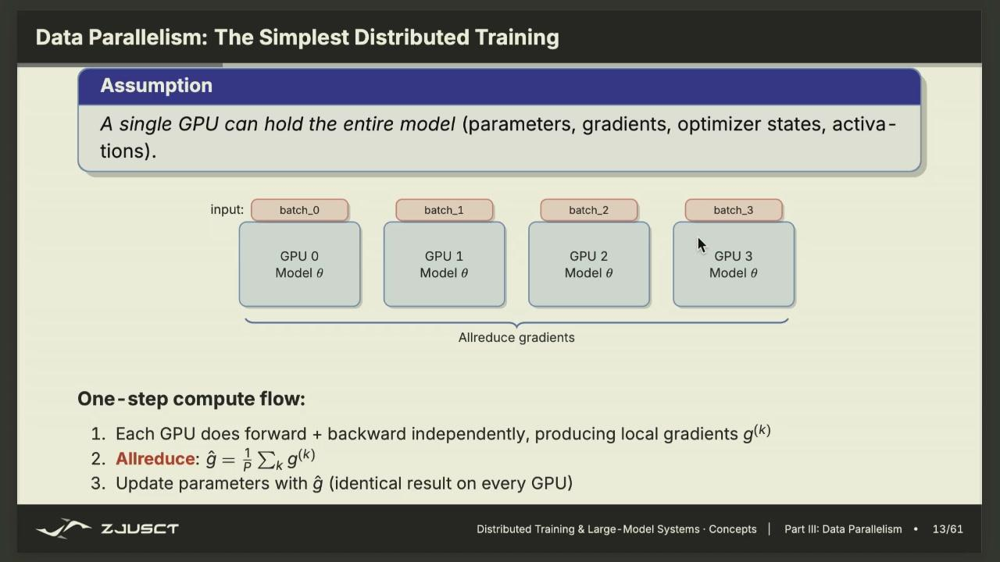

*每张卡都有一份完整模型，输入按 batch 切分。计算可以并行，参数通过通信保持一致。*

要让四份模型继续保持一致，更新前需要计算全局平均梯度。

$$
g=\frac{1}{p}\sum_{i=0}^{p-1}g_i,\qquad
\theta\leftarrow\theta-\eta g
$$

AllReduce 可以同时完成求和和结果分发，所以每张 GPU 得到同一个 $g$，再各自执行同样的 optimizer step，最终参数仍相同。PyTorch DistributedDataParallel 默认在 backward 中同步梯度。梯度除以 world size 的位置应以当前框架实现和训练配置为准。通信发生在反向传播产生梯度之后。缺少这一步时，四张卡会各自训练参数不同的模型。[^pytorch-ddp]

DP 的加速上限受通信约束。若单卡一个 step 的计算时间是 $C$，AllReduce 梯度时间是 $M$，理想多卡时间仍至少有 $C+M$ 的一部分。GPU 数增加后，单卡 batch 变小、固定开销占比上升，通信量也会随梯度大小变化。因此吞吐曲线常常先近似线性增长，再逐渐弯曲，最后增加卡数不再划算。

较早的做法是 parameter server。多个 worker 把梯度交给服务器，服务器汇总、更新参数后再发回。它的逻辑直接，但服务器既是吞吐瓶颈也是单点故障。现代同步 DP 更常让 worker 直接集合通信。

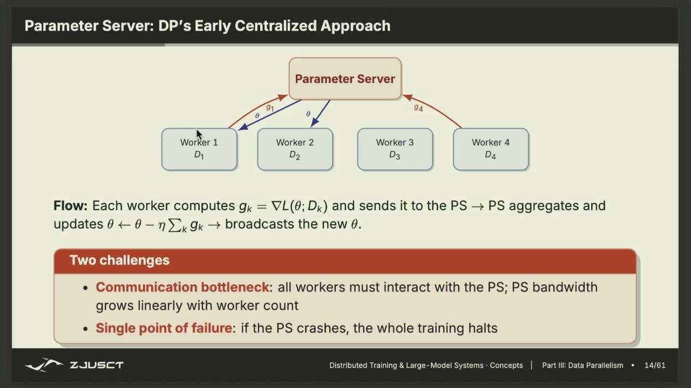

*集中式参数服务器逻辑直观，但所有梯度都汇集到一点，因此会形成吞吐瓶颈和单点故障。*

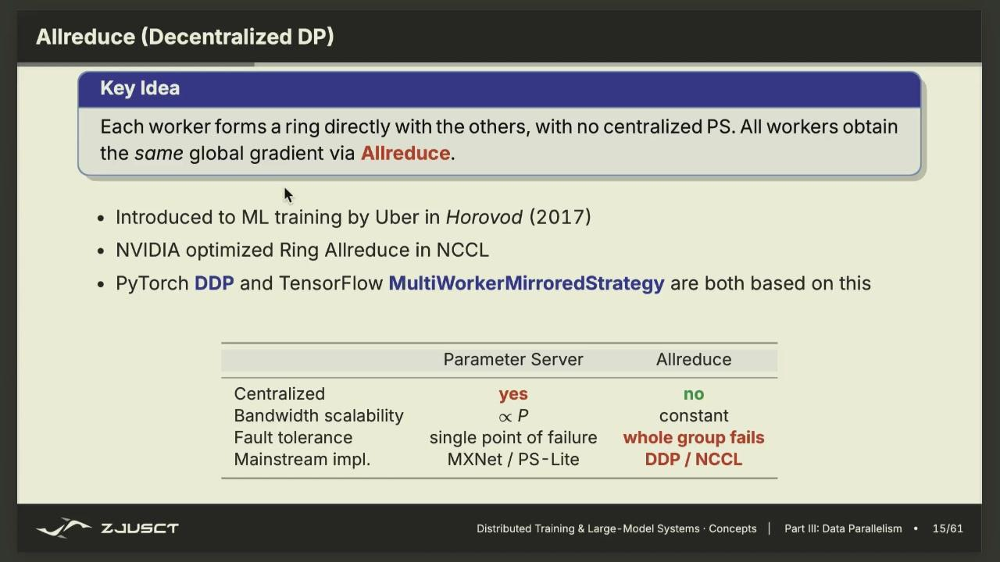

*现代 DP 让 worker 直接通过 AllReduce 交换梯度，避免把通信集中到单个参数服务器。*

### Global Batch 与梯度累积

若每卡 batch 为 $b$，数据并行大小为 $p$，没有梯度累积时全局 batch 是 $B_{\text{global}}=pb$。显存不足而又希望维持大 batch 时，可以连续运行 $k$ 个 micro-batch，只累加梯度，最后再同步和更新参数。此时全局 batch 为 $pkb$。

batch 变大后，单步梯度的统计特性、每个 epoch 的更新次数和学习率设置都会变化。吞吐提升后，训练配置也要随并行规模一起重新检查，确认收敛速度和最终指标保持在预期范围。

### AllReduce 的归约语义

数据并行的每个 rank 持有同一组参数、处理不同 mini-batch。若本地梯度为 $g_r$，同步 SGD 需要得到

$$
g=\frac{1}{P}\sum_{r=0}^{P-1}g_r
$$

然后所有 rank 用同一个 $g$ 更新同一份参数。AllReduce 完成的是求和，除以世界大小可能由框架或优化器完成。平均若执行两次，实际学习率会缩小 $P$ 倍。梯度累积时，多个 micro-batch 的局部梯度应在正确边界再同步。`no_sync` 一类接口表示推迟 collective。

通信-计算重叠依赖梯度产生的顺序。反向传播从最后一层开始。当某个 bucket 的所有梯度准备好，就可在通信 stream 上启动 AllReduce，同时计算前面层的梯度。bucket 太小时，collective 启动次数较多。bucket 太大时，首个通信启动较晚。实际重叠需要用 profiler 时间线验证，还要检查网络、GPU DMA 和计算资源是否已经饱和。

!!! question "思考题"

    数据并行为什么每个 GPU 都保存完整模型？这个特点带来什么通信和显存代价？

    ??? tip "答案"

        数据并行的划分对象是小批量数据，每个 GPU 用自己的 micro batch 前向和反向，模型参数与优化器状态通常完整复制。反向后需要同步梯度，例如 AllReduce。它实现直接、扩展训练吞吐容易，但显存重复保存，模型变大后单卡装不下，于是需要 ZeRO、FSDP 或模型并行。

## 训练显存

### 模型状态与混合精度

以 $\Psi$ 表示参数量。模型权重和梯度若用 BF16，各自约需 $2\Psi$ 字节。使用 Adam 时，通常还有 FP32 主权重、一级动量和二级动量，各占约 $4\Psi$ 字节。仅模型状态可以作如下粗略估算。

$$
2\Psi\;\text{(BF16 参数)} + 2\Psi\;\text{(BF16 梯度)} + 4\Psi\;\text{(FP32 主参数)} + 4\Psi\;\text{(一阶动量)} + 4\Psi\;\text{(二阶动量)} = 16\Psi\;\text{bytes}
$$

把这笔账落到 7B 模型上，可以逐项写出来。参数 14GB、梯度 14GB、FP32 主权重 28GB、一阶动量 28GB、二阶动量 28GB，合计约 112GB。若有 8 张 80GB A100，仅模型状态占用就低于总显存的一半，但 activation 会随 batch、序列长度和 checkpointing 策略继续增加。估算显存时宁可保守，因为 kernel 临时空间、通信 buffer、框架缓存和碎片都会消耗额外空间。

对一个 7B 参数模型，这一部分已约为 112 GB，尚未计入 activation、临时 buffer、通信 buffer 和框架开销。具体数值会随混合精度、优化器和是否保存主权重而变化。训练显存中占用很大的部分，往往来自训练附带保存的状态。

以一个 7B 参数模型为例，仅权重和训练附带状态就可能占据极大的显存。

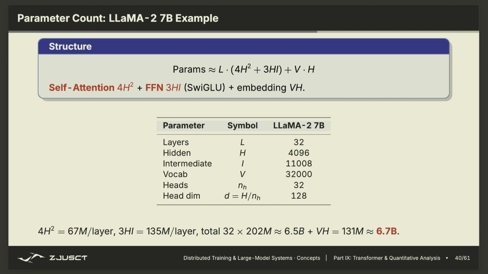

*参数量由各层的权重矩阵之和决定。它是显存账本的起点，也是训练显存的一部分。*

每个位置采用的精度不同。权重和梯度在计算过程中可以用 bf16 这类低精度，以节省显存和带宽。优化器状态和主权重通常需要更高的 fp32 精度，因为梯度需要反复累积和更新，低精度累加可能丢失很小的更新量。常见做法是以前向和反向使用 bf16，以 fp32 更新主权重，并以 fp32 保存优化器动量和方差。因此显存账本中会同时出现 bf16 计算副本和 fp32 副本。

### Activation 与完整显存账本

激活是另一笔账。反向传播要用到前向阶段的中间结果，因此常规训练会保存多层 activation。sequence length、batch、hidden size 和层数增大后，activation 也可能成为主要瓶颈。activation checkpointing 通过少保存一部分中间结果、在反向时重算来换取显存。它处理的是激活开销。

activation checkpointing（激活检查点）可以用一条简单的时间线理解。普通训练在每个矩阵乘后保留中间结果，反向时直接使用。检查点方法只保留某些边界处的输入，反向到该段时重算中间结果并接着求梯度。它减少激活显存，增加前向计算次数，通常不减少优化器状态。ZeRO/FSDP 则减少参数、梯度和优化器状态的副本或分片。

训练与推理的账本不同。推理主要保存权重和 KV cache。训练还要额外保留梯度、优化器状态和 activation，因此两者的估算不能混用。

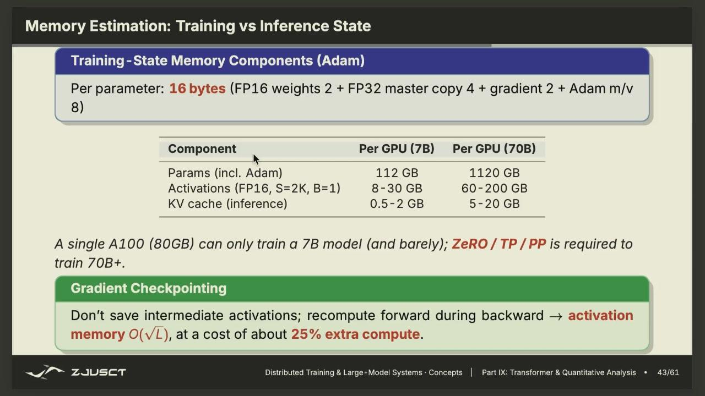

*训练显存的大部分来自模型状态与 activation。推理显存的大部分来自权重与 KV cache。估算前应先分清负载类型。*

checkpointing（activation recomputation）只保存若干边界 activation，反向时重跑中间前向以换取显存。它减少的是保存量，增加的是计算和可能的通信；不能把它与持久化检查点混为一谈。后者是故障恢复用的模型/优化器快照。选择并行策略前应分别列出参数、梯度、优化器状态、activation 与通信 buffer，而不是只报一个显存占用。

!!! question "思考题"

    混合精度训练为什么通常仍要保存 FP32 权重副本？这和前向使用 FP16/BF16 是否矛盾？

    ??? tip "答案"

        前向和部分计算用低精度提高速度、降低激活显存，但参数更新往往很小。若只在低精度权重上累加，小更新可能被舍入掉，长期训练不稳定。FP32 主权重保留更新精度，前向再转换成低精度，两者职责不同。

## ZeRO / FSDP 分片模型状态

ZeRO 的三个阶段可以按切分对象记。ZeRO-1 切优化器状态，ZeRO-2 再切梯度，ZeRO-3 连参数也切。对于前述 Adam 的 16 bytes/参数，如果四张卡完全分片，每张卡的模型状态平均可降到约 4 bytes/参数；通信则从梯度 AllReduce 变为前向或反向按需 AllGather 参数，以及 ReduceScatter 梯度。

FSDP 可以理解为 PyTorch 中这类分片训练的工程实现。某一层计算前，各 rank 临时 AllGather 出该层完整参数；计算后释放完整副本，反向再按需收集，梯度用 ReduceScatter 分片写回。它和 ZeRO-3 的核心思想一致，把“每卡都复制完整模型状态”改成“每卡长期只保存一个 shard（分片）”。

!!! quote "PyTorch FSDP 文档的说明（意译）"

    FSDP 将参数、梯度和优化器状态分片到数据并行工作进程中。在需要计算某层时，它临时收集完整参数；计算完成后再释放或重新分片，以降低常驻模型状态显存。[^pytorch-fsdp]

普通 DP 中，每张卡都保存完整参数、完整梯度和完整优化器状态。数据已经切分，模型状态仍会重复保存。ZeRO（Zero Redundancy Optimizer）按阶段分片这些状态。FSDP（Fully Sharded Data Parallel）是一类围绕参数完全分片的实现。

- **ZeRO-1** 分片优化器状态。每个 rank 只长期保存约 $1/p$ 的 Adam 状态。
- **ZeRO-2** 在 ZeRO-1 基础上再分片梯度。完成反向后用 ReduceScatter，让每张卡只留下自己负责的梯度块。
- **ZeRO-3 / FSDP** 也分片模型参数。每张卡长期只持有参数、梯度和优化器状态的一个分片。

分得越彻底，单卡常驻状态越少，但运行时需要更多通信。ZeRO-3 在算某一层之前先 AllGather，把该层的完整参数临时凑齐；用完前向后释放不再需要的完整参数。反向到这一层时再 AllGather 参数，计算出梯度后用 ReduceScatter 把已规约的梯度留在对应 owner 上，由 owner 更新自己的参数分片。

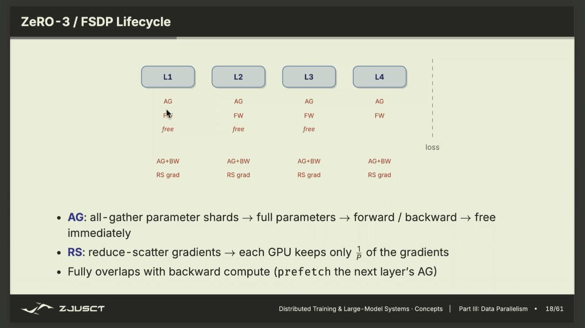

*FSDP 在每次用到某层参数前临时 AllGather，计算后释放。它以通信换取较低的常驻显存。*


*ZeRO 依次分片优化器状态、梯度和参数。常驻显存下降，运行时 AllGather/ReduceScatter 增加。*

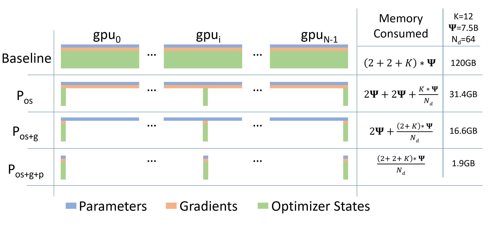

*阅读这张图时横向比较同一张 GPU 上三种颜色的总高度。Baseline 中每张卡都长期保存完整三类状态。向下到 $P_{os}$、$P_{os+g}$、$P_{os+g+p}$ 时，绿色、橙色、蓝色依次被分到不同 GPU，因此每张卡的常驻状态逐步下降。右侧的 7.5B 示例只用于说明趋势，实际显存还要加上 activation、通信 buffer 和框架开销。[^zero-paper]*

ZeRO 用通信换取更低的状态显存。模型因显存不足而无法训练时，这种交换很有价值。网络带宽不足、分片太细，或每层过小而频繁 AllGather 时，吞吐可能下降。参数状态过大时可考虑 ZeRO/FSDP。activation 过大时还要考虑 checkpoint、序列切分或减少 micro-batch。

!!! question "思考题"

    ZeRO/FSDP 把参数和优化器状态切开后，为什么仍会引入通信？

    ??? tip "答案"

        某一层需要完整参数时，各 rank 必须临时 AllGather 自己持有的分片；反向得到局部梯度后，又要通过 ReduceScatter 聚合并切回分片。显存占用下降，通信调度和重叠成为新的关键问题。

!!! question "思考题"

    activation checkpointing 为什么能省显存，又为什么会让训练变慢？

    ??? tip "答案"

        它不保存每个前向中间结果，只保存少量边界值，反向需要时重新执行一段前向来恢复激活。显存减少来自少存中间张量，时间增加来自重算。适合显存不足时换取更大的模型、batch 或序列长度，属于用计算换显存。

## 流水线并行

流水线并行（pipeline parallelism, PP）沿网络深度切分。若模型有很多层，可以让 GPU 0 负责前几层，GPU 1 负责中间层，GPU 2 负责后几层。前向时 activation 从第一个 stage 依次传到后面；反向时梯度再反向传回。每张卡只放本 stage 的层，因而可容纳单卡放不下的深模型。

最朴素的排程会产生 pipeline bubble。GPU 0 先忙，其他 stage 等待 activation。前向全部结束后，反向从最后一个 stage 才开始，前面的卡再次等待。卡的数量越多、每轮只有一个大 batch，空闲比例越明显。

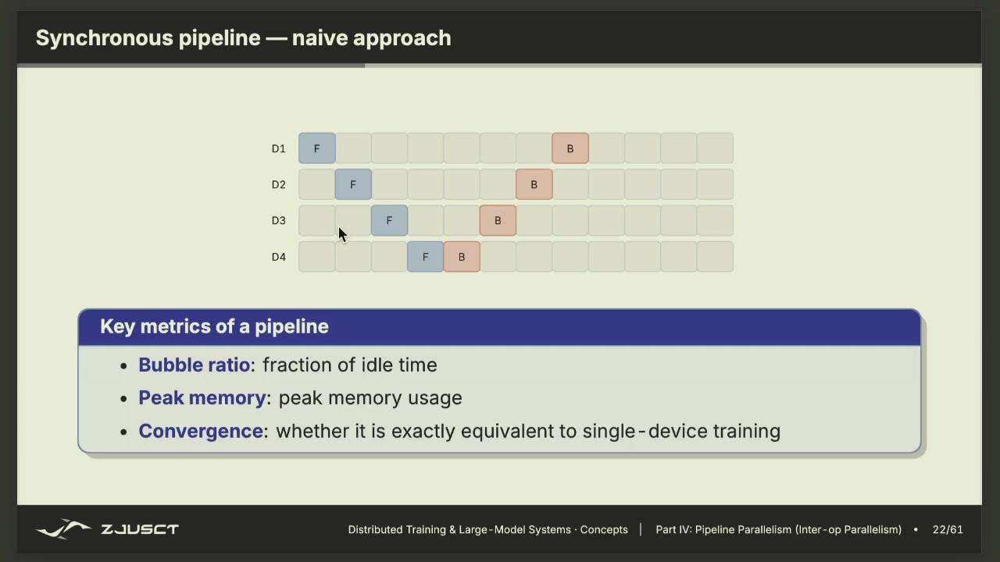

*朴素流水线中，一个 batch 串行穿过各 stage，前后期的 stage 大量空闲。这种空闲比例称为 bubble。*

处理办法是把 batch 切为多个 micro-batch，形成填充流水线。GPU 0 算完 micro-batch 0 后就把它交给 GPU 1，自己立刻开始 micro-batch 1；GPU 1 接到 0 后开始计算，后续 stage 也依次被填满。等流水线稳定下来，多个 stage 可以同时处理不同 micro-batch 的前向或反向。bubble 没有消失，但被更多 micro-batch 摊薄。

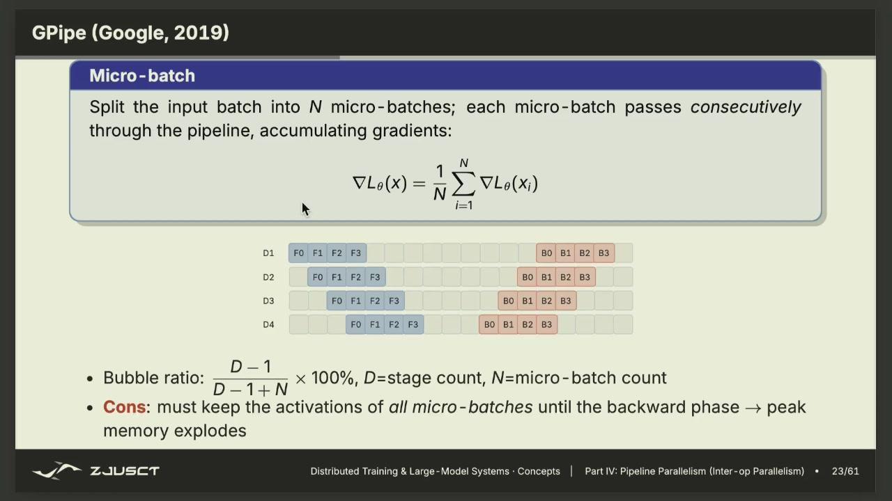

*micro-batch 把大 batch 切小，流水线各 stage 因而能同时处理不同 micro-batch，从而摊薄 bubble。*

PP 的通信主要是相邻 stage 间的 activation/gradient P2P 传输，延迟和负载均衡都很重要。如果某个 stage 的层更慢，整条流水线会被它卡住；切层时不能只按层数平均，还要考虑每层计算量、激活大小和显存。

流水线 bubble 可以用一个极小调度表看清楚。假设 4 个 stage、2 个 micro-batch，F 表示前向，B 表示反向，横轴是时间。若没有 micro-batch 交错，GPU 0 在第 1 个前向完成后要等后续 stage 逐步处理，反向又从 GPU 3 开始返回。画在时间线上，两端 GPU 有明显空闲，这些空闲就是 bubble。

```text
GPU0: F0 F1 ........ B1 B0
GPU1: .... F0 F1 ... B1 B0
GPU2: ....... F0 F1 B1 B0
GPU3: .......... F0 B0 F1 B1
```

增加 micro-batch 数量、让不同 micro-batch 的前向和反向交错，可以填掉一部分空档，但通信次数和调度复杂度也随之增加。

!!! question "思考题"

    流水线并行的 bubble 是怎么来的？

    ??? tip "答案"

        前后 stage 之间有依赖，前面的 stage 要等激活送来，后面的 stage 在最早几个 micro-batch 时可能没有工作；反向阶段又会出现对称的空闲。把 batch 切成更多 micro-batch 可以降低 bubble 比例，但会增加调度和通信复杂度。

## 张量并行

PP 是按层切，张量并行（tensor parallelism, TP）则把一层内部的大矩阵乘法切到多张 GPU。Transformer 的 attention 投影和 FFN 都包含很大的矩阵乘法，这往往是计算最重的地方。

考虑线性层 $Y=XW$。若按 $W$ 的列切分，计算过程如下。

$$
W=[W_0\;W_1\;\cdots\;W_{p-1}],\qquad
Y=[XW_0\;XW_1\;\cdots\;XW_{p-1}]
$$

每张 GPU 可独立算一个 $XW_i$，得到 $Y$ 的一部分列；若后续需要完整的 $Y$，再做 AllGather。若按行切分，则每张卡先算局部乘积，最后用 AllReduce 把各部分相加。不同的切法决定通信发生在算子前还是算子后。

用数值说明列切和行切的区别。设

$$
X=\begin{bmatrix}1&2\end{bmatrix},\qquad
W=\begin{bmatrix}1&1\\2&3\end{bmatrix}
$$

完整结果是 $XW=[5,7]$。若按列切 $W_0=[1,2]^T$、$W_1=[1,3]^T$，GPU 0 算 $XW_0=[5]$，GPU 1 算 $XW_1=[7]$，需要时 AllGather 拼成 `[5,7]`。若按行切 $W$，两块分别是 `[[1,1]]` 和 `[[2,3]]`，GPU 0 得 `[3]`，GPU 1 得 `[4]`，必须相加才有 `[7]`。列切天然得到输出列分片，行切天然得到需要求和的部分和。

FFN 可以写成

$$
\operatorname{FFN}(X)=\phi(XW_1+b_1)W_2+b_2
$$

其中 $\phi$ 是逐元素激活函数。第一层把 hidden size 扩到较大的中间维度，第二层再投回去。逐元素激活不会混合不同列，因此可在各 GPU 的局部结果上直接执行；恰当安排 $W_1$ 的列切分与 $W_2$ 的行切分，可把本来两次的全量通信压缩为较少的同步点。这就是 TP 在代码里常见列并行线性层和行并行线性层配对的原因。

TP 的通信频率很高，因为几乎每层都要在组内交换中间结果。因此通常把一个 TP group 放在同一台机器、使用 NVLink/NVSwitch 等高速互连；把频繁的 TP 通信跨慢网络，会非常不划算。

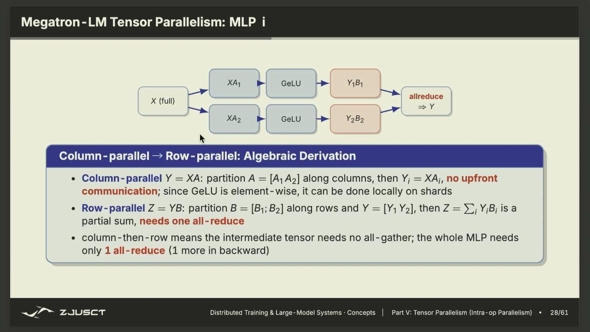

*张量并行把一层内的矩阵乘切开，卡间需要频繁 allreduce。因此 TP group 通常放在 NVLink 等高速互连内。*

!!! question "思考题"

    把一个 `[H,4H]` 权重按列切成两份后，两个 rank 各自得到的输出形状是什么？为什么还需要通信才能得到完整 FFN 结果？

    ??? tip "答案"

        输入 `[B,S,H]` 乘每份 `[H,2H]`，两个 rank 分别得到 `[B,S,2H]`。这只是中间结果的一部分，FFN 需要把这些片段合并成 `[B,S,4H]` 再过激活和第二层。因此张量并行在层内引入 AllGather 或 ReduceScatter，通信频率比数据并行高，通常放在高速互连内。

!!! question "思考题"

    FFN 的第一层权重按列切，第二层权重按行切。这两种切法各自解决什么通信问题？

    ??? tip "答案"

        第一层按列切后，每个 rank 得到输出特征的一段，不需要先通信输入的不同列。第二层按行切时，各 rank 局部输出可以直接按分块矩阵乘法相加，最后通过 AllReduce 得到完整结果。切分方式要顺着矩阵乘法的形状选择，避免为了凑形状引入多余通信。

## 多维并行与通信计算重叠

真实的大模型训练常把几种策略叠起来。节点内做 TP（Tensor Parallelism，张量并行），按层做 PP（Pipeline Parallelism，流水线并行），剩余维度做 DP（Data Parallelism，数据并行），再用 ZeRO/FSDP 分片状态。这常被称为 3D 并行。阅读一组并行度配置时，可以把总 GPU 数写成各维度的乘积，再逐维检查下列问题。

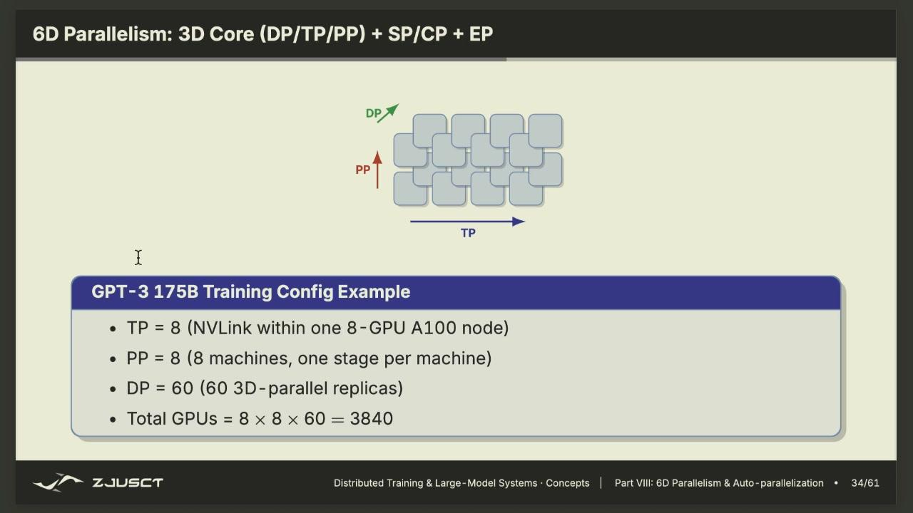

*总 GPU 数等于各并行维度的乘积。例如 GPT-3 的配置 $8\times 8\times 60=3840$ 块 A100。维度越多，切分越细，通信模式也越多样。*

以 GPT-3 175B 为例，可把 8 块 A100 通过 NVLink 组成一个节点作为 TP 组，8 个节点按层做 PP，再复制 60 份做 DP，得到 3840 块 GPU 的集群配置。每个维度都对应一类通信。TP 在节点内频繁 AllReduce，PP 在相邻 stage 之间传 activation/gradient，DP 需要全局 AllReduce 梯度。SP（Sequence Parallelism，序列并行）、CP（Context Parallelism，上下文并行）沿序列维切分，EP（Expert Parallelism，专家并行）则按 expert 切分并触发 All-to-All。面对具体配置时，应先算清 GPU 如何分组、组间传什么数据。

检查并行配置时，把总卡数和乘积逐项写出，例如 3840 与 $8\times8\times60$，随后给每个维度标注通信对象；TP 是节点内高频集合通信，PP 是相邻 stage 的点对点，DP 是全局梯度同步。最后核对每个组的大小是否匹配物理拓扑。TP 放在慢网络两端是最常见的错误之一，因为每层都可能等待通信。

- DP 组里的卡拿不同数据，何时 AllReduce 梯度？
- TP 组里的卡共享一层计算，哪个线性层后要 AllGather 或 AllReduce？
- PP 的相邻 stage 之间传什么 activation 和 gradient？
- ZeRO 分片后，哪一层前需要临时 AllGather 参数？

通信不一定必须停在计算之后才开始。反向传播从最后一层往前走，某层梯度就绪后可以立刻启动对应 bucket 的 AllReduce，同时 GPU 继续计算更前面的层。若通信在计算结束前完成，它的耗时被隐藏；若网络仍未完成，GPU 才需要等待。bucket 的大小过小会让启动延迟累积，过大又会推迟通信启动，因而是一个需要实测的折中。

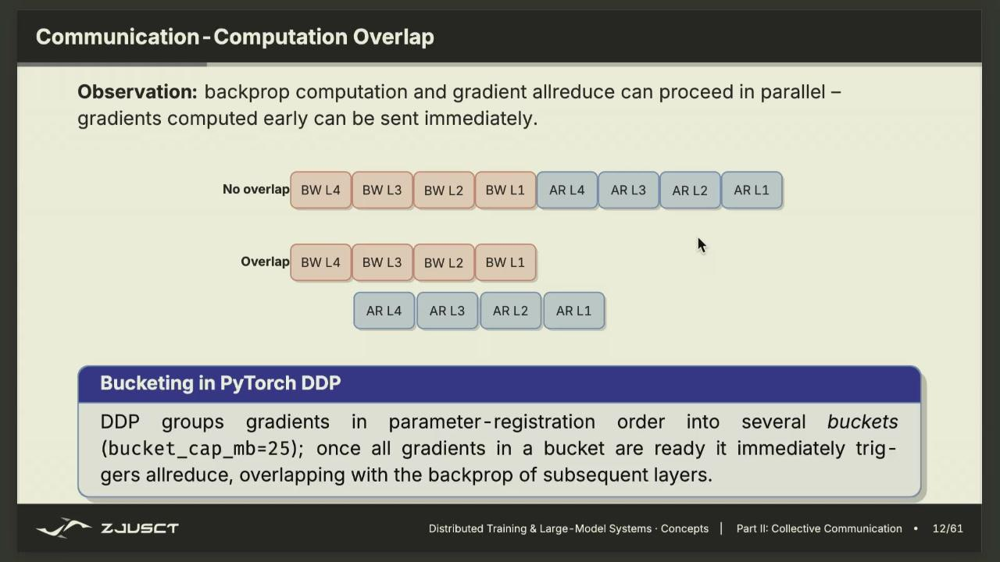

*梯度按层或按 bucket 就绪后启动集合通信，不必等整个反向结束。重叠是否成立要看网络是否在计算完成前清空。*

手动组合 TP、PP、DP、SP、CP、EP 并不容易，因此有了自动并行。它根据模型计算图和硬件拓扑，例如节点数量、节点内 NVLink、节点间 IB，选择每个算子的切分方式、流水线 stage 划分和 micro-batch 大小。

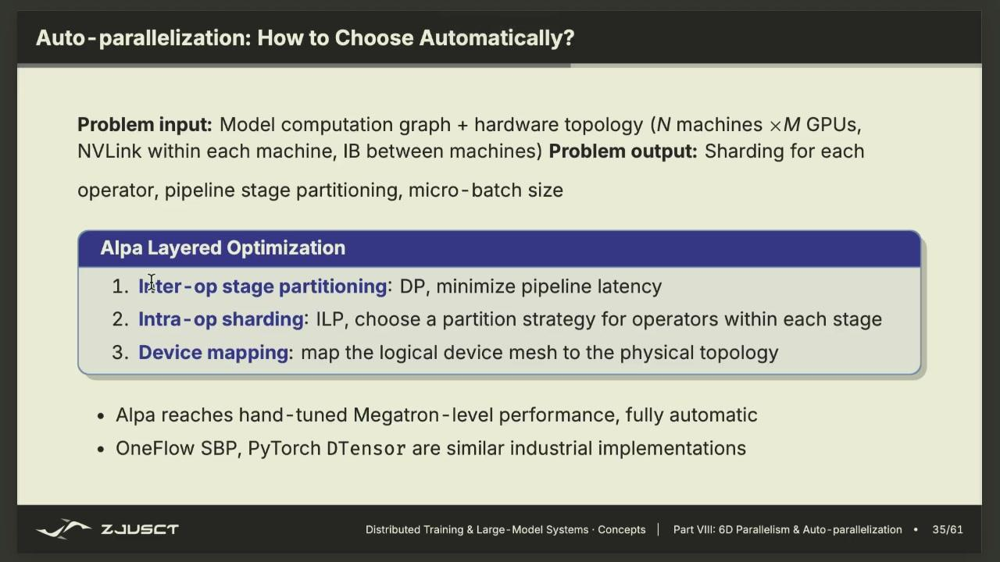

*自动并行将层间划分、层内切分和设备映射分别处理，再组合为整体方案。*

这类工具（Alpa 之外，PyTorch DTensor、OneFlow SBP 也是同类思路）把设备网格抽象出来，统一描述张量在设备间如何分布，从而让同一份模型代码在不同并行度配置下运行。它的价值不在替代工程师手调，而在把可复现、可搜索的并行空间交给算法，减少每次换模型/换集群都要重写配置的负担。

!!! question "思考题"

    总 GPU 数是 64，配置为 TP=4、PP=2、DP=8。这三组分别是什么？

    ??? tip "答案"

        4 卡组成一个张量并行组，共同计算一层内被切开的矩阵；2 个流水线 stage 按层前后连接；8 份数据并行副本同时处理不同 micro-batch 并同步梯度。$4\times2\times8=64$，读配置时先确认每组大小和物理拓扑是否匹配。

## Transformer 层的算力估算

要判断长序列到底难在哪，先把一层 Transformer 的算力分清楚。以一层的 MLP 与 attention 为例，以 batch $B$、序列长 $S$、隐宽 $H$ 计，各部分计算量大致如下。

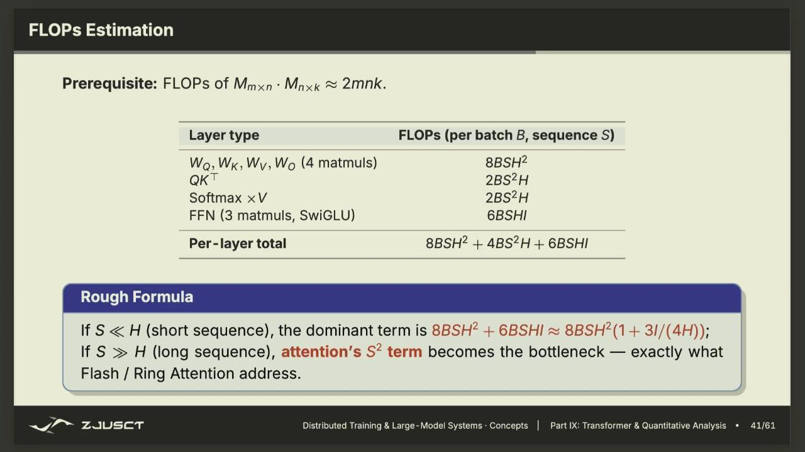

*投影与 FFN 随 $S$ 线性增长、随 $H$ 平方增长。attention 的两个矩阵运算随 $S$ 平方增长，只随 $H$ 线性增长。*

关键在 attention 的 $S^2H$ 项。把这一层的总计算写成 $8BSH^2+4BS^2H+6BSH^2$，当 $S\ll H$（短序列）时，$SH^2$ 项占主导，FFN 与投影是瓶颈；当 $S>H$（长序列）时，$S^2H$ 项爆炸，attention 变成瓶颈。

这里的系数来自矩阵乘的形状。一次 $[m,k]\times[k,n]$ 矩阵乘大约需要 $2mkn$ 次乘加。QKV 和输出投影的形状都围绕 $S\times H$ 与 $H\times H$，合起来给出 $BSH^2$ 量级；$QK^T$ 是 $S\times H$ 乘 $H\times S$，乘 $V$ 是 $S\times S$ 乘 $S\times H$，所以各自都含 $S^2H$。做实验时，把每个矩阵的 shape 代入这个公式，就能解释 profiler 里 GEMM 和 attention kernel 的相对耗时。

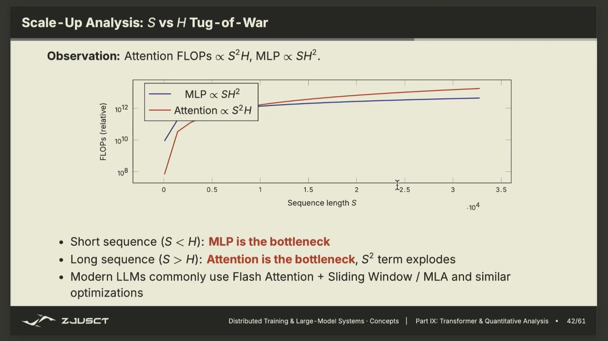

*横轴是序列长 $S$，纵轴是计算量。attention 的二次增长会让它在一段序列长度后反超 MLP，成为长上下文的主要成本。*

序列并行、FlashAttention（按块计算并在线累计 softmax 的注意力实现）和 ring attention 都要处理 attention 的 $S^2$ 项。它既带来较大的计算量，也让中间 attention 矩阵和 KV cache 难以完整物化或驻留单卡。可以先区分 $S\ll H$ 与 $S>H$ 两种情况，再决定投影和 FFN 是否切分，或 attention 是否分块。

## 长上下文与序列并行

长上下文会让 attention 的中间量和 KV cache 迅速增大。即使参数已经由 TP 或 FSDP 分片，单张卡仍可能放不下完整的序列。序列并行（sequence parallelism）和上下文并行（context parallelism）于是沿 sequence 维分割 token 或 K/V 块。

以 ring attention 为例，每张卡保存一段 Q/K/V。它让 K/V 块在 rank 组成的逻辑环上逐轮传递，使每张卡的本地 Q 依次与完整上下文的 K/V 分块计算。数值稳定的分块 softmax 与 FlashAttention 的在线累积思想紧密相关。这样不必把所有 K/V 同时复制到每张卡，峰值内存随序列分片下降，代价是多轮环形通信。 [^flashattention]


*每张卡只持有部分 K/V 块，通过循环传递与本地 Q 逐步和全局 K/V 交互。通信次数随分片数上升，显存峰值随之下降。*

这里有一个数值细节，softmax 不能简单把每一块各自归一化后再相加，因为全局分母依赖所有块。可维护运行中的最大值 $m$、归一化量 $l$ 和加权结果，块到来时用新的最大值重新缩放旧累计量。这类 online softmax 保持数值稳定，使得 attention 可以按块流式计算；FlashAttention 等高效实现同样依赖分块计算、不物化巨大注意力矩阵的思想。

假设前一块 softmax 的分母是 $l_1=2$，累计加权和是 $u_1$；后一块的最大值更大，旧分数在全局 softmax 中必须整体缩小。online softmax 记录当前全局最大值 $m$，遇到新块时先算 $e^{m_{old}-m_{new}}$，用它缩放旧的 $l$ 和 $u$，再累加新块。这样不需要先看到全部分数，也能得到和完整 softmax 相同的数学结果，同时避免大量 $e^x$ 上溢或下溢。

!!! question "思考题"

    online softmax 为什么不能把每块 softmax 的结果直接相加？

    ??? tip "答案"

        全局 softmax 的分母依赖所有块的指数和。若新块的最大值更大，旧块分数的指数都必须按新的最大值重新缩放。online softmax 维护当前最大值、累计分母和累计加权和，遇到新块时先校正旧累计量再累加。

!!! question "思考题"

    ring attention 已经把序列切到多张卡，为什么 attention 的总通信量通常不会消失？

    ??? tip "答案"

        每个 Q 块最终仍要看到全局 K/V。若每个 rank 只保存一段 K/V，就必须通过环形传递让所有块相遇。显存峰值下降，因为不必同时在一张卡上保存完整序列，但通信轮数和传输量随分片数增加。它改变的是数据的放置和流动，不改变注意力需要全局交互的性质。

## MoE 与 Expert Parallel

Mixture of Experts（MoE，混合专家）层由 router（路由器）为每个 token 选择少数 expert（专家网络）。模型可以拥有很多专家参数，而一次计算只激活其中少数几个，因此单个 token 的计算量不随总专家数等比例增加。条件计算和路由负载均衡也由此成为 MoE 系统的关键约束。[^gshard]

MoE 的额外开销主要来自路由和网络。一个 GPU 上的 token 可能要送往另一张卡保存的 expert；专家计算完成后，结果还要按原 token 顺序送回，这常形成 All-to-All（全互换）通信。若 router 长期偏向少数专家，这些专家和所在 GPU 会排队，其他资源却闲置；容量限制和负载均衡损失用于缓解这种偏斜。性能瓶颈可能出在 token 重排、All-to-All、专家不均衡或跨节点拓扑。[^gshard]


*MoE expert parallel 常用 All-to-All 交换按 expert 分组后的 token。通信量、分段布局和 expert 放置决定它能否与本地 expert GEMM 有效重叠。* [^nccl-collectives]

一个 token 在 MoE 层里的路径可以这样读。设每层有 64 个 expert，每个 token 选 top-2。输入仍是 `[B,S,H]`，router 对每行输出 64 个分数，softmax 后取最大两个，例如 expert 7 权重 0.6、expert 42 权重 0.4。系统把所有 token 按 expert 分组，expert 7 收到自己的 token 矩阵后执行 FFN，expert 42 同样执行；最后每个 token 的输出是 $0.6E_7(x)+0.4E_{42}(x)$，再放回原序列位置。参数规模来自 64 个 expert，单个 token 计算量却只对应 2 个 expert。

!!! question "思考题"

    MoE 的路由为什么必须考虑负载均衡？token 全都送往少数 expert 会发生什么？

    ??? tip "答案"

        若路由把大部分 token 集中到少数 expert，这些 expert 所在 GPU 会成为瓶颈，其他计算资源闲置，还可能触发容量上限丢 token。负载均衡损失、容量因子和路由统计用于控制这种偏斜。MoE 的收益来自条件计算，前提是路由能同时兼顾质量和系统负载。

[^transformer-paper]: A. Vaswani et al., Attention Is All You Need, <https://arxiv.org/abs/1706.03762>.
[^megatron]: M. Shoeybi et al., Megatron-LM: Training Multi-Billion Parameter Language Models Using Model Parallelism, <https://arxiv.org/abs/1909.08053>.
[^zero-paper]: S. Rajbhandari et al., ZeRO: Memory Optimizations Toward Training Trillion Parameter Models, <https://arxiv.org/abs/1910.02054>.
[^flashattention]: T. Dao et al., FlashAttention: Fast and Memory-Efficient Exact Attention with IO-Awareness, <https://arxiv.org/abs/2205.14135>.
[^gshard]: D. Lepikhin et al., GShard: Scaling Giant Models with Conditional Computation and Automatic Sharding, <https://arxiv.org/abs/2006.16668>.
[^nccl-collectives]: NVIDIA, NCCL User Guide: Collective Operations, <https://docs.nvidia.com/deeplearning/nccl/user-guide/docs/usage/collectives.html>.
[^pytorch-ddp]: PyTorch, DistributedDataParallel, <https://docs.pytorch.org/docs/stable/generated/torch.nn.parallel.DistributedDataParallel.html>.
[^pytorch-fsdp]: PyTorch, FullyShardedDataParallel, <https://docs.pytorch.org/docs/stable/fsdp.html>.
[^hf-cache]: Hugging Face, KV cache strategies, <https://huggingface.co/docs/transformers/main/cache_explanation>.
