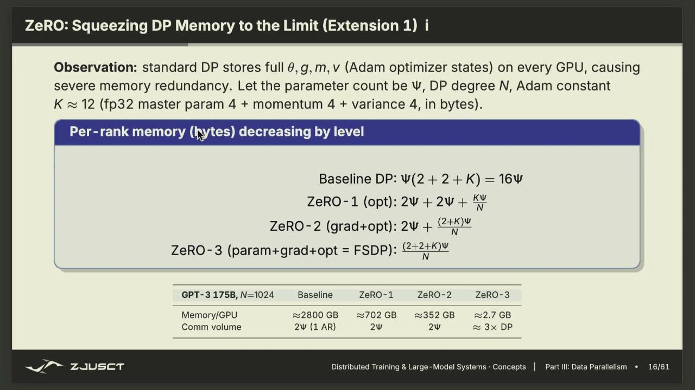
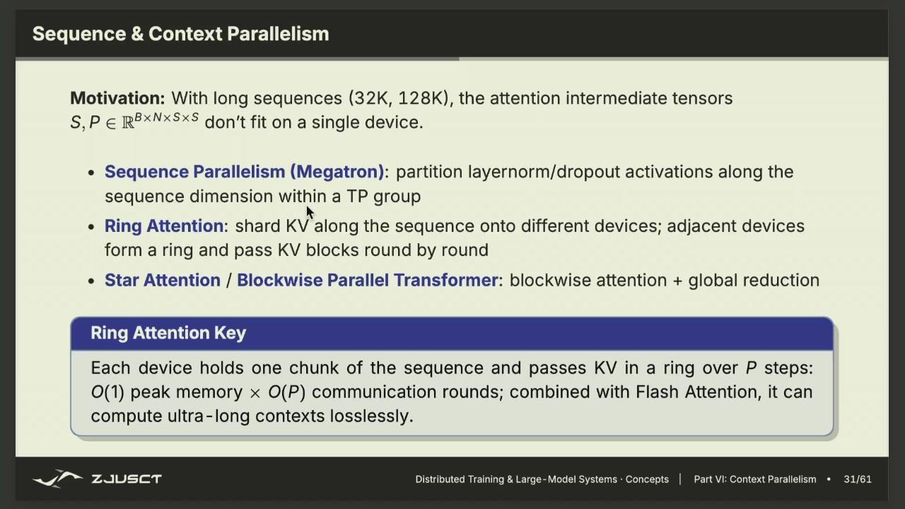

# 07-16 下午：分布式大模型训练与推理

下午这节课从一个很具体的问题开始：模型和 batch 都很大时，一张 GPU 已经放不下或算不动，怎样把一次训练和一次推理拆到多张卡上。后面的 DP、ZeRO、PP、TP、长上下文并行看起来名字很多，实际都在回答同样三件事：每张卡保存哪一部分状态、负责哪一段计算、数据何时需要交给别的卡。

## 自回归语言模型推理

把一句 prompt 交给语言模型后，模型不是一次把整段答案写好，而是在已有 token 的条件下预测下一个 token；把刚预测出的 token 接回输入，再预测下一个，直到结束符。一个 token 在模型中先被映射为长度为 $H$ 的向量，形成形状约为 $[B,S,H]$ 的张量：

- $B$ 是 batch size，一次并行处理多少个样本；
- $S$ 是 sequence length，即 prompt 的 token 数；
- $H$ 是 hidden size，单个 token 的隐藏向量维度。

embedding 只给 token 一个可计算的向量表示，并不含词序。位置编码或位置嵌入再把“它位于第几个位置”补进去。随后张量经过一层又一层 Transformer block；每层由 attention 和 FFN/MLP 等部分组成，最后经输出投影和 softmax 得到词表上的概率分布。

!!! info "同一模型的两种时间尺度"

    处理已有 prompt 时，可以并行计算许多位置，矩阵乘法大而规则；逐 token 生成时，每一步依赖上一步采样结果，只能把不同请求拼在一起提高并行度。二者使用同一套权重，却会由不同资源限制。

训练时的过程比推理多了反向传播。前向传播得到预测分布，与目标 token 算交叉熵损失；反向传播从损失倒着求每个参数的梯度；优化器根据梯度更新参数。以后看到并行训练的代码，先在脑中把它还原成这条链：`forward -> loss -> backward -> optimizer.step()`。并行策略没有改变这件事，只是把每一步拆到多张卡上。

## 分布式训练的约束

模型参数不断增长，而单卡算力和显存并不能无限按同样速度增长。即便参数本身勉强放得下，训练还要保存梯度、优化器状态和中间激活；长序列的 attention 又会放大激活与 KV cache 的开销。于是“模型是否放得下”和“每一步是否来得及算完”是两个不同问题。

分布式训练并不是简单地把一块 GPU 换成多块。若多张卡各自拿到不同数据、各自更新同一个模型副本，却从不通信，它们很快就会变成不同的模型。多卡训练成立的前提是：在该同步的地方同步，在可以独立计算的地方不通信，并尽量把必须发生的通信藏在计算时间里。

## 通信：点对点与集合操作

点对点通信（point-to-point, P2P）是一个 rank 向另一个 rank `send`，对方 `recv`。集合通信（collective communication）由一个通信组里的所有 rank 共同参加，例如 4 张 GPU 同时执行一次 AllReduce。它最终仍由许多点对点传输组成，但由 NCCL、MPI、Gloo 等通信库选择拓扑和实现。

集合操作有一个容易忽略的约束：参与者必须按相同顺序进入同一个 collective。一个 rank 没有进入、卡住或退出，其他 rank 会一直等待，最后通常表现为 timeout。因此调试分布式程序时，不能只看报错的那张卡；要找第一个没有到达同步点的 rank。

### 常见集合通信

设每个 rank 上有一个局部张量，collective 的名称描述数据在组内怎样变化。

| 操作 | 结束后数据在哪里 | 常见场景 |
| --- | --- | --- |
| Broadcast | 根 rank 的同一份数据出现在所有 rank | 初始化参数、同步控制信息 |
| Reduce | 各 rank 数据规约到根 rank | 汇总和、最大值 |
| AllReduce | 规约结果出现在所有 rank | 数据并行梯度同步 |
| Scatter / Gather | 根张量分块下发 / 各分块收回根 | 输入分发、结果汇总 |
| AllGather | 每个 rank 都得到所有分块的拼接 | 临时凑齐分片参数或激活 |
| ReduceScatter | 先规约，再让每个 rank 留一个分块 | 分片梯度与状态 |
| All-to-All | 每个 rank 给所有其他 rank 发送不同分块 | MoE token 路由 |

*图：Scatter 改变数据所有权，Gather 恢复集中表示；每个箭头都对应实际通信量。*

不要把 `AllGather` 和 `AllReduce` 当作只差一个字的函数。前者的结果是拼接后的原始数据；后者的结果是逐元素相加、平均等规约后的数据。训练中究竟该用哪一个，取决于你需要的是完整参数、完整激活，还是一致的全局梯度。

### 通信延迟与带宽

课上用一个常见的近似模型表示一次消息传输：

$$
T_{\mathrm{comm}} \approx \alpha + \frac{n}{\mathrm{BW}}
= \alpha + n\beta
$$

$\alpha$ 是启动延迟，例如建立/调度一次传输的固定开销；$n$ 是消息大小；$\mathrm{BW}$ 是有效带宽，$\beta=1/\mathrm{BW}$。消息很小时，主要输在 $\alpha$，此时合并小消息、减少调用次数比盯着峰值带宽更重要。消息很大时，$n\beta$ 主导，链路带宽、拓扑和传输算法才成为重点。

例如 AllGather 可以用 ring 实现。把 $p$ 个 rank 排成环，每个 rank 先持有自己的第 $i$ 块；每一轮把当前块传给下家，同时从上家接收一块。经过 $p-1$ 轮，每个 rank 都收到了其余所有块。每轮只搬一块较小的数据，链路可同时工作，因而对大消息常有很好的带宽利用率。Ring AllReduce 通常可理解为一段 ReduceScatter 加一段 AllGather。

这也解释了为什么通信库会按消息大小选算法：小张量未必适合 ring 的多轮启动，大张量又不适合让一个根节点成为瓶颈。实际耗时还会受 PCIe、NVLink/NVSwitch、跨节点网络和物理拓扑影响，不能只用 GPU 数量推断。

## 数据并行

数据并行（data parallelism, DP）沿 batch 维切分数据。假设有四张 GPU，GPU 0 处理 mini-batch 的第 0 份，GPU 1 处理第 1 份；每张卡上却都保留完整的模型参数 $\theta$。它们分别执行前向与反向，得到局部梯度 $g_0,g_1,g_2,g_3$。

要让四份模型继续保持一致，更新前需要计算全局平均梯度：

$$
g=\frac{1}{p}\sum_{i=0}^{p-1}g_i,\qquad
\theta\leftarrow\theta-\eta g.
$$

AllReduce 可以同时完成求和和结果分发，所以每张 GPU 得到同一个 $g$，再各自执行同样的 optimizer step，最终参数仍相同。这里的通信发生在反向传播产生梯度之后；没有它，四张卡等价于各自训练四个互不一致的模型。

较早的做法是 parameter server：多个 worker 把梯度交给服务器，服务器汇总、更新参数后再发回。它的逻辑直接，但服务器既是吞吐瓶颈又是单点故障。现代同步 DP 更常让 worker 直接集合通信，不再保留一个集中式参数服务器。

### Global Batch 与梯度累积

若每卡 batch 为 $b$，数据并行大小为 $p$，没有梯度累积时全局 batch 是 $B_{\text{global}}=pb$。显存不够而又希望维持大 batch 时，可连续跑 $k$ 个 micro-batch，只累加梯度、不更新参数，最后再同步/更新；此时全局 batch 为 $pkb$。

这不是单纯的工程细节。batch 变大，单步梯度的统计特性、每个 epoch 的更新次数和学习率设置都会变。吞吐提升不自动意味着同样的收敛效果，训练配置通常要和并行规模一起重新检查。

## 训练显存

以 $\Psi$ 表示参数量。若模型权重和梯度用 BF16，各自约需 $2\Psi$ 字节；使用 Adam 时，通常还有 FP32 主权重、一级动量和二级动量，各占约 $4\Psi$ 字节。于是仅模型状态的常见粗略估算是：

$$
2\Psi\;\text{(BF16 参数)} + 2\Psi\;\text{(BF16 梯度)}
+ 4\Psi\;\text{(FP32 主参数)}
+ 4\Psi\;\text{(一阶动量)} + 4\Psi\;\text{(二阶动量)}
=16\Psi\ \text{bytes}.
$$

对一个 7B 参数模型，这一部分已约为 112 GB，尚未计入 activation、临时 buffer、通信 buffer 和框架开销。具体数值会随混合精度、优化器、是否保存主权重而变，但课上要传达的是：训练显存里最占空间的常常是训练要附带保留的状态，而不只是“模型文件有多大”。

激活是另一笔账。反向传播要用到前向阶段的中间结果，因此常规训练会保存多层 activation；sequence length、batch、hidden size 和层数一大，activation 也可能反过来成为首要瓶颈。activation checkpointing 的思路是少保存一部分，反向时重算，以额外计算换显存；它与 ZeRO 解决的不是同一笔开销。

## ZeRO / FSDP：把模型状态分片

普通 DP 的问题很明显：每张卡都存完整参数、完整梯度和完整优化器状态，计算按数据分了，状态却没有分。ZeRO（Zero Redundancy Optimizer）按阶段去掉这些冗余副本；FSDP（Fully Sharded Data Parallel）是围绕参数完全分片的一类实现。

- **ZeRO-1**：分片优化器状态。每个 rank 只长期保存约 $1/p$ 的 Adam 状态。
- **ZeRO-2**：在 ZeRO-1 基础上再分片梯度。完成反向后用 ReduceScatter，让每张卡只留下自己负责的梯度块。
- **ZeRO-3 / FSDP**：连模型参数也分片。每张卡长期只持有参数、梯度和优化器状态的一个分片。

分得越彻底，单卡常驻状态越少，但运行时需要更多通信。ZeRO-3 在算某一层之前先 AllGather，把该层的完整参数临时凑齐；用完前向后释放不再需要的完整参数。反向到这一层时再 AllGather 参数，计算出梯度后用 ReduceScatter 把已规约的梯度留在对应 owner 上，由 owner 更新自己的参数分片。

*图：ZeRO 依次分片优化器状态、梯度和参数；常驻显存下降，运行时 AllGather/ReduceScatter 增加。*

因此 ZeRO 并不等于“免费省显存”。它选择了用通信换内存：模型因为显存根本无法训练时，这个交换是必要的；网络带宽不足、分片太细或每层过小而频繁 AllGather 时，吞吐反而可能下降。看配置时应区分两类问题：参数状态太大时考虑 ZeRO/FSDP；activation 太大时还要考虑 checkpoint、序列切分或减少 micro-batch。

## 流水线并行

流水线并行（pipeline parallelism, PP）沿网络深度切分。若模型有很多层，可以让 GPU 0 负责前几层，GPU 1 负责中间层，GPU 2 负责后几层。前向时 activation 从第一个 stage 依次传到后面；反向时梯度再反向传回。每张卡只放本 stage 的层，因而可容纳单卡放不下的深模型。

最朴素的排程会产生 pipeline bubble：GPU 0 先忙，其他 stage 在等 activation；前向全部结束后，反向又从最后一个 stage 才开始，前面的卡再次等待。卡的数量越多、每轮只有一个大 batch，空闲比例越明显。

处理办法是把 batch 切为多个 micro-batch，形成填充流水线。GPU 0 算完 micro-batch 0 后就把它交给 GPU 1，自己立刻开始 micro-batch 1；GPU 1 接到 0 后开始计算，后续 stage 也依次被填满。等流水线稳定下来，多个 stage 可以同时处理不同 micro-batch 的前向或反向。bubble 没有消失，但被更多 micro-batch 摊薄。

PP 的通信主要是相邻 stage 间的 activation/gradient P2P 传输，延迟和负载均衡都很重要。如果某个 stage 的层更慢，整条流水线会被它卡住；切层时不能只按层数平均，还要考虑每层计算量、激活大小和显存。

## 张量并行

PP 是按层切，张量并行（tensor parallelism, TP）则把一层内部的大矩阵乘法切到多张 GPU。Transformer 的 attention 投影和 FFN 都包含很大的矩阵乘法，这往往是计算最重的地方。

考虑线性层 $Y=XW$。若按 $W$ 的列切分：

$$
W=[W_0\;W_1\;\cdots\;W_{p-1}],\qquad
Y=[XW_0\;XW_1\;\cdots\;XW_{p-1}],
$$

每张 GPU 可独立算一个 $XW_i$，得到 $Y$ 的一部分列；若后续需要完整的 $Y$，再做 AllGather。若按行切分，则每张卡先算局部乘积，最后用 AllReduce 把各部分相加。不同的切法决定通信发生在算子前还是算子后。

FFN 可以写成

$$
\operatorname{FFN}(X)=\phi(XW_1+b_1)W_2+b_2,
$$

其中 $\phi$ 是逐元素激活函数。第一层把 hidden size 扩到较大的中间维度，第二层再投回去。逐元素激活不会混合不同列，因此可在各 GPU 的局部结果上直接执行；恰当安排 $W_1$ 的列切分与 $W_2$ 的行切分，可把本来两次的全量通信压缩为较少的同步点。这就是 TP 在代码里常见“列并行线性层”和“行并行线性层”配对的原因。

TP 的通信频率很高，因为几乎每层都要在组内交换中间结果。因此通常把一个 TP group 放在同一台机器、使用 NVLink/NVSwitch 等高速互连；把频繁的 TP 通信跨慢网络，会非常不划算。

## 多维并行与通信计算重叠

真实的大模型训练常把几种策略叠起来：节点内做 TP，按层做 PP，剩余维度做 DP，再用 ZeRO/FSDP 分片状态。这常被称为 3D 并行，但不必被名字吓住。读一组并行度配置时，把总 GPU 数写成各维度的乘积，再逐维问：

- DP 组里的卡拿不同数据，何时 AllReduce 梯度？
- TP 组里的卡共享一层计算，哪个线性层后要 AllGather 或 AllReduce？
- PP 的相邻 stage 之间传什么 activation 和 gradient？
- ZeRO 分片后，哪一层前需要临时 AllGather 参数？

通信不一定必须停在计算之后才开始。反向传播从最后一层往前走，某层梯度就绪后可以立刻启动对应 bucket 的 AllReduce，同时 GPU 继续计算更前面的层。若通信在计算结束前完成，它的耗时被隐藏；若网络仍未完成，GPU 才需要等待。bucket 的大小过小会让启动延迟累积，过大又会推迟通信启动，因而是一个需要实测的折中。

## 长上下文与序列并行

长上下文会让 attention 的中间量和 KV cache 迅速增大。即使参数已经由 TP 或 FSDP 分片，单张卡仍可能放不下完整的序列。序列并行（sequence parallelism）和上下文并行（context parallelism）于是沿 sequence 维分割 token 或 K/V 块。

以 ring attention 为例，每张卡保存一段 Q/K/V。它先拿本地 Q 与本地 K/V 算一块 attention，然后把 K/V 块沿环传给下一个 rank，同时接收上一个 rank 的块；经过若干轮，每个 Q 块都和完整上下文的 K/V 做过计算。这样不必把所有 K/V 同时复制到每张卡，峰值内存随序列分片下降，代价是多轮环形通信。

*图：每张卡只持有部分 K/V 块，通过循环传递与本地 Q 逐步和全局 K/V 交互；通信次数随分片数上升，显存峰值随之下降。*

这里有一个数值细节：softmax 不能简单把每一块各自归一化后再相加，因为全局分母依赖所有块。可维护运行中的最大值 $m$、归一化量 $l$ 和加权结果，块到来时用新的最大值重新缩放旧累计量。这类 online softmax 保持数值稳定，使得 attention 可以按块流式计算；FlashAttention 等高效实现同样依赖“分块计算、不物化巨大注意力矩阵”的思想。

## MoE 与 Expert Parallel

Mixture of Experts（MoE）层用 router 为每个 token 选择少数几个 expert，而不是让所有 token 经过同一个 FFN。总参数可以非常大，单个 token 的计算量却只与被选中的少数专家有关。这是 MoE 能扩大模型容量的原因。

代价落在路由和网络上：某张卡上的 token 可能需要送去别张卡拥有的 expert，计算后结果还要按原 token 顺序送回，通常形成 All-to-All。router 若总偏向少数专家，就会出现有的专家/卡很忙、有的很闲；因此需要容量限制和负载均衡损失。MoE 的瓶颈不一定是矩阵乘法，可能是 token 重排、all-to-all、专家不均衡或跨节点拓扑。

## 训练状态与显存账本

训练显存不能只按“模型有多少参数”估算。以混合精度 Adam 为例，参数可能有 bf16/fp16 的计算副本和 fp32 master 副本；每个参数还要保存梯度，以及 Adam 的一阶、二阶动量。再加上前向为反向保存的 activation、临时工作区和 CUDA allocator 的碎片，实际占用常远高于仅存权重的推理。activation 随 batch、序列长度和层数增长，长上下文训练中往往比参数状态更先成为瓶颈。

checkpointing（activation recomputation）只保存若干边界 activation，反向时重跑中间前向以换取显存。它减少的是保存量，增加的是计算和可能的通信；不能把它与持久化检查点混为一谈。后者是故障恢复用的模型/优化器快照。选择并行策略前应分别列出参数、梯度、优化器状态、activation 与通信 buffer，而不是只报一个“显存占用”。

## AllReduce 的语义

数据并行的每个 rank 持有同一组参数、处理不同 mini-batch。若本地梯度为 $g_r$，同步 SGD 需要得到

$$
g=\frac{1}{P}\sum_{r=0}^{P-1}g_r,
$$

然后所有 rank 用同一个 $g$ 更新同一份参数。AllReduce 完成的是求和，除以世界大小可能由框架或优化器完成；把平均做两次会让学习率实际缩小 $P$ 倍。梯度累积时，多个 micro-batch 的局部梯度要在正确边界再同步，`no_sync` 一类接口的含义正是推迟 collective，而不是跳过它。

通信-计算重叠依赖梯度产生的顺序。反向传播从最后一层开始；当某个 bucket 的所有梯度准备好，就可在通信 stream 上启动 AllReduce，同时计算前面层的梯度。bucket 太小，collective 启动次数多；太大，首个通信启动太晚。真正的重叠需要 profiler 时间线证明，并要求网络、GPU DMA 和计算资源没有已经互相饱和。

## Prefill、Decode 与推理调度

prefill 对已有 prompt 的所有 token 做前向并建立 KV cache，query-key 交互与矩阵乘法规模较大，通常更接近计算密集；decode 每步只生成一个新 token，却要读取所有历史 KV，常受显存带宽和单请求延迟限制。continuous batching 把不同请求的 decode step 合在一个 batch，并在请求结束时补入新请求。它必须维护每个序列的长度、采样状态和 KV block 映射，不能像训练那样把所有样本简单 padding 到固定长度。

KV cache 是按层保存的 K/V 张量，其字节数近似为 `layers × tokens × 2 × kv_heads × head_dim × bytes_per_element`。若采用 grouped-query attention，`kv_heads` 小于 query heads，缓存会显著下降；若上下文达到显存上限，调度器必须限制并发、换出、分页管理或拒绝请求。吞吐、首 token 延迟和每 token 延迟互相牵制，单报 token/s 无法描述服务行为。

系统通常同时关注首 token 时间（TTFT）、后续 token 间延迟（TPOT）和总体吞吐。为了吞吐积累很大的 batch，可能伤害交互请求的首 token 延迟；连续批处理、分页式 KV cache、分开调度 prefill 与 decode，都是在处理这个矛盾。

训练和推理也会用 TP、PP、序列并行，但目标不同：训练更在意吞吐、全局 batch 和模型状态；推理更在意 KV cache 能否容纳、请求到达的动态性与用户实际等待时间。分析一个方案之前，先分清正在解决哪一种负载，后面的“优化”才有明确含义。
