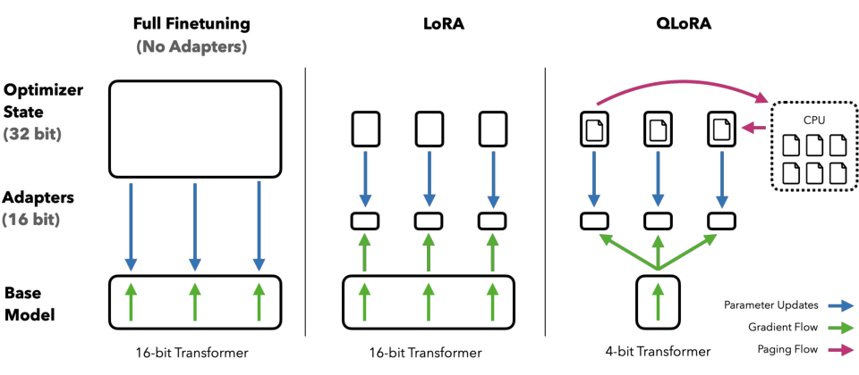
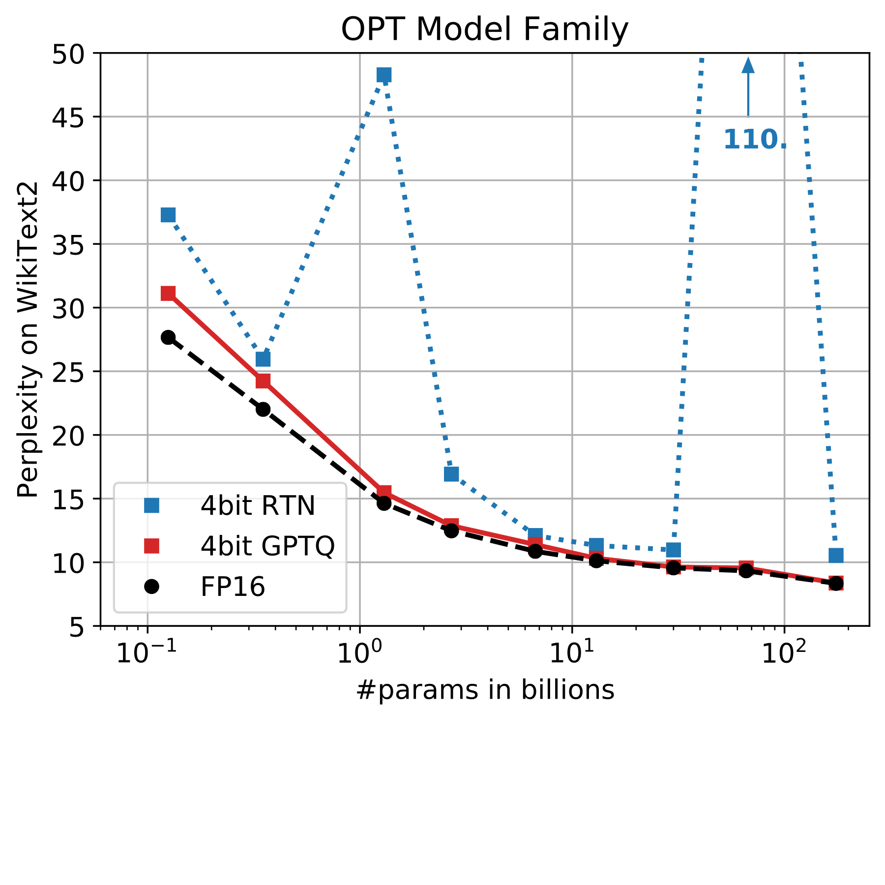
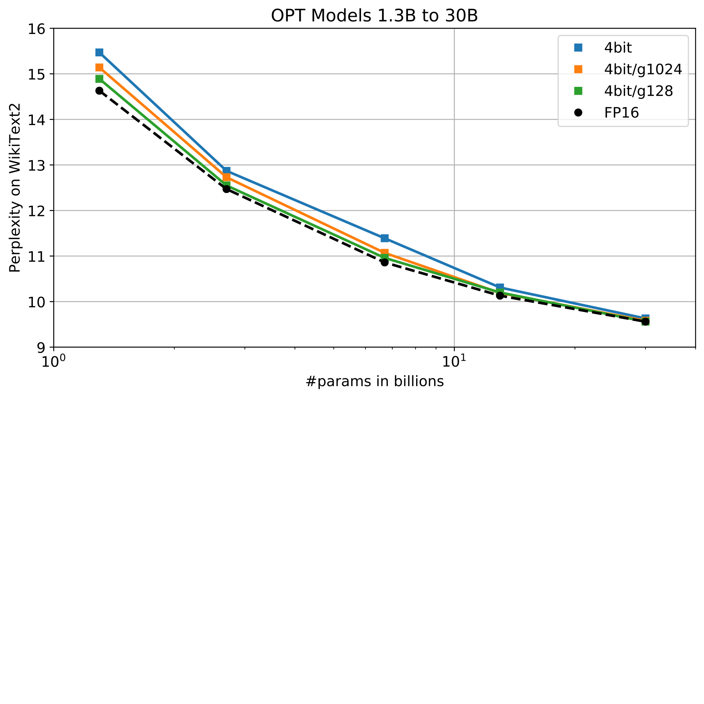
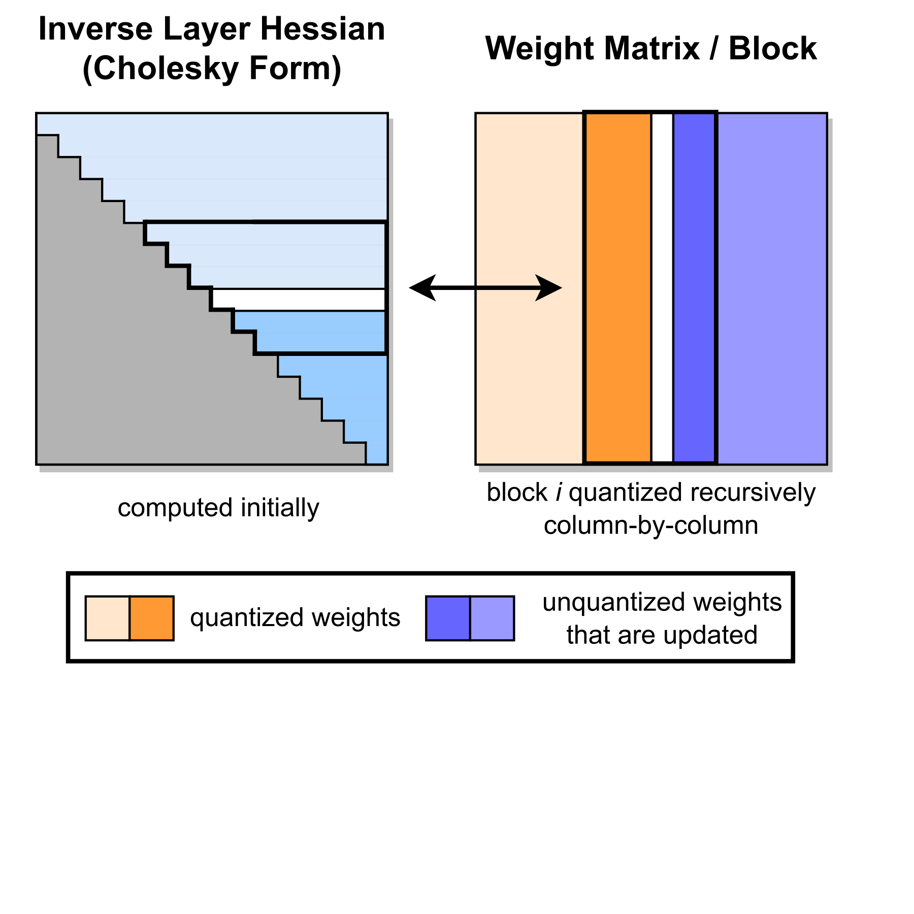

# 07-17 上午：算法—系统协同设计

!!! abstract "与后续实验的联系"

    注意力、并行策略、量化和推理服务与 Lab 3、Lab 5 直接相关。性能分析可从每个 token 的 FLOPs、搬运字节数和设备间通信量开始。模型结构以原论文和框架文档为准，部署接口以推理框架文档为准。[^transformer-paper][^gptq][^vllm]


算法与系统协同设计讨论模型结构、训练或推理运行时，以及硬件资源怎样一起影响可达到的规模和效率。这里的基础设施包括训练集群、GPU kernel（设备上执行的一段计算函数）、并行策略、显存管理、编译器、推理引擎和服务调度。

模型结构会改变通信量、键值缓存和访存量；设备的显存、带宽和互连条件也会反过来影响注意力、混合专家层、精度与上下文长度的实现选择。

!!! quote "DeepSeek-V2 论文中关于 MLA 与 MoE 的说明（译）"

    模型可以在注意力部分压缩键值缓存，也可以在前馈网络部分采用稀疏专家计算。两种设计分别影响推理缓存和每个 token 激活的参数量，因此需要同时考虑模型质量、训练成本和推理吞吐。[^deepseek-v2]

文本先被切成 token，经 embedding 变成向量，再依次通过多层 Transformer block。attention 是 token 按相关性读取并汇聚信息的算子；FFN 则逐个改写 token 的通道向量。训练阶段计算损失、反向传播并更新参数；推理阶段保存每层历史 key/value 向量组成的 KV cache，采样下一个 token，并由调度器组织请求。集群、显存和网络带宽分别限制这条计算链的不同环节。

!!! question "术语自测"

    1. kernel 在 GPU 语境中指什么？
    2. KV cache 保存的是哪两个张量，为什么要保存？
    3. MoE 里的 expert 为什么不能按数学专家理解？
    4. 量化中的 scale 起什么作用？

    ??? tip "详细答案"

        1. kernel 是在 GPU 上由许多线程并行执行的函数。它通常负责向量运算、注意力、矩阵乘法或数据搬运等规则计算。
        2. KV cache 保存各层历史 token 的 key 和 value。生成新 token 时，新的 query 需要查询历史 K/V。缓存它们可以避免每一步重新计算历史 token 的投影。
        3. MoE expert 通常是结构相同、参数不同的 FFN 分支。router 根据输入为 token 选择少数分支。expert 只是网络中的可选计算分支，并不对应人工命名的知识领域。
        4. scale 将低位整数或低精度格点映射回浮点范围。例如 $w\approx s(q-z)$ 中，$s$ 决定整数相邻格点对应的浮点间隔。scale 的粒度会影响误差、元数据和 kernel 开销。

| 观察到的约束 | 需要同时检查的对象 |
| --- | --- |
| 参数、梯度和优化器状态放不下 | 分片策略、精度、offload 与通信代价 |
| attention 中间量过大 | 分块 I/O、上下文并行、窗口或稀疏结构 |
| MoE 吞吐不稳定 | 路由分布、token 重排、专家 batch 与 All-to-All |
| decode 延迟随上下文增长 | KV cache 容量、带宽、分页和调度 |
| 低比特权重未带来加速 | 解包/反量化、scale 读取、矩阵指令和实际 shape |

## 从模型现象到系统选择

=== "注意力分数矩阵过大"

    先区分问题来自模型形式还是实现。标准 attention 的 `[S,S]` 分数随序列长度平方增长。FlashAttention 改写分块计算和数据移动。滑动窗口、稀疏 attention、线性 attention 和状态式模块改变可见范围或历史表示。它们处理的层次不同。

=== "KV cache 放不下"

    先计算 cache 的层数、上下文长度、K/V head 数、head 维度和精度。GQA/MQA 通过减少 K/V head 数减少 cache。MLA 改变缓存表示。量化和分页改变存储格式或分配方式。增加显存会提高容量，却不会减少每 token 的读取带宽。

=== "MoE 的 token 很不均匀"

    router 先为每个 token 选择 expert，随后 dispatch、expert GEMM、combine 依次发生。热门 expert 会让矩阵形状、显存访问和 All-to-All 通信同时失衡。优化前需要分别测 router、重排、通信和 expert GEMM。

=== "权重量化后仍然很慢"

    权重文件变小只说明存储字节减少。运行时还要读取 scale、解包、反量化并执行矩阵乘。小 batch、窄矩阵或不合适的 layout 会让解包和 kernel 启动开销占据主要时间。

## 算法与系统协同设计

CNN、Transformer、预训练、对话模型、多模态模型与 agent 系统使用的表示、训练目标和运行方式不同，却共享 tokenizer、embedding、矩阵乘法、自动微分和分布式训练等基础设施。agent 是能结合环境、记忆和工具调用持续决策的程序系统。模型结构变化会进一步影响训练框架、显存布局和推理服务。

CNN（Convolutional Neural Network，卷积神经网络）主要用于图像等具有局部空间结构的输入。Transformer 由 attention 和 FFN 堆叠而成，是当前语言模型的主流骨架。预训练是在海量通用数据上训练模型的过程。后训练是在预训练模型上继续用指令数据、偏好数据或强化学习调整行为。多模态模型同时处理文本、图像、音频等不同形式的输入输出。这些阶段共享 tokenizer、embedding、矩阵乘法和自动微分等基础设施，因此模型结构变化会进一步影响训练框架、显存布局和推理服务。

预训练带来的变化尤其大。模型先用大量通用语料得到基座能力，再通过指令数据、偏好数据、强化学习或工具交互适配任务。模型覆盖面随之扩大，训练和服务成本也会增加。

算法、数据和模型能力，与并行、编译、存储和运行时经常被分开讨论。实际方案通常需要同时调整两侧。GPU 矩阵单元偏好低精度时，需要重新评估量化误差。MoE 路由触发大量 All-to-All 时，expert placement 和通信路径也要进入设计。KV cache 受限时，MQA、GQA 或 MLA（multi-query、grouped-query、multi-head latent attention）是模型层面的选项。这些方法通过共享或压缩 key/value 表示降低 KV cache 的容量和带宽需求。

协同设计应在方案尚未固定时开始。计算、内存、通信和部署代价都要进入模型选择。模型定型后再处理运行代价，可调整的空间往往较小。


*算力、显存与互连构成系统三角。协同设计需要在三者之间取得平衡。*

判断时先找出瓶颈所在。训练时，参数状态可能放不进显存，activation 也可能更大。长上下文服务时，瓶颈常转向 KV cache 的容量与访存。MoE 会把 token 路由和 All-to-All 通信推到前台。原因不同，优先动作也不同。

!!! question "思考题"

    长上下文服务中 KV cache 放不下，为什么只换更大显存不是完整答案？

    ??? tip "答案"

        更早需要判断瓶颈是容量、带宽还是调度。可以通过 GQA/MQA/MLA 压缩 KV、分页管理、前缀复用、冷块换出或限制并发来改善。只增加显存可能仍被带宽和尾延迟限制，还会改变并发与成本。

!!! question "思考题"

    一个方案在模型结构上减少了 attention 计算量，却让每层都必须额外做一次跨卡 AllGather。为什么不能只看 FLOPs 就下结论？

    ??? tip "答案"

        端到端时间由算力、显存容量、访存带宽、通信和调度共同决定。FLOPs 减少只说明理论计算量变少，若额外通信不能被计算覆盖，实际延迟可能上升。协同设计要比较完整负载下的时间和显存，而不是只比较某一个算子的算术量。

## Scaling Law 与数据

大模型能力提升可以分成预训练、后训练和测试时推理三个阶段。规模定律（scaling law）讨论模型参数量、训练 token 数和训练计算量增加时，训练损失如何变化。它给出的是经验上的资源分配规律，数据质量、重复率、模型结构和训练稳定性都会改变实际曲线。Chinchilla 等工作讨论了参数、数据和计算的配比。[^chinchilla]


*scaling 包括模型、数据、算力与评估之间的反馈循环，即 data flywheel。*

语言模型的预训练目标是给定前面的 token，预测下一个 token。

公式里的 $p_\theta(x_t\mid x_{<t})$ 可以用一个三词例子说明。若前文是“深度 学习”，模型对下一个 token 输出

```text
模型 0.60   学习 0.05   系统 0.30   其他 0.05
```

真实文本的下一个 token 是模型，交叉熵损失就是 $-\log 0.60$，约为 0.51。模型把模型的概率提高到 0.80 时，损失降到 $-\log 0.80$，约为 0.22。交叉熵奖励给正确 token 更大概率。训练损失下降后，仍需通过后训练和评测检查回答质量、事实正确性和安全性。

$$
\mathcal{L}_{\mathrm{LM}}=-\sum_t\log p_\theta(x_t\mid x_{<t})
$$

交叉熵要求模型拟合训练分布，回答是否对用户有用还需要后训练和评测。代码、数学、可执行工具等场景可以提供相对明确的反馈，例如编译是否通过、测试是否通过、工具调用是否成功。这类反馈可以继续变成训练数据。

测试时计算是另一条尺度轴。对同一个基座模型，系统可以让它生成更长的推理过程、并行采样多个候选、调用检索或工具，并进行验证和反思。这样会提高单次请求的计算量和延迟。是否采用要看任务能否从额外搜索中稳定获益。

!!! question "思考题"

    模型变大一定效果更好吗？为什么还要同时讨论数据量、训练计算和质量？

    ??? tip "答案"

        不一定。经验上的 scaling law 通常把参数量、数据量和计算预算放在一起看。若数据不足或重复严重，大模型容易过拟合；数据质量差也会让目标本身不可靠。同一计算预算下，模型规模和数据量之间存在较优配比，不是单方面无限放大参数。

!!! question "思考题"

    测试时让模型并行采样多个候选，为什么不一定带来更好结果？

    ??? tip "答案"

        多采样增加计算和延迟，还需要选择、验证或投票机制。若任务没有可靠判别器，错误候选可能被保留；若候选高度相似，额外计算收益有限。测试时计算只有在能稳定提升最终决策时才划算。

!!! question "思考题"

    若训练预算固定，参数量增加 4 倍而训练 token 数不变，为什么不一定比同时调整两者更划算？

    ??? tip "答案"

        固定预算下，参数量、数据量和可达损失之间存在经验上的配比。参数很多而数据不足时，模型容易记住或过拟合训练分布，损失下降受到限制；数据多而参数不足时，模型容量又可能不够。Chinchilla 类结论强调的就是在预算内寻找参数与 token 数的较优比例。

## 预训练状态与并行策略

一次训练 step 至少包含前向、反向和优化器更新。显存里同时存在参数、梯度、优化器状态和 activation（前向产生、反向求导时需要的中间张量）。Adam 等优化器还会保存额外状态。对大模型而言，参数文件的大小只是这笔账的一部分。

这四类对象可以用一个 7B（约 70 亿参数）模型的 AdamW（带解耦权重衰减的 Adam 优化器）训练粗算一遍。BF16（bfloat16，16 位浮点格式）参数约 14GB，同形状 BF16 梯度约 14GB，FP32（IEEE 单精度浮点）主权重约 28GB，一阶动量和二阶动量各约 28GB，模型状态合计约 112GB。activation 的大小还由 batch、序列长度、层数和 activation checkpointing（保存较少中间量、在反向时重算部分前向结果）决定。检查显存时把这几项分开列，比只报“模型是 7B”更能说明单卡为何放不下，也能说明 ZeRO、FSDP 与 activation checkpointing 各自减少的是哪一笔。

模型规模超出单卡后，训练框架通常混合多种并行维度。

- 数据并行把不同 batch 交给模型副本，最后同步梯度。
- 张量并行把同一层的矩阵乘法切给一组设备。
- 流水线并行按层切模型，activation 沿 stage 传递。
- ZeRO（Zero Redundancy Optimizer，零冗余优化器）/FSDP（Fully Sharded Data Parallel，完全分片数据并行）分片参数、梯度和优化器状态。
- sequence/context parallelism（序列/上下文并行）沿长序列切 attention 的工作。

下面的总览图把常见并行维度放在一张表中。它用于比较每种方法切分的对象、节省的资源和新增通信；具体实现仍要回到本节前后的数据流和通信说明。


*图下方的 `DP × TP × PP × EP (+ CP)` 表示这些并行维度可以组合，组合规模要与互连拓扑一起选择。图中的“优点”和“缺点”是课程概览，实际显存、吞吐和通信量仍取决于模型形状与集群配置。*

并行度增大后，单卡显存、通信频率和调度开销都会变化。矩阵切得更细会降低单卡显存，也会提高通信频率。流水线 stage 变多会产生 bubble（某些 stage 在等待相邻 stage 输入或梯度时的空闲时段）。数据并行增大后，全局 batch 和学习率策略也会变化。训练日志里的 MFU（Model FLOPs Utilization，模型浮点运算利用率）只反映计算单元利用率的一面，还要看通信等待、数据加载和故障恢复。

训练框架把这些选择实现成不同的默认组合。FSDP 更贴近 PyTorch 原生生态，善于做参数、梯度和优化器状态分片。Megatron-LM/Core 通常提供成熟的 TP（Tensor Parallelism，张量并行）、PP（Pipeline Parallelism，流水线并行）、DP（Data Parallelism，数据并行）、EP（Expert Parallelism，专家并行）、CP（Context Parallelism，上下文并行）组合与高性能 kernel。DeepSpeed 覆盖 ZeRO、offload、MoE 等较多场景。模型大小、网络拓扑、团队维护能力和所需并行策略都是选型依据。


*三类框架分别提供贴近 PyTorch 的分片、成熟的多维并行组合，以及较多的 ZeRO、offload、MoE 覆盖。选型取决于实际场景。*

实际排障时，先把一次 step 切成数据准备、前向、反向、梯度同步、优化器更新几个时间段，再看哪段长、哪张卡在等。看到 GPU 利用率低，可能是数据加载不足，也可能是 collective 卡住、流水线不平衡或显存碎片引起的重算。优化前先测量，才不会把时间花在并不主导的部分。

优化器本身也会影响显存和算力。AdamW 是常见默认项，它对每个参数维护一阶与二阶动量，训练效果好，也会多出两份状态。选择并行策略时，也可以比较不同更新规则的收敛成本。


*优化器若能以更少 step 达到相同 loss，就能减少整个训练过程的计算时间。*

以 Muon 为代表的矩阵感知优化器利用参数是矩阵的结构做更新，在部分实验中明显降低达到目标 loss 所需的 FLOPs。它是否适用取决于模型与超参，不能想当然替换；但优化器质量确实是训练成本方程里的一个自由变量，和并行策略、精度选择一样值得在动手堆硬件前先尝试。实际判断仍靠同输入、同 loss 目标下的收敛曲线对比。

!!! question "思考题"

    从 checkpoint 恢复训练时，为什么不能只看参数张量，还要记录优化器状态、数据位置和并行切分？

    ??? tip "答案"

        训练状态包含参数、梯度、Adam 的一阶二阶动量、学习率调度、随机数状态和数据进度。并行训练还涉及张量如何切到各 rank，恢复时布局不一致会导致张量无法直接加载或语义错位。完整 checkpoint 才能保证继续训练与原轨迹尽可能一致。

!!! question "思考题"

    MFU 很高，为什么仍不能说明训练系统已经没有浪费？

    ??? tip "答案"

        MFU 主要衡量计算单元利用率。训练时间还包括通信等待、流水线 bubble、数据加载、checkpoint、重启和同步。某些卡可能空闲而另一些卡高负载，端到端时间仍可能明显超过理想计算时间。

!!! question "思考题"

    FSDP 训练一段全连接层时，为什么要先 AllGather 分片参数，计算后又释放完整参数？

    ??? tip "答案"

        分片保存降低常驻显存，但当前计算可能需要这一层的完整权重。AllGather 临时凑出完整张量，前向或反向用完就释放，显存峰值只保留必要层的完整副本。代价是每次使用分片参数都要通信，因此需要通信计算重叠和合理的分块粒度。

## 高效 Attention 与内存访问

先从单个 attention head 的数据流开始。Q、K、V 可以这样理解。query 是当前 token 用来查询其他 token 的向量，key 是每个 token 用来被查询的向量，value 是被选中后实际贡献给输出的内容向量。三者由同一批隐藏向量乘不同投影矩阵得到。注意力分数来自 query 与 key 的点积，分数经 softmax 变成权重，再对 value 加权求和。

设单个 head 的形状为 $Q\in\mathbb R^{S\times d}$、$K,V\in\mathbb R^{S\times d}$。$QK^T$ 是 $S\times S$，第 $(i,j)$ 个元素表示第 $i$ 个 query 对第 $j$ 个 key 的未归一化分数。softmax 对每一行独立操作，把 $S$ 个分数变成和为 1 的权重。再乘 $V$ 后得到 $S\times d$。除以 $\sqrt d$ 可以控制点积方差。

$$
\operatorname{Attention}(Q,K,V)=\operatorname{softmax}\left(\frac{QK^T}{\sqrt d}\right)V
$$


*Q/K/V 来自同一序列的不同投影。attention 让每个位置按相似度聚合其他位置的信息。*

若序列长度为 $S$，中间的 $QK^T$ 是 $S\times S$。长上下文时，直接物化这个矩阵既占显存，又会在 HBM（high bandwidth memory，GPU 高带宽显存）和片上存储之间搬运大量数据。除了 FLOPs，还要计算这批中间数据的读写量。

以 $S=4096$ 为例，单个 head 的注意力矩阵有 $4096^2$ 个元素，约 1677 万个。用 FP32 保存时，仅这一层一个 head 就要约 64 MB；再乘 batch 数、head 数和层数，规模很快增大。此时瓶颈除了乘加，还包括把中间元素写入 HBM、随后再读出的时间。

FlashAttention 把 $Q,K,V$ 分块，利用寄存器和 shared memory（线程块内可协作使用的片上共享内存）完成块内计算。softmax 的分母依赖全部 key，因此实现会维护块级的运行最大值与归一化量，并在数值稳定的条件下合并每个块的结果。输出与标准 attention 保持相同的数学定义，改变的是分块顺序和数据移动路径。[^flashattention-paper]

!!! quote "FlashAttention 论文的说明（意译）"

    注意力的时间与显存访问都受 I/O 影响。通过分块并尽量让中间结果停留在高速片上存储中，可以在保持精确注意力结果的同时减少高带宽显存读写。[^flashattention-paper]

分块后的计算顺序可以从矩阵上看。把 Q 沿行切成小块，例如每块 128 个 query；K 和 V 沿 key 维切成对应小块。每个 Q 块依次与每个 K/V 块相乘。对某个 Q 块来说，所有 K 块共同决定一个 softmax 分母，块间需要把这些累计量合并。

在线 softmax 可以用一个数值例子说明。设某个 query 对前两个 key 的分数是 $[2,0]$，对后两个 key 的分数是 $[1,3]$。完整 softmax 的权重依赖四个分数共同决定的分母，因此每块的局部结果需要根据全局最大值重新缩放。实现保留当前最大值 $m$、分母 $l=\sum_j e^{s_j-m}$ 和分子 $u=\sum_j e^{s_j-m}v_j$。后一块最大值 3 大于旧最大值 2 时，旧块结果乘 $e^{2-3}$ 后并入新的累计量。FlashAttention 在寄存器和 shared memory 中维护这些运行量，从而省去完整分数矩阵的 HBM 往返。


*图中的加速倍数对应论文所用的模型、输入和 A100 平台。它说明同一套 attention 数学结果在不同序列长度和实现路径下，性能差距会随数据移动方式变化。横轴从 128 增到 4096 时，蓝色和橙色柱一般提高到约 4 倍，说明长序列的中间矩阵读写更值得优化。使用 profiler 时，确认 attention 的 HBM 流量和 kernel 时间占主导后，再将这类观察用于自己的负载。[^flashattention-paper]*

!!! example "练习：找出真正的瓶颈"

    场景是一个长上下文推理服务。模型权重约占 20GB，当前并发请求的 KV cache 共占 60GB，GPU 计算单元利用率只有 35%，日志显示大量时间在 attention kernel 读 HBM。候选方案有四个。

    - A. 增加数据并行副本
    - B. 使用 GQA 或压缩 KV
    - C. 继续提高 batch size
    - D. 只把权重从 BF16 改成 INT4

    ??? tip "详细答案"

        最优先检查 B。当前 KV cache 已占 60GB，attention kernel 又主要在读 HBM，说明容量和缓存读取是直接证据。

        - A 会增加数据并行副本，更适合提高总训练或服务吞吐，不能减少单副本缓存占用。
        - B 通过 GQA 或压缩 K/V 直接减少缓存量与读取量，应先验证。
        - C 继续提高 batch size 可能增加并发 token 数，使 KV cache 更早触顶。
        - D 主要减少权重容量和权重读取，对占主导的 60GB KV cache 帮助有限。

        接下来应分别测 KV cache 占用、attention 读带宽、TTFT 和 TPOT，再决定采用 GQA、缓存压缩、分页管理或算子优化。


*FlashAttention 用分块与在线 softmax 减少 HBM 往返，并保持 attention 的数学结果。它主要优化数据移动。*

GPU 的层级存储决定了这种改写为何有效。HBM 容量大但访问代价高，shared memory 和寄存器容量小却更快。标准实现如果不断把巨大的中间矩阵在 HBM 中读出、写回，算术单元会等待数据；分块后的 kernel 让同一块数据在更近的存储层完成更多计算。这里优化的是 I/O 复杂度，而非把 attention 的数学定义悄悄替换掉。

线性 attention、稀疏 attention、滑动窗口 attention 会改变计算形式或可见范围。它们在代价、表达能力和长序列行为上各有取舍。阅读论文时应分开看。FlashAttention 优化 exact attention 的实现。线性或稀疏方法会改变 attention 的计算复杂度或近似方式。

长上下文再继续增大时，context parallelism 会把 token 或 K/V 块分到多张 GPU。Ring Attention 让 K/V 块在设备间循环传递，每张卡依次处理自己的 Q 与到达的 K/V 块；这把单卡峰值内存降下来，但把问题变成计算与环形通信如何重叠。

传输并不必等到所有计算结束。一个 K/V 块参与本轮 attention 后，可以在当前设备继续算后续 FFN 的同时送往下一张卡；另一侧也可以边接收边准备下一块。通信若能被这段计算遮住，端到端时间就不会简单等于计算时间加通信时间。实际能否重叠取决于块大小、网络带宽、kernel 排程和各阶段负载，写代码时仍要从 timeline 验证。

线性 attention 和稀疏 attention 则试图改变随序列长度增长的代价。线性 attention 用特征映射近似或重写相似度，使某些计算可按结合律重排，避免显式构造全部 $S\times S$ 关系；因果场景中，它可维护随 token 更新的状态。代价是表示能力、训练稳定性和现有推理缓存机制都要重新评估。稀疏 attention 只让一个 query 关注部分 token，固定窗口、块稀疏和动态选 token 是常见做法；动态选择本身也会引入索引和不规则访存的成本。

!!! question "思考题"

    FlashAttention 类方法为什么能降低显存占用？它改变的是注意力数学，还是计算和访存组织？

    ??? tip "答案"

        计算按块进行，softmax 分母在线更新，tile 留在高速存储中逐步完成加权求和。完整的 `S×S` 注意力矩阵不必作为中间结果写回显存。这样保持注意力的数学结果，同时改变计算顺序和访存模式，减少大中间矩阵的读写，也更适合 GPU。

## MoE 路由与执行

Transformer block 里有 attention 和 FFN 两块主要计算。attention 让 token 之间交换信息；普通 FFN 则对每个 token 的隐藏向量单独做两次矩阵投影和一次激活。MoE 保留 Transformer 的主要结构，只将其中的一个稠密 FFN 替换为多个参数不同的 expert FFN，并由 router 选择少数分支执行。[^moe-paper]


*MoE 位于原 FFN 的位置。系统需要处理 token 到 expert 的不规则映射。*


*DeepSeekMoE 在 routed expert 之外加入 shared expert，这是组织专家集合的一种具体方式。*

若一个 token 的隐藏状态为 $x_t$，router 会为 $E$ 个 expert 给分并选出 top-$k$。被选中的 expert 各自计算一个 FFN 输出，最后按 gate 权重加权。

$$
y_t=\sum_{e\in\operatorname{topk}(x_tW_{\mathrm{router}})}g_{t,e}\,\operatorname{FFN}_e(x_t)
$$

这里的 expert 是同构、参数不同的神经网络分支，分工由训练得到。名称只表示可选的计算分支，并不对应人工命名的数学或代码领域。MoE 的容量因此可以很大，而单个 token 只激活少数专家，计算量不随总专家数线性增长。

用一个三 token、四 expert、top-2 的例子说明这条公式。router 为每行输出四个分数。

```text
token A: expert0 0.55, expert1 0.25, expert2 0.15, expert3 0.05
token B: expert0 0.10, expert1 0.50, expert2 0.30, expert3 0.10
token C: expert0 0.20, expert1 0.10, expert2 0.45, expert3 0.25
```

A 选择 expert0 和 expert1，B 选择 expert1 和 expert2，C 选择 expert2 和 expert0。dispatch 阶段把这些 token 重新排成 expert0 的 `[A,C]`、expert1 的 `[A,B]`、expert2 的 `[B,C]`，各 expert 对自己的小矩阵执行 FFN，最后按原 token 位置 scatter 回去并加权相加。系统真正处理的正是这种不规则重排。

从系统角度看，困难不在这个公式本身。router 选出的 token 往往散落在 batch 的不同位置，而同一个 expert 的权重希望服务一小批连续 token。实现通常要先记录 `(token_id, expert_id, gate)`，按 expert 重排 token，完成专家内部的批量 GEMM，再按 `token_id` scatter 回输出。单机上这是索引、缓冲区和数据布局问题；多卡 expert parallel 中，它会进一步变成 All-to-All。若少数 expert 被频繁选中，计算和通信都会失衡，因此容量控制和负载均衡也进入训练设计。

route、dispatch、专家矩阵乘法和 weighted merge 分别有自己的数据布局与计时边界。token 按 expert 重排后，矩阵单元才会看到足够规则的小批量；重排本身、索引和 scatter 也必须计入总时间。这里的性能判断依赖矩阵形状、低精度算术和内存访问，而不是只看某一条 GEMM 指令。

!!! question "思考题"

    top-k 路由和负载均衡目标为什么可能冲突？系统上如何缓解？

    ??? tip "答案"

        top-k 只关心每个 token 选质量最好的 expert，容易造成热门 expert 被过度选中；系统希望各 GPU 的工作量均衡。容量限制、辅助均衡损失、expert 复制或重排调度都在这个矛盾上折中。设计目标要同时看模型质量和吞吐，不能只看路由精度。

!!! question "思考题"

    FlashAttention 减少 HBM 读写，为什么这常常比减少 FLOPs 更重要？

    ??? tip "答案"

        attention 的大 $S\times S$ 中间矩阵写入显存再读回，会消耗大量带宽。分块计算让 tile 留在 shared memory 或寄存器中完成乘加、softmax 累计和输出更新，中间矩阵不必完整写回 HBM。计算总量近似不变，但访存次数显著减少，GPU 空等数据的时间下降。

## 参数高效微调

???+ note "低比特量化用整数近似浮点权重"

    深度学习里的每个权重通常是 32 位浮点数（FP32，单精度浮点），也常用 16 位 FP16（半精度浮点）或 BF16（bfloat16，16 位浮点格式）以减少内存。量化进一步用整数格式表示权重，例如 8 位 INT8 或 4 位 INT4。权重从 16 位降到 4 位时，存储和搬运量约为原来的四分之一，模型更容易装进显存，推理时也能少读数据。

    4 位只能表示较少的数值，直接把浮点权重四舍五入到最近的 4 位格点会引入误差。量化通常配合 scale，即缩放系数。近似地 $\text{权重}\approx scale\times(\text{整数} - zero)$。量化以部分精度换取内存与带宽节省。误差是否可接受，取决于任务对数值波动的容忍度。GPTQ、W4A16（权重 4 bit、激活 16 bit）等方法处理的正是这类误差与性能权衡。

    可以把量化理解为用更粗的刻度尺量长度。存储需求更小，刻度也更粗。量化算法尝试让近似结果尽量接近原值。

!!! info "微调、量化和 QLoRA 处理的对象不同"

    | 名称 | 是否更新基座权重 | 主要目的 | 与其他方法的关系 |
    | --- | --- | --- | --- |
    | 全量微调 | 更新 | 让全部模型参数适应新任务 | 微调的完整形式 |
    | 低秩适配（LoRA） | 冻结 | 只训练一个小的低秩增量，减少训练状态 | 可替代全量微调的参数更新方式 |
    | 量化 | 通常冻结 | 用更少比特存放或计算张量，降低显存和带宽 | 主要改变数值表示，不决定训练哪些参数 |
    | 量化低秩适配（QLoRA） | 冻结的基座使用低比特 | 在低比特基座上训练 LoRA 分支 | LoRA 与量化的组合 |

    **基座权重**是预训练模型原有的大矩阵。**adapter** 是附加在基座旁的小型可训练分支。LoRA adapter 的内容就是下面的低秩矩阵 $A,B$。它可以随任务单独保存，也可以在部署前合并回基座权重。

全量微调要更新所有参数，并保存相应梯度和优化器状态。LoRA（low-rank adaptation）固定预训练权重矩阵 $W_0$，只学习低秩更新。[^lora-paper]

$$
W=W_0+\Delta W,\qquad \Delta W=BA
$$

其中 $A\in\mathbb{R}^{r\times d}$、$B\in\mathbb{R}^{k\times r}$。$r$ 是中间维度，也称秩。它比原线性层的输入维度 $d$ 和输出维度 $k$ 小得多。训练时只保存和更新小矩阵 $A,B$。部署时可以把 $BA$ 合并进 $W_0$，也可以保留 adapter 以便在同一基座上切换任务。

低秩的含义来自矩阵乘法形状。设原线性层把 $d$ 维输入变成 $k$ 维输出，则 $W_0$ 是 $k\times d$，全量微调要更新 $kd$ 个参数。LoRA 令 $A$ 为 $r\times d$，$B$ 为 $k\times r$，其中 $r\ll \min(k,d)$。可训练参数只有 $r(k+d)$。若 $k=d=4096$、$r=16$，全量参数约 1678 万，LoRA 分支约 13.1 万，比例不到 1%。前向计算也保持清晰，输入 $x$ 乘 $A$ 得到 $r$ 维中间向量，乘 $B$ 得到 $k$ 维增量，加到 $W_0x$ 上。


*训练 LoRA 时只更新低秩分支，基座权重保持冻结。*


*低秩分解 $BA$ 会减少可训练参数量。部署时可以把 $BA$ 合并回 $W_0$，也可以保留 adapter。*

QLoRA 再把冻结的基座量化到低比特，以更少显存加载大模型，同时让 LoRA 分支保持可训练精度。[^qlora-paper] 名称中的 Q 表示 quantized，即量化后的基座。它不把全部训练张量都压成同一种低比特格式。权重、激活、梯度和 KV cache 对误差的敏感度不同，缩放因子的粒度、异常值、累积精度和硬件指令都会影响最终效果。



*从左向右读这张图。全量微调需要为整个 16-bit Transformer 保存优化器状态。LoRA 冻结基座，只给小 adapter 更新参数。QLoRA 再把基座以 4-bit 存放，同时让 adapter 保持可训练精度。右侧 CPU 方框表示论文中的 paged optimizer 管理，它服务于训练峰值内存，并不等于推理时的 PagedAttention。两者都使用分页思想，管理对象和运行阶段不同。[^qlora-paper]*

!!! question "思考题"

    原线性层是 `[4096, 4096]`，LoRA 取秩 $r=16$。为什么可训练参数远少于全量微调？

    ??? tip "答案"

        全量微调要更新约 1678 万个权重。LoRA 用 `B [4096,16]` 和 `A [16,4096]` 表示低秩增量，可训练参数约 13.1 万，不到 1%。基座权重冻结，训练状态和梯度的显存也相应减少。

!!! question "思考题"

    LoRA 把 $\Delta W$ 写成 $BA$，训练时冻结 $W$。为什么这仍能改变模型行为？

    ??? tip "答案"

        前向输出变成 $Wx+BAx$。$W$ 固定，但低秩矩阵 $B$ 和 $A$ 参与每次计算，等价于给原线性层增加一个可学习的增量。微调更新的是这个增量，而不是重写整个权重矩阵。参数少、训练和保存成本低，代价是表达能力受秩 $r$ 限制。

## KV Cache 与推理内存

自回归推理分为 prefill 和 decode。prefill 一次处理完整 prompt，计算所有输入 token 的 K/V 并建立 cache。decode 每步生成一个 token，需要读取前文 cache、计算新 token 的 Q/K/V，再把新的 K/V 追加进去。

设有 $L$ 层、$H_{kv}$ 个 KV head、每个 head 维度为 $d$、上下文长度为 $S$，单请求 KV cache 大小近似随

$$
2\times L\times S\times H_{kv}\times d
$$

增长，其中 2 表示 K 与 V。多并发请求、长上下文和多轮对话会很快填满 GPU HBM。decode 每步算术量并不大，却反复读取越来越长的 cache，常呈现 memory-bound 或 I/O-bound 特征。

代入一个典型规模。$L=32$、$H_{kv}=8$、$d=128$、$S=1000$、每个元素用 BF16 的 2 字节保存时，单请求 KV cache 为

$$
2\times32\times1000\times8\times128\times2=131{,}072{,}000\ \text{bytes}
$$

约 125MiB。100 个并发请求就超过 12GiB。这还没有计入 allocator 元数据、碎片和临时 buffer。decode 每步新计算量主要是当前 token 的投影，但 attention 必须读取全部历史 K/V，因此长上下文服务常被显存带宽限制。


*分层缓存用较慢但更大的存储层容纳冷 KV 块。*

分层缓存是其中一种处理方法。热请求与正在生成的 token 留在 GPU。暂时不用或已被逐出的块可以转到 CPU DRAM，再在需要时取回。这样会增加 PCIe/NVLink 传输与调度复杂度。PagedAttention 一类设计把 KV cache 切成固定大小 block，用逻辑块表管理物理块，减少连续大块分配造成的碎片，也便于请求共享前缀。

前缀缓存复用的前提很严格。从开头到命中位置的 token 序列必须相同。共享系统提示词、相同文档前缀或多人重复查询同一段资料时，收益很高。工具调用不断返回不同结果的 agent 场景中，一处差异就会让后续前缀失去复用条件。缓存压缩、选择性保留和线性 attention 的固定状态都可能减小内存，也可能降低这种复用能力。系统设计要把平均命中率、尾延迟和请求类型一起看。

模型结构也能降低 cache。Multi-Query Attention 让多个 query head 共用较少的 KV head。Grouped-Query Attention 是介于 MHA 和 MQA 之间的折中。某些 latent attention 先把 KV 压缩为更小的潜变量。这些选择会影响推理内存、带宽、模型质量和 kernel 形状。


*共享或压缩 KV head 能显著缩小缓存与带宽，同时会影响表达能力与实现复杂度。*

这几种变体在缓存字节数上有干净的对照。若每层有 $h$ 个 query head、分组 $g$ 个、每 head 维度 $d_k$，则 MHA 需为每个 head 各存一份 K/V，缓存约 $2h d_k$；GQA 让一组 query head 共享一份 K/V，约 $2g d_k$（MHA 的 $g/h$）；MQA 让全部 query head 共用一个 K/V，约 $2d_k$（MHA 的 $1/h$），是三者里缓存最小的。

以 32 个 query head、每个 head 64 维为例。MHA 缓存 $2\times32\times64=4096$ 个元素；GQA 若 4 个 query head 共用一份 KV，缓存 $2\times8\times64=1024$ 个元素；MQA 缓存 $2\times1\times64=128$ 个元素。数值上很容易看出为什么 GQA 会成为推理系统的常见折中。


*MHA 的缓存最大。MQA 的缓存最小。GQA 在两者之间折中。MLA 把 K/V 压缩成共享潜变量，用于降低缓存开销。*

MLA（Multi-head Latent Attention）更进一步，不直接共享完整 K/V，而是把 KV 低秩联合压缩成一个较小的潜变量 $c_t$，推理时只缓存这个潜向量，再在线还原。它的缓存量（如论文中 $d_c+d_r$）与 head 数无关，却能保留接近 MHA 的表达能力。正因为 KV cache 是长上下文推理的显存与带宽瓶颈，压缩 KV 这件事既是模型架构选择，也是系统能在多长上下文、多大并发下运行的变量。

!!! question "思考题"

    batch size 为 1，序列长度 4096，层数 32，head 数 8，head dim 128，K 和 V 均为 FP16。KV Cache 大约是多少字节？

    ??? tip "答案"

        每个 token 每层需要 K 和 V 各 `8×128` 个元素，共 `2×8×128=2048` 个 FP16 值。32 层就是 `2048×32=65536` 个值，每值 2 B，单 token 约 131072 B。4096 个 token 约为 `131072×4096=536870912 B`，即约 512 MiB。

!!! question "思考题"

    MHA、GQA、MQA 的 KV cache 大小为什么不同？

    ??? tip "答案"

        MHA 为每个 query head 保存一份 K/V；GQA 让一组 query head 共享一份 K/V；MQA 让所有 query head 共用一份 K/V。因此同样 head 数下，MQA 缓存最小，MHA 最大，GQA 位于两者之间。

## 量化推理与服务调度

低比特权重减少容量和带宽压力，校准误差、反量化路径与服务调度决定这部分节省能否转化成端到端收益。

对称量化和非对称量化的区别可以用同一组数看清楚。对称 INT4 通常把整数范围取为 $[-7,7]$，若一组权重最大绝对值是 1.0，scale 为 $1/7$。权重 $[-1.0,0.2,0.8]$ 量化为 $[-7,1,6]$，反量化为 $[-1.0,0.143,0.857]$，误差分别为 $[0,0.057,0.057]$。

非对称量化适合分布整体偏移的数据。若取值范围是 $[-1,1]$，整数范围 $[0,15]$，可令 $s=2/15$、$z=7.5$，公式为 $x\approx s(q-z)$。零点不再必须占据整数 0，因此同样的位宽能覆盖不对称区间。选择哪一种，取决于权重、激活或 KV cache 的分布以及 kernel 是否高效支持 zero-point。

!!! question "量化计算检验"

    一组权重为 $[-0.7,0.1,0.7]$，采用对称 INT4，整数范围为 $[-7,7]$，scale 取 $0.7/7=0.1$。写出量化整数和反量化结果。

    ??? tip "详细答案"

        对称量化可写成 $q=\operatorname{round}(w/s)$，反量化为 $\hat w=sq$。

        ```text
        w / s = [-7, 1, 7]
        q     = [-7, 1, 7]
        w_hat = 0.1 × [-7, 1, 7]
              = [-0.7, 0.1, 0.7]
        ```

        三个值刚好落在 0.1 的格点上，因此反量化结果与原值相同。若原值为 $0.15$，$0.15/0.1=1.5$，按最近整数取为 2，反量化为 0.2，误差为 0.05。实际权重分布越偏离格点，越依赖 scale 粒度、校准和补偿算法控制误差。


*量化把连续范围映射到有限格点。格点越粗，存储越省，误差也越大。*

### 量化误差与 GPTQ

权重量化除了观察 $\lVert W-\hat{W}\rVert$，还要观察线性层的输出扰动 $X(W-\hat{W})$。输入激活在某些方向幅度很大时，较小的逐元素权重误差也可能带来明显输出偏移。GPTQ 用校准样本的激活二阶信息近似这种敏感度，按列或组逐步量化并补偿后续权重的误差。校准集不需要标签，但应覆盖实际 prompt 的激活分布；完全无关的短文本可能使量化后的困惑度恶化。

量化还有一个简单基线 RTN（round-to-nearest）。每个浮点权重直接四舍五入到最近格点，不做校准和误差补偿。它计算简单、结果可复现，适合与 GPTQ 对照。4-bit 权重下，RTN 通常会让 NLL（negative log-likelihood，负对数似然）明显变差，因为单个权重误差会受激活方向放大。GPTQ 会按真实输入分布补偿这部分误差。阅读 `quantize.py` 时，应先确认使用 RTN 还是带校准的 GPTQ。

论文常用 **perplexity（困惑度）** 报告语言模型质量。它由平均 NLL 推出，数值越低表示模型为真实 token 分配的平均概率越高。下面图中的黑色 FP16 曲线是高精度参考，红色 GPTQ 曲线越接近黑色，说明量化后概率分布保留得越好。



*先看红线和黑色虚线的距离。中大型 OPT 模型上，4-bit GPTQ 的红线大体贴近 FP16；蓝色 RTN 在若干模型规模上明显更高，说明简单四舍五入造成更大概率误差。图中的上箭头表示数值超过图的纵轴范围，并不表示性能更好。[^gptq]*

group-wise scale 在质量、元数据和 kernel 复杂度之间折中。组越小，scale 越能贴合权重分布，但每组都要读取 scale/zero-point，量化元数据比例升高，fused kernel 的访存也更碎。对称 INT4 通常把 4-bit 值解释为有符号范围并使用一个 scale。非对称方案额外使用 zero-point。反量化语义应写清，例如 `w ≈ scale * (q - zero)`，以及 scale 按输出通道、输入组还是张量共享。



*图例中的 `g1024` 与 `g128` 表示一组 scale 覆盖的连续权重数量。绿色 `g128` 通常比蓝色全层共用 scale 更接近 FP16，因为较小组能适应局部权重分布。代价是每组都要额外保存和读取 scale，因此图中的质量提升不能单独决定最终 kernel 速度。[^gptq]*

NLL 用于检验推理是否仍是同一概率模型。对 token 序列 $x_1,\ldots,x_T$，忽略不计分的前缀后，

$$
\mathrm{NLL}=-\sum_t\log p_\theta(x_t\mid x_{<t})
$$

一个最小例子可以说明 NLL 的敏感性。目标 token 的概率从 0.9 变成 0.8，单点 NLL 从 0.105 增到 0.223，变化并不醒目；若第 1000 个 token 的概率都发生这种下降，总 NLL 会增加约 118。逐 token 概率误差会累积，因此固定测试集上的 NLL 比观察一段生成文本更适合检查量化是否破坏了模型分布。

比较 W4A16 与高精度模型时必须使用完全相同的 tokenizer、样本、mask 和 logit 处理；只比较生成文本的看起来像不像无法发现小而系统性的概率偏差。端到端计时也应说明 tokenizer、KV cache 预热与采样策略是否包含。

### 位宽、缩放与累加路径

推理量化的直接收益是减少权重和激活的存储与搬运，并让硬件使用更高吞吐的低精度矩阵路径。低比特格式往往需要按 tensor、channel 或小 block 设置 scale；scale 的粒度越细，误差通常越小，但元数据和计算也更多。不能只看 4-bit 这个标签，还要看格式、缩放和校准方式。

量化可粗略理解为把浮点值 $x$ 映射到整数或低位浮点表示 $q$，运行时再借助 scale 还原近似值，$x\approx s(q-z)$。$s$ 决定步长，$z$ 在非对称量化中处理零点。整个张量只共用一个 scale 时，少数异常大值会占据较多可表示范围。按更小 block 设 scale 会改善误差，也会增加 scale 的读取和 kernel 处理。权重、激活和 KV cache 的数值分布不同，通常不会使用完全相同的方案。



*这张图用于理解 GPTQ 为什么不同于 RTN。RTN 可以独立处理每个权重。GPTQ 则按列块逐步量化当前列，并利用校准激活的二阶信息估计这次舍入会怎样影响层输出，再把误差补偿到尚未量化的列。初学时不必推导逆 Hessian；先记住它记录了不同权重误差在输入分布下的相关性。橙色列表示已固定的低比特值，蓝紫色列会随补偿更新。[^gptq]*

量化还要区分训练和推理。推理时模型权重已经固定，常可先做校准再转换格式；训练中的权重与激活持续变化，低精度算子、梯度累积和主权重精度都要参与设计。低位宽的收益只有在硬件有相应矩阵指令、数据布局与 kernel 能把它用起来时才会兑现。文件体积缩小，不自动等于吞吐按同一比例提高。

在 W8A8 这类路径中，权重和激活以 `int8` 保存，点积通常以更宽的 `int32` 累加，再依靠 scale 回到浮点范围。这样做减少搬运字节数，也可能使用硬件的整数矩阵乘加单元。scale、量化误差、tile 布局和较小的专家 batch 仍会决定实际速度。MoE 的专家 FFN 是较重的规则计算部分，量化与矩阵 kernel 往往就落在那里，路由和合并仍需单独处理。

### 融合反量化与 GEMM

W4A16 把权重压成 INT4，激活仍以 FP16/BF16 等较高精度参与计算。实际 kernel 通常按 group 保存 scale 和 zero point，把两个 INT4 值打包进一个字节。运行时再解包、转换到计算精度并乘上 scale。若先把所有权重反量化成 fp16 临时矩阵再调用 GEMM，就会额外写出并读回一个完整高精度权重张量。

fused dequant-GEMM 在 tile 被搬入寄存器或 shared memory 时完成解包和缩放，让结果直接参与矩阵乘加，避免这个全局中间量。它仍受 tensor core 所需布局、tile 对齐、group 边界和 scale 加载影响。batch 很小或矩阵很窄时，launch、访存和 reduction 开销可能盖过理论算力优势。看到实现中的 `pack`、`unpack`、`scales` 和 `group_size` 时，可以检查数据在哪个维度分组、谁负责读 scale，以及反量化后的值是否离开计算单元。

### 端到端服务调度

??? note "推理服务术语"

    - **continuous batching** 指请求可以在不同时间加入或离开同一个运行批次。它与固定 batch 相比，减少了等待最长请求结束的空闲时间。
    - **PagedAttention** 把 KV cache 分成固定大小的块，并用块表记录一条请求使用哪些物理块。它处理的是缓存分配和碎片，不改变注意力的数学定义。
    - **speculative decoding** 先由较小的草稿模型提出多个候选 token，再由目标模型验证。它处理的是逐 token 生成的串行步数，不改变目标模型最终采用的概率规则。
    - **offload** 把暂时不用的数据从 GPU 移到 CPU 内存或其他存储层。它增加容量，也会引入传输和调度开销。


*低比特格式的缩放因子粒度也会不同。*

服务端需要同时处理吞吐和延迟。continuous batching 允许请求在不同时间加入批次，提高设备利用率。prefill 与 decode 的资源特征不同，常分开调度。PagedAttention 通过分页方式管理 KV cache。[^pagedattention] 投机解码（speculative decoding）由小模型或草稿分支一次提出多个 token，再由目标模型验证，以额外计算减少串行 decode 轮数。收益受接受率、模型大小和请求长度影响。[^speculative-paper]

假设草稿模型一次提出四个 token，目标模型一次前向验证这四个位置。前三个 token 都符合目标模型分布、第四个被拒绝时，这一轮接受三个 token。传统 decode 需要三次串行目标模型前向。草稿质量很差时，多数候选被拒绝，目标模型既要验证失败候选又要回退，额外计算可能超过节省。接受率、草稿长度和并行验证的实现共同决定收益。


*草稿模型生成一批候选，再由目标模型一次性验证。额外计算用于减少串行生成步数。*

大模型在有限显存上运行时，GPTQ 是一种训练后量化方法。它根据校准数据选择低比特权重表示。INT4 表示每个量化权重使用 4 个比特。NLL（negative log-likelihood，负对数似然）用于检查模型为真实 token 分配的概率是否明显变差。优化对象不只是一层线性算子，还包括反量化与 GEMM、KV cache 分配、prefill/decode 调度、CPU/GPU offload 与 profiler 中真正占时的阶段。显存、省下的字节和吞吐相互制约，必须在完整推理负载上比较。

!!! warning "量化正确性的检查范围"

    输出文本受采样随机性影响，难以比较。固定 token 序列、tokenizer、mask 与 logit 处理后计算 NLL，才能判断误差来自量化还是输入前处理。融合 kernel 改了权重布局时，还要确认 dequant 后的数值语义保持一致。

!!! question "思考题"

    为什么量化误差常常不只是“把浮点改成整数”这一步？计算路径中还有哪些误差来源？

    ??? tip "答案"

        权重和激活要先用 scale 映射到低比特范围，超出表示范围的值会被截断或饱和。整数矩阵乘后的累加类型、反量化顺序、scale 精度、激活异常值和 GEMM 融合方式都会影响结果。若逐层误差被后续非线性放大，最终输出差异可能明显，因此要做端到端校验。

!!! question "思考题"

    INT4 权重文件变小了，为什么推理速度不一定按 4 倍提升？

    ??? tip "答案"

        速度取决于反量化、解包、scale 读取、矩阵形状、tensor core 利用率、KV cache 和调度。若 batch 很小或 kernel 需要频繁解包，固定开销可能占主导。文件大小只反映存储，不自动等于端到端吞吐。

!!! question "思考题"

    speculative decoding 的草稿模型接受率很低时，为什么可能比普通 decode 更慢？

    ??? tip "答案"

        目标模型仍要验证整批草稿 token，还会为被拒绝的位置做回退。接受率低意味着多数额外前向没有换来有效输出，同时草稿模型本身的生成也有开销。收益取决于每次接受的 token 数、草稿长度和并行验证实现，不是固定加速比。

## Agent 与 Harness

训练、推理、显存和调度最终都要由应用代码编排。agent 系统可概括为 Model 加 Harness。模型生成文本或结构化调用意图；harness 负责工具调用、状态维护、错误处理、重试和停止条件。

- **Model** 负责根据上下文产生文本、计划或工具调用意图。
- **Harness** 负责构造 prompt、发起工具调用、管理子任务、维护状态、检查返回值并决定重试和停止条件。不同 harness 会显著改变同一模型在具体任务中的行为。


*模型输出文本或调用意图。harness 负责执行、校验和状态管理。将二者分开描述，便于分别分析模型能力和系统流程的限制。*

agent 系统需要组织环境、工具和记忆。以 coding agent 为例，harness 决定何时读取代码、运行测试、查看报错以及怎样重试。harness 由应用开发者控制，通常可以直接测试和迭代；模型本身的改动则可能涉及微调或重训。因此，agent 场景的系统设计常从 harness 的输入、工具、状态和反馈流程开始。

环境、工具、记忆和状态机是 harness 的四个基本部件。环境提供观察结果，例如文件内容或命令输出。工具是模型可以调用的函数，例如读文件、搜索代码、运行测试。记忆保存跨轮可用的信息。控制流决定什么时候停止、重试或请求人工确认。模型输出文本或结构化调用意图，harness 执行动作、检查返回值并处理异常。

多模态模型把输入扩展为图像、视频、音频或动作。视觉编码器把图像变成视觉 token，再与文本 token 在语言模型中融合。生成任务可能使用自回归、扩散或两者混合的架构。图像 token 数、视频帧数和跨模态 attention 都会直接放大上下文与推理成本。

性能分析先把瓶颈落到算力、显存、带宽、通信或请求调度中的某一项，再决定改模型、kernel、精度还是系统。笼统地说模型跑得慢无法导出可验证的优化实验。

!!! question "思考题"

    同一个大模型接上不同 harness，为什么表现可能差别很大？

    ??? tip "答案"

        harness 决定如何组织 prompt、调用工具、保存状态、处理错误和停止任务。模型只输出文本或调用意图，真正执行动作和检查结果的是外围代码。工具选择、上下文管理和重试策略不同，任务成功率也会不同。

[^deepseek-v2]: DeepSeek-AI et al., *DeepSeek-V2: A Strong, Economical, and Efficient Mixture-of-Experts Language Model*, <https://arxiv.org/abs/2405.04434>.
[^chinchilla]: J. Hoffmann et al., *Training Compute-Optimal Large Language Models*, <https://arxiv.org/abs/2203.15556>.
[^flashattention-paper]: T. Dao et al., *FlashAttention: Fast and Memory-Efficient Exact Attention with IO-Awareness*, <https://arxiv.org/abs/2205.14135>.
[^moe-paper]: D. Lepikhin et al., *GShard: Scaling Giant Models with Conditional Computation and Automatic Sharding*, <https://arxiv.org/abs/2006.16668>.
[^lora-paper]: E. Hu et al., *LoRA: Low-Rank Adaptation of Large Language Models*, <https://arxiv.org/abs/2106.09685>.
[^qlora-paper]: T. Dettmers et al., *QLoRA: Efficient Finetuning of Quantized LLMs*, <https://arxiv.org/abs/2305.14314>.
[^pagedattention]: W. Kwon et al., *Efficient Memory Management for Large Language Model Serving with PagedAttention*, <https://arxiv.org/abs/2309.06180>.
[^speculative-paper]: Y. Leviathan et al., *Fast Inference from Transformers via Speculative Decoding*, <https://arxiv.org/abs/2211.17192>.
[^transformer-paper]: A. Vaswani et al., *Attention Is All You Need*, <https://arxiv.org/abs/1706.03762>.
[^gptq]: E. Frantar et al., *GPTQ: Accurate Post-Training Quantization for Generative Pre-trained Transformers*, <https://arxiv.org/abs/2210.17323>.
[^vllm]: vLLM, *Documentation*, <https://docs.vllm.ai/>.
