# 07-17 上午：算法—系统协同设计

课程题目是 *Algorithm-Infra Co-Design for AGI*。这里的 `infra` 包括训练集群、kernel、并行策略、显存管理、编译器、推理引擎和服务调度。模型结构决定了通信量、KV cache 和访存量，系统与硬件的限制反过来又约束注意率、MoE、精度和上下文长度能怎么选。

| 观察到的约束 | 需要同时检查的对象 |
| --- | --- |
| 参数、梯度和优化器状态放不下 | 分片策略、精度、offload 与通信代价 |
| attention 中间量过大 | 分块 I/O、上下文并行、窗口或稀疏结构 |
| MoE 吞吐不稳定 | 路由分布、token 重排、专家 batch 与 All-to-All |
| decode 延迟随上下文增长 | KV cache 容量、带宽、分页和调度 |
| 低比特权重未带来加速 | 解包/反量化、scale 读取、矩阵指令和实际 shape |

## 算法与系统协同设计

近十余年的模型发展是一脉相承的：CNN、Transformer、预训练、对话模型、多模态模型与 agent 并不是彼此替代的几条支线。新的阶段通常沿用前一阶段的表示、训练数据和基础设施，再把规模或任务边界推远一点。

预训练带来的变化尤其大。模型不再只为某个固定数据集训练，而是用大量通用语料先得到一个基座模型，再通过指令数据、偏好数据、强化学习或工具交互适配任务。这样训练出来的模型覆盖面更广，但训练和服务成本也被放大到不能只靠多买几张卡解决。

讲者把目前的工作分成两个容易割裂的社群：算法、数据和模型能力是一边，并行、编译、存储与运行时是另一边。实际方案常要同时改动两侧。GPU 矩阵单元偏好低精度时，量化误差需要重新评估；MoE 路由触发大量 All-to-All 时，expert placement 和通信路径就进入设计；KV cache 受限时，MQA、GQA 或 latent attention 会成为模型层面的选项。

协同设计发生在方案尚未固定时。计算、内存、通信和部署代价都要进入模型选择；等模型定型后才处理运行代价，能调整的空间往往很小。

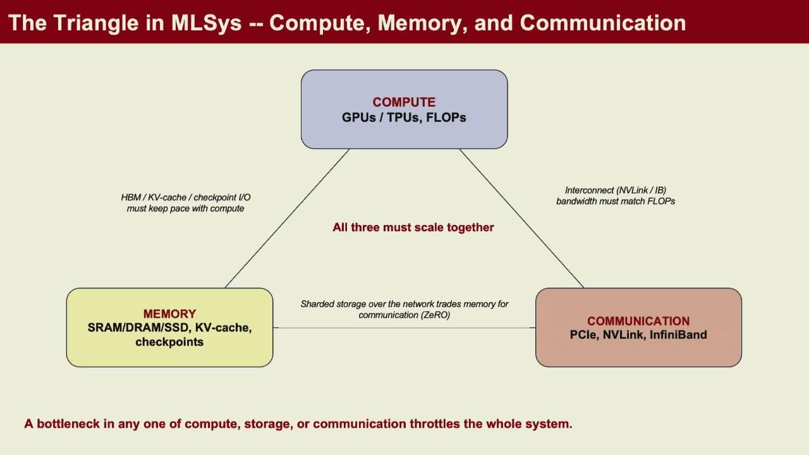

*图：算力、显存与互连构成系统三角；协同设计是在三者之间找平衡，而不是只盯峰值算力。*

一个具体的判断方式是先问瓶颈落在哪里。训练时，参数状态可能放不进显存，activation 也可能更大；长上下文服务时，瓶颈常转向 KV cache 的容量与访存；MoE 则会把 token 路由和 All-to-All 通信推到前台。原因不同，优先动作也不同。将所有问题统称为显卡不够会掩盖真正的约束。

## Scaling Law 与数据

大模型能力提升可以分成预训练、后训练和测试时推理三个阶段。预训练常讨论 scaling law：在模型参数量、训练 token 数和训练计算量增加时，训练损失怎样下降。它给的是经验上的资源分配规律，不是保证能力线性增长的承诺。数据质量、重复率、模型结构和训练稳定性都会改变实际曲线。

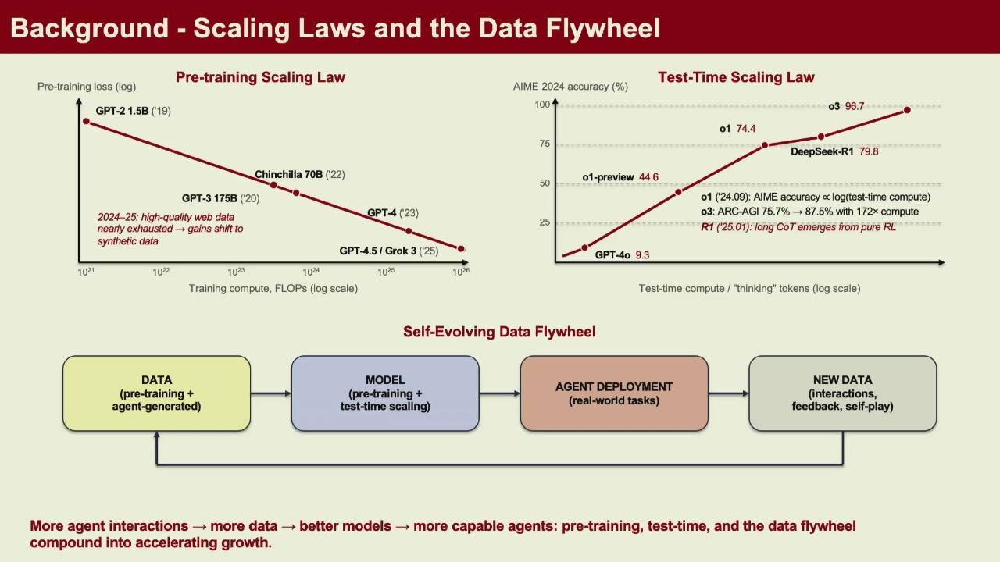

*图：scaling 不只是模型更大，还包括数据、算力与评估之间的反馈循环（data flywheel）。*

语言模型的预训练目标仍很朴素。给定前面的 token，预测下一个 token：

$$
\mathcal{L}_{\mathrm{LM}}=-\sum_t\log p_\theta(x_t\mid x_{<t}).
$$

交叉熵只要求模型拟合训练分布，并不会直接告诉它哪一种回答对用户更有用。所以预训练之后还需要监督微调、偏好优化或强化学习。代码、数学、可执行工具等场景有一个特点：编译是否通过、测试是否通过、工具调用是否成功都是相对明确的反馈，这类反馈可以继续变成训练数据。

测试时计算是另一条尺度轴。对同一个基座模型，系统可以让它生成更长的推理过程、并行采样多个候选、调用检索或工具、进行验证和反思。这样会提高单次请求的计算和延迟，是否划算要看任务是否能从额外搜索中稳定获益。不能把多想几步当成免费能力。

## 预训练状态与并行策略

一次训练 step 至少包含前向、反向和优化器更新。显存里同时存在参数、梯度、优化器状态和激活。前向为了输出损失而保留部分 activation；反向需要它们求导；Adam 等优化器还会保存额外状态。对大模型而言，参数文件的大小只是这笔账的一部分。

模型规模超出单卡后，训练框架通常混合多种并行维度：

- 数据并行把不同 batch 交给模型副本，最后同步梯度；
- 张量并行把同一层的矩阵乘法切给一组设备；
- 流水线并行按层切模型，activation 沿 stage 传递；
- ZeRO/FSDP 分片参数、梯度和优化器状态；
- sequence/context parallelism 沿长序列切 attention 的工作。

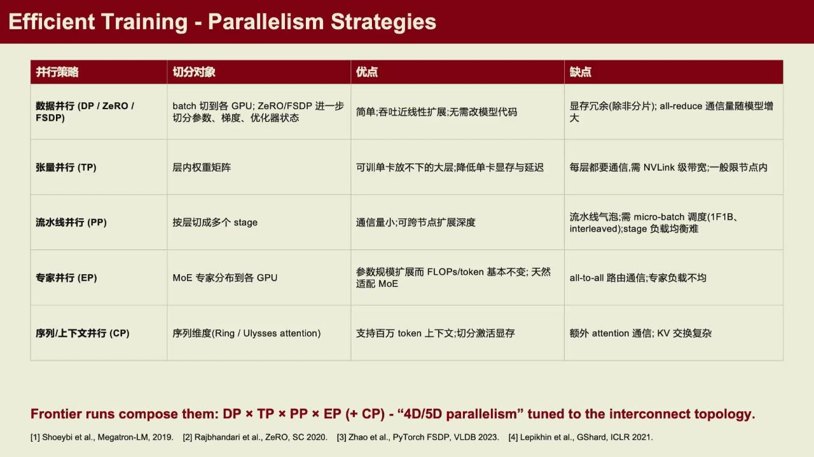

*图：并行方式按切什么分类——切数据、切矩阵、切层、分片状态；不同切法对应不同通信模式。*

并行度不是越大越好。把矩阵切得更细会降低单卡显存，却提高通信频率；流水线 stage 变多会产生 bubble；数据并行增大后全局 batch 和学习率策略也会变化。训练日志里的 MFU（model FLOPs utilization）只反映计算单元利用率的一面，还要看通信等待、数据加载和故障恢复。

训练框架只是把这些选择实现成不同的默认组合。以 FSDP、Megatron 和 DeepSpeed 为例：FSDP 更贴近 PyTorch 原生生态，善于做参数/梯度/优化器状态分片；Megatron-LM/Core 通常提供成熟的 TP、PP、DP、EP、CP 组合与高性能 kernel；DeepSpeed 覆盖 ZeRO、offload、MoE 等较多场景。它们没有放之四海皆准的胜负关系。模型大小、网络拓扑、团队维护能力和所需并行策略，才是选型的依据。

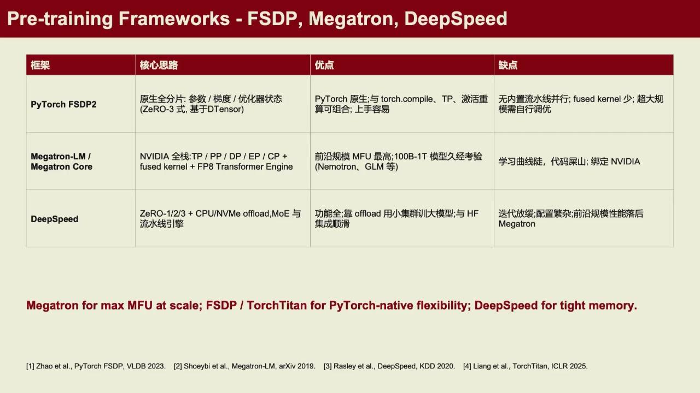

*图：三类框架分别是贴近 PyTorch 的分片、成熟的多维并行组合、多样的 ZeRO/offload/MoE 覆盖；选型取决于场景而非优劣。*

实际排障时，先把一次 step 切成数据准备、前向、反向、梯度同步、优化器更新几个时间段，再看哪段长、哪张卡在等。看到 GPU 利用率低，可能是数据加载不足，也可能是 collective 卡住、流水线不平衡或显存碎片引起的重算。优化前先测量，才不会把时间花在并不主导的部分。

优化器本身也是一个可省显存、可省算力的变量。AdamW 是最常见的默认项：它对每个参数维护一阶与二阶动量，训练效果好，但多出两份状态、占内存不小。与其在给定优化器下堆并行，不如也考虑换一个更新规则是否划算。

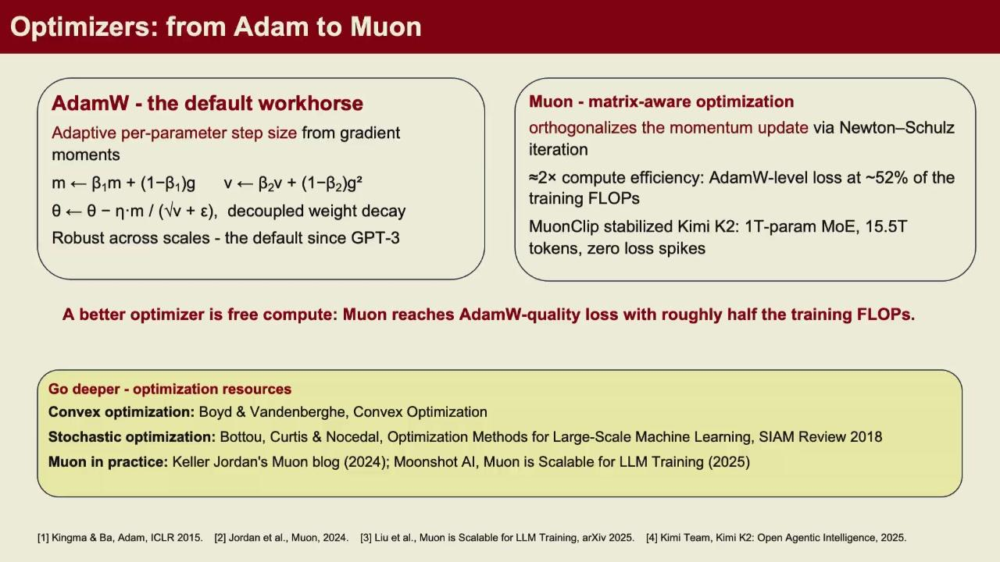

*图：更好的优化器等同一笔免费算力——若新优化器在更少 step 里达到相同 loss，就直接省下整段训练时间。*

以 Muon 为代表的矩阵感知优化器利用参数是矩阵的结构做更新，在部分实验中明显降低达到目标 loss 所需的 FLOPs。它是否适用取决于模型与超参，不能想当然替换；但优化器质量确实是训练成本方程里的一个自由变量，和并行策略、精度选择一样值得在动手堆硬件前先尝试。实际判断仍靠同输入、同 loss 目标下的收敛曲线对比。

## 高效 Attention 与内存访问

标准 attention 写为

$$
\operatorname{Attention}(Q,K,V)=\operatorname{softmax}\left(\frac{QK^T}{\sqrt d}\right)V.
$$

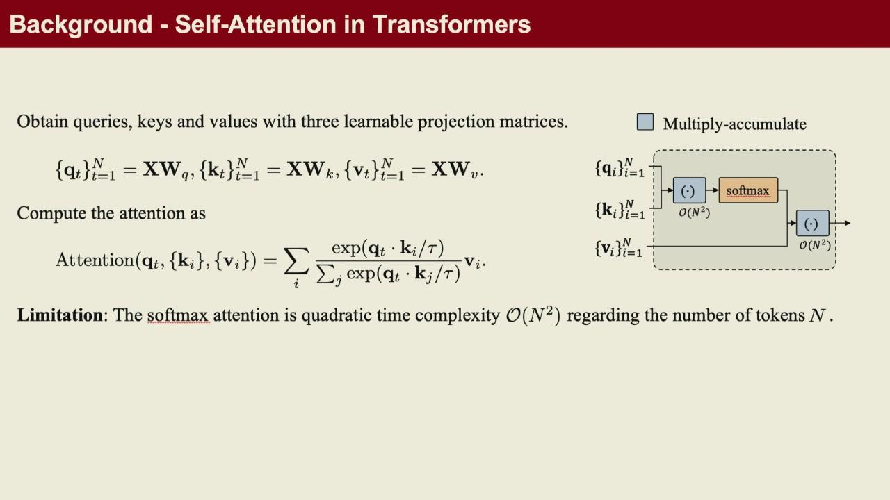

*图：Q/K/V 来自同一序列的不同投影；attention 让每个位置按相似度聚合其他位置的信息。*

若序列长度为 $S$，中间的 $QK^T$ 是 $S\times S$。长上下文时，直接物化这个矩阵既占显存，又会在 GPU 高带宽内存和片上存储之间搬运大量数据。问题不只在 FLOPs，也在 I/O。

FlashAttention 的核心做法是把 $Q,K,V$ 分块，利用寄存器和 shared memory 完成块内计算，避免把完整 attention matrix 写回 HBM。softmax 的分母依赖所有 key，因此它维护块级的运行最大值与归一化量，在数值稳定的条件下合并每个块的结果。输出没有变成近似值，改变的是数据的存取顺序。

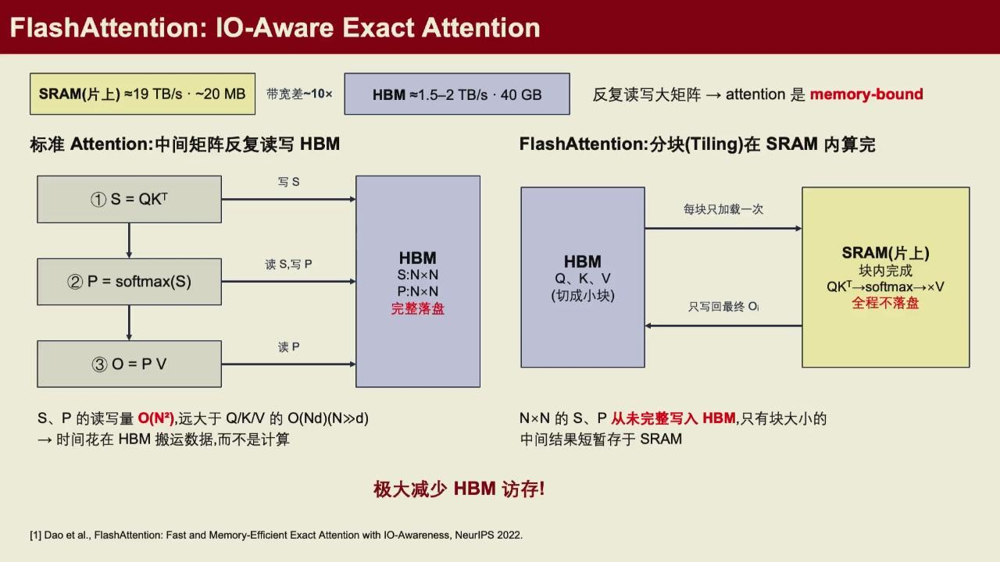

*图：FlashAttention 用分块与在线 softmax 减少 HBM 往返，不改 attention 的数学结果，主要优化的是 I/O 而不是算术量。*

GPU 的层级存储决定了这种改写为何有效。HBM 容量大但访问代价高，shared memory 和寄存器容量小却更快。标准实现如果不断把巨大的中间矩阵在 HBM 中读出、写回，算术单元会等待数据；分块后的 kernel 让同一块数据在更近的存储层完成更多计算。这里优化的是 I/O 复杂度，而非把 attention 的数学定义悄悄替换掉。

线性 attention、稀疏 attention、滑动窗口 attention 会改变计算形式或可见范围。它们在代价、表达能力和长序列行为上各有取舍。阅读论文时要分开看：FlashAttention 优化的是 exact attention 的实现；线性或稀疏方法会改变 attention 的计算复杂度或近似方式。

长上下文再继续增大时，context parallelism 会把 token 或 K/V 块分到多张 GPU。Ring Attention 让 K/V 块在设备间循环传递，每张卡依次处理自己的 Q 与到达的 K/V 块；这把单卡峰值内存降下来，但把问题变成计算与环形通信如何重叠。

传输并不必等到所有计算结束。一个 K/V 块参与本轮 attention 后，可以在当前设备继续算后续 FFN 的同时送往下一张卡；另一侧也可以边接收边准备下一块。通信若能被这段计算遮住，端到端时间就不会简单等于计算时间加通信时间。实际能否重叠取决于块大小、网络带宽、kernel 排程和各阶段负载，写代码时仍要从 timeline 验证。

线性 attention 和稀疏 attention 则试图改变随序列长度增长的代价。线性 attention 用特征映射近似或重写相似度，使某些计算可按结合律重排，避免显式构造全部 $S\times S$ 关系；因果场景中，它可维护随 token 更新的状态。代价是表示能力、训练稳定性和现有推理缓存机制都要重新评估。稀疏 attention 只让一个 query 关注部分 token，固定窗口、块稀疏和动态选 token 是常见做法；动态选择本身也会引入索引和不规则访存的成本。

## MoE 路由与执行

Transformer block 里有 attention 和 FFN 两块主要计算。attention 让 token 之间交换信息；普通 FFN 则对每个 token 的隐藏向量单独做两次矩阵投影和一次激活。MoE 没有把整个 Transformer 换掉，它只是用很多个参数不同的 FFN 取代原来的一个 FFN。

*图：MoE 位于原 FFN 的位置；真正要处理的是 token 到 expert 的不规则映射。*

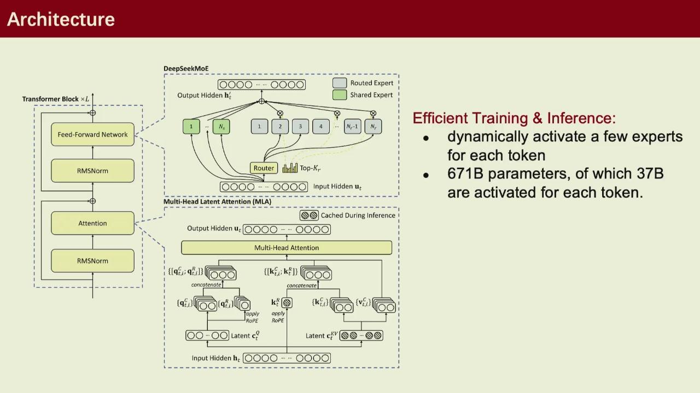

*图：DeepSeekMoE 在 routed expert 之外加入 shared expert，是如何组织专家集合的一种具体取舍。*

若一个 token 的隐藏状态为 $x_t$，router 会为 $E$ 个 expert 给分并选出 top-$k$。被选中的 expert 各自计算一个 FFN 输出，最后按 gate 权重加权：

$$
y_t=\sum_{e\in\operatorname{topk}(x_tW_{\mathrm{router}})}g_{t,e}\,\operatorname{FFN}_e(x_t).
$$

这里的 expert 不是人能直接命名的数学专家或代码专家。它们是同构、参数不同的神经网络分支，如何分工由训练得到。MoE 的容量因此可以很大，而单个 token 只激活少数专家，计算量不随总专家数线性增长。

从系统角度看，困难不在这个公式本身。router 选出的 token 往往散落在 batch 的不同位置，而同一个 expert 的权重希望服务一小批连续 token。实现通常要先记录 `(token_id, expert_id, gate)`，按 expert 重排 token，完成专家内部的批量 GEMM，再按 `token_id` scatter 回输出。单机上这是索引、缓冲区和数据布局问题；多卡 expert parallel 中，它会进一步变成 All-to-All。若少数 expert 被频繁选中，计算和通信都会失衡，因此容量控制和负载均衡也进入训练设计。

route、dispatch、专家矩阵乘法和 weighted merge 分别有自己的数据布局与计时边界。token 按 expert 重排后，矩阵单元才会看到足够规则的小批量；重排本身、索引和 scatter 也必须计入总时间。这里的性能判断依赖矩阵形状、低精度算术和内存访问，而不是只看某一条 GEMM 指令。

## 参数高效微调

???+ note "什么是量化成低比特：用整数近似浮点权重"

    深度学习里的每个权重通常是一个 32 位浮点数（FP32），更常用 16 位（FP16/BF16）来省一半内存。**量化**更进一步：把权重用很少的比特（常见的 8 位 INT8 甚至 4 位 INT4）来近似表示。它的动机很直接——权重从 16 位降到 4 位，存储和搬迁量可以降到约四分之一，模型更容易装进显存，推理时也能少读数据。

    但 4 位只能表示很少的不同数值，直接把每个浮点权重四舍五入到最近的 4 位格点会引入误差。所以量化通常配合一个 **scale**（缩放系数）：近似地 $\text{权重}\approx scale\times(\text{整数} - zero)$。重点是近似——量化放弃了一部分精度，换来内存与带宽的节省。哪种做法误差可接受，取决于任务对数值波动的容忍度，这正是本节后面 GPTQ、W4A16 等内容在回答的问题。

    一句话的直觉：量化好比用更粗的刻度尺量长度，省了存储，代价是测量不够精细；好的算法努力让量出来的结果仍然尽量接近原值。

全量微调要更新所有参数，并保存相应梯度和优化器状态。LoRA 将一个预训练权重矩阵 $W_0$ 固定，只学习低秩更新：

$$
W=W_0+\Delta W,\qquad \Delta W=BA,
$$

其中 $A\in\mathbb{R}^{r\times d}$、$B\in\mathbb{R}^{k\times r}$，秩 $r$ 远小于原矩阵维度。训练时只保存和更新小矩阵 $A,B$；部署时可把 $BA$ 合并进 $W_0$，也可保留 adapter 以便在同一基座上切换任务。

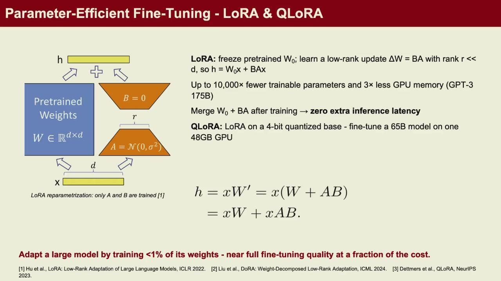

*图：训练 LoRA 时只更新低秩分支，基座权重保持冻结。*

*图：低秩分解 $BA$ 让可训练参数量大幅下降；部署时把 $BA$ 合并回 $W_0$ 或不保留 adapter 均可。*

Q-LoRA 再把冻结的基座量化到低比特，以更少显存加载大模型，同时让 LoRA 分支保持可训练精度。量化并不等于所有张量都直接截成相同格式。权重、激活、梯度和 KV cache 对误差的敏感度不同；缩放因子的粒度、异常值、累积精度和硬件指令都会影响最终效果。

## KV Cache 与推理内存

自回归推理分为 prefill 和 decode。prefill 一次处理完整 prompt，计算所有输入 token 的 K/V 并建立 cache；decode 每步生成一个 token，要读取前文 cache、计算新 token 的 Q/K/V，再把新的 K/V 追加进去。

设有 $L$ 层、$H_{kv}$ 个 KV head、每个 head 维度为 $d$、上下文长度为 $S$，单请求 KV cache 大小近似随

$$
2\times L\times S\times H_{kv}\times d
$$

增长，其中 2 表示 K 与 V。多并发请求、长上下文和多轮对话会很快填满 GPU HBM。decode 每步算术量并不大，却反复读取越来越长的 cache，常呈现 memory-bound 或 I/O-bound 特征。

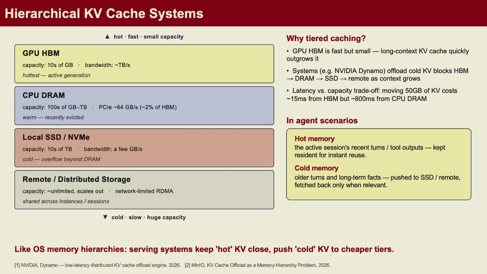

*图：分层缓存用较慢但更大的存储层容纳冷 KV 块。*

分层缓存是其中一种处理法。热请求与正在生成的 token 留在 GPU；暂时不用或已被逐出的块可以转到 CPU DRAM，再在需要时取回。代价是 PCIe/NVLink 传输与调度复杂度，不能假设缓存能放下就等于延迟仍然好。PagedAttention 一类设计把 KV cache 切成固定大小 block，用逻辑块表管理物理块，减少连续大块分配造成的碎片，也便于请求共享前缀。

前缀缓存能复用的前提很严格：从开头到命中位置的 token 序列必须相同。共享系统提示词、相同文档前缀或多人重复查询同一段资料时，收益很高；工具调用不断返回不同结果的 agent 场景里，一处差异就会让后续前缀无法复用。缓存压缩、选择性保留和线性 attention 的固定状态都可能减小内存，却也可能降低这类复用能力。系统设计要把平均命中率、尾延迟和请求类型一起看。

模型结构也能降低 cache。Multi-Query Attention 让多个 query head 共用较少的 KV head；Grouped-Query Attention 是两者间的折中；某些 latent attention 先把 KV 压缩为更小的潜变量。这些选择会影响推理内存、带宽、模型质量和 kernel 形状，正是算法—系统共同取舍的例子。

*图：共享或压缩 KV head 能显著缩小缓存与带宽，代价是表达能力与实现复杂度——这正是算法与系统协同设计的例子。*

这几种变体在缓存字节数上有干净的对照。若每层有 $h$ 个 query head、分组 $g$ 个、每 head 维度 $d_k$，则 MHA 需为每个 head 各存一份 K/V，缓存约 $2h d_k$；GQA 让一组 query head 共享一份 K/V，约 $2g d_k$（MHA 的 $g/h$）；MQA 让全部 query head 共用一个 K/V，约 $2d_k$（MHA 的 $1/h$），是三者里缓存最小的。

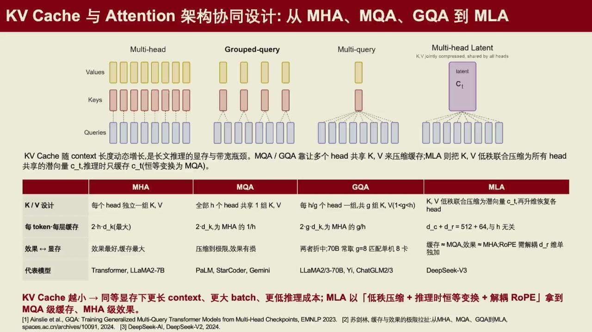

*图：MHA 效果最好但缓存最大，MQA 缓存最小但效果有损，GQA 是折中；MLA 把 K/V 压缩成共享潜变量，避开缓存小与效果好之间的两难。*

MLA（Multi-head Latent Attention）更进一步，不直接共享完整 K/V，而是把 KV 低秩联合压缩成一个较小的潜变量 $c_t$，推理时只缓存这个潜向量，再在线还原。它的缓存量（如论文中 $d_c+d_r$）与 head 数无关，却能保留接近 MHA 的表达能力。正因为 KV cache 是长上下文推理的显存与带宽瓶颈，压缩 KV 这件事既是模型架构选择，也是系统能在多长上下文、多大并发下运行的变量。

## 量化推理与服务调度

低比特权重减少容量和带宽压力，校准误差、反量化路径与服务调度决定这部分节省能否转化成端到端收益。

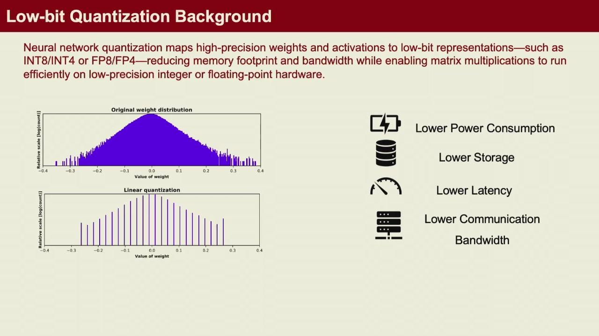

*图：量化的核心是把连续范围映射到有限格点；格点越粗，存储越省，误差越大。*

### 量化误差与 GPTQ

权重量化并非只最小化 `\|W-\hat W\|`。线性层真正关心输出扰动 `X(W-\hat W)`；输入激活在某些方向幅度很大时，即使权重逐元素误差很小，输出也可能明显偏移。GPTQ 用校准样本的激活二阶信息近似这种敏感度，按列/组逐步量化并补偿尚未量化的权重误差。校准集不需要标签，却应覆盖实际 prompt 的激活分布；用完全无关的短文本校准，量化后的困惑度可能恶化。

量化还有一个简单的基线：**RTN（round-to-nearest）**，把每个浮点权重直接四舍五入到最近的格点，不做校准、也不补偿误差。它快、可复现，常作为对比 GPTQ 的什么都没有做起点。对大的 4-bit 权重，RTN 通常会让 NLL 明显变差，因为单个权重误差受激活方向放大；GPTQ 的价值恰恰在于把这份误差按真实输入分布补偿掉。读 `quantize.py` 时先看它走的是 RTN 还是带校准的 GPTQ——两者的输出质量不可直接比较，速度也不一样。

group-wise scale 是质量、元数据和 kernel 复杂度的折中。组越小，scale 更能贴合权重分布，但每组都要读取 scale/zero-point，量化元数据比例升高，fused kernel 的访存也更碎。对称 INT4 通常把 4-bit 值解释为有符号范围并使用一个 scale；非对称方案额外使用 zero-point。无论编码方式如何，反量化的语义都应写清：`w ≈ scale * (q - zero)`，以及 scale 按输出通道、输入组还是张量共享。

NLL 用于检验推理是否仍是同一概率模型。对 token 序列 $x_1,\ldots,x_T$，忽略不计分的前缀后，

$$
\mathrm{NLL}=-\sum_t\log p_\theta(x_t\mid x_{<t}).
$$

比较 W4A16 与高精度模型时必须使用完全相同的 tokenizer、样本、mask 和 logit 处理；只比较生成文本的看起来像不像无法发现小而系统性的概率偏差。端到端计时也应说明 tokenizer、KV cache 预热与采样策略是否包含。

### 位宽、缩放与累加路径

推理量化的直接收益是减少权重和激活的存储与搬运，并让硬件使用更高吞吐的低精度矩阵路径。低比特格式往往需要按 tensor、channel 或小 block 设置 scale；scale 的粒度越细，误差通常越小，但元数据和计算也更多。不能只看 4-bit 这个标签，还要看格式、缩放和校准方式。

量化可粗略理解为把浮点值 $x$ 映射到整数或低位浮点表示 $q$，运行时再借助 scale 还原近似值：$x\approx s(q-z)$。$s$ 决定步长，$z$ 在非对称量化中处理零点。若整个张量只共用一个 scale，少数异常大值会浪费大部分可表示范围；按更小 block 设 scale 会改善误差，但会增加 scale 的读取和 kernel 处理。权重、激活和 KV cache 的数值分布不同，通常也不会使用完全相同的方案。

量化还要区分训练和推理。推理时模型权重已经固定，常可先做校准再转换格式；训练中的权重与激活持续变化，低精度算子、梯度累积和主权重精度都要参与设计。低位宽的收益只有在硬件有相应矩阵指令、数据布局与 kernel 能把它用起来时才会兑现。文件体积缩小，不自动等于吞吐按同一比例提高。

在 W8A8 这类路径中，权重和激活以 `int8` 保存，点积通常以更宽的 `int32` 累加，再依靠 scale 回到浮点范围。这样做减少了搬运字节数，也可能使用硬件的整数矩阵乘加单元；同时，scale、量化误差、tile 布局和较小的专家 batch 仍会决定实际速度。它和 MoE 的关系很直接：专家 FFN 是最重的规则计算部分，量化与矩阵 kernel 往往就落在那里，路由和合并则仍需单独处理。

### 融合反量化与 GEMM

W4A16 把权重压成 INT4，激活仍以 FP16/BF16 等较高精度参与计算。实际 kernel 通常按 group 保存 scale 和 zero point，把两个 INT4 值打包进一个字节；运行时再解包、转换到计算精度并乘上 scale。若先把所有权重反量化成 fp16 临时矩阵再调用 GEMM，就会额外写出并读回一个完整高精度权重张量。

fused dequant-GEMM 在 tile 被搬入寄存器或 shared memory 时完成解包和缩放，让结果直接参与矩阵乘加，避免这个全局中间量。它仍受 tensor core 所需布局、tile 对齐、group 边界和 scale 加载影响；当 batch 很小或矩阵很窄，launch、访存和 reduction 开销可能盖过理论算力优势。看到实现中的 `pack`、`unpack`、`scales` 和 `group_size`，可以顺着检查数据在哪个维度分组、谁负责读 scale，以及反量化后的值是否离开计算单元。

### 端到端服务调度

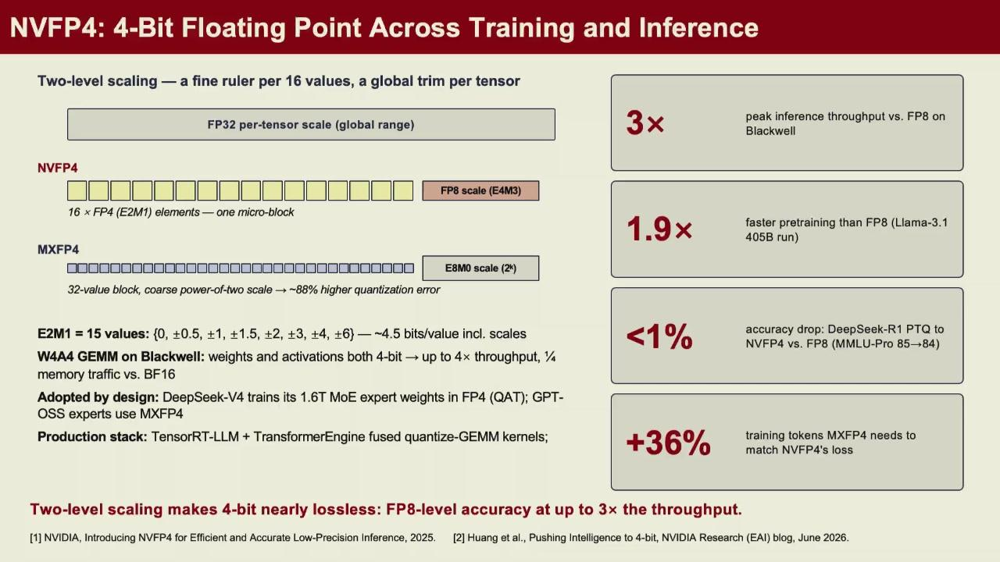

*图：低比特格式除了位宽不同，缩放因子的粒度也不同。*

服务端要同时处理吞吐和延迟。continuous batching 允许请求在不同时间加入批次，提高设备利用率；prefill 与 decode 的资源特征不同，常被拆开调度；speculative decoding 用较小模型或草稿分支一次提出多个 token，再由目标模型验证，以额外计算换取更少的串行 decode 轮数。是否有效取决于接受率、模型大小和请求长度。

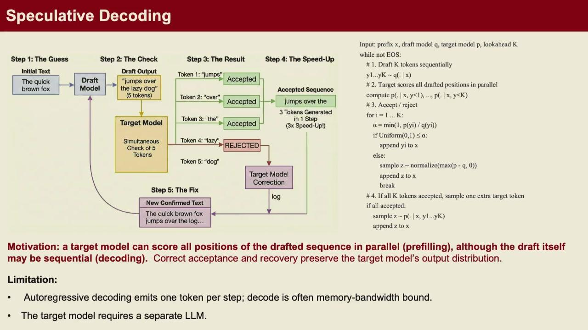

*图：用便宜草稿模型生成一批候选，再由目标模型一次性验证；以额外计算换更少的串行生成步数。*

大模型在有限显存上运行时，GPTQ 将权重压到 INT4，NLL 用来确认概率质量没有越过阈值。优化对象不只是一层线性算子，还包括反量化与 GEMM、KV cache 分配、prefill/decode 调度、CPU/GPU offload 与 profiler 中真正占时的阶段。显存、省下的字节和吞吐相互制约，必须在完整推理负载上比较。

!!! warning "量化正确性不是能生成一句通顺文本"

    输出文本受采样随机性影响，难以比较。固定 token 序列、tokenizer、mask 与 logit 处理后计算 NLL，才能判断误差来自量化还是输入前处理。融合 kernel 改了权重布局时，也要先确认 dequant 后的数值语义未变。

## Agent 与 Harness

上面讲的训练、推理、显存和调度，最终都要被一段干活的代码编排起来。课程把这类编排概括成一个公式：Agent = Model + Harness。

- **Model** 是能理解与生成的神经网络，负责会说什么；
- **Harness** 是控制 agent 如何工作的代码——如何构造 prompt、发起工具调用、管理子 agent、控制流程、维护 memory 与工作流。同一个模型换上不同 harness，就变成不同的 agent 行为。

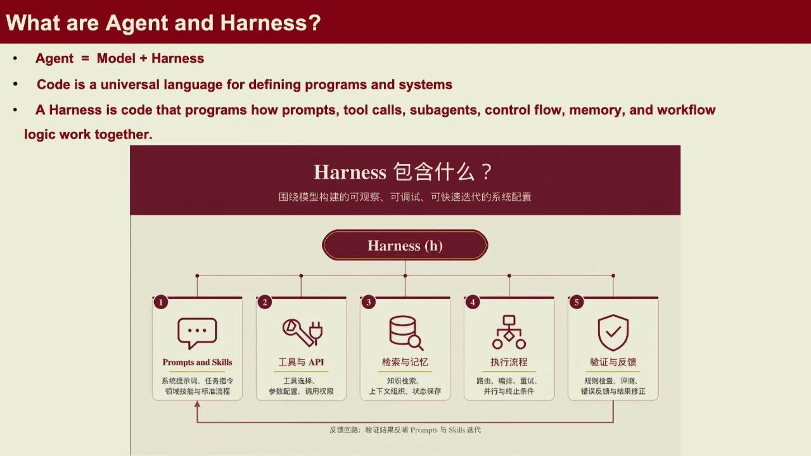

*图：模型是会推理的脑子，harness 是怎么用这个脑子的系统代码；两者分离后，能力升级与流程改造可各自进行。*

把自动化做成 agent 不是给模型一个更强的推理，而是系统地编排环境、工具和记忆。以 coding agent 为例，harness 决定何时查代码、运行测试、读报错日志、该怎么重试。因为 harness 完全由我们自己控制，针对它的优化走白盒、便宜且快；改动模型则是要重训或微调，慢且贵。于是在这里，系统层（harness）是多数迭代成本低、收益快的一侧——这也是算法—系统协同设计在 agent 场景下的体现。

多模态模型又把输入扩展为图像、视频、音频或动作。视觉编码器把图像变成视觉 token，再与文本 token 在语言模型中融合；生成任务可能使用自回归、扩散或两者混合的架构。图像 token 数、视频帧数和跨模态 attention 都会直接放大上下文与推理成本。

性能分析先把瓶颈落到算力、显存、带宽、通信或请求调度中的某一项，再决定改模型、kernel、精度还是系统。笼统地说模型跑得慢无法导出可验证的优化实验。
