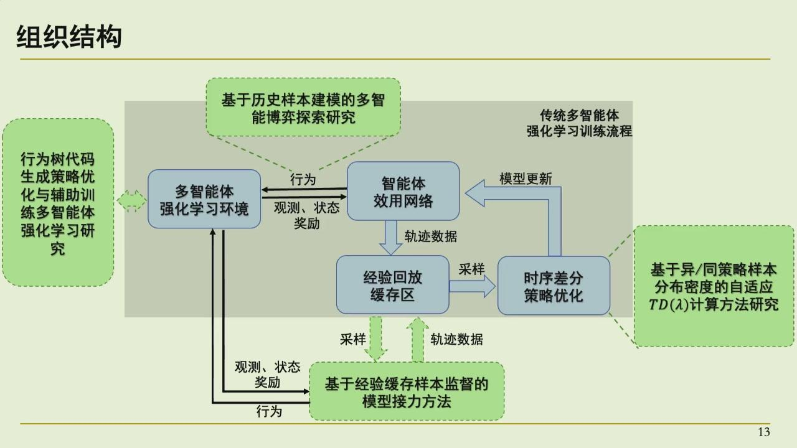
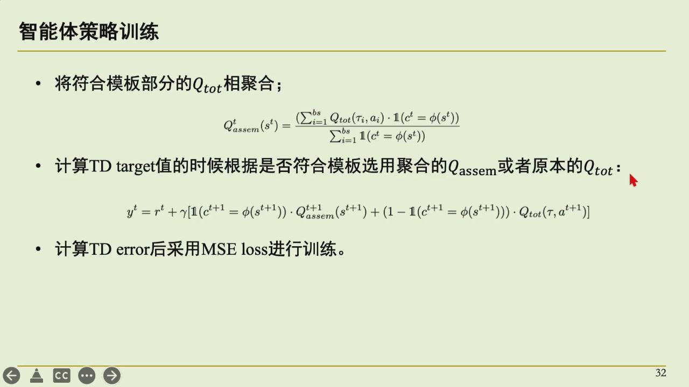
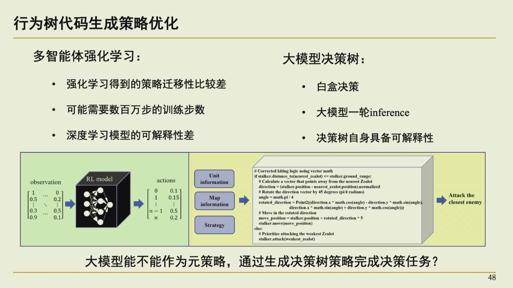
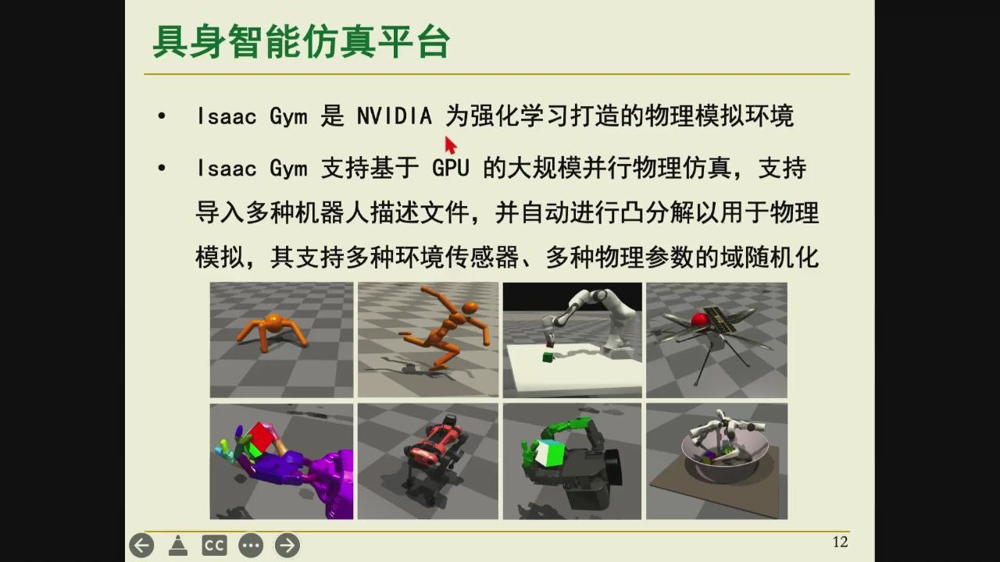
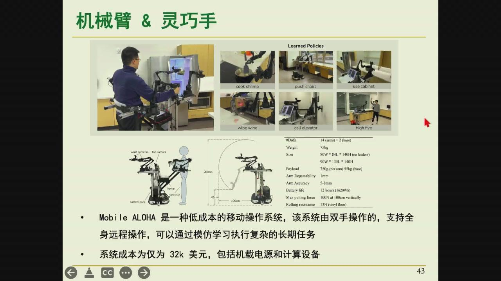

# 07-17 下午：强化学习、多智能体与具身智能

强化学习处理带反馈的连续决策。监督学习的样本通常直接给出输入与正确输出；强化学习里的动作会改变之后遇到的状态，奖励也可能隔很多步才出现。智能体要在已知的好做法与未试过的路径之间分配尝试。课上由此讨论多智能体、历史经验、模型方法和机器人任务。

## 从历史上看强化学习

这门课上来先讲了一段历史，因为今天强化学习为什么又热起来，和它过去的样子很有关系。早期工作可以追溯到 1970 年代，最有名的研究组是 Sutton 在加拿大阿尔伯塔的团队；Sutton 与导师两人因长期推动强化学习，获得了 2024 年的图灵奖。很多今天还在用的概念，包括策略梯度、时间差分，都源自这个脉络。

Sutton 有一个常被引用的说法，叫"苦涩的教训"。大意是：过去设计智能模型，通常是研究人员根据领域知识手工设计，得到的模型往往只针对专门任务、通用性不好；但长期看，如果让算法利用源源不断的算力去枚举、搜索、反复采样，找到的解会比靠人拍脑袋设计的更好。核心就一句——相信算力，算力足够时一切都能找出来。

Sutton 拿奖后的一次演讲标题叫 "Bigger is the Experience"，直译是"越大越丰富"，也可以理解成"欢迎来到经验的时代"。背景是：2022 年大语言模型起来之后，公开的互联网数据被认为已经快用完了。再往下走，就要靠强化学习来合成新数据。强化学习的智能体要跟环境不断交互才能产生新数据，这种交互产生的数据被称作经验。要从经验中学习，才有可能让智能的层次再往上抬。

AlphaGo 其实在 2016 年就火过一次。当时 DeepMind 的程序跟李世石下了四盘棋，把李世石下哭了；后来又找柯洁下，同样赢下。在那类棋类游戏上，机器的智能已经超过了人类顶尖选手。但 AlphaGo 之后强化学习又沉寂了一段时间，主要原因在于它跟训练环境是强绑定的：围棋环境里产生的数据，学到的策略往往用不到自动驾驶上，反过来也是。它不依赖某个领域的数据，却依赖某个环境，很难直接泛化。

大语言模型改变了这一点。Chinchilla/GPT 把海量文本都吃进去，看起来什么都能做；但监督学习（模仿已有数据）得到的模型，无法在已有数据之上再进一步提升。想再进一步，就要把模型放进反馈信号明确的环境里用强化学习继续训练。现在很多编程模型（例如带 agent 的工具）都是强化学习训练出来的，因为代码写完拿去编译、跑测试，对错非常明确；数学这类反馈清楚的领域也落地很快。反馈信号越明确，强化学习越容易学到更强的能力。

## 强化学习问题定义

在时刻 $t$，智能体观察到状态或观测 $s_t$，按策略选择动作 $a_t$；环境响应为下一个状态 $s_{t+1}$，并给出奖励 $r_{t+1}$。连续记录下来就是一条轨迹：

$$
s_0,a_0,r_1,s_1,a_1,r_2,\ldots
$$

| 记号 | 含义 | 由谁产生 |
| --- | --- | --- |
| $s_t$ | 时刻 $t$ 的状态或观测 | 环境/传感器 |
| $a_t$ | 智能体选择的动作 | 策略 |
| $r_{t+1}$ | 执行动作后的即时奖励 | 环境与奖励函数 |
| $\pi(a\mid s)$ | 在状态下选择动作的概率 | 待学习策略 |
| $\gamma$ | 未来奖励的折扣系数 | 任务设计者 |

策略记为 $\pi(a\mid s)$，表示处于状态 $s$ 时选择各动作的概率。学习目标不是只让某一步奖励最大，而是让之后的折扣回报期望最大：

$$
G_t=r_{t+1}+\gamma r_{t+2}+\gamma^2r_{t+3}+\cdots,
$$

其中 $0\leq\gamma\leq1$ 是折扣因子。$\gamma$ 小时，智能体更在意近处反馈；接近 1 时，它会为较远的结果安排动作。奖励的设计决定了它实际学什么。只奖励“尽快到达”时，机器人可能学到不安全的快动作；只罚能耗时，它又可能干脆不动。奖励函数本身就是任务目标的一部分。

状态需要包含对决策有用的信息。若同一个观测在不同历史下应该采取不同动作，只把当前观测当状态会丢失关键信息；这时可加入历史窗口、递归网络或显式的环境状态估计。经典马尔可夫决策过程（MDP）假定当前状态已经足以决定下一步的转移和奖励分布：

$$
p(s_{t+1},r_{t+1}\mid s_t,a_t).
$$

它是一个建模假设，不是说现实世界没有历史。

??? example "折扣因子改变了什么"

    两条路径的即时奖励分别为 1 和 0；后一条在 10 步后额外得到 100。若 $\gamma=0.9$，远期回报折为约 34.9，后一条仍优；若 $\gamma=0.5$，只剩约 0.098，策略会偏向即时奖励。折扣同时表达任务偏好，并控制无限期回报的数值尺度。

## 价值函数

策略价值函数 $V^\pi(s)$ 表示从状态 $s$ 出发、之后按策略 $\pi$ 行动能得到的期望回报。动作价值函数 $Q^\pi(s,a)$ 则把当前动作也固定下来：先做 $a$，再按 $\pi$ 行动。选择动作时，若有了 $Q$，可以偏向值更大的动作。

贝尔曼关系把长期回报拆成一步奖励与后续价值：

$$
Q^\pi(s_t,a_t)=\mathbb{E}[r_{t+1}+\gamma V^\pi(s_{t+1})].
$$

贝尔曼关系提供了可递推估计的目标。值函数近似、策略梯度、actor-critic 等方法分别用不同参数化和更新方式处理它。

真实任务常把状态、动作和策略交给神经网络表示。网络带来表达能力，也带来不稳定性：采样数据相关、奖励有噪声、目标随着策略更新不断变化。强化学习曲线波动大并不只是实现粗糙，问题本身就包含探索和自举造成的不稳定来源。

## 蒙特卡洛、时间差分与 $\lambda$

一条轨迹结束后，可以直接把实际得到的 $G_t$ 当作状态或状态动作对的学习目标。这是蒙特卡洛（MC）思想。它不需要估计下一状态价值，但必须等到后续回报出现；长任务中方差也可能很大。

时间差分（TD）不必等整条轨迹结束。最简单的一步 TD target 是：

$$
y_t=r_{t+1}+\gamma V(s_{t+1}),
$$

或在 Q-learning 里使用 $r_{t+1}+\gamma\max_aQ(s_{t+1},a)$。它用当前估计的下一状态价值来更新当前价值，叫 bootstrapping。代价是目标也依赖自己的估计，估计误差会被带入更新。

TD($\lambda$) 在 MC 与一步 TD 之间插值。较小的 $\lambda$ 更接近短步自举，更新快但目标偏差更多；较大的 $\lambda$ 利用更长的真实轨迹，接近 MC，方差也更大。课上强调，固定选一个 $\lambda$ 往往很敏感：环境、策略阶段和数据分布变化后，同一个超参数未必仍合适。

## On-policy 与 Off-policy

行为策略 $\mu$ 负责采集轨迹，目标策略 $\pi$ 是希望学习或评估的策略。两者相同就是 on-policy；不同则是 off-policy。on-policy 方法通常要求数据接近当前策略，例如一轮更新后再用新策略采样。它概念直接，但旧数据很快不能反复使用。

off-policy 方法允许利用历史 replay buffer 中的数据。DQN 一类方法把大量过去轨迹放进 buffer，随机抽取 mini-batch，降低相邻样本的相关性并提高样本复用率。问题在于旧数据来自不同策略，分布与当前策略不一致；重要性采样可用概率比修正这种差异，但权重过大时又会带来高方差。

课上的一个研究思路是把当前策略采集的数据与历史 off-policy 数据分开管理，再按数据分布和训练阶段调节 TD($\lambda$) 的权重。新策略附近的数据贴近当前决策，历史数据可能保留了难得的成功轨迹；两类样本需要承担不同作用。

## 多智能体强化学习

多智能体强化学习（MARL）中，多个 agent 同时观察、行动和学习。每个 agent 的动作都会改变其他 agent 看到的环境，所以单个 agent 所面对的“环境”会随其他策略更新而变化，非平稳性比单智能体更明显。

*图：多个智能体从环境收集观测和奖励，再用轨迹更新策略。*

合作任务常采用 CTDE（centralized training, decentralized execution）：训练时可使用全局状态、所有 agent 的动作或联合价值函数；执行时，每个 agent 只用自己允许获得的局部观测独立行动。这样训练阶段能减少价值估计歧义，部署时又不要求实时汇集所有信息。

QMIX 是课上提到的一个值分解方法。每个 agent 先有局部 $Q_i$，再由 mixing network 合成为全局 $Q_{tot}$，并约束全局值对各局部值单调。于是选择各 agent 局部最优动作时，与联合 $Q_{tot}$ 的贪心选择能够保持一致。它适合合作且可做这种单调分解的任务，不意味着任何多智能体博弈都能被简单拆成若干独立 Q 函数。

## 探索与经验复用

稀疏奖励环境中，智能体可能在很长时间内看不到成功反馈。有一个"直线方向被墙挡住"的例子：反复从起点沿同一方向探索，只会反复撞墙；一条绕开的成功路径却值得被反复利用。探索的重点在于把罕见、有信息量的经验保留下来，而不是一味增加随机动作数量。

这一思路把历史上表现好的轨迹变成模板。当当前状态与模板匹配时，训练目标可以加入模板对应的价值或动作倾向；偏离模板的部分仍由普通 RL 学习。模板不是硬编码答案：环境变化后盲从旧路径会出错，因而需要状态匹配、置信度或价值比较来决定何时采用。

*图：模板保存罕见的成功经验，用于指导到当前状态的行动倾向；是否采用模板由状态匹配或价值比较决定。*

蒙特卡洛树搜索（MCTS）提供另一种“在当前状态附近多看几步”的方式。它反复执行选择、扩展、评估和回传：从根节点按选择公式走到叶子，扩展可行动作，使用 rollout 或价值网络评估叶子，再把回报更新到祖先节点。选择公式会兼顾平均价值与访问次数较少的分支，因此同时利用和探索。它在围棋等可模拟环境中很强，但每一步都展开搜索的代价也很高。

## 神经策略与行为树

深度 RL 策略可以直接把观测映射为动作，却往往难解释、迁移不稳定，需要大量交互数据。一种方向是用大模型生成的行为树或决策树作为元策略。

行为树将任务写成条件、动作以及顺序/选择/并行等控制节点。例如“若手边有物体则抓取，否则先移动到目标附近”比一个连续网络输出更容易检查和修改。大模型可以根据任务描述、环境接口和失败记录生成或修改树；RL 则可用于调树中的参数、优先级或局部动作。行为树负责可检查的高层流程，连续控制仍交给合适的低层策略。语言模型可参与生成或修改树，但不直接取代底层控制器。

*图：行为树由顺序/选择/并行等控制节点组织条件与动作；大模型可生成或修改树，低层连续控制仍由策略完成。*

## 基于模型的方法

无模型强化学习直接学习策略或价值，不显式学习环境如何变化。基于模型的强化学习（model-based RL）还学习或使用一个动力学模型：给定状态和动作，预测下一状态、奖励或观测。这样可在模型里滚动多步，比较候选动作，减少真实环境中的试错。

模型不准时会出现 model bias：规划过程利用了模型的系统性误差，真实执行反而失败。可用不确定性估计、短视规划、真实数据校正或模型集成减轻，但不能消除“模拟器与现实不同”的问题。课程中 PaMoRL 等研究关注如何从历史样本构造可用模型并和策略学习结合，目的仍是提高样本效率和探索质量。

## Bellman 目标与终止状态

价值学习的样本不是独立标签。一步 TD 的目标为

$$
y_t=r_t+\gamma(1-d_t)\max_a Q_{\bar\theta}(s_{t+1},a),
$$

其中 `d_t` 表示真正终止；终止后不应再 bootstrap。很多环境还会因时间上限截断 episode，截断是否等价于终止取决于任务定义：若只是收集器强制停止而理论 MDP 仍有后继状态，把它当终止会引入价值偏差。经验回放至少应保存 observation、action、reward、next observation、terminated/truncated 与必要的 mask，不能只存“状态转移四元组”而丢掉边界语义。

target network $\bar\theta$ 的作用是让 bootstrap 目标在一段时间内较稳定。若每一步都用正在更新的 $\theta$ 同时定义预测和目标，误差会追逐自身变化，容易发散；定期硬更新或指数滑动平均更新 target 都是在控制这个反馈。Double DQN 把动作选择交给 online 网络、动作评估交给 target 网络，缓解 `max` 对噪声的系统性高估。

## 策略梯度的采样路径

随机策略 $\pi_\theta(a\mid s)$ 的目标梯度可写为

$$
\nabla J(\theta)=\mathbb E[\nabla_\theta\log\pi_\theta(a_t\mid s_t)\,A_t].
$$

优势 $A_t$ 表示这个动作比状态基线好多少；减去只依赖状态的 baseline 不改变期望梯度，却能显著减小方差。actor-critic 用 value 网络估计 baseline，GAE 用带参数 $\lambda$ 的多步 TD 残差在偏差与方差间折中。这里的 rollout 是训练数据生成过程，动作、log probability、value、reward 和 done 必须来自同一个策略版本；把不同版本轨迹混入 on-policy 更新会破坏目标分布。

## 多智能体的集中训练

多智能体环境中，其他智能体的策略也在变，单个智能体看到的环境因而非平稳。CTDE（centralized training, decentralized execution）让训练时 critic 读取全局状态或其他智能体动作，以较完整的信息评估协作；执行时每个 actor 只使用本地观测。共享参数能提高样本效率，却要求智能体观测/动作空间兼容，并常需 agent id 或位置编码防止完全对称的策略塌缩。

仿真吞吐并不等于训练吞吐。Isaac Gym 等工具可在 GPU 上并行许多环境，但每一步仍包含物理计算、policy inference、状态重置、reward 计算和把 batch 交给学习器。profile 时应分别量环境 step、rollout 传输、前后向和优化器；只把环境数量翻倍可能先撞到显存、物理 kernel 或 policy batch 的瓶颈。

## PPO 的近端更新

PPO 在采样策略 $\pi_{old}$ 产生的 rollout 上多轮更新新策略，使用概率比值

$$
r_t(\theta)=\frac{\pi_\theta(a_t\mid s_t)}{\pi_{old}(a_t\mid s_t)}
$$

并把目标中的 $r_t A_t$ 裁剪到 $[1-\epsilon,1+\epsilon]$ 附近。裁剪并不保证严格的信赖域，却阻止一次 mini-batch 更新把已采样动作的概率推得过远。实现中必须保存采样时的 old log-prob；重新用当前网络计算后再当作 old 值，会使比值恒为 1，训练表面运行而没有正确约束。

rollout buffer 还要保留连续的时间维度，因为 GAE 要从 episode 末尾向前递推 TD 残差。拼接多个环境时，done mask 要在各环境各自的终点截断递推；把一个环境终点的 value 泄漏到另一个环境开头，是批处理维度处理错误，不是算法随机性。优势常在一个 batch 内标准化以改善优化尺度，但 reward 的物理含义和终止奖励仍应在标准化前检查。

## 奖励、观测与部署偏移

强化学习优化的是实现给出的 reward，不是人心中未写出的任务。奖励中某项权重大、某个失败状态遗漏惩罚、终止条件可以被钻空子，策略就可能学到看似怪异却能提高回报的行为。调试应同时记录分项 reward、成功率、episode 长度、动作幅度和关键状态，而不是只看总回报曲线。总回报上升而真实任务失败，通常需要回到环境语义和观测/动作变换检查。

仿真到真实设备还存在观测延迟、摩擦、传感器噪声和执行器饱和的偏移。domain randomization 在训练时随机这些参数，目的是让策略学到对变化更稳健的控制规律；随机范围若脱离真实设备，可能让训练任务不必要地困难。部署前需要在受限动作、急停和日志条件下逐步验证，不能把仿真中的高回报直接当作实机安全保证。

## 具身智能

机器人是强化学习很自然的应用，但真实机器人采样慢、硬件会磨损、失败可能危险。训练常先在模拟器进行大规模并行交互，再把策略迁移到真实设备。模拟器里可随机化质量、摩擦、光照、传感器噪声和初始位置，减小策略对某一个理想环境参数的依赖。这叫 domain randomization。

Isaac Gym 的价值在于把物理仿真也放到 GPU 上，一次可并行推进许多环境。若只有一个环境，数百万步交互可能耗时很久；成千上万个并行环境可显著提高采样吞吐。不过并行环境的初始状态、随机种子和数据同步仍要认真处理，否则得到的只是高度相似的大量轨迹。

*图：物理仿真放入 GPU 后，多个环境可并行交互；吞吐提升的前提是环境初始状态、随机种子和数据同步处理正确。*

模仿学习是另一条常用路线：从人类演示或遥操作轨迹出发，先学一个能完成基本动作的策略，再用 RL 微调。Mobile ALOHA 一类双臂移动操作平台展示的是端到端任务，例如移动、抓取、整理；它的难点不只有抓取精度，还包括长时序误差累积、视觉遮挡、接触不确定性和任务切换。

*图：端到端机器人任务的长时序误差、视觉遮挡和接触不确定性，比单点抓取精度更考验策略与系统。*

具身系统的部署验收至少覆盖下面几项。

- 动作幅度和变化速度是否在执行器允许范围内；
- 感知延迟与控制频率变化时，策略是否仍然稳定；
- 物体位置、摩擦或光照偏离训练分布后，失败能否被检测并恢复；
- 急停、限位和日志是否独立于学习策略工作。

强化学习只覆盖从交互数据改进决策这一部分；数据采集、仿真吞吐、控制回路和系统可靠性同样决定机器人是否可用。
