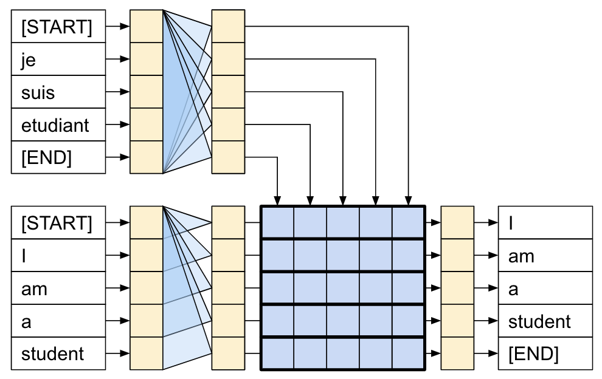
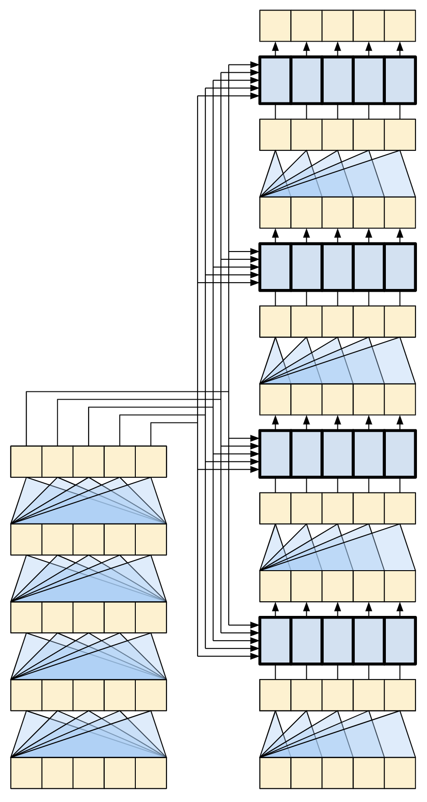
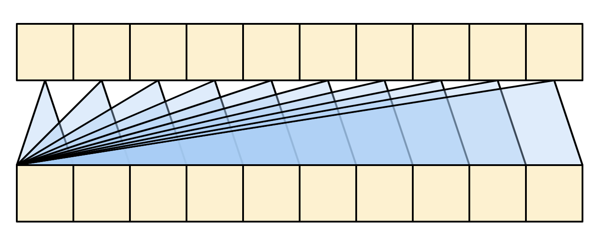
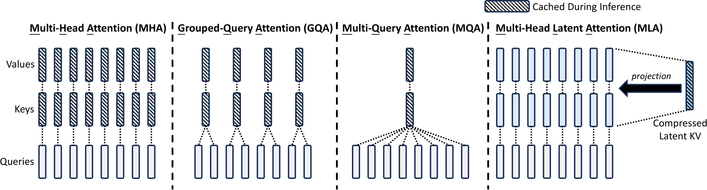
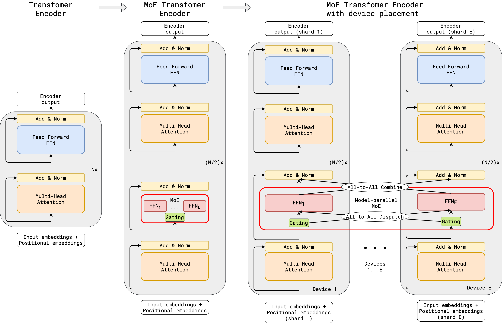

# 大语言模型导读：一轮回答怎样生成

这一页介绍一条常见的大语言模型计算路径。用户输入的文字先变成 token 编号，再进入模型层。模型为词表中的候选 token 打分，生成出的新 token 会回到下一步输入。后面的机器学习四节、Lab 2、Lab 3、Lab 5 都会用到这条路径中的某一段。

这里主要讨论 **decoder-only 自回归模型**。它是聊天模型和代码模型常见的外层结构。模型根据已经出现的 token 预测下一个 token，预测出的 token 再加入上下文，模型继续预测。[^hf-llm][^tf-transformer]

!!! tip "注意以下两条线"

    - **数据线**。文本 → token ID → 向量 → hidden state → logits → 新 token → 文本。
    - **时间线**。训练时整段序列可以同时计算。推理时每生成一个 token，就把它追加到上下文，再进行下一步。

    后面出现的 attention、MoE、KV cache、量化和并行，都是在这两条线上改变计算、存储或数据移动的方式。

!!! note "不需要先记住全部缩写"

    首次阅读时，先理解 `input_ids [B,S]`、`hidden states [B,S,H]`、`logits [B,S,V]` 三种张量即可。Q/K/V、MHA、GQA、MLA、FFN、MoE、Gated DeltaNet 会在相应小节展开；忘记缩写时可以回到本页的表格和层级图。

## 一次回答的过程

下面用标签页按顺序浏览一次生成。每一步的输出都会成为下一步的输入。

=== "1. 组织消息"

    聊天应用通常先保存多轮消息。system 说明规则，user 提问，assistant 保存历史回答。模型本身不认识这些角色名称。运行时需要按该模型要求的 **chat template** 把它们拼成一段带特殊标记的输入。[^hf-llm]

    ```text
    system: 你是一个助手
    user: 什么是 MPI？

    ↓ chat template

    <system>你是一个助手</system><user>什么是 MPI？</user><assistant>
    ```

    换用不同模板，模型看到的 token 序列也会改变。模板属于输入准备阶段，不属于 Transformer 层。

=== "2. 变成 token ID"

    tokenizer 把模板文本切成 token，再查词表得到整数编号。token 可能是词片、汉字、标点或字节片段，因此一个自然语言词不一定只占一个 token。[^hf-tokenizer]

    ```text
    文本：      HPC makes programs faster
    token：    ["H", "PC", " makes", " programs", " faster"]
    input_ids：[id_0, id_1, id_2, id_3, id_4]
    ```

    多个请求一起进入模型时，整数编号常组织为 `input_ids [B,S]`。`B` 是请求数，`S` 是当前 token 数。

!!! tip "ID 只是查表位置"

    `input_ids` 中相邻的两个整数不表示两个词在语义上更接近。ID 的作用是定位 embedding 表中的一行。进入 embedding 后，模型才开始处理浮点向量。

=== "3. 查表并逐层计算"

    embedding 表将每个 ID 查成长度为 $H$ 的浮点向量，得到 hidden states `[B,S,H]`。位置编码让模型知道 token 的先后顺序。随后 hidden states 经过 $L$ 个模型层，每层都输出新的 `[B,S,H]`。

    一层内部通常有两类主要计算。

    - **读取上下文**。attention 或 Gated DeltaNet 等模块让当前位置使用历史 token 信息。
    - **改写通道**。FFN 或 MoE 对每个 token 的向量做更宽的非线性变换。

=== "4. 得到下一个 token"

    最后一层的 hidden state 经过词表投影得到 `logits [B,S,V]`，其中 `V` 是词表大小。最后一个位置的 logits 是对所有候选 token 的未归一化分数。

    采样器可以取最大值（greedy），也可以使用 temperature、top-k、top-p 等规则。采样结果是一个新的整数 `next_token_id`，tokenizer 再将它还原为可见文本。[^tf-text-generation]

=== "5. 继续生成"

    新 token 会追加到上下文。decoder-only 模型再次计算下一个 token，直到生成 EOS、达到最大长度、匹配停止词，或请求被取消。

    推理中，模型保存各层历史 K/V，这就是 **KV cache**。后文会说明 prefill、decode 和缓存为何成为 Lab 5 的关键。

---

完成一轮生成的主路径可以压缩为

```text
消息 → 模板 → token IDs → hidden states → L 个模型层
→ logits → 采样出的新 ID → 文本片段 → 追加到上下文
```

## 哪种模型结构适合逐步生成文本

Transformer 常见的外层结构有三种。它们解决的问题不同，也决定 token 可以从哪里读取信息。

| 结构 | 输入与输出 | token 的信息来源 | 常见任务 |
| --- | --- | --- | --- |
| Encoder-only | 输入序列 → 表示、分类或检索向量 | 每个位置可读取完整输入序列 | 编码、检索、分类 |
| Encoder-decoder | 源序列 → 目标序列 | decoder 读取已生成 token，也读取 encoder 输出 | 翻译、摘要、语音到文本 |
| Decoder-only | 已有 token → 下一个 token | 每个位置只读取自身和历史 token | 对话、续写、代码生成 |



*图：TensorFlow Text Tutorial。图展示 encoder-decoder Transformer 的完整信息流。decoder-only 大模型保留按历史 token 生成下一个 token 的路径，不使用 encoder 输出和 cross-attention。[^tf-transformer]*

从这张图可以先得到两个结论。

- encoder-decoder 中，decoder 有两类信息来源。第一类是已生成的目标 token。第二类是 encoder 对源序列的表示，后者通过 cross-attention 进入 decoder。
- decoder-only 中只有一条 token 序列。模型每一步都在这条序列末尾追加一个 token，并按因果方向读取左侧历史。

因此，下面的 attention、KV cache、prefill、decode 都围绕 decoder-only 模型展开。遇到翻译模型、语音模型或多模态 encoder-decoder 模型时，仍可复用 tokenizer、embedding、模型层和 logits 的概念，只是多了一条 encoder 输出的输入路径。

## 输入怎样变成模型认识的数字

### 聊天消息先按模板组织

聊天模型通常接收多轮消息，而不是单一字符串。运行时会把 system、user、assistant、工具返回等内容按照该模型的模板拼成 token 序列。模板往往会插入角色标记、轮次分隔符、生成起始标记或结束标记。

```text
结构化消息
system: 你是一个助手
user: 解释 KV cache

=== chat template 之后 ===
<system>你是一个助手</system><user>解释 KV cache</user><assistant>
```

模型最终看到的是第二行经过 tokenizer 后的 ID 序列。不同模型的模板不同。直接把对话文字拼接成普通字符串时，可能缺少角色标记或结束标记，输出格式也会变化。Hugging Face 的 LLM 教程将 chat template 视为调用聊天模型时的重要输入准备步骤。[^hf-llm]

### tokenizer 将文本切成编号

tokenizer 由词表和切分规则组成。它把文本分成 token，再把每个 token 查成词表中的整数编号。token 可以是词片、汉字、标点或字节片段。[^hf-tokenizer]

```text
文本：      HPC makes programs faster
token：    ["H", "PC", " makes", " programs", " faster"]
input_ids：[id_0, id_1, id_2, id_3, id_4]
```

一个 token ID 只是一个整数。例如 ID `320` 只是 embedding 表的一行索引。tokenizer 完成后，模型拿到的常见逻辑形状是

```text
input_ids: [B,S]
```

其中 $B$ 是 batch 内请求数，$S$ 是每个请求当前的 token 数。训练中较短序列可以用 padding 补齐。推理服务中不同请求的长度不断变化，运行时通常用更灵活的 block 或分页方式管理缓存。

??? tip "展开：怎样读 `[B,S]`"

    设一次同时处理两条消息，每条消息暂时都有 4 个 token，则 `input_ids` 可以写成

    ```text
    [
      [101,  52,  87,  19],
      [101, 314,  66, 902],
    ]
    ```

    它的形状是 `[2,4]`。第一个下标选择第几条消息，第二个下标选择这条消息中的第几个 token。这里的数字只来自词表编号。不同模型的词表不同，`101` 在另一套 tokenizer 中不一定表示同一个 token。

    batch 中的两条消息在同一次矩阵计算中并行处理，但它们在逻辑上仍是两段独立文本。注意力 mask、padding mask 或运行时的 block 表会保证一条请求不会读取另一条请求的上下文。

### 编号怎样变成向量

embedding 表把整数 ID 查成长度为 $H$ 的浮点向量。词表大小为 $V$ 时，embedding 权重可写为

$$
E\in\mathbb{R}^{V\times H}
$$

查表后

```text
input_ids       [B,S]       整数
embedding       [B,S,H]     浮点
```

位置也必须进入模型。只知道 token ID 时，“猫追狗”和“狗追猫”拥有相同 token 集合，模型无法区分顺序。位置嵌入、正弦位置编码、旋转位置编码等方法都在为 token 表示加入位置差异。[^transformer][^tf-transformer]

这个阶段为后续层提供可学习的数值表示。经过许多层更新后，向量会同时携带 token 本身、所在位置和已读取上下文的信息。

??? tip "展开：一行 embedding 到底做了什么"

    设词表有 50,000 个 token，隐藏维度 $H=4$。embedding 表可以看成有 50,000 行、每行 4 个浮点数的矩阵。若 token ID 是 320，查表就是取出第 320 行，例如

    ```text
    E[320] = [0.12, -0.03, 0.71, 0.44]
    ```

    这一步没有把中文或英文翻译成某个可读词义，也没有做复杂推理。它只是取出一行可训练参数。训练过程中，反向传播会更新被访问到的行和其他层的参数，使这些向量逐渐适合后续计算。

    位置处理发生在同一阶段。最简单的理解是把位置向量加到 token 向量上。相同 token 出现在第 2 个位置和第 20 个位置时，基础 embedding 相同，但加入的位置表示不同，因此后续层可以区分它们在序列中的位置。

!!! quote "TensorFlow 教程关于位置编码的说明（译）"

    注意力层把输入看成一组向量，本身没有顺序概念。Transformer 没有循环层或卷积层来天然表示词序，因此需要把位置编码加到 embedding 上；相邻位置的编码应保持可区分的关系。[^tf-transformer]

| 名称 | 典型形状 | 作用 |
| --- | --- | --- |
| `input_ids` | `[B,S]` | tokenizer 输出的整数编号 |
| embedding / hidden states | `[B,S,H]` | 模型层之间传递的浮点表示 |
| Q / K / V | `[B,h,S,d_h]` 或等价布局 | 注意力的查询、键和值 |
| attention scores | `[B,h,S,S]` | query 与 key 的匹配分数 |
| logits | `[B,S,V]` | 每个位置对词表 token 的未归一化分数 |

## 模型层怎样更新 token 表示

embedding 后得到 $X^{(0)}\in\mathbb{R}^{B\times S\times H}$。模型会将它送入第 1 层，得到 $X^{(1)}$；再送入第 2 层，得到 $X^{(2)}$；一直重复到第 $L$ 层。每一层的输入和输出通常都保持 `[B,S,H]`，但每个 token 向量的内容会不断更新。

一个常见的 pre-norm decoder layer 可写为

$$
U^{(\ell)}=\operatorname{Norm}(X^{(\ell)}),\qquad
Y^{(\ell)}=X^{(\ell)}+\operatorname{TokenMixer}(U^{(\ell)})
$$

$$
Z^{(\ell)}=\operatorname{Norm}(Y^{(\ell)}),\qquad
X^{(\ell+1)}=Y^{(\ell)}+\operatorname{ChannelMixer}(Z^{(\ell)})
$$

这里的部件如下。

| 部件 | 做什么 | 是否与其他部件同层共存 |
| --- | --- | --- |
| Norm | 调整每个 token 向量的数值尺度，例如 LayerNorm、RMSNorm | 是 |
| residual | 将子层输出加回输入 | 是 |
| TokenMixer | 让 token 读取序列信息 | 每层选择一种主要形式 |
| ChannelMixer | 改写单个 token 的通道维度 | 每层选择 dense FFN 或 MoE |

Norm、residual、TokenMixer、ChannelMixer 位于层的不同位置。TokenMixer 处理 token 与 token 的信息交换。ChannelMixer 主要处理一个 token 自身的通道变换。

!!! note "同一层中哪些部件共存"

    Norm 和 residual 是层的通用结构，通常与其他部件一起出现。TokenMixer 是上下文读取的位置，一层会选用 attention、状态式模块等一种主要实现。ChannelMixer 是通道变换的位置，一层会选用 dense FFN 或 MoE。两类 mixer 位于同一层的不同槽位。MoE 不替代 attention，Gated DeltaNet 也不替代 FFN。



*图：TensorFlow Text Tutorial。图中的重复层说明模型深度来自相同类型层的堆叠。decoder-only 模型只保留因果 decoder 路径，但同样以 $L$ 个层逐层更新 hidden states。[^tf-transformer]*

以 $B=1,S=4,H=8,h=2$ 为例，一层标准注意力的 shape 可以按下面顺序检查：

```text
input hidden states X       [1,4,8]
Q / K / V after projection  [1,4,8]
reshape into heads          [1,2,4,4]
attention scores            [1,2,4,4]
context per head            [1,2,4,4]
merge heads + output proj   [1,4,8]
channel mixer output        [1,4,8]
```

后续 Lab 中看到的 `[B,T,H]`、`[B,h,T,d_h]`、`[B,h,T,T]` 等 shape，都可以放回这条链理解。

??? tip "展开：一个模型层怎样前后相接"

    可以把第 $\ell$ 层想成对同一张 `[B,S,H]` 表做两次更新。

    1. 先把输入做 Norm，得到数值尺度更稳定的表示。
    2. TokenMixer 让每个位置读取允许的历史位置，产生一个同形状输出。
    3. 将这个输出加回层输入，得到第一条残差路径的结果。
    4. 再做一次 Norm，并由 FFN 或 MoE 单独改写每个 token 的通道。
    5. 把第二个子层输出再加回，得到下一层输入。

    因此，token 的行数 $S$ 和隐藏维度 $H$ 往往在层与层之间保持不变。这样残差才能逐元素相加。内部的 attention head、FFN 中间维度和 MoE expert 数可以变化，它们会在子层结束前投回 `[B,S,H]`。

    残差也让后层不必每次从零构造一份表示。若某个子层的输出很小，原来的信息仍可沿加法路径继续向后传递。

## 模型怎样读取历史 token

### 标准因果注意力

标准 attention 从 hidden states 投影出 Q、K、V：

$$
Q=XW_Q,\qquad K=XW_K,\qquad V=XW_V
$$

多头注意力将隐藏维度拆成 $h$ 个 head，每个 head 的维度为 $d_h=H/h$。投影并拆 head 后，Q、K、V 可表示为 `[B,h,S,d_h]`。

对位置 $t$：

1. 取当前位置的 query 向量 $q_t$；
2. 取允许读取位置的 key 向量 $k_j$ 和 value 向量 $v_j$；
3. 计算 $q_tk_j^T/\sqrt{d_h}$，得到当前位置对各历史位置的分数；
4. 对分数做因果 mask 和 softmax，得到一组和为 1 的权重；
5. 使用权重对对应的 $v_j$ 加权求和，得到新的 token 表示。

将所有位置和所有 head 放在一起计算时，分数张量可以写为：

$$
A=\frac{QK^T}{\sqrt{d_h}}+M
$$

$M$ 是因果 mask。对于位置 $t$，未来位置 $j>t$ 的分数会被屏蔽；softmax 后这些位置的权重为零。最终输出为：

$$
O=\operatorname{softmax}(A)V
$$



*图：TensorFlow Text Tutorial。因果 mask 决定信息可见范围。训练时它让序列中所有位置可以同时计算预测；生成时它保证新 token 只依赖已知历史。[^tf-transformer]*

??? tip "展开：一个位置怎样对历史做加权求和"

    下面只看一个 head、一个当前位置。假设当前位置允许读取 3 个 token，缩放和 mask 之后的分数为

    ```text
    score = [2.0, 1.0, 0.0]
    ```

    softmax 将它转成和为 1 的权重，近似为

    ```text
    weight = [0.665, 0.245, 0.090]
    ```

    再假设对应的 value 向量为

    ```text
    v0 = [1, 0]
    v1 = [0, 2]
    v2 = [2, 1]
    ```

    输出就是

    ```text
    0.665 * v0 + 0.245 * v1 + 0.090 * v2
    = [0.845, 0.580]
    ```

    这个例子只展示最后一步。实际模型先用 $W_Q,W_K,W_V$ 从隐藏状态算出 Q、K、V，分数也由训练得到的投影决定。softmax 权重不是人为写出的语法规则，而是当前输入和模型参数共同算出的结果。

对于单个 head，$QK^T$ 的形状是 `[S,S]`。序列长度翻倍后，分数矩阵元素数量约变为四倍；标准 attention 的计算和中间访问都会随 $S^2$ 增长。这是长上下文模型需要关注 attention 算法和显存访问的原因。

!!! quote "TensorFlow 教程关于因果模型的说明（译）"

    因果模型一次生成一个 token，并把生成结果送回下一次输入。训练时，可以在一次模型调用中计算序列所有位置的预测；推理时，只需计算新增 token 的输出，前面位置的结果可以复用。[^tf-transformer]

KV cache 就是后一条在 Transformer 注意力中的具体实现：缓存历史 K/V，避免每次 decode 都重新计算历史 token 的投影。

### 注意力相关名称分别在改什么

注意力有关的名称处理的对象不同：

| 名称 | 改变什么 | 位置 |
| --- | --- | --- |
| 因果 mask | 一个位置可读取哪些 token | 注意力可见范围 |
| 滑动窗口 / 稀疏 attention | 允许读取的历史位置集合 | TokenMixer 的架构选择 |
| MHA / MQA / GQA / MLA | Q 与 K/V 的表示、head 共享和缓存组织 | 注意力层内部选择 |
| FlashAttention | attention 的分块计算和显存访问 | attention 的实现方式 |

FlashAttention 保留标准 attention 的数学结果，但通过分块计算和 online softmax 避免将完整 `[S,S]` 分数矩阵写回高带宽显存。它可以配合 MHA、MQA、GQA 等 K/V 组织方式。[^flashattention]

### MHA、MQA、GQA 与 MLA

这些机制主要影响 K/V 的数量和表示，进而影响 KV cache 的容量、decode 时的读取量和注意力实现。

| 机制 | Q head 与 K/V head | 结果 |
| --- | --- | --- |
| MHA | 每个 query head 有一组 K/V head | 表示最直接，KV cache 最大 |
| MQA | 所有 query head 共用一组 K/V | KV cache 最小，但表达能力可能下降 |
| GQA | 多个 query head 共用一组 K/V | 在 MHA 与 MQA 之间折中 |
| MLA | 将 K/V 压缩为 latent 表示 | 通过改变缓存表示压缩 KV cache |


*图：GQA 论文。图中的连线表示 query head 与 K/V head 的共享关系；共享越多，推理时需要保存和读取的 K/V 越少。[^gqa]*



*图：DeepSeek-V2 论文。MLA 与 MHA/GQA/MQA 的区别在于缓存表示本身；它不只是减少 K/V head 数。[^deepseek-v2]*

一个注意力层采用其中一种主要 K/V 组织方式。GQA 在 MHA 的质量和 MQA 的推理速度之间折中；MLA 使用另一条路径压缩缓存。[^gqa][^deepseek-v2]

??? note "展开：head 共享为什么会影响 KV cache"

    假设模型有 8 个 query head，每个 head 的维度相同。

    - MHA 为 8 个 query head 分别保存 8 组 K/V。
    - GQA 若每 2 个 query head 共用一组 K/V，只需保存 4 组 K/V。
    - MQA 让全部 8 个 query head 共用一组 K/V，只需保存 1 组 K/V。

    对每个历史 token、每一层来说，K/V 的存储量随 K/V head 数变化。query head 数仍可保持较多，因此 GQA 常被用作质量、缓存容量和 decode 读取量之间的折中。MLA 的做法不同，它将缓存内容压缩成另一种 latent 表示，使用时再恢复注意力计算所需的信息。

### 另一类读取历史的方式：Gated DeltaNet

标准 attention 通过历史 K/V 计算当前位置对历史位置的权重。线性注意力、状态空间模型和 Gated DeltaNet 则维护一个随时间更新的状态，将历史压入状态而不是显式保存完整的注意力分数矩阵。

Gated DeltaNet 将门控记忆控制与 delta update rule 结合。完整公式包含多个投影、门控前缀和及状态更新。从数据依赖看，每个 token 的状态变化可概括为

$$
S_t = \operatorname{retain}(g_t,S_{t-1}) + \operatorname{delta\text{-}update}(k_t,v_t,\beta_t)
$$

$g_t$ 控制已有状态保留或遗忘的程度，$k_t$、$v_t$ 参与写入，$\beta_t$ 控制更新。这个式子用于说明依赖方向。$S_t$ 依赖 $S_{t-1}$，因此朴素实现按 token 顺序递推。[^gated-deltanet]

Gated DeltaNet 与标准 attention 位于同一个 TokenMixer 槽位。模型可以采用纯 Gated DeltaNet，也可以在不同层混合 Gated DeltaNet、滑动窗口 attention 或其他 TokenMixer；具体组合由模型架构决定。MoE 位于 ChannelMixer 槽位，因而可以和 Gated DeltaNet 同时出现在一个模型层中。[^gated-deltanet]

Lab 3 处理的是 Gated DeltaNet 的 prefill。序列可以切成固定长度的 chunk。chunk 边界仍传递状态，chunk 内的门控前缀、三角结构和矩阵乘可以组织为块计算。GPU 优化的对象由此变成 chunk 内的 GEMM、状态 tile、数据搬运和 warp 协作。

```text
输入 Q / K / V / gate / beta
→ chunk 0：用初始状态 S_0 计算，得到输出块 O_0 和状态 S_1
→ chunk 1：读取 S_1，得到 O_1 和 S_2
→ …
→ 拼接各 chunk 的输出
```

## FFN、门控与 MoE 怎样改写一个 token

attention 或状态模块负责 token 与 token 的信息交换。前馈网络（feed-forward network，FFN）主要处理单个 token 的通道维度。一个普通 dense FFN 可写成

$$
\operatorname{FFN}(x)=W_2\,\phi(W_1x+b_1)+b_2
$$

$W_1$ 通常将隐藏维度从 $H$ 扩展到更宽的中间维度，激活函数后再由 $W_2$ 投回 $H$。这个操作对 `[B,S,H]` 中每一个 token 位置独立执行；它不直接读取其他 token。

!!! quote "TensorFlow 教程关于前馈网络的说明（译）"

    Transformer 的前馈网络由两层线性层和中间激活函数组成。它在 encoder 和 decoder 中都以逐位置方式运行；attention 负责位置之间的信息交换，前馈网络负责把每个位置的向量进一步变换。[^tf-transformer]

SwiGLU、GEGLU 等门控 FFN 会从同一个输入生成两路中间表示，其中一路经过激活函数后作为门，逐元素调制另一路。可概括为

$$
\operatorname{SwiGLU}(x)=W_{\mathrm{down}}\bigl(\operatorname{SiLU}(xW_{\mathrm{gate}})\odot(xW_{\mathrm{up}})\bigr)
$$

这里的 $\odot$ 是逐元素乘法。它仍然逐 token 计算，不负责不同 token 的信息交换。

MoE 将一个 dense FFN 换成多个 expert FFN。设有 $E$ 个 expert，router 对每个 token 输出 `[E]` 个分数。top-k 选择少数 expert 和相应权重。随后系统按 expert 重排 token，将同一 expert 的 token 组织成矩阵，再执行各 expert 的 FFN。

```text
hidden states [B,S,H]
→ router scores [B,S,E]
→ top-k expert IDs + gate weights
→ dispatch：按 expert 重排 token
→ expert FFN / GEMM
→ combine：按 gate 权重合并
→ hidden states [B,S,H]
```

对于 token $x_t$，router 选中 expert $e_1,e_2$ 时，输出可写为

$$
y_t=g_{t,e_1}\,\operatorname{FFN}_{e_1}(x_t)+g_{t,e_2}\,\operatorname{FFN}_{e_2}(x_t)
$$

MoE 与 dense FFN 是同一槽位的替代关系；一个 expert 内部仍可以使用普通 FFN 或 SwiGLU。MoE 的额外代价来自 router、token dispatch、combine、expert 负载不均和可能的 All-to-All 通信。[^gshard]



*读这张图时先只看红色框。红框上方和下方的 attention、Add & Norm 结构保持不变，变化发生在原 FFN 所在的位置。中间栏的 gating 为 token 选择 expert。右侧将 expert 分到不同设备，token 先按目标 expert 分发，expert FFN 完成计算后再把结果按原 token 位置合并。论文画的是 encoder 示例，decoder-only 模型中的 MoE 也遵循同样的 FFN 替换与路由过程。[^gshard]*

这正是 Lab 2 优化的局部路径。CPU 向量化、低精度矩阵乘法和缓存分块集中在 expert FFN 的 GEMM；router、token dispatch 和 combine 决定专家矩阵的实际 shape，也会影响负载均衡和端到端时间。

??? tip "展开：一个 token 怎样经过 top-2 MoE"

    设一层有 4 个 expert，router 对某个 token 给出 4 个分数。softmax 后得到

    ```text
    expert 0: 0.05
    expert 1: 0.60
    expert 2: 0.10
    expert 3: 0.25
    ```

    top-2 选择 expert 1 和 expert 3。系统将这个 token 的向量复制或按索引发送到这两个 expert 的输入矩阵。两个 expert 分别执行各自的 FFN，得到 $f_1(x)$ 和 $f_3(x)$。最后按路由权重合并，例如

    $$
    y = 0.60f_1(x) + 0.25f_3(x)
    $$

    有些实现会在选出的 top-2 内重新归一化权重，使它们相加为 1。具体规则由模型实现决定。这里应记住三件事：一个 token 不会经过全部 expert；expert 是 FFN 的替代分支；token 的重排和合并会带来额外系统开销。

### 几种 gate 分别控制什么

| 名称 | 控制对象 | 所在层次 |
| --- | --- | --- |
| 因果 mask | 哪些 token 位置可被读取 | 注意力可见范围 |
| SwiGLU gate | 某些通道如何通过 FFN | 单个 FFN 内部 |
| MoE router gate | 一个 token 送往哪些 expert、各占多大权重 | FFN 的 expert 选择 |
| Gated DeltaNet gate | 递推状态保留、遗忘或更新的程度 | 状态式 TokenMixer |

这些 gate 可以同时出现在一个模型中，因为它们控制的位置、通道、专家和状态不同。

## 模型怎样给下一个 token 打分

最后一个模型层仍输出 `[B,S,H]`。语言模型头将 hidden states 投影到词表大小。

$$
\operatorname{logits}=XW_{\mathrm{vocab}}+b_{\mathrm{vocab}}
\in\mathbb{R}^{B\times S\times V}
$$

logits 是未归一化分数。对最后一个位置的长度为 $V$ 的 logits 做 softmax，可得到词表中每个 token 的概率。采样器从这组概率中选择下一个 token。

| 选择方式 | 规则 | 常见作用 |
| --- | --- | --- |
| Greedy | 取最大概率 token | 稳定、可复现的基线 |
| Temperature | 缩放 logits | 调整分布尖锐程度 |
| Top-k | 仅保留概率最高的 $k$ 个候选 | 去掉低概率尾部 |
| Top-p | 保留累计概率达到 $p$ 的最小候选集 | 随分布形状调整候选数 |

Temperature、top-k、top-p 是输出采样策略，不是 Transformer 层。它们可以组合使用，例如先做 temperature 缩放，再在 top-p 候选中采样。不同设置会改变输出多样性、可复现性和评测结果。[^tf-text-generation]


*TensorFlow Text Tutorial 的图中，multinomial 是一种按概率采样方式。greedy、top-k、top-p 可替换该选择步骤。[^tf-text-generation]*

采样器输出的是整数 `next_token_id`。tokenizer 的 decode 函数将 ID 与之前生成的 IDs 按词表规则还原为文本片段。单个 token 未必对应一个完整词，因此服务端通常以流式方式持续追加文本。停止条件也在模型层之外，例如 EOS token、最大生成长度、指定 stop sequence 或用户取消请求。

!!! tip "采样只使用最后一个位置"

    输入已有 $S$ 个 token 时，模型会输出 `[B,S,V]` 的 logits。生成第一个新 token 时，只读取最后一个位置 `logits[:, S-1, :]`。前面位置的 logits 在训练时用于对应位置的交叉熵，在这一步不参与采样。

??? tip "展开：logits、temperature、top-k 怎样连起来"

    假设词表中只看 4 个候选 token，最后一个位置的 logits 为

    ```text
    [2.0, 1.0, 0.0, -1.0]
    ```

    它们还不是概率。softmax 后约为 `[0.644, 0.237, 0.087, 0.032]`。greedy 直接选择第一个 token。

    temperature 会先把 logits 除以温度 $T$。$T<1$ 时分布更尖锐，更偏向最高分 token。$T>1$ 时分布更平，更容易抽到次高分 token。top-k 例如 $k=2$ 时，会先丢弃后两个候选，再在前两个候选之间重新归一化并采样。top-p 则按从高到低累加概率，保留累计概率刚达到阈值的候选集。

    这些规则只决定从模型分布中怎样选择，不会改写模型层的权重。固定随机种子、固定采样参数后，随机采样通常可以复现。

## 训练时怎样知道预测是否正确

训练语言模型时，一条 token 序列同时提供多个预测目标。

```text
输入 IDs。 [BOS, 我, 喜欢, 并行, 计算]
标签 IDs。 [我,   喜欢, 并行, 计算, EOS]
```

模型在每个位置输出一个长度为 $V$ 的 logits 向量。第一个位置读取 `BOS` 后预测 `我`，第二个位置读取 `BOS, 我` 后预测 `喜欢`，依此类推。因果 mask 使这些位置在一次前向中能够并行计算，同时仍保持每个位置只能读取左侧历史。

若第 $t$ 个位置对真实 token 的概率为 $p_t$，一个序列的交叉熵可写为

$$
\mathcal{L}=-\frac{1}{N}\sum_{t\in\mathcal{M}}\log p_t
$$

集合 $\mathcal{M}$ 只包含需要计分的位置；padding、提示词中的某些部分或已被 mask 的位置可以从损失中排除。前向传播得到 logits 和 loss，反向传播计算参数梯度，优化器更新 embedding、投影矩阵、Norm 参数和其他可训练权重。训练时需要保存 activation 供反向使用，因此显存账本与推理不同。[^transformer]

```text
input_ids [B,S]
→ L 个模型层
→ logits [B,S,V]
→ 与 shifted labels [B,S] 计算 cross entropy
→ backward
→ optimizer step
```

训练中的 TokenMixer、FFN、MoE 与推理使用相同数学层。训练还要处理整段序列的标签、保存 activation、计算梯度和更新权重。

??? tip "展开：一条短序列怎样给出多个训练样本"

    设 token 序列为 `[BOS, A, B, EOS]`。模型会同时在 3 个可计分位置上学习。

    | 输入到当前位置的历史 | 模型要提高概率的目标 |
    | --- | --- |
    | `[BOS]` | `A` |
    | `[BOS, A]` | `B` |
    | `[BOS, A, B]` | `EOS` |

    如果三个位置对真实目标的概率分别是 $0.8$、$0.5$、$0.1$，负对数损失分别约为 $0.22$、$0.69$、$2.30$。第三个位置的惩罚最大，因为模型给正确 token 的概率最低。反向传播会根据所有位置的损失共同调整参数。

    这说明语言模型训练不是把一整段文本只当作一个样本。长度为 $S$ 的序列通常能提供接近 $S$ 个下一个 token 预测目标，padding 或不参与训练的区域会从损失中排除。

## Prefill、Decode 与 KV cache 怎样复用历史

推理可分成两个阶段。

1. **Prefill** 一次处理 prompt 中已有的 $S$ 个 token，计算各层 K/V 并写入 KV cache。矩阵乘法较大，GPU 容易获得较高并行度。
2. **Decode** 每次只加入一个新 token，读取历史 KV、计算新 token 的 K/V 和输出概率，再把新 K/V 追加到缓存。单步工作较小，cache 读取和请求调度常更显著。

KV cache 是推理运行时状态。它保存各层历史 token 的 K/V。MHA、MQA、GQA、MLA 会改变缓存的表示和大小，量化或分页会改变它的存储与管理方式。Prefill 与 decode 是同一模型在不同序列阶段的执行模式。[^hf-cache]

!!! quote "Hugging Face 文档关于 KV cache 的说明（译）"

    KV cache 保存先前 token 计算出的 key 和 value。缓存能减少自回归生成中的重复计算，但会占用显存；随着序列变长，缓存需要的内存也随之增长。[^hf-cache]

!!! note "缓存和模型权重是两类状态"

    模型权重在请求之间共享，通常在加载模型后保持不变。KV cache 属于某个正在生成的请求，并随上下文长度增长。服务端讨论并发上限时，需要同时计算权重、KV cache 和临时工作区。

若每层有 $H_{kv}$ 个 K/V head、每个 head 维度为 $d_h$、元素字节数为 $b$，一个 batch 的缓存量级可写为

$$
\text{KV bytes}\approx 2\times L\times B\times S\times H_{kv}\times d_h\times b
$$

前面的 2 分别对应 K 和 V。这个式子没有包含框架管理和对齐开销，但足以说明为什么长上下文、并发请求和 MHA 的 K/V head 数会迅速推高显存需求。GQA/MQA 通过减少 $H_{kv}$，MLA 通过改变 K/V 的缓存表示，量化通过减小 $b$，它们都在影响这条式子的不同因子。

??? tip "展开：缓存到底省掉了什么"

    设 prompt 已有 4 个 token，模型刚刚生成第 5 个 token。

    - 没有 KV cache 时，生成第 6 个 token 要把前 5 个 token 再完整送进每一层，重新计算前 5 个位置的 K、V。
    - 有 KV cache 时，只把第 5 个新 token 送入每一层，计算它自己的 $q_5,k_5,v_5$。注意力读取缓存中的前 4 组 K/V，再把 $k_5,v_5$ 追加进去。

    缓存节省的是历史 token 的重复投影和重复层计算。它并不会让 decode 完全不读历史，因为新 query 仍需要与历史 K 做匹配，并按历史 V 加权求和。因此上下文增长后，decode 常转向显存读取和单步延迟问题。

??? tip "展开：用一个小数字估算 KV cache"

    假设有 2 层、每层 2 个 KV head、每个 head 维度为 4、上下文长 3，元素使用 BF16 的 2 字节。单个请求缓存约为

    $$
    2\;\text{(K/V)}\times2\;\text{(layers)}\times3\;\text{(tokens)}\times2\;\text{(KV heads)}\times4\;\text{(head dim)}\times2\;\text{(bytes)}=192\;\text{bytes}
    $$

    真实模型的层数、head 数和上下文长度大得多，缓存很快从 KB 变为 GB。这个算式也说明，增加并发请求会近似线性增加缓存占用。

```text
prompt IDs
→ prefill
→ 每层 KV cache
→ logits for last prompt token
→ sample token_1
→ decode(token_1, cache)
→ cache 追加 token_1 的 K/V
→ sample token_2
→ …
```

Prefill 与 decode 使用同一层权重，但张量形状不同。设 prompt 长度为 $S$。

| 阶段 | 新输入的 query 数 | 历史 key/value 长度 | 注意力分数的典型形状 |
| --- | ---: | ---: | --- |
| Prefill | $S$ | $S$ | `[B,h,S,S]` |
| 第一次 decode | $1$ | $S$ | `[B,h,1,S]` |
| 第 $t$ 次 decode | $1$ | $S+t-1$ | `[B,h,1,S+t-1]` |

这也是服务端把 prefill 和 decode 分开调度的原因。Prefill 有较大的矩阵乘和较多并行位置。decode 单步矩阵较小，却反复读取越来越长的缓存。

在 decode 的第 $t$ 步，每层只需要为新 token 计算一行 $q_t,k_t,v_t$。$q_t$ 与缓存的 $K_{\leq t}$ 相乘得到长度为 $t$ 的分数，随后与缓存的 $V_{\leq t}$ 加权求和。新 $k_t,v_t$ 会追加到该层 cache。历史 token 的 K/V 可以直接复用。Q 没有被长期缓存，因为下一步生成时需要的是新 token 的 query。

Lab 5 覆盖这条完整路径中的多个位置。GPTQ 改变线性层权重的表示与反量化。KV cache 管理影响长上下文容量。算子融合影响每层读取和写回。continuous batching、paged cache 与请求调度决定多个请求怎样共享 GPU 时间。

## 训练和推理分别保存什么

训练和推理使用相同的层计算，但保留的状态不同。

| 阶段 | 主要计算 | 必须保留的状态 |
| --- | --- | --- |
| 训练前向 | logits、loss | activation，供反向传播使用 |
| 训练反向 | 参数梯度 | 梯度、优化器状态、通信 buffer |
| 推理 prefill | 全 prompt 的 K/V | KV cache |
| 推理 decode | 新 token 的输出 | 扩展后的 KV cache |

分布式训练中的 DP、FSDP、TP、PP 等策略处理训练状态和计算如何分布到多卡。它们改变参数、activation、梯度和通信发生的位置。

## 与后续内容的联系

| 页面或实验 | 位于这条路径中的位置 | 主要问题 |
| --- | --- | --- |
| [0716a：机器学习基础](0716a.md) | loss、梯度、Transformer 基础 | 监督学习、交叉熵、反向传播、Q/K/V |
| [0716p：分布式训练与推理](0716p.md) | 训练状态和多卡执行 | DP、FSDP、TP、PP、通信 |
| [0717a：算法—系统协同](0717a.md) | attention、MoE、量化、服务 | FlashAttention、KV cache、GPTQ、调度 |
| [Lab 2：MoE 向量化](../lab2/index.md) | FFN / MoE expert 路径 | router、token 重排、expert GEMM、量化和 CPU 向量化 |
| [Lab 3：GDN Prefill](../lab3/index.md) | TokenMixer 的 prefill | Gated DeltaNet 状态更新、chunk、GPU kernel |
| [Lab 5：Gemma4 推理](../lab5/index.md) | tokenizer 到 decode 的端到端路径 | GPTQ、KV cache、算子、批处理和服务调度 |

[^hf-llm]: Hugging Face, *LLM tutorial*, <https://huggingface.co/docs/transformers/main/en/llm_tutorial>.
[^hf-tokenizer]: Hugging Face, *Summary of the tokenizers*, <https://huggingface.co/docs/transformers/main/en/tokenizer_summary>.
[^tf-transformer]: TensorFlow, *Transformer model for language understanding*, <https://www.tensorflow.org/text/tutorials/transformer>.
[^tf-text-generation]: TensorFlow, *Text generation with an RNN*, <https://www.tensorflow.org/text/tutorials/text_generation>.
[^transformer]: A. Vaswani et al., *Attention Is All You Need*, <https://arxiv.org/abs/1706.03762>.
[^flashattention]: T. Dao et al., *FlashAttention: Fast and Memory-Efficient Exact Attention with IO-Awareness*, <https://arxiv.org/abs/2205.14135>.
[^gated-deltanet]: S. Yang, J. Kautz, A. Hatamizadeh, *Gated Delta Networks: Improving Mamba2 with Delta Rule*, <https://arxiv.org/abs/2412.06464>.
[^gshard]: D. Lepikhin et al., *GShard: Scaling Giant Models with Conditional Computation and Automatic Sharding*, <https://arxiv.org/abs/2006.16668>.
[^gqa]: J. Ainslie et al., *GQA: Training Generalized Multi-Query Transformer Models from Multi-Head Checkpoints*, <https://arxiv.org/abs/2305.13245>.
[^deepseek-v2]: DeepSeek-AI et al., *DeepSeek-V2: A Strong, Economical, and Efficient Mixture-of-Experts Language Model*, <https://arxiv.org/abs/2405.04434>.
[^hf-cache]: Hugging Face, *KV cache strategies*, <https://huggingface.co/docs/transformers/main/cache_explanation>.
