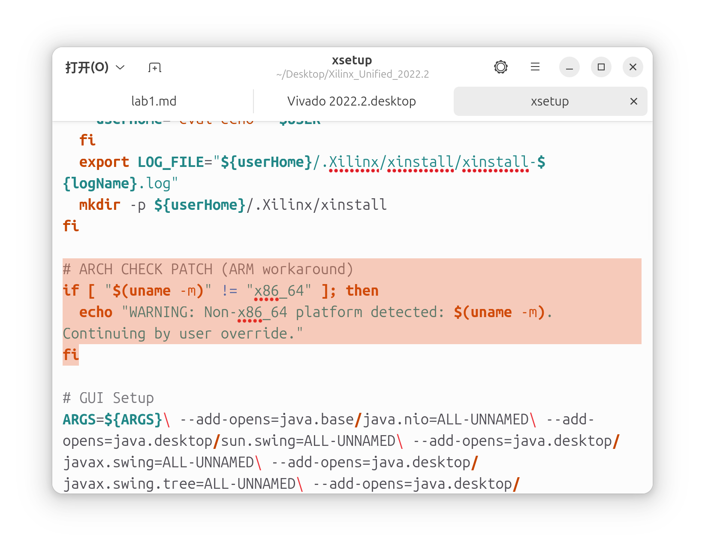
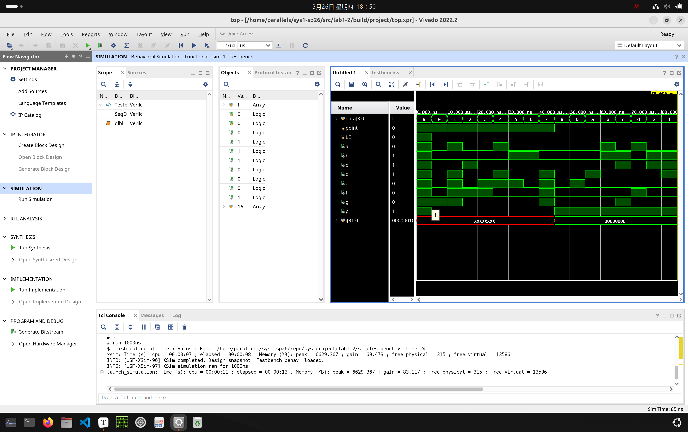

# Vivado（含可用的Batch模式） 2022.2 on Ubuntu with Rosetta（不完善）

### 引用文章来自CSDN：利用 Rosetta 在 M 系列 Mac 上高效运行 x86 Linux 应用的完整指南[[点击跳转至整理归档](rosetta.md)]

!!! information
    配置过程繁琐，且不一定100%有效。这种配置方式的唯二优点：可以直接从 Makefile 生成 bitstream (***Batch***方便且快速)；调用 Mac 的 Rosetta 转译，效率较高。

!!! warning
    由于其不稳定性，不建议用此方法。仍建议x86_64原生环境或优先采用实验文档中 docker 容器的方法！如果您尝试用 Apple ，请做好文件备份，并准备备用机（可以是 Windows 电脑，也可以是后文提及的PD虚拟机里的 Windows 11），以防万一。

注：笔者能力十分有限，只能写到这个程度。如果以后能力有提升会完善这篇文章。

另注：如果您很需要，可以联系我copy一份虚拟机。

> 本文的部署流程是通过Agent辅助完成的，总结这篇文章也是为了记录在 linux 系统里的“摸爬滚打”。这篇文章**没有任何技术含量**，只是记录我装机折腾的种种过程。现在列出步骤只是为了说明该方案的可行性。笔者刚刚接触 linux，是小白，实在不熟悉这个系统的环境和操作。步骤只是大致的框架，如遇到任何问题，请把此文喂给Agent并让其操作，这对他们来说是小菜一碟。

详见：github copilot 学生认证。<https://github.com/education/students>

在 Ubuntu 中打开 VSCode 的 Agent ，直接让它帮你来（hhh）。

> 更新：Copilot 免费额度大减，考虑安装 DeepSeek 插件。

- 写作工具：Typora；环境：Ubuntu 24.04 ARM64；网页构建工具：Mkdocs。

## 目标与版本

目标是在 **Apple Silicon Mac + Parallels Desktop + Ubuntu 24.04 ARM64** 上运行 **Vivado 2022.2**。

- 宿主机：Apple Silicon Mac
- 已验证的宿主机 / 虚拟化组合：**macOS 26 + Parallels Desktop 26**；**macOS 27.0（build 26A428）+ Parallels Desktop 27.0.1（58670）**
- 虚拟机系统：Ubuntu 24.04 ARM64，通过 **Ubuntu with Rosetta** 创建；Parallels Tools 应安装并与所用 Parallels Desktop 版本匹配（已验证的 PD 27 组合为 27.0.1-58670）
- Vivado 版本：**2022.2**

## 需要下载的内容

### **Parallels Desktop**

- **这个步骤可能是文章唯一给出的<span style="color:#FF0000;">有用信息</span>hhh。**

    上链接：<https://macwk.cn/app/2941.html>。
  
    !!! warning
        <span style="color:#FF0000;">**叠甲**</span> 仅供学习使用！请在24小时之内删除。请支持正版软件。
  
    如果签名失败，请先将安装容器的所有文件**复制并粘贴到一个新建文件夹**中，然后执行：
  
	```bash
    xattr -cr "你的文件名"	# 可以通过拖拽的方式添加，不要直接添加安装包中的文件。
    ```
  
    可能需要在\[设置\] - \[隐私与安全性\]中按指纹解锁权限继续安装。

### **Ubuntu 24.04 ARM64 镜像**（在 Parallels 中创建虚拟机）

点击新建选项，选择`下载 Ubuntu with Rosetta`，等待自动下载完毕。该软件完成度很高，几乎不用手动操作。


### **Vivado 2022.2 Linux 安装包**

常见文件名示例（以官方实际页面为准）：

- `Xilinx_Unified_2022.2_1014_8888_Lin64.bin`

具体下载方式请见课程文档。

## 执行指令并部署

!!! note
    这些指令只是根据此前聊天记录中试错后有效的指令，并未在全新的环境中测试。如有卡壳，请找Agent。

#### Xorg 会话背景

这一步的目的：解释为什么文中后续会强调 `x11/xorg`。

- Ubuntu 24.04 桌面默认更偏向 Wayland，但 Vivado 2022.2 的 GUI 组件对 Wayland 兼容并不稳定。
- 在 Wayland 下常见现象是：启动后闪退、窗口渲染异常、焦点/输入异常，或者偶发段错误。
- `GDK_BACKEND=x11` 只能告诉 GTK 尽量走 X11 后端，但它**不能替代登录级别的会话切换**。
- 所以Vivado GUI 场景尽量在 **Xorg 会话（`XDG_SESSION_TYPE=x11`）** 下运行。

快速判断当前会话：

```bash
echo "$XDG_SESSION_TYPE"
```

输出为 `x11` 说明已在 Xorg 会话；输出为 `wayland` 则建议切换（登出并重新登陆时右下角的小齿轮中选择）后再做 GUI 相关步骤。

### 安装 Ubuntu 基础依赖

RosettaLinux 负责 Vivado 的 x86_64 转译；`binfmt-support` 用于管理默认路由。QEMU 可以保留，用于后文所说的**显式**运行，不需要为了 Vivado 单独安装或禁用它。

```bash
sudo apt update
sudo apt install -y binfmt-support
```

### 配置 RosettaLinux 的 binfmt 路由

#### 适用环境与前置检查

本文已验证两组可用组合，二者都使用 Apple Silicon、Ubuntu 24.04 ARM64 与 **Ubuntu with Rosetta** 虚拟机：

| macOS | Parallels Desktop | 说明 |
| --- | --- | --- |
| macOS 26 | Parallels Desktop 26 | 已可用的旧环境 |
| macOS 27.0（build 26A428） | Parallels Desktop 27.0.1（58670） | 当前已可用环境；Guest Tools 为 27.0.1-58670 |

在 Parallels 虚拟机配置中确认 **Rosetta Linux = on**，并保持 Guest Tools 已安装。macOS 宿主机执行下列命令可以确认当前版本；如系统提示安装 Apple Rosetta，再执行第一条：

```bash
softwareupdate --install-rosetta --agree-to-license
sw_vers
prlctl --version
```

Ubuntu 客体内必须满足以下条件：

```bash
uname -m                         # 预期：aarch64
systemctl is-active prltoolsd    # 预期：active
test -x /media/psf/RosettaLinux/rosetta && echo 'rosetta: ok'
test -x /media/psf/RosettaLinux/rosettad && echo 'rosettad: ok'
```

如果 `rosetta` 或 `rosettad` 不存在，先检查虚拟机的 **Rosetta Linux** 开关和 Parallels Tools；不要通过修改 Vivado、Makefile 或 Verilog 绕过这个问题。

#### Vivado 默认走 Rosetta；QEMU 保留给显式调用

本虚拟机的用途是让直接启动的 Vivado x86_64 程序走 Parallels Rosetta。当前实际验证结果是：直接执行一个 x86_64 ELF 时，内核启动的是 `/media/psf/RosettaLinux/rosetta`。

同时，`qemu-x86_64` **保持启用是正常且有意的**：它不是 Vivado 的默认路由，而是供其他任务在命令中显式指定 QEMU 时使用。因此不要因为同时看到 Rosetta 和 QEMU 注册项就删除、屏蔽或互相替换它们。

检查当前注册状态：

```bash
for name in RosettaLinux x86_64 qemu-x86_64; do
  [ -e "/proc/sys/fs/binfmt_misc/$name" ] || continue
  echo "===== $name ====="
  cat "/proc/sys/fs/binfmt_misc/$name"
done
```

当前这台虚拟机的预期状态如下：

- `RosettaLinux`：启用，解释器为 `/media/psf/RosettaLinux/rosetta`；
- `x86_64`：启用，解释器同样为 `/media/psf/RosettaLinux/rosetta`；
- `qemu-x86_64`：可以启用，解释器为 QEMU；**保留它，不要禁用**。

如果 Rosetta 的规则丢失，可按以下方式恢复两个既有 Rosetta 注册名。不要创建 QEMU 屏蔽文件，也不要删除 `/usr/lib/binfmt.d/qemu-x86_64.conf`。

```bash
sudo install -d /etc/binfmt.d

cat <<'EOF' | sudo tee /etc/binfmt.d/rosetta-linux.conf >/dev/null
:RosettaLinux:M::\x7fELF\x02\x01\x01\x00\x00\x00\x00\x00\x00\x00\x00\x00\x02\x00\x3e\x00:\xff\xff\xff\xff\xff\xfe\xfe\x00\xff\xff\xff\xff\xff\xff\xff\xff\xfe\xff\xff\xff:/media/psf/RosettaLinux/rosetta:OCF
EOF

cat <<'EOF' | sudo tee /etc/binfmt.d/x86_64-rosetta.conf >/dev/null
:x86_64:M::\x7fELF\x02\x01\x01\x00\x00\x00\x00\x00\x00\x00\x00\x00\x02\x00\x3e\x00::/media/psf/RosettaLinux/rosetta:OCF
EOF

sudo systemctl restart systemd-binfmt
```

需要明确选择解释器时，不依赖 binfmt 的默认匹配，直接指定即可：

```bash
# 显式用 Rosetta 运行某个 x86_64 程序
/media/psf/RosettaLinux/rosetta /path/to/x86_64-program

# 显式用 QEMU 运行某个 x86_64 程序（本机命令为 /usr/bin/qemu-x86_64）
qemu-x86_64 /path/to/x86_64-program
```

#### 持久化：处理 `/media/psf` 晚挂载

Rosetta 解释器位于 Parallels 的共享挂载目录，可能晚于 `systemd-binfmt` 出现。以下服务在每次开机时等待解释器，再重新加载已有的 Rosetta 路由；它不会禁用或修改 QEMU 的路由：

```bash
cat <<'EOF' | sudo tee /usr/local/sbin/refresh-rosetta-binfmt >/dev/null
#!/usr/bin/env bash
set -euo pipefail
for i in $(seq 1 120); do
  if [ -x /media/psf/RosettaLinux/rosetta ]; then
    systemctl restart systemd-binfmt
    exit 0
  fi
  sleep 1
done
echo "Rosetta interpreter not found: /media/psf/RosettaLinux/rosetta" >&2
exit 1
EOF

sudo chmod +x /usr/local/sbin/refresh-rosetta-binfmt

cat <<'EOF' | sudo tee /etc/systemd/system/refresh-rosetta-binfmt.service >/dev/null
[Unit]
Description=Refresh Parallels Rosetta binfmt after shared folders are ready
After=multi-user.target

[Service]
Type=oneshot
ExecStart=/usr/local/sbin/refresh-rosetta-binfmt

[Install]
WantedBy=multi-user.target
EOF

sudo systemctl daemon-reload
sudo systemctl enable --now refresh-rosetta-binfmt.service
```

> 这一步只保证 Vivado 的 x86_64 路由可用。若 Vivado 或其自带 JRE 仍以 `139`（segmentation fault）退出，应作为 Rosetta / 运行时稳定性问题单独排查。

### 安装 Vivado 所需 amd64 运行库

这一步的目的：补齐 Vivado 自带 x86_64 JRE 需要的运行库，避免启动时报错。

```bash
sudo dpkg --add-architecture amd64
sudo apt update
sudo apt install -y zlib1g:amd64 libstdc++6:amd64 libc6:amd64
```

### 下载并解包 Vivado 2022.2

这一步的目的：拿到 `xsetup` 安装器文件。

```bash
cd ~/Desktop # 假设.bin文件放置在桌面
chmod +x Xilinx_Unified_2022.2_1014_8888_Lin64.bin
./Xilinx_Unified_2022.2_1014_8888_Lin64.bin --target ~/xilinx_2022.2
```

解包完成后，`xsetup` 路径通常是：`~/xilinx_2022.2/xsetup`。

### 修改 `xsetup` 架构检查

只改“报错退出”的架构判断分支，其他安装逻辑不要动。

!!! note
    仅需把`exit1`前面加`#`注释掉即可。图片中是AI修改后的片段，不必这么麻烦。

    

### 运行安装器

这一步的目的：正式安装 Vivado 到系统目录。

```bash
cd ~/xilinx_2022.2
./xsetup
```

按默认路径，推荐安装到 `/opt/Xilinx`，与仓库中Makefile的写法一致。

### 切换到 Xorg 会话（GUI 相关步骤前）

这一步的目的：让后续 GUI 启动脚本配置在更稳定的显示栈上工作。

1. 先退出登录（不是重启也可以）。
2. 在登录界面选中你的用户后，点击右下角齿轮图标。
3. 选择 **Ubuntu on Xorg**（或带 Xorg 字样的会话）。
4. 登录后执行：

```bash
echo "$XDG_SESSION_TYPE"
```

若输出为 `x11`，再继续第 7 步。

### 安装好后，修改官方 GUI 启动脚本

这一步的目的：把 GUI 兼容参数收敛到官方入口。

先备份：

```bash
sudo cp /opt/Xilinx/Vivado/2022.2/bin/vivado /opt/Xilinx/Vivado/2022.2/bin/vivado.bak
```

编辑文件 `/opt/Xilinx/Vivado/2022.2/bin/vivado`，下面是AI修改后的启动脚本。务必做好备份，不要盲目修改。建议让AI接管。

```bash
#!/bin/bash
. "`dirname \"$0\"`/setupEnv.sh"
# Set XILINX_VIVADO
XILINX_VIVADO=`dirname "$RDI_BINROOT"`
export XILINX_VIVADO

export RDI_DEPENDENCY="XILINX_VIVADO_HLS:XILINX_HLS"
export _RDI_NEEDS_PYTHON=True
export RDI_USE_JDK11=True

RDI_LAUNCH_MODE="gui"
while [ $# -gt 0 ]; do
	if [ "$1" = "-mode" ] && [ $# -ge 2 ]; then
		RDI_LAUNCH_MODE="$2"
		break
	fi
	shift
done

if [ -n "${HOME:-}" ]; then
	mkdir -p "$HOME/.Xilinx/Vivado/2022.2/data/layouts" 2>/dev/null || true
fi

export GDK_BACKEND=${GDK_BACKEND:-x11}
export SWT_GTK3=${SWT_GTK3:-0}
export LIBGL_ALWAYS_SOFTWARE=${LIBGL_ALWAYS_SOFTWARE:-1}
if [ "${XDG_SESSION_TYPE:-}" = "x11" ]; then
	export _JAVA_AWT_WM_NONREPARENTING=0
else
	export _JAVA_AWT_WM_NONREPARENTING=1
fi
export XLNX_USE_NATIVE_DECORATION=${XLNX_USE_NATIVE_DECORATION:-1}
if [ "$RDI_LAUNCH_MODE" = "gui" ]; then
	if [ -n "${HOME:-}" ]; then
		rm -f "$HOME/.Xilinx/Vivado/2022.2/data/layouts/application/default.layout" 2>/dev/null || true
	fi
	export _VIVADO_STABLE_JAVA_OPTS="-Xint -XX:+UseSerialGC -Dsun.java2d.xrender=false -Dsun.java2d.opengl=false -Dsun.awt.disablegrab=true -Dsun.java2d.uiScale=1.0 -Dawt.useSystemAAFontSettings=on"
	export _JAVA_OPTIONS="$_VIVADO_STABLE_JAVA_OPTS"
	export JAVA_TOOL_OPTIONS="$_VIVADO_STABLE_JAVA_OPTS"
	export JDK_JAVA_OPTIONS="$_VIVADO_STABLE_JAVA_OPTS"
else
	export _VIVADO_STABLE_JAVA_OPTS="-Dsun.java2d.xrender=false -Dsun.awt.disablegrab=true"
	[ -z "${_JAVA_OPTIONS:-}" ] && export _JAVA_OPTIONS="$_VIVADO_STABLE_JAVA_OPTS"
	[ -z "${JAVA_TOOL_OPTIONS:-}" ] && export JAVA_TOOL_OPTIONS="$_VIVADO_STABLE_JAVA_OPTS"
	[ -z "${JDK_JAVA_OPTIONS:-}" ] && export JDK_JAVA_OPTIONS="$_VIVADO_STABLE_JAVA_OPTS"
fi

# CR-1074520: Disable bmalloc memory allocator and use the system default one 
#   instead. This prevents WebKit from overindulging in virtual memory on high
#   memory machines. https://trac.webkit.org/wiki/EnvironmentVariables
export Malloc=1
##
# Launch the loader and specify the executable to launch
##
#
# Loader arguments:
#   -exec   -- Name of executable to launch
##
RDI_PROG=`basename "$0"`
"$RDI_BINROOT"/loader -exec $RDI_PROG "$@"
```

> 不要把这两个变量写到 `/etc/profile` 或 `/etc/profile.d`。

### 验证（Batch）

打开实验仓库，修改Makefile，执行`make bitstream`，如果成功生成二进制文件，则完成。否则，如果没有头绪，请继续让Agent帮忙调试。（实在是无奈，我们本**不该过度依赖AI**的…奈何刚接触这个环境…）

### GUI 启动（统一入口）

点击桌面图标，查看是否进入程序。点击任意项目，生成波形。

建议先确认会话类型：

```bash
echo "$XDG_SESSION_TYPE"
```

如不是 `x11`，优先切换 Xorg 后再测 GUI。



## 复现检查

分别登出和重启后重新尝试验证。
