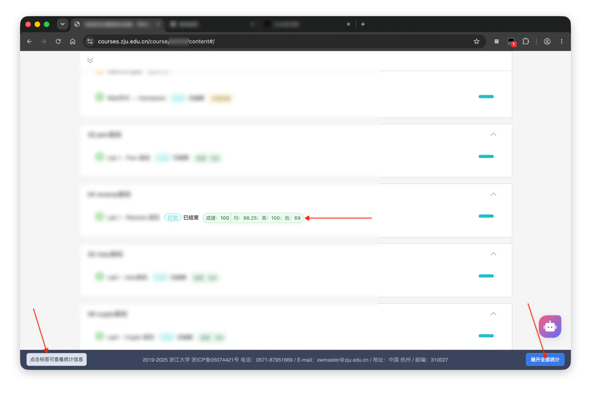
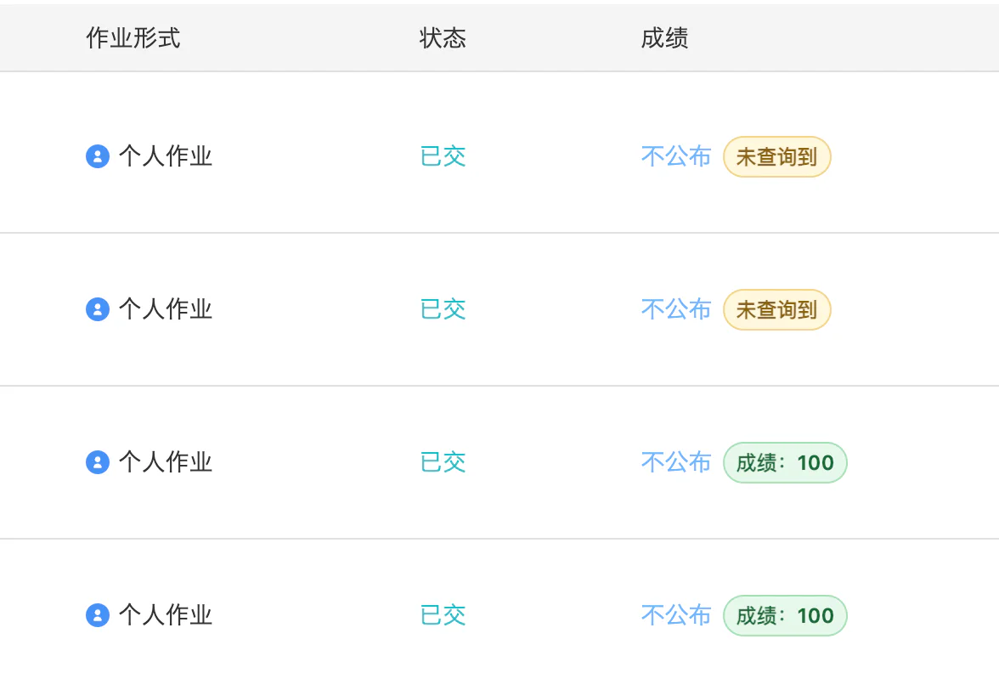
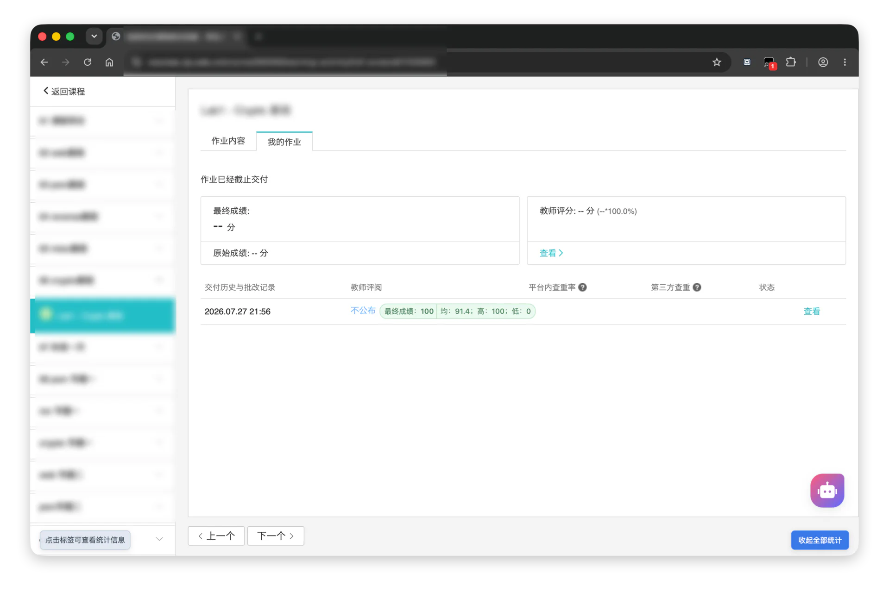

# 如何查看部分学在浙大和 Pintia 上未公布的评分

> 鸽了两个月后我终于把它补上了。
>
> 查看**当前已登录账号**在页面请求中收到的数据。不绕过登录或权限控制。

!!! warning
    成绩是否发布请始终以实际情况为准。

## 学在浙大

学在浙大的课程页面有时不会把所有成绩直接展示在界面上，但浏览器已经为当前账号请求到了对应的活动数据。

### 通过 ZJUSCORE 插件查看

这是由本人([bfyes](https://github.com/bfyes))开发的一个学在浙大成绩油猴小脚本，可以拿来玩玩，免去每次打开控制台和对照活动 ID 的麻烦；查询结果会直接融合在课程网页中。

**更新至 v1.0.2：新增统计数据，可以点击标签展开。**

以下链接可考虑使用代理：

- [安装链接（Greasy Fork）](https://greasyfork.org/zh-CN/scripts/595022-zjuscore)：点击即可安装。
- [发布链接（GitHub Release）](https://github.com/bfyes/ZJUSCORE/releases/tag/release)：欢迎提 Issue 和 PR；如果有帮助也欢迎点个 Star。

也可以查看 CC98 原帖：

- [CC98 原帖](https://www.cc98.org/topic/6615541)

查询结果融合在网页里：







### 通过开发者工具查看

1. 登录 [学在浙大](https://courses.zju.edu.cn/)，进入对应课程页面。
2. 按 <kbd>F12</kbd>（或右键“检查”）打开开发者工具，进入“网络 / Network”面板后**刷新**课程页面。
3. 待请求列表加载后，找到 `activity-reads-for-user`。
4. 打开该请求的“预览 / Preview”或“响应 / Response”，搜索 `"score"`；若活动记录中有 `data.score`，即可查看该活动返回的分数。


截图中的请求地址形如：

```text
https://courses.zju.edu.cn/api/course/<课程 ID>/activity-reads-for-user
```

其中 `<课程 ID>` 已经包含在当前课程页面地址中。响应里的 `activity_id` 用于对应具体活动；若要进一步核对作业或考试名称，可以查看下列同一课程、同一登录会话下的接口：

```text
https://courses.zju.edu.cn/api/course/<课程 ID>/homework-scores?fields=id,title
https://courses.zju.edu.cn/api/courses/<课程 ID>/exams
```

!!! tip
    这个方法只需浏览器自带的开发者工具，不必额外安装扩展或脚本。接口字段和页面实现可能随平台更新而变化；若没有返回 `score` 字段，通常表示该数据尚未随当前账号的页面请求返回。

## Pintia / PTA

PTA 的考试概览页同样会为当前登录账号请求考试数据。

### 相关脚本

[MadelineCarter](https://greasyfork.org/users/1373760-madelinecarter) 在 Greasy Fork 发布的“解锁PTA成绩查看限制”用户脚本，会监听考试概览页的 `exams` 响应，并把其中的 `exam.score` 短暂显示在页面中。

- [Greasy Fork 页面](https://greasyfork.org/zh-CN/scripts/522690-%E8%A7%A3%E9%94%81pta%E6%88%90%E7%BB%A9%E6%9F%A5%E7%9C%8B%E9%99%90%E5%88%B6)

使用脚本前，请自行阅读代码、确认脚本匹配的网站范围，并仅在自己的、已获授权的账号中使用。

### 通过开发者工具查看

不想安装用户脚本时，直接在开发者工具中查看对应响应即可。

1. 登录 [PTA](https://pintia.cn/)，打开目标考试的概览页。
2. 按 <kbd>F12</kbd>（或右键“检查”）打开开发者工具，进入“网络 / Network”面板后**刷新**页面。
3. 待请求列表加载后，找到名称或地址包含 `exams` 的请求。
4. 打开“预览 / Preview”或“响应 / Response”，搜索 `"score"`；通常可在 `exam.score` 中看到当前响应返回的成绩。


