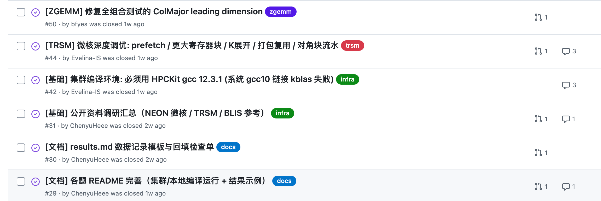
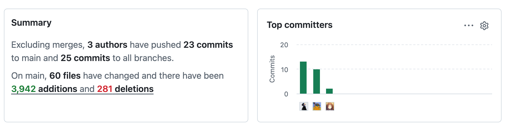
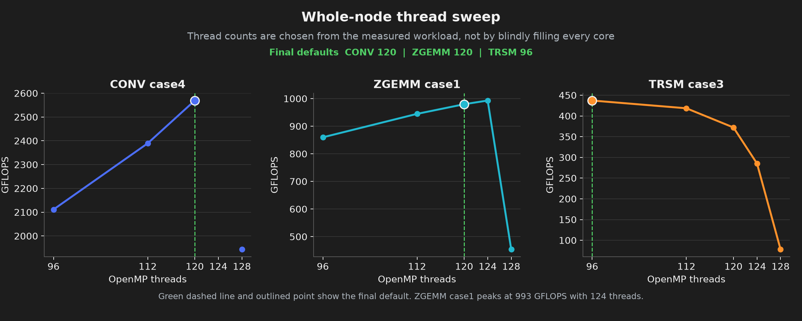
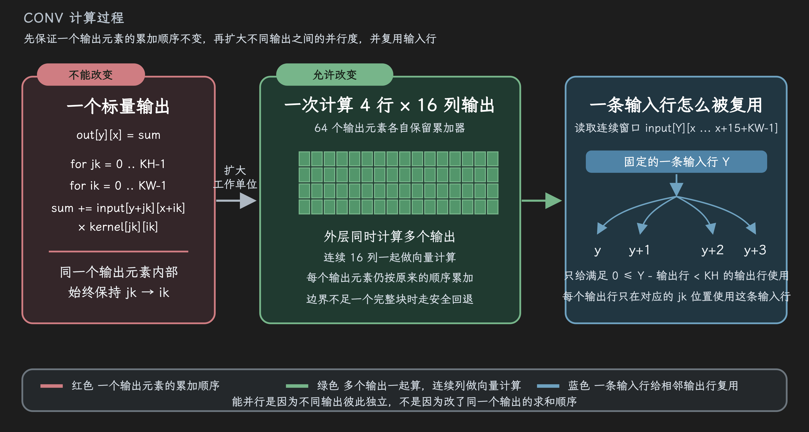
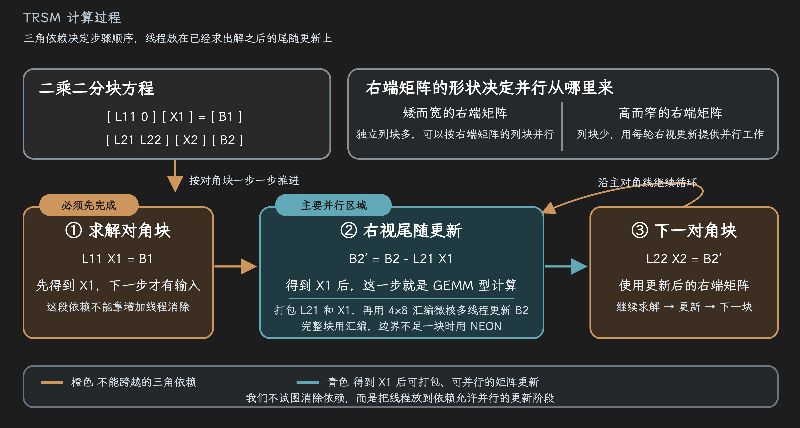
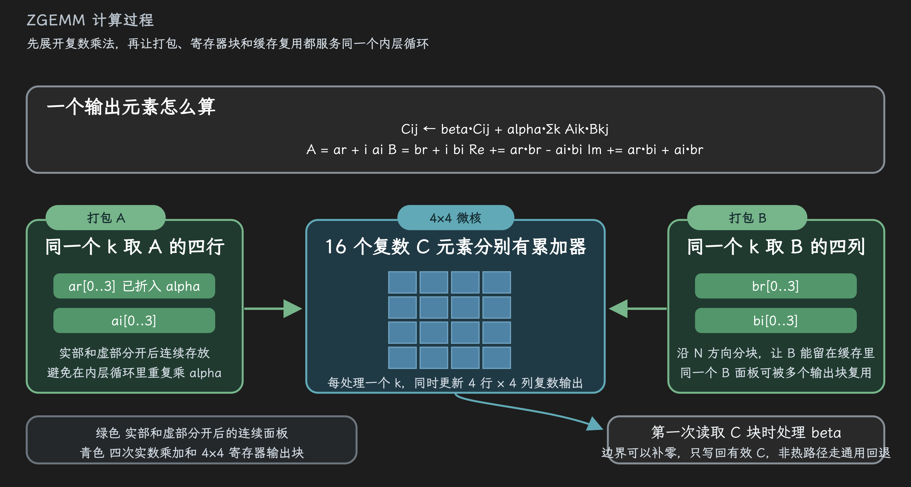
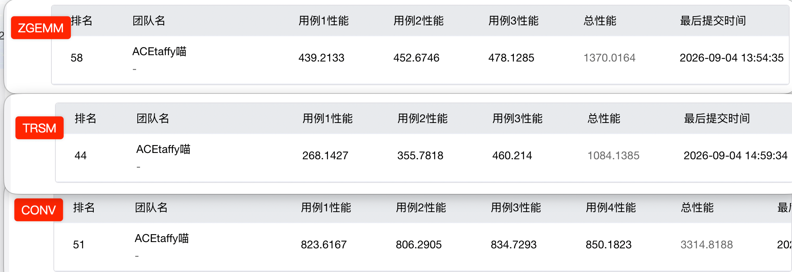

<div class="cover-content">
  <h5 class="cover-title">鲲鹏 HPC 挑战赛 S2<br>优化答辩</h5>
  <strong class="cover-team">参赛队伍 · ACEtaffy喵</strong>
  <div class="cover-track">CONV / TRSM / ZGEMM</div>
  <div class="cover-date">2026.9.6</div>
  <div class="cover-members">
    
    <span>ChenyuHeee · CONV、整合与验收（组长）</span>
    
    <span>Bill Feng · ZGEMM</span>
    
    <span>Evelina · TRSM</span>
  </div>
</div>

<!-- s -->

<div class="middle center"><div style="width:100%"><h1>Part ε · 背景 & 环境</h1></div></div>

<!-- v -->

| 缩写 | 英文全称 | 中文含义 | 要完成的计算 | 本题的优化重点 |
| :-- | :-- | :-- | :-- | :-- |
| **CONV** | Convolution | 二维卷积 | 用卷积核扫描输入，得到输出特征图 | 保持 FP32 累加顺序，同时计算更多输出 |
| **TRSM** | Triangular Solve | 三角方程求解 | 求解 `L × X = B`，其中 `L` 是下三角矩阵 | 按依赖顺序求解，把更新阶段并行化 |
| **ZGEMM** | Double-precision complex General Matrix-Matrix Multiplication | 双精度复数通用矩阵乘法 | 计算 `C = alpha × A × B + beta × C` | 组织复数数据、寄存器块和缓存访问 |


<!-- v -->

# GitHub 仓库管理

<center></center>

- 用 Issue 记录假设和待验证的问题
- 在分支里写代码，并在集群完成对照实验
- PR

```text
提出假设 → 修改代码 → 误差检查 → 对比测试后决定保留或回退
```

<!-- v -->

# 贡献 协作

<center></center>

<!-- v -->

# 常用命令

```bash
# 本地：编译并检查三题是否 PASS
./scripts/build_local.sh

# 鲲鹏集群：加载 TRSM 需要的 KML 环境，跑全部官方用例
source ./env_kunpeng.sh && bash run_all.sh
```

- 本地只核对正确性；性能数据以鲲鹏集群复测结果为准
- `run_all.sh` 会编译并运行 10 个官方用例，结果写入 `results.md`

<!-- v -->

# 环境/线程

<center></center>

- 鲲鹏 920，共 128 个物理核
- NEON 是 ARM 架构提供的 SIMD 向量指令，一条指令可以同时处理多个数据


<!-- s -->

<div class="middle center"><div style="width:100%"><h1>Part 1 · CONV</h1></div></div>

<!-- v -->

# CONV 的约束

- 卷积计算使用单精度浮点数（FP32）
- 每个输出点都按参考代码的顺序计算：先遍历卷积核的行，再遍历列
- 一次多算几个输出点；连续数据用向量指令处理，并尽量复用已经读入的输入
- 边缘凑不满一个完整块时，改走收尾代码，保证所有尺寸的结果都正确

<!-- v -->

# CONV 的计算与优化过程

<center></center>

<!-- s -->

<div class="middle center"><div style="width:100%"><h1>Part 2 · TRSM</h1></div></div>

<!-- v -->

# TRSM 的依赖

- 下三角方程要沿着对角线逐块求解：当前块算完，下一块才能继续
- 右端矩阵矮而宽时，独立的列块很多，可以把不同列块分给不同线程
- 右端矩阵高而窄时，列块不够分；先解出当前块，再并行更新后面的区域
- 大小完整的块使用 AArch64 汇编核；边缘剩下的小块用 NEON 代码处理

<!-- v -->

# TRSM 的分块求解过程

<center></center>

<!-- s -->

<div class="middle center"><div style="width:100%"><h1>Part 3 · ZGEMM</h1></div></div>

<!-- v -->

# ZGEMM 的优化范围

- 我们重点优化行主序、A 和 B 都不转置的常用调用
- 一个复数乘法拆成实部和虚部的实数运算，方便用向量指令计算
- 打包 A 时顺手乘上 `alpha`；第一次读取 C 块时再处理 `beta`，减少内层循环的重复工作
- 其他存储方式或转置组合继续用通用代码处理，保证各种调用都能正确运行

<!-- v -->

# ZGEMM

<center></center>

<!-- s -->

<div class="middle center"><div style="width:100%"><h1>Part 4 · 总结</h1></div></div>

<!-- v -->

# 总结

- CONV：不改每个输出点的计算顺序。把相邻的一小块输出放在一起算
- TRSM：该按顺序算的地方按顺序算；能同时更新的地方就交给多个线程
- ZGEMM：提前把数据整理好，让 CPU 少花时间找数据，多花时间做计算

<center></center>


<!-- s -->

<div class="middle center"><div style="width:100%"><h1>感谢聆听。</h1></div></div>
